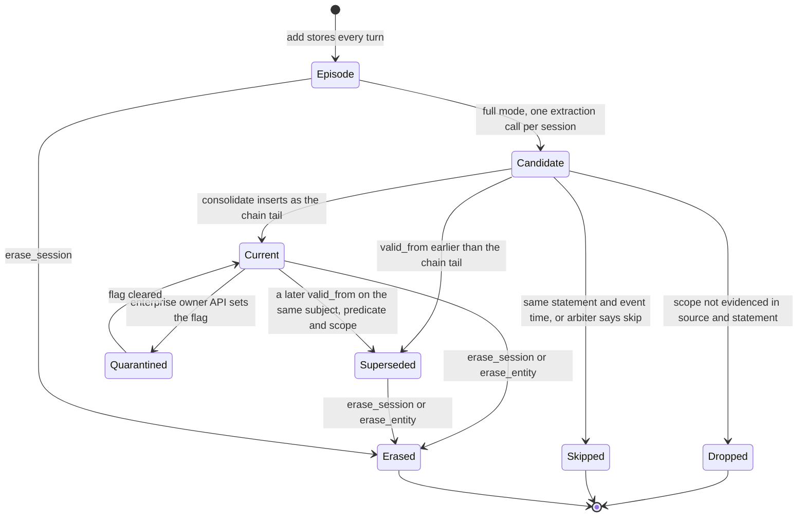

## 1. Executive Summary

Smriti is a Python memory library for a single agent's conversations, held in
one SQLite file. Every turn is kept as an episode. In full mode an LLM
extracts facts once per session, and consolidation chains them by
supersession on a world-time interval instead of overwriting. A separate
`smriti-enterprise` package in the same repository adds a knowledge-time
axis, exact lineage, hash-chained receipts, retention, legal holds and a
quarantine flag, without editing the core.

The temporal model is the notable part, and it is done carefully.
Consolidation re-sorts the whole chain for a subject-predicate-scope key by
`valid_from` on each write, so a fact learned late about an earlier date
lands in the past rather than replacing the present. The enterprise
revision table then makes *"on K, what did we believe was true at W"* a
query. Scope assignment by the model is checked against the source turns,
and a correction that silently drops a rejected scope is refused.

The weak part is where the controls stop. Scope is printed into context and
never filters a read. Trust state exists only in the enterprise package and
only on `search(strict=True)`; `context()`, which builds the prompt, and the
MCP server, which is how an agent reaches the store, never see it. The
published accuracy figures come from lite mode, which stores no facts.

Four marks: `trust_state` and `audit_log` on the enterprise layer,
`bitemporal` across both, and `negative_eval` on strict-filter and erasure
tests with positive controls. Section 9 names the three withheld.

## 2. Mental Model

Smriti holds two kinds of thing and treats them differently. An **episode**
is a turn as said, with its session and timestamp; it is never rewritten,
only erased. A **fact** is a model's reading of a session, stored as a
triple with a statement, an optional applicability `scope` such as
`project:Atlas`, and a world-validity window. Facts are claims, and the
system says so in the injected text by labelling each one `CURRENT` or
`SUPERSEDED on` a date (`smriti/retrieval.py:409-415`).

A fact becomes a belief by surviving three gates in full mode. Its scope
must be evidenced lexically in both the source turns and its own statement
or it is dropped (`smriti/extraction.py:173-237`). An exact duplicate on the
same key and event time is skipped (`smriti/consolidation.py:131-134`). A
semantic near-duplicate on the same subject, scope and compatible predicate
goes to one arbitration call that may answer add, supersede or skip
(`smriti/consolidation.py:161-187`).

A fact stops being current only by supersession, keyed on
`(subject, predicate, scope)` for the predicates listed in `SINGLE_VALUED`
or prefixed `favorite` (`smriti/consolidation.py:31-37`). The predecessor
keeps its row; `invalid_at` takes the successor's `valid_from` and
`superseded_by` points forward. Nothing in core makes a fact less believed
than current: there is no confidence, no decay and no rejected state.

The enterprise layer adds an orthogonal flag. `quarantined` is a review state
an owner sets after the fact, and `origin` is a provenance label fixed at
write (`owner`, `agent`, `tool`, `untrusted`). Neither changes whether a
fact is current; both change whether `search(strict=True)` returns it.

Memory is application-driven. The host calls `add`, `search` and `context`,
or the agent does through the MCP tools. Episodes are ground truth for what
was said; facts are inferred state with a history.

## 3. Architecture

The core is a library with no server. `Smriti` (`smriti/memory.py`) owns a
`Store` (`smriti/store.py`) wrapping one `sqlite3` connection in WAL mode
with a 5-second busy timeout. Retrieval runs in process: FTS5 for lexical
search, a numpy matrix of L2-normalised vectors cached per process and
invalidated through `PRAGMA data_version` when another connection commits
(`smriti/store.py:477-511`), and joins over an `entities` table for the
graph-lite channel.

Two read engines share the store. `smriti/recall.py` is the default evidence
engine over episodes; `smriti/retrieval.py` is the 0.3.x reciprocal-rank
fusion engine, still used for the fact block and for the non-evidence
profiles. `smriti/profiles.py` names six policies and a regex router.

Model calls go through `smriti/llm.py` and `smriti/embedder.py`, both on
stdlib `urllib` against Ollama or any OpenAI-compatible endpoint. The
default embedder is `HashEmbedder`, a character n-gram hash, so a store with
no configuration has a weak semantic channel. Optional rerankers in
`smriti/decision.py` call a hosted or local judge; the hosted one sends each
candidate memory to a third-party API.

`enterprise/smriti_enterprise/` subclasses `Smriti` and `Store`. It runs a
`PRAGMA user_version` migration on open that adds columns and three tables
to the same file, and writes receipts through an `AuditSink` to a different
file. Packs are SQLite backups with a signed manifest, mounted read-only and
fused with the personal store by `retrieve_multi`.

### Deployment and ergonomics

Nothing has to run. Lite mode needs only numpy and makes no network call;
full mode needs an LLM endpoint and, for a useful semantic channel, an
embedding model, either over HTTP or in process through the optional ONNX
extra. There is no PyPI release at the pin; the README installs from a
clone. The store is one SQLite file a person can open, query and back up,
and `smriti-doctor` runs read-only integrity checks against it. The database
records its embedder identity and refuses to reopen with a different model,
endpoint or dimension (`smriti/store.py:171-209`), which prevents silently
mixed vector spaces.

## 4. Essential Implementation Paths

**Capture.** `Smriti.add` (`smriti/memory.py:178-385`) hashes messages,
timestamp and session id, embeds every turn and runs extraction before the
transaction, then takes `BEGIN IMMEDIATE`, claims the hash in `ingest_log`,
writes episodes and consolidates each fact. A crash before `COMMIT` rolls
back the claim with the data (`smriti/store.py:726-760`). Opt-in
`redact_secrets` scrubs credential shapes first (`smriti/memory.py:29-42`).

**Extraction.** One prompt per session, `EXTRACT_SYSTEM`
(`smriti/extraction.py:67-126`), returns a JSON array. `parse_facts` sets
`valid_from` to the stated `event_date` or the session timestamp
(`smriti/extraction.py:409`). Scope validation and its single correction
call sit in `add` (`smriti/memory.py:215-313`), with
`reject_scope_erasure_retry` refusing a retry that turns a rejected scoped
fact global (`smriti/extraction.py:239-259`).

**Consolidation.** `consolidate` (`smriti/consolidation.py:119-189`). For a
single-valued key it loads the full history, inserts the new fact, sorts by
`valid_from` and relinks every adjacent pair with `invalidate_fact`, then
marks the tail current. Otherwise the tier-1 collision check, an exact
duplicate guard, and the tier-2 arbitration over the three nearest fact
vectors above cosine 0.72.

**Retrieval.** `Smriti._evidence` (`smriti/memory.py:463-516`) runs
`retrieve` restricted to fact channels and `rank_episodes`
(`smriti/recall.py:258-425`) for episodes, then an optional reranker blend
over the head. `retrieve` (`smriti/retrieval.py:216-361`) builds each
channel's ranking, fuses by RRF, materialises facts and episodes, and
finally sorts superseded facts below everything else.

**Context assembly.** `pack_evidence` (`smriti/recall.py:490-535` for the
facts block) spends at most 35% of the budget on facts ordered
current-first, then packs whole turns grouped by dated session with relative
dates resolved inline.

**Correction and deletion.** Supersession as above. `erase_session` and
`erase_entity` (`smriti/store.py:762-832`) delete rows, FTS entries, entity
links and embeddings; core also deletes any observation whose subject or
digest predicate overlaps, over-deleting deliberately. The enterprise
`lifecycle.erase_session` (`enterprise/smriti_enterprise/lifecycle.py:88-137`)
refuses under an active hold and follows `derivations` edges instead.

**Integration.** `smriti/mcp_server.py` — stdio JSON-RPC, six tools, a SQLite
authoriser that denies `ATTACH` and `DETACH`, and a database path fixed at
launch.

**Tests.** `tests/` (247 functions) and `enterprise/tests/` (59), run by
`.github/workflows/tests.yml` against an installed wheel and by
`enterprise.yml` for both suites.

## 5. Memory Data Model

The core schema is six tables and three FTS5 indexes (`smriti/store.py:36-79`).
`facts` carries `statement`, `subject`, `predicate`, `object`, `kind`,
`event_date`, `ingested_at`, `valid_from`, `invalid_at`, `superseded_by`,
`episode_id`, `session_id`, `scope` and `emb`. Subject and predicate are
lower-cased on write. `episodes` is `session_id`, `role`, `content`, `ts`,
`emb`. `entities` is a name-to-fact link table; `entity_aliases` maps an
alias to a canonical name and is flattened on write.

Provenance in core is thin. A fact links to the first episode of its session
only (`smriti/memory.py:345`), and observations link to nothing. The
enterprise `derivations` table records every episode of the session as a
parent and every source fact of a digest
(`enterprise/smriti_enterprise/memory.py:80-119`, `:168-184`).

Time has two axes in core: `valid_from`/`invalid_at` for when the fact held
in the world, and `ingested_at` for when it was written. The enterprise
migration adds `recorded_at`/`withdrawn_at` for when the store believed it,
`retain_until`/`hold_id` for storage lifecycle, and `fact_validity_history`
with one row per change to a fact's interval
(`enterprise/smriti_enterprise/migrations.py:29-70`). For rows migrated from
a core store, `recorded_at` is backfilled from `ingested_at`, which the
module docstring calls approximate.
Timestamps are stored as given. Consolidation parses offsets before
ordering (`smriti/consolidation.py:109-116`), while `facts_asof` compares
the strings in SQL, so a `+05:30` timestamp and a `Z` one can order
differently on the two paths.

Scope is a free string, normalised by stripping. It is part of the
consolidation key and the digest grouping, and it is embedded into the
vector input without being written into the statement
(`smriti/memory.py:387-398`). The enterprise `origin` and `quarantined`
columns live on the fact and episode rows.

## 6. Retrieval Mechanics

The default engine ranks episodes, not facts. `rank_episodes` takes up to 200
candidates from each of BM25 over a stopword-stripped, light-stemmed prefix
query and an exact cosine scan of every episode vector, normalises each per
query, and combines them convexly at 0.5 each. A turn inherits a quarter of
its session's best score. Assistant turns are multiplied by 0.2 unless the
question addresses the assistant; turns by participants the question does
not name, by 0.75. A period named in the question adds 0.25 to turns dated
in it or mentioning it, and "X or Y" questions are split and merged.

The fact block comes from the older fusion engine. `retrieve` ranks facts by
BM25, vector similarity, query entities matched against the entity
vocabulary and aliases, a second entity hop, and, for aggregation queries,
an expansion-key index kept separate so synonyms cannot dilute precision
queries (`smriti/store.py:250-261`). Channels fuse by weighted RRF with
`k=60`.

Validity is a sort, not a filter. Superseded facts are ordered after current
facts and episodes (`smriti/retrieval.py:353-360`) and labelled in the
packed text; the `timeline` profile turns that off and orders by
`valid_from`. Observation digests are excluded from the precision and
evidence paths because, by the code's own comment, they *"launder stale
values on current-state questions"* (`smriti/memory.py:593-594`).

Scope does not participate in ranking or filtering. A query about one project
can return a fact scoped to another; the reader sees `scope=` on the line
and has to notice.

Retrieval is deterministic and makes no model call unless a reranker is
configured or `context_iterative` asks the LLM for a follow-up query.

## 7. Write Mechanics

Writes happen on the hot path of `add`. Lite mode embeds turns and writes
them; full mode adds one extraction call, a second call only when a scope
fails validation, and an arbitration call per fact that has a semantic
near-match. The arbitration runs inside the `BEGIN IMMEDIATE` transaction,
so a slow model holds the database's write lock for its duration; the code
says so (`smriti/memory.py:326-327`).

Deduplication is two-layered: whole-session replay by hash, and per fact by
exact statement on the key. A different wording of the same fact on a
multi-valued predicate is stored twice unless its vector clears 0.72 and the
arbiter says skip.

Agent-generated facts enter through `add_fact`, which consolidates exactly
like an extracted fact. The MCP `add_fact` defaults `subject` to `user`
(`smriti/mcp_server.py:220-230`), so a call with `predicate: lives_in`
supersedes the user's current city with no extraction, no scope validation
and, in core, no origin recorded. Scope validation runs only on extracted
facts.

Observation refresh (`smriti/memory.py:686-761`) is an explicit, LLM-backed
pass per entity and per subject-predicate group, scoped so a digest never
merges two scopes, and each new digest supersedes the previous one.

### Operational cost

Ingest is synchronous: `add` returns after extraction and consolidation, so
a new fact is retrievable as soon as the call returns. Lite mode costs one
embedding batch per session. Nothing rewrites the store in the background;
`refresh_observations` re-reads every entity's facts each time it is
called, a cost that scales with the store. The read path embeds the query
once and scans every vector, which the README measures at 32.2 ms p50 for
100,000 synthetic turns; this report did not re-run it. Context is bounded
by `char_budget`, 9,000 characters by default, and is assembled per query,
so where it lands relative to a provider's prompt cache is the host's
decision.

## 8. Agent Integration

The MCP server is the agent surface: `remember` ingests messages, `recall`
returns packed context, `search` returns structured hits with validity and
scope, `facts_about` lists an entity's full history, `add_fact` writes one
fact, and `stats` counts. It runs lite mode unless `SMRITI_LLM_MODEL` is
set. There is no hook and no automatic injection; the agent must call
`recall`.

The deliberate exclusions are the strongest integration decision. Erasure and
alias registration are owner-only Python methods, under a comment that
*"untrusted conversation content can never talk an agent into erasing or
rewiring its own memory"* (`smriti/memory.py:763-766`), and the server
registers neither. The reverse also holds: quarantine, strict search, holds
and receipts are not reachable from MCP at all, because the server builds a
core `Smriti` (`smriti/mcp_server.py:324-336`).

The library API is small enough to wrap for another agent in an afternoon;
the profiles and channel masks are plain data.

## 9. Reliability, Safety, and Trust

**Prompt-injected memory.** Core has no defence beyond opt-in secret
redaction. Every turn passed to `remember` is stored and extracted, and any
MCP client can supersede a single-valued fact. The enterprise `origin` label
is only as true as the host that sets it, and `strict_filter` is the only
reader of it.

**Trust state is opt-in on one path.** `search(strict=True)` drops quarantined
facts and untrusted-origin facts and turns (`enterprise/smriti_enterprise/policy.py:94-113`).
`context()` has no strict parameter, `ASSURANCE.md` says so, and the
`regulated` profile's docstring claims *"strict retrieval default"*
(`enterprise/smriti_enterprise/policy.py:8`) while `search` defaults
`strict=False` for every profile (`enterprise/smriti_enterprise/memory.py:198-199`).
`facts_asof` and `retrieve_multi` ignore the flag too.

**Concurrency.** Single writer by `BEGIN IMMEDIATE`, with careful handling
of the races on a new database: the busy timeout is set before the WAL
switch, the legacy `ALTER TABLE` accepts only the duplicate-column race, and
the embedder identity claim is `INSERT OR IGNORE` followed by an
authoritative read (`smriti/store.py:117-209`).

**Deletion.** Erasure is logical removal from the active file; the enterprise
docs list WAL pages, snapshots, packs, backups and receipt digests as
residuals, which is the honest boundary.

**Audit.** Receipts are hash-chained and optionally HMAC-checkpointed, and
the chain verifier detects a modified or removed row
(`enterprise/smriti_enterprise/receipts.py:79-110`). They default to
`NullSink`, which discards them, and only `regulated` refuses that
(`enterprise/smriti_enterprise/memory.py:53-59`).

**Withheld marks.**

- **`tombstone` — withheld.** Nothing records a rejected value. Erasure
  deletes the rows and clears the ingest hash, so re-ingesting the same
  session re-extracts the same facts. `reject_scope_erasure_retry` is keyed
  on a rejected `(subject, predicate, object)`, which is the right shape,
  but it lives for one `add` call and is never stored.
- **`scope_enforced` — withheld.** `facts.scope` is a key on the row, and the
  only queries with a scope predicate are the consolidation and digest
  lookups (`smriti/store.py:313-328`, `enterprise/smriti_enterprise/memory.py:172-176`).
  No read path takes a scope argument. Isolation between users or tenants is
  one file per scope, which the enterprise README calls containment.
- **`human_review` — withheld.** `quarantine()` is an owner action after a
  fact is already active, which the rubric treats as editing after the
  write. No fact waits in a state for a person; there is no pending state at
  all.

## 10. Tests, Evals, and Benchmarks

The suites are offline and use `MockLLM` and `HashEmbedder`. Core tests cover
supersession and history, the late-arriving-fact chain, idempotent and
crash-safe ingest, erasure cascades, alias handling, embedder identity,
export round trips, scope validation with its retry statuses, MCP input
validation and the evidence engine's priors. Enterprise tests cover the
as-of axes, lineage, receipts and chain tampering, holds and sweeps, egress
profiles, strict filtering, packs and federation. I did not run either
suite; CI configuration exists for both.

The negative cases are real. `test_strict_search_drops_untrusted_raw_turns`
asserts the poisoned IBAN turn is returned without `strict`, then absent from
a non-empty strict result that still holds the owner's turn
(`enterprise/tests/test_enterprise.py:407-418`). One assertion cannot fail:
`test_no_module_claims_compliance_or_physical_erasure` ends in
`... not in (...) or True` (`enterprise/tests/test_enterprise.py:627`).

The benchmark claims rest on committed raw rows. I recomputed the README's
LME-X answer accuracy from `audit/2026-09-25/results/qa-lmex-run1.json` and
`qa-lmex-run2-paired.json`: across 240 reads, 169 correct for the evidence
engine (70.4%) and 148 for Mem0 OSS (61.7%), as published. The same
files show the shipped default at 65.0% and 75.8% on the two reads of the
same 120 questions, a spread larger than the published margin over Mem0.
The first-cut engine pooled 70.8%, above the shipped default.

Every lab system runs `Smriti(..., mode="lite")` (`bench/lab/systems.py:133`),
so the headline figures measure episodic retrieval and packing. Extraction,
supersession and the bi-temporal model are untested by any committed
benchmark result; the README's matched-QA table on the 0.3.x path is the
only full-mode comparison, at 50 questions. No paper describes the system;
the README's citation block is a `@software` entry and `CITATION.cff` has
`type: software`.

Missing tests I would want: a cross-scope read asserting a `project:A` fact
stays out of a `project:B` query, which would fail today; a strict filter
over `context()`; and an MCP `add_fact` that tries to supersede an
owner-stated fact.

## 11. For Your Own Build

### Steal

- **Re-sort the validity chain on every write.** Load the whole history for
  the key, insert, sort by event time and relink every pair. A late message
  about an earlier date then becomes history instead of the present, and the
  code is about twenty lines.
- **A revision table under the mutable row.** Keep current interval columns
  for fast reads and append each change with the time the store learned it;
  "what did we believe on K about W" is then a query, not a reconstruction.
- **Check a model-assigned scope against the source text**, give the model
  one correction, and refuse a correction that answers by dropping the
  scope.
- **Pin the embedder identity in the database** and refuse to reopen with
  another model or dimension.
- **Keep destructive verbs off the agent's tool surface** and say why next
  to them.

### Avoid

- **A scope key that only labels.** Printing `scope=` into context hands the
  isolation decision to the reader model.
- **A trust filter on the structured search but not on the prompt
  builder.** The path that assembles context is the one that reaches the
  model.
- **An audit sink that defaults to discarding** in every profile but the
  strictest.
- **A benchmark that cannot see the feature it promotes.** Lite-mode numbers
  say nothing about supersession.

### Fit

Smriti suits one user or one agent who wants local, inspectable memory with
real history and no services, and is willing to call `add` and `context`
explicitly. The enterprise package suits an operator who needs as-of
reconstruction, lineage and tamper-evident receipts over that same file and
will run its own host boundary. Walk away if several users, projects or
tenants share a store, or if untrusted content reaches it through MCP:
scope and trust are not enforced where the model reads.

## 12. Open Questions

- Whether the full-mode supersession chain improves answers on
  knowledge-update questions against lite mode; no committed result
  compares them on the current engine.
- How the 0.72 arbitration threshold behaves with `HashEmbedder`, the MCP
  server's default, whose similarities are not on a sentence-embedding
  scale.
- Whether the `regulated` strict default is planned or the docstring is
  stale.
- How the hosted judge's operator handles the memories it receives.

## Appendix: File Index

- **Storage and schema:** `smriti/store.py`, `smriti/types.py`,
  `enterprise/smriti_enterprise/migrations.py`,
  `enterprise/smriti_enterprise/store.py`.
- **Write path:** `smriti/memory.py` (`add`, `add_fact`,
  `_write_observation`), `smriti/extraction.py`, `smriti/consolidation.py`.
- **Retrieval:** `smriti/recall.py`, `smriti/retrieval.py`,
  `smriti/profiles.py`, `smriti/temporal.py`,
  `enterprise/smriti_enterprise/temporal.py`,
  `enterprise/smriti_enterprise/federation.py`.
- **Context assembly:** `pack_evidence` in `smriti/recall.py`,
  `pack_context` in `smriti/retrieval.py`.
- **Trust, audit, lifecycle:** `enterprise/smriti_enterprise/policy.py`,
  `receipts.py`, `sinks.py`, `lineage.py`, `lifecycle.py`, `packs.py`.
- **MCP:** `smriti/mcp_server.py`.
- **Tests and benchmarks:** `tests/test_smriti.py`,
  `tests/test_hardening.py`, `tests/test_scope_validation.py`,
  `enterprise/tests/test_enterprise.py`, `bench/lab/`,
  `audit/2026-09-25/`.

### Recorded searches

Checked against the checkout at the pinned revision, from the tree root.

- `rg -n -i 'tombstone|blocklist|denylist|rejected_value|never_again' --type py .` — no match.
- `rg -n "scope_column \+ \"=\?|scope=\?|scope = \?" --type py smriti enterprise/smriti_enterprise` — `store.py:316`, `:325` and enterprise `memory.py:174`; `rg -n 'similar_valid_facts|facts_for_key' smriti enterprise/smriti_enterprise` shows their callers are consolidation and observation refresh only.
- `rg -n -i 'approve|pending|review' --type py smriti enterprise/smriti_enterprise` — only the `policy.py` docstring and the vector-cache `_pending` queue.
- `rg -n 'quarantin|erase|alias' smriti/mcp_server.py` — one match, the word "aliases" in a channel description at line 80.
- `rg -n 'smriti_enterprise|EnterpriseSmriti' smriti/` — no match; the core and the MCP server never construct the enterprise class.
- `rg -n 'strict' --type py .` outside `bench/` — the enterprise `search` parameter, `strict_filter`, and the `policy.py:8` docstring.
- `rg -n 'ingested_at' smriti/ enterprise/smriti_enterprise` — written in `store.py`, read only by the enterprise migration backfill.
- `rg -n 'def set_retention' -A2 enterprise/smriti_enterprise/memory.py` — no `_emit` call.
- `grep -rliE 'arxiv|bibtex|@article|@misc|doi\.org' . --exclude-dir=.git --exclude-dir=node_modules` — `README.md` (an `@software` block), `smriti-landscape.html` and three `audit/` files citing other work; `CITATION.cff` is `type: software`.
- `rg -n 'Smriti\(|mode=' bench/lab/systems.py` — line 133, `mode="lite"`.
- A Python tally of `correct` by `system` over the `rows` of the two `qa-lmex` result files, giving the figures in section 10.

## History

**2026-10-03** — [`16c5571a981ddd21eca8d7366f624d8500178973`](https://github.com/vn-envy/Smriti/commit/16c5571a981ddd21eca8d7366f624d8500178973) — first reading, at the head of `main`, a commit dated 26 September 2026 (release 0.4.2). Four marks: `trust_state`, `bitemporal`, `audit_log`, `negative_eval`. Screened before reading: no auto-run surface, 1 build-time execution point (an npm `postinstall` in `launch-video/`), 4 dependency files inside the cooldown — every file in a depth-1 clone dates to the tip — and 3 unpinned surfaces; no agent-instruction files. Read with `rg` and `sed`, and two committed result files tallied with a standalone Python one-liner; nothing installed, built or run.
