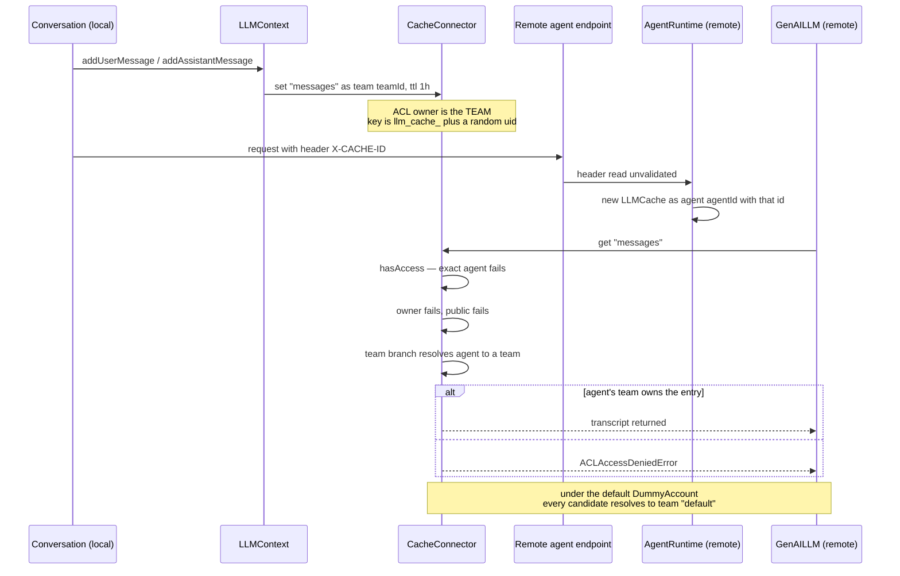

## 1. Executive Summary

SRE — the SmythOS Runtime Environment — is an MIT-licensed TypeScript monorepo
for building and running agents: `@smythos/sre` (about 45,700 lines across 235
files under `packages/core/src`), `@smythos/sdk`, and a CLI. Its organising idea
is the connector. Storage, cache, vector database, LLM provider, account, vault
and scheduler are each an abstract base class with swappable implementations,
and every method that touches a resource is wrapped by a single access-control
decorator. That is a good spine, and it is the reason this system is worth
reading even though its memory is thin.

It is thin. The subsystem is called `MemoryManager`, and what it contains is a
cache service, a runtime-context serialiser, and a conversation transcript.
There is no extraction, no consolidation, no ranking, no dedup, no notion of a
fact. `LLMMemoryConnector` — the abstract class whose name promises the missing
half — is exported from the package index at `packages/core/src/index.ts:150`
with zero implementations and zero call sites anywhere in the tree.

The system nonetheless clears the atlas's scope bar, and by a specific route:
`agent.chat(id, { persist: true })` writes the transcript through SmythFS to a
file that outlives the process and is reloaded by id on the next construction,
and `MemoryWriteKeyVal` accepts a TTL of up to 604,800 seconds. Something is
stored, retrieved later, scoped, and deletable. Everything else here is session
state with an expiry.

What is genuinely interesting is the boundary. When a conversation calls a
remote agent, `Conversation.helper.ts:787` puts the LLM context's cache id into
an `X-CACHE-ID` HTTP header; the remote `AgentRuntime` reads that header back
and reconstructs an `LLMCache` around it; the remote `GenAILLM` component then
pulls `systemPrompt` and `messages` out of it. The conversation is handed across
a process boundary by an identifier the client supplies. It is a capability URL,
and the design does not name it as one.

The implementation is strongest where the decorator is: `hasAccess` is real,
it reads the stored ACL, and a committed test proves a second agent is refused.
It is weakest one layer up, where the transcript mirror is written with a *team*
owner while the default account connector resolves every candidate to the same
team — so the only thing separating one conversation's transcript from another
inside a process is that its cache id is a random `uid()`.

## 2. Mental Model

A memory here is a **cache entry**: an opaque string under a composed key, with
a TTL and an ACL. That is the whole ontology. Nothing is a fact, a claim, a
profile or an entity, and there is no field anywhere in the subsystem that
distinguishes something the user said from something a tool returned.

There are three populations of entry, and they die differently.

**The transcript.** `LLMContext` holds `_messages`, an array where each element
carries a `__smyth_data__` block with `message_id`, `prev` and `next` — a
linked list, with a comment at `LLMContext.ts:78-81` recording that forked
conversations are not supported and always attach to the tail. Every `push`
does three things: appends to the array, calls `_llmContextStore.save(...)`
with the *entire* array, and writes the entire array to the cache mirror under
the key `messages`. It dies when the store's file is deleted, or when the
mirror's one-hour TTL runs out, whichever store you are reading from.

**Runtime context.** `RuntimeContext` serialises an agent's per-component
execution state to a single cache key derived from the debug id and job id. It
is written with a 1-hour TTL at initialisation and a 3-hour TTL on each sync,
and explicitly deleted when the session closes — or, in debug mode, dropped to a
5-minute TTL so a final state read can still happen. This is the one thing here
with a deliberate death.

**Component key-values.** The four `Memory*` workflow components write under
`${agentId}:${scopeKey}:${memoryName}:${key}`, where `scopeKey` is the session
id, the workflow request id, or the literal `ttl`. Default lifetime 3 hours;
maximum, when the author selects the `ttl` scope, seven days.

Nothing moves between states. A memory is written, read by exact key, and
expires. There is no candidate-to-verified transition, no supersession, no
rejection record, and no pass that revisits anything already written. Memory is
**author-controlled** in the workflow components — a human wires a write
component into a graph — and **automatic but non-selective** for the transcript,
which records every turn without deciding anything.

The mechanism worth drawing is not that lifecycle, which is short. It is what
happens to the transcript when the conversation leaves the process.

## 3. Architecture

SRE is a **library**, not a service. `SmythRuntime.Instance` boots a singleton,
`ConnectorService` resolves each subsystem to a named connector, and the whole
thing runs in the host process. There is no daemon, no queue and no separate
memory server.

The default configuration is at `packages/core/src/Core/SmythRuntime.class.ts:28-79`,
and for memory purposes it is three lines: `Cache: RAM`, `Storage: LocalStorage`,
`Account: DummyAccount`. That means the out-of-the-box memory store is a
`Map` in the current process with a `setInterval` sweeping expired entries once
a minute, and persisted chats are files under the resolved Smyth directory.

The cache service has four connectors sharing one interface: `RAMCache`
(a `Map`), `RedisCache`, `S3Cache` and `LocalStorageCache`. All four key under
a `smyth:cache` prefix, store metadata under a parallel `smyth:metadata` prefix,
and carry the same ten-method contract — `get`, `set`, `delete`, `exists`,
metadata pair, TTL pair, ACL pair. Swapping RAM for Redis is a config change and
nothing else, which is the connector pattern paying off.

Retrieval infrastructure exists in this repository and **does not serve memory**.
`VectorDB.service` ships Pinecone, Milvus and an in-process `RAMVec`, with
OpenAI and Google embedding backends. Every caller is under
`packages/core/src/Components/RAG/` — `DataSourceIndexer`, `DataSourceLookup`,
`DataSourceCleaner`, `DataSourceComponent` — plus the SDK's `VectorDBInstance`.
Nothing in `MemoryManager`, and nothing in `Conversation.helper.ts`, references
a vector connector at all. This is document RAG bound to an agent skill, sitting
in the same repository as the memory subsystem and wired to none of it.

### Deployment and ergonomics

Nothing has to be running. That is the honest headline and it is a real
strength: `npm i @smythos/sdk`, and memory works with an in-process `Map` and a
directory of files. Redis, S3, Pinecone and Milvus are opt-in connectors; none
is required to store anything.

An LLM API key is required to do anything useful with an agent, but not to
store a memory — the key-value components and the cache never call a model.

The store is human-readable and repairable when it is `LocalStorage`: persisted
chats are JSON files. When it is `RAMCache`, there is nothing to repair, because
a restart is a full erase — and a restart is the normal state for a library
embedded in a request-handling process.

The dependency surface is a pnpm workspace: one root `pnpm-lock.yaml`, unchanged
for 164 days at the pinned commit, resolving 80 declared ranges in
`packages/core` alone (`@anthropic-ai/sdk`, five AWS SDK clients, Pinecone,
Milvus, Redis and the rest). Nothing was inside the seven-day cooldown.

## 4. Essential Implementation Paths

**Capture — transcript.** `Conversation.helper.ts` constructs
`new LLMContext(this.llmInference, this.systemPrompt, this._llmContextStore)`
at line 1040. `LLMContext.addUserMessage` / `addAssistantMessage` /
`addToolMessage` each read the tail message, append their own `message_id` to
its `next` array, and call the private `push`, which appends and then rewrites
the whole array to both the store and the cache mirror
(`LLMContext.ts:67-75`).

**Capture — key-value.** `MemoryWriteKeyVal.process` resolves the cache
connector, computes `scopeKey` from the configured scope, writes a *scope
pointer* at `${agentId}:${memoryName}:${key}_scope` holding
`{ scope, value: scopeKey }`, then writes the value at
`${agentId}:${scopeKey}:${memoryName}:${key}`. `MemoryWriteObject` does the same
for an object, writing pointer and value concurrently under `Promise.all`.

**Retrieval — transcript.** There is no search. `LLMContext.getContextWindow`
deep-copies `_messages` and hands the whole array to
`LLMInference.getContextWindow` (`LLM.inference.ts:458`), which computes an
input budget from the model's declared token count, then walks the array from
**last to first**, counting tokens per message with `countTokens` and stopping
when the budget is exhausted. Recency is the entire ranking function.

**Retrieval — key-value.** `MemoryReadKeyVal.process` reads the scope pointer
first. If it is absent, the component returns `_warning: 'key not found'`. If
the pointer says `session` and its recorded value does not equal the current
`agent.sessionId` — or says `request` and does not equal the current
`workflowReqId` — it returns the same warning. Only then does it compose the
full key and read the value. Two independent scope checks therefore guard a
read: this one, and the ACL underneath it.

**The gate.** `SecureConnector.AccessControl`
(`packages/core/src/subsystems/Security/SecureConnector.class.ts:81-107`) is a
method decorator. It takes `acRequest` and `resourceId` as the first two
arguments, calls `getAccessTicket`, and throws `ACLAccessDeniedError` before the
wrapped body runs. `hasAccess` tries five things in order: exact access, the
same candidate at owner level, public access, the candidate's team, and the team
at owner level. Every `get`, `set`, `delete` and `exists` on every cache and
storage connector carries the decorator.

**The cross-process handoff.** `Conversation.helper.ts:787` sets
`reqConfig.headers['X-CACHE-ID'] = this._context?.llmCache?.id`.
`AgentRuntime.class.ts:185-186` reads
`agent.agentRequest.header('X-CACHE-ID') || ''` and constructs
`new LLMCache(AccessCandidate.agent(this.agent.id), xCacheId)`.
`GenAILLM.class.ts:471,484` reads `systemPrompt` and `messages` from it. The
header is used exactly as received; nothing validates it, and no record ties a
cache id to the conversation that owns it.

**Delete.** `MemoryDeleteKeyVal.process` re-runs the same scope check as the
read, then deletes the value key and the pointer key. `RuntimeContext.sync`
deletes the context key when `runtime.sessionClosed` is set. `LLMCache.clear()`
issues a delete for `this._cacheId` — but every write goes to
`${this._cacheId}:${key}`, and no connector supports prefix deletion, so the
call removes a key that is never written. It has no callers in
`packages/core/src` or `packages/sdk/src` at this commit.

**Background.** `RAMCache` runs one `setInterval` per instance, sweeping expired
entries every 60 seconds, `unref`'d so it does not hold the event loop open.
`RuntimeContext.enqueueSync` serialises syncs through a promise chain and then
sleeps for `(megabytes / 10) * 1000` milliseconds — a self-imposed cooldown that
grows with context size. There is no other background work anywhere in the
subsystem.

**Persistence.** `packages/sdk/src/LLM/Chat.class.ts:11-45` defines
`LocalChatStore`, the only `ILLMContextStore` implementation in the tree. `save`
JSON-stringifies the message array and writes it to a `StorageInstance` under
the conversation id; `load` reads it back and parses it. `StorageInstance`
composes a SmythFS URI of the form `smythfs://<candidateId>.<agent|team>/<name>`,
so the scope is in the path and the ACL check is on the path.

## 5. Memory Data Model

There are no tables, no schemas and no migrations. The persisted forms are
JSON blobs and cache strings.

A cache entry is `{ value, metadata, expiresAt }` (`RAMCache.class.ts:12-16`).
`metadata.acl` is the only structured field, and it is written by
`ACL.from(acl).addAccess(candidate.role, candidate.id, TAccessLevel.Owner)` on
every `set` — so the writer always retains ownership, which is the invariant the
`.cursor/rules` file states and the code keeps.

A transcript message is `{ role, content, __smyth_data__ }` where
`__smyth_data__` holds `message_id`, `prev`, `next` and whatever metadata the
caller passed. Tool turns instead carry `{ messageBlock, toolsData, __smyth_data__ }`.

**Scoping** has three levels and they are not the same mechanism.

1. **ACL role** — `agent`, `user`, `team`, or `public`, stamped into entry
   metadata and checked on read.
2. **Key composition** — the agent id and a session or request id, baked into
   the key string by the workflow components.
3. **Scope pointer** — a separate cache entry recording which of `session`,
   `request` or `ttl` a key was written under.

The third has a defect worth stating precisely. The value key includes
`scopeKey`; the pointer key does not. It is
`${agentId}:${memoryName}:${key}_scope` for every session. So two sessions of
the same agent writing the same memory name and key overwrite each other's
pointer, and the losing session's next read finds a pointer whose recorded
session id is not its own and returns `key not found` — while its value sits
intact under a key nothing will now compose. It fails closed, which is the right
direction, but it loses data silently and the value keeps occupying the store
until its TTL runs out.

**Temporal fields** are `expiresAt` and nothing else. There is no created-at, no
updated-at, no validity interval and no version. Correcting a memory means
overwriting the key.

**Provenance** is absent. Nothing records which component, model or turn wrote
an entry.

## 6. Retrieval Mechanics

Exact key lookup, and one token-budgeted truncation. That is the complete list.

There is no keyword search, no vector search, no hybrid fusion, no graph
traversal, no entity matching, no reranking and no LLM judging on any memory
path. The vector service described in section 3 is not reachable from here.

Context assembly is `LLMInference.getContextWindow`. It computes
`maxInputContext = min(requested, model's declared tokens)`, subtracts the
output reservation if the two together exceed the model, and iterates from the
newest message backwards, adding messages until the budget is spent. Messages
with `role === 'system'` are skipped in the loop; the system prompt is
prepended separately.

The failure modes follow directly from that. **Under-recall is structural**:
anything older than the token budget is invisible, permanently, with no summary
or index left behind — there is no compaction pass, so a long conversation
simply loses its head. **Over-recall cannot happen**, because nothing is fetched
that was not in this conversation. **Stale hits cannot happen** either, for the
same reason. This is a retrieval design that trades every recall failure for
zero precision failures, which is a defensible trade for a chat runtime and a
disqualifying one for anything that needs to remember across conversations.

Retrieval is **application-driven** throughout. No memory is injected because
the system decided it was relevant; the transcript is injected because it is the
transcript, and a key-value read happens because an agent author placed a read
component in a workflow graph.

## 7. Write Mechanics

Every write is **synchronous, on the hot path, and total**.

`LLMContext.push` is awaited inside every `addUserMessage`, `addAssistantMessage`
and `addToolMessage` call, and it rewrites the entire message array — to the
context store and to the cache mirror — on each one. A conversation of *n*
messages performs O(n) serialisation work on message *n+1*, and O(n²) over the
conversation. `LocalChatStore.save` stringifies the whole array and issues one
storage write per message.

There is no LLM in the write path. No extraction prompt exists in this
repository, and nothing decides whether a turn is worth keeping — a fact this
report states plainly because it is unusual in this corpus and it is the reason
the write path is cheap in tokens and expensive in bytes.

There is no deduplication and no consolidation. Writing the same key twice
overwrites; writing the same content under two keys stores it twice.

**Conflict handling does not exist.** `LocalChatStore.save` has no locking, no
compare-and-set and no version check. `Chat` holds a `_streamLock` promise chain
that serialises prompts *within one `Chat` object*, but two `Chat` objects
constructed on the same conversation id — two processes, or two requests — will
interleave whole-array writes and the last one wins, discarding the other's
turns. The transcript is the single most important thing this system persists
and it is protected by nothing.

Agent-generated content is treated identically to user content. A tool result
enters the transcript through `addToolMessage` with the same standing as a user
message, and nothing downstream can tell them apart for trust purposes — the
`role` field is a formatting concern, not an epistemic one.

### Operational cost

The agent **blocks** on memory writes, but only on serialisation and a local
file or `Map` write — there is no model call, so the block is milliseconds
rather than seconds until the transcript grows large.

The lag before a memory is retrievable is **zero**: the write is synchronous and
the next read sees it. This is one of the few systems in this atlas where that
sentence needs no qualification, and it is a direct consequence of having no
background pipeline.

No pass ever re-reads or rewrites the whole store. The token bill for memory is
therefore entirely on the read side: the full transcript, up to the configured
budget, on every turn.

On prompt-prefix caching, the design is accidentally well-behaved. The system
prompt is prepended and the transcript is appended in order, so a provider's
prefix cache survives a turn — until the token budget starts dropping messages
off the *front*, at which point every subsequent turn presents a different
prefix and the cache is invalidated on every request from then on. Nothing in
the code notes this.

## 8. Agent Integration

Two surfaces, aimed at different people.

**Workflow components**, for someone building an agent graph:
`MemoryWriteKeyVal`, `MemoryReadKeyVal`, `MemoryDeleteKeyVal` and
`MemoryWriteObject`. Each validates its config with a Joi schema, and each is
placed and wired by hand. The model has no agency here at all — it cannot decide
to remember something, because remembering is a node someone drew.

**The SDK**, for someone writing TypeScript: `agent.chat(id, { persist: true })`.
`Chat`'s constructor refuses persistence without an explicit candidate,
logging `Chat persistance disabled!` and continuing — a generated agent id is
declared ineligible at `Chat.class.ts:224-226`. Passing an object with `save`,
`load` and `getMessage` substitutes a custom store; the duck-type check is
literally those three key names (`isValidPersistanceObject`).

There is no MCP memory tool. The repository ships `@modelcontextprotocol/sdk`
in both `packages/core` and `packages/sdk`, but nothing exposes memory through
it.

Automatic context injection happens for the transcript and only the transcript.
Session lifecycle is handled by `RuntimeContext`, which deletes its key on
`sessionClosed`. There is no compaction boundary to handle, because there is no
compaction.

Adapting this to another agent framework means taking the connector plus the
decorator, which are genuinely portable, and leaving the rest, which is a
transcript array.

## 9. Reliability, Safety, and Trust

**The gate is real.** This deserves saying first and without hedging: access
control here is a decorator on the connector method, not a convention at the
call site. Every read of every cache and storage entry passes through
`hasAccess`, which resolves the ACL that was stored with the entry. It cannot be
forgotten by a caller, because callers do not implement it. Most systems in this
atlas that claim scoping implement it as a `WHERE` clause somebody has to
remember to write.

**What the gate is checking is the problem.** Three findings compound.

First, the conversation mirror is written team-scoped:
`LLMContext.ts:43` constructs `new LLMCache(AccessCandidate.team(this.llmInference.teamId))`.
So the ACL on the transcript names a team as owner, not an agent.

Second, the default account connector collapses teams. `DummyAccount.getCandidateTeam`
walks its configured data and, finding nothing, returns `DEFAULT_TEAM_ID` —
the string `'default'` — for *any* candidate
(`DummyAccount.class.ts:80-95`). `isTeamMember` returns `true` unconditionally
when the team is `'default'`. It is the default `Account` connector in
`SmythRuntime`'s config, and its own constructor warns that it "should not be
used in production if you have security concerns". The warning fires only when a
branch that cannot be reached is taken — the guard at line 58 re-tests the same
condition that was just satisfied at line 51 — so in practice it never prints.

Third, `Conversation.helper.ts:188` assigns the literal `'FAKE-AGENT-ID'` when
no agent id is available, with the comment *"We use a fake agent ID to avoid ACL
check errors"*, and `DummyAccount` seeds exactly that id into the default team.
Every anonymous conversation in a process therefore shares one identity.

Put together: under the shipped defaults, the ACL on a conversation transcript
grants access to a team that contains everyone. The only thing standing between
one conversation's transcript and another is that its cache id is a random
`uid()` — and that id is transmitted in an HTTP header the client can read and
replay. This is a capability-URL design without the properties a capability URL
needs: no expiry tied to the capability, no binding to the conversation, no
revocation.

To be precise about what is *not* broken: agent-scoped resources remain isolated
under the same defaults, and two committed tests demonstrate it by two different
mechanisms. `packages/sdk/tests/unit/004-Storage/02-agent-scope.test.ts` writes
as one agent and asserts the other agent's read is `null` — isolation by URI
namespace, since `StorageInstance` puts the candidate id in the host segment, so
the second agent addresses a path that does not exist. `SmythFS.test.ts` is the
harder case: the *same* URI read by a second agent, denied by the ACL. Both
agents in the first test share a `teamId` and are still isolated, because their
resources carry an agent owner rather than a team one. The exposure is specific
to entries written with a team owner, and the transcript mirror is the one that
matters.

**Prompt-injected false memories** have no defence and need none in the usual
sense, because nothing is extracted — a model cannot talk this system into
storing a fact, since storing is a graph node or an SDK call. The corresponding
weakness is that the transcript records everything a tool returned with no
marker, so injected content survives into every subsequent turn's context window
with the same standing as the user's own words.

**Race conditions**: the transcript, as described in section 7. Also
`RAMCache.set` writes the full entry — value included — under both the value key
and the metadata key, so every cached value is stored twice in memory.

**Data loss**: a restart erases everything not persisted through a chat store,
which under the default `RAMCache` is all runtime context and all component
key-values.

**Uncertainty cannot be represented.** There is no confidence score and no
status field. A memory either exists or does not.

**Backup, sync and replication**: none. Redis and S3 connectors inherit whatever
the backing service provides.

## 10. Tests, Evals, and Benchmarks

**No paper.** `CITATION.cff` names two authors at INK Content, Inc. and a
release date of 12 June 2025, and points at the GitHub organisation. There is no
arXiv reference, DOI or bibtex block anywhere in the README or the docs
directories. This is a product repository, not a research one, and it does not
claim otherwise.

108 test files across `packages/core/tests/unit` and
`packages/core/tests/integration`. **I did not run them.** The integration suites
for Redis, S3, Pinecone and Milvus require live services and credentials, and
the screen recorded six unpinned manifest surfaces; the read-only posture was
kept and nothing in the tree was executed.

What is covered, by reading: the four cache connectors each have a unit and an
integration file exercising set, get, TTL expiry, metadata and delete. Storage
has `LocalStorage`, `S3Storage` and `SmythFS`. `NKV` has one connector tested.
The vector connectors have three files each.

What is **not** covered is the memory layer proper. No test file exercises
`LLMContext`, `LLMCache`, `RuntimeContext`, or any of the four `Memory*`
components. That is the gap that leaves the `LLMCache.clear()` defect and the
unscoped scope pointer both alive.

Two tests are named for the thing the memory layer does, and neither can fail
when it stops working. `packages/sdk/tests/unit/005-LLM/03-llm-chat.test.ts`
opens with the comment *"Mock Conversation and storage to test persistence and
event wiring"* and then `vi.mock`s `Conversation` into a class whose
`streamPrompt` returns `'R:' + message`. Its first case is called *"creates a
chat and preserves context across prompts"* and asserts `r1 === 'R:Hello'` and
`r2 === 'R:World'` — values the mock computes from each prompt alone. The real
`LLMContext` never runs, and the assertions hold identically if every message is
discarded. `packages/core/tests/integration/003-LLM/general/conversation.test.ts`
runs against a live model in *"handles follow-up questions correctly"*, but
asserts only that the follow-up answer is truthy and contains a formatting
validator string, never that it referenced the first turn.

The negative retrieval assertions are two, both on storage.
`packages/sdk/tests/unit/004-Storage/02-agent-scope.test.ts` — *"isolates
resources per agent by default"* — writes as one agent and asserts the other's
read is `null`; it runs on default connectors with no credentials, which makes
it the cheap one to keep. `packages/core/tests/integration/005-Storage/SmythFS.test.ts`
— *"Does not allow Read to a different agent"* — writes as `agent-123456`, reads
as `agent-000000`, and asserts the error message equals `Access Denied`. Between
them they earn the mark and they are the right tests to have written.

There is no equivalent for the cache, and that is where the gap bites: the cache
tests use a single `AccessCandidate` throughout — `cache-user`, `ttl-user`,
`redis-user` — so every assertion is about a candidate reading its own data.
`toBeNull` appears in them, but for expiry and deletion, never for denial. The
team-scoped exposure described in section 9 is untested in both directions.

Before trusting this: a cross-candidate read test on each cache connector; a
concurrent-write test on `LocalChatStore` with two `Chat` objects on one id; a
two-session test on `MemoryWriteKeyVal` that shows the scope-pointer collision;
and an assertion that `LLMCache.clear()` leaves nothing behind.

## 11. For Your Own Build

### Steal

**Put access control in a decorator on the connector method, not in the query.**
This is the transferable idea here and it is a good one. When the check lives at
the boundary of the storage abstraction, a new call site cannot forget it, a new
connector cannot skip it without visibly omitting an annotation, and the audit
question "where is scope enforced" has one answer instead of one per call site.
The cost is
that the decorator needs a fixed argument convention — here, request first,
resource id second — and that convention is load-bearing and undocumented
outside a comment.

**Make the writer an owner on every write, automatically.** `ACL.from(acl).addAccess(candidate.role, candidate.id, Owner)`
runs inside `set`, so a caller cannot store something it locks itself out of, and
a caller passing a permissive ACL cannot accidentally drop its own access. It is
one line and it removes a whole class of ticket.

**Fail closed on a scope mismatch, and return the same answer as absence.** The
key-value read returns `key not found` for both "no such key" and "that key
belongs to another session". A reader learns nothing about what exists outside
its scope. This is worth copying deliberately, because the natural
implementation returns a distinguishable error and leaks the key space.

### Avoid

**Do not hand a memory handle across a trust boundary in a request header and
rely on the identifier being unguessable.** If a transcript can be fetched by
whoever presents its id, the id is a credential, and it needs what credentials
need: an expiry of its own, a binding to the subject it names, and a way to
revoke it. Randomness is a rate limiter, not an authorisation scheme.

**Do not let a development-mode identity provider be the default.** A permissive
account connector that resolves every unknown principal to one shared tenant is
a reasonable thing to ship and an unreasonable thing to select by default,
because the failure is invisible: the ACL machinery still runs, still logs, and
still passes its tests, while the boundary it enforces has been widened to
nothing. If a permissive resolver must exist, make its selection explicit and
make the warning unconditional.

**Do not scope a value and leave its index unscoped.** Splitting a memory into a
value keyed by scope and a pointer keyed without it guarantees that two scopes
will collide on the pointer. Whatever composes the read key must be reachable
from something the reader already knows, or must itself carry the scope.

**Do not name a delete after the thing it does not delete.** A `clear()` that
removes one key while values live under a prefix is worse than no method, because
the next person to need real deletion will call it and believe it worked.

**Do not mock the memory layer in the test named for the memory layer.** A test
called "preserves context across prompts" that replaces the conversation object
with a stub returning a function of the current prompt is a test of the stub. It
goes green forever, it appears in the coverage summary, and it is the reason
nobody notices when context stops being preserved. If a memory test cannot fail
by deleting the store, it is measuring something else.

### Fit

This is infrastructure for teams building *product* agents — workflow graphs,
skills, a chat endpoint — who want provider portability and are willing to
accept that memory means "this conversation, plus whatever an author explicitly
stashed under a key". If that description matches, the connector layer is
better-built than most and the deployment cost is close to zero.

Walk away if memory is the product. There is no fact store, no consolidation, no
retrieval and no correction here, and the abstract class that would have held
them is empty; building on this means building all of that yourself on top of a
cache interface that was designed for cache. Walk away also if the system is
multi-tenant and the tenants do not trust each other, at least until the
transcript mirror is agent-scoped and the account connector is a deliberate
choice — the defaults are a single-tenant design, and nothing in the
configuration surface says so.

The maintenance budget it assumes is modest, which is genuine and rare. Nothing
here needs a nightly job, a GPU, a queue or a database.

## 12. Open Questions

- Whether the hosted SmythOS platform substitutes a real `AccountConnector` and
  an agent-scoped `LLMCache`. `NOTICE.md` states that proprietary modules live
  in private repositories, so the production posture cannot be determined from
  this tree, and this report makes no claim about it.
- Whether `X-CACHE-ID` is stripped, rewritten or validated at an edge in that
  deployment. Nothing in this repository does so.
- What `LLMMemoryConnector` was intended to become. It is exported, it has a
  `load(messages)` signature and a stray blank interface body, and no commit at
  this pin implements it.
- Whether the `LocalChatStore` whole-array rewrite has been measured on a long
  conversation. The O(n²) behaviour is legible from the code; its practical
  threshold is not.
- Whether any consumer calls `LLMCache.clear()` from outside the repository.
  It is exported through the package index, so the defect is reachable by an
  adopter even though no internal caller exists.

## Appendix: File Index

**Memory subsystem**
- `packages/core/src/subsystems/MemoryManager/LLMContext.ts` — transcript, message chain, context window entry
- `packages/core/src/subsystems/MemoryManager/LLMCache.ts` — the mirror, and `clear()`
- `packages/core/src/subsystems/MemoryManager/RuntimeContext.ts` — per-execution state, sync queue, TTL policy
- `packages/core/src/subsystems/MemoryManager/LLMMemory.service/LLMMemoryConnector.ts` — abstract, unimplemented

**Cache connectors**
- `packages/core/src/subsystems/MemoryManager/Cache.service/CacheConnector.ts` — the ten-method contract
- `.../connectors/RAMCache.class.ts`, `RedisCache.class.ts`, `S3Cache.class.ts`, `LocalStorageCache.class.ts`

**Write and read path — components**
- `packages/core/src/Components/MemoryWriteKeyVal.class.ts`, `MemoryReadKeyVal.class.ts`, `MemoryDeleteKeyVal.class.ts`, `MemoryWriteObject.class.ts`

**Scope and access control**
- `packages/core/src/subsystems/Security/SecureConnector.class.ts` — the decorator and `hasAccess`
- `packages/core/src/subsystems/Security/Account.service/connectors/DummyAccount.class.ts` — the default team resolver
- `packages/core/src/types/ACL.types.ts` — `DEFAULT_TEAM_ID`

**Context assembly and handoff**
- `packages/core/src/helpers/Conversation.helper.ts` — store wiring, `X-CACHE-ID` emission, `FAKE-AGENT-ID`
- `packages/core/src/subsystems/AgentManager/AgentRuntime.class.ts` — `X-CACHE-ID` consumption
- `packages/core/src/Components/GenAILLM.class.ts` — remote read of `systemPrompt` and `messages`
- `packages/core/src/subsystems/LLMManager/LLM.inference.ts` — token budgeting and newest-first truncation

**Persistence**
- `packages/sdk/src/LLM/Chat.class.ts` — `LocalChatStore`, the only context store
- `packages/sdk/src/Storage/StorageInstance.class.ts` — SmythFS URI composition
- `packages/core/src/subsystems/IO/Storage.service/SmythFS.class.ts`

**Configuration**
- `packages/core/src/Core/SmythRuntime.class.ts` — default connector selection

**Tests**
- `packages/core/tests/integration/005-Storage/SmythFS.test.ts` — the cross-agent denial case
- `packages/core/tests/unit/006-Cache/`, `packages/core/tests/integration/006-Cache/` — four connectors, single candidate throughout

## History

**2026-08-10** — [`5c382a1ec07accc75947c3e4fa24841532ae7c88`](https://github.com/SmythOS/sre/commit/5c382a1ec07accc75947c3e4fa24841532ae7c88)
— first reading. Screened before reading: 2 auto-run surfaces
(`.claude/settings.local.json`, `.cursor/rules/`), 1 build-time exec
(`prepare: husky`), 6 unpinned manifests, 0 inside the seven-day cooldown;
nothing executed. All three auto-run surfaces are inert — the Claude settings
file sets `outputStyle` only, `.husky/pre-commit` is an empty file, and
`.gitattributes` declares line endings with no `filter=`. The Cursor rules file
is architecture prose addressed to a reading agent and was treated as data.
