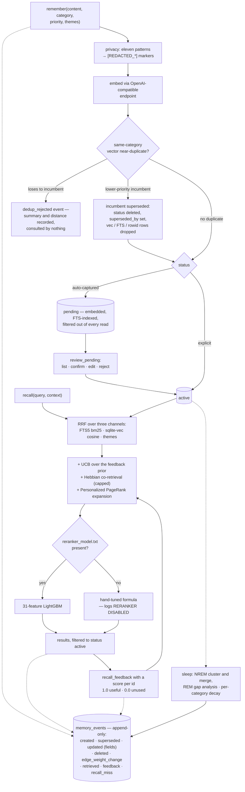

## 1. Executive Summary

Somnigraph is one person's memory server for Claude Code, tuned against measured
retrieval data at every step and documented to match. RRF over FTS5, sqlite-vec
and a theme channel; a UCB exploration bonus over an empirical-Bayes feedback
prior; Hebbian co-retrieval boosting; Personalized PageRank expansion over an
edge graph; a 31-feature LightGBM reranker with a hand-tuned formula beneath it;
per-category exponential decay; and a consolidation pass split into NREM and REM
phases. 5,382 lines of Python across twenty modules, against 3,869 lines of docs
and 188 per-system research analyses.

191 commits between 6 March and 27 July 2026 from one author under two
identities. The screen found no auto-run surface, no manifest inside the
cooldown, no build-time execution and no unpinned dependency surface, with a
`uv.lock` 161 days old and a `CLAUDE.md` treated as data; nothing was installed
or run.

**It is not open source.** The licence is Apache-2.0 with the Commons Clause
condition on top, which removes the right to sell — including *"hosting or
consulting/support services related to the Software"*, and a product whose value
derives substantially from it. Read the `LICENSE` file rather than the Apache
heading below it before planning to reuse anything.

**What this project does better than its code is account for itself, and one
passage carries the point.** The
architecture document records that from 7 April to 1 July 2026 the learned
reranker was not running. A commit switched the model loader from pickle to
LightGBM's native text format; the `.txt` artifacts never landed; `_load_model()`
returned `None`; and retrieval *"silently ran on the hand-tuned formula for ~3
months — through the entire V5 documentation arc, which describes offline eval
numbers for a model that was not the one serving live queries."* Very few
projects write that down. The fix is a loud `RERANKER DISABLED` warning at load
time, which closes the silence rather than the fallback.

**The constants file is a changelog of empirical decisions.** `K_FTS = 8.002 #
wm38. Was 6.593 (wm37). 12D tight, +79bp blended.` Every core constant carries
the study that set it, its previous value and the measured effect; deprecated
ones say `DEPRECATED by PPR` instead of quietly persisting. A reader can
reconstruct why the system scores the way it does without asking.

**Three of seven marks.** `trust_state` because an auto-captured memory is
written `pending` and every read filters to `active`, so it is absent rather than
low-ranked until a person confirms it. `audit_log` because `memory_events` is an
append-only table carrying lifecycle mutations — `created`, `superseded`,
`updated` with the changed field names, `deleted`, `edge_weight_change` with the
weight before and after — alongside its retrieval events. `human_review` because
`review_pending` is a queue with list, confirm, edit and reject, and because the
instructions the project asks a user to install make the rating loop mandatory:
*"Don't skip this — it's the selection pressure that shapes future retrieval."*

**Two near-misses, both stated by the project itself.** `dedup_rejected` records
a refused write with its summary and the vector distance that refused it — and
the architecture page says exactly what it is: *"measurement, not gating"*, which
*"changes nothing: not retrieval, not what gets stored"*, kept so the
high-similarity region a future write guard would need is captured rather than
thrown away. That is a tombstone's raw material with the consulting step
deliberately absent. And `valid_until` is set when a memory evolves and appears
in no query, so the validity half of a bitemporal model is written and never
read.

**What it does not have is a boundary or a test suite.** No project, user or
tenant key exists on a record and no read filters on one — reasonable for a
single-person store and a hard stop for anything else. And eleven `assert`
statements in the whole tree, all inside a benchmark harness checking feature
matrix shape and rerun determinism.

## 2. Mental Model

The design premise is in the README: *"Most MCP memory servers store and
retrieve. Somnigraph also forgets, sleeps, and learns from feedback."*

Storing is a judgement call the prompt makes explicit — corrections have the
highest value, one-off facts and anything derivable from the code should not be
stored — and the category chosen at write time sets how fast the memory fades:
episodic at a thirty-day half-life, procedural at fifty-eight, semantic at
eighty-seven, reflection at a hundred and sixteen, meta at a hundred and
seventy-three, and entity not at all.

Retrieving is a two-channel question by design. `recall(query, context)` wants a
keyword string for FTS5 *and* a natural-language sentence for the vector arm,
because they are different channels and the guidance says to use both.

Learning is the loop that distinguishes it. After a recall the agent is
instructed to rate every result — 1.0 for directly useful, 0.0 for surfaced and
unused — and those ratings become an EWMA-aggregated utility with an empirical
Bayes prior, wrapped in a UCB exploration bonus so a memory with one bad rating
is not buried forever. Co-retrieval is Hebbian: memories that surface together
strengthen a link that later helps them surface together.

Sleeping is where the maintenance lives, and the biological naming is more than
decoration: the NREM phase clusters and merges near-duplicates and refreshes
summaries, the REM phase looks for gaps in what is known and generates questions
about them.

The one thing the system will not do on its own is admit a memory it captured
automatically. Those land `pending`, indexed and embedded and invisible, until
somebody works the queue.



## 3. Architecture

One MCP entry point wiring eleven tools, and a `memory` package of nineteen
modules with a clean split: `db` for schema and migrations, `write` for creation
with dedup and privacy stripping, `fts` and `vectors` for the two index arms,
`scoring` for the post-RRF pipeline, `reranker` for the learned model, `graph`
for edges and PPR, `decay`, `events`, `session`, `themes`, `privacy`,
`embeddings`, `formatting`, `stats`, and a 1,843-line `tools` holding the tool
bodies.

Two structural details are worth noticing because they show the author has been
bitten. The `memory_vec` virtual table is created with a fixed dimension, and
because `CREATE VIRTUAL TABLE IF NOT EXISTS` is a no-op on an existing table, a
startup check re-reads the stored SQL and compares — *"connecting to a populated
DB with the wrong backend would otherwise silently emit dim-N vectors against a
dim-M index — fail loud."* And `sync.py` is a two-line backward-compatibility
shim re-exporting from `events.py`, which is the honest way to move a module.

The surrounding tree is unusually large relative to the source: 3,869 lines of
documentation across twelve files, a `research/sources/` directory with 188
per-system analyses, an `experiments/` tree with four studies (expansion
ablation, floor study, sleep bench, sleep fork), a `scripts/` directory of
tuning, ground-truth, benchmark and pathology-diagnosis tools, and a `memory/`
directory carrying the project's own notes to itself.

## 4. Essential Implementation Paths

- **Write.** `remember` → `_strip_sensitive` over eleven regex patterns → embed
  → same-category KNN → if the nearest neighbour is inside the dedup distance
  and has lower priority, insert the new memory, set `superseded_by` on the
  incumbent, flip it to `deleted`, and drop its vector, FTS and rowid rows;
  otherwise log `dedup_rejected` and stop → log `created` and a `write_shadow`
  event carrying the three nearest neighbours and the outcome.
- **Recall.** three channels fused by RRF with per-channel k constants → UCB
  bonus over the feedback prior → Hebbian co-retrieval term, floored at a
  minimum joint count and capped → PPR expansion seeded from the fused set →
  reranker if the model file exists, formula if not → hydrate with
  `WHERE status = 'active'` → log `retrieved` per result plus a `recall_meta`
  event, or `recall_miss` and `recall_cutoff` when nothing clears.
- **Feedback.** `recall_feedback({id: score})` → EWMA update with the study-set
  alpha → `feedback` event carrying the utility → the next recall's UCB term
  reads it.
- **Review.** auto-capture writes `pending` → `review_pending list` reads the
  partial index → `confirm` flips to `active`, `edit` replaces content first,
  `reject` marks it `deleted`, and a bulk path confirms everything at once.
- **Sleep.** `consolidate()` → NREM clusters near-duplicates, merges, refreshes
  summaries → REM analyses gaps and generates questions → decay and dormancy →
  one `sleep_log` row with counts, energy before and after, and a
  `per_memory_changes` blob.

## 5. Memory Data Model

`memories` carries twenty-two columns, and the interesting ones are the pairs.

**Status and confidence are different things, and the code keeps them apart.**
`status` is `active`, `pending` or `deleted` and decides admission; `confidence`
is a float that feeds scoring. A migration backfills pending rows to a
confidence of 0.3, which is the right shape — a memory nobody has confirmed is
both withheld *and* scored lower if it ever is.

**Access is counted three ways.** `access_count` is marked legacy and
`startup_count`, `recall_count` and `reflect_count` sit beside it, so a memory
that only ever arrives in the session-start bundle can be told from one an agent
actually searched for. That distinction is what makes the shadow-load idea — a
memory that keeps surfacing and never helps — measurable at all.

**Validity is declared and unread.** `valid_from` and `valid_until` are columns;
`graph.py` sets `valid_until` on the older memory when a newer one evolves from
it, alongside an `evolved_from` edge; and no query in the tree filters on either.
The bitemporal shape is present and the mechanism is not.

**The event log is the second first-class table.** `memory_events` is described
in the schema as append-only, written through one helper, indexed by memory, by
type and by session, and it carries both what was retrieved and what changed.
`sleep_log` beside it keeps a per-run record including a `per_memory_changes`
blob, so a consolidation pass is reconstructable.

**Edges carry their author.** `memory_edges` has a `created_by` defaulting to
`sleep`, so a link the consolidation pass inferred can be told from one a caller
drew with `link()`.

## 6. Retrieval Mechanics

The fusion is RRF with separate k constants per channel — about eight for FTS5,
about seven for vectors — and a vector weight near a half, all three set by the
`wm38` study and each carrying its previous value in a comment. A third theme
channel has its own weight and k. Inside the FTS5 arm, the summary column is
weighted about thirteen and themes about six against the body, with the comment
on the last change reading *"less summary dominance"*.

Four post-fusion terms then move the score, and each has a story:

- **Feedback**, as a UCB exploration bonus rather than a flat coefficient. The
  old `FEEDBACK_COEFF` is still in the file marked deprecated with its last
  value, which is more useful than deleting it.
- **Hebbian co-retrieval**, a PMI-style boost gated behind a minimum joint count
  so two memories that surfaced together once contribute nothing, capped so the
  term cannot dominate.
- **Personalized PageRank** over the edge graph, which replaced naive BFS
  adjacency for a reported +5.8 percentage points at R@10 — and the three
  constants of the adjacency scheme it replaced remain in the file marked
  `DEPRECATED by PPR`.
- **The reranker**, 31 LightGBM features, when its artifact is on disk.

**The missing-value policy is the most portable idea in the retrieval code.**
The rule, codified in both the extractor and the trainer: any feature whose
missing value would masquerade as a real measurement is encoded `float("nan")`
so LightGBM learns an explicit missing branch, while a feature whose zero has a
legitimate meaning — no overlap, no PMI, a genuine count of zero — keeps its
zero. A default that looks like data is a bug a model will happily learn.

**And the pool it scores was wrong for a while.** A 2026-07-01 audit found that
the candidate pool was built from unfiltered vector and FTS results, so `pending`
memories (embedded and indexed regardless of status) and superseded ones (whose
search rows the supersede path did not clean up) could enter scoring and hit the
missing-metadata branch. The effect was masked because the final hydration filters
to `active` — the scores were computed and discarded. The fix filtered the pool,
NaN-encoded the branch anyway as defence in depth, and closed the upstream cause
by dropping the superseded rows.

## 7. Write Mechanics

Secrets are stripped before storage, against eleven patterns applied in a
deliberate order — multi-line PEM blocks first *"so nothing inside them leaks
past a later single-line pattern"* — covering private keys, API-key prefixes,
JWTs, bearer tokens, database connection strings, passwords, GitHub and Slack
tokens, AWS and Google keys, and card numbers anchored to network prefixes so
ordinary long digit strings survive. Each replacement leaves a visible
`[REDACTED_*]` marker, so redaction is greppable rather than invisible.

Deduplication is a same-category vector KNN with a priority tiebreak. A
near-duplicate that outranks the incumbent supersedes it, and the incumbent's
vector, FTS and rowid rows are dropped in the same transaction — the comment
naming the bug that taught them to do it, since without the cleanup the row
*"re-enters the reranker candidate pool as a `status='deleted'` phantom."* A
near-duplicate that does not outrank the incumbent is refused.

**And the refusal is recorded but not consulted, on purpose.** The
`dedup_rejected` event carries the rejected write's summary, the cosine distance,
and both priorities. The architecture page states the intent: this is *"the first
step toward a write-path quality gate… measurement, not gating"*, it *"changes
nothing: not retrieval, not what gets stored"*, and rejected writes are logged
*"so the ≥0.9-similarity region — the top of the exact distribution a future
Write Guard needs — is captured rather than thrown away."* A project that builds
the instrument before the mechanism and says which is which is doing it in the
right order.

## 8. Agent Integration

Eleven MCP tools, and a prescribed rhythm the README asks the user to paste into
their own `CLAUDE.md`: `startup_load(3000)` at session start with the budget
argument framed as a scarcity decision, `recall` with both a keyword query and a
natural-language context, `recall_feedback` immediately after, `remember` at
session end after checking whether the insight is already captured, and
`consolidate()` sparingly because it is heavy.

Two instructions in that block are worth lifting whatever you build. *"Don't
narrate that you're checking memory; just recall and use the results naturally"*
— a memory layer that announces itself spends context on the announcement. And
the storage guidance names what not to store: one-off facts, things derivable
from the code, unverified guesses. Most systems tell a model what memory is for;
this one tells it what memory is not for.

`reflect(memory_id)` is a small idea with a clear purpose: reheat a memory's
`last_accessed` when it was referenced without being searched for, so decay does
not punish a memory the agent used from context.

## 9. Reliability, Safety, and Trust

**Trust state — awarded.** `pending` is a real withholding state: written,
embedded, FTS-indexed, and filtered out of every read until confirmed. Beside it
the project keeps a numeric confidence for scoring, which is exactly the
separation the mark asks for — a state answers whether a memory may be acted on,
a number answers how sure.

**Audit log — awarded.** `memory_events` carries lifecycle mutations with their
payloads — `updated` with the changed field names, `superseded` with the
successor, `edge_weight_change` with before and after — through one writer, into
an append-only table nothing deletes from, and two scripts read it back. The
retrieval events sharing the table are the other half of the pattern and do not
count toward the mark.

**Human review — awarded.** A queue with list, confirm, edit and reject standing
between auto-capture and retrievability, and a rating call the design treats as
selection pressure rather than telemetry.

**Tombstone — withheld, and the project agrees.** `dedup_rejected` is durable and
detailed and consulted by nothing on the write path, by design and with the
design written down. The distance to the mark is one lookup, and the project has
scheduled it as a Write Guard.

**Bitemporal — withheld.** `valid_until` is written on the evolution path and
appears in no `WHERE`; `valid_from` is never written at all.

**Scope — withheld.** There is no project, user or tenant key on a record, and no
read filters on one. `session_id` is on the event log for analysis. For a
single-person store this is coherent; it means the store cannot be shared.

**Negative evaluation — withheld, and the near-miss is a different shape.** The
ground-truth pipeline grades query-memory pairs on a relevance scale where 0.0 is
*"completely irrelevant"*, and the reranker trainer does hard-negative mining,
keeping negatives ranked into the top-K by any channel. Both are ranking
apparatus: they teach the model to order, and neither asserts that particular
material must stay out of a result. There is no test that pins an exclusion.

**Privacy.** The redaction pass is genuine and runs before storage, which is the
right place. Its limits are the limits of regular expressions over prose: a
secret without a recognisable prefix, a password on a line the pattern does not
match, or a key split across a wrap will pass through. The visible marker makes
the successful cases auditable.

**The failure worth reading.** From 7 April to 1 July 2026 the learned reranker
was not loaded, because a loader change expected artifacts that were never
deployed, and retrieval ran on the hand-tuned formula while documentation in that
window quoted offline numbers for the model that was not serving. The project
found it in an audit, wrote it up, and made the loader log
`RERANKER DISABLED -- ... retrieval is on FORMULA FALLBACK`. That is the
correct fix for a silent degradation, and the disclosure is worth more than the
fix.

## 10. Tests, Evals, and Benchmarks

**There is no test suite.** Eleven `assert` statements across the tree, all in
`experiments/sleep-bench/`, and all about the benchmark harness rather than the
system: feature matrices have the expected column count, a frozen store's new
columns are all zero, a rerun produces an identical matrix, the two feature
subsets partition without overlap. Those are good assertions about a
measurement instrument. Nothing pins the behaviour of dedup, decay, the status
transitions, the scoring pipeline or the MCP tool bodies.

**The evaluation apparatus, by contrast, is extensive.** A LoCoMo retrieval
benchmark with a run history from bare RRF through five levels of additions,
each with per-category R@k and MRR; an end-to-end QA run judged by a model; an
expansion ablation, a floor study, and a sleep bench with a 2×2 feature sweep; a
ground-truth pipeline that builds, judges and re-rates query-memory pairs; and
pathology scripts that hunt for queries scoring high on everything.

**Two disclosures in the benchmark page are the reason to take it seriously.**
The headline is 85.1% LoCoMo overall QA accuracy against cited figures for Mem0,
Mem0g and a full-context baseline, with 95.4% R@10 at the top level — and the
page immediately says the remaining gap is reader extraction rather than
retrieval, which is the honest reading of a retrieval score paired with a QA
score. And a comparability note explains that these results are **turn-level** —
each of roughly three hundred dialogue turns a separate candidate — while some
other systems report LoCoMo at **session-level** over roughly twenty-five
enriched documents with benchmark-specific synonym expansion, and states plainly
that *"the numbers are not comparable."* Naming a specific competing methodology
and declining to compare against it is rare.

**One methodological result generalises beyond this project.** The project
surveyed the same public comparison directory that catalogues much of this corpus, first
by reading READMEs and at most two docs, then by cloning and reading the
retrieval, write, consolidation and decay implementations. The light-touch pass
returned 0 promising, 7 maybe and 50 skip; the code-level pass on the same 59
entries returned 13, 41 and 5, and *"reading the code corrected the metadata
triage in both directions"* — some systems that looked strong by benchmark cell
stayed weak, and several near-skips held real value. The conclusion the project
draws is the one worth quoting: *"light-touch triage demonstrably
under-counts."*

## 11. For Your Own Build

### Steal

- **Write the study into the constant.** `K_FTS = 8.002 # wm38. Was 6.593
  (wm37). 12D tight, +79bp blended.` Six months later, that comment is the only
  thing standing between a tuned parameter and a magic number.
- **NaN-encode a missing feature whose zero would look like a measurement.** A
  default that is indistinguishable from data is a bug the model will learn.
  Keep the zero where zero means something, and say which is which in a policy.
- **Separate the status from the confidence.** One decides admission, the other
  decides order, and collapsing them means an unconfirmed memory is merely
  unlikely rather than withheld.
- **Count accesses by channel.** Arrived in the startup bundle, was searched for,
  was reheated — three counters instead of one, and suddenly "keeps surfacing and
  never helps" is a question you can ask.
- **Build the instrument before the gate, and label it.** Logging every rejected
  write with its distance, while stating that it changes nothing, is how you get
  a distribution to threshold against instead of a guess.
- **Fail loud on a dimension mismatch.** A `CREATE VIRTUAL TABLE IF NOT EXISTS`
  is a no-op, so re-read the stored SQL and compare rather than emitting
  dimension-N vectors into a dimension-M index.
- **Publish your regression.** Three months on a fallback, found in an audit,
  written up with dates and commits — and a warning log so the next one is not
  silent.

### Avoid

- **A model artifact outside the repository with no startup assertion.** The
  fallback was correct behaviour; the silence was the defect, and a warning is
  the minimum. A health check that refuses to serve unlabelled degraded results
  would be better.
- **A single-store design with no scope key.** Coherent for one person, and it
  forecloses sharing entirely: nothing here can partition two projects.
- **A schema column with no reader.** `valid_until` is set on the evolution path
  and consulted nowhere.
- **Shipping without a test suite because the benchmarks are good.** They measure
  the ranking; they do not pin the status transitions, the dedup branch or the
  supersede cleanup — and the supersede cleanup is exactly what was found broken.

### Fit

Read this project for its documentation before its code: the constants file, the
architecture page's silent-fallback section, the experiments write-up with its
recorded negative results, and the benchmark page's comparability note are worth
more to most readers than the implementation. Run it if you are one person on one
machine who wants a measured retrieval stack for Claude Code and is willing to
work a review queue and rate results after every recall — the loop is the
product. Do not build a product on it: the Commons Clause forbids selling,
hosting or supporting it, there is no test suite under the benchmarks, and there
is no scope key to give a second user.

## 12. Open Questions

- Will the Write Guard consult `dedup_rejected`? The record already carries the
  summary, the distance and both priorities.
- What was `valid_from` for? `valid_until` at least has a writer.
- Is the reranker model artifact intended to ship? A fresh clone runs the formula
  and now says so, but the benchmark numbers describe the learned path.
- Would the shadow-load counter earn its place if it were scored rather than only
  tracked? The project measured marginal impact and removed it from scoring,
  which is the right call to have made and an unusual one to publish.

## Appendix: File Index

| Path | Lines | What it holds |
| --- | --- | --- |
| `src/memory/tools.py` | 1843 | The tool bodies: the write path with dedup, supersede and `dedup_rejected` (390-445), recall and its event logging, `review_pending` (1524-1610) |
| `src/memory/reranker.py` | 661 | 31-feature extraction, the loader that warns `RERANKER DISABLED` (80-98), the NaN missing-value policy |
| `src/memory/scoring.py` | 537 | Post-RRF pipeline: feedback UCB, Hebbian, PPR — the formula fallback |
| `src/memory/db.py` | 442 | The schema (109-219): `memories`, `memory_edges`, `sleep_log`, the append-only `memory_events`, the vec table and its dimension guard |
| `src/memory/graph.py` | 290 | Edge creation, PPR expansion, and the one writer of `valid_until` (243-249) |
| `src/memory/constants.py` | 140 | Every tuning parameter with its study, prior value and delta; the per-category decay half-lives |
| `src/memory/events.py` | 49 | `_log_event`, the single writer of the event log |
| `src/memory/privacy.py` | 32 | Eleven ordered redaction patterns with visible `[REDACTED_*]` markers |
| `docs/architecture.md` | 637 | The masquerading-defaults policy and its audit (491-495), and the silent-fallback section (497-509) |
| `docs/benchmarks.md` | 947 | LoCoMo run history level 0 to 5b, the end-to-end QA headline, and the turn-level versus session-level comparability note |
| `docs/experiments.md` | 519 | The tuning studies and the recorded negative results |
| `docs/declined.md` | 199 | The survey of 59 entries from the public comparison directory, with the triage-versus-code-read counts |
| `research/sources/` | — | 188 per-system analyses |
| `experiments/sleep-bench/bench_features.py` | — | Eight of the eleven `assert` statements in the tree |

Searches behind the absence claims above, run from the repository root:

```sh
grep -rn 'def test_\|assert ' --include='*.py' . | grep -v '\.git'   # eleven hits, all in experiments/sleep-bench
grep -rn 'valid_until\|valid_from' src scripts --include='*.py'      # one writer in graph.py; no query filters on either
grep -rn -i 'project\|tenant\|user_id\|workspace' src --include='*.py'  # session transcript paths only; no scope key on a record
grep -rn 'dedup_rejected' src scripts docs                           # written once, read by two analysis scripts, consulted by no write path
```

## History

**2026-09-10** — [`6dc4d3497adb63df888ccf9874d33a166f65b09c`](https://github.com/AlexisOlson/somnigraph/commit/6dc4d3497adb63df888ccf9874d33a166f65b09c) — first reading, at the head of `main`, the last commit of 27 July 2026. Screened before reading: no auto-run surface, no manifest inside the seven-day cooldown, no build-time execution path and no unpinned dependency surface, with a `uv.lock` 161 days old and a `CLAUDE.md` treated as data; nothing was installed, built or run, and the read was made from a full clone. Three marks. The reading covered the schema and its event log, the write path with its privacy stripping and dedup branches, the retrieval fusion and post-fusion scoring, the reranker loader and its missing-value policy, the review queue, the decay constants and the graph module; the sleep scripts, the tuning and ground-truth tooling, the four experiment trees and the 188 research analyses were read as context rather than as subject. The licence is Apache-2.0 under a Commons Clause condition, which is not an open-source licence.
