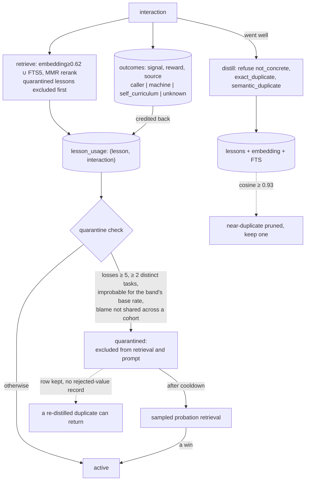

## 1. Executive Summary

Sonder Runtime is a self-modifying terminal agent — Apache-2.0, ~257,000 lines
of Python across 742 files, with a code-rewriting loop (`selfmod.py`), a training
pipeline, an NPU broker, and a great deal else. Most of that is out of this
atlas's scope. What is in scope is a genuinely serious memory subsystem: a
stdlib-only SQLite adapter (`sonder_runtime/adapters/memory_store.py`, 3,529
lines) that stores **interactions**, the **outcomes** credited to them, and the
**lessons** distilled from them, and then lets the outcomes decide which lessons
keep being retrieved.

The unit that matters is a **lesson** — a concrete directive like *"Use
`collections.Counter` for frequency counting and `.most_common()` to find the
most frequent item efficiently,"* extracted from an interaction that went well,
embedded, and made retrievable. The atlas has many systems that store lessons.
What lifts this one out of the pile is that it closes the loop the field almost
never closes: **it credits the outcome of each interaction back to the lessons
that were retrieved for it, and uses that credit to quarantine lessons that keep
leading to losses.**

The quarantine is the report's headline, and it is careful in exactly the places
the atlas keeps finding this idea done badly:

- **Blame is deduplicated across co-retrieved lessons.** If five lessons are
  always retrieved together and the task fails, they cannot each claim the
  failure as independent evidence — "a cluster of lessons that always fail
  together cannot each claim the same failures." A test,
  `test_one_failure_cluster_no_longer_quarantines_its_whole_cohort`, pins it.
- **A loss run is judged against the lesson's own base rate.** Quarantine fires
  only when the run of losses is *improbable* for the loss rate of the lesson's
  retrieval-frequency band, "so a rarely-retrieved lesson is not punished for the
  unusual tasks that retrieval sends it." The test computes an explicit
  `p=0.006`.
- **Quarantine has a route back.** After a cooldown a quarantined lesson becomes
  eligible for sampled probation retrieval — a production path to a win — and a
  win lifts the quarantine on evidence rather than on a clock.

And the whole apparatus rests on **who judged the outcome**. The `outcomes`
table has a `source` column — `caller`, `machine`, `attributed`,
`self_curriculum`, `unknown` — that is `NOT NULL` with deliberately no default,
and the success-rate math weights caller-sourced outcomes over machine ones.
That is a direct, built defense against the self-grading failure the atlas
documents at length ([the reward-inflation
paper](../../compare/#known-limitations) is the theory; this is one of the few
implementations that acts on it).

The weakness is the same fact read from the other side. The loop is only as good
as the outcome signal, and in practice much of that signal is `machine` or
`unknown` — the code treats those categories with visible suspicion, which is the
right instinct and also an admission that the ground truth is thin. And
quarantine *suppresses* a lesson without recording a *rejected value*, so a
re-distillation of the same idea can re-enter; the dedup that would stop it is
keyed on the interaction, not on the rejected content.

## 2. Mental Model

A memory is a **lesson**, and its life is governed by the outcomes of the
interactions that retrieve it.

```text
interaction happens        -> interactions row (task, retrieved_ctx, response, project, tier)
outcome lands              -> outcomes row (signal, reward, source ∈ {caller, machine,
                              attributed, self_curriculum, unknown})  -- source NOT NULL
distillation claims it     -> lesson_distillations state machine:
                              claimed -> stored | no_lesson | cancelled
                              refusing not_concrete, exact_duplicate, semantic_duplicate
lesson stored              -> lessons row + embedding + lessons_fts
lesson retrieved           -> lesson_usage row links (lesson, interaction)
outcome credited           -> lesson_usage.reward / outcome_source filled in
losses accumulate          -> quarantine if the run is improbable for the band's base rate
                              AND the lesson is individually answerable for them
quarantine                 -> excluded from retrieval; after cooldown, sampled probation;
                              a win exits, on evidence
```

Lessons are the procedural layer; three other durable kinds sit beside them.
**Preferences** are corrected beliefs with a `confidence`, an `evidence_count`,
an `enabled` flag and a `revision` — and every change to one is journalled. This
is the atlas's clearest example of a memory whose *state* is the whole point: a
lesson is `active`, `quarantined`, or `on probation`; a preference is enabled or
disabled at a version. `trust_state` is earned without strain.

How a memory dies has three distinct paths, and the distinction between them is
the design's sophistication:

- **Quarantine** — a lesson stops being retrieved because the outcomes credited
  to it went bad, statistically and answerably. Reversible by a probation win.
- **Near-duplicate pruning** — a lesson is deleted because another says the same
  thing (cosine ≥ 0.93), keeping one representative.
- **Age-decay ranking** — a lesson loses ground over a 30-day half-life to
  fresher lessons, blended with usage evidence; not deletion but demotion.

Nothing here records a *rejected value* — quarantine keeps the row and suppresses
it, pruning deletes a duplicate, and the distillation refusal (`semantic_duplicate`)
is keyed on the interaction that would have produced the lesson, not on the
lesson content itself. So `tombstone` is withheld: a lesson quarantined for being
harmful, then re-distilled from a fresh interaction, can return. The near-miss is
worth naming because the machinery to close it — an embedding of the rejected
lesson, checked at distillation — is already present for the duplicate case.



## 3. Architecture

One local SQLite database is the spine. `sonder_runtime/adapters/memory_store.py`
defines the schema — `interactions`, `outcomes`, `lessons` + `lessons_fts`,
`lesson_usage`, `lesson_distillations`, `preferences`, `refinement_history`,
`facts`, `sessions`, `session_project_summaries`, `tasks`/`task_events`/`task_deps`,
plus migration and claim tables — and it is **stdlib-only**: `sqlite3`, `array`,
`hashlib`, `math`. No ORM, no vector service, no server. Embeddings are stored as
BLOBs stamped with `embedding_model`, `embedding_revision` and `embedding_dim`, so
a vector always carries the space that produced it.

The memory logic is spread across small, mostly pure modules that wire into the
adapter:

- **`retriever.py`** (654 lines) — hybrid retrieval, MMR, and the quarantine
  decision (`lesson_quarantine`, `band_loss_rate`, `_attribution`).
- **`lesson_decay.py`** (253) — pure age-decay + usage-evidence ranking math, and
  a contradiction detector for semantically-similar lessons carrying opposite
  outcomes. No I/O, no clock, similarity injected — built for deterministic tests.
- **`lesson_pruner.py`** (256) — embedding-cluster near-duplicate removal,
  dry-run by default, embedding-space-isolated.
- **`memory_quality.py`** (358) — a read-only auditor that flags vague lessons
  (*"use appropriate", "be careful", "best practices"*) against concrete anchors
  (backticks, dotted names, Big-O).
- **`grounded_extraction.py`**, **`reflection.py`**, **`preference_learning.py`**,
  **`mmr_rerank.py`**, **`store_integrity.py`**, **`refinement_transactions.py`**.

The root `memory_store.py` and `recall.py` are compatibility shims that alias the
migrated adapters under `sonder_runtime/adapters/` — a strangler-fig migration in
progress, with the true modules under the package and the root names preserved for
legacy callers.

### Deployment and ergonomics

- **One SQLite file, no services.** The memory adapter needs nothing beyond the
  standard library; embeddings are computed by `embeddings.py`/`embed_cache.py`
  and stored locally.
- **The store is inspectable and repairable** with any SQLite client, and
  `store_integrity.py`, `sonder_doctor.py` and `memory_quality.py` are shipped
  audit tools.
- **Concurrency is taken seriously** for a local store: claim tokens with owner
  pid/identity on session turns and distillation, and abandoned-claim recovery
  guarded by process-liveness checks.
- The wider runtime (self-modification, training, NPU) is heavy, but the memory
  layer is a clean, importable, dependency-light module inside it.

The screen found no auto-run surfaces, no dependency surfaces inside the cooldown,
two build-time execution points (`conftest.py` on pytest collection) and two
unpinned dev/train requirement ranges. Nothing was installed or run; the code was
read and cross-checked against its committed tests.

## 4. Essential Implementation Paths

- **Write / distill** — the `lesson_distillations` state machine in
  `memory_store.py`: `claim` an interaction, extract a lesson, transition to
  `stored` / `no_lesson` / `cancelled`, with `result_reason` recording
  `not_concrete`, `exact_duplicate`, or `semantic_duplicate`.
- **Credit** — `lesson_usage` rows link a retrieved lesson to its interaction;
  outcome signal, reward and `outcome_source` are filled in when the outcome
  lands (`record_outcome`, the `_checked_source` guard).
- **Retrieve** — `retriever.retrieve` / `retrieve_with_ids`: embedding cosine at
  `DEFAULT_MIN_SIM = 0.62` unioned with `memory_store.fts_search`, then
  `mmr_rerank.mmr_rerank` at `lambda 0.5`, with `exclude_ids=quarantined` applied
  before ranking.
- **Quarantine** — `retriever.lesson_quarantine` at `:392`, with constants
  `QUARANTINE_MIN_LOSSES = 5`, `QUARANTINE_MIN_DISTINCT_TASKS = 2`,
  `QUARANTINE_PROBATION_AFTER_HOURS = 24`, `band_loss_rate` for the base-rate
  test, and `_attribution` for shared-blame deduplication.
- **Correct preferences** — `refinement_transactions.apply_preference_refinement`
  writes a `refinement_history` row per `apply`/`rollback` with `expected_version`
  optimistic concurrency and before/after versions.
- **Prune** — `lesson_pruner.prune` clusters by cosine ≥ `0.93` and deletes all
  but one representative per cluster, dry-run unless `--apply`.
- **Decay / contradiction** — `lesson_decay` blends a 30-day half-life with a
  small usage weight and flags contradicting lesson pairs.
- **Quality audit** — `memory_quality` classifies stored lessons as vague or
  concrete and reports duplicates.

## 5. Memory Data Model

The schema is where the epistemic care shows, and several columns carry a comment
explaining the failure they prevent — a habit worth reading the source for.

`outcomes.source` is the sharpest: `NOT NULL` with **no default**, a closed
`CHECK` vocabulary, and a comment stating why —

> a default is how the original defect would come back, because a writer that
> forgot would keep filing rows under a meaning it never chose. Omitting the
> column is a constraint failure, not a silent relabelling.

That is provenance enforced at the schema level: the system cannot record an
outcome without saying who judged it, and it cannot invent a category. The
`lesson_usage.outcome_source` mirror is nullable because a usage row exists before
any outcome credits it, and the eviction math reads `NULL` as unknown provenance.

`preferences` carries `confidence REAL`, `evidence_count`, `enabled`, and
`revision >= 1` with a `UNIQUE(scope, key)` — a corrected belief with a version
and an on/off switch. `refinement_history` records `operation IN ('apply',
'rollback')` with `expected_version`, `before_version`, `after_version` and a
`parent_refinement_id`, which is an **append-only audit of every correction, with
rollback** — the mechanism the [append-only memory audit](../../patterns/append-only-memory-audit/)
pattern describes, applied to preferences.

**Scoping** is real on the scoped stores and absent on the lesson store, by
design. Interactions carry `project` and a `project_explicit` flag; tasks and
preferences carry `account_scope`, described as "an account boundary supplied by
the authenticated serving layer," applied as `WHERE project=?` /
`account_scope=?` on the read builders. Lessons, by contrast, are **global** —
procedural knowledge is meant to cross projects, and retrieval fetches them by id
without a project filter. So `scope_enforced` is earned by the interaction,
task and preference reads, and the report states plainly that the lesson layer is
deliberately unscoped.

Temporal fields are record time throughout; preference `revision` is versioning,
not validity time, so `bitemporal` does not apply.

## 6. Retrieval Mechanics

Hybrid and outcome-filtered. A query is embedded and matched by cosine at a 0.62
relevance floor, unioned with an FTS5 lexical search over `lessons_fts`, and the
combined candidates are MMR-reranked at `lambda 0.5` to trade relevance against
redundancy. **Quarantined lessons are removed before ranking** — `exclude_ids`
is computed from the quarantine decision and passed into the candidate query, so
a lesson that has been leading to losses never reaches the prompt.

The quarantine decision is the retrieval mechanic worth studying, and section 1
gives its three guards. Two consequences for retrieval follow. First, the
exclusion is **evidence-gated, not score-gated**: a lesson is not dropped for a
low similarity but for a documented run of bad outcomes it is answerable for, so
retrieval quality and lesson trust are separated. Second, the probation path
means the exclusion is **not permanent** — a quarantined lesson is sampled back
into a fraction of traffic so it can earn its way out, which is the difference
between suppression and deletion.

The failure mode the design carries is the base-rate test's dependence on having
enough outcomes: a new lesson has no band statistics, so quarantine cannot fire
on it, and a lesson retrieved rarely accumulates evidence slowly. That is the
correct direction to fail — a lesson is trusted until it has demonstrably earned
suspicion — but it means a harmful new lesson gets a grace period proportional to
how often it is used.

The contradiction detector in `lesson_decay` is a second, quieter retrieval-time
signal: it flags pairs of lessons that are semantically similar (≥ 0.8) but carry
opposite outcome signals — the situation where the store holds "do X" and "never
do X" and needs a human or a further outcome to break the tie. It flags rather
than resolves, which is the honest posture for a store that cannot know which
directive is right.

## 7. Write Mechanics

Writes are two-phase and idempotent. An interaction is recorded synchronously;
the lesson is distilled asynchronously through the `lesson_distillations` state
machine, which **claims** the interaction with a token and owner identity,
extracts a candidate lesson, and lands in a terminal state with a `result_reason`.
The refusal reasons are the interesting part: `not_concrete` rejects a vague
lesson before it is stored (backed by the `memory_quality` vocabulary),
`exact_duplicate` and `semantic_duplicate` reject one that restates an existing
lesson. So the distiller is a quality-and-dedup gate, and the fact that a lesson
was refused is itself recorded against the interaction.

Outcome crediting is the write that powers everything downstream. When an outcome
lands it is attached to the interaction and propagated to the `lesson_usage` rows
for every lesson that was retrieved — with its `outcome_source`. This is the
credit-assignment step the atlas keeps asking for and rarely finds: the store
knows not just that a lesson exists but which interactions used it and how those
turned out, and by whom that judgement was made.

Background work is substantial and all outcome-driven: near-duplicate pruning,
age-decay ranking, contradiction detection, and quarantine. None of it blocks a
turn — the retrieval path reads the current quarantine state, and the heavier
passes run as maintenance. The token cost of distillation is one extraction per
interaction that produced a storable lesson, gated by the concreteness and dedup
checks, so noise does not accumulate.

Deletion has the two shapes above — reversible quarantine and irreversible
near-duplicate pruning — and the honest gap is that neither leaves a
rejected-value record. A lesson pruned as a duplicate or quarantined as harmful
can be re-distilled from a new interaction, because the dedup check compares a
candidate against *stored* lessons, and a quarantined lesson is still stored while
a pruned one is gone. Closing that would mean keeping an embedding of the rejected
lesson and checking distillation against it — the same move the duplicate path
already makes, extended to rejections.

## 8. Agent Integration

The memory adapter is a stdlib-only importable module, and the runtime drives it
from a terminal REPL, a headless service, and an MCP surface. The agent's leverage
over memory is indirect and outcome-mediated rather than tool-driven: it does not
call `save_lesson` or `forget`; it acts, an outcome is recorded, and the
distillation and quarantine machinery decide what becomes and stays a lesson. That
is a deliberate design — the model does not curate its own procedural memory, the
outcome loop does — and it is the right shape for a self-improving loop where the
model's own judgement is exactly what should not be trusted to grade itself.

Preferences are the one memory a person or the serving layer edits directly, and
they carry the `account_scope` boundary and the refinement audit. The `contribute.py`
/ `pull_community.py` / `proposals/` machinery is a community-contribution flow
for *code modules* (a lesson tagger, a C++ repair flow), not a per-memory review
surface — so `human_review` is withheld: the quarantine that governs lesson trust
is statistical and automatic, and there is no surface where a person adjudicates a
lesson's content.

Adopting the mechanism means taking the outcome→credit→quarantine loop, which is
portable in principle: it needs an interaction log, an outcome with a provenance
field, a usage join, and the base-rate math in `retriever.py` and `lesson_decay.py`.
Those modules are pure and test-friendly by construction.

## 9. Reliability, Safety, and Trust

**Provenance is the strongest work here.** Every outcome records who judged it,
enforced at the schema level, and the success-rate and quarantine math weight
caller-sourced outcomes over machine ones and treat unknown provenance as its own
category. This is the concrete answer to self-grading: a lesson credited only by
the machine's assessment of its own output is not trusted the way one credited by
a caller is. Read against [the reward-inflation
result](../../compare/#known-limitations) the atlas records, Sonder is one of
the few systems that has built the distinction the theory says is necessary — a
de-inflation signal that tracks who is doing the grading.

**The quarantine's two statistical guards are what separate it from the naive
version.** The naive outcome-gated memory punishes a lesson for a run of losses;
this one asks whether the run is improbable for the lesson's own retrieval band
(so a rarely-used lesson on hard tasks is not punished for the difficulty of the
tasks retrieval sent it) and whether the lesson is individually answerable for the
losses (so a cohort that always fails together does not let each member count the
shared failure). Both are tested with worked probabilities. This is the
credit-assignment discipline the atlas argues for and finds almost nowhere.

**The residual risks are real and mostly acknowledged in the code.** The loop
trusts an outcome signal that is frequently `machine` or `unknown`; the code's
suspicion of those categories is correct but does not manufacture ground truth
where there is none, so a store fed only machine-graded outcomes is a store
grading itself, however carefully the weights are set. Quarantine suppresses
without a rejected-value tombstone, so re-distillation can resurrect a bad lesson.
And the base-rate test's need for evidence gives a new harmful lesson a grace
period.

**Correction of preferences is auditable and reversible** — `refinement_history`
with apply/rollback and version checks — which earns `audit_log`. Concurrency is
handled with claim tokens and liveness-guarded abandoned-claim recovery. There is
no encryption of the local database mentioned; the store is as private as the
disk.

## 10. Tests, Evals, and Benchmarks

The test suite is large and unusually well-aimed at the mechanisms this report
cares about: 357 test files, and the memory-relevant ones assert behaviour rather
than coverage. `tests/test_retriever.py` alone pins the quarantine's design:
`test_quarantine_judges_a_lesson_against_its_own_frequency_band` (with an explicit
`p=0.006`), `test_positive_outcome_rehabilitates_quarantined_lesson`,
`test_quarantine_reaches_probation_and_a_win_is_the_exit`, and
`test_quarantine_still_fires_on_an_unambiguously_harmful_lesson`.
`tests/test_learning_health.py` adds the shared-blame cases —
`test_one_failure_cluster_no_longer_quarantines_its_whole_cohort` and
`test_a_lesson_failing_alone_is_still_quarantined`.

Two tests earn `negative_eval` directly, and they are the strong kind — material
that exists must not be *retrieved or injected*, not merely kept out of a write:
`test_orchestrator_memory.py::test_prompt_and_trace_omit_quarantined_lesson`
asserts a quarantined lesson reaches neither the prompt nor the trace, and the
retriever tests assert quarantined lessons are excluded from the candidate set.
`tests/test_outcome_source.py` ties the eligibility decision to provenance,
asserting a lesson driven by non-caller outcomes is not treated as active.

What is missing is an end-to-end retrieval-quality benchmark: the constants — the
0.62 relevance floor, the 0.93 dedup threshold, the 30-day half-life, the
five-loss quarantine trigger — are each defended in a comment and tested for
behaviour, but nothing measures whether the tuned values maximise recall or task
success. `eval_retrieval.py` and `eval_history.py` exist as harnesses; no
committed run characterises the loop's effect on outcomes over time, which is the
measurement the whole design invites.

## 11. For Your Own Build

### Steal

**Credit outcomes back to the memories that were retrieved, and record who
judged the outcome.** The `interaction → outcome(source) → lesson_usage` chain is
the loop most lesson stores omit, and the `source` column enforced `NOT NULL` with
a closed vocabulary is what lets the trust math distinguish a caller's judgement
from the machine grading itself. Without provenance on the outcome, outcome-gated
memory is self-grading with extra steps.

**Before suppressing a memory for bad outcomes, check the base rate and the
attribution.** A run of losses is only evidence if it is improbable for how often
the memory is used, and only the memory's *own* losses count, not the shared
losses of a cohort it is always retrieved with. These two guards are the
difference between a quarantine that removes genuinely harmful lessons and one
that removes whatever is used on hard tasks.

**Make suppression reversible with a sampled probation.** A quarantined memory
that gets a fraction of traffic can earn its way back on evidence; a permanently
excluded one can only be wrong forever. Probation is the difference between
forgetting and demotion.

**Distill with a concreteness gate and a semantic-duplicate gate.** Rejecting
*"be careful with errors"* before it is stored, and rejecting a restatement of an
existing lesson, keeps the procedural store from filling with vagueness and
redundancy — and recording *why* a distillation was refused makes the gate
auditable.

**Journal every correction with a version check.** `refinement_history` with
apply/rollback and `expected_version` is optimistic concurrency plus an audit
trail in one table; a preference can be corrected, the correction can be rolled
back, and both are on the record.

### Avoid

**Do not let outcome provenance be optional.** A nullable-with-default `source`
is how a machine-graded outcome silently becomes indistinguishable from a
caller-graded one, and the whole trust argument collapses. Enforce it at the
schema.

**Do not quarantine on a raw loss count.** Without the base-rate and attribution
guards, an outcome-gated memory punishes the memories that get the hard tasks and
lets a co-failing cohort escape, which is backwards.

**Do not suppress without a rejected-value record if re-derivation is likely.**
Sonder's own gap: a quarantined or pruned lesson can be re-distilled because the
dedup checks stored lessons, not rejected ones. If your extractor runs
continuously, a suppression that does not tombstone the value invites it back.

**Do not confuse a preference version history with bitemporality.** Revisions are
record-time; they tell you what the system believed and when it changed its mind,
not when the belief was true of the world.

### Fit

This suits a builder of a self-improving agent that accumulates procedural
lessons and can observe outcomes — the loop is the point, and the loop needs a
signal. It is the best-built outcome-gated lesson memory in the atlas, and the
quarantine's statistical guards are worth lifting whole even into a different
store. It fits a single machine and a local SQLite file naturally; the concurrency
and provenance work would extend to a served deployment, and the `account_scope`
column is already there for it.

Walk away if you cannot produce a trustworthy outcome signal — the whole design
degrades to self-grading if every outcome is `machine`, and no amount of
base-rate care fixes a signal that is the model assessing itself. Walk away if you
need contradiction *resolved* rather than flagged, or a rejected-value tombstone
that keeps a bad lesson gone. And treat the surrounding runtime as out of scope:
what is worth adopting is the memory adapter and the retriever, not the
self-modifying agent around them.

## 12. Open Questions

- What fraction of outcomes in practice carry `caller` provenance versus
  `machine`/`unknown`? The trust math is only as strong as that ratio, and
  nothing committed reports it.
- Does any path re-embed and check a candidate lesson against *quarantined* or
  *pruned* lessons at distillation, or only against active ones? The latter is
  what leaves the re-derivation gap.
- Are the quarantine constants (five losses, two distinct tasks, 24-hour
  probation) tuned against anything, or chosen? Each is defended in a comment,
  none is measured.
- How does the contradiction detector's output get consumed — flagged for a human,
  fed back into ranking, or logged? The detector is pure logic; its wiring is
  elsewhere.
- Does the served deployment apply `account_scope` to the lesson store, or do
  lessons remain global across accounts as they are locally? The comment implies a
  serving layer that the reviewed tree does not include.

## Appendix: File Index

**Store and schema**

- `sonder_runtime/adapters/memory_store.py` — the SQLite adapter: schema, distillation state machine, outcome crediting, `outcomes.source` enforcement.
- `memory_store.py`, `recall.py` — root compatibility shims aliasing the adapters.

**Retrieval and trust**

- `retriever.py` — hybrid retrieval, MMR, `lesson_quarantine`, `band_loss_rate`, `_attribution`.
- `lesson_decay.py` — age-decay + usage ranking and the contradiction detector.
- `mmr_rerank.py` — MMR diversity reranking.

**Curation**

- `lesson_pruner.py` — embedding-cluster near-duplicate deletion.
- `memory_quality.py` — vague-vs-concrete lesson auditing.
- `grounded_extraction.py`, `reflection.py` — lesson and outcome extraction.

**Correction**

- `refinement_transactions.py` — preference apply/rollback with version checks.
- `preference_learning.py` — preference formation.

**Integrity and ops**

- `store_integrity.py`, `sonder_doctor.py`, `learning_health.py`.

**Tests**

- `tests/test_retriever.py` — quarantine base-rate, probation, rehabilitation, harmful-fires.
- `tests/test_learning_health.py` — shared-blame cohort cases.
- `tests/test_outcome_source.py` — provenance-gated eligibility.
- `tests/test_orchestrator_memory.py` — quarantined lesson omitted from prompt and trace.

## History

**2026-08-14** — [`2a11324cbb131c76572724ac1fe47362a4aedf83`](https://github.com/Krilliac/Sonder-runtime/commit/2a11324cbb131c76572724ac1fe47362a4aedf83) — first reading. Screened before opening: no auto-run surfaces, no dependency surfaces inside the cooldown, two build-time execution points (`conftest.py`), two unpinned dev/train requirement ranges. Nothing was installed or run; the quarantine's base-rate and attribution guards, the outcome-provenance enforcement, and the retrieval exclusion were read from `retriever.py`, `memory_store.py` and `lesson_decay.py` and cross-checked against the committed tests named above.
