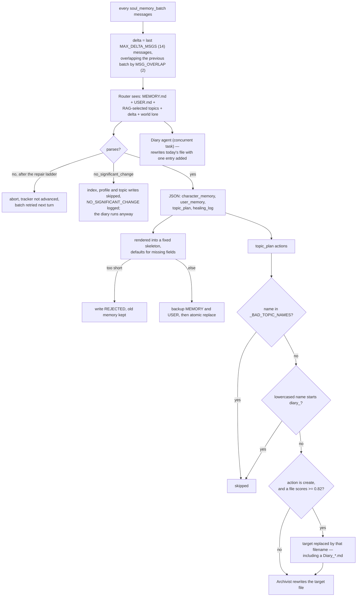
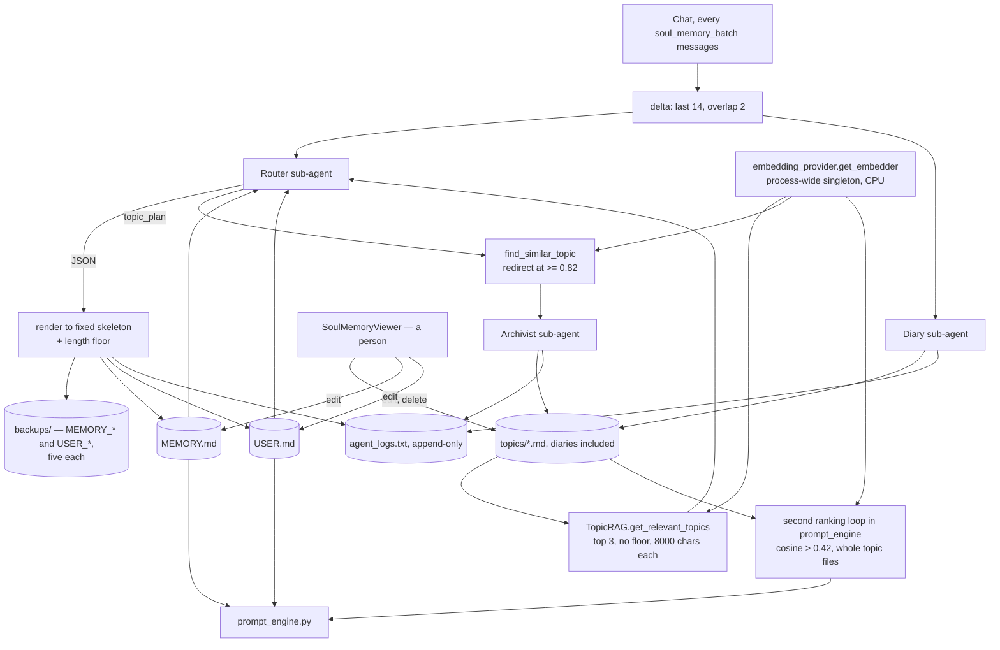

## 1. Executive Summary

Soul of Waifu is a desktop AI companion, GPL-3.0, whose `SoulMemoryAgent`
(`app/utils/soul_memory.py`) has a model regenerate the whole Markdown memory on
a schedule. Most of the code exists to make that shape survivable, and it is more
careful than its context suggests. The weakness is one ordering mistake: a
de-duplication step reassigns a filename after the guard that protects the diary
has checked it. The guards:

- **Degenerate output is rejected, not stored.** An index rewrite shorter than
  `MIN_INDEX_CHARS = 100` is refused with *"Keeping old memory"* (`:462-466`);
  topics and the user profile have a 50-character floor (`:485`, `:515`).
- **The LLM fills slots; the code writes the file.** The Router returns JSON, and
  `_parse_router_response` (`:634`) renders it into a fixed Markdown skeleton with
  a default for every field.
- **A truncated generation is repaired before it is given up on.**
  `_extract_json_object` (`:579`) tries the raw text, the brace-delimited slice, a
  bracket-balanced repair of a tail the model never finished, and a
  trailing-comma fix. If none parses, the pipeline logs *"Pipeline aborted WITHOUT
  advancing the batch tracker"* (`:1001`) and the same messages are tried again on
  the next turn — nothing is written from a failed parse.
- **Both rewritten files are backed up**, five deep each, rolling and
  prefix-scoped (`_backup_file`, `:444`; called for `MEMORY` at `:470` and for
  `USER` at `:519`), and then replaced through a temp file and an atomic
  `replace`.
- **The Router may decline.** `no_significant_change` (`:650`) lets the model
  report that a batch of small talk carried nothing worth recording; the index,
  profile and topic writes are skipped, the batch is marked processed, and
  `NO_SIGNIFICANT_CHANGE` goes to the audit log (`:1011`). The diary agent has no
  such exit: it is launched for the declined batch too (`:1037-1038`), and its
  prompt asks for four to six sentences.
- **Contradictions are logged.** The Router prompt instructs it to *"Resolve any
  direct contradictions between user action and previous beliefs, and document
  this in the `healing_log`"* (`:196`), and that log is appended to a timestamped
  `agent_logs.txt` alongside every index, profile, topic and diary mutation
  (`:1019`, `:1026`, `:1108`, `:887`). That earns `audit_log`.

And then the finding that gives this report its title. The Archivist loop refuses
two classes of filename in sequence — the placeholder names a model emits when it
copies the prompt's examples (`:1066`), and anything beginning `diary_`, with the
comment *"Protecting diary file from Archivist"* (`:1070`). Four lines later, a
`create` action is passed to `find_similar_topic` (`:1078`), and if an existing
file scores at or above `DEDUP_THRESHOLD = 0.82` the target filename is
**replaced with that file's name** (`:1084`) and used unguarded (`:1086`).

Diary files live in the same directory the de-duplicator searches
(`_load_all_topics` globs `*.md` over `topics/`, `:77`), so the name that comes
back can be `Diary_2026-09-13.md`. The Archivist then reads that file, rewrites
it, and `_safe_write_topic` replaces it — the one store in this system with a
distinct lifecycle, overwritten through the redirect that sits four lines below
the guard protecting it from exactly that.

The guard would miss that name even if it ran after the redirect. It tests the
lowercase prefix `diary_` against a name it lowercased itself (`:1062`), and the
diary agent writes `Diary_<date>.md` (`:876`), which the redirect returns
unchanged.

A diary competes for the redirect on its opening, not on its latest entry. The
write path embeds each file's first 600 characters (`EMBED_CHARS`, `:112`,
`:152`), which for a diary is its heading and the day's earliest entries; the
entry about the current delta is generated concurrently and lands at the end of
the file. The rival is the same conversation's earlier batches.

A second defect sits under the whole pipeline. The per-chat lock lives on an
agent object the caller builds per call, so two runs for one chat can overlap,
and the later write of each file wins (section 4).

## 2. Mental Model

A memory is one of four Markdown documents, and they have different lifecycles —
which is the design's best idea:

| File | Written by | Lifecycle |
| --- | --- | --- |
| `MEMORY.md` | Router | overwritten wholesale, backed up first |
| `USER.md` | Router | overwritten wholesale, backed up first |
| `topics/*.md` | Archivist | overwritten per subject, no backup |
| `topics/Diary_*.md` | Diary agent | read, one entry concatenated, written back whole |

The diary's own lifecycle is append-*semantics* over a whole-file rewrite:
`_update_daily_diary` (`:829`) reads the existing day's file, concatenates a
`**[HH:MM]**` block, and hands the result to `_safe_write_topic` (`:482`) — the
same function, and the same absence of a backup, as any topic file.



The state machine is short because there is only one transition: **a memory is
rewritten, or it is not.** There is no supersession, no expiry and no decay of a
record. The pipeline deletes nothing — not a topic, not a diary entry, not a
backup beyond the rolling five per prefix. Deletion belongs to a person, by whole
file, in the viewer described in section 8. A fact enters the index and stays
until a later rewrite happens not to carry it forward, silently.

The index does model decay, but of the character's *mood*, not of belief:
`emotional_decay_counter` is a field the Router maintains inside the document,
with the prompt instructing it to soften the emotion at 3 and reset it whenever
the emotion is referenced again (`:195`). The whole index is explicitly a
**psychological state cache** — core identity, primary emotion and intensity,
psychological tension, active agenda, unresolved cognitive dissonance. This is
memory as characterisation, not as knowledge, and it should be read that way.

Four modes (`soul_memory_mode`) trade cost against depth: Full runs all three
sub-agents; Index+Diary drops topics; Index only drops the diary too; Diary only
runs nothing but the diary. Only Full reads `topic_plan` (`:1030`), and only
Full's prompt contains one — the lite template has no topic section at all.

## 3. Architecture

Python with a Qt desktop GUI. No server, no database, no queue — the store is a
directory tree, which makes it operationally trivial.



### Deployment and ergonomics

- **What has to be running:** the app. Storage is `.soul/<character>/chats/<chat>/memory/`.
- **Local and offline: yes**, including embeddings — but see below on which model.
- **Degrades rather than fails when a dependency is missing.**
  `embedding_provider` (`app/utils/embedding_provider.py`) checks for
  `sentence_transformers` once, logs the `pip install` line, and returns `None`
  thereafter; a load failure sets `_failed` and is never retried unless
  `reset_failure_state()` is called. Callers handle `None`: `TopicRAG` falls back
  to the first N topic files, and the prompt builder skips topic injection
  entirely.
- **Hand-repairable: entirely.** The store is Markdown a person can open, the app
  ships an editor over it (section 8), and the log next to it says what the model
  did to it.

### The embedding model is named but not shipped

`MODEL_NAME = "e5-small-en-ru"` (`embedding_provider.py:9`). The loader prefers a
local directory `app/utils/e5-small-en-ru` and falls back to passing the bare
string to `SentenceTransformer` (`:44-46`). That directory is not in the
repository; the string appears in exactly one place in the tree, which is its own
definition; nothing in the tree, `installer.bat` included, fetches it; and it is
not an owner-qualified Hugging Face identifier, so the fallback has nothing to
resolve against. `installer.bat:14` tells a user who is missing files to *"download
the archive from there"*, meaning the Releases page, whose single asset is a
1.8 GB archive — large enough to carry a model directory the repository does not.

The consequence for a reader who clones this repository and runs it is concrete
rather than theoretical. `get_embedder` returns `None`, so topic ranking passes
every file when there are four or fewer and otherwise the three most recently
modified. The de-duplication redirect never fires. The character's prompt
receives **no topic files at all**: the injection loop is gated on the embedder
at `prompt_engine.py:644`, and that gate covers explicitly named topics too.

Searches behind the paragraph above:

```sh
grep -rn -i "e5-small\|e5_small" . --exclude-dir=.git
ls -d app/utils/e5-small-en-ru
grep -n -i "model\|download\|huggingface\|snapshot" installer.bat
curl -sS -o /dev/null -w '%{http_code}\n' https://huggingface.co/api/models/e5-small-en-ru
```

## 4. Essential Implementation Paths

Everything below is `app/utils/soul_memory.py` unless noted.

**Paths and scoping.** `get_memory_paths` (`:397`) sanitises the character name
and chat id into a filesystem path, creates `memory/`, `topics/` and `backups/`,
and touches `MEMORY.md` and `USER.md` if absent. Falls back to `current_chat`
from config, then to `"default"`.

**Retrieval, write side.** `class TopicRAG` (`:19`): `_load_all_topics` (`:77`)
globs `topics/*.md` sorted by modification time; `get_relevant_topics` (`:97`)
returns everything at or below `RAG_THRESHOLD = 4` files, otherwise embeds the
first `EMBED_CHARS = 600` of each, takes the top three by cosine with an explicit
`1e-9` norm guard, and truncates each to `PASS_CHARS = 8000`.

**The vector cache.** `_encode_topics_cached` (`:42`) keys a process-wide
`_VECTOR_CACHE` (`:31`) on the resolved topics directory, then on filename, and
stores `(md5 of the snippet, vector)`. A file whose first 600 characters change
is re-embedded; entries for files no longer present are dropped on each pass. It
is guarded by a `threading.Lock` and is correct.

**De-duplication.** `find_similar_topic` (`:139`) embeds
`"<filename> <summary>"` from the proposed action and returns the highest-scoring
existing filename at or above `DEDUP_THRESHOLD = 0.82` (`:137`), or `None`. Its
one caller is the Archivist loop (`:1078`).

**E5 prefixes.** `USE_E5_PREFIXES = True` (`:27`) prepends `query: ` to the query
and `passage: ` to each stored snippet, in both `get_relevant_topics` and
`find_similar_topic`, which is the asymmetry that family of models is trained for.

**The write pipeline.** `_call_router_agent` (`:531`) assembles the index,
profile, RAG-selected topics, delta messages and triggered world lore into one
prompt, choosing `_ROUTER_SYSTEM` (`:177`) for mode 0 and `_ROUTER_SYSTEM_LITE`
(`:249`) otherwise. `_extract_json_object` (`:579`) is the repair ladder;
`_parse_router_response` (`:634`) renders the skeleton.

**Guarded writes.** `_safe_write_index` (`:460`), `_safe_write_topic` (`:482`),
`_safe_write_user_profile` (`:512`) — each checks a length floor, writes to
`.tmp`, and `replace`s, unlinking the temp on error. `_backup_file` (`:444`)
copies with `copy2` to a `<prefix>_<timestamp>.md` name and prunes that prefix to
`MAX_BACKUP_COUNT = 5`.

**Input bounds.** `_cap_message_lengths` (`:387`) truncates any single delta
message to `MAX_MSG_CHARS = 2000` with a visible `…[truncated]` marker before it
reaches a prompt.

**Batch trigger.** The chat window launches the pipeline with
`asyncio.create_task` once the reply has streamed
(`app/gui/interface_signals.py:15180`), so the answer never waits on memory.
`_run_update_pipeline` (`:896`) reads `soul_memory_batch` from settings,
defaulting to 4 (`:911-913`), and returns early while the count is below it
unless `force` is set (`:942`). A batch size of 0 disables the automatic run
(`:915`); the force-memory button then runs it with `force=True`
(`interface_signals.py:6653-6660`). The tracker file is written in a `finally`
(`:1126`) — but the parse-failure path returns before that block is entered,
which is what makes the retry work.

**Topic actions.** `:1054-1122` — sanitise the filename to alphanumerics and
`._-`, lowercase, force `.md`, skip if in `_BAD_TOPIC_NAMES` (`:1066`), skip if
it starts with `diary_` (`:1070`), redirect a `create` onto a similar file
(`:1076-1084`), read any existing content, call the Archivist, write, log.

**Diary.** `_update_daily_diary` (`:829`) — a first-person reflection requiring
more than 20 characters, appended under a `**[HH:MM]**` heading to
`Diary_<date>.md` in the topics directory (`:876`), launched as a concurrent
`asyncio` task (`:1038`) and awaited at the end of the loop (`:1122`).

**Audit log.** `_append_log` (`:1130`) opens in `"a"` mode and writes
`[timestamp] MESSAGE`. Callers: `DIARY_UPDATED | file=…` (`:887`),
`NO_SIGNIFICANT_CHANGE` (`:1011`), `INDEX_UPDATE | status=… | healing: …`
(`:1019`), `USER_PROFILE_UPDATE | status=…` (`:1026`), and
`TOPIC_CREATED|TOPIC_UPDATED | file=… | write=…` (`:1108`). No rotation and no
truncation anywhere.

**Injection.** `app/utils/ai_clients/prompt_engine.py:617-708` — the index is
injected as `[CHARACTER PSYCHOLOGY & COGNITIVE CACHE]`, the profile as
`[USER PROFILE & RELATIONSHIP HISTORIC METADATA]`, and selected topic files as
`[RELEVANT DEEP MEMORY TOPICS]`. Note it constructs `SoulMemoryAgent(None)`
(`:621`) — a read-only instance with no LLM function, which is a neat way to reuse
the path logic without the ability to write. The write entry point builds the
same class with a generator attached (`:906`).

**Concurrency.** `_get_lock` (`:376`) keeps an `asyncio.Lock` per
`character::chat` in `self._locks`, an instance attribute (`:374`). Every caller
reaches the pipeline through `PromptEngine.update_memory_after_response`, which
builds a new `SoulMemoryAgent` on each call (`prompt_engine.py:906`), so each run
takes a lock no other run can hold. Two runs for one chat are not serialised.

The tracker advances only in the `finally` at the end of a run (`:1126`), so a
reply that lands while a run is in progress passes the batch check against the
same old count and starts a second run over the same files. The two rewrite the
index, profile, topics and diary independently, and the later write of each file
wins. This is read from the code; it was not run.

## 5. Memory Data Model

There is no schema in the storage sense; the schema lives in
`_parse_router_response`, which is the more interesting place for it. The Router
must return JSON shaped as `character_memory` (core identity, internal state,
cognitive drive, cognitive dissonance), `user_memory` (identity and status,
relationship metadata, preferences, shared milestones and promises), `topic_plan`
and `healing_log` — and the code renders exactly those headings with a default
for each missing field.

**The consequence for anyone building on an LLM rewrite:** the model cannot
invent a section, cannot drop a section, and cannot emit prose where a list
belongs. The document's shape is a property of the code, not of the generation.

`trust_level` appears under relationship metadata, constrained by the prompt to
one of *Distrustful / Wary / Neutral / Developing Trust / Deeply Bound /
Unstable* (`:225`). It is **not** the atlas's `trust_state` — it records how much
the character trusts the user, roleplay state, not confidence in a stored claim.
**`trust_state` is withheld.**

### A pin marker with no producer

`prompt_engine.py:631` parses the index for `[TOPIC FILE: <name>.md]` markers and
treats each named file as explicitly pinned: it is injected ahead of the ranked
files and exempt from the 0.42 similarity floor. It is the one mechanism in this
system by which the memory can *direct its own retrieval*.

Nothing writes the marker. The Router's output schema is enumerated field by
field in `_ROUTER_SYSTEM` (`:177-247`) and contains no such token; the renderer
in `_parse_router_response` emits fixed headings and the field values it was
given; no prompt in the file mentions the syntax. The marker can only appear if
the model volunteers a bracket convention it was never shown, inside a free-text
field, in a form matching the regex. A person can type one into `MEMORY.md`
through the viewer, and the next Router rewrite drops it unless the model copies
it into a field.

```sh
grep -rn "TOPIC FILE" --include="*.py" .
```

Three hits at the pinned commit: the regex itself, a line of the Router prompt
describing *"RELEVANT TOPIC FILES"* as an input section (`:187`), and the header
`_call_router_agent` writes over that section (`:560`). This is a read path
waiting on a write path that was not built.

No provenance: nothing records which messages produced which line of the index,
which is the field [RisuAI](../risuai/) added in its second generation and the
one that would make deletion meaningful here.

No temporal fields except the diary's date and the backups' timestamps. No
versioning of individual claims — the backups version two whole documents, which
is coarse but real.

**Scoping** is the filesystem path: `.soul/<character>/chats/<chat>/memory/`.
Reads derive their path from the same `get_memory_paths`, or, in the desktop
companion, from an equivalent sanitiser applied to the same pattern
(`app/utils/soul_companion/soul_companion.py:2818-2821`), so a character cannot
read another character's memory. The key is the directory, not a field on any
record, and there is no principal — no user, tenant or agent key — because the
deployment is one person's desktop. **`scope_enforced` is withheld**: this is a
physical partition, as in [SillyTavern](../sillytavern/) and
[RisuAI](../risuai/).

## 6. Retrieval Mechanics

**The index and profile are not retrieved — they are injected whole**, truncated
at 5,000 and 3,000 characters respectively (`:436`, `:504`) with a
`[MEMORY TRUNCATED]` marker. There is no selection, so there is no relevance
question and no under-recall: whatever is in the file is in the prompt. The cost
is a fixed token bill every turn and a hard ceiling on how much a character can
know, enforced by truncating the *end* of the file — so the last sections written
are the first lost.

Topic files are ranked by **two separately written implementations** that share
only the embedder. One selects context for the Router that rewrites memory; the
other selects context for the character that answers the user.

| | `TopicRAG` (`soul_memory.py:97`) | prompt builder (`prompt_engine.py:644`) |
| --- | --- | --- |
| Consumer | the Router sub-agent | the character's own prompt |
| Score floor | none — always the top 3 | cosine > 0.42 |
| Small-corpus shortcut | ≤ 4 files: pass everything | none |
| What is embedded | first 600 chars of the body | `"Topic: <stem>. Content: <first 200 chars>"`, or for a diary `"Diary: <stem>. Recent thoughts: <last 600 chars>"` |
| What is passed | truncated to 8,000 chars | a topic's **entire file**, untruncated; a diary's last 2,500 chars |
| Cache key | directory + filename, invalidated by an md5 of the snippet | `topic_<character>_<filename>`, **never invalidated** |
| No embedder | all files at ≤ 4, else the 3 most recent by mtime | nothing injected, pins included |
| Query | the last two non-empty turns of the delta | the last four chat messages plus the pending one |

The cache row is the one to read twice. `prompt_engine.py:673` stores a vector
under `topic_<character_name>_<filename>` and reuses it whenever that key is
present, with no content hash and no modification time. Topic files are
overwritten by the Archivist on most batches, and the day's diary is rewritten on
every batch that runs the diary agent. The read-path ranking therefore scores a
stale vector against every query for as long as its `PromptEngine` lives, and
each GUI owner builds one in its constructor (`interface_signals.py:246`). The
write path in the same feature hashes its snippet and re-embeds on change
(`:42-53`). Two caches, one project, one correct.

The key also omits the chat id while the files are per chat, so two chats of the
same character with a topic file of the same name share one cached vector.

Ranking on a 200-character prefix on the read path — a 600-character prefix on
the write path — makes a long topic file compete on its opening lines, so a fact
buried at the end of a file is invisible to selection while being fully injected
once the file is chosen. And selecting up to three topic files at their full
length means the per-turn context is bounded by what the Archivist happened to
write rather than by any constant in the code; only diaries are capped, at 2,500
characters (`:660`, `:692`).

A third consumer reuses `TopicRAG` rather than writing a ranker. The desktop
companion's `_get_memory_snapshot` reads the first 1,000 characters of the index,
800 of the profile, and two ranked topics at 400 characters each, and caches the
result for 120 seconds (`soul_companion.py:2810-2851`).

Failure modes: the index is a summary of a summary of a summary, since each
rewrite reads only the previous version plus fourteen messages, so anything not
carried forward is gone with no record; and the 5,000-character truncation is
silent to the model, which sees a marker but not what was cut.

## 7. Write Mechanics

Writes are **batched and run after the reply**: every `soul_memory_batch`
messages (default 4) the chat window launches the pipeline as an asyncio task,
taking the last `MAX_DELTA_MSGS = 14` messages with `MSG_OVERLAP = 2` carried
over from the previous batch. The overlap is a small, deliberate choice — a fact
stated across a batch boundary appears in both windows, so it is not lost to the
seam.

Two to three LLM calls per batch in Full mode: Router, then one Archivist call
*per topic action* (sequential, in a loop), and a Diary call launched
concurrently. There is no queue and no rate limiter — a Router that plans five
topic actions issues five sequential model calls inside the batch.

### Three ways a write does not happen

Each is a different judgement:

1. **The model declines.** `no_significant_change` skips the index, profile and
   topic writes for the batch and advances the tracker, so the messages are not
   reconsidered. The diary is written regardless.
2. **The output is unusable.** A parse failure after the repair ladder aborts the
   pipeline *before* the `try/finally` that advances the tracker, so the same
   messages are retried on the next turn and no diary task is launched. The cost:
   the trigger is `diff >= soul_memory_batch`, and `diff` only grows while the
   tracker is frozen, so a persistently unparseable Router means a Router call on
   every subsequent message rather than every fourth.
3. **The rendered document is too short.** The length floor refuses the write and
   the previous file stands, logged as `status=SKIPPED (safety check)`.

The first is a model judgement, the second a parser judgement, the third a code
judgement. The audit log records the first and third. The second reaches only the
application logger (`:1000-1003`), so `agent_logs.txt` shows a gap where a failed
batch was.

### Where the de-duplication sits

`find_similar_topic` is a real improvement on the shape it replaces: a Router
that invents `cafe_meeting.md` when `the_cafe.md` already covers the subject would
otherwise fragment the store, and nothing here merges files after the fact.
Redirecting the write is the cheap correct answer.

It is applied in the wrong place. The two filename guards above it operate on
`safe_fname`; the redirect **reassigns** `safe_fname` from a directory listing and
nothing re-checks it. `_BAD_TOPIC_NAMES` cannot be hit by a real filename, so the
first guard is unaffected; the diary guard is not so lucky, because diaries are
real files in the directory being searched.

Moving the guards below the redirect does not close it on its own. The redirect
returns the on-disk name, `Diary_<date>.md`, and the guard tests the lowercase
`diary_`. Filtering diaries out of `_load_all_topics` case-insensitively, or
lowercasing the redirected name and re-running both guards on it, closes it.

When the redirect lands on the current day's diary, two writers hold the file.
The Archivist reads it (`:1090`), awaits a model call, and replaces it (`:1104`).
The diary task launched at `:1038` can append the batch's entry in between, and
the Archivist's replace then drops that entry. This is read from the ordering; it
was not run.

The same sequence has a smaller consequence: the redirect turns a `create` into an
overwrite of a file the Archivist is given as `existing_content`, so nothing is
lost when the target is an ordinary topic. It is a merge, not a supersession — no
record is kept of the name that was proposed and dropped, and `tombstone` is
withheld.

### The blocklist does not cover the prompt's own examples

`_BAD_TOPIC_NAMES` (`:366`) holds `example.md`, `topic_name.md`,
`name_of_important_subject.md`, `untitled.md`, `new_topic.md`, `topic.md` and
`subject.md`. The Router prompt's worked examples are
`{"action": "create", "filename": "example_topic.md", ...}` and
`{"action": "update", "filename": "existing_topic.md", ...}` (`:242-243`).
Neither is in the set, and the sanitiser preserves both intact — `example_topic.md`
survives the alphanumeric filter unchanged. A model that copies the instructions
instead of following them writes the file. The mismatch dates back at least to
`3d032badc07335012ae6917e29ea16b8203252f5`, which carries the same two example
names and the same seven blocked names.

### Deletion is a person's, by whole file

The pipeline has no delete path: the only `unlink` calls in `soul_memory.py` are
on temp files and on backups beyond the fifth. The memory viewer removes a topic
or diary file with `os.remove` behind a confirmation dialog, and refuses
`MEMORY.md` (`app/gui/custom_widgets.py:3391-3403`). Deleting a character removes
its whole `.soul/<name>` tree (`interface_signals.py:4161-4165`).

Nothing records a deleted file, so the next `create` action that names the same
subject writes it again. No line of the index can be retracted except by editing
it, and the next rewrite may restore it. The Router's `healing_log` is the
nearest thing to correction, and it is a *description* of a contradiction it
resolved, written to a log rather than a record keyed on the rejected value.

Malicious input is unfiltered — chat text reaches the Router, whose output becomes
a system-injected document. The length floors, the fixed skeleton and the
2,000-character per-message cap bound the *damage* (a hostile message cannot
empty the memory or invent a section) without addressing the *content*.

### Operational cost

- **Writes do not block the reply.** The pipeline runs as a task after the
  response has streamed, every `soul_memory_batch` messages, and each run costs a
  Router call, one call per topic action and a diary call. Runs for the same chat
  can overlap, because the per-chat lock is rebuilt with the agent on every call
  (section 4).
- **The lag to retrievability is up to `soul_memory_batch` messages** plus the
  task's own run time, except after a parse failure, which defers the batch and
  then re-runs the pipeline on every message until one parses.
- **No background pass re-reads the whole store.** Cost scales with activity, not
  with corpus size — the index rewrite reads only the previous index, not its
  history, which is exactly why it loses things.
- **On the read path the injection is bounded** by the 5,000 + 3,000 character
  truncations for the index and profile and the 2,500-character diary tail, and
  **unbounded** for topic files, which are injected whole.

## 8. Agent Integration

There is no memory API and no MCP server exposing this store. The application
does carry a tool interface — `app/utils/ai_clients/tools.py` defines a
`ToolRegistry` and `app/utils/soul_companion/plugins/agentic_tools.py` adds GUI
control, a browser agent, code execution, a file organiser, a system-vitals
monitor and a task planner — and none of its tools reads or writes memory. There
is also an MCP *client* (`app/utils/ai_clients/mcp_client.py`), which consumes
other people's servers rather than publishing this one. The model has no agency
over its own memory beyond being the thing that rewrites it when called.

**The app ships an editor over the store.** `SoulMemoryViewer`
(`app/gui/custom_widgets.py:2957`) opens from the main window's memory button
(`main.py:445`) and from Soul Stage's party menu (`interface_signals.py:2555`).
It lists the index, the profile, every topic and every diary. In edit mode a
person can overwrite any of them (`save_file`, `:3379`) and delete a topic or
diary file (`delete_file`, `:3391`). The writes go through a bare `write_text`,
with no backup, no length floor, no lock and no line in `agent_logs.txt` — which
the same dialog displays read-only (`:3414`).

An edit to `MEMORY.md` or `USER.md` is input to the Router's next full rewrite
and survives only if the Router carries it forward. **`human_review` is
withheld.** The viewer edits after the write has landed, which is authoring
rather than a gate. The agentic tools' `needs_approval` /
`get_confirmation_summary` pair puts a person in front of clicking and shell
commands, and no memory write passes through it.

The transferable piece is not an interface but the `SoulMemoryAgent(None)`
construction — instantiating the memory manager without an LLM function to get a
read-only view. A memory class that is inert without its generator is a cheap way
to make read paths structurally unable to write.

**Other persistent state sits outside this pipeline.** Soul Stage, the
multi-character RPG mode, embeds each NPC reply into
`.soul_stage/npc_memory/<name>.json`, keeps the last 200, and injects the top five
above 0.30 cosine into that NPC's next prompt (`soul_stage_engine.py:1155-1301`,
written at `:2896`, read at `:2856`). The file is keyed on the NPC's name alone,
so a name reused in another scene reads the first scene's memories, and
`clear_memory` has no caller. The desktop companion keeps eight recent thoughts in
`scratchpad.json` and dated promises in `goals.json` (`soul_companion.py:276`,
`:2939`). None carries a mark: the NPC boundary is one file per name, and a goal's
`pending` or `completed` is task status, not belief.

## 9. Reliability, Safety, and Trust

**The write guards are the story, and they are the right guards for this shape.**
A system where an LLM regenerates the entire memory each cycle has one
catastrophic failure — the model returns something empty, truncated or malformed,
and the memory is gone. Four mechanisms address exactly that: a length floor that
refuses the write, a fixed skeleton that defaults missing fields, a repair ladder
that recovers a truncated JSON object, and a backup taken before the replace.

**Atomicity is handled** on the pipeline's writes: temp file plus `replace`, with
the temp unlinked on error. A crash mid-write leaves the previous version intact.
The viewer's saves are a plain `write_text`.

**`audit_log` is earned.** `agent_logs.txt` lives in the memory directory, is
opened append-only, is never rotated or truncated, and records every index,
profile, topic and diary mutation the pipeline makes with a timestamp, a write
status, a declined batch, and — for the index — the Router's account of which
contradictions it resolved. That last part records *how a conflict was settled*,
not only *that* a memory changed. The log covers the pipeline, not people: an
edit or deletion in the viewer leaves no line.

**Five backups of each rewritten document, and nothing that reads them.** The
index and the profile are each copied before every overwrite and pruned to five.
No code in the repository opens a file from `backups/`:

```sh
grep -rn "backups" --include="*.py" .
```

At the pinned commit the hits are the docstring, the path construction and the
pruning loop in `soul_memory.py`, plus one tuple element in the viewer's
`get_memory_paths_safe` (`custom_widgets.py:3352`) that its one caller discards
(`:3328`). A user whose memory has been degraded by a bad rewrite has ten good
files on disk, and the viewer's Open Folder button (`:3229`) hands them a file
manager. Backups without a restore are a diagnostic aid, not a recovery
mechanism.

**The diary is the least protected store and the one most treated as protected.**
It is explicitly guarded from the Archivist by name, it is the only file with a
distinct lifecycle, and it has no backup, no length floor beyond 50 characters,
and a whole-file rewrite on every entry. Its guard is bypassable through the
redirect described in section 7.

**No trust model, no provenance, no uncertainty.** The index is prose asserted by
a model, injected as fact.

**Prompt injection is unaddressed** in content, bounded in structure — see
section 7.

## 10. Tests, Evals, and Benchmarks

**No test suite exists in the repository** — no `tests/` directory, no
`test_*.py`, no `conftest.py`, no `pytest.ini`:

```sh
find . -path ./.git -prune -o \( -iname "test_*.py" -o -iname "*_test.py" \
  -o -iname "conftest.py" -o -iname "pytest.ini" \) -print
find . -path ./.git -prune -o -type d -iname "tests" -print
```

Both return nothing at the pinned commit.

That is the same finding as [RisuAI](../risuai/) but with a sharper edge, because
the invariants here are unusually easy to state and unusually cheap to assert:

- A router response of `""` leaves `MEMORY.md` unchanged **and leaves the batch
  tracker unadvanced**.
- A router response of 99 characters leaves `MEMORY.md` unchanged; 101 replaces
  it.
- A response truncated mid-object is repaired and written.
- A malformed JSON response produces no write at all.
- `{"no_significant_change": true}` writes no index, profile or topic file and
  logs one line.
- A `topic_plan` naming `example_topic.md` writes no file.
- A `topic_plan` naming `Diary_2026-09-13.md` writes no file — **including by way
  of the de-duplication redirect.**
- After six index writes, exactly five `MEMORY_*` backups exist, and the `USER_*`
  series is pruned independently.

Every one of those is a behaviour the code sets out to implement, several of them
guarding against a total loss of memory, and none is asserted anywhere. The sixth
and seventh are the two the code gets wrong. A test catches each the moment it is
written: the sixth by typing the prompt's own example name, the seventh because
writing it means listing the paths a filename can arrive by.

`negative_eval` is withheld; `_BAD_TOPIC_NAMES` and the diary guard are precisely
must-not-be-written rules and neither has a test.

No benchmarks, and none in [this atlas's survey](../../benchmarks/) would apply.
The README cites no paper.

## 11. For Your Own Build

### Steal

- **Put a length floor on any LLM-generated overwrite.** *"Index write rejected —
  content too short. Keeping old memory"* is four lines of code and it is the
  difference between a bad turn and a lost character.
- **Have the model fill a schema and let your code render the document.** JSON in,
  fixed skeleton out, a default per field. The model cannot then drop a section,
  invent one, or emit prose where a list belongs.
- **Try to repair a truncated generation before giving up on it.** Balancing the
  open brackets of a cut-off JSON object and retrying the parse is twenty lines,
  and it turns the most common LLM output failure into a non-event.
- **Let the writer say "nothing happened".** A memory pipeline that must produce
  an update every cycle will produce one, and it will be invented. Give the model
  a no-op token, log that it used it, and advance the batch anyway. Give every
  writer in the batch the same exit: the diary agent here has none, and writes
  four to six sentences about a batch the Router declined.
- **On an unusable response, do not advance the cursor.** Retrying the batch is
  better than writing a default over real memory — but bound the retry, because a
  frozen cursor turns a periodic job into a per-message one.
- **Blocklist your own prompt's example filenames.** Everyone who asks a model to
  name files hits this, and almost nobody writes it down. Then check the list
  against the prompt: the seven names blocked here are plausible placeholders and
  none of them is either of the two the prompt actually demonstrates. A constant
  that encodes a fact about a string in the same file wants a test, or to be
  derived from that string rather than retyped.
- **Overlap your batches.** `MSG_OVERLAP = 2` costs two messages of context and
  removes the seam where a fact stated across a boundary is summarized by neither
  pass.
- **Log how a contradiction was resolved, not just that memory changed.** The
  `healing_log` line in the audit trail is the most reviewable artifact in this
  system.
- **Redirect a duplicate write instead of creating a near-duplicate file** — and
  run your filename guards on the name the redirect returns, normalised the way
  the guards expect.

### Avoid

- **Validating a name and then replacing it.** Two guards run against a proposed
  filename; a de-duplication step four lines later assigns a different filename
  from a directory listing and nothing re-validates. Any check that runs before a
  value can still change is decoration. If a variable is guarded, make the guard
  the last thing that touches it, and compare names the way they are stored.
- **A lock on an object you build per call.** `_get_lock` is correct code on the
  wrong owner: the lock dict lives on an agent the caller discards after one run,
  so the mutual exclusion it was written for never happens. Put a lock where its
  lifetime is the resource's, not the request's.
- **Two retrieval implementations over one store.** The write path and the read
  path here rank the same files with different prefixes, different thresholds,
  different truncation and different caching. One of the two caches invalidates
  correctly. A single ranking function with parameters would have made that
  impossible.
- **Caching an embedding under a key that cannot express staleness.** A vector
  keyed on a filename, over files an agent overwrites continuously, is a ranking
  that drifts silently away from its own corpus. Hash the content into the key,
  as the same feature does in `TopicRAG`.
- **An editor that bypasses the log the pipeline keeps.** Every automatic
  mutation here gets a timestamped line; a person's edit or deletion in the
  viewer gets none, so the log cannot say who last changed a file.
- **Naming a model your repository does not contain.** A single string constant
  decides whether every semantic feature works, resolves against a directory that
  is not in the tree, and fails to a silent fallback. If a model is required,
  fetch it in the installer and fail loudly when it is absent.
- **Writing a read path for a marker nothing emits.** The `[TOPIC FILE: …]` pin
  is real code with a real effect and no producer; it reads as a feature and
  behaves as dead weight.
- **Keeping backups you cannot restore from.** Ten files per chat are copied,
  pruned and never read. Either ship the restore or stop paying for the copies.
- **Rewriting a document from its previous version plus a small window.** Each
  cycle reads the last index and fourteen messages, so anything the model does
  not carry forward is gone with no record that it existed. This is chained lossy
  summarization wearing a schema.
- **Truncating the tail of an injected document silently.** Cutting at 5,000
  characters removes the most recently written sections first, and the model sees
  only a marker.

### Fit

This suits exactly what it is: one person, one desktop, a character whose
consistency matters more than factual recall. Within that, the design is
well-judged — no services to run, a store you can read and edit in the app, local
embeddings that degrade gracefully to no embeddings, and guards in the places
where an LLM-rewritten memory actually breaks.

It is the wrong shape for anything that must answer questions about the past.
There is no retrieval over history and no provenance, deletion is by whole file
and by hand, and the index forgets by omission. If your users will ask *"what did
I tell you about X"*, this architecture cannot answer, and adding retrieval to it
means adding the store it does not have.

The reason to read it even if neither applies: it is a small, clear example of
**how to make a full-rewrite memory safe**, and those guards transfer to any
system where a model regenerates a document. The second reason is the one in
section 7 — a well-judged feature added four lines below the guard it defeats is
an ordinary way for a safety property to be lost, and here it is small enough to
read in one screen.

## 12. Open Questions

- **Was the diary meant to be reachable by de-duplication?** The guard and the
  redirect are in the same function, twelve lines apart, and the redirect was
  added second. Whether the interaction was considered is not visible in the
  code.
- **Where does `e5-small-en-ru` come from?** The constant names a directory the
  repository does not contain and an identifier that does not resolve, and the
  release archive is the only plausible carrier. Whether a user who installs from
  source ever gets embeddings is the difference between two quite different
  systems.
- **Was `[TOPIC FILE: …]` a planned Router output?** The regex is specific enough
  to have been written against a format someone had in mind.
- **Were `PASS_CHARS = 8000` and the read path's uncapped injection chosen
  together?** One path truncates at 8,000 characters and the other injects whole
  topic files, for the same three-file budget.
- **Was the per-chat lock meant to live on a shared agent?** `_get_lock` is
  written as if one `SoulMemoryAgent` served the whole session; the one entry
  point builds a fresh instance per call, which leaves the lock guarding nothing.
- **What happens when the index passes 5,000 characters in normal use?** The
  truncation is silent to the model and cuts the newest sections; whether users
  reach it depends on how verbose the Router is over months.

## Appendix: File Index

**Memory system** — `app/utils/soul_memory.py`

- `TopicRAG` (19), constants and E5 prefixes (23–29), `_VECTOR_CACHE` (31)
- `_encode_topics_cached` (42), `_load_all_topics` (77), `get_relevant_topics` (97)
- `DEDUP_THRESHOLD` (137), `find_similar_topic` (139)
- Router prompt (177), contradiction instruction (196), emotional decay (195),
  no-op detection (197–200), `trust_level` values (225), worked topic examples (242–243)
- Lite router prompt (249), Archivist prompt (301), Diary prompt (325)
- `SoulMemoryAgent` (341), constants (359–364), `_BAD_TOPIC_NAMES` (366)
- `_locks` (374), `_get_lock` (376), `_cap_message_lengths` (387), `get_memory_paths` (397)
- `_read_index` with truncation (429, 436), `_backup_file` (444)
- `_safe_write_index` with the length floor and the MEMORY backup (460, 470), `_safe_write_topic` (482)
- `_read_user_profile` (497, 504), `_safe_write_user_profile` with the USER backup (512, 519)
- `_call_router_agent` and prompt selection (531, 542)
- `_extract_json_object` repair ladder (579), `_parse_router_response` (634),
  `no_significant_change` branch (650)
- `_call_archivist_agent` (747), `update_memory_after_response` (797)
- `_update_daily_diary` (829), diary filename (876), diary audit line (887),
  diary task launch and await (1038, 1122)
- `_run_update_pipeline` (896), manual mode (915), batch trigger (942), guard
  initialisers (983–984)
- Parse-failure abort (1000–1004), no-op branch (1006–1011), index and profile
  writes (1013–1026), batch tracker in `finally` (1126)
- Topic action handling: name sanitising and lowercasing (1060–1064),
  `_BAD_TOPIC_NAMES` guard (1066), diary guard (1070), de-duplication redirect
  (1076–1084), unguarded use of the redirected name (1086), read and write of the
  target (1090, 1104), topic audit line (1108–1111)
- `_append_log` (1130)

**Injection and write entry point**

- `app/utils/ai_clients/prompt_engine.py` — `embedding_cache` (194),
  read-only agent construction (621), `[TOPIC FILE: …]` parsing (631),
  embedder gate on topic injection (641–644), diary tail on injection (660, 692),
  read-path cache key (673), similarity floor (688), write entry point building a new agent per call (900–907)
- `app/gui/interface_signals.py` — `PromptEngine` construction (246), post-reply
  memory task (15180), manual trigger with `force=True` (6653–6660), character
  deletion removing the `.soul` tree (4161–4165)

**Memory viewer**

- `app/gui/custom_widgets.py` — `SoulMemoryViewer` (2957), Open Folder (3229),
  `get_memory_paths_safe` (3349–3352), `save_file` (3379), `delete_file`
  (3391–3412), `load_agent_logs` (3414)
- `main.py` — memory button wiring (445)

**Other readers and stores**

- `app/utils/soul_companion/soul_companion.py` — `Scratchpad` (276),
  `_get_memory_snapshot` (2810–2851), `GoalsManager` (2939)
- `app/utils/ai_clients/soul_stage_engine.py` — `NPCMemoryRegistry`
  (1155–1301), NPC recall and store (2856, 2896), party memory sync (3503)

**Embedding provider**

- `app/utils/embedding_provider.py` — `MODEL_NAME` (9), availability check (16),
  `get_embedder` and the local-directory preference (32, 44–46)

**Tools** (no memory tool)

- `app/utils/ai_clients/tools.py` — `ToolRegistry` (187), `default_tools` (192)
- `app/utils/soul_companion/plugins/agentic_tools.py` — `needs_approval` (248, 500, 737)

**Tests**

- None.

### Commands behind the absence claims

```sh
find . -path ./.git -prune -o \( -iname "test_*.py" -o -iname "*_test.py" \
  -o -iname "conftest.py" -o -iname "pytest.ini" \) -print
find . -path ./.git -prune -o -type d -iname "tests" -print
grep -rn "TOPIC FILE" --include="*.py" .
grep -rn "backups" --include="*.py" .
grep -rn -i "e5-small\|e5_small" . --exclude-dir=.git
grep -n "unlink\|rmtree\|os.remove" app/utils/soul_memory.py
grep -rn "os.remove\|\.unlink(\|rmtree" --include="*.py" app main.py
grep -nw "user_id\|tenant\|principal\|owner_id" app/utils/soul_memory.py
grep -n "rotat\|truncat\|RotatingFile" app/utils/soul_memory.py
grep -rn "clear_memory(" --include="*.py" .
grep -rn "_append_log" --include="*.py" .
grep -rn -i "arxiv\|bibtex\|@article\|@misc\|citation\|doi\." README.md README_RU.md
```

## Appendix: Recorded Searches

Checked against the repository tree at the pinned revision, without a clone.
The command is the check that was actually run, not a local equivalent.

| Claim | Check | Result at this pin |
| --- | --- | --- |
| No test file exists anywhere in the tree | `GET /repos/<owner>/<repo>/git/trees/<this revision>?recursive=1`, filtered for `tests?/`, `__tests__/`, `test_*`, `*_test.*` and `*.test.*` | Nothing, at 87 blobs. |


## History

**2026-09-26** — [`747048b3b3ad7d321a667630018f7ffc04eb5f6d`](https://github.com/jofizcd/Soul-of-Waifu/commit/747048b3b3ad7d321a667630018f7ffc04eb5f6d) — audit at an unchanged pin: upstream HEAD is the pinned commit. Marks unchanged at `audit_log`. Six published claims were wrong. The report said nothing deletes memory; `SoulMemoryViewer`, present at both pins, edits every file and deletes topics and diaries ([section 8](#8-agent-integration)). A declined batch was said to skip every write; the diary runs anyway. The offered fix, moving the diary guard below the redirect, fails on case: `diary_` does not match `Diary_<date>.md` ([section 7](#7-write-mechanics)). Parse failures were said to reach the audit log; they reach only the application logger. Diaries were said to be injected whole; the read path takes their last 2,500 characters. The per-chat lock was treated as working; it lives on an agent rebuilt per call, so runs can overlap ([section 4](#4-essential-implementation-paths)). Screen: 2 files, no findings; nothing installed, built or run.

**2026-09-13** — [`747048b3b3ad7d321a667630018f7ffc04eb5f6d`](https://github.com/jofizcd/Soul-of-Waifu/commit/747048b3b3ad7d321a667630018f7ffc04eb5f6d) — re-read 80 commits past the previous pin. The backup, restore and inspection API this report was previously titled for (`restore_backup`, `list_backups`, `list_topic_files`, `get_memory_stats`) was deleted in `4eb36d1123e380552a9720ef0c43c9ac373c27ae`; the backups it would have read are still written, and both rewritten documents are now covered rather than one, so the published criticism that `USER.md` went unbacked is corrected here. Four mechanisms were added: a JSON repair ladder with a batch retry on failure, a model-declared no-op, a de-duplication redirect for `create` actions, and a second topic-ranking implementation on the read path. The redirect is applied after the guard protecting diary files and reassigns the guarded variable, which is the finding this reading is titled for. The embedder moved to a shared provider naming a model the repository does not contain. The published claim that `_BAD_TOPIC_NAMES` blocks "the placeholder names the prompt's own examples teach the model to emit" was wrong when it was made: the prompt's examples are `example_topic.md` and `existing_topic.md` at both commits, and neither is in the set. Marks unchanged at `audit_log`; `human_review` re-checked against the new approval gate in the agentic tools and withheld, since no memory write passes through it.

**2026-07-29** — [`3d032badc07335012ae6917e29ea16b8203252f5`](https://github.com/jofizcd/Soul-of-Waifu/commit/3d032badc07335012ae6917e29ea16b8203252f5) — first reading.
