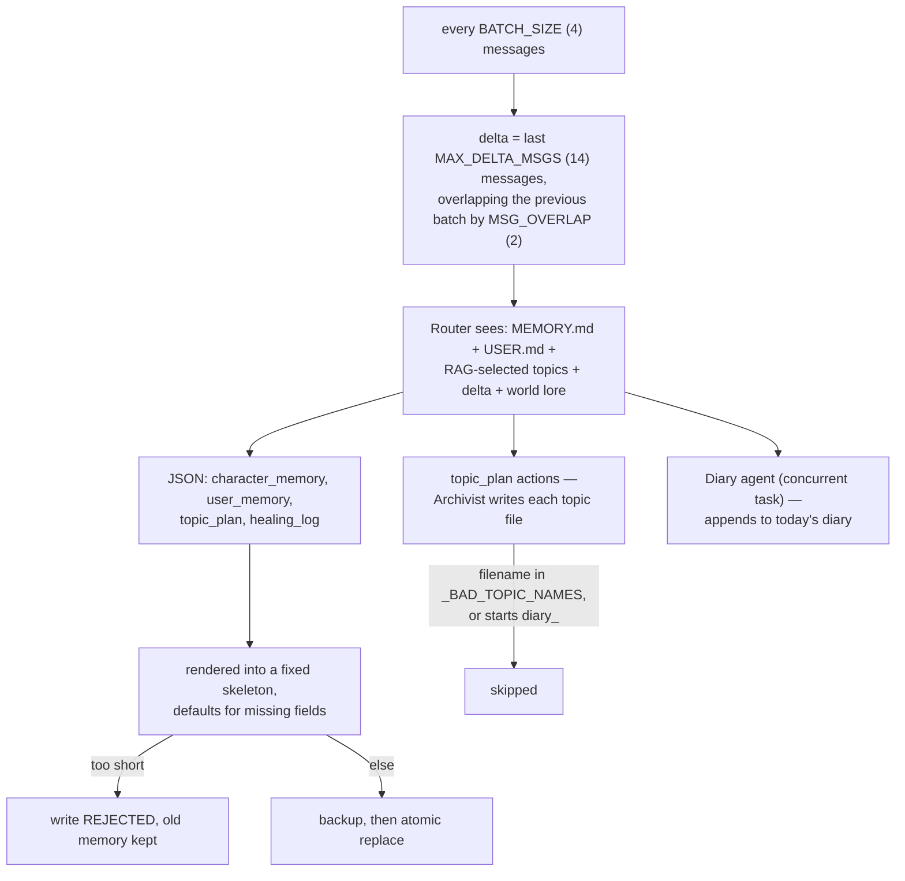
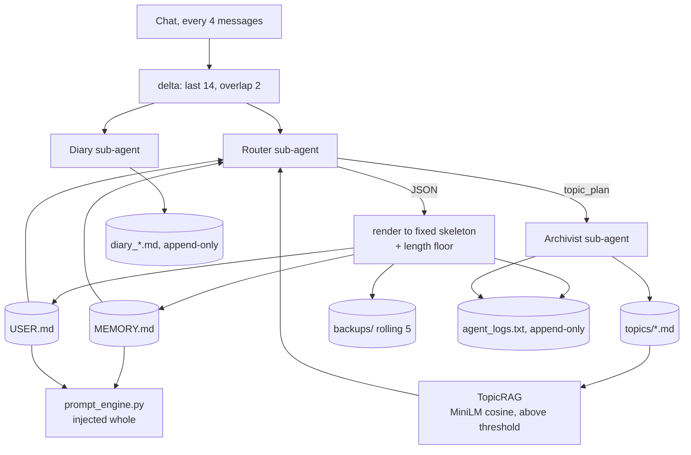

## 1. Executive Summary

Soul of Waifu is a desktop AI companion, GPL-3.0, and its `SoulMemoryAgent`
(`app/utils/soul_memory.py`, 1,031 lines) is a more careful piece of engineering
than its context suggests. It is a **full-rewrite Markdown memory** — the riskiest
shape in this atlas, since an LLM regenerates the whole store on a schedule — and
almost every mechanism in it exists to make that shape survivable:

- **Degenerate output is rejected, not stored.** An index rewrite shorter than
  `MIN_INDEX_CHARS = 100` is refused with *"Keeping old memory"* (`:373-380`);
  topics and the user profile have a 50-character floor. A model that returns a
  shrug does not erase what it was asked to update.
- **The LLM fills slots; the code writes the file.** The Router returns JSON, and
  `_parse_router_response` (`:488`) renders it into a fixed Markdown skeleton with
  a default for every field. A partial or malformed response degrades to defaults
  rather than corrupting the document.
- **Every index write is backed up first**, five deep, rolling (`:357-371`), and
  writes go through a temp file and an atomic `replace` (`:385-388`).
- **Contradictions are logged.** The Router prompt instructs it to *"Resolve any
  direct contradictions between user action and previous beliefs, and document
  this in the `healing_log`"* (`:128`), and that log is appended to a timestamped
  `agent_logs.txt` alongside every index, profile and topic mutation
  (`:846`, `:853`, `:925`). That earns `audit_log`.
- **Hallucinated filenames are filtered.** `_BAD_TOPIC_NAMES` (`:290`) blocks
  `example.md`, `topic_name.md`, `untitled.md` and four more — the placeholder
  names the prompt's own examples teach the model to emit. Diary files are
  separately protected from the Archivist (`:900`).

And then the finding that gives this report its title. `restore_backup` (`:1005`)
is correct — it backs up the current state *before* restoring, so a restore is
itself undoable — and `list_backups`, `list_topic_files` and `get_memory_stats`
are all implemented. **None of them has a caller anywhere in the application.**
The only `restore_backup` calls in the repository belong to `backend_updater.py`,
an unrelated class. The rollback primitive that the security survey [read for this atlas](../../compare/) reports
as "largely absent" from the literature is implemented here, correctly, and
unreachable.

## 2. Mental Model

A memory is one of four Markdown documents, and they have genuinely different
lifecycles — which is the design's best idea:

| File | Written by | Lifecycle |
| --- | --- | --- |
| `MEMORY.md` | Router | overwritten wholesale, backed up first |
| `USER.md` | Router | overwritten wholesale, no backup |
| `topics/*.md` | Archivist | overwritten per subject, no backup |
| `diary_*.md` | Diary | **append-only**, never rewritten |

The state machine is short because there is only one transition: **a memory is
rewritten, or it is not.** There is no supersession, no expiry, no decay of a
record, and **no deletion of anything** — not of topics, not of diary entries,
not of backups beyond the rolling five. A fact enters the index and stays until a
later rewrite happens not to carry it forward, silently.

The index does model decay, but of the character's *mood*, not of belief:
`Emotional Decay Counter: N/3` is a field the Router maintains inside the
document. The whole index is explicitly a **psychological state cache** — core
identity, primary emotion and intensity, psychological tension, active agenda,
unresolved cognitive dissonance. This is memory as characterisation, not as
knowledge, and it should be read that way.

Four modes (`soul_memory_mode`) trade cost against depth: Full runs all three
sub-agents; Index+Diary drops topics; Index only drops the diary too; Diary only
runs nothing but the diary.

## 3. Architecture

Python with a Qt desktop GUI. No server, no database, no queue — the store is a
directory tree, which makes it one of the most operationally trivial systems in
this atlas.

### Deployment and ergonomics

- **What has to be running:** the app. Storage is `.soul/<character>/chats/<chat>/memory/`.
- **Local and offline: yes**, including embeddings — `all-MiniLM-L6-v2` on CUDA
  if available, CPU otherwise (`:37-47`).
- **Degrades rather than fails when a dependency is missing.** If
  `sentence-transformers` is not installed, `_check_embedder_available` logs the
  `pip install` line once and topic selection falls back to taking the first N
  files (`:79-82`). Below `RAG_THRESHOLD` files it skips embeddings entirely and
  passes everything. Three fallback layers on the retrieval path, all logged.
- **Hand-repairable: entirely.** The store is Markdown a person can open, and the
  log next to it says what the model did to it.

## 4. Essential Implementation Paths

Everything below is `app/utils/soul_memory.py` unless noted.

**Paths and scoping.** `get_memory_paths` (`:310`) sanitises the character name
and chat id into a filesystem path, creates the directories, and touches
`MEMORY.md` and `USER.md` if absent. Falls back to `current_chat` from config,
then to `"default"`.

**Retrieval.** `class TopicRAG` (`:50`): `_load_all_topics` (`:58`),
`get_relevant_topics` (`:69`) — return everything if at or below
`RAG_THRESHOLD` files; otherwise embed the first `EMBED_CHARS` of each file,
cosine against the query with an explicit `1e-9` norm guard, take the top
`max_topics` (default 3), truncate each to `PASS_CHARS`. Logs which files it
selected out of how many.

**The write pipeline.** `_call_router_agent` (`:441`) assembles the index,
profile, RAG-selected topics, delta messages and triggered world lore into one
prompt, choosing `_ROUTER_SYSTEM` or `_ROUTER_SYSTEM_LITE` by mode.
`_parse_router_response` (`:488`) strips code fences, parses JSON, and builds the
Markdown; on a parse failure it falls back to a regex for
`[UPDATE_INDEX_START]...[UPDATE_INDEX_END]` (`:588`) — a second output format
kept for when the model ignores the first.

**Guarded writes.** `_safe_write_index` (`:373`), `_safe_write_topic` (`:395`),
`_safe_write_user_profile` (`:425`) — each checks a length floor, writes to
`.tmp`, and `replace`s. `_backup_index` (`:357`) copies with `copy2` to a
timestamped name and prunes to `MAX_BACKUP_COUNT = 5`.

**Topic actions.** `:885-930` — sanitise the filename to alphanumerics, force
`.md`, skip if in `_BAD_TOPIC_NAMES`, skip if it starts with `diary_`, read any
existing content, call the Archivist, extract between
`[TOPIC_CONTENT_START]` and `[TOPIC_CONTENT_END]`, write, log.

**Diary.** `_update_daily_diary` (`:676`) — a first-person reflection appended
under a `**[HH:MM]**` heading to `diary_<date>.md`, requiring more than 20
characters, launched as a concurrent `asyncio` task (`:864`) and awaited at the
end (`:878`).

**Audit log.** `_append_log` (`:938`) opens in `"a"` mode and writes
`[timestamp] MESSAGE`. Callers: `INDEX_UPDATE | status=… | healing: …` (`:846`),
`USER_PROFILE_UPDATE | status=…` (`:853`), `TOPIC_CREATED|TOPIC_UPDATED | file=… |
write=…` (`:925`). No rotation and no truncation anywhere.

**Injection.** `app/utils/ai_clients/prompt_engine.py:425-443` — the index is
injected as `[CHARACTER PSYCHOLOGY & COGNITIVE CACHE]` and the profile as
`[USER PROFILE & RELATIONSHIP HISTORIC METADATA]`. Note it constructs
`SoulMemoryAgent(None)` (`:428`) — a read-only instance with no LLM function,
which is a neat way to reuse the path logic without the ability to write.

**Concurrency.** `_get_lock` (`:300`) keeps an `asyncio.Lock` per
`character::chat`. The dict is never pruned.

**Unreachable API.** `restore_backup` (`:1005`), `list_backups` (`:1025`),
`list_topic_files` (`:985`), `get_memory_stats` (`:957`) — no callers.

## 5. Memory Data Model

There is no schema in the storage sense; the schema lives in
`_parse_router_response`, which is the more interesting place for it. The Router
must return JSON shaped as `character_memory` (core identity, internal state,
cognitive drive, cognitive dissonance), `user_memory` (identity and status,
relationship metadata, preferences, shared milestones and promises), `topic_plan`
and `healing_log` — and the code renders exactly those headings with a default
for each missing field.

**The consequence is worth stating for anyone building on an LLM rewrite:** the
model cannot invent a section, cannot drop a section, and cannot emit prose where
a list belongs. The document's shape is a property of the code, not of the
generation.

`trust_level` appears under relationship metadata, and it is **not** the atlas's
`trust_state` — it records how much the character trusts the user, roleplay
state, not confidence in a stored claim. **`trust_state` is withheld.**

No provenance: nothing records which messages produced which line of the index,
which is the field [RisuAI](../risuai/) added in its second generation and the
one that would make deletion meaningful here.

No temporal fields except the diary's date and the backups' timestamps. No
versioning of individual claims — the backups version the whole document, which
is coarse but real.

**Scoping** is the filesystem path: `.soul/<character>/chats/<chat>/memory/`.
Reads derive their path from the same `get_memory_paths`, so a character cannot
read another character's memory. But there is no principal — no user, tenant or
agent key — because the deployment is one person's desktop.
**`scope_enforced` is withheld** on the same basis as
[SillyTavern](../sillytavern/) and [RisuAI](../risuai/).

## 6. Retrieval Mechanics

Two paths with different characters.

**The index and profile are not retrieved at all — they are injected whole**,
truncated at 5,000 and 3,000 characters respectively (`:348`, `:416`) with a
`[MEMORY TRUNCATED]` marker. There is no selection, so there is no relevance
question and no under-recall: whatever is in the file is in the prompt. The cost
is a fixed token bill every turn and a hard ceiling on how much a character can
know, enforced by truncating the *end* of the file — so the last sections
written are the first lost.

**Topic files are retrieved**, by `TopicRAG`, and the tiering is sensible in
shape but generous in its constants: `RAG_THRESHOLD = 4`, `EMBED_CHARS = 600`,
`PASS_CHARS = 8000`. At four topic files or fewer the embedder is skipped and
everything is passed; above that, only the first 600 characters of each file are
embedded, and the top three selected files are passed at up to 8,000 characters
each.

Two consequences follow from those numbers. Ranking on a 600-character prefix
makes a long topic file compete on its opening paragraph — tolerable here, since
the Archivist writes topic files to a consistent shape, but it means a fact
buried at the end of a file is invisible to selection. And selecting three files
at 8,000 characters apiece admits up to 24,000 characters of topic material into
a prompt that also carries the index and profile, so the ceiling on this
system's per-turn context is set by a constant that reads like an upper bound
rather than a budget.

Failure modes: the index is a summary of a summary of a summary, since each
rewrite reads only the previous version plus fourteen messages, so anything not
carried forward is gone with no record; topic files are selected against the
*current query* rather than the delta being summarized; and the 5,000-character
truncation is silent to the model, which sees a marker but not what was cut.

## 7. Write Mechanics

Writes are **batched and inline**: every `BATCH_SIZE = 4` messages the pipeline
runs, taking the last `MAX_DELTA_MSGS = 14` messages with `MSG_OVERLAP = 2`
carried over from the previous batch. The overlap is a small, deliberate choice —
a fact stated across a batch boundary appears in both windows, so it is not lost
to the seam.

Two to three LLM calls per batch in Full mode: Router, then one Archivist call
*per topic action* (sequential, in a loop), and a Diary call launched
concurrently. There is no queue and no rate limiter — a Router that plans five
topic actions issues five sequential model calls inside the batch.

**There is no delete path of any kind.** No topic file is ever removed, no diary
entry retracted, no line of the index tombstoned. The Router's `healing_log` is
the nearest thing to correction, and it is a *description* of a contradiction it
resolved, written to a log rather than a record keyed on the rejected value.
`tombstone` is withheld. But a logged contradiction resolution is more than most
systems here produce, and it is durable.

Malicious input is unfiltered — chat text reaches the Router, whose output becomes
a system-injected document. The length floors and the fixed skeleton bound the
*damage* (a hostile message cannot empty the memory or invent a section) without
addressing the *content*.

### Operational cost

- **The write path is batched but not deferred** — the pipeline runs inline every
  four messages, so every fourth turn pays for a Router call plus one call per
  topic action.
- **The lag to retrievability is up to four messages**, deterministically.
- **No background pass re-reads the whole store.** Cost scales with activity, not
  with corpus size — the index rewrite reads only the previous index, not its
  history, which is exactly why it loses things.
- **On the read path the injection is unbounded by tokens** and bounded only by
  the 5,000 + 3,000 character truncations, injected as a system block whose
  contents change every four messages.

## 8. Agent Integration

None. There is no API, no MCP server and no tool interface; `prompt_engine.py`
reads two files and concatenates them into the system prompt. The model has no
agency over its own memory beyond being the thing that rewrites it when called.

The transferable piece is not an interface but the `SoulMemoryAgent(None)`
construction — instantiating the memory manager without an LLM function to get a
read-only view. A memory class that is inert without its generator is a cheap way
to make read paths structurally unable to write.

## 9. Reliability, Safety, and Trust

**The write guards are the story, and they are the right guards for this shape.**
A system where an LLM regenerates the entire memory each cycle has one
catastrophic failure — the model returns something empty, truncated or malformed,
and the memory is gone. Three mechanisms address exactly that: a length floor
that refuses the write, a fixed skeleton that defaults missing fields, and a
backup taken before the replace. Most systems in this atlas that rewrite whole
documents have none of the three.

**Atomicity is handled**: temp file plus `replace`, with the temp unlinked on
error. A crash mid-write leaves the previous version intact.

**`audit_log` is earned.** `agent_logs.txt` lives in the memory directory, is
opened append-only, is never rotated or truncated, and records every index,
profile and topic mutation with a timestamp, a write status, and — for the index —
the Router's account of which contradictions it resolved. That last part is
unusual: most audit logs in this atlas record *that* a memory changed, not *how a
conflict was settled*.

**Rollback exists and is unreachable.** `restore_backup` is written correctly,
including backing up the current state before overwriting it. Nothing calls it.
A user whose memory has been degraded by a bad rewrite has five good backups on
disk and no way to use them from the product. This is the gap most worth
closing, and it is a UI task, not a memory task.

**No trust model, no provenance, no uncertainty.** The index is prose asserted by
a model, injected as fact.

**Prompt injection is unaddressed** in content, bounded in structure — see
section 7.

**`USER.md` is not backed up** although `MEMORY.md` is, and both are rewritten by
the same call with the same failure modes. That asymmetry looks like an oversight
rather than a decision.

## 10. Tests, Evals, and Benchmarks

**No test suite exists in the repository** — no `tests/` directory, no
`test_*.py`, nothing.

That is the same finding as [RisuAI](../risuai/) but with a sharper edge, because
the invariants here are unusually easy to state and unusually cheap to assert:

- A router response of `""` leaves `MEMORY.md` unchanged.
- A router response of 99 characters leaves `MEMORY.md` unchanged; 101 replaces
  it.
- A malformed JSON response produces a document with every heading present.
- A `topic_plan` naming `example.md` writes no file.
- A `topic_plan` naming `diary_2026-07-29.md` writes no file.
- After six index writes, exactly five backups exist.
- `restore_backup` restores the named file and leaves a backup of what it
  replaced.

Every one of those is a behaviour the code deliberately implements, several of
them guarding against a total loss of memory, and none is asserted anywhere.
`negative_eval` is withheld; the `_BAD_TOPIC_NAMES` filter is precisely a
must-not-be-written rule and it has no test.

No benchmarks, and none in [this atlas's survey](../../benchmarks/) would apply.

## 11. For Your Own Build

### Steal

- **Put a length floor on any LLM-generated overwrite.** *"Index write rejected —
  content too short. Keeping old memory"* is four lines of code and it is the
  difference between a bad turn and a lost character. If your model rewrites a
  document, refuse the write rather than trusting the generation.
- **Have the model fill a schema and let your code render the document.** JSON in,
  fixed skeleton out, a default per field. The model cannot then drop a section,
  invent one, or emit prose where a list belongs.
- **Blocklist your own prompt's example filenames.** `_BAD_TOPIC_NAMES` is a list
  of the placeholder names a model emits when it copies the instructions instead
  of following them — `example.md`, `untitled.md`, `topic_name.md`. Everyone who
  asks a model to name files hits this; almost nobody writes it down.
- **Give append-only and rewritable memory different files.** The diary is never
  rewritten and is explicitly protected from the agent that rewrites topics. One
  store per lifecycle is clearer than one store with a mode flag.
- **Overlap your batches.** `MSG_OVERLAP = 2` costs two messages of context and
  removes the seam where a fact stated across a boundary is summarized by neither
  pass.
- **Log how a contradiction was resolved, not just that memory changed.** The
  `healing_log` line in the audit trail is the most reviewable artifact in this
  system.
- **Back up before restoring.** `restore_backup` takes a backup first, so a
  restore is undoable. Rollback that is itself irreversible is a trap.

### Avoid

- **Building a rollback API with no caller.** Backups, restore, listing and stats
  are all implemented here and none is reachable from the product, which makes
  them cost without benefit. Ship the button or delete the code.
- **Rewriting a document from its previous version plus a small window.** Each
  cycle reads the last index and fourteen messages, so anything the model does
  not carry forward is gone with no record that it existed. This is chained lossy
  summarization wearing a schema.
- **Backing up one of two files written by the same call.** `MEMORY.md` is
  protected and `USER.md` is not, for no reason visible in the code.
- **Truncating the tail of an injected document silently.** Cutting at 5,000
  characters removes the most recently written sections first, and the model sees
  only a marker.

### Fit

This suits exactly what it is: one person, one desktop, a character whose
consistency matters more than factual recall. Within that, the design is
well-judged — no services to run, a store you can read in a text editor, local
embeddings that degrade gracefully to no embeddings, and guards in the places
where an LLM-rewritten memory actually breaks.

It is the wrong shape for anything that must answer questions about the past.
There is no retrieval over history, no provenance, no deletion, and the index
forgets by omission. If your users will ask *"what did I tell you about X"*, this
architecture cannot answer, and adding retrieval to it means adding the store it
does not have.

The reason to read it even if neither applies: it is the clearest small example
in this atlas of **how to make a full-rewrite memory safe**, and those guards
transfer to any system where a model regenerates a document.

## 12. Open Questions

- **Why is the backup and restore API unreachable — was it removed from the GUI,
  or never wired up?** The commit history would say, and it determines whether
  this is a regression or unfinished work.
- **Were `PASS_CHARS = 8000` and `RAG_THRESHOLD = 4` chosen together?** Three
  files at 8,000 characters is a large injection, and at four files or fewer
  nothing is filtered at all; whether anyone measured the resulting prompt size
  is not visible.
- **Does the `_locks` dict leak?** One `asyncio.Lock` per `character::chat` is
  created on demand and never removed; harmless on a desktop, worth knowing.
- **What happens when the index passes 5,000 characters in normal use?** The
  truncation is silent to the model and cuts the newest sections; whether users
  reach it depends on how verbose the Router is over months.
- **Is `MSG_OVERLAP = 2` enough at `BATCH_SIZE = 4`?** Half the batch is overlap
  already, which is a high ratio; whether it was tuned or guessed is not visible.

## Appendix: File Index

**Memory system** — `app/utils/soul_memory.py`

- Embedder availability and loading (21–47)
- `TopicRAG` (50), `_load_all_topics` (58), `get_relevant_topics` (69)
- Router prompts, contradiction instruction (128), lite mode (183)
- Archivist prompt (233), Diary prompt (252)
- `SoulMemoryAgent` (266), constants and `_BAD_TOPIC_NAMES` (284–293)
- `_get_lock` (300), `_sanitize` (306), `get_memory_paths` (310)
- `_read_index` with truncation (342), `_backup_index` (357)
- `_safe_write_index` with the length floor (373), `_safe_write_topic` (395)
- `_read_user_profile` (410), `_safe_write_user_profile` (425)
- `_call_router_agent` (441), `_parse_router_response` (488), regex fallback (588)
- `_call_archivist_agent` (594)
- `_update_daily_diary` (676)
- Batch pipeline, delta and overlap (793–795), audit-log calls (846, 853, 925)
- Topic action handling, name filtering, diary protection (885–930)
- `_append_log` (938), `get_full_memory_context` (945)
- Unreachable API: `get_memory_stats` (957), `list_topic_files` (985),
  `restore_backup` (1005), `list_backups` (1025)

**Injection**

- `app/utils/ai_clients/prompt_engine.py` — `is_soul_memory_enabled` (60),
  read-only agent construction and injection (425–443)

**Tests**

- None.
