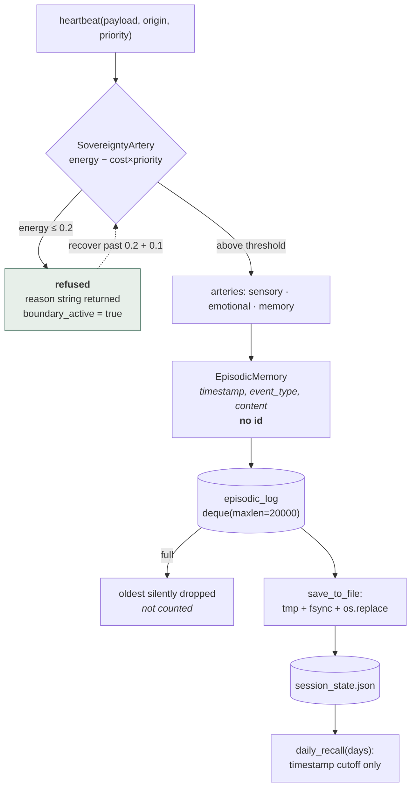

## 1. Executive Summary

AMITY is a 634-line Python module — Apache-2.0, nineteen commits — presenting
itself as *"Full Sensory AI with Persistent Episodic Memory"*. It models a
runtime as a circulatory system: packets are contracted by an `Orchestrator8`
and distributed to arteries for sensory data, emotion, memory and sovereignty,
with a `SessionManager` owning the durable state.

It qualifies for this atlas narrowly and genuinely. `SessionState` carries an
`episodic_log`, `save_to_file` persists it, `load_from_file` restores it, and
`daily_recall` reads it back, so something is stored and retrieved after the
session ends.

**Its one distinctive idea is refusal, and it is implemented rather than
described.** `SovereigntyArtery` is documented in the source as *"The capacity to
say no."* Every heartbeat costs energy scaled by priority; below a boundary
threshold the runtime enters refusal mode and stays there until recovery clears
the threshold **plus a margin**. Running the shipped demo:

```text
Result: {'status': 'refused',
         'reason': 'Energy depleted (0.05). Boundary active. Minute requested.',
         'origin': 'sensory', 'priority': 3}
```

A refusal that returns a reason a caller can read, with hysteresis so the system
cannot flap across the boundary, is a real mechanism and the reason this report
is worth writing.

**The memory underneath it cannot be corrected, because an episode has no
identity.** `EpisodicMemory` is a timestamp, an `event_type` string and a free
`content` dict — no id, no key, no version. Across the whole module there is no
`update`, `delete`, `forget`, `supersede` or `edit`. An episode is addressable
only by its position in a bounded deque, which means the correctable identity
this atlas's qualification test asks about is exactly the thing that is absent.
The system can remember and it cannot be wrong about anything in a way it could
act on.

**Two smaller things are checkable and both fail at HEAD.** `pyproject.toml` is
invalid TOML — `Cannot declare ('tool', 'setuptools', 'packages', 'find') twice`
— so the README's first quickstart instruction, `pip install -e .`, cannot
succeed, and `pytest` cannot even collect from the repository root because it
reads the same file. And a 634-line `amity.py` sits at the repository root
**byte-identical** to `src/amity/archangel8.py`, shadowing the package, so the
tests cannot import their subject even with `PYTHONPATH=src`.

Run from outside the repository with the package path supplied directly, the
three committed tests pass in 0.03 s. They are a working suite that no
straightforward invocation from inside the project can reach.

## 2. Mental Model

An episode enters only if the runtime has the energy to accept it, and once in,
it is immutable, unaddressable, and eventually evicted without a record.



The dotted edge is the hysteresis and the shaded node is the idea. Everything
below `EP` is the gap: no branch leaves the deque except eviction, and no arrow
points back into an episode to change it.

Set against the rest of this atlas, the shape is unusual. Most systems here can
write a correction and fail to make it stick. This one cannot express a
correction at all, and instead spends its design budget on whether to accept the
write in the first place — which is the same problem approached from the only
other side.

## 3. Architecture

One module, no dependencies beyond the standard library. `RingBuffer` for
fixed-capacity float telemetry; `SensorReading` and `EpisodicMemory` as
dataclasses with `to_dict`/`from_dict` round-trips; `SessionState` holding both
deques plus counters; `CirculatoryPacket` with a freshness check; four
`SectorInterface` implementations (sensory, emotional, memory, sovereignty);
`Orchestrator8` to contract, distribute and adjust; `SessionManager` to own
state, persistence and an optional save thread.

Alongside the code: `Philosophy.md`, `Code_of_conduct.md` and
`Emotional_protocols.md`, plus release notes for v1.3.0 and v1.3.1.

### Deployment and ergonomics

Intended as `pip install -e .` and then `from amity.archangel8 import
SessionManager`. That path does not work at this commit — see below — but
`PYTHONPATH=src python3 examples/archangel8_demo.py` runs the demo end to end
and writes `session_state_v131.json`.

The declared constraint worth naming is the covenant: `SessionState.__post_init__`
raises unless a `pilot_signature` is supplied, with the message *"AMITY cannot
initialize without a named covenant."* A store that refuses to exist
anonymously is a design position, and it is enforced in code rather than
documented.

## 4. Essential Implementation Paths

### Refusal with hysteresis, and a reason

```python
cost = self.depletion_rate * (1.0 + packet.priority_tier / 10.0)
self.energy = max(self.hard_floor, self.energy - cost)

if self.energy <= self.boundary_threshold:
    self.boundary_active = True
elif self.boundary_active and self.energy > self.boundary_threshold + 0.1:
    self.boundary_active = False
```

Three properties are worth separating. Cost **scales with priority**, so
high-priority work depletes the budget faster rather than bypassing it — the
opposite of the usual arrangement, and defensible for a system whose thesis is
that urgency is what exhausts you. The clearing condition requires
`threshold + 0.1`, so the runtime cannot oscillate across the boundary on a
single noisy reading; this is the same instinct as
[retrieval hysteresis](../../patterns/retrieval-hysteresis/), applied to
admission rather than to recall. And there is a `hard_floor` below which energy
cannot fall, so a depleted system still has a defined state rather than a
negative one.

The refusal is returned, not raised, and it carries `reason`, `origin` and
`priority`. A caller can tell a refusal from a failure and from an empty result,
which is the distinction most systems in this atlas blur when a write does not
land.

### Persistence done carefully

```python
with tempfile.NamedTemporaryFile('w', delete=False, dir=dirname, ...) as tmp:
    json.dump(data, tmp, indent=2)
    tmp.flush()
    os.fsync(tmp.fileno())
    tmp_path = tmp.name
os.replace(tmp_path, path)
```

Temp file in the same directory, flush, `fsync`, atomic rename, and the temp file
cleaned up on failure. For a 634-line project this is more care than several
much larger systems here take with their canonical store, and it means an
interrupted save cannot truncate the memory.

### An episode with nothing to hold on to

`EpisodicMemory` is `timestamp`, `event_type`, `content`. `add_episode` appends
under a lock and stamps `last_update`. `daily_recall` filters the deque by a
timestamp cutoff.

That is the entire memory surface. There is no id, so nothing can be referenced;
no `update` or `delete`, so nothing can be changed or removed; no status,
provenance or confidence, so nothing can be doubted. Two episodes with identical
content are two episodes.

The consequence for this atlas's central question is unusually clean. Asking
"what happens when a stored memory turns out to be wrong?" has no answer here —
not a bad answer, no answer. The design has no place to put one, and the honest
reading is that episodic memory in this system is a **log of what happened**
rather than a store of what is true, which is a coherent thing to build and a
different thing from what "Persistent Episodic Memory" implies to a reader
arriving from the rest of this corpus.

### The overflow that is counted, and the one that is not

```python
def add_sensor_reading(self, reading: SensorReading):
    if len(self.state.sensory_samples) == self.state.sensory_samples.maxlen:
        self.state.buffer_overflow_count += 1
    self.state.sensory_samples.append(reading)

def add_episode(self, episode: EpisodicMemory):
    self.state.episodic_log.append(episode)
```

Sensory telemetry is capped at 1,000 and its loss is **instrumented**. Episodic
memory is capped at 20,000 and its loss is **silent** — no counter, no log line,
no field in the persisted state.

The asymmetry is the sharpest small finding here, because it is backwards from
what the system claims to value. A dropped temperature reading increments a
counter that survives into the JSON; a dropped memory leaves no trace anywhere,
so a session that has been running long enough to evict cannot tell you that it
has forgotten anything. Given the deque is the whole store, the number of
forgotten episodes is the one operational statistic a persistent episodic memory
most needs, and it is the one not kept.

## 5. Memory Data Model

`SessionState`: `version`, `pilot_signature`, `session_start`, `last_update`,
`sensory_samples` (deque, maxlen 1000), `episodic_log` (deque, maxlen 20000),
`sample_count`, `buffer_overflow_count`. Round-tripped through `to_dict` and
`from_dict`, persisted as one JSON document. A written file confirms the shape:
eight keys, eleven episodes after the demo, each `{timestamp, event_type,
content}`.

Measured against this atlas's rubric, every mark is absent and for one shared
reason: the unit has no identity. No tombstone, no trust state, no bi-temporal
validity, no audit of mutations — because there are no mutations. No scope key
on a read path; `pilot_signature` names the session but is never a filter. No
human review surface. No committed evaluation asserting anything must not be
retrieved.

The near-miss worth recording is `pilot_signature` itself. It is required, it is
persisted, and it is the closest thing here to a scope — but nothing consults it
when recalling, so it identifies the covenant rather than partitioning the
memory.

## 6. Retrieval Mechanics

`daily_recall(days=1)` computes `time.time() - days*86400` and returns every
episode at or after that cutoff. There is no query, no keyword match, no ranking,
no embedding and no limit — a caller asking for a week gets a week.

For a companion runtime with a 20,000-episode ceiling this is defensible: the
whole store fits in memory and a time window is a legible way to slice it. It
also means recall cost grows linearly with the window, and that "recall" here is
closer to *replay* than to retrieval — nothing selects for relevance, so
whatever the caller does with the returned list is where selection happens.

## 7. Write Mechanics

Synchronous and in-process, under a lock. `heartbeat` contracts a packet,
distributes it to the arteries, and returns either a metrics dict or a refusal.
`rest(duration_sec)` recovers energy. `start_periodic_save` spawns a daemon
thread that persists on an interval, and the README is explicit that importing
the module starts nothing — *"SessionManager.start_periodic_save needs to be
called explicitly"* — which is the right default for a library.

### Operational cost

No model, no network, no database, no dependencies. The cost is bounded memory —
two deques with fixed maxlens — plus one JSON write per save, of the whole state
each time. At 20,000 episodes that file grows into the megabytes and is rewritten
in full on every periodic save, which is the scaling limit worth naming.

## 8. Agent Integration

None. There is no MCP server, no tool schema, no framework adapter and no prompt
surface — this is a Python library a program calls. The three companion documents
describe the intended relationship rather than an integration contract.

That is not a gap so much as a scope statement, and it places AMITY closer to the
companion-and-roleplay end of this atlas than to the agent-memory end: the design
questions it answers are about what a system owes its user, not about what an
agent can retrieve.

## 9. Reliability, Safety, and Trust

Strengths:

- **A refusal that is metered, hysteretic and legible** — cost scales with
  priority, clearing requires a margin above the threshold, and the caller gets a
  reason string.
- **A hard floor** so a depleted runtime has a defined state.
- **Atomic persistence** with temp file, `fsync`, rename and cleanup on failure.
- **A required covenant** enforced in `__post_init__` rather than documented.
- **No background threads on import**, stated and true.
- **Overflow instrumented on the sensory path**, with the counter persisted.

Gaps:

- **Episodes have no identity**, so nothing can be updated, removed, superseded
  or doubted — the correction question has no place to be asked.
- **Episodic eviction is silent**, uncounted and unpersisted, in the one buffer
  whose contents are the product.
- **`pyproject.toml` is invalid TOML**, so the documented install cannot run and
  `pytest` cannot collect from the repository root.
- **A root `amity.py` duplicates the packaged module byte for byte** and shadows
  it, so the tests cannot import their subject from inside the project.
- **Version drift** — `pyproject.toml` says `1.3.0`, `SessionState.version`
  defaults to `"1.3.1"`, and both have release notes.
- **`daily_recall` is unbounded**, returning everything inside the window.

## 10. Tests, Evals, and Benchmarks

Three tests, 49 lines, and they pass — in 0.03 s, run from outside the repository
with the package directory supplied on `PYTHONPATH`.

They cannot be run any other way at this commit. From the repository root,
`pytest` reads `pyproject.toml` and aborts during collection on the duplicate TOML
key. Supplying `-c /dev/null` to skip the config gets past that and then fails
with `ModuleNotFoundError: No module named 'amity.archangel8'; 'amity' is not a
package`, because the root `amity.py` is found first.

Two separate defects, each independently sufficient to make the suite
unreachable, and both invisible unless someone runs it. The README compounds the
picture by describing the tests as *"not present yet; to be added"* while the file
is committed and passing — documentation stale in the direction that undersells
the work.

There is no benchmark, and nothing to benchmark; there is no retrieval quality to
measure when recall is a timestamp filter.

## 11. For Your Own Build

### Steal

- **Return a refusal with a reason.** `{'status': 'refused', 'reason': 'Energy
  depleted (0.05). Boundary active.'}` lets a caller distinguish a refusal from a
  failure from an empty result, which is the distinction most stores lose when a
  write does not land.
- **Put hysteresis on any boundary you cross repeatedly.** Clearing at
  `threshold + margin` rather than at `threshold` is two characters of code and
  removes an entire class of flapping.
- **Make cost scale with priority** if your goal is to model exhaustion rather
  than throughput. Letting urgent work bypass the budget defeats the mechanism.
- **Write your canonical file atomically** — temp file in the same directory,
  `fsync`, `os.replace`, and remove the temp on failure. This is the whole of it,
  and larger projects here skip it.
- **Refuse to initialize without the identity you require**, in the constructor,
  rather than defaulting it and hoping.

### Avoid

- **A memory unit with no identifier.** Everything downstream — correction,
  deduplication, provenance, deletion — needs something to name, and adding an
  id later means migrating every persisted file.
- **Counting the overflow you can afford to lose and not the one you cannot.**
  If a bounded buffer holds the product, the eviction count is the statistic that
  matters most.
- **Shipping a module twice.** A root copy that shadows the packaged one makes
  the tests unrunnable and guarantees the two drift; they are identical today and
  nothing keeps them so.

### Fit

Read it for the sovereignty artery. Refusal as a first-class, metered,
explainable outcome is genuinely uncommon in this corpus, and the implementation
is small enough to absorb in one sitting — the hysteresis, the priority-scaled
cost and the hard floor are three good decisions in forty lines.

Do not adopt it as a memory. The episodic log has no identity, no query and no
correction path, and at this commit the package does not install. What it offers
is one mechanism worth copying and a clear demonstration of what a store looks
like when the unit cannot be named.

## 12. Open Questions

- Will an episode get an id? Everything the rest of this atlas measures depends
  on it, and adding one after files exist in the wild is a migration.
- Should episodic eviction increment a counter the way sensory overflow does, and
  should the count be persisted?
- Is the root `amity.py` intentional, or a merge artifact? `MERGE_NOTE.txt` lists
  the packaged paths and does not mention it.
- Which version is authoritative — `1.3.0` in the manifest, or `1.3.1` in the
  code and the saved state?
- Is `pilot_signature` meant to scope recall eventually, or only to name the
  covenant?
- What is the intended relationship between `Emotional_protocols.md`'s Code 9
  spec and the `EmotionalArtery` in code? The document is considerably more
  specified than the class.

## Appendix: File Index

- Core: `src/amity/archangel8.py` (`RingBuffer`, `SensorReading`,
  `EpisodicMemory`, `SessionState`, `CirculatoryPacket`, `SensoryArtery`,
  `EmotionalArtery`, `MemoryArtery`, `SovereigntyArtery`, `Orchestrator8`,
  `SessionManager.add_episode`, `daily_recall`, `save_to_file`).
- Duplicate: `amity.py` at the repository root, byte-identical to the above.
- Demo: `examples/archangel8_demo.py`; tests: `tests/test_archangel8.py`.
- Packaging: `pyproject.toml` (invalid TOML at this commit).
- Documents: `Philosophy.md`, `Code_of_conduct.md`, `Emotional_protocols.md`,
  `MERGE_NOTE.txt`, `RELEASES/v1.3.0.md`, `RELEASES/v1.3.1.md`.
- Licence: `LICENSE` (Apache-2.0).

## History

**2026-08-04** — [`86018d651acb6500ea4d3c79acf5acbbaf547a76`](https://github.com/Renkasha/Sovereign/commit/86018d651acb6500ea4d3c79acf5acbbaf547a76) — first reading. The demo was executed and its refusal path observed; the persisted `session_state_v131.json` was read back to confirm the stored shape. `pyproject.toml` was confirmed invalid by `tomllib`, and the test suite was run successfully only from outside the repository root with `PYTHONPATH` pointing at `src` — three tests, 0.03 s — after establishing that both the TOML error and the root `amity.py` shadow independently prevent it running from inside.
