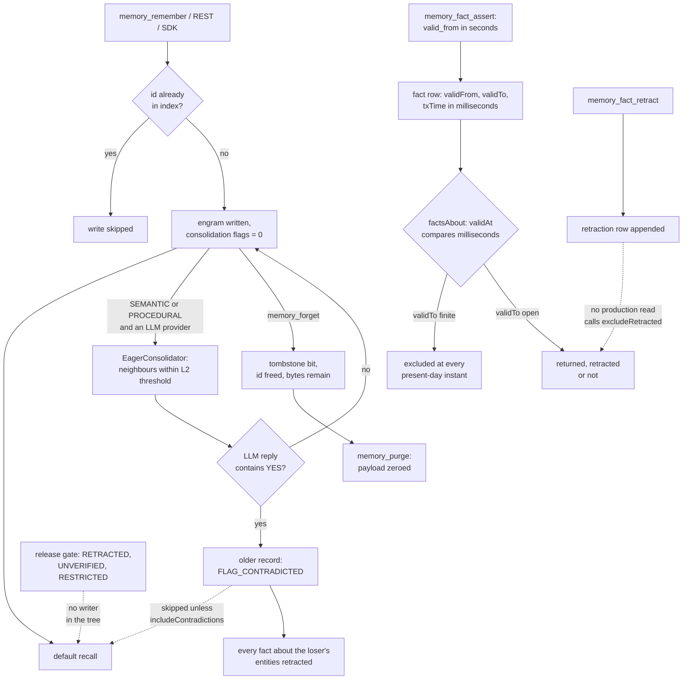

## 1. Executive Summary

Spector is a Java 25 memory engine for agents. It stores each memory as an
off-heap "engram" — a quantized vector with importance, valence, decay and two
flag bytes — and ranks recall with a fused SIMD score over similarity, importance
and a power-law decay, widened by BM25, SPLADE and a Hebbian and entity graph.
Beside the engrams sits a temporal knowledge graph of subject-predicate-object
facts with valid time and transaction time. It runs embedded, as a standalone MCP
server, or as the Synapse server with REST, gRPC and per-account namespaces.

What is notable is the deletion vocabulary and one working correction mechanism.
`memory_forget` tells the agent that the bytes remain on disk and names
`memory_purge`, which zeroes the payload and lists the copies it cannot reach.
A background consolidator asks an LLM whether two near-duplicate memories
contradict each other, flags the older one, and default recall skips it; a
committed test asserts exactly that.

What is weak is the fact plane and the declared-but-unwired governance. Valid time
is written in epoch seconds and compared in milliseconds. The fact read path never
excludes a retracted fact. A "fail-closed" release gate filters on retracted,
unverified and restricted flags that nothing in the tree sets.

The licence is Apache-2.0. The `NOTICE` adds that anyone using Spector *"MUST
provide visible attribution"*, with "Powered by Spector" text and a repository
link, and withholds permission to offer it as a SaaS product under another brand.
A reader deploying Spector should read both files.

Three marks: `trust_state` on the contradicted flag, `bitemporal` on the fact log
with the unit mismatch stated as its limit, and `negative_eval` on two committed
exclusion cases with positive controls. Section 9 names the four withheld.

## 2. Mental Model

Spector holds two kinds of belief and treats them differently.

**An engram becomes a belief when it is written.** `remember` embeds the text,
writes the record and indexes the id, with no candidate state. The id is the
identity: `DedupGuardRelay` refuses a second write under an id already in the
index (`DedupGuardRelay.java:41`), and nothing compares content at the door. The
source (`USER_STATED`, `OBSERVED`, `INFERRED` and six more) is a caller argument
carrying a declared weight (`MemorySource.java:34-77`), not a gate.

**An engram stops being a belief in five ways.** `forget` sets the tombstone bit
and removes the id from the index, so the same id can be written again
(`DefaultSpectorMemory.java:1132-1134`). `purge` also zeroes the payload.
Consolidation can mark it contradicted, or merge it with a duplicate into a new
`cns-` memory and tombstone both sources (`AbstractConsolidator.java:233-236`).
`suppress` hides it from recall until the process ends. Decay lowers its rank
but, by the README's formula, never below a floor.

**The contradicted flag is the only status the system moves.** After a SEMANTIC
or PROCEDURAL write, `EagerConsolidator` scans the tier for records within an L2
threshold and asks an LLM whether each pair contradicts
(`EagerConsolidator.java:229-296`). On a YES, `CadpContradictionResolver`
decides by timestamp, then storage strength, then id — newer wins — and sets
`FLAG_CONTRADICTED` on the loser (`CadpContradictionResolver.java:68-117`).
Default recall skips it.

**Simulated and dreamed traces are a genre, not a status.** Dream and
constructive-simulation relays write records with `FLAG_SIMULATED` or
`FLAG_DREAMED`, and recall withholds them unless `allowSimulated` is set. The
flag is fixed at write.

**A fact is a row in an append-only log.** `assertFactWithSupersession`
retracts every active fact with the same subject and predicate by appending a
retraction row, then appends the new fact (`TemporalKnowledgeGraph.java:348-378`).
A retraction never mutates the original. Whether a retracted fact stays hidden
depends on the reader, and no production reader asks.

## 3. Architecture

The Maven reactor has four tiers. `nucleus/` holds configuration, SIMD kernels, a
GPU path and a vector index. `memory/` holds `spector-kernel`, the off-heap
storage layouts, and `spector-memory`, the cognitive engine. `synapse/` holds the
MCP module, the Spring Boot server, the CLI, batch import and export, and
connectors. `cortex/` is an Angular dashboard.

Persistence is Panama `MemorySegment` regions in memory-mapped files, one bundle
per partition, under one directory per namespace, with a chunked write-ahead log
that `CheckpointEngine` truncates after each checkpoint (`CheckpointEngine.java:344`).
There is no external database; the `NOTICE` states that the core modules depend
on the JDK alone.

The recall pipeline is a chain of relays assembled in `RecallPathway`
(`RecallPathway.java:333-359`): query transduction, the governed release gate,
the cortical tier scan, neuromodulatory scoring, graph expansion with temporal
fact weaving, evidence fusion, lateral inhibition, BM25 and SPLADE fusion, RRF,
sort-and-truncate with suppression, optional ColBERT rerank, MMR and temperature
softmax. The AISME relays join the chain when `spector.memory.aisme.enabled` is
true, which it is not by default (`SpectorPropertyConstants.java:736`).

Background work runs on Quartz: sleep consolidation, REM dreaming, default-mode
wandering, homeostatic decay, graph enrichment every 30 seconds, index reconcile
and checkpoint (`QuartzMemoryScheduler.java:221-306`).

### Deployment and ergonomics

Embedded use needs JDK 25 with `--enable-preview` and the incubating Vector API
module, and an embedding provider (Ollama, ONNX, OpenAI and others under
`memory/spector-providers`). Contradiction detection and entity extraction need
an LLM provider; without one they do nothing. The standalone MCP runner starts an
in-process kernel or connects to a local daemon, and Docker Compose starts the
server and dashboard. The store is binary and not repairable by hand; the batch
exporter writes JSONL.

## 4. Essential Implementation Paths

**Write.** `DefaultSpectorMemory.remember` checks the `MutationPolicy`, chunks
long text, embeds, and calls `rememberPathway.ingestCognitive`
(`DefaultSpectorMemory.java:453-490`). The pathway runs `DedupGuardRelay`, tag
transduction, a surprise relay, `CorticalWriteTransactionRelay`, synaptic graph
linking and knowledge-graph enrichment. For SEMANTIC and PROCEDURAL writes it
then submits the id to `EagerConsolidator` (`:482-484`).

**Recall.** `DefaultSpectorMemory.recall` → `RecallPathway`. The tier scan's
`SlabScanner` skips tombstoned, contradicted and simulated records inside the
scan loop (`SlabScanner.java:75-98`); `SemanticRecallStrategy` and
`RecallCandidateGatherer` repeat the contradicted check
(`SemanticRecallStrategy.java:161-162`, `RecallCandidateGatherer.java:173`).

**Contradiction.** `AbstractConsolidator.evaluateAndResolvePair` asks
`ContradictionDetector.areContradictory` and, on true, calls
`CadpContradictionResolver.resolve` (`AbstractConsolidator.java:119-126`). The
detector returns false when no LLM provider is set and treats any reply
containing `YES` as a contradiction (`ContradictionDetector.java:45-47`, `:62`).
The resolver marks the loser, adds a `TYPE_CONTRADICTS` hyperedge, and retracts
every fact about the loser's entities whose object is not one of the winner's
(`CadpContradictionResolver.java:163-180`).

**Forget and purge.** `forgetWithResult` tombstones, appends a WAL `FORGET`, and
removes the id (`DefaultSpectorMemory.java:1114-1140`). `MemoryForgetTool`
reports a missing id as nothing forgotten rather than a success
(`MemoryForgetTool.java:48-61`). `purge` zeroes payload and text bytes and
reports graph references removed and copies not reached.

**Facts.** `memory_fact_assert` → `DefaultSpectorMemory.assertFact` →
`assertFactWithSupersession` (`DefaultSpectorMemory.java:2190-2204`). REST
`GET /api/v1/memory/facts` → `factsAbout(entity, asOf)` →
`factsAbout(entityId).validAt(asOf).resolve()` (`:2216-2227`). During recall,
`TemporalFactWeavingStage` appends `[Temporal Fact: …]` lines to matching results
(`TemporalFactWeavingStage.java:144`).

**MCP.** `SpectorToolRegistry.handlers` registers 29 tools
(`SpectorToolRegistry.java:86-114`); the README's table says 16. In Synapse,
each call binds a namespace from the `namespace` argument through a deny check
before the tool runs (`McpServerConfig.java:249-255`).

## 5. Memory Data Model

| Field | Where | Notes |
| --- | --- | --- |
| id, text, tags, source, tier | index and text store | caller-chosen id; source is one of nine enum values |
| timestampMs, importance, valence, arousal | encoding header | write time only; no valid time on an engram |
| flags | header byte | tombstone, tier, consolidated, pinned, resolved, modality |
| consolidationFlags | header byte | contradicted, retracted, unverified, restricted, crystallized, simulated, purged, dreamed (`EncodingHeaderFields.java:250-280`) |
| storageStrength, recall counts | `StrengthMemory` | mutable telemetry |
| temporal fact | `TemporalFactLayout`, 64 bytes | factId, subject, predicate, object, validFrom, validTo, txTime, confidence, retractsFactId, flags |

**Scope is the directory.** A namespace is a directory tree with its own
bundles, created per account or per named namespace. There is no namespace key
on a record and no scope predicate on a read. ADR 0062 states the security
property directly: client-supplied `namespace`, `workspace_id` or `agent_id`
*"never change which memory is returned"*
(`docs/adr/0062-memory-organization-three-plane-architecture.md:356`).

**The tool schemas say otherwise.** `memory_recall.json` describes `workspace_id`
as scoping recall *"to the workspace's shared memory pool"* with `agent_id`
*"for RBAC"*, and `memory_remember.json` makes the same promise for writes
(`memory_recall.json:71-78`, `memory_remember.json:69-75`). No Java file outside
tests reads either argument, so a model told it wrote to a shared pool wrote to
its own namespace.

**Provenance.** `ProvenanceMemory` records which session turns a consolidated
semantic memory came from (`ProvenanceMemory.java:41-45`). It is lineage for
consolidation; forgets, suppressions and flag changes do not appear in it.

## 6. Retrieval Mechanics

Recall is automatic within the engine and tool-mediated for the agent. By the
README, the core score is `α·sim + β·I·D(t)`, with decay as a bucketed power law,
after gates for the live bit, tag containment and a valence window. BM25 and
SPLADE candidates are fused with the vector list by RRF, and graph expansion
admits Hebbian neighbours at a discount, then temporal and entity hops.

Status filters sit in the scan. Contradicted records drop unless
`includeContradictions` is set, which defaults to false
(`SpectorPropertyConstants.java:1215`); the MCP recall tool does not expose the
option. Simulated and dreamed records drop unless `allowSimulated`. Suppressed
ids drop in `SortAndTruncateRelay`.

`GovernedReleaseGateRelay` drops a candidate whose consolidation flags carry
`RETRACTED`, a `RESTRICTED` one when no persona is supplied, and an `UNVERIFIED`
one below `minTrustScore` (`GovernedReleaseGateRelay.java:58-81`). The setters
`withRetracted`, `withUnverified` and `withRestricted` exist
(`EncodingHeaderFields.java:454-468`) and only tests call them. The production
writes to that byte set `CONTRADICTED`, `PURGED` or, through the remember
overlay, `CRYSTALLIZED`. The gate runs on every recall and has nothing to drop.

Temporal fact weaving reads `tkg.factsAbout(entityId).validAt(asOf).resolve()`
(`TemporalFactWeavingStage.java:144`). Its display code guesses the unit — a
value above 10^11 is read as milliseconds, anything else as seconds
(`:160-163`) — while the filter above it does not guess.

`point_in_time` on `memory_recall` bounds the engram write timestamp, which is
record time, not validity.

## 7. Write Mechanics

Writes are explicit and synchronous up to the engram: an embedding call and an
off-heap write, visible to the next recall. No LLM is on the hot path. Eager
contradiction checks run afterwards from a queue of capacity 256
(`SpectorPropertyConstants.java:1028`). Each check scans the tier and makes one
LLM call per neighbour within the threshold. A contradicted flag therefore lands
seconds after the write when an LLM is configured, and never otherwise. Entity and
fact extraction runs in the 30-second graph enrichment job.

**Agent-generated content is admitted as stated.** The agent chooses the tier,
the source and the id. Nothing filters content. A write under `USER_STATED` from
an agent is indistinguishable from one a person made.

**Newer wins contradictions.** `determineWinnerLoser` compares timestamps first
(`CadpContradictionResolver.java:68-82`). Any writer that can store a newer,
contradictory SEMANTIC memory near an older one can bury the older one, subject
only to the LLM's YES.

**Fact extraction writes seconds.** `GraphEnrichmentEngine` stamps extracted
facts with `System.currentTimeMillis() / 1000L` (`GraphEnrichmentEngine.java:287`,
`:514-535`). Its re-extraction path looks up a `retractFactsForMemory` method by
reflection and swallows the `NoSuchMethodException` (`:419-430`). No such method
exists in the tree, so re-extraction appends new facts beside the old ones.

### Operational cost

- Write: synchronous embed and write; no LLM on the hot path.
- Eager consolidation: per semantic or procedural write, a scan of the tier and
  one LLM call per near neighbour; lag of seconds with an LLM configured.
- Background: graph enrichment every 30 seconds, with LLM extraction per pending
  memory; sleep consolidation and dreaming on their own schedules.
- Read: bounded by `top_k`, and by a token budget on `memory_context_pack`.
  Nothing is injected automatically, so prompt-cache placement is the caller's.

## 8. Agent Integration

The agent holds 29 MCP tools, among them remember, recall, graph recall, forget,
purge, suppress, resolve, reinforce, fact assert, fact retract, fact history,
context pack, consolidate, compile skill and persona enact. Every write and
correction verb sits on the agent's own surface. The README gives setup for Claude
Desktop, Cursor, Windsurf and Claude Code through `npx -y @spectrayan/spector mcp`.
The OpenClaw plugin registers tools and skills and no lifecycle hook, so nothing
injects memory at session start; the agent recalls when it chooses to.

`memory_context_pack` assembles a budgeted pack from recall and, for capitalised
query words, fact histories (`MemoryContextPackTool.java:84-93`).

**The default fact-history predicate is a literal.** `memory_fact_history`
defaults `predicate` to `"*"` (`MemoryFactHistoryTool.java:49`), and the context
pack and multi-evidence recall pass `"*"` explicitly (`MemoryContextPackTool.java:93`,
`MemoryMultiEvidenceRecallTool.java:71`). `DefaultSpectorMemory.factHistory`
resolves it with `getOrRegister` (`DefaultSpectorMemory.java:2234`), which
registers a predicate named `*`, and filters facts by that id. No fact carries
it, so all three return no history. The tool's unit tests mock `SpectorMemory`
with explicit predicates.

## 9. Reliability, Safety, and Trust

**The deletion vocabulary is honest.** `memory_forget` states that the content
bytes remain on disk and in backups and names `memory_purge`
(`MemoryForgetTool.java:55-61`). Purge reports bytes zeroed, graph references
removed, text shared through deduplication that it could not erase, and the
copies it does not reach. `PurgeEndToEndTest` asserts the report says *"No
cryptographic erasure was performed"*.

**The fact plane's read path undoes its write path.** `TemporalFact.validAtInstant`
tests `validFrom <= epochMilli && epochMilli < validTo`
(`TemporalFact.java:136-139`). The public interface documents epoch seconds
(`SpectorMemory.java:867-868`), the MCP schema asks for seconds, the REST service
defaults to seconds, and the extractor writes seconds (`MemoryService.java:1280`,
`GraphEnrichmentEngine.java:287`). The kernel's own Javadoc says milliseconds
(`TemporalKnowledgeGraph.java:217-219`). A seconds value is always below a
present-day millisecond instant, so `validFrom` never excludes a fact and a
finite `validTo` always does.

**Retraction does not reach the reader.** `TemporalQuery.resolve` filters
retracted facts only when `excludeRetracted()` was called
(`TemporalQuery.java:208`, `:217`), and no production code calls it. A fact
retracted with no successor is still returned by `factsAbout` and woven into
recall. The kernel test pins that behaviour: `retractFactExcludesFromQueries`
asserts one result without the call and none with it
(`TemporalKnowledgeGraphTest.java:118-139`). Supersession hides the old value
only because `LatestTxWinsResolver` keeps the newest fact per predicate.

**Export and import lose correction state.** The importer re-asserts every
exported fact row, retraction rows included, with `allowCoexisting` true and a
fresh transaction time (`SpectorMemoryImporter.java:346-370`). It restores
engrams through `remember`, dropping the exported `consolidationFlags`
(`:127-178`). A round trip revives retracted facts and contradicted memories.

**Human approval gates a different agent.** `DefaultAgentApprovalService` holds
every write tool of Synapse's built-in chat agent for a person at
`/api/v1/agent/approvals`, enabled by default (`DefaultAgentApprovalService.java:51-67`).
The queue is `InMemoryAgentApprovalRepository`, and the call blocks on a future
for up to 300 seconds (`:95-107`). External MCP clients write without it.

Capability marks:

- `trust_state` — awarded; the contradicted flag moves by consolidation and is a
  filter at three read sites. Evidence and limits are in the frontmatter record.
- `bitemporal` — awarded on the fact log; the unit mismatch, the unused `asOf`
  and the unused `excludeRetracted` are its limits.
- `negative_eval` — awarded; evidence in section 10.
- `tombstone` — `forget` sets a bit on the record and frees the id. Suppression
  is an id set in process memory (`SuppressionSet.java:27-37`). Fact retraction is
  keyed on `factId`. Nothing keyed on a rejected value is consulted on write.
- `scope_enforced` — the partition is the namespace directory. No record carries
  a scope key and no read applies a scope predicate; the advertised
  `workspace_id` has no reader.
- `audit_log` — the WAL records `REMEMBER`, `FORGET` and other events and is
  truncated at each checkpoint (`MemoryWal.java:850`, `CheckpointEngine.java:344`).
  `ProvenanceMemory` records consolidation lineage, not mutations.
- `human_review` — the approval queue lives in process memory and covers only the
  built-in chat agent. `forget`, `purge`, `suppress`, `consolidate` and
  `fact_retract` are on the external agent's own tool surface.

## 10. Tests, Evals, and Benchmarks

I built and ran nothing; everything below is from reading the tests at the pin.
CI runs `mvn -B clean install` across the reactor (`.github/workflows/ci.yml:77-83`),
excluding the `functional` group (`pom.xml:185`), then bench property and unit
tests.

**The contradiction case.** `testContradictoryDuplicatesFlagged_cadpDirectional`
stores *"The capital of France is Paris."* and *"The capital of France is Lyon."*
under one vector, answers the mock LLM with YES, and consolidates. It asserts the
older is contradicted and the newer is not, that default recall has no `fact-a`
and has `fact-b`, and that `includeContradictions(true)` returns both
(`ConsolidationIntegrationTest.java:110-156`). The positive side is asserted on
the same recall, so an empty result fails.

**The isolation case.** `testCrossNamespaceRecallIsolation` attaches two
namespaces to one runtime, asserts each recalls its own document, then asserts
neither returns the other's, including for a query built from the other's text
(`EngineSharingIsolationTest.java:95-141`).

**Purge.** `PurgeEndToEndTest` reads raw bytes to show that `forget` leaves the
payload intact and `purge` zeroes it, and checks recall, inspect and export after
a purge beside an untouched survivor.

**Tests named for mechanisms they do not test.** `GovernedMemoryE2ETest` is titled
for the retracted, restricted and unverified gates. Its retraction case asserts a
fact and checks that recall text does not contain `$50M`, but no memory with that
text was ever stored, so it cannot fail (`GovernedMemoryE2ETest.java:44-70`). The
restricted and unverified cases assert only non-empty results. The whole E2E
suite skips unless `OLLAMA_LIVE` is true (`AbstractE2ETest.java:55-58`).

**Not covered.** No test drives the fact plane through the public API with
seconds-valued input and a finite `valid_to`; the kernel tests use milliseconds.
No test exercises the `"*"` predicate default. No committed LongMemEval or LoCoMo
result was found; the bench module carries runners and three MF-001 conformance
fixtures. No paper describes the system; `docs/` cites cognitive-science
literature, and ADR 0064 cites one arXiv paper for a related method.

## 11. For Your Own Build

### Steal

- **Say what forget did not do.** A delete verb that returns "hidden, bytes
  remain, use purge to destroy" stops an agent from relaying a false erasure to a
  user. Make the stronger verb report what it could not reach.
- **Pin the corrected-value exclusion with a forensic twin.** Assert the winner
  is present, the loser absent, and the loser back when the caller asks for
  contradictions. An exclusion that removes everything cannot pass all three.
- **Append retractions; never mutate a fact row.** The supersession chain is then
  a query, not a reconstruction.
- **Put status gates inside the scan loop**, before scoring, so a flagged record
  never competes for a top-k slot.

### Avoid

- **Two units for one field.** Pick seconds or milliseconds, name it in the field
  (`validFromMs`), and make the comparison take what the writer produced. A
  display that guesses the unit is the symptom.
- **Exclusion as an opt-in builder option.** `excludeRetracted` as a flag means
  every new reader forgets it. Make exclusion the default and inclusion the flag.
- **Gates on flags with no writer.** A release gate with nothing to release reads
  as defence in depth and is none. Test it against a record the production path
  flagged.
- **Tool schemas that promise scoping the handler ignores.** The model acts on the
  description; an ignored `workspace_id` is a silent scope error.
- **Newest-wins contradiction resolution without provenance.** Recency is not
  evidence. Weigh the source, and keep the loser reachable to a person.

### Fit

Spector suits a team that wants an embeddable, single-process JVM engine with
fast fused recall, physical tenant separation and a large tool surface, and will
run an LLM for consolidation. It does not suit a reader who needs its temporal
facts to answer "what was true then": the valid-time path is broken at this
commit, and retraction is invisible to readers. The governance vocabulary is
ahead of the wiring, and the surface — 29 tools, many neuroscience-named relays,
AISME behind a flag — is large for what is wired. Adopt it for engram recall and
correction, with its contradiction test as the contract, and treat the fact
plane and the release gate as unfinished.

## 12. Open Questions

- Do deployments assert only open-ended facts, where `validFrom` never binds and
  the unit mismatch is silent?
- Does the batch consolidator run on a schedule by default, or only through
  `memory_consolidate`?
- Which records does the eager consolidator compare when a namespace spans
  several partitions, given it scans one store?
- Is the `NOTICE` attribution clause intended as a licence condition beside
  Apache-2.0's section 4?
- Does the Cortex dashboard's edit surface write through the same verbs as the
  agent?

## Appendix: File Index

- **Storage and schema:** `memory/spector-kernel/.../engram/field/EncodingHeaderFields.java`,
  `.../engram/EncodingHeaderLayout.java`, `.../kernel/store/TemporalFact.java`,
  `.../kernel/store/ProvenanceMemory.java`, `.../kernel/scan/SlabScanner.java`.
- **Write path:** `memory/spector-memory/.../DefaultSpectorMemory.java`,
  `.../pathway/remember/RememberPathway.java`, `.../pathway/remember/relay/DedupGuardRelay.java`,
  `.../pathway/remember/relay/CorticalWriteTransactionRelay.java`,
  `.../graph/GraphEnrichmentEngine.java`.
- **Correction:** `.../cortex/consolidation/AbstractConsolidator.java`,
  `EagerConsolidator.java`, `BatchConsolidator.java`, `ContradictionDetector.java`,
  `CadpContradictionResolver.java`; `.../neuromod/inhibition/SuppressionSet.java`.
- **Retrieval:** `.../pathway/recall/RecallPathway.java`,
  `.../pathway/recall/relay/GovernedReleaseGateRelay.java`,
  `.../cortex/SemanticRecallStrategy.java`,
  `.../pathway/pipeline/gatherer/RecallCandidateGatherer.java`,
  `.../pathway/pipeline/graph/TemporalFactWeavingStage.java`.
- **Facts:** `.../graph/temporal/TemporalKnowledgeGraph.java`, `TemporalQuery.java`,
  `LatestTxWinsResolver.java`.
- **Background:** `.../scheduler/QuartzMemoryScheduler.java`, `.../sync/MemoryWal.java`,
  `.../sync/CheckpointEngine.java`.
- **MCP and server:** `synapse/spector-mcp/.../tools/SpectorToolRegistry.java`,
  `synapse/spector-mcp/.../tools/memory/*.java`,
  `synapse/spector-mcp/src/main/resources/mcp/tools/*.json`,
  `synapse/spector-synapse/.../config/McpServerConfig.java`,
  `synapse/spector-synapse/.../memory/MemoryService.java`,
  `synapse/spector-synapse/.../agent/approval/`.
- **Import and export:** `synapse/spector-batch/.../importing/SpectorMemoryImporter.java`,
  `synapse/spector-batch/.../exporting/SpectorMemoryExporter.java`.
- **Tests:** `memory/spector-memory/src/test/.../ConsolidationIntegrationTest.java`,
  `.../runtime/EngineSharingIsolationTest.java`, `.../PurgeEndToEndTest.java`,
  `.../graph/temporal/TemporalKnowledgeGraphTest.java`, `.../e2e/GovernedMemoryE2ETest.java`.

### Recorded searches

Checked against the checkout at the pinned revision, from the tree root.

- `grep -rn --include='*.java' -E 'FLAG_RETRACTED|FLAG_UNVERIFIED|FLAG_RESTRICTED' . | grep -v '/src/test/'` — only definitions, predicates and the `with*` setters in `EncodingHeaderFields.java`.
- `grep -rn --include='*.java' -E 'withRetracted|withUnverified|withRestricted' . | grep -v EncodingHeaderFields.java` — two test files only.
- `rg -n 'writeConsolidationFlags\(|markRetracted|markUnverified|markRestricted' --type java -g '!**/src/test/**'` — writes of `CONTRADICTED` and `PURGED` only, plus the cursor setter.
- `rg -n '\.consolidationFlagsOverlay\(' --type java` — one production setter, `FLAG_CRYSTALLIZED` in `SkillPersistRelay.java:107`.
- `grep -rn --include='*.java' 'excludeRetracted()' . | grep -v '/src/test/'` — the Javadoc example and the method itself.
- `grep -rn --include='*.java' -E '\.asOf\(' . | grep -v '/src/test/'` — no caller of `TemporalQuery.asOf`; the hits are graph-recall and enactment options.
- `grep -rn --include='*.java' 'retractFactsForMemory' .` — one hit, the reflective lookup at `GraphEnrichmentEngine.java:423`.
- `rg -n -i 'workspace_id|workspaceId' -g '!*.lock' .` — two tool schemas, ADR 0025, ADR 0062 and two Synapse tests; no production Java.
- `rg -n '"\*"' --type java memory/spector-memory/src/main memory/spector-kernel/src/main synapse/spector-mcp/src/main` — the three `"*"` defaults; no wildcard handling.
- `rg -n 'truncateBefore\(' --type java -g '!**/src/test/**'` — `CheckpointEngine.java:344`.
- `rg -n -i 'class \w*(Journal|EventStore|EventLog|AuditLog|MutationLog|ChangeLog)\w*' --type java -g '!**/src/test/**'` — the dream journal and the WAL journal relay; no mutation audit store.
- `rg -n 'OLLAMA_LIVE|mvn ' .github/workflows/` — no `OLLAMA_LIVE` in any workflow.
- `grep -rliE 'arxiv|bibtex|@article|@misc|doi\.org' . --exclude-dir=.git --exclude-dir=node_modules` — two docs pages, ADR 0064 and a LongMemEval script; no `CITATION.cff`.

## History

**2026-09-26** — [`b901299265c327079e77f20cae641545798a506a`](https://github.com/spectrayan/spector/commit/b901299265c327079e77f20cae641545798a506a) — first reading, at the head of `main`, a commit dated 25 September 2026. Three marks: `trust_state`, `bitemporal`, `negative_eval`. Screened before reading: no auto-run surface, 2 build-time execution points (npm `prepublishOnly` in two packages), 9 dependency files inside the cooldown — every file in the depth-1 clone dates to the tip — and 4 unpinned surfaces; `AGENTS.md` was treated as data. The screen does not parse Maven. Read with `grep`, `rg` and `sed`; nothing installed, built or run.
