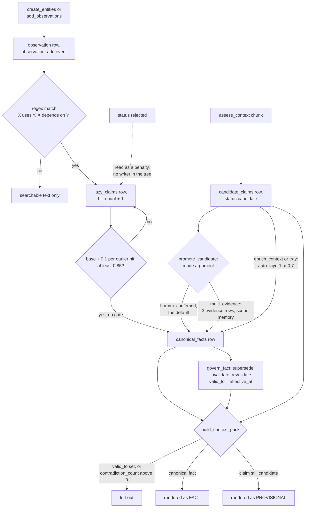

## 1. Executive Summary

sqlite-memory-mcp is a local-first MCP memory stack for coding agents. Its core
is a drop-in replacement for the official MCP memory server's nine
knowledge-graph tools over one SQLite file. Around it sit six more FastMCP
servers for sessions, tasks and notes, cross-machine bridge sync, collaboration,
task-to-entity linking, and an "Intelligence v2" tier that turns text into
candidate claims and canonical facts.

What is notable is the bookkeeping. Every core write appends to `memory_events`
with the old and new value. Facts are superseded or invalidated through
`govern_fact` with a rationale and an effective time, never deleted. A rejected
automatic link is remembered by pair, so the auto-linker cannot re-propose it.
`search_nodes` labels each result with whether the query terms were found in the
text returned.

What is weak is the governance the README leads with. `promote_candidate`, the
gate from claim to fact, defaults to `mode="human_confirmed"` on a tool the
agent holds. Beside it, every observation an agent writes is regex-scanned and a
claim seen three or four times is promoted to a canonical fact with no gate. The
re-ranker, read closely, scores a stronger BM25 match lower.

Five marks — `tombstone`, `bitemporal`, `scope_enforced`, `audit_log`,
`negative_eval` — each on a narrower surface than its name suggests; section 9
states which. The debate protocol, the task manager and the private-extension
contract are not memory and are not covered.

## 2. Mental Model

There are two stores of belief, and they do not share a lifecycle.

**Entities and observations are ground truth by assertion.** An observation is a
string on a named entity. It becomes memory when a tool inserts it and stops
being memory when `delete_observations` removes that exact string or
`delete_entities` cascades. It has no status, no confidence and no validity
time. Search returns it as written.

**Claims and facts are the governed tier.** A claim is a subject, predicate and
object with a scope and a confidence. It reaches `canonical_facts` by one of
three routes. `promote_candidate` accepts a mode, and `human_confirmed` — the
default — always passes (claim_graph.py:321-325, :358-376). `enrich_context` and
the tray call `auto_promote_layer1`, which promotes a claim scoped `memory` at
confidence 0.7 (intel_server.py:555-560, claim_graph.py:646-667). And
`extract_inline_claims` runs on every new observation.

**The third route has no gate at all.** Eight regexes match patterns such as
*X uses Y* and *X depends on Y* in English and Bulgarian. Each match adds or
bumps a `lazy_claims` row, adding 0.1 per earlier hit to a per-predicate base
capped at +0.3. At 0.85 the claim is inserted into `canonical_facts` as
`auto_lazy` (lazy_enrichment.py:29-32, :141-208, :211-319). A `depends_on`
sentence written into three observations is a fact on the third.

**A fact dies by governance, not deletion.** `govern_fact` sets `valid_to` and,
for supersede, `superseded_by_fact_id`, or clears both to revalidate. No
statement in the tree deletes from `canonical_facts`, so a fact outlives the
observation it was read from.

The status `rejected` on `lazy_claims` is read by the extractor as a confidence
penalty and by contradiction detection as an exclusion. Nothing outside the
tests writes it.

## 3. Architecture

Everything is one SQLite file, `~/.claude/memory/memory.db` unless
`SQLITE_MEMORY_DB` says otherwise, opened in WAL mode by every process. The
schema lives in `schema.py` and runs its own migrations; `db_utils.py` holds
connections, the event ledger, bridge import and export, and most shared
helpers.

The MCP surface is split across seven stdio servers because a client exposes
only so many tools per server: `server.py` (the nine graph tools),
`session_server.py`, `task_server.py`, `bridge_server.py`, `collab_server.py`,
`entity_server.py` and `intel_server.py`. `unified_server.py` mounts all of
them. The decorator counts are 9, 5, 9, 7, 9, 7 and 53; the README's table
gives `sqlite_intel` 46.

Two processes do work nobody calls for. The PyQt6 task tray runs bridge sync
and `auto_accept_high_confidence_links` on a timer (task_tray.py:314-320). The
bridge worker pushes and pulls a private git repository: per-entity files for
entities whose project starts with `shared`, and every row of the claim, fact,
chunk, provenance and event tables (db_utils.py:7385-7389, 8356-8371;
bridge_sync_worker.py:1291-1299). Nothing else runs in the background for
memory.

Search is FTS5 over a per-entity document of name, type and concatenated
observations, kept in step by triggers. With the `vector` extra it adds a
`vec0` table of `all-MiniLM-L6-v2` embeddings and fuses the two lists by RRF.

### Deployment and ergonomics

`pip install -e .` with `fastmcp` as the only required dependency, then one
`claude mcp add` or `codex mcp add` per server. It runs fully offline; the
vector arm needs `sqlite-vec` and `sentence-transformers` and degrades to FTS5
without them. No API key is needed. The store is readable with the `sqlite3`
shell, and `bin/memory-lint` prints a read-only health report.

## 4. Essential Implementation Paths

**Write.** `create_entities` (server.py:317-432) inserts with
`INSERT OR IGNORE`, records `entity_create` and `observation_add` events, syncs
FTS and vectors, and calls `extract_inline_claims` for each new observation
(:412-419). `add_observations` (:434-499) does the same for an existing entity.
Given a project for an entity that already exists, `create_entities` updates
its project in place (:365-370).

**Delete.** `delete_entities` (:560-595) records `entity_delete`, removes FTS
and vector rows and deletes with cascade. `delete_observations` (:597-643)
deletes by exact content and records the text as `old_value`.
`delete_relations` (:645-683) likewise.

**Search.** `search_nodes` (:749-925) quotes every token and joins them with OR
(`fts_query`, db_utils.py:3767-3780), takes 100 FTS rows, fuses vector hits if
available, adds one-hop neighbours of the top ten (`_expand_by_relations`,
:60-114), re-ranks with `rerank_entities` (smart_retrieval.py:99-235), probes
which observations actually matched, and packs whole entities into a
16,000-character budget with two observations each (recall_budget.py:297-368).
`search_by_project` (session_server.py:126-223) is the FTS path with a project
predicate and no vector arm or expansion.

**Context assembly.** `build_context_pack` (context_packer.py) takes up to
1,000 facts, drops those with `valid_to` or a contradiction count
(:612-621), adds candidate claims marked provisional (:700-730), questions and
chunks, and fills a token budget by role.

**Promotion.** `promote_candidate` (claim_graph.py:321-643);
`auto_promote_layer1` (:646-667); `auto_promote_claim`
(lazy_enrichment.py:211-319).

**Governance.** `govern_fact` (memory_audit.py:495-689), exposed at
intel_server.py:459-488. `audit_memory` runs `run_memory_audit` with
`repair=True` by default, backfilling provenance and recomputing contradiction
counts.

**Ledger.** `record_memory_event` (db_utils.py:2648-2726);
`replay_memory_events` (memory_audit.py:692-741).

**Links.** `suggest_links` and `record_link_decision`
(link_suggestions.py:326-695); `unlink_task_entity` (entity_server.py:108-145).

## 5. Memory Data Model

| Table | Holds | Notes |
| --- | --- | --- |
| `entities` | name (unique), type, project, visibility, origin | no status, no validity time |
| `observations` | entity id, content | `UNIQUE(entity_id, content)`, cascade on entity |
| `relations` | from, to, type | `UNIQUE(from_id, to_id, relation_type)` |
| `candidate_claims` | SPO, scope, confidence, status, `requires_human` | status written `candidate` and `promoted` only |
| `lazy_claims` | SPO from regex, confidence, `hit_count`, status | cascade on the source observation |
| `canonical_facts` | SPO, scope, `validation_mode`, `valid_from`, `valid_to`, `superseded_by_fact_id`, `contradiction_count` | no foreign key to entities |
| `memory_events` | event type, aggregate, actor, tool, machine, logical clock, old and new value, source span | append-only |
| `link_suggestion_decisions` | task id, entity id, accepted or rejected, decided_by | unique per pair |

Scope is the nullable `project` column. Because `entities.name` is globally
unique, two projects cannot each hold an entity of the same name; the second
`create_entities` call moves the first into its project. `visibility`
(`private`, `pending_public`, `public`) governs collaboration publishing, not
reads.

Provenance for facts is a `provenance_links` row per source, and
`knowledge_links` carries `supersedes`, `superseded_by` and `contradicts` edges
with an `active` flag. Notes are rows in `tasks` with `type='note'`, versioned
per field in `task_field_versions`.

## 6. Retrieval Mechanics

Retrieval is tool-mediated. Nothing injects graph memory into a session; the
shipped example hook prints the last two session summaries only
(examples/session_context_hook.py).

**The query is OR over quoted terms.** Every token is double-quoted, so the
README's `NOT`, prefix and column examples reach FTS5 as literal terms rather
than operators.

**The re-rank inverts its own base signal.** `compute_composite_score` starts
from `1.0 / (1.0 + abs(bm25_rank))` (smart_retrieval.py:68). FTS5's rank is
more negative for a better match, so a stronger match gets a smaller base, which
the comment above it says is not the intent. Relation expansion adds neighbours
at rank `0.0` so that one "must not outrank a real match" (server.py:98-105),
which gives them the largest base possible, and they are one hop from the seeds
by construction, so they also take the 1.8x graph boost. On the FTS-only path
the default install and CI run, a neighbour with no query term therefore starts
with the highest base and the graph boost, and outscores a match unless recency
or richness differ sharply. This was read, not run; RRF ranks are small enough that the
vector path compresses the effect.

**The fact boost ignores governance.** Signal five multiplies by 1.4 when any
`canonical_facts` row names the entity as subject (:165-178), with no test of
`valid_to`, so a superseded or invalidated fact still lifts its entity. The
session boost is off by design: `search_nodes` passes `session_id=None`, and a
test pins that.

What the response does well is say what it is. Each entity carries
`_evidence_status` of `found` or `not_found`, and the accounting block reports
entities considered and returned, observations sent, the wire size of the
payload including itself, and a query classification.

## 7. Write Mechanics

Writes are explicit and synchronous. A tool call inserts, appends events,
updates FTS, embeds if the vector extra is present, and runs the claim regexes,
all in one transaction; a new memory is searchable when the call returns.
Duplicates collapse on exact text; nothing merges near-duplicates, although
`knowledge_health` reports them.

**Agent-written text becomes fact by repetition.** The inline extractor keys a
claim on its subject, predicate and object text, so the same statement in
different observations accumulates hits. `depends_on`, `validates` and `requires`
cross 0.85 on the third hit; `uses`, `produces` and `replaces` on the fourth.
`is` and `contains` never do. The fact is scoped
`entity`, never reaches `promote_candidate`'s scope gate, and renders as a
FACT in the executor pack.

**Correction is by governance for facts and by deletion for everything else.**
An observation cannot be edited, only deleted and re-added. A fact is
superseded by another fact, not rewritten.

**Deletion leaves copies.** The deleted text stays in `memory_events.old_value`,
any `canonical_facts` promoted from it stay, and the bridge carries the ledger
to every machine. On pull, entities, observations and relations are merged with
`INSERT OR IGNORE` and no entity or observation tombstone exists, so a peer
whose payload still carries a deleted observation re-inserts it
(db_utils.py:7634-7691).

### Operational cost

- Write: synchronous, no model call. A regex pass per observation, and a
  384-dimension embedding when the vector extra is installed.
- Background: tray link scan and bridge sync on timers; bridge push streams
  the whole ledger, which a comment at bridge_sync_worker.py:1292 puts at
  hundreds of MB.
- Read: `search_nodes` is capped at 16,000 characters; context packs at a
  token budget defaulting to 4,000. Nothing is injected per turn.

## 8. Agent Integration

The agent holds every verb. The core nine are the official server's tools with
added `project` and `aliases` fields. The intelligence server adds claim
extraction, promotion, context packs, fact governance, ledger replay and the
reflection review tools; the entity server adds manual links, unlinking and
entity merge.

There is no confirmation on any write or delete, and no hook. An agent must be
told to search and save, and `resume_context` builds a handoff pack when asked.
Adapting it to another MCP client is a config line per server; the seven-server
split is the main friction, and `unified_server.py` removes it.

## 9. Reliability, Safety, and Trust

**The promotion gate is advisory.** Its only hard rule is that claims whose
text matches `mapping`, `validation`, `bridge` or `export` keywords need
`mode="human_confirmed"` (claim_graph.py:107-117, :358-376). That is the
tool's default (intel_server.py:305), supplied by the caller. The project's own
`REWRITE PROPOSAL.md` concedes "approval-aware", not "always gated"; the inline
extractor goes further and bypasses the tool.

**The ledger is the strongest part.** Every core mutation is appended with
before and after values, replayable per aggregate, and imported across machines
without overwriting.

**Privacy does not follow scope.** Entity export honours the `shared` prefix;
the ledger, candidate claims, facts and context chunks are exported whole. Any
reader of the bridge repository reads every observation ever added or deleted.

**Uncertainty is representable only in the claim tier.** An observation is
asserted or absent.

Capability marks:

- `audit_log` — awarded on `memory_events`. Merge, bridge import and the
  project re-scope write no event.
- `bitemporal` — awarded on the end of a fact's validity; the start is always
  record time and no read is as-of.
- `scope_enforced` — awarded on `search_by_project` only.
- `tombstone` — awarded on rejected task-to-entity links. Nothing value-keyed
  guards observations or facts; the `lazy_claims` rejection has no writer.
- `negative_eval` — awarded; section 10.
- `trust_state` — withheld. `candidate_claims.status` holds `candidate` or
  `promoted`, and the pack renders candidates as PROVISIONAL rather than
  excluding them. The exclusions it does make key on `valid_to` and
  `contradiction_count`, not on a status, and the one state that would
  withhold, `rejected`, has no producer.
- `human_review` — withheld. `promote_candidate`, `reflect_decide`
  (`decided_by="user"` by default), `reflect_apply` and
  `review_shared_knowledge` with `action="approve"` are all tools the agent
  holds. `unlink_task_entity` stamps `decided_by="human"` as a literal on an
  agent-callable tool.

## 10. Tests, Evals, and Benchmarks

Nothing was installed, built or run for this report; the suite was read at the
pin. CI runs `ruff` and `pytest -q` without the vector extra, plus a core-only
MCP stdio smoke test.

**Negative retrieval.** `tests/test_search_nodes_graph_signals.py` seeds a
match, a related neighbour and an unrelated entity (:35-73). With expansion off
it asserts the match present and the neighbour absent (:76-83); with it on, the
unrelated entity stays out (:91-95). `test_task_scoped_pack_matches_snake_case_tool_keyword`
asserts a relevant chunk in the pack body and a noise chunk out
(tests/test_context_packer.py:124-159).

**A case with no positive control.** `test_executor_pack_hides_contradicted_facts`
(:235-262) inserts one fact, sets its contradiction count and asserts it is
absent; an empty pack passes it.

**Governance.** `test_govern_fact_supersede_sets_validity_and_links` pins
`valid_to` to the supplied effective time (tests/test_memory_audit.py:247-273).
The link rejection test is at tests/test_link_suggestions.py:195-232.

**Ranking.** Every `compute_composite_score` test passes the same `-5.0` rank
(tests/test_smart_retrieval.py:40-96), so none compares two matches of
different strength, and no committed test asserts an order among
`search_nodes` results. Both would catch section 6's inversion.

**Evaluation.** `tests/fixtures/retrieval_eval_corpus.json` holds six queries
for `find_by_title` over tasks and notes, asserted at 100% top-1 and top-3. No
benchmark result or paper is in the tree.

**Unwired primitives.** `trust_boundary.py`, `claim_confidence.py`,
`lazy_verification.py`, `source_reliability.py` and `prediction_calibration.py`
are imported only by their tests and by one another.

## 11. For Your Own Build

### Steal

- **Append the old and new value on every mutation, keyed by machine and a
  logical clock.** A unique index on the pair makes cross-machine import an
  idempotent `INSERT OR IGNORE`.
- **Retire facts with a reason and an effective time, and never delete them.**
  `govern_fact`'s supersede, invalidate and revalidate cover the corrections a
  person actually makes.
- **Remember a rejected suggestion by the pair it proposed.** The auto-linker's
  next scan then cannot re-propose it, and the rejection doubles as an
  evaluation label.
- **Tell the caller which results carried evidence.** A `not_found` label on an
  expanded neighbour and an accounting block that measures the payload it sits
  in make a degraded answer visible.

### Avoid

- **An approval flag with an approving default.** A gate the caller passes by
  omitting an argument is a log entry, not a gate.
- **A second promotion path beside the governed one.** Hit counts on regex
  matches reach the same fact table as a human confirmation, and the reader
  cannot tell them apart.
- **Inverting a rank without a test of two ranks.** Every scoring test at one
  input value leaves the direction of the main signal unasserted.
- **Scoping the rows and not the log.** A ledger that carries content is a copy
  of the store and needs the same export filter.
- **Testing a validity end for presence.** Compare it to the clock, or an
  effective time in the future retires the fact at once.

### Fit

This suits one developer running several Claude Code or Codex sessions on
their own machines who wants a shared, inspectable graph with a real change
log, and who will read the claim tier as advisory. It is a large codebase for
one maintainer, most of it task management and a debate protocol, and the
memory path is a small part of it. Anyone who needs the promotion gate to
exclude an agent, per-project isolation on every read, or deletion that
reaches other machines should not rely on it.

## 12. Open Questions

- Does the BM25 inversion show in practice? Running `search_nodes` on a graph
  with matches of different strength, without the vector extra, would settle
  it.
- Is `lazy_claims.status = 'rejected'` meant to be set by a tool that has not
  shipped, or by hand?
- How large is the ledger on a long-lived store, and is any pruning planned for
  the bridge copy?
- Do bridge peers ever share a repository with a second person, given that the
  collaboration server uses the same `BRIDGE_REPO`?

## Appendix: File Index

- **Schema:** `schema.py` (entities to relations :59-87, claim and fact tier
  :400-449, ledger :498-523, lazy claims :644-660, link decisions :261-278).
- **Write and delete:** `server.py`, `lazy_enrichment.py`, `claim_graph.py`.
- **Retrieval:** `server.py:749-925`, `smart_retrieval.py`, `vec_search.py`,
  `recall_budget.py`, `session_server.py:126-223`.
- **Context assembly:** `context_packer.py`, `advanced_context.py`.
- **Governance and ledger:** `memory_audit.py`, `db_utils.py:2648-2726`.
- **Links:** `link_suggestions.py`, `entity_server.py`.
- **Bridge:** `bridge_sync_worker.py`, `db_utils.py:7385-7389, 7634-7691,
  8356-8425`.
- **MCP:** `server.py`, `session_server.py`, `intel_server.py`,
  `entity_server.py`, `collab_server.py`, `unified_server.py`.
- **Tests:** `tests/test_search_nodes_graph_signals.py`,
  `tests/test_context_packer.py`, `tests/test_memory_audit.py`,
  `tests/test_link_suggestions.py`, `tests/test_smart_retrieval.py`,
  `tests/test_lazy_enrichment.py`.

### Recorded searches

Checked against the checkout at the pinned revision.

- `grep -rn -iE '(DELETE FROM|UPDATE|REPLACE INTO|INSERT OR REPLACE INTO) +memory_events' --include='*.py' .` — no match.
- `grep -rn "'rejected'" --exclude-dir=.git --exclude-dir=tests .` — link decisions and bridge only; for `lazy_claims` the status is read at `lazy_enrichment.py:149-154` and `:376`, and written only in `tests/test_lazy_enrichment.py:184`.
- `grep -rn "UPDATE candidate_claims" --include='*.py' . | grep -v tests` — two writes, both `status = 'promoted'`.
- `grep -rn 'DELETE FROM canonical_facts\|DELETE FROM lazy_claims\|DELETE FROM candidate_claims' --include='*.py' .` — no match.
- `grep -rn 'record_memory_event\|DELETE FROM entities' entity_server.py` — the merge deletes at `:470` with no event.
- `grep -rln 'search_by_project' tests/` — only the surface-contract fixture.
- `grep -rn 'promote_candidate\|pending_shared_entities\|reflect_decide\|record_link_decision' task_tray.py tray_dialogs.py tray_sync.py premium_task_tray.py bin/` — no match; the GUI has no approve verb.
- `for m in trust_boundary claim_confidence lazy_verification source_reliability prediction_calibration; do grep -rln "import $m\|from $m" --include='*.py' .; done` — tests, and `trust_boundary.py` importing `lazy_verification`.
- `grep -rln 'SessionStart\|UserPromptSubmit\|PreCompact' --exclude-dir=.git .` — the example hook and `hooks/debate_wake.py`.
- `grep -rn -iE 'arxiv|bibtex|@article|@misc|doi\.org|CITATION' --exclude-dir=.git . | grep -v tests/` — one heading in a design note; no paper, no `CITATION.cff`.

## History

**2026-09-26** — [`f5d04e6ef5fe62e543b08a954ae71c98aaf2a0f9`](https://github.com/RMANOV/sqlite-memory-mcp/commit/f5d04e6ef5fe62e543b08a954ae71c98aaf2a0f9) — first reading, at the head of `main`, a merge commit dated 25 September 2026. Five marks: `tombstone`, `bitemporal`, `scope_enforced`, `audit_log`, `negative_eval`. Screened before reading: one auto-run surface (`hooks/`, seven scripts a plugin manifest could register, with no manifest in the tree), one build-time execution point (`tests/conftest.py`), two dependency files inside the cooldown — every file in a depth-1 clone dates to the tip — and two unpinned surfaces. No `AGENTS.md` or `CLAUDE.md` is present. Read with `grep` and `sed`; nothing installed, built or run.
