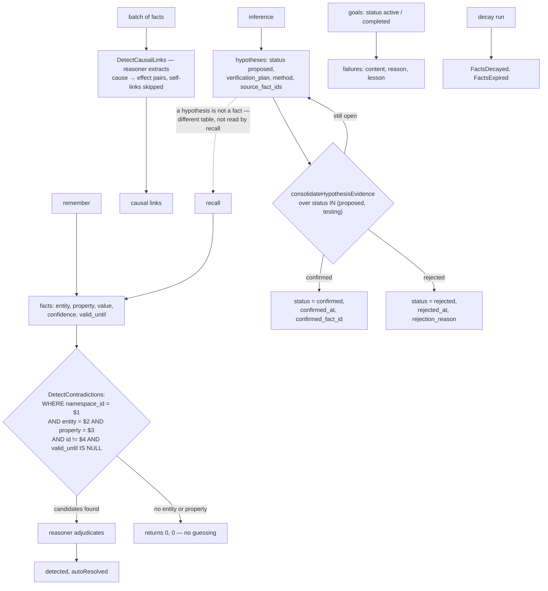

## 1. Executive Summary

Stash is a Go memory service — Postgres with pgvector, an MCP server, one
`docker compose up`, and an Ollama path for a fully local install — with a
hosted version alongside.

**It has six first-class epistemic entity types, which is more than almost
anything in this atlas**: facts, **hypotheses**, contradictions, causal links,
goals and failures, each with its own table and its own consolidation pass.

**The hypothesis table is the mechanism worth the report.** A hypothesis carries
a `status` in `proposed` / `testing` / `confirmed` / `rejected`, a
`verification_plan`, a `method`, `source_fact_ids`, a `confidence`, and — on
resolution — either a `confirmed_fact_id` or a `rejection_reason`, with
`tested_at`, `confirmed_at` and `rejected_at`.

So a claim the system inferred but has not established **is not stored as a
fact**. It is in a different table, with a plan for how it might be settled, and
when it is settled the record says which fact confirmed it or why it was thrown
out. The background pass reports `autoConfirmed, autoRejected, updated,
llmCalls`.

Most systems here have one bucket and a confidence number, so an inference and an
observation sit side by side and the only difference is a float. Stash makes it a
table boundary: **facts are what recall reads, and a hypothesis has to earn its
way across.**

**And contradiction detection is keyed on structure, not similarity** —
section 7.

## 2. Mental Model

Facts are `(entity, property, value)` triples in a namespace. A new fact is
checked against existing facts about the *same property of the same entity*.
Inferences become hypotheses with verification plans. Goals accumulate failures
with lessons. Background passes consolidate all of it.



## 3. Architecture

`internal/` splits into `brain` (the epistemic core), `reasoner` (the LLM
adjudicator, with an OpenAI-compatible implementation), `embedder`, `db`,
`queries`, `models`, `config`, `bootstrap`, `observability`.

`internal/brain/` has one file per concept — `fact`, `hypothesis`,
`contradiction`, `causal`, `goal`, `failure`, `episode`, `decay`, `recall`,
`context`, `namespace`, and three consolidation files (`consolidate`,
`consolidate_hypothesis`, `consolidate_goal`, `consolidate_failure`). The
vocabulary of the domain is the file layout, which makes the design legible in a
directory listing.

7,900 lines of Go. `docker compose up` brings Postgres, pgvector, migrations and
the MCP server with background consolidation in one command, and
`docs/LOCAL_OLLAMA.md` documents a no-cloud path with "private embeddings and
reasoner".

## 4. Essential Implementation Paths

**Hypothesise** — `internal/brain/hypothesis.go` (the confirm update `:250`),
`internal/brain/consolidate_hypothesis.go` (the open-hypothesis query `:11-16`).

**Contradict** — `internal/brain/contradiction.go` (`DetectContradictions`
`:18-50`, the entity/property/namespace query `:23-27`, the missing-key guard
`:19-21`).

**Link** — `internal/brain/causal.go` (`DetectCausalLinks` `:14-30`, the
self-link skip `:26-28`).

**Learn from failure** — `internal/brain/failure.go` (`failureColumns` with
`reason` and `lesson` `:13`), `consolidate_failure.go`.

## 5. Memory Data Model

A fact has an `entity`, a `property`, a `value`, a `content`, a `confidence`,
a `valid_until` and a `deleted_at`. Structuring a memory as a triple rather than
a sentence is what makes everything else in this system possible — contradiction
detection has a key to group on, decay has a scope, and `valid_until` closes a
fact without deleting it.

`failures` carry `content`, **`reason`** and **`lesson`** as separate columns.
Separating what happened, why it happened and what to do differently is a
distinction most systems collapse into one text field, and only the third is
worth injecting into a future prompt.

`hypotheses` carry the full lifecycle described in section 1.

## 6. Retrieval Mechanics

Vector recall over facts within a namespace. `namespace_id = $1` is the first
condition on the brain package's queries — including the contradiction scan —
so a stored key reaches every read, earning `scope_enforced`.

**The structural point is that recall reads facts.** A hypothesis is not
retrievable as knowledge because it lives elsewhere; there is no status filter to
forget, because the separation is a table boundary rather than a predicate. That
is a stronger form of the same guarantee, and it is why this report awards
`trust_state` on the hypothesis lifecycle rather than on a flag.

## 7. Write Mechanics

**Contradiction detection is keyed on `(entity, property)`, not on similarity:**

```sql
SELECT id, content, value, confidence FROM facts
WHERE namespace_id = $1 AND entity = $2 AND property = $3
  AND id != $4 AND deleted_at IS NULL AND valid_until IS NULL
```

Two facts contradict when they assign different values to the *same property of
the same entity*. Embedding similarity cannot make that distinction — "Alice
works at Acme" and "Alice left Acme" are near neighbours, and so are "Alice works
at Acme" and "Bob works at Acme" — so a similarity-keyed detector conflates
*about the same thing* with *says the opposite*. Keying on the triple's subject
and predicate produces a candidate set that is actually contradictory-or-not, and
only then does the reasoner judge.

The guard above it is equally right: if `entity` or `property` is missing or
empty, the function returns `(0, 0, nil)` — **no candidates rather than a
guess**. A detector that fell back to similarity when the structure was absent
would produce its worst results exactly where it knew least.

`valid_until IS NULL` in the same query means a closed fact is not a
contradiction candidate, so superseding a fact does not generate a contradiction
against its own replacement.

Causal-link detection skips `link.CauseFactID == link.EffectFactID`, because a
reasoner asked for cause-and-effect pairs will occasionally return a fact causing
itself.

## 8. Agent Integration

An MCP server with **28 tools**, `docker compose up` as the whole install, a
getting-started guide that walks `init` / `remember` / `recall` and says to
verify, and a documented fully-local path on Ollama. A hosted version exists at
a linked service.

The tool list is worth printing, because the first version of this report
described the hypothesis table as one "facts cannot be read from" and left the
impression that the lifecycle is internal machinery:

```text
init  remember  recall  forget  consolidate
set_context  get_context  clear_context
list_namespaces  create_namespace
query_facts  query_relationships
list_contradictions  resolve_contradiction
list_causal_links  create_causal_link  trace_causal_chain
list_hypotheses  create_hypothesis  confirm_hypothesis  reject_hypothesis
list_goals  create_goal  complete_goal  abandon_goal
list_failures  create_failure  delete_failure
```

Every state transition in section 5 has a tool, `list_hypotheses` takes a status
filter, and contradictions have both a lister and a resolver. So the accurate
statement is narrower and more interesting than the one this report made: the
hypothesis lifecycle is fully exposed to the agent, and what does *not* reach it
is **`recall`** — the semantic read that ordinary use goes through returns facts
only. A hypothesis is reachable by asking for hypotheses, never by asking a
question. An agent has to know the second surface exists, which is a
documentation problem rather than a missing mechanism, and a much smaller one
than a table nothing can read.

The README also carries a sponsor section for an inference platform, with
configuration for pointing Stash at it — disclosed inline rather than buried,
which is the right handling.

## 9. Reliability, Safety, and Trust

**Two marks: trust state and scope enforced.**

**Trust state** is the hypothesis lifecycle: `proposed` and `testing` are states
in which a claim exists and is not treated as true, `rejected` records *why*, and
`confirmed` records *which fact* settled it. Both resolution paths keep their
evidence, which is the part most status enums omit — a rejected hypothesis with
no `rejection_reason` teaches nothing and will be re-proposed.

**Tombstone — no**, though it is closer than most: a rejected hypothesis is a
durable record of a claim that failed, and nothing keys on it to prevent the same
claim being proposed again.

**Bitemporal, audit log, human review, negative eval — no.** `valid_until` closes
a fact and no separate transaction-time dimension was found.

**The risk is that the reasoner is the arbiter of everything and is
unevaluated.** It adjudicates contradictions, extracts causal links, and confirms
or rejects hypotheses — three judgements, each of which writes into the store
that the next judgement reads. `autoResolved` and `autoConfirmed` counts are
returned, so the *rate* is observable at runtime; the *accuracy* is not measured
anywhere in the tree. For contradictions the entity/property key bounds the
damage, since the reasoner only sees genuinely comparable pairs. For hypotheses
there is no such bound.

## 10. Tests, Evals, and Benchmarks

**No paper, no benchmark, no committed results**, and `internal/brain/brain_test.go`
is the only test file found in the brain package.

That is thin for a system with six epistemic entity types and three
reasoner-driven judgements, and the shape of the missing test is obvious in each
case: a fixture pair that *is* a contradiction and one that merely shares an
entity, a hypothesis whose evidence should confirm and one whose evidence should
reject, a causal batch containing a self-link. All three are cheap because the
functions take plain slices and return counts.

The consolidation functions returning `(autoConfirmed, autoRejected, updated,
llmCalls, errs)` is the right runtime instrumentation — `llmCalls` beside the
outcomes means the cost of a consolidation run is visible — and it is not a
substitute for knowing whether the outcomes were right.

**I ran nothing.**

## 11. For Your Own Build

### Steal

- **Give hypotheses their own table.** A claim you inferred but have not
  established is not a fact, and a table boundary enforces that more reliably
  than a status column recall has to remember to filter on.
- **Store the verification plan with the hypothesis.** `verification_plan` and
  `method` mean the record says how it could be settled, not just that it is
  open.
- **Record both resolutions with their evidence.** `confirmed_fact_id` on one
  side, `rejection_reason` on the other. A rejected hypothesis with no reason
  will be re-proposed.
- **Detect contradiction on `(entity, property)`, not on embedding similarity.**
  Similarity cannot tell "says the opposite" from "is about the same thing";
  a triple's subject and predicate can.
- **Return no candidates when the key is missing.** `if entity or property is
  empty: return 0, 0, nil` — a detector that falls back to similarity does its
  worst work exactly where it knows least.
- **Exclude closed facts from the contradiction scan.** `valid_until IS NULL`
  stops a superseded fact contradicting its own replacement.
- **Skip the self-link.** A reasoner asked for cause-and-effect pairs will return
  a fact causing itself.
- **Split a failure into content, reason and lesson.** Only the lesson belongs in
  a future prompt.
- **Name your files after the domain.** `fact`, `hypothesis`, `contradiction`,
  `causal`, `goal`, `failure`, `decay` — the design is legible from `ls`.
- **Report `llmCalls` beside the outcome counts.** The cost of a background pass
  should be as visible as its result.

### Avoid

- **Do not let one reasoner adjudicate three things with no evaluation.**
  Contradictions, causal links and hypothesis resolution all write into the store
  the next judgement reads, and only the contradiction path has a structural
  bound on what it is asked.
- **Do not ship six epistemic entity types on one test file.** Each judgement has
  an obvious two-fixture test — the positive case and the near-miss — and the
  functions are already shaped to take them.
- **Do not let a rejected hypothesis be re-proposable.** The rejection is durable
  and nothing consults it on the next inference pass.

### Fit

A strong fit if you want an opinionated, structured memory service rather than a
library — triples rather than sentences, a real consolidation worker, and one
command to a running Postgres. The Ollama path means the whole thing can be local.

`internal/brain/` is worth reading whatever you build. The file list is a good
answer to "what are the parts of a memory system", and `contradiction.go`'s
twenty lines are the clearest statement in this atlas of why structure beats
similarity for detecting disagreement.

## 12. Open Questions

- **How accurate is the reasoner's adjudication?** Rates are reported; accuracy
  is not measured.
- **What promotes a hypothesis to `testing`?** The consolidation query reads both
  states; the transition was not traced.
- **Does anything consult a rejected hypothesis before proposing again?** The
  rejection is stored with its reason.
- **What sets `valid_until`?** It is respected in the contradiction scan; the
  writer was not traced.

## Appendix: File Index

**Hypotheses** — `internal/brain/hypothesis.go` (the status filter `:103`, the
confirm update with `confirmed_fact_id` `:250`),
`internal/brain/consolidate_hypothesis.go` (the open-hypothesis query with its
full column list `:11-24`)

**Contradiction** — `internal/brain/contradiction.go`
(`ErrContradictionNotFound` `:13`, the doc comment on the entity/property scope
`:15-17`, the missing-key guard `:19-21`, the candidate query `:23-27`)

**Causal links** — `internal/brain/causal.go` (`DetectCausalLinks` `:14-19`, the
self-link skip `:26-28`)

**Other entities** — `internal/brain/fact.go`, `goal.go` (status counts `:138`,
`:188`), `failure.go` (`failureColumns` with `reason` and `lesson` `:13`),
`episode.go`, `decay.go` (`DecayResult` `:9-12`), `recall.go`, `context.go`,
`namespace.go`, `consolidate.go`, `consolidate_goal.go`,
`consolidate_failure.go`

**Reasoner** — `internal/reasoner/reasoner.go`, `openai.go`

**Documentation** — `README.md`, `docs/GETTING_STARTED.md`,
`docs/LOCAL_OLLAMA.md`

## History

**2026-09-19** — [`d34ed430c4348ef741ef95146b488aea8616f4fb`](https://github.com/alash3al/stash/commit/d34ed430c4348ef741ef95146b488aea8616f4fb) — `trust_state` re-tested at the unchanged pin; the transition table is exact and the structural half is worth adding. Hypotheses and facts live in separate tables: recall reads `facts`, and `ConfirmHypothesis` checks `isValidTransition` first, then embeds the content and inserts a fact inside one transaction. So an unconfirmed hypothesis is not a memory that ranks low — it is not a memory, and the ladder is the only way into the set recall can see. The consolidation pass reads `status IN ('proposed', 'testing')`, which is the complement of the terminal states and keeps a settled hypothesis out of re-derivation. One transition repays attention: `testing` can return to `proposed`, so a hypothesis pulled back from a test is not thereby rejected — the vocabulary distinguishes *not yet* from *no*, which is the distinction a two-value flag cannot carry. Nothing was installed and no suite was run.

**2026-09-18** — [`d34ed430c4348ef741ef95146b488aea8616f4fb`](https://github.com/alash3al/stash/commit/d34ed430c4348ef741ef95146b488aea8616f4fb) — re-read at the same commit. Nothing upstream had moved. Both marks now carry evidence records, and the hypothesis mechanism was verified rather than inferred: `validTransitions` is an explicit map with `confirmed` and `rejected` as terminal empty sets, `isValidTransition` gates every status write, and the listing query filters `status = $2` alongside the namespace key.

The description was wrong in one direction and is corrected. It said the lifecycle lives "in a table facts cannot be read from", which reads as internal machinery; the MCP surface has 28 tools including `list_hypotheses` with a status filter, `create_hypothesis`, `confirm_hypothesis`, `reject_hypothesis`, `list_contradictions`, `resolve_contradiction` and `trace_causal_chain`. Every transition in section 5 has a tool. What does not reach the lifecycle is `recall` — the semantic read ordinary use goes through returns facts only — so a hypothesis is reachable by asking for hypotheses and never by asking a question. That is a documentation problem rather than a missing mechanism, and section 8 now says so with the tool list printed. `stack_source` goes from seeded to reviewed.

**2026-08-09** — [`d34ed430c4348ef741ef95146b488aea8616f4fb`](https://github.com/alash3al/stash/commit/d34ed430c4348ef741ef95146b488aea8616f4fb) — first reading. Screened before reading; the tree was read, never built or run, and the hosted service was not used.
