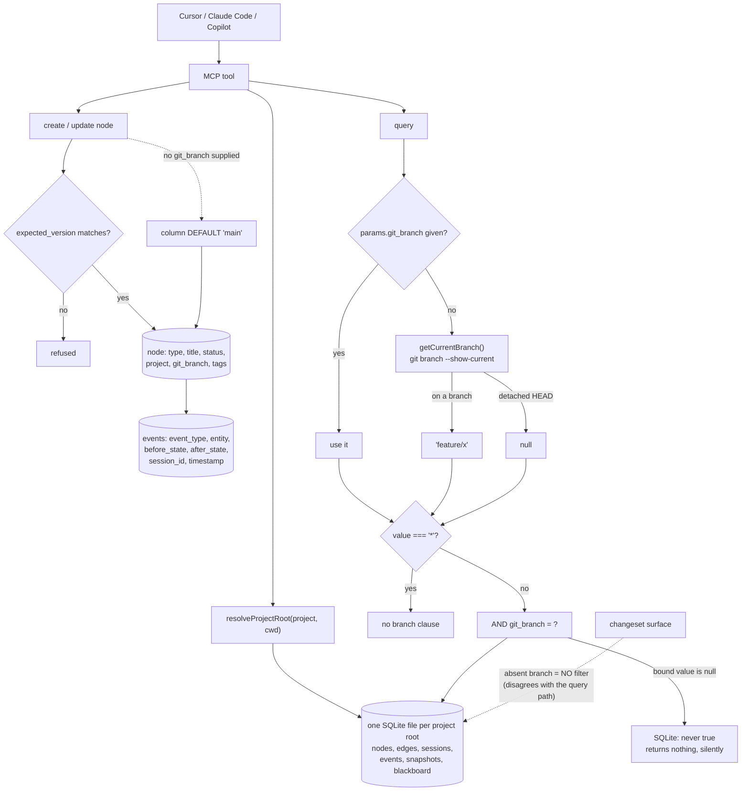

## 1. Executive Summary

state-memory-mcp is a "zero-infrastructure, deterministic" MCP server giving
coding assistants a SQLite graph for workflow state: tasks, decisions,
artifacts, plans, blockers and their relationships. MIT, version 1.2.1, 47
commits since 7 July 2026, 34,549 lines of TypeScript against 114 test files.
There is no model in the loop — the determinism claim is the product.

The schema is well matched to its queries. `nodes` carries a type, a `status`,
a `project` and a `git_branch`, with composite indexes on `(project,
git_branch)`, `(project, type)` and `(project, status)` — the three
combinations the read path actually issues. `edges` carries the same project
and branch. `events` records every mutation with `before_state` and
`after_state`, the entity and the session, which earns the one mark here: a
node's history is reconstructible from the log rather than from the node.
Updates take an `expected_version`, so a concurrent edit is detected rather
than silently overwritten.

The finding is about the branch, and it is worth stating carefully because it
is the third variation on this theme the atlas has recorded.

On the read path, `queries.ts` computes
`params.git_branch !== undefined ? params.git_branch : getCurrentBranch()` and
then, unless the value is the literal `'*'`, appends `AND git_branch = ?`. On
the write path, a node's `git_branch` comes from the caller, and the column
default is `'main'`.

`getCurrentBranch()` shells out to `git branch --show-current`, which prints
nothing on a detached HEAD, so the function returns `null`. The read therefore
binds `null` into `git_branch = ?`, and in SQLite a comparison against `NULL`
is never true: the query matches no rows. A write made in the same state, with
no branch passed, is stored as `main`.

So during a rebase, a bisect, or a CI checkout of a commit, work is recorded
under `main` and reads for it return nothing — and neither half says so. The
read looks like an empty graph, not like a failed branch detection. This fails
*closed*, which is the safer of the two directions and the opposite of the
branch bug this atlas recorded in [dsh-mnemon](../dsh-mnemon/), where scoped
entries were projected everywhere instead. But silence is the shared problem:
an agent that asks for its state and is told there is none will proceed as if
there were none.

A smaller inconsistency sits beside it. The changeset surface filters with
`!filterBranch || n.git_branch === filterBranch` — an absent branch means *no
filtering* — while the main query treats an absent branch as *the current
branch*. Two surfaces, two readings of the same missing argument.

`scope_enforced` is withheld for a different reason: the `project` is resolved
to a directory that selects which SQLite file to open, so it is a physical
partition rather than a predicate on a row, and the branch is a filter a caller
may set to `'*'` at will. One mark: `audit_log`.

## 2. Mental Model

A **node** is a unit of workflow state — task, decision, artifact, plan,
blocker — with a status, a project, a branch, metadata and tags.

An **edge** is a typed relationship between two nodes, unique on
`(source, target, type)`, cascading on delete.

A **project** is a resolved directory. It chooses the database file.

A **branch** is a column, compared on read against whatever
`getCurrentBranch()` returns — or against `'*'` to mean all.

An **event** is the record of one mutation, with the state before and after.

## 3. Architecture

| Area | Role |
| --- | --- |
| `src/engine/migrations.ts` | The schema: nodes, edges, sessions, events, snapshots, blackboard |
| `src/engine/db.ts` | `resolveProjectRoot` and the per-project database handling |
| `src/engine/queries.ts` | The read path and its branch clause |
| `src/engine/changeset.ts` | The changeset view and its different branch rule |
| `src/engine/staleness.ts` | Staleness, which falls back to `'*'` explicitly |
| `src/engine/advisor.ts` | Tool parameter contracts, required versus optional |
| `src/utils/git.ts` | `getCurrentBranch`, its cache and its fallbacks |
| `src/handlers/`, `src/tools/` | MCP handlers, batch operations, tool definitions |

## 4. Essential Implementation Paths

- `src/engine/migrations.ts:19-60` — nodes, edges and the composite indexes.
- `:129-147` — the event log and its indexes.
- `src/engine/queries.ts:70-80` — the branch clause, and where `null` enters.
- `src/utils/git.ts:50-66` — the detection and its `null` return.
- `src/engine/staleness.ts:63` — the one place `|| '*'` is written explicitly.
- `src/engine/changeset.ts:147-155` — the other branch rule.

## 5. Memory Data Model

Workflow state rather than claims: the unit is a task or a decision with a
status, not an assertion with a confidence or a validity. That places it at the
edge of this atlas's scope, and it earns its place because decisions persist
across sessions, carry typed relationships, and are scoped by branch — the same
questions the rest of the corpus faces, asked of a different payload.

The `blackboard` table is worth noting as a shared scratch surface beside the
graph.

## 6. Retrieval Mechanics

Filtered graph queries: project first, then branch unless waived with `'*'`,
then type, status and tags, with a traversal algorithm option for related
nodes. The composite indexes match these shapes, which is more care than most
SQLite-backed stores in this corpus take.

## 7. Write Mechanics

Create and update through MCP tools, individually or batched, with
`expected_version` guarding an update against a concurrent change. Every
mutation appends an event carrying both sides.

## 8. Agent Integration

An MCP server aimed at Cursor, Claude Code, Gemini and Copilot, with an `mcpb`
bundle, a manifest, a CLI and a project-instructions template. The screen found
four auto-run surfaces — a Cursor MCP config, a Cursor rules directory, a
Copilot instructions file and the server manifest — which is the shape of a
tool meant to be installed into several hosts at once.

## 9. Reliability, Safety, and Trust

The detached-HEAD behaviour is the thing to fix and the thing to learn from.
Three details compound: detection returns `null` rather than raising; the read
binds that `null` into an equality comparison that SQLite can never satisfy;
and the write, given no branch, takes a column default that names a specific
branch rather than recording the unknown. Any one of the three alone would be
recoverable. Together they produce a store that quietly answers "nothing here"
while quietly filing new work under `main`.

The contrast with the other branch-scoping failure in this corpus is
instructive. [dsh-mnemon](../dsh-mnemon/) failed open — branch-scoped entries
were projected onto every branch. This one fails closed. Failing closed is
better, and it is still wrong to do it silently: the correct behaviour is to
say the branch could not be determined.

The project scope deserves a plain statement too. `resolveProjectRoot` picks a
file; there is no predicate inside a store, so anything sharing a project root
shares everything.

## 10. Tests, Evals, and Benchmarks

114 test files against 34,549 lines of source — a good ratio, and the reason to
expect the branch behaviour is tested for the ordinary case. Nothing found here
exercises a detached HEAD, which is consistent with a bug that survives in a
well-tested repository: the state is awkward to set up and easy to forget.

## 11. For Your Own Build

### Steal

- **Record both sides of every mutation.** `before_state` and `after_state` in
  one event row make a node's history reconstructible without versioning the
  node.
- **Index the combinations you actually query.** `(project, git_branch)`,
  `(project, type)`, `(project, status)` rather than three single-column
  indexes.
- **Take an `expected_version` on update.** It is the cheapest way to turn a
  lost update into a visible conflict.

### Avoid

- **Binding a nullable detection result into an equality comparison.**
  `git_branch = NULL` is not "unknown branch", it is "no rows", and SQL will
  not tell you which you meant.
- **A column default that names a real branch.** Defaulting to `'main'` records
  a claim about where work happened that nothing verified.
- **Two surfaces reading an absent argument differently.** Here one means "the
  current branch" and the other means "every branch".

### Fit

Reach for this if you want deterministic, local workflow state shared across
several coding hosts, and you work on named branches. Check the detached-HEAD
path before using it inside a rebase, a bisect or CI.

## 12. Open Questions

- Should `getCurrentBranch()` returning `null` raise, or map to `'*'` as
  `staleness.ts` already does, rather than reaching the query as `null`?
- Should the `git_branch` column default to something that means "unknown"
  rather than to `main`?
- Should the changeset surface adopt the main query's rule for an absent
  branch, or the other way round?

## Appendix: File Index

| Path | What to read it for |
| --- | --- |
| `src/engine/migrations.ts` | The schema and the indexes |
| `src/engine/queries.ts` | The branch clause and the null path |
| `src/utils/git.ts` | Detection, cache, and the `null` return |
| `src/engine/staleness.ts` | The one explicit `'*'` fallback |
| `src/engine/changeset.ts` | The second, different branch rule |

## History

**2026-09-16** — [`5af4bc3d3609335a120f0b4a269540e18e3091a8`](https://github.com/putervision/state-memory-mcp/commit/5af4bc3d3609335a120f0b4a269540e18e3091a8) — first reading, at a commit dated 15 September 2026. Screened before opening, from a shallow clone: eight files, four auto-run surfaces (a Cursor MCP config, a Cursor rules directory, a Copilot instructions file and an MCP server manifest), one build-time execution point, one unpinned surface, two dependency files inside the cooldown, and `CLAUDE.md` read as data. Nothing was installed, built or run.
