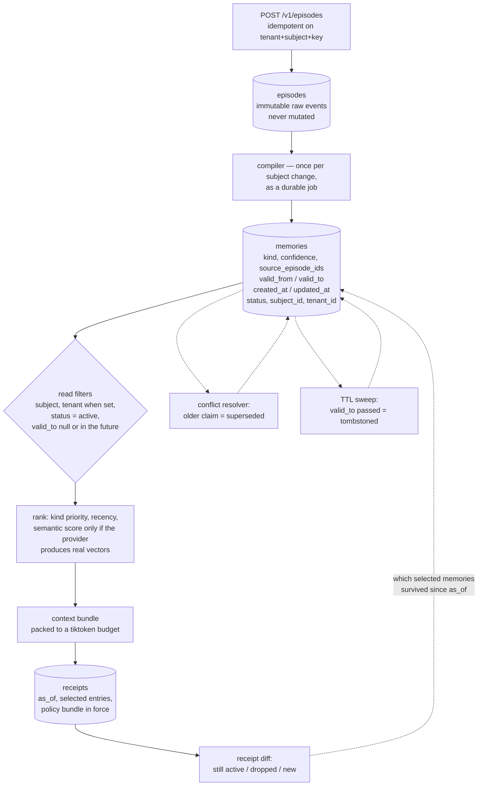

## 1. Executive Summary

Statewave's thesis is in its README and in its architecture: *"the same query
against the same subject at the same point in time always produces the same
bytes. That determinism is what separates compile-then-use from query-time
retrieval, where sampling noise leaks into every answer."* Raw events land in an
append-only `episodes` table. A compiler turns them into typed `memories` once
per subject change. Assembly reads the compiled set, ranks it, and packs it into
a token budget. The expensive, non-deterministic work happens once on write
rather than every time an agent asks.

Apache-2.0; 462 commits between 24 April and 8 September 2026 from thirteen
authors; version 1.5.0; 26,041 lines under `server/` beside 27,927 lines of
tests holding 1,271 test functions; PostgreSQL under Alembic, shipped as a PyPI
package, a Docker image, a Helm chart and a Fly config. The screen found no
auto-run surface, three build-time execution paths in pytest conftest files, a
`uv.lock` unchanged for 35 days, and one manifest inside the seven-day cooldown;
nothing was installed or run.

**Validity time is separate from record time, and both are queried.** A
`MemoryRow` carries `valid_from` and a nullable `valid_to` beside `created_at`
and `updated_at`. The read path applies `or_(valid_to.is_(None), valid_to >
func.now())` in one line of `repositories.py:43`, so a memory whose validity has
lapsed leaves assembly without being deleted. The TTL sweep selects on `valid_to
< now()` to tombstone; the receipt diff selects on `created_at > receipt.as_of`
to find what appeared after a historical assembly. One axis answers *was this
true then*, the other *did we know it then*, and the code uses each for its own
question. That earns `bitemporal`.

**The tenant guard is a fitness function, not a review checklist.**
`tests/test_tenant_scoping_invariant.py` parses `server/db/repositories.py` with
`ast`, collects every function whose arguments contain `subject_id` and not
`tenant_id`, and fails when that set is non-empty. The docstring names the bug
class it exists for — *"a query keyed only by `subject_id` silently reads across
tenants"* — and the allowlist of accepted exceptions is empty, with a comment
saying *"Do not add to this set to silence a new finding — add the `tenant_id`
and apply `_tenant_filter` instead."* This is the rare case of an architectural
invariant that a new pull request cannot quietly violate.

**A receipt says what was selected, and a diff says what has happened since.**
`assemble_context` captures an `as_of` up front — deliberately, so the receipt
records *"the wall-clock moment the assembly resolved against, not the moment
the receipt was written"* — and writes a receipt naming every selected entry and
the policy bundle in force. `GET` on the receipt diff then reports which of
those memories are still active, which have since been tombstoned or superseded,
and which are new. A replay can re-evaluate a past bundle against the policy
snapshot from its own receipt instead of the live one.

**And the leak the design invites is tested end to end.** Superseding a memory
does not by itself stop the *episode* it was compiled from being rendered under
"Recent interactions" — the stale value would walk straight back into the
prompt through its source. `tests/integration/test_episode_leak.py` seeds two
episodes whose text differs only in the numbers, supersedes the memory backing
the first, calls the real `assemble_context`, and asserts the live episode id is
present, the stale one absent, `2.9` in the rendered prompt and `3.5` not in it.
Four assertions, two of them present controls, so none can pass on an empty
bundle. `test_tenant_isolation.py` does the same in both directions across two
tenants. That earns `negative_eval`.

## 2. Mental Model

An episode is something that happened. It is written once, never edited, and
carries its own provenance. Nothing about it can turn out to be false, because
it is a record of an event rather than a claim about the world.

A memory is a claim, and it is derived. The compiler reads a subject's episodes
and produces typed memories — a profile fact, an episode summary, a procedure,
an artifact reference — each with a confidence, a validity window, and the ids
of the episodes it came from. A memory can stop applying in three ways, and they
are different: it can be *superseded* when a newer claim restates it, *tombstoned*
when its `valid_to` passes, or filtered out because its validity window does not
contain now. None of the three deletes the row, and all three leave the
provenance intact.

Assembly is the third act and the one the design is built around. Instead of
searching at question time, it reads the already-compiled active set for the
subject, ranks it, and fills a token budget — then writes a receipt naming what
it chose. The receipt is what makes the determinism claim checkable: a bundle
you can re-derive is a bundle you can argue with.



## 3. Architecture

A FastAPI service over PostgreSQL, run beside the application rather than
embedded in it — the README is explicit that Statewave is *"not a chatbot
framework, a vector database, a RAG pipeline, or a hosted service. It is
infrastructure you run alongside your application."*

Thirteen tables under Alembic migrations. `episodes` and `memories` are the
spine. `subject_entities` and `subject_snapshots` hold extracted entities and
point-in-time state. `compile_jobs` backs a durable queue with attach and drain
semantics. `receipts` records assemblies. `policy_bundles` holds the evaluated
policy so a replay can pin it. `tenant_configs`, `rate_limit_hits`,
`webhook_events`, `subject_health_cache`, `resolutions` and
`query_embedding_cache` complete the set.

`server/services/` is where the work lives: `compiler.py` and `compilers/`,
`conflicts.py`, `dedup.py`, `memory_ttl.py`, `context.py`, `receipts.py`,
`replay.py`, `reranker.py`, `policy.py`, `residency.py`, `health.py` and
`entity_extraction.py`, with `embeddings/` and `auto_labeling/` as
subpackages. The operational surface is substantial — health checks, SLA
tracking, rate limiting, backup, readiness and migration endpoints — which is
consistent with something meant to be run rather than imported.

## 4. Essential Implementation Paths

- **Ingest.** `POST /v1/episodes` → an idempotency check on
  `(tenant_id, subject_id, idempotency_key)` (`repositories.py:62-90`) → append
  an immutable `EpisodeRow`.
- **Compile.** `compile_memories_from_episodes(episodes)`
  (`services/compiler.py:15`) → typed memories with a confidence,
  `source_episode_ids`, and a `valid_to` from `compute_valid_to(kind,
  valid_from, kind_ttl_days)` when the kind has a TTL configured → written
  through a durable compile job.
- **Read filter.** `repositories.py:43` —
  `stmt.where(or_(MemoryRow.valid_to.is_(None), MemoryRow.valid_to > func.now()))`
  — and `_tenant_filter(stmt, column, tenant_id)` at `:46-49`, plus the
  `status == "active"` predicate.
- **Assemble.** `assemble_context` (`services/context.py:136`) → capture `as_of`
  → fetch fifty facts, thirty summaries, twenty procedures and thirty
  newest-first episodes → score → pack to `settings.default_max_context_tokens`
  measured with tiktoken → emit a receipt when `decide_emission` says so, with
  a write failure logged and non-fatal.
- **Supersede.** `resolve_conflicts(session, subject_id)`
  (`services/conflicts.py`) → compare active memories for the subject → return
  the ids to demote → `mark_memories_superseded`.
- **Expire.** The TTL sweep (`services/memory_ttl.py:74-84`) selects rows whose
  `valid_to` is not null and is in the past, and sets `tombstoned`.
- **Replay and diff.** `services/replay.py` re-runs an assembly with
  `_policy_bundle_override` loaded from a receipt's snapshot and
  `_mode_override="as_of_replay"`; the admin diff route
  (`api/admin.py:1962-2005`) compares a receipt's selected memory ids against
  current state and lists what is new since `receipt.as_of`.

## 5. Memory Data Model

Two layers, and the split is the design.

An **episode** is a raw event: `subject_id`, `source`, `type`, a JSON `payload`,
a `metadata` dict, a `provenance` dict and a `created_at`. The docstring calls
it an *"Immutable raw event record"* and nothing in the tree mutates one.

A **memory** is derived: a `kind` from a four-value enum, `content`, a
`summary`, a `confidence` float defaulting to 1.0, `valid_from` and `valid_to`,
`source_episode_ids`, a `status`, an optional `embedding`, `created_at` and
`updated_at`. Four fields carry the epistemics and they are deliberately
separate: `confidence` is a number for ranking, `status` is a state for
filtering, `valid_from`/`valid_to` bound when the claim applies, and
`source_episode_ids` say what it was derived from.

`MemoryStatus` is `active`, `superseded`, `tombstoned` — and the comment on the
third value is a small piece of honest archaeology:

> `tombstoned` matches the vocabulary that issue #49 (state-assembly receipts)
> expects to surface in the receipt's `supersession_status` field. The previous
> value was `deleted` — an aspirational hard-delete state that was never wired
> up; the rename happened with the v0.7 memory-TTL work which uses this status
> as the soft-tombstone target for expired memories.

That is worth reading twice, because it is exactly the distinction this atlas
draws. `tombstoned` here is an *expiry* target, not a record of a value the
system rejected. Nothing consults it when a memory is recompiled.

## 6. Retrieval Mechanics

The read path is short by design, because the ranking work was done at compile
time. `assemble_context` pulls bounded per-kind candidate pools — fifty profile
facts, thirty episode summaries, twenty procedures, and thirty episodes fetched
`newest_first`, with a comment explaining why that flag matters: without it *"the
oldest 30 would be scored under a 'recent' heading."*

Every one of those fetches goes through the repository layer, which applies the
subject key, the tenant key when set, the `status == "active"` predicate and the
validity window. Filtering happens in SQL, not after the rows arrive.

Scoring combines a kind priority, recency, and a semantic similarity — and the
guard around that last term is the best small thing in the file. The service
refuses to treat a stub embedding provider's output as a relevance signal:

> The hash-based stub provider produces deterministic-but-meaningless vectors;
> using its scores as ranking input silently corrupts retrieval (verified
> against production statewave-support-docs: the same garbage scores were
> dominating KIND_PRIORITY + recency, producing repetitive citations across
> unrelated queries).

A system that can tell the difference between *a vector* and *a meaningful
vector*, and that found out the hard way and wrote it down, is a system whose
other claims are worth more.

The bundle is packed to a token budget measured with tiktoken, and a receipt is
written naming what was chosen.

## 7. Write Mechanics

Ingest is cheap and idempotent: an episode append de-duplicates on
`(tenant_id, subject_id, idempotency_key)`, so a retrying client cannot double
an event. Nothing about the write path calls a model.

Compilation is where the model work happens, and it is deliberately off the
request path — a durable job with attach, drain and latency observability
(`services/compile_jobs_durable.py`, `test_compile_job_attach.py`,
`test_compile_latency_observability.py`). Recompiling a subject is idempotent:
the README claims *"recompiling a subject produces no duplicates"* and
`services/dedup.py` with `test_dedup.py` is where that is implemented.

The lag between an event and its retrievability is therefore a compile cycle,
not a write — which is the honest cost of the compile-then-serve trade. An
episode is visible immediately as a raw event; the memory derived from it
appears when the subject is next compiled.

Memory rows are not edited in place on the normal path. A newer claim causes the
older to be marked `superseded`; a lapsed validity causes `tombstoned`. Hard
deletion is a subject-level operation with a preview endpoint
(`POST /subjects/preview-delete`) and a webhook, which is the right granularity
for a data-subject-erasure request and the wrong one for correcting a single
wrong fact.

## 8. Agent Integration

Statewave is a service, not a library or an MCP server: routes for episodes,
context, memories, subjects, timeline, receipts, resolutions, templates,
handoff, health and SLA, plus a large admin surface. An application calls
`POST /v1/context` with a subject and a task and gets back an assembled bundle,
a token estimate and a receipt id.

There is no MCP tool surface and no agent-facing framework binding in the tree —
integration is an HTTP call the application makes, which fits the stated
positioning as infrastructure. `handoff.py` assembles a bundle for passing work
between agents, and `templates.py` shapes how memories render into a prompt.

The admin surface is where a person operates the store: subject listing and
timelines, memory provenance drill-down, compiler traces, bulk-delete preview,
purge, settings, dashboard and readiness. It is an operator console rather than
a review queue — nothing there asks a person to approve a memory before it can
be retrieved, which is why `human_review` is withheld.

## 9. Reliability, Safety, and Trust

**Scope — awarded, and the enforcement mechanism is unusual.** Subject and
tenant keys on every row and every query, `_tenant_filter` applying the tenant
when set, and an AST fitness function failing CI when a repository helper takes
a subject without a tenant. The allowlist is empty and the docstring forbids
growing it. One caveat belongs beside the mark: in single-tenant mode
`tenant_id` is `None` and no tenant filter is applied at all, so the isolation
is a property of a configured deployment rather than of the code path.

**Trust state — awarded.** `status` is stored, discrete and three-valued, and
both non-default values withhold a memory from assembly rather than reordering
it. `confidence` sits beside it as a float that ranking uses. The separation is
clean, and the enum's own comment documents that the third value was renamed
away from an aspirational `deleted` that was never wired up — a rare case of a
project labelling its own dead state instead of leaving it to a reader to find.

**Bitemporal — awarded.** `valid_from`/`valid_to` beside `created_at`/
`updated_at`, with the validity window filtered on every read, the TTL sweep
selecting on validity, and the receipt diff selecting on record time. Two axes,
both used, for different questions.

**Negative evaluation — awarded, on the leak the architecture invites.**
Superseding a memory demotes the *claim*; the episode it was compiled from is
still a raw event, and the assembled bundle renders recent episodes verbatim.
So a correctly-superseded fact can return through its own source. The suite
closes that end to end: `test_assembled_context_drops_superseded_backed_episode`
supersedes the memory behind a stale Stripe price, calls the real
`assemble_context`, and asserts the live episode present, the stale absent,
`2.9` in the rendered text and `3.5` not in it. Two present controls sit in the
same four-assertion block, so an empty bundle fails rather than passes. Four
sibling cases pin the boundary — an episode with an active backing is kept, one
with no backing is kept, a tombstoned backing counts as dead, and the
obsolete-episode lookup is itself tenant-scoped — and
`test_subjects_isolated_between_tenants` asserts each tenant sees its own
subject and not the other's, in both directions. The unit-level suite adds the
structural half: `test_tenant_scoping.py` asserts the compiled SQL contains
`episodes.tenant_id =`, and the AST fitness function asserts every helper takes
the parameter. Structure and behaviour are both covered, which is the
combination this mark exists to reward.

**Tombstone — withheld.** `tombstoned` is the TTL expiry target, as its own
comment says. It is keyed on the memory, not on the rejected value, and nothing
consults it when the compiler next runs over the same episodes — a claim that
expired can be recompiled from the same source and re-enter as `active`.

**Audit log — withheld, with a near miss.** Receipts are durable, append-only in
practice, and record the entries an assembly selected, the policy bundle in
force and an `as_of`. But a receipt records *what was assembled*, which is a
record of something that happened and cannot turn out to be false — the same
category as a delivery log. No table records mutations of memory: no row says
*this memory was superseded at this time by this actor*. The receipt diff
reconstructs that after the fact by comparing state, which is a different and
weaker thing than having recorded it.

**Human review — withheld.** The admin console displays, traces and deletes; it
does not adjudicate. `resolutions` tracks whether a *support session* was
resolved, not whether a memory was approved.

## 10. Tests, Evals, and Benchmarks

1,271 test functions across roughly a hundred files and 27,927 lines, with a
separate `integration/` and `smoke/` tree, run by GitHub Actions CI.

The suite's structure says a lot about the project's history: files named
`test_issue_115.py`, `test_issue_116.py`, `test_issue_121.py`,
`test_issue_124.py`, `test_issue_134_compile_drain.py` and
`test_repeat_issue.py` are regression pins for specific reported defects, and
`test_compiler_characterization.py` and `test_conflicts_characterization.py` are
characterization suites — tests written to pin existing behaviour before
changing it. That is a codebase being refactored carefully rather than one being
written once.

The `integration/` tree is where the behavioural guarantees live — 45 files
including `test_episode_leak.py`, `test_tenant_isolation.py`,
`test_health_cache_isolation.py`, `test_timeline_active_only.py`,
`test_golden_path.py` and `test_replay.py`. A reader who greps only `tests/*.py`
will conclude this project tests its filters structurally and not behaviourally,
and will be wrong.

Three tests are worth naming for method. `test_tenant_scoping_invariant.py` is
the AST fitness function described above. `test_route_limits_invariant.py` and
`test_runtime_imports.py` are the same genre — properties of the codebase
checked mechanically rather than by review. And `test_no_raw_tokenization.py`
asserts something about how text is handled rather than what a function returns.

No benchmark is committed and none is claimed. The README's determinism claim —
*"reassembling a bundle for the same task at the same point in time returns the
same bytes"* — is the closest thing to a measurable assertion, and
`test_replay.py` and `test_receipts.py` are where it is exercised. No paper: a
search of the README and `docs/` for `arxiv`, `bibtex`, `@article`, `@misc`,
`Citation`, `CITATION.cff` and `doi` returns nothing.

## 11. For Your Own Build

### Steal

- **Enforce an architectural invariant by parsing your own source.** The tenant
  fitness function is forty lines of `ast` and it makes a whole bug class
  unmergeable. An empty allowlist with a comment forbidding additions is the
  detail that keeps it honest.
- **Separate validity time from record time and use each for its own
  question.** One line — `or_(valid_to.is_(None), valid_to > func.now())` —
  gives expiry without deletion, and keeping `created_at` free lets a receipt
  diff ask what has appeared since.
- **Refuse to rank on a signal that is not one.** Detecting that the stub
  embedding provider emits deterministic-but-meaningless vectors, and excluding
  its scores from ranking, prevented a silent corruption that had already been
  observed in production.
- **Capture the `as_of` before the work, not after.** The comment is right: a
  receipt stamped when it was written drifts from the state it describes when
  downstream work is slow.
- **Write characterization tests before refactoring.** Two of them here name
  themselves as such, beside a row of issue-numbered regression pins.

### Avoid

- **Demoting the claim and forgetting the source.** Superseding a memory does
  not stop the episode it was compiled from being rendered verbatim in the next
  bundle. This project found that and closed it; a design that keeps raw events
  beside derived claims has the same hole by construction.
- **A tombstone that is only an expiry.** Naming a state `tombstoned` invites a
  reader to think a rejected value cannot return. Here it means the validity
  window closed, and a recompile over the same episodes re-creates the claim.
- **An isolation guarantee that is off by default.** Single-tenant mode applies
  no tenant filter; the invariant that makes the multi-tenant story strong is
  inert until a tenant id is configured.

### Fit

Statewave suits a team already running Postgres that has an application — not an
agent framework — needing durable per-user memory it can explain to somebody. The
compile-then-serve model pays off when reads outnumber writes and when the same
subject is asked about repeatedly, and it costs a compile cycle of latency
between an event and the memory derived from it. The receipts and the provenance
chain make it a reasonable choice where somebody may later have to answer *why
did the assistant say that*, and the subject-level delete and residency work
suggest the authors have thought about data-subject requests. It is the wrong
choice if you want a library to import, an MCP server to drop in, or per-memory
correction by an end user: the granularity of erasure here is the subject, and
the granularity of review is nothing.

## 12. Open Questions

- Does the episode-leak fix cover the timeline and handoff surfaces as well as
  `assemble_context`? `test_timeline_active_only.py` suggests the timeline was
  considered; `handoff.py` assembles its own bundle.
- Should a recompile consult tombstoned memories? A claim whose validity lapsed
  is re-derivable from the same episodes, which is either correct — the episodes
  still say it — or the thing a TTL was meant to stop.
- What writes `resolutions` in practice? The table and its two routes are about
  support-session state; nothing in the memory path reads it.
- Is `confidence` used anywhere but ranking? It defaults to 1.0 on every
  compiled memory, which makes it a weak signal unless a compiler sets it.

## Appendix: File Index

| Path | Lines | What it holds |
| --- | --- | --- |
| `server/` | 26,041 | The service: `api/`, `services/`, `db/`, `domain/`, `schemas/`, `core/` |
| `server/domain/models.py` | — | `MemoryKind` (18-22), `MemoryStatus` (25-34), `Episode` (42-52), `Memory` (60-77), `ContextBundle` (85-96) |
| `server/db/tables.py` | — | Thirteen tables; `memories` (77-120) with `valid_from`/`valid_to` at 97-100; `receipts` (354) with `as_of` at 382 |
| `server/db/repositories.py` | — | The validity predicate (43), `_tenant_filter` (46-49), episode idempotency (62-90) |
| `server/services/context.py` | — | `assemble_context` (136-260): candidate pools, the stub-provider guard, the token budget, receipt emission |
| `server/services/compiler.py`, `compilers/` | — | `compile_memories_from_episodes` (15) and the per-kind compilers |
| `server/services/conflicts.py`, `dedup.py`, `memory_ttl.py` | — | Supersession; recompile de-duplication; `compute_valid_to` and the tombstoning sweep (74-84) |
| `server/services/receipts.py`, `replay.py`, `policy.py` | — | Receipt emission and `decide_emission`; `as_of_replay` with a policy-bundle override; the policy bundles themselves |
| `server/api/admin.py` | — | The operator console; the receipt diff (1962-2005); bulk-delete preview (3268) |
| `server/api/resolutions.py`, `timeline.py`, `handoff.py` | — | Support-session resolution state; subject timelines; cross-agent handoff bundles |
| `tests/` | 27,927 | ~100 files, 1,271 test functions, plus `integration/` and `smoke/` |
| `tests/test_tenant_scoping_invariant.py` | — | The AST fitness function and its empty allowlist |
| `tests/integration/test_episode_leak.py` | — | Six cases: a superseded-backed episode leaves the bundle, an active-backed one stays, the rendered prompt loses the stale number and keeps the live one |
| `alembic/`, `helm/`, `infra/`, `Dockerfile`, `fly.toml` | — | Migrations and the deployment surface |

Searches behind the absence claims above, run from the repository root:

```sh
rg -n 'valid_from|valid_to' server/db/repositories.py                  # one predicate, applied to every memory read
rg -n 'retract|approve|pending_review' server/api                      # none: the admin console displays and deletes, it does not adjudicate
rg -n '__tablename__' server/db/tables.py                              # thirteen tables; none records a memory mutation
rg -n 'not in' tests --glob '*.py' | rg -i 'bundle|assemble'           # the episode-leak and tenant-isolation cases, under tests/integration/
rg -n -i 'arxiv|bibtex|@article|@misc|Citation|CITATION.cff|doi' README.md docs  # none: no paper
rg -n 'tenant_id' tests/test_tenant_scoping.py tests/integration/test_tenant_isolation.py  # compiled-SQL assertions and the data-level pair
```

## History

**2026-09-10** — [`f86eb9aa0aec9ac701a88cd55ca62f52f2d846f4`](https://github.com/smaramwbc/statewave/commit/f86eb9aa0aec9ac701a88cd55ca62f52f2d846f4) — first reading, at the head of `main`, the last commit of 8 September 2026. Screened before reading: no auto-run surface, three build-time execution paths in pytest conftest files, one manifest inside the seven-day cooldown, a `uv.lock` unchanged for 35 days, and an `AGENTS.md` treated as data; nothing was installed or run, and the read was made from a full clone. Four marks. The reading covered the episode and memory model, the compile pipeline, the read-path filters, the TTL and conflict lifecycles, and the receipt and replay machinery; the health, SLA, rate-limiting and backup surfaces were read as operational context rather than as subject.
