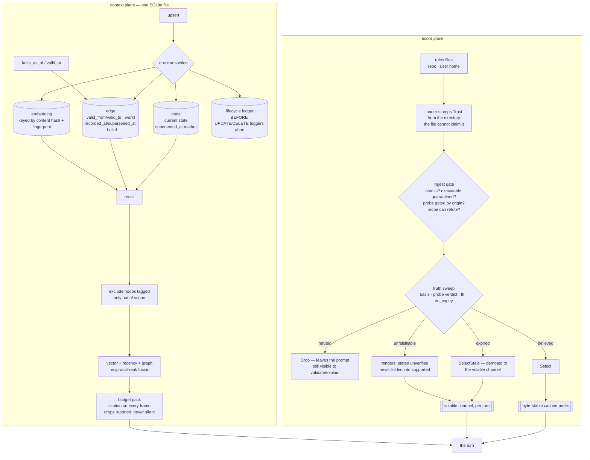

## 1. Executive Summary

Stella is a terminal coding agent in Rust — thirty crates, its own TUI, a
plugin consent boundary, a fleet layer. The part this atlas reads is the
**context plane**, described in its own header as the single door between the
engine and everything the agent knows that isn't already in the prompt: one
SQLite file holding a bi-temporal property graph, a fingerprinted embedding
index and episodic memory, with a budgeted, cited retrieval pipeline on top.

Six marks, and what they have in common is that each one is enforced somewhere
a later contributor cannot quietly undo.

**Append-only is a database trigger, not a rule.** The lifecycle ledger's
migration installs `BEFORE UPDATE` and `BEFORE DELETE` triggers that abort, and
the module says why in one sentence: the guarantee then holds against every
writer *"including a future one that has forgotten this module exists."*

**Authority is stamped from the filesystem.** A record's `origin`, `truth.basis`
and `verified_by` are fields inside the file being judged, and a checkout can
assert them as easily as it asserts anything else. So the trust tier is set by
the loader from *which directory the file was read out of*, and nothing in the
file can change it — *"a decree only counts when somebody signed it."* The
default is the lower tier, with a test asserting that a forgotten stamp fails
toward the restrictive answer.

**A committed claim is re-checked before it can steer.** The truth sweep's own
motivating case is a `CLAUDE.md` that says *"we use Node 20"* while `.nvmrc`
has said `22` for months — a claim probed once at extraction and never again,
teaching the agent something false on every turn with the full authority of a
reviewed policy file. A refuted claim is dropped from the block; a merely
expired one is demoted into the volatile channel, where the reason can be said
out loud without putting a clock into the byte-stable cached prefix.

**Two time axes, closed by different writers.** An edge carries when the fact
held in the world and when the store believed it, and the neighbour query
applies both at once.

The one mark withheld that the code appears to claim is the tombstone. Stella
uses the word for its node-suppression marker, which is a soft delete keyed on
the row. It is reversible, tested as an exact inverse, and applied before the
budget rather than after — but nothing here is keyed on a rejected *value*.

## 2. Mental Model

Two planes, and it is worth keeping them apart.

**The context plane** is the graph: nodes, edges, embeddings, episodes. It
answers *what do we know, and what did we know at T1*. Facts are edges, and a
correction closes intervals rather than deleting rows.

**The record plane** is policy: rule files and record files, merged into one
order and rendered into the prompt. It answers *what should steer this turn*.
Records carry a truth axis, get probed on a cadence, and are dispositioned
before rendering.

The design constraint that shapes the second plane is prompt caching. The
`must`/`should` records ride a byte-stable cached prefix built once per session,
so nothing turn-varying may enter it — which is why a stale record is not
annotated in place but moved to the volatile channel, and why staleness is
deliberately *not* a record status but a separate derived selection-health
value.

## 3. Architecture

## 4. Essential Implementation Paths

- **The plane's contract:** `crates/stella-context/src/lib.rs` — four jobs, and
  the binding lessons it names.
- **Store and schema:** `crates/stella-context/src/store.rs`,
  `store/schema.rs`, `store/node.rs`, `store/edge.rs`.
- **Ledger:** `crates/stella-context/src/store/ledger.rs`.
- **Write-back:** `crates/stella-context/src/writeback.rs`.
- **Recall:** `crates/stella-context/src/retrieval.rs`, `candidates.rs`.
- **Scope:** `crates/stella-context/src/store/domain.rs`.
- **Truth sweep and rendering:** `crates/stella-records/src/records/sweep.rs`,
  `registry.rs`, `render.rs`, `trust.rs`.
- **Ingest gate:** `crates/stella-records/src/ingest/gate.rs`.

## 5. Memory Data Model

Nodes carry a typed kind — file, symbol, concept, fact, episode, person,
artifact, task, memory — and the vocabulary has a stated fallback: an unknown
stored kind reads back as `concept` rather than failing.

Edges carry four time columns. Nodes carry them too, and two of the four are
never written, which the schema comment addresses head-on: dropping a column in
SQLite rewrites the table, so they stay, and the row type *deliberately does not
project them* so no consumer can read the NULL as an absence of valid time
rather than an absence of node versioning. Fact history is recoverable; node
content history is not, and the file says so.

On the record side, `RecordStatus` is the stored canonical field — active,
retracted, archived — while `EffectiveStatus` is derived at query time from the
historical prefix, adding superseded and expired, and is excluded from the
record hash because it is a projection rather than state.

The most instructive type in the tree is an enum variant. `EpisodeOutcome`
carries an `Unverified` value whose documentation is the clearest statement of
the idea anywhere in this reading: the episode ran to completion and nothing
proved it. Deliberately not `Success`, because episodes are recalled into later
sessions as grounding and labelling an unproven run a success hands a future
turn a worked example that was never checked. Deliberately not `Failure`,
because nothing found the work wrong and a retrieval that reads it as a mistake
teaches the opposite lesson. Distinct from `Partial`, which is a claim about how
much of the goal landed — *"this is a claim about the evidence."*

## 6. Retrieval Mechanics

Recall fuses vector, recency and graph-adjacency channels by reciprocal rank,
deduplicates by content hash, and packs to the caller's token budget. Three
rules are enforced rather than advised: every frame must carry a human citation
label, and a frame constructed without one is a constructor error; silent
truncation is banned, so assembly reports what it dropped; and weak coverage
falls back to bounded lexical search **labelled as such** rather than dressed up
as grounding.

Scope is an exclusion set built by anti-join and applied during retrieval. Its
one asymmetry is documented in the entry point rather than discovered later: a
node tagged exclusively with out-of-scope domains is excluded, and an untagged
node is not, because most memories carry no domain tag and a scope that dropped
them would empty the channel.

Point-in-time recall applies the as-of predicate before the budget, which is
the same discipline suppression needed and for the same reason.

## 7. Write Mechanics

Every write batch is one transaction, so a kill mid-index rolls back to a
consistent store. Vectors are keyed by content hash and embedder fingerprint
together: identical content is never re-embedded, and retrieval never mixes
fingerprints.

Corrections close and supersede. The function that finds what to close is worth
reading for its bug note: it used to be a single-valued `ORDER BY id DESC LIMIT
1`, so an assert closed the newest belief and left every older live one open,
and the store kept answering with two simultaneous beliefs for a fact that is
single-valued by definition. It now closes all of them, and the note explains
how two live edges arise honestly — the same predicate asserted multivalued and
later corrected as single-valued.

Compaction is bounded by the same guarantee it must not break: it reclaims only
derived index entries whose owner is already gone, *precisely because* deleting
them cannot change what `facts_as_of` answers, and edges, memory revisions and
superseded node rows are named exclusions.

## 8. Agent Integration

A terminal agent with its own TUI, an MCP crate, a plugin system with a consent
prompt and a verification ladder, an autonomy layer, a fleet layer and an
observatory. Dual-licensed: AGPL-3.0-only, or a negotiated commercial licence,
with the "or any later version" clause deliberately not granted.

## 9. Reliability, Safety, and Trust

**Trust state — awarded.** A stored truth axis, a probe verdict, and a
disposition resolved before rendering, with the unselected dispositions removed
from the prompt by the channel function rather than annotated in place. The
distinction the module draws between *refuted* and *expired* is the part worth
copying: one has been measured against the world and lost, the other has merely
gone unchecked, and they get opposite defaults.

**Bi-temporal — awarded**, on two intervals written by different operations and
applied together in one predicate. The limit is stated in the schema comment
rather than left for a reader to find: only edges are versioned.

**Scope enforced — awarded**, with the untagged-node asymmetry in the evidence
record and documented in the code.

**Audit log — awarded.** Triggers, not convention; content-derived ids so a
replay is a no-op; a different hash under the same id raised as an error rather
than swallowed.

**Human review — awarded**, on the strongest shape available: the reviewer's
authority is the one fact the reviewed artefact cannot assert about itself. The
gate requires a loader-stamped user tier, a truth basis of decree, and a
non-empty signature, and its two callers each add a condition locally rather
than widening the shared half — the comment notes that moving either one inward
would tighten the other gate silently.

**Negative eval — awarded.** See the evidence record; the assertion that an
excluded id is absent from the *dropped* list too is the one that distinguishes
a filter applied before ranking from one applied after.

**Tombstone — withheld, and the vocabulary needs stating.** The codebase calls
`supersede_node` a tombstone, and by its own definition it is one: a marker
rather than a delete, reversible, invisible to every reader but the restore
path. What this atlas means by the word is narrower — a durable record of a
rejected *value*, keyed on the value, so a later extraction cannot silently
re-assert it. Stella's marker is keyed on the row. Re-ingesting the same
sentence from the same file produces a live node again. The nearest thing to a
value-keyed refusal is elsewhere and is about alerts rather than content: a
dismissed ingest lineage never produces a drift alert again, and its module is
explicit that *"dismissal says nothing about the records themselves: they stay
live and recallable."*

## 10. Tests, Evals, and Benchmarks

**No paper** and no `CITATION.cff`.

Tests live beside the code as Rust unit modules, with integration suites per
crate and a `bench/` tree carrying a terminal-bench adapter, a loop benchmark
and a request benchmark. No benchmark results are committed.

The recall suite is the one to read, and its distinguishing habit is that the
docstring on each case names the defect it exists to prevent — suppression
running after the budget so a one-frame recall returned zero frames; a
point-in-time parameter that *"looked honored and was not"*; a migration test
that reuses the store's own legacy fixture builder because *"two fixture
builders for one schema ladder is how a migration test ends up asserting against
a shape the ladder never produces."*

Two more enforcement mechanisms sit outside the test suite and are worth
counting as evals in spirit. Undocumented public items are a build failure under
the lint profile, which the comment explains as closing a gap that *"cannot
reopen one field at a time"*. And the append-only guarantee is checked by the
database rather than by a test, which is the difference between an invariant and
a habit.

## 11. For Your Own Build

- **Enforce append-only in the storage engine.** A `BEFORE UPDATE` trigger that
  aborts costs one migration and survives every future writer, including the one
  who never reads your module header.
- **Stamp authority from something the artefact cannot write.** A record's own
  `origin` field is worth exactly as much as the trust you already extend to
  whoever wrote the file.
- **Default the trust tier to the restrictive value, and test it.** The failure
  mode of the other default is a checkout silently inheriting a person's
  authority.
- **Separate refuted from expired.** Dropping every claim whose owner went on
  holiday makes a time-to-live a foot-gun; keeping a measured-and-lost claim
  with a warning attached is the harm rather than the mitigation.
- **Apply suppression before the budget.** Filtering after ranking spends a slot
  on a row you then throw away, and the turn gets less context than it asked for
  with nothing reporting it.
- **Derive record ids from content.** A replay then converges instead of
  duplicating, and a genuine identity collision becomes an error you can see.

## 12. Open Questions

- Node content is not versioned while the columns for it exist and are
  deliberately unprojected. Is versioning nodes a planned step, or is the
  current split — fact history recoverable, node content history not — the
  intended end state?
- The domain scope excludes only nodes tagged exclusively out of scope. Is there
  a deployment where the opposite reading is wanted, and would that need a
  distinction between an untagged node and one tagged with a domain nobody
  named?
- The one tool that collected a model's judgement of whether a shown memory was
  useful has been retired, on the stated ground that marking a memory truthful
  because it was shown *"would be a guess dressed up as evidence"*, with its
  tables kept unused for a later holdout sweep. What does that sweep look like,
  and what evidence would it use instead?

## Appendix: File Index

- Plane contract: `crates/stella-context/src/lib.rs`
- Store, schema, nodes, edges:
  `crates/stella-context/src/store.rs`, `store/schema.rs`, `store/node.rs`,
  `store/edge.rs`
- Ledger: `crates/stella-context/src/store/ledger.rs`
- Domains and scope: `crates/stella-context/src/store/domain.rs`
- Write-back: `crates/stella-context/src/writeback.rs`
- Recall: `crates/stella-context/src/retrieval.rs`,
  `crates/stella-context/src/candidates.rs`
- Truth sweep, registry, rendering, trust:
  `crates/stella-records/src/records/sweep.rs`, `records/registry.rs`,
  `records/render.rs`, `records/trust.rs`
- Ingest gate and lineages: `crates/stella-records/src/ingest/gate.rs`,
  `ingest/lineage.rs`
- Tests: `crates/stella-context/src/retrieval/tests/recall.rs`,
  `crates/stella-context/src/store/tests.rs`,
  `crates/stella-records/src/records/tests.rs`

## History

**2026-09-19** — [`e5faf774aaa3bd67c819ec3a6c4e72ac5366c25a`](https://github.com/macanderson/stella/commit/e5faf774aaa3bd67c819ec3a6c4e72ac5366c25a) — first reading, at the head of `main`. Screened with `scripts/screen_repo.py` before anything was read: three auto-run surfaces (committed git hooks and an agent harness's hook scripts and settings), seven build-time execution paths including a Cargo build script, a web postinstall and four pytest conftest files, floating ranges in the website package, and an `AGENTS.md` and a `CLAUDE.md` addressed to a reading agent, read as data throughout. Every manifest reported inside the seven-day cooldown, which is an artefact of a `--depth 1` clone dating every file to the tip; `Cargo.lock` is committed. Nothing was installed, built or run. Dual-licensed AGPL-3.0-only or commercial, with the "or any later version" clause deliberately not granted and no rider restricting analysis. Six marks. The reading covered the context plane end to end — schema and both time axes, the node and edge writers, the ledger and its triggers, write-back and supersession, recall with its scope exclusion and budget, compaction's stated bound — and the record plane's loader trust tier, ingest gate, truth sweep, registry and renderer, plus the recall and trust test suites; the TUI, fleet, autonomy, plugin and model crates were read only where they touched those paths. `tombstone` is withheld and the reason is a vocabulary difference worth recording: this codebase uses the word for a reversible node-suppression marker keyed on the row, and the atlas reserves it for a durable record of a rejected value keyed on the value.
