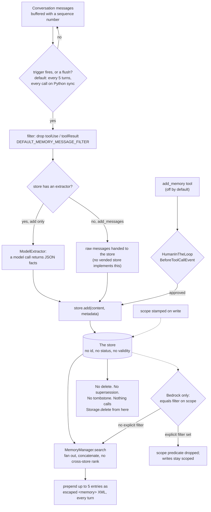

## 1. Executive Summary

Strands Agents is AWS's open-source agent SDK, Python and TypeScript at close
parity, with a harness, a CLI, an MCP server and a documentation site in one
monorepo; its memory is a store protocol with a background extractor and a
per-turn injector. The contract is well built: optional store methods are detected
by inspecting the type, and the Bedrock store's scope key is stamped on write,
enforced on read and tested with a positive control. The exit is missing: nothing
in the protocol or any vended store deletes or supersedes a memory, and the
harness turns memory on by default.

The design is a **store protocol**. `MemoryStore` declares one required method,
`search`, and four optional ones — `add`, `add_messages`, `initialize` and
`get_tools` — and the manager detects which a store actually implements by
inspecting its type rather than by asking it to declare a capability
(`_has_method` treats an inherited Protocol stub as "not implemented"). A
`MemoryManager` holds a list of stores, fans searches out concurrently,
registers a `search_memory` tool (on by default) and an `add_memory` tool (off
by default), and prepends a `<memory>` block to the model call. Three stores are
vended: markdown files, a JSON record file, and Amazon Bedrock Knowledge Bases.

Two things are unusually well done and one is missing entirely.

**The scope key is real on both sides.** `BedrockKnowledgeBaseStore` stamps
`(scope_metadata_key, scope)` onto every document it writes — inline for a
CUSTOM data source, in a `.metadata.json` sidecar for S3 — and sends
`{"equals": {"key": ..., "value": ...}}` as the Bedrock retrieval filter on
every search. It drops a caller metadata key that collides with the scope key
rather than letting it be overwritten. Both SDKs implement it the same way, and
a live integration test in each writes under one scope, **confirms the document
is retrievable there**, and then asserts it is absent from a search under
another. That positive control is what the atlas's `negative_eval` bar asks for
and most implementations do not have.

**There is no delete.** Not in the protocol, not in any vended store, not in
either SDK. `Storage`, the layer the file store sits on, declares
`async delete(key)` and three other subsystems call it — the context offloader,
the stash and the snapshot session manager — and nothing under `memory/` or
`vended_memory_stores/` does. The design document says how corrections are meant
to work: *"Corrections are handled by storing updated facts. Newer entries take
precedence via recency weighting in search results."* Of the three vended
stores, one implements recency weighting, as a tie-break between entries with
identical token-overlap scores; the other two rank on relevance alone. In the
harness's own default store a correction is **appended to the same markdown
file** as the fact it corrects, under the same heading, and both are retrieved
as one entry.

And the harness turns this on by default. `create_harness(memory=True)` builds a
`FileMemoryStore` under `./.agent/memory`, extracts durable facts from the
conversation every few turns with a cheap model, and injects up to five entries
before **every** model call. Nothing a person does can remove what it wrote
except editing the markdown by hand.

**One seam fails silently, in Python only.** The Python `FileMemoryStore`
accepts any `Storage` backend and hands the query string to that backend's
`search`, which the SDK's storage guide describes as an optional extra. Over a
backend whose `search` does not take a string — the AWS-maintained DynamoDB
backend is one — every search raises, the manager logs a warning and returns
nothing, and extraction goes on writing (section 6).

## 2. Mental Model

A memory becomes a memory when a background model call decides it is durable.

There is no candidate state and no promotion ladder. An `ExtractionTrigger`
fires — after every invocation, or every *N* invocations, default 5 — or a flush
forces it, and the `ExtractionCoordinator` hands that store's unsaved messages
to an `Extractor`, whose default system prompt asks for *"durable facts worth
remembering across future conversations"* as a JSON array and says to return
`[]` when there is nothing. Whatever comes back is written through `store.add`
and is, from that moment, indistinguishable from anything else in the store.

The epistemic shape is set by what the protocol does not carry. A `MemoryEntry`
is `content`, a `store_name` the manager fills in, and a free-form `metadata`
dict. No id the caller can name later, no validity interval, no status, no
actor, no provenance beyond which store it came from. A caller *may* put
anything in `metadata` — a TypeScript test fixture puts `verified: true` in one
— and nothing in either SDK reads it back for a decision. So the store holds
claims, not beliefs, and the only lifecycle question it can answer is "does this
match the query".

That makes the exit question the interesting one, and it has no answer. A fact
that was true in March and is false in September can be written over by a newer
fact, and both will be retrieved; the older one loses only where a store happens
to rank on recency, and only against an exact score tie. The marker for this is
not a bug but an absence with a stated intention behind it — the design doc
chose recency weighting as the correction mechanism, and the stores that would
have to implement it mostly do not.



## 3. Architecture

The memory subsystem is `strands-py/src/strands/memory/` (2,037 lines across the
manager, types and the four extraction modules) and
`strands-py/src/strands/vended_memory_stores/` (1,427 lines, three stores), with
the TypeScript equivalents under `strands-ts/src/memory/` (1,846) and
`strands-ts/src/vended-memory-stores/` (1,378) — 6,688 lines of implementation
in total, excluding tests. Above it sit two thin harness wrappers: `harness-py`'s
`memory.py` (137 lines) and `harness-ts`'s `memory.ts` (111), which build a
`MemoryManager` over a local file store and fix the tool policy.

Standing it up costs nothing for the local stores: `FileMemoryStore` writes
markdown under `./.strands/memory/<name>/` by default, or wherever the harness
points it, and `TestMemoryStore` writes one JSON file. The third needs AWS — a
Bedrock knowledge base id, a data source id, an S3 bucket for the S3 path, and
IAM for `GetKnowledgeBase`, `Retrieve`, `IngestKnowledgeBaseDocuments` and
`PutObject`. The store calls `GetKnowledgeBase` during `initialize`, which the
manager runs at agent construction *"so permission or connectivity issues
surface early"*, and caches the knowledge base type because a managed KB takes
`managedSearchConfiguration` where a vector one takes
`vectorSearchConfiguration`.

Underneath the file store is a separate `Storage` protocol —
`write`/`read`/`delete`/`list`/`search` — with local-file, in-memory and S3
implementations and two scorers, a 95-line token-overlap `keyword.py` and a
341-line `bm25.py`. `FileMemoryStore` uses the namespaced wrapper, so a store
named `agent-memory` lands at `memory/agent-memory/`; the harness passes
`LocalFileStorage(memory_dir).namespace("")` to flatten that back out so files
sit directly in `./.agent/memory`.

A backend reaches the file store only through its own `storage` argument. The
agent-level `Agent(storage=...)` default is read by the context offloader, the
context manager's stash and the session managers
(`strands-py/src/strands/agent/agent.py:324-329`), not by any memory store, so
an agent given a DynamoDB or S3 backend at the top keeps its file memory on
`LocalFileStorage` unless the store is built with that backend explicitly.

**Memory and sessions are different subsystems, and this report is about one
of them.**
`strands-py/src/strands/session/` — file, S3, repository and snapshot session
managers, with their own tests — persists the agent's message history so a
conversation resumes. That is session persistence, and by this atlas's
[inclusion test](../../families/#not-in-scope-conversation-window-management) it
is not agent memory. The memory subsystem is the belief store, and the harness's
own docstring draws the same line: *"Persistence is plain files, independent of
any session: memory survives across sessions and works with sessions off."*

## 4. Essential Implementation Paths

**Registration.** `MemoryManager.__init__` takes `stores`, validates unique
names, resolves the tool configs and the injection config, and builds the tool
list. `init_agent` then runs `_init_stores` (awaiting each store's
`initialize`), `_init_extraction` (building the coordinator and attaching each
store's triggers) and `_init_injection`.

**Extraction.** `ExtractionCoordinator.record` buffers every message with a
monotonic `seq`. When a trigger calls `fire`, `schedule` dispatches
`_extract` as a background task, capturing the live agent span synchronously
because the save runs after that span has ended. `_extract` takes everything
past the store's high-water mark, **advances the mark before writing** so a
queued save cannot pick the same messages up, filters content blocks, and calls
`_write`. On failure `_on_save_failed` rolls the mark back, increments a
consecutive-failure count, and after 10 puts the store into a backoff where only
every third request is let through as a probe.

**The two write shapes.** With an extractor, `_write` runs it and then
`asyncio.gather`s one `store.add` per extracted fact. If any of them fails, the
whole batch raises and retries later, which is why the Protocol tells
implementers that *"extraction writes are at-least-once"* and stores *"should
tolerate duplicate writes"*. Without an extractor, the filtered messages go
straight to `store.add_messages` with an `AddMessagesContext` carrying each
message's sequence number, so a backend can build a retry-stable idempotency
key. The docstring explains why a content hash would not do: *"two messages
share text (e.g. "ok")"*.

**Retrieval and injection.** `MemoryManager.search` gathers `store.search`
across every target with `return_exceptions=True`, logs and counts per-store
failures, stamps `store_name` onto each entry, and concatenates in target order.
`_provide_memory_context` derives a query — the latest user message's text on a
user turn, otherwise the most recent assistant message's — searches for
`max_entries` (default 5), and renders `_default_injection_format`: a
`<memory>` block of `<entry source="...">` elements with both the content and
the source XML-escaped. A `query` or `format` callback that raises **fails
open**: injection is skipped, the turn proceeds.

**The tools.** `search_memory(query, stores=None)` is registered by default.
`add_memory(entries, stores=None)` is opt-in, and its tool config carries
`wait_for_writes`, default true; with it false the writes are dispatched
detached and the model gets `{"accepted": n}` back before anything has landed.
Both run through `_resolve_tool_targets`, which keeps in-scope store names and
drops out-of-scope ones with a warning, raising only when every requested name
is out of scope.

**The harness.** `resolve_memory` builds the manager with
`injection=MemoryInjectionConfig(trigger="everyTurn")` rather than the SDK
default of `"userTurn"`, because the harness runs multi-step tool loops and an
autonomous step should consult memory too. A `subagent` delegate gets the same
stores through `_ReadOnlyStore`, which reimplements `search` and `initialize`
and **omits** `add`, `add_messages`, `extraction` and `get_tools` — the last of
those deliberately, since *"a store-native tool is an unbounded surface we can't
guarantee is read-only."*

## 5. Memory Data Model

The unit is a `MemoryEntry`: `content: str`, `store_name: str | None` filled in
by the manager, `metadata: dict[str, Any] | None`. That is the whole protocol
model. There is no id, no created-at, no validity interval, no status and no
actor, and the manager forwards only `max_search_results` across stores, so a
backend-specific search field cannot travel through it.

Each vended store keeps more, and none of it is visible through the protocol:

- **`FileMemoryStore`** derives a filename from the first line of the content,
  slugified and truncated to 50 characters. If that slug already exists the new
  facts — every line *after* the heading — are appended to the existing file.
  `metadata` is accepted and discarded; the docstring says so: *"Unused;
  accepted for interface compatibility."* On the way back out, `search` invents
  `{"path": key, "score": score}` as the entry's metadata.
- **`TestMemoryStore`** keeps a JSON array of records with `id` (a UUID),
  `content`, `metadata` and `createdAt`, and validates on read that all three of
  `id`, `content` and `createdAt` are strings. `createdAt` is written time only;
  there is no second axis anywhere in the subsystem, and a search for
  `valid_from`, `validFrom`, `as_of`, `asOf`, `observed_at` and `effective_`
  across both SDKs' memory trees returns nothing.
- **`BedrockKnowledgeBaseStore`** mints a document id (a UUID for CUSTOM, the
  `s3://` URI for S3) and returns it, so a caller *does* get a stable handle —
  and there is no method on the store that takes one back.

Scope lives on the third store alone, as `scope` plus `scope_metadata_key`
(default `namespace`). `_resolve_attributes` puts it first in the attribute
list for both document shapes, and refuses a caller metadata key that collides
with it. An `access_control_list` can be attached to a document as well, and
when a data source has ACL awareness enabled and the store has none configured,
the store recognises the Bedrock `ValidationException` and re-raises it as a
message naming the field to set.

Nothing anywhere is an append-only record of mutations. Searches, adds and
extractions all open OpenTelemetry spans — `start_memory_search_span`,
`start_memory_add_span`, `start_memory_extract_span`, with a 363-line telemetry
test beside them — and those go to a trace backend, not into the store the
`audit_log` mark asks about.

## 6. Retrieval Mechanics

Retrieval is per store and the manager does not rank across them. `search` fans
out concurrently and concatenates results in target order, and the type
documentation is explicit about the consequence: *"results are concatenated in
store-registration order with no cross-store ranking, so this cap can favor
entries from earlier-registered stores."* With `max_entries` at 5 and two
stores, the first-registered one can fill the injection.

The two local stores rank on token overlap. `keyword.py` scores query tokens
against the stored text and sorts on score alone. `TestMemoryStore` sorts on
`(score, createdAt)` descending, so recency breaks a tie and nothing more — the
docstring says *"the most recent entry winning ties"*, which is a fair
description of what the code does and a narrower thing than the design doc's
correction story rests on. The Bedrock store delegates ranking to the knowledge
base and can apply a `min_score`/`max_score` bound afterwards, keeping a result
the knowledge base did not score at all and documenting that *"a query the
knowledge base has no good answer for can legitimately return none."*

**The Python file store searches through its storage backend, and only a backend
that takes a string answers.** `FileMemoryStore.search` passes the
natural-language query straight to `self._storage.search`
(`strands-py/src/strands/vended_memory_stores/file_memory_store/store.py:159`).
The three bundled backends take a string and fall back to the token-overlap scan
(`strands-py/src/strands/storage/local_file_storage.py:241`,
`in_memory_storage.py:115`, `s3_storage.py:192`), and so does a class that
subclasses the `Storage` Protocol and inherits its default body
(`storage/storage.py:177-196`). Two shapes the SDK's own documentation describes
do not.

The storage guide tells an implementer to write four methods — `write`, `read`,
`delete`, `list` — and treats `search` as an extra that *"plugins that need
richer access can check for"*, naming Memory among the consumers
(`site/src/content/docs/user-guide/sdk/storage.mdx:20-22, 240-253`). A
four-method class that does not subclass the Protocol has no `search`, directly
or behind `_NamespacedStorage.search` (`storage.py:234-236`), so the call raises
`AttributeError`. The AWS-maintained DynamoDB backend, which the SDK's learning
page offers as *"one production backend"* for sessions, memory and offloaded
context
(`site/src/content/docs/learning/persistent-memory-with-session-managers.mdx:134`),
implements `search(query: SearchQuery)` for vector similarity and reads
`query.pk` before its `try`, so a string raises there too
([`aws/strands-dynamodb-storage` at
`91a7bd00f3ffd3a60cad98caa780f537ff53a083`](https://github.com/aws/strands-dynamodb-storage/commit/91a7bd00f3ffd3a60cad98caa780f537ff53a083),
`python/src/strands_dynamodb_storage/dynamodb_storage.py:412-433`).

Either way nothing surfaces. `MemoryManager.search` gathers stores with
`return_exceptions=True`, logs `store search failed` at warning and counts the
failure on the search span
(`strands-py/src/strands/memory/memory_manager.py:327-359`), so `search_memory`
and the injected block get nothing from that store while its writes keep landing
— `add`, `read`, `write` and the key-aware extractor's `list("")` all work.
Reaching it takes an explicit `FileMemoryStore(storage=...)`; the harness always
builds on `LocalFileStorage`.

The TypeScript file store never calls `storage.search`. It runs a configured
`SearchStrategy` or scans with `list` and `read`
(`strands-ts/src/vended-memory-stores/file-memory-store/store.ts:201-209,
226-230`), under a docstring that says it delegates to the backend's `search()`
when available (`store.ts:194`), and the TypeScript `Storage` declares `search`
optional (`strands-ts/src/storage/storage.ts:172-177`). The seam is Python-only,
and the Python `store.py` is byte-identical from release `python/v1.55.0` to
this pin.

Injection runs before the model call, gated on a trigger — `userTurn` in the
SDK, `everyTurn` in the harness — and is where retrieval actually matters,
because `search_memory` being registered does not mean the model calls it. Two
properties are worth copying. The query callback can return `None` or `""` to
skip injection for a turn, so "nothing worth looking up" is expressible rather
than being a wasted search. And both callbacks fail open on an exception: a
broken formatter costs the injected block, not the turn.

The default format escapes entry content and source into a `<memory>` block, and
the type documentation puts the responsibility where it belongs for the
override: *"a custom `format` that emits markup is responsible for its own
escaping."*

## 7. Write Mechanics

**On the async path the default write does not block the agent.** `schedule`
dispatches a background task and returns, and the trigger hook runs at
`HookOrder.SDK_LAST` after the invocation has settled
(`strands-py/src/strands/memory/extraction/triggers.py:94`). The TypeScript
agent works the same way.

**Python's synchronous entry point waits on extraction after every call.**
`Agent.__call__` runs `_invoke_async_and_flush`, which awaits
`memory_manager.flush()` in a `finally`
(`strands-py/src/strands/agent/agent.py:894-905`), because each synchronous call
runs in its own event loop and closing it would cancel pending saves. `flush`
enqueues every extraction store regardless of its trigger and bypasses backoff
(`strands-py/src/strands/memory/extraction/coordinator.py:174-194`). So a
synchronous caller blocks on the extraction model call, and the
every-five-invocations cadence becomes every invocation.

A memory is retrievable as soon as the store says so, which for Bedrock means
after knowledge base indexing — the integration tests carry an explicit
`wait_for_indexed` helper for exactly that lag, and nothing in the SDK exposes
it to an application.

**On the async path a short run can end with the last turns unsaved.** The
harness docstring names the remedies: `async with agent:`, or `agent.shutdown()`
(`await agent.shutdown_async()` from async code), both of which call
`memory_manager.flush()` (`agent/agent.py:764-783`). The CLI flushes at that
boundary and *"a library consumer should do one of these."* `flush` drains
automatic extraction and explicitly does **not** await `add_memory`
fire-and-forget writes (`memory/memory_manager.py:767-775`).

**No background pass rewrites the store.** There is no consolidation, no
deduplication, no reindex and no sweep. The only thing that touches an existing
record is `FileMemoryStore.add` merging new facts into a file whose slug already
exists.

Three properties of the write interact.
Extraction is **at-least-once** by design, and the retry granularity is the
whole batch: if one of five concurrent `add` calls fails, the mark rolls back
and all five facts are extracted and written again. `FileMemoryStore.add` has
no idempotency — it appends. So the vended store the harness enables by default
is the one that accumulates duplicates under the contract the protocol warns
about. And the buffer holding unsaved messages is trimmed only past the
*minimum* mark across stores, so *"a store stuck failing keeps its messages
buffered"* — bounded, as the comment says, by the session, which for a
long-running agent is not a small bound.

## 8. Agent Integration

Two SDKs at close parity, and the parity is the integration story. The memory
manager, the coordinator, the triggers, the extractor and all three vended
stores exist in both, with matching behaviour down to the timestamp format:
`TestMemoryStore._now` is documented as matching JavaScript's `toISOString()`
*"so a record written by either SDK carries the same timestamp shape"*, and the
store name is sanitised identically for *"cross-SDK compatibility."*

The surfaces are: the SDK (`Agent(memory_manager=...)`), the harness
(`create_harness(memory=True)`, on by default), the `strands` CLI over that
harness, an MCP server in `strands-mcp/`, and the two model-facing tools. The
subagent path is the most interesting one — `subagent.py` calls `resolve_memory`
for the child with `writable=False`, so a delegate reads the parent's memory and
cannot write to it, *"without promoting its throwaway subtask into the store."*

A store may also contribute its own tools through `get_tools`, which the manager
registers alongside its two. None of the three vended stores implements it, and
the read-only wrapper drops it. The file-store design, marked `Proposed`, plans
exactly such a tool — `read_<store_name>_file`, for progressive disclosure over
the file tree — and a consolidation step
(`team/designs/0017-file-memory-store.md:24, 60-99`); the shipped store has
neither in either SDK.

## 9. Reliability, Safety, and Trust

**Nothing can be deleted, and the substrate could.** `Storage` declares
`async delete(key)`; `_NamespacedStorage` forwards it; `LocalFileStorage`,
`InMemoryStorage` and `S3Storage` implement it; the context offloader, the stash
and the snapshot session manager call it. A search for `delete`, `remove`,
`forget`, `expire`, `ttl`, `supersede`, `tombstone` and `invalidate` across
`memory/` and `vended_memory_stores/` in both SDKs returns the phrase
"fire-and-forget" and one comment about removing content blocks before
extraction. The capability is one layer down and the memory layer does not reach
it.

**A store can fail every read and succeed at every write.** The Python
file-store seam in section 6 is a reliability defect more than a ranking one:
writes land, reads raise, and the manager's fail-soft gather turns the exception
into a warning line and a `store_failure_count` attribute on a span. An operator
sees an agent that extracts memories and never recalls them, with nothing on the
agent's own surface to say why. The configuration that reaches it is the one the
storage guide and the learning page describe — a production backend passed to
the store — and it needs no misuse beyond following them.

**The correction mechanism is documented and mostly unimplemented.**
`team/designs/0011-memory-manager.md` line 152: *"Corrections are handled by
storing updated facts. Newer entries take precedence via recency weighting in
search results."* Of the three stores, `TestMemoryStore` weights recency as a
tie-break, `FileMemoryStore` does not weight it at all, and the Bedrock store
ranks by semantic relevance. In the harness default, "I moved to Berlin"
extracted in March and "I moved to Lisbon" extracted in September both land under
a `# User location` heading in one file and are injected together as one entry.

**Extraction excludes tool traffic by default, which is the right default and
not a complete fence.** `DEFAULT_MEMORY_MESSAGE_FILTER` strips `toolUse` and
`toolResult`, and nothing in the SDK or the harness overrides it — so a page the
agent fetched with `web_fetch` is not itself extracted into durable memory. The
assistant's own text *about* that page is, because it is an ordinary text block.
So the direct vector is closed and the laundered one — the model retelling
hostile content in its own words, and that retelling becoming a memory injected
before every subsequent turn — is not. The injected block is XML-escaped, which
prevents tag confusion and not instruction-following.

**The scope predicate has an override that drops it.** `_resolve_filter` returns
an explicit `filter` before it considers `scope`, so a filter set to narrow a
search by any other attribute removes the tenant predicate entirely while writes
continue to carry the scope stamp. Both SDKs document the asymmetry in the field
docstring and a unit test pins the behaviour, so this is a chosen design rather
than an oversight — but a tenant boundary that a second, unrelated feature
silently disables is worth stating as what it is.

**The human-in-the-loop gate does not reach the default write.**
`HumanInTheLoop` and `CedarAuthorization` are real intervention handlers, and
`HumanInTheLoop.before_tool_call` hooks `BeforeToolCallEvent`. Extraction is not
a tool call — the coordinator calls `store.add` directly from a background task
— so the path that writes memory by default never passes the gate. The optional
`add_memory` tool does, and it is off by default. There is no surface anywhere
that lists memories for a person to approve, reject or remove; the harness's
store is markdown a person can open in an editor, which is a filesystem and not
a review state. `human_review` is withheld on that basis, and naming why is more
useful than the dash: the machinery exists, it is good, and it is on the other
side of the boundary from the memory.

**Two marks are carried.** `scope_enforced` and `negative_eval`, both evidenced
in the frontmatter. `tombstone`, `bitemporal` and `audit_log` have no candidate
mechanism at all — the searches for validity intervals and for an append-only
mutation record return nothing in either SDK. `trust_state` is withheld because
metadata is free-form and nothing reads it back: a caller can write
`verified: true` and a TypeScript test fixture does, and no read path in either
SDK filters or branches on any metadata key.

## 10. Tests, Evals, and Benchmarks

**I ran nothing.** The screen of a full clone reported 19 dependency surfaces
inside the seven-day cooldown, dated by their own commits. The posture was
read-only either way, and every claim on this page is read from source at the
pinned commit.

The memory subsystem carries 25 test files — 759 cases in 11,700 lines across
both SDKs and the harness — and the coverage is real rather than nominal.
`test_memory_manager.py` alone is 1,556 lines; the Bedrock store's unit suite is
1,176. The behaviours that matter are pinned. A store implementing only the
Protocol's inherited stub counts as not implementing it. `IntervalTrigger`
rejects `True` as a turn count because `bool` subclasses `int`. A metadata key
colliding with the scope key is dropped and logged, an explicit filter beats the
scope-derived one, and the high-water mark rolls back on failure.

The one that earns a mark is the pair of live scope-isolation cases described in
the frontmatter. What makes them worth copying is the ordering: write, wait for
indexing, **assert present in scope A**, then assert absent in scope B, under a
comment that says *"absence is only meaningful once the doc is confirmed
retrievable in scope A above"*. The unit-level scope tests beside them show the
difference the mark draws: they assert that the right filter reached a mock
whose `retrievalResults` is `[]`, which establishes the request shape and
nothing about what the knowledge base would have returned.

The gap in the suite is the interaction between the at-least-once contract and
the store that cannot absorb it. `_write`'s docstring states that a partial
batch failure retries the whole batch and that *"stores should expect duplicate
writes"*; `FileMemoryStore.add` appends new facts to an existing slug with no
dedup. Both SDKs' suites pin the append and the heading-only no-op
(`strands-py/tests/strands/vended_memory_stores/file_memory_store/test_store.py:97-113`),
and neither adds an identical entry twice, which is what a retried batch does.

The seam in section 6 has no case either. The Python file-store suite builds
every store over `InMemoryStorage`
(`strands-py/tests/strands/vended_memory_stores/file_memory_store/test_store.py:7-13`),
so no committed test runs `FileMemoryStore.search` over a backend without a
string-accepting `search`.

There is no paper and no benchmark. `arxiv`, `bibtex`, `@article`, `citation`
and `doi` return nothing in the README or `CONTRIBUTING.md`, which is what one
expects of a vendor SDK, and the `site/` directory carries documentation rather
than results.

## 11. For Your Own Build

### Steal

**Detect an optional method instead of declaring a capability flag.**
`_has_method` looks the name up on the store's *type* and returns false when it
resolves to the Protocol's own stub, so a store that inherits the interface
without overriding a method is correctly read as not implementing it. The
alternative — a `supports_add: bool` the implementer sets — is a second thing to
keep in sync with the code, and it is wrong the first time someone forgets.

**Push extension points into context objects.** `AddMessagesContext`,
`InjectionQueryContext` and `InjectionFormatContext` carry what a store or a
callback needs, so the method signatures stay fixed while the calling
convention grows.

**Give the retry a key the content cannot provide.** `AddMessagesContext`
carries a per-message sequence number precisely so a store can build an
idempotency token, and the docstring explains why the obvious alternative fails:
a content hash *"collides when two messages share text (e.g. "ok")"*. It also
states the constraints on the number — gaps are possible, it resets each run —
so an implementer knows to combine it with a run id rather than trusting it
alone.

**Advance the high-water mark before the write and roll it back on failure.**
The extraction coordinator keeps one mark and one task chain per store, moves
the mark before a save so a queued save cannot take the same messages, restores
it when the save fails, and after ten consecutive failures lets every third
request through as a probe rather than giving up.

**Attenuate a delegate by removing methods, not by setting a flag.**
`_ReadOnlyStore` wraps a store and simply does not define `add`, `add_messages`
or `get_tools`. Because the manager detects sinks by inspection, the delegate's
manager cannot route a write to it — there is no `writable=False` to be ignored
by a future code path. The reason for dropping `get_tools` is the transferable
part: a store-native tool is an unbounded surface nobody can certify read-only.

**Let the injection query return nothing.** A query callback returning `None` or
`""` skips injection for that turn. Expressing "there is nothing to look up
here" costs one branch and saves the whole retrieval.

**Fail open on the cosmetic path and loud on the semantic one.** A raising
`query` or `format` callback skips injection and the turn proceeds; a store
write failure raises `AggregateMemoryError` naming every store that failed and
carrying the flattened reasons. Two different failure classes, two different
answers.

### Avoid

**A correction story in the design doc that one implementation supports.**
Recency weighting is a reasonable answer to supersession-without-delete. It has
to be in the stores, and here it is in one of three, as a tie-break.

**An override that replaces a security predicate instead of narrowing it.** If
`filter` and `scope` are both set, the safe composition is the conjunction.
Returning the explicit filter alone makes an unrelated feature a scope-disabling
switch, and documenting the asymmetry does not make the failure less total.

**A write contract the shipped default store cannot honour.** At-least-once
delivery plus an appending store equals duplicated facts, and the appending
store is the one the harness turns on.

**Calling an optional backend method as if it were required.** The storage
guide lists four methods and calls `search` an extra to check for; the Python
file store calls it unconditionally, while the TypeScript file store in the same
repository scans with `list` and `read`. A layer above a storage contract should
feature-detect what it needs, fall back when it is absent, and carry a test over
a backend that lacks it.

**A fail-soft fan-out that makes a broken store look empty.** Logging one
store's search failure and returning the others is the right availability
default. Without a per-store health signal on the agent's surface, a store that
fails every read while accepting every write is indistinguishable from one that
has nothing relevant.

**A capped injection with no cross-store ranking.** Concatenating stores in
registration order and then cutting at `max_entries` lets the first-registered
store crowd out the rest regardless of relevance.

**Memory on by default with no way to take anything back.** The combination —
automatic extraction, automatic injection every turn, no delete, no review
surface — means the first thing an adopter needs after their agent remembers
something wrong is the one operation the SDK does not have.

### Fit

Take this if you are building on Strands already, or if you want a memory
interface to implement against without adopting anybody's storage opinion. The
protocol is five methods, the tool and injection policy is configurable per
manager, the extraction cadence is a value object you can subclass, and the
Python and TypeScript sides are close enough that a team split across both is
not maintaining two mental models. On Python, keep the file store on a bundled
backend or a `Storage` subclass until the search seam is closed.

Do not take it as the memory layer for anything that will receive a correction
request from a person — a user profile, an assistant that learns preferences, a
system with a compliance surface. A memory that can be wrong needs an identity
for a record, a way to supersede one, a way to remove one, and something durable
that says what happened. None of that can be added inside a store here, because
the manager has no method to route to and the entry has no id to name; you
would be building a second interface beside this one. This is a well-built
*recall* layer for facts nobody will need to unsay, and the correction half is
yours to write.

## 12. Open Questions

- **Does anything outside documentation implement `add_messages`?** The branch
  is carefully specified — sequence numbers, idempotency guidance, the
  no-extractor passthrough — and the memory guide carries a `ServerSideStore`
  example in both SDKs that implements it against a stand-in backend
  (`site/src/content/docs/user-guide/sdk/memory/managing-memory.mdx:449`). No
  vended store implements it. The site catalog lists an AgentCore memory store
  as an external integration, which is the shape it is aimed at, and that is
  outside the pin.
- **Is the Python file store meant to run over any `Storage`?** The config
  types `storage` as `Storage`, the storage guide calls `search` optional, and
  the TypeScript file store never calls it. Whether the Python store should
  feature-detect `search`, or every backend should accept a string query, is
  not recorded in `team/designs/0017-file-memory-store.md`, whose scope line
  reads `TypeScript SDK`.
- **What does the duplicate actually look like?** The at-least-once contract and
  the appending file store are both established from the code; the resulting
  file after a partial batch failure is not, and one test would settle it.
- **Is recency weighting intended to arrive in the stores?** The design doc
  states it as the correction mechanism and `TestMemoryStore` implements the
  narrow version. Whether `FileMemoryStore` is meant to follow is not recorded
  anywhere in `team/designs/`.
- **Why does an explicit filter replace the scope filter rather than AND with
  it?** Both SDKs document the choice and a test pins it, so it was made
  deliberately; the reason is not written down.
- **Does the manager's fan-out have a per-store timeout?** `asyncio.gather` with
  `return_exceptions=True` surfaces a failure, and a store that hangs holds the
  injection for the turn. No deadline appears on that path.

## 13. Appendix: File Index

| Path | Lines | What it holds |
| --- | --- | --- |
| `strands-py/src/strands/memory/memory_manager.py` | 775 | Registration, fan-out search, add, both tools, injection, flush |
| `strands-py/src/strands/memory/types.py` | 343 | `MemoryStore` Protocol, `MemoryEntry`, the config TypedDicts, `_has_method` |
| `strands-py/src/strands/memory/extraction/coordinator.py` | 336 | High-water marks, per-store chains, backoff, the two write shapes |
| `strands-py/src/strands/memory/extraction/types.py` | 149 | `Extractor`, `ExtractionTrigger`, `MemoryMessageFilter` and its default |
| `strands-py/src/strands/memory/extraction/model_extractor.py` | 159 | The fact-extraction prompt and the JSON parse |
| `strands-py/src/strands/memory/extraction/triggers.py` | 94 | `InvocationTrigger`, `IntervalTrigger` |
| `strands-py/src/strands/vended_memory_stores/bedrock_knowledge_base/store.py` | 596 | Scope stamping, the retrieval filter, CUSTOM and S3 ingestion, ACLs |
| `strands-py/src/strands/vended_memory_stores/test_memory_store/store.py` | 302 | JSON records with id and `createdAt`; recency as a tie-break |
| `strands-py/src/strands/vended_memory_stores/file_memory_store/store.py` | 202 | Markdown per slug, append-on-collision, metadata discarded; `search` delegates to `storage.search` at line 159 |
| `strands-py/src/strands/storage/storage.py` | 281 | The `Storage` Protocol, including the `delete` no memory path calls and the default string `search` |
| `strands-py/src/strands/storage/search/keyword.py` | 95 | Token-overlap scoring, sorted on score alone |
| `strands-ts/src/memory/memory-manager.ts` | 714 | The TypeScript manager |
| `strands-ts/src/vended-memory-stores/bedrock-knowledge-base/store.ts` | 740 | The TypeScript Bedrock store, scope and filter at parity |
| `strands-ts/src/vended-memory-stores/file-memory-store/store.ts` | 308 | The TypeScript file store: a strategy or a `list`-and-`read` scan, never `storage.search` |
| `strands-ts/src/storage/storage.ts` | 232 | The TypeScript `Storage` interface, with `search` optional |
| `strands-py/src/strands/agent/agent.py` | 2072 | The synchronous call's flush, `shutdown`, and the agent-level `storage` default |
| `harness-py/src/strands_harness/memory.py` | 137 | `resolve_memory`, the harness tool policy, `_ReadOnlyStore` |
| `harness-ts/src/memory.ts` | 111 | The TypeScript equivalent |
| `strands-py/tests/strands/memory/test_memory_manager.py` | 1556 | The manager's unit suite |
| `strands-py/tests/strands/vended_memory_stores/bedrock_knowledge_base/test_store.py` | 1176 | Scope, filter, ingestion and ACL cases against mocked clients |
| `strands-py/tests_integ/memory/test_bedrock_knowledge_base_store.py` | 447 | Live KB cases, including the scope-isolation case with its positive control |
| `strands-py/tests/strands/vended_memory_stores/file_memory_store/test_store.py` | 299 | The file store's suite, over `InMemoryStorage` only |
| `site/src/content/docs/user-guide/sdk/storage.mdx` | 270 | The four-method custom-backend contract, with `search` as an extra |
| `site/src/content/docs/user-guide/sdk/memory/managing-memory.mdx` | 488 | Flush guidance and the `ServerSideStore` example implementing `add_messages` |
| `team/designs/0011-memory-manager.md` | 460 | The design, including the correction story at line 152 |
| `team/designs/0017-file-memory-store.md` | 635 | The file store's design |

### Recorded searches

Commands run at the repository root, for the absence claims above.

```sh
# No deletion, expiry or supersession anywhere in the memory subsystem
# (9 lines of two kinds: eight uses of "fire-and-forget", and a docstring about
# removing content blocks before extraction).
grep -rniE "\b(delete|remove|forget|expire|ttl|supersede|tombstone|invalidate)\b" \
  strands-py/src/strands/memory/ strands-py/src/strands/vended_memory_stores/ \
  harness-py/src/strands_harness/memory.py

# Who calls the Storage delete the memory layer does not: the context offloader,
# the stash, the snapshot session manager, and the namespacing wrapper.
grep -rn "\.delete(" strands-py/src/
grep -rn "\.delete(" strands-ts/src/

# No validity interval on either side (0 results).
grep -rniE "valid_from|validFrom|valid_to|validUntil|as_of|asOf|observed_at|effective_" \
  strands-py/src/strands/memory strands-py/src/strands/vended_memory_stores \
  strands-ts/src/memory strands-ts/src/vended-memory-stores

# No append-only mutation record in the store (0 results).
grep -rniE "audit|event_log|append-only|appendOnly" \
  strands-py/src/strands/memory strands-py/src/strands/vended_memory_stores \
  strands-ts/src/memory strands-ts/src/vended-memory-stores

# No discrete epistemic status: every hit is a Promise rejection status, the
# prose "candidate set", a local variable named candidate, a validation or
# ingestion error message, or one TS test fixture's free-form metadata value.
grep -rniE "\b(verified|unverified|candidate|rejected|trust|provenance|approved|pending_review)\b" \
  strands-py/src/strands/memory strands-py/src/strands/vended_memory_stores \
  strands-ts/src/memory strands-ts/src/vended-memory-stores \
  harness-py/src/strands_harness/memory.py harness-ts/src/memory.ts

# add_messages: the Protocol's raising default, the ServerSideStore example in
# the memory guide (Python and TypeScript), and TS test helpers; no vended store.
grep -rn "def add_messages\|addMessages(" strands-py/src strands-ts/src \
  harness-py/src harness-ts/src site/docs site/src

# Nothing overrides the default extraction filter that drops tool traffic.
grep -rn "MemoryMessageFilter\|memoryMessageFilter" \
  strands-py/src harness-py/src strands-ts/src harness-ts/src

# The recency-weighting claim: one sort in the memory tree carries a time term,
# and it is TestMemoryStore's tie-break.
grep -rniE "recency|recent|created_at|createdAt|timestamp|sort" \
  strands-py/src/strands/storage/search/ strands-py/src/strands/vended_memory_stores/ \
  strands-py/src/strands/memory/

# The file-store suite's add calls with their tests: no single test adds the
# same entry twice; the three repeated strings sit in different tests, each over
# a fresh fixture (the TypeScript suite mirrors the Python one).
grep -n "def test_\|store.add(" \
  strands-py/tests/strands/vended_memory_stores/file_memory_store/test_store.py

# Nothing in either SDK waits for or reports Bedrock indexing (0 results);
# only the integration tests' helper does.
grep -rniE "wait_for_indexed|waitForIndexed|get_knowledge_base_documents|GetKnowledgeBaseDocuments" \
  strands-py/src strands-ts/src

# No paper (0 results).
grep -rniE "arxiv|bibtex|@article|citation|doi" README.md CONTRIBUTING.md

# The one storage.search call in either SDK's vended stores is the Python file
# store's (1 result); the TypeScript file store never makes it.
grep -rn "storage\.search(" strands-py/src/strands/vended_memory_stores \
  strands-ts/src/vended-memory-stores

# Readers of agent-level storage: offloader, context-manager stash, session
# managers; no memory store.
grep -rn 'agent\.storage\|getattr(agent, "storage"' strands-py/src

# The Python file-store suite's only backend is InMemoryStorage.
grep -n "Storage" strands-py/tests/strands/vended_memory_stores/file_memory_store/test_store.py

# The TypeScript agent flushes only in shutdown (1 result); Python's also
# flushes in _invoke_async_and_flush after every synchronous call.
grep -n "flush()" strands-ts/src/agent/agent.ts
grep -n "_invoke_async_and_flush\|memory_manager.flush" strands-py/src/strands/agent/agent.py

# The design's progressive disclosure and consolidation are not in either
# shipped file store (0 results).
grep -rniE "progressive|consolidat|get_tools|getTools" --exclude-dir=__tests__ \
  strands-py/src/strands/vended_memory_stores/file_memory_store \
  strands-ts/src/vended-memory-stores/file-memory-store
```

## History

**2026-09-26** — [`15da9dca2cd6f870684fdc27a2498bebbd00b62d`](https://github.com/strands-agents/harness-sdk/commit/15da9dca2cd6f870684fdc27a2498bebbd00b62d) — 36 commits on. The memory trees are byte-identical; only the harness docstrings moved, to `Agent.shutdown()`. Marks unchanged. Added: the Python `FileMemoryStore` hands the query string to its backend's `search`, so over a four-method backend or DynamoDB every search fails behind a warning while writes land; the TypeScript store never calls it (sections 6 and 9). Corrected, all wrong at the previous pin: Python's synchronous call awaits extraction after every invocation (section 7); the memory guide implements `add_messages` in an example; history begins 16 May 2025, not 14 May; the test census is re-measured. Sections 11–13 folded into section 11. Screened from a full clone: 0 auto-run, 27 build-time execution points, 32 unpinned surfaces, 19 in cooldown. Nothing installed, built or run.

**2026-09-22** — [`880c5bd412b002254ad230da1394a3bbbca58d9f`](https://github.com/strands-agents/harness-sdk/commit/880c5bd412b002254ad230da1394a3bbbca58d9f) — first reading, at the head of the default branch. Screened before anything was read: **0 auto-run surfaces**, 27 build-time execution points (18 `conftest.py`, the root `package.json`'s `prepare: husky`, and seven example `package.json` files whose `prepare` runs `npm ci --prefix ../../..`), 32 unpinned dependency surfaces and 43 inside the seven-day cooldown — the cooldown count is an artifact of a `--depth 1` clone, which dates every file to the tip, and not a statement about the repository. `.gitattributes` carries `* text=auto eol=lf` and no `filter=`; there is no `.gitmodules`; `.claude/` and `.kiro/` are symlinks to `.agents/` and hold no settings or hooks; `.husky/pre-commit` runs the project's own build, test, lint, format and type-check scripts and is inert in a clone. `AGENTS.md` and `CLAUDE.md` are present and were treated as data. Nothing was installed, built or executed. Marks: `scope_enforced`, `negative_eval`.
