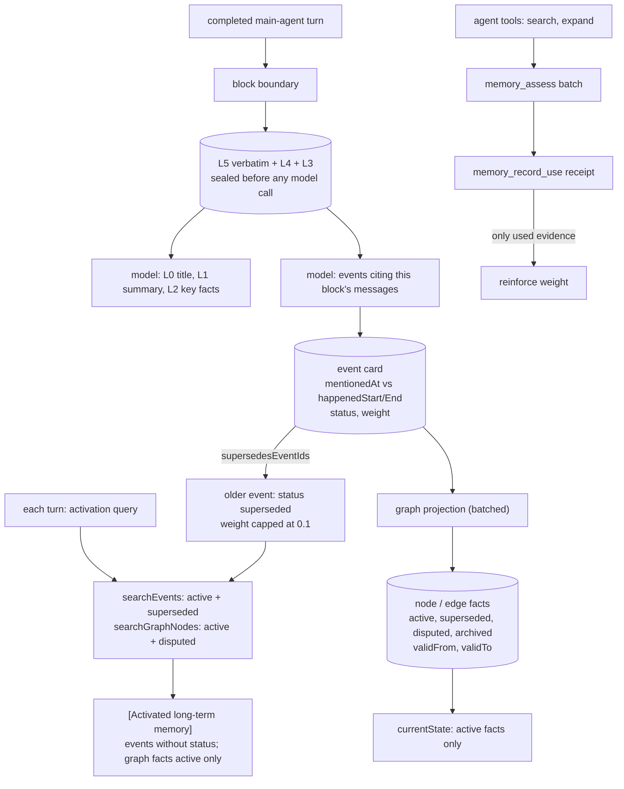

## 1. Executive Summary

StrataGate is a memory for long-running agents, written in TypeScript and
shipped as the `stratagate-dsh` plugin for DeepSeek Harness, version 0.2.71, MIT,
126 commits since 10 August 2026. About 12,300 lines of TypeScript sit across
the plugin runtime and `@stratagate/core`, with 196 test cases. A WorkBuddy
integration and an embeddable core library are included.

Its organising rule is that every derived memory can be traced to words that
were actually said. Conversation is cut into blocks. At each boundary the
complete messages (L5), a near-verbatim view (L4) and a deterministically pruned
view (L3) are sealed before any model runs. A model then writes the title
(L0), summary (L1) and key facts (L2). Older blocks decay toward shallower layers
and can be expanded back to their source.

On top of the blocks:

- **Event cards** each cite the source messages of one block and record when
  something was mentioned apart from when it happened, with precision and
  basis.
- **A knowledge graph** projected from the events holds the current state of
  people, projects, tools and places, with facts that carry a status and a
  validity window.
- **An evidence gate** asks the agent to assess each retrieved batch before
  relying on it. Only memories cited by a recorded use receipt gain weight, so
  retrieval alone never reinforces itself.

The graph's `disputed` and `superseded` facts are kept out of the current state
and out of the memory injected each turn, and every read is confined to a
namespace derived from the project directory. The filter runs at two levels:
`searchGraphNodes` considers only `active` and `disputed` *nodes*
(`packages/core/src/store.ts:1807`), so a superseded or archived node is never a
candidate, and `renderActivatedMemory` then renders only `active` *facts* of the
nodes that survived (`src/runtime.ts:2139`). A disputed node therefore reaches
the prompt with its name and `currentState` and an empty fact list, which is a
defensible answer and an easy one to miss.

Three details qualify the mechanism, all in the projector
(`packages/core/src/graph.ts`). A fact is created with `status: node.status`
(`:99`) rather than its own, so marking a *node* disputed makes every fact
written under it disputed. The supersession sweep matches only facts that are
`active` for the key (`:93`), so a disputed fact is never closed and keeps an
open `validTo` while later active facts accumulate beside it. And an
unrecognised status is coerced to `active` — at the node (`:78`) and at the edge
(`:118`) alike — so a value the model supplies outside the four-name set fails
toward the most permissive state rather than the most conservative one. Nothing
in the committed tests pins that coercion.

Events are handled less carefully. A superseded event stays a candidate for the
memory injected on every turn. Its weight is capped rather than excluded, and
pinned or safety-critical events are added regardless. The injected rendering
omits both its status and its successor, so the retired version reads as
background evidence like any other. The tools an agent calls do show `status`.

Three marks: `trust_state`, `scope_enforced`, `negative_eval`.

## 2. Mental Model

A **namespace** is one memory space: by default a project, keyed by the
session's working directory. Inside it, **threads** are sessions.

A **block** is a run of turns with six layers (`README.md:136-147`):

- L5 — the complete messages and tool records, the final source;
- L4 — near-verbatim readable conversation;
- L3 — deterministically pruned conversation;
- L2, L1, L0 — model-written key facts, summary, and title with tags.

A block stays pending — unable to replace native history or decay — until its
model layers validate.

An **event** is a durable memory extracted from one block. Its `temporal`
record separates `mentionedAt` from `happenedStart` and `happenedEnd`, with
the original wording, precision, basis and a status such as planned or
cancelled.

The **graph** is a projection: nodes and edges whose facts cite events. It is
the view of what is true now.

## 3. Architecture

| Area | Files |
| --- | --- |
| Core store | `packages/core/src/store.ts` (in-memory state, mutations, search, derivation jobs), `sqlite.ts` (schema and persistence), `blocks.ts`, `graph.ts`, `elements.ts`, `retrieval.ts`, `weights.ts`, `external-memory.ts`, `types.ts` |
| Plugin runtime | `src/runtime.ts` (capture, activation, namespaces, tool handlers), `src/tools.ts` (tool definitions), `src/llm.ts` (model schemas for summaries, events and graph projection) |
| Admin UI | `src/web.ts` (routes), `src/client.js` (the Memory UI) |
| Other | `src/legacy-session.ts`, `src/fold.ts`, `src/graph-clustering.ts`, `integrations/deepseek-harness`, `integrations/workbuddy` |
| Evaluation | `benchmarks/*.json`, `docs/EVALUATION.md` |

### Deployment and ergonomics

- **Install:** `dsh plugin --profile web add stratagate-dsh`; the database lives
  at `DSH_HOME/stratagate/memory.db` and survives removing the plugin.
- **Models:** the harness's configured models write summaries, events and graph
  projections; nothing runs a separate server.
- **Hand-repairable:** partly. SQLite is inspectable, and the Memory UI shows
  blocks, events, sources, graph and use receipts, but its memory routes are
  read-only.

The screen of this checkout found no auto-run surface, four build-time
execution points (package lifecycle scripts), four unpinned surfaces and five
dependency files inside the seven-day cooldown. Nothing was installed, built or
run.

## 4. Essential Implementation Paths

- **Namespace** — `runtime.ts` `namespaceFor`: `prefix:project:<cwd key>` by
  default, `:session:<id>` or `:global:<name>` by configuration; `space()` opens
  one StrataGate per namespace, and `sqlite.ts` loads every table
  `WHERE namespace = ?`.
- **Event creation and supersession** — `store.ts:1735-1756`: push the event,
  then for each id in `temporal.supersedesEventIds` set `superseded`,
  `supersededBy` and `forcedCap = 0.1`.
- **Event search** — `store.ts:1212-1290`: candidates `active` or
  `superseded`, BM25 over weighted fields, participant, type and time rankings,
  RRF, `lastRetrievedAt` stamped.
- **Activation** — `runtime.ts:700-738`: search events and graph nodes with the
  current message and last two turns, add pinned and safety events
  (`activatedEvents`, `:2049-2063`), drop those from the current block, render
  within 900 tokens (`renderActivatedMemory`, `:2103-2148`).
- **Graph projection** — `graph.ts:60-135`: status from the proposal, validity
  from the proposal or the source events' chronology, supersede the active fact
  for the same key and close its `validTo`.
- **Use receipts** — `store.ts:1583` `recordMemoryUse`: idempotent by receipt
  id; only cited ids gain mention count.

## 5. Memory Data Model

`events` (`sqlite.ts:286-313`): namespace, id, position, title, summary,
narrative, tags, quotes, source block, formed turn, `temporal_json`, scope
(user, project or session), criticality (routine, preference, identity,
safety), confidence, status (active, superseded, forgotten, archived),
`superseded_by`, mention count, last adopted turn and weight fields, with
`event_sources` linking to message ids.

**Time.** An event's `temporal` separates mention from occurrence, and graph
facts carry `validFrom` and `validTo`. `validFrom` comes from the projection or
the source events' occurrence time, beside `createdAt`. An as-of read exists
only as `memory_expand_element(id, at)` over **element cards**
(`elements.ts:172-182`). Element cards are the legacy projection: the plugin
runtime configures no element projector, and its comment says new spaces never
create them (`runtime.ts:712-715`). `memory_expand_graph_node` has no `at`, so
on the live graph valid time is recorded and never queried as of a date, and
`bitemporal` is withheld.

**Status as trust.** The graph projector may mark a node or edge `disputed`.
Disputed and superseded facts remain in the node and are returned by
`memory_expand_graph_node` with their status. `currentState` and the injected
memory show only active facts. That earns `trust_state`.

**No tombstone, no mutation log.** A forgotten event is a status that search
excludes; nothing checks new extractions against it, so `tombstone` is withheld.
`usage_receipts`, which the UI calls its audit view, record which memories an
answer used, not changes to memory, and `model_response_history` records model
output. `audit_log` is withheld.

## 6. Retrieval Mechanics

**Event search** fuses BM25 over title, summary, tags, quotes, narrative,
participants, event type, original time wording and occurrence dates with
structured rankings. A `temporalIntent` of first or latest orders by
occurrence. A query with tokens and no BM25 hit returns nothing rather than
falling back to recency.

**Graph search** covers active and disputed nodes over name, aliases, tags,
current state, facts and relations.

**The evidence gate.** Every tool result is a batch with an id.
`memory_assess` records whether the batch is sufficient, and
`memory_record_use` writes a receipt naming what the answer relied on. Weight
grows only from receipts, so retrieval does not reinforce itself.

**Automatic activation** runs before each turn. It merges relevance with a
weight ranking that also admits every pinned or safety-critical event whose
status is active or superseded (`runtime.ts:2051-2055`). Two properties combine:

- `searchEvents` returns superseded events. Their weight cap of 0.1 lowers only
  the weight ranking, and a pinned event's weight is 1 regardless of the cap
  (`weights.ts:13-21`).
- `renderActivatedMemory` prints id, title, summary, occurrence times and the
  temporal status (planned, occurred, cancelled), and not `event.status` or
  `supersededBy` (`runtime.ts:2117-2124`).

A decision that was later superseded can therefore be injected as background
memory next to, or instead of, its replacement, with nothing in the text to say
it was retired. Graph facts in the same block are filtered to active, and tool
results carry `status` (`compactEvent`, `runtime.ts:1976-1990`).

## 7. Write Mechanics

**Sealing first.** L5, L4 and L3 are written before any model call, so a model
failure leaves the source intact and the block pending with a retrying job.

**Extraction** runs per block as soon as its layers validate. It may read
neighbouring blocks for context, but every fact and source reference must come
from the target block.

**Graph projection** runs in batches of eight events, prioritising active events
and project scope.

**External memory import** turns memory exported from another assistant into
events while preserving the imported text, and removing an import restores
events whose supersession pointed into it (`store.ts:1140-1160`).

**Forget and restore** exist on the core store (`store.ts:1638-1652`). No plugin
tool or UI route calls them.

## 8. Agent Integration

- **Tools:** `memory_search_events`, `memory_search_graph`,
  `memory_expand_graph_node`, the deprecated `memory_search_elements` and
  `memory_expand_element`, `memory_search_raw`, `memory_get_blocks`,
  `memory_expand_block`, `memory_expand_event`, `memory_assess`,
  `memory_record_use`, and `feedback_prepare`.
- **Automatic capture** of completed main-agent turns and tool results, and
  automatic activation of up to four events and four graph nodes per turn.
- **Memory UI** under DSH settings: overview, blocks with layer expansion,
  events, sources, graph, receipts, settings, job retries and imports. It deletes
  and edits nothing (`web.ts:1336`), so `human_review` is withheld.

## 9. Reliability, Safety, and Trust

**Provenance holds everywhere it is claimed.** Every event cites source messages
and every graph fact cites events. The UI's receipt view lets a person see what
an answer relied on.

**Namespaces are enforced by construction.** The namespace comes from the
session, not the model, and every load filters on it.

**Retired events are not retired from the injected context,** as in section 6.

**The injected block says to use memory as background evidence, not
instructions,** and puts current user instructions first.

## 10. Tests, Evals, and Benchmarks

196 test cases in 20 files cover block processing and layers, ingestion,
persistence and migration, search, graph projection, external import and its
reversal, the runtime, the web routes, model output parsing and legacy session
folding. None was run for this report.

**Negative retrieval.** `packages/core/tests/store.test.ts:70` asserts forgotten
events are absent from search while their provenance survives, and
`elements.test.ts:116-119` asserts an unrelated query returns no events or facts
beside queries that return them. That earns `negative_eval`. No test checks that
a superseded event is kept out of, or labelled in, activated memory, that a
disputed graph fact is left out of the current state, or that one namespace
cannot read another.

**Benchmark.** `benchmarks/locomo-conv26-r8-final.json` commits a comparison on
LoCoMo conversation 26 — 152 questions, ten judge runs each — with mean accuracy
of 80.46% against 63.22% for Mem0 base, per-category and per-question results,
paired outcomes and source artifact hashes. `docs/EVALUATION.md` states the
scope plainly: one conversation, two complete configurations, not an ablation
and not a full LoCoMo score.

## 11. For Your Own Build

### Steal

- **Seal the source before calling a model.** A block cannot become memory until
  its verbatim record exists.
- **Record mention time apart from occurrence time,** with the original wording,
  precision and basis.
- **Reinforce only from use receipts,** never from retrieval.
- **An evidence batch the agent must assess** before relying on it.
- **A benchmark comparison that ships its per-question results and hashes,** with
  its limits in the first paragraph.

### Avoid

- **Rendering injected memory without the status the store already knows.**
- **Letting pins override supersession.**
- **An as-of read on a projection nothing writes anymore.**

### Fit

StrataGate suits a DeepSeek Harness user who runs long projects and wants
automatic memory whose every claim can be traced to a message, with temporal
questions answered from explicit event times. Where a superseded decision must
never be injected as context, activation needs to filter or label it first.

## 12. Open Questions

- **Should activation drop superseded events,** or render `status` and
  `supersededBy` as tool results do?
- **Will the graph gain the as-of read** that element cards had?
- **Will forget and restore reach the Memory UI?**

## Appendix: File Index

- `packages/core/src/store.ts`, `sqlite.ts`, `graph.ts`, `elements.ts`, `weights.ts`, `types.ts`
- `src/runtime.ts`, `src/tools.ts`, `src/llm.ts`, `src/web.ts`
- `packages/core/tests/store.test.ts`, `elements.test.ts`, `graph.test.ts`
- `benchmarks/locomo-conv26-r8-final.json`, `docs/EVALUATION.md`, `docs/ARCHITECTURE.md`

**Searches behind the absence claims**

- `grep -n "status" src/runtime.ts` in `renderActivatedMemory` — graph facts filtered to active; events render no status
- `grep -rn "elementProjector" src` — no match; only the core accepts one
- `grep -rn "forgetEvent\|restoreEvent" src` — no caller in the plugin
- `grep -n "req.method !== 'GET'" src/web.ts` — memory data routes are read-only

## History

**2026-09-19** — [`f79e986af6530ec1b14fb9bdecf5f454111ba8cf`](https://github.com/diqierjia/StrataGate-AgentMemory/commit/f79e986af6530ec1b14fb9bdecf5f454111ba8cf) — `trust_state` re-tested against the narrowed line — whether the field answers may this be acted on and gets used for filtering, or how sure and gets used for ranking. It filters, at two levels, and the record named only one. `searchGraphNodes` (`packages/core/src/store.ts:1807`) considers only `active` and `disputed` nodes, so a superseded or archived node is never a candidate; `renderActivatedMemory` then renders only `active` facts of the survivors (`src/runtime.ts:2139`, the function at `:2104` rather than the `:2132-2139` the record cited). Confidence sits beside the status as a separate number and does not substitute for it. Three details in the projector qualify the mechanism and are new to the record. A fact is created with `status: node.status` (`packages/core/src/graph.ts:99`) rather than its own, so marking a node disputed makes every fact written under it disputed. The supersession sweep matches only facts already `active` for the key (`:93`), so a disputed fact is never closed and keeps an open `validTo` while later active facts accumulate beside it. And an unrecognised status is coerced to `active` at both the node (`:78`) and the edge (`:118`) — a value the model supplies outside the four-name set fails toward the most permissive state, and no committed test pins that. Screened again first; nothing was installed and no suite was run.

**2026-09-15** — [`f79e986af6530ec1b14fb9bdecf5f454111ba8cf`](https://github.com/diqierjia/StrataGate-AgentMemory/commit/f79e986af6530ec1b14fb9bdecf5f454111ba8cf) — first reading, at a commit dated 15 September 2026. Screened before opening: no auto-run surface, four build-time execution points, four unpinned surfaces, and five dependency files inside the cooldown. Nothing was installed, built or run.
