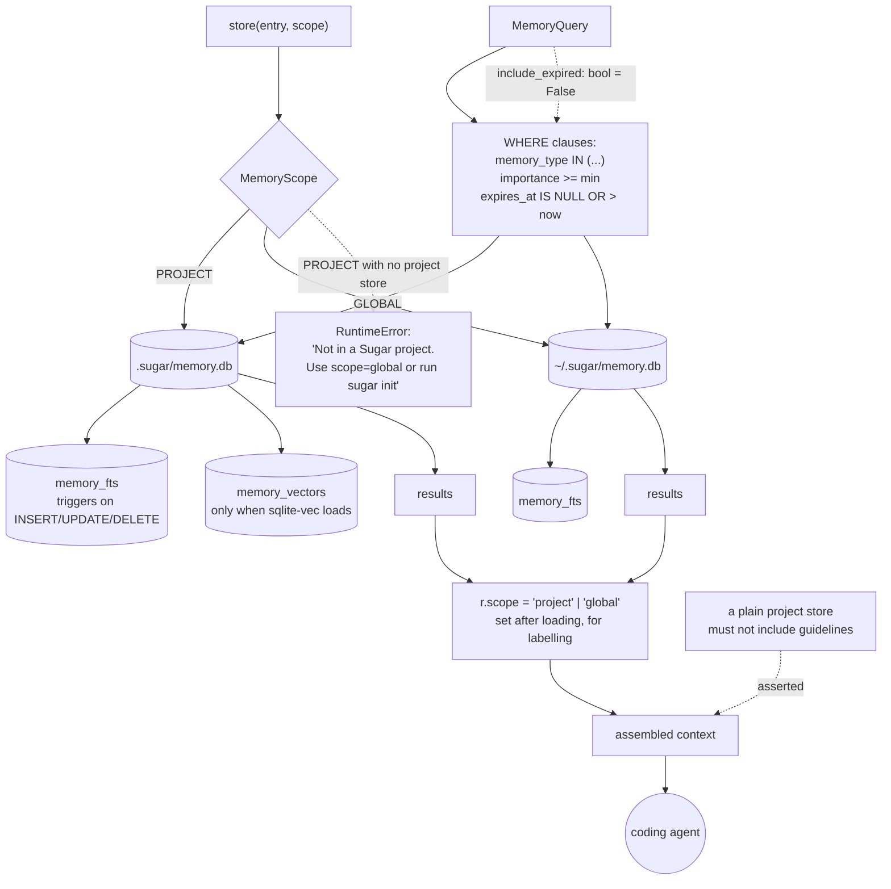

## 1. Executive Summary

Sugar is a local-first memory layer for AI coding agents, in Python over SQLite,
reaching agents through an MCP server, a CLI and a skills directory. Dual
licensed: AGPL-3.0, or a commercial licence. The pitch is the one this corpus
hears most often — *"Your AI agent starts every session with amnesia"* — and the
implementation is unusually small for it.

**One mark: `negative_eval`.** A memory here is content plus a type, an
importance float, an access count and an optional expiry. There is no status
field, no supersession, no correction, and no second time axis; the word
`tombstone` does not appear in the package, nor does `supersede` or `retract`.
What a memory can become is expired, and that is enforced at read time rather
than by a sweeper.

The design decision worth naming is the boundary. Project memories live in
`.sugar/memory.db` and cross-project guidelines in `~/.sugar/memory.db`, two
separate files, and a manager routes a write to one of them. **A query cannot
span projects because there is no shared table for one to span.** That is
stronger isolation than a predicate and it is also why there is no cross-project
recall to speak of: the only material that crosses is what the user deliberately
filed as global.

## 2. Mental Model

Seven memory types — decision, preference, file context, error pattern,
research, outcome, guideline — and the type is the closest thing to a policy.
`PREFERENCE` is commented as permanent; `GUIDELINE` is the type that belongs in
the global store. Nothing else about a row says how much to believe it.

Retrieval is a filtered search over one store, or over both when the global
manager is in play, with the results labelled by where they came from.

## 3. Architecture

## 4. Essential Implementation Paths

**The routing** — `sugar/memory/global_store.py:44-65`. `GlobalMemoryManager`
takes a scope and picks a store, and refuses rather than guessing when the
project store is missing: *"Not in a Sugar project. Use scope=global or run
'sugar init'."* Declining to fall back to the global file is the right refusal —
a silent fallback would file a project's memory where every project can read it.

**The expiry** — `sugar/memory/types.py:126` and `sugar/memory/store.py:352`,
`:416`. `MemoryQuery.include_expired` defaults to `False`, and both query paths
append `(e.expires_at IS NULL OR e.expires_at > datetime('now'))` when it is
unset. `global_store.py:120` forwards the same flag rather than re-deriving it,
so the two arms cannot disagree. An expired memory is never deleted; it stops
being returned.

**The label** — `global_store.py:109`. After loading, each row is stamped
`r.scope = MemoryScope.PROJECT.value`. The scope is an attribute of the result,
not a column the query filtered on; the filtering already happened by choosing
the file.

**The index** — `store.py:161-181`. Three triggers keep an FTS5 shadow table in
step on insert, update and delete, so lexical search cannot drift from the
table it indexes. The vector table is created only when the `sqlite-vec`
extension loads (`_check_sqlite_vec`), and search degrades to lexical when it
does not.

## 5. Memory Data Model

One `memory_entries` table: `id`, `memory_type`, `content`, `summary`,
`source_id` pointing at a work item, a metadata blob, `importance`,
`created_at`, `last_accessed_at`, `access_count` and `expires_at`. Embeddings
live in a sibling table, serialized as bytes.

`importance` is a float and it is the only thing resembling a judgement about a
memory. It filters as a floor (`e.importance >= ?`) rather than ranking a
belief, which keeps it honest about what it is — but it means a memory the agent
has learned to distrust has no way to say so.

Writes are `INSERT OR REPLACE` keyed on `id`. There is no version, no prior
value kept, and nothing that records that a replacement happened.

## 6. Retrieval Mechanics

Filter by memory type, by an importance floor, by tags and file paths, then
search — vector where `sqlite-vec` is available, FTS5 otherwise. `access_count`
and `last_accessed_at` are maintained on the row.

## 7. Write Mechanics

The CLI parses a `--ttl` into an `expires_at` and reports it back to the user
(`sugar/main.py:4010, :4030, :4040`). Everything else about a write is the
caller's choice of type and importance.

## 8. Agent Integration

An MCP server, a CLI, a `skills/` directory, a GitHub Action and a Hermes
plugin. A `marketplace.json` and `MARKETPLACE.md` describe distribution.

## 9. Reliability, Safety, and Trust

**`negative_eval`** — section 10.

**`scope_enforced` is withheld, and the reason is a distinction rather than a
fault.** The mark asks for a stored scope key applied as a filter on the read
path. Sugar has no such key: isolation comes from opening a different file, and
the `scope` attribute is written onto results *after* loading, for labelling.
The outcome is at least as strong — a project query has no physical access to
another project's rows — but it is not the mechanism the mark measures, and
saying it is would make the mark's count describe two different things.

**`trust_state` is withheld.** `importance` is a float used as a floor, which
the rubric names as the thing a state is not; a memory cannot be marked
unreliable while being kept.

**`tombstone`, `bitemporal`, `audit_log` and `human_review` are withheld.**
`INSERT OR REPLACE` keeps no prior value and records nothing about the
replacement; `created_at` and `last_accessed_at` are both record time and
`expires_at` is a retention bound, not a validity one; no append-only log of
mutations exists; and nothing holds a memory in a state until a person resolves
it.

**Dual licensing is worth knowing before reuse.** AGPL-3.0 or a commercial
licence, with a CLA and a terms document in the tree. The Anthropic references
in `TERMS.md` are a trademark disclaimer — the project states it is *"not
affiliated with, endorsed by, sponsored by, or associated with Anthropic,
Inc."* — and not a restriction on who may read the code.

## 10. Tests, Evals, and Benchmarks

A pytest suite with `pytest.ini` and a `conftest.py`. Nothing was installed and
nothing was run: three manifests sit inside the seven-day cooldown.

The mark rests on `tests/test_global_memory.py`, which asserts the boundary from
the side that matters — what must *not* appear:

- *"Plain MemoryStore (not GlobalMemoryManager) must not include guidelines"*
  at `:1014`, checked as `assert "guidelines" not in context`. A store opened
  without the global manager assembles a context with no cross-project material
  in it at all.
- *"Project-scoped results must not carry a `[Global]` label"* at `:982`, which
  guards the labelling rather than the retrieval — a project row mislabelled
  global would tell an agent the wrong thing about where a memory applies.

Both are assertions about the assembled context rather than about a query
result, which is the honest reading of them.

No benchmark and no paper.

## 11. For Your Own Build

### Steal

- **Refuse rather than fall back when a scope cannot be resolved.** *"Not in a
  Sugar project. Use scope=global or run `sugar init`"* is the right error; the
  wrong one is writing a project memory into the shared file because the project
  store was missing.
- **Forward the filter flag instead of re-deriving it.** One
  `include_expired` travelling from the query into both stores is why the two
  arms cannot drift; two copies of the same default is how they do.
- **Keep the FTS index honest with triggers on all three verbs.** Insert,
  update *and* delete — a missing delete trigger is how a lexical index starts
  returning rows that are gone.
- **Assert the label as well as the result.** A row that is retrieved correctly
  and labelled wrongly is a memory applied to the wrong project.

### Avoid

- **An importance float standing in for belief.** A floor filter cannot express
  "keep this but do not act on it", so a memory the agent should stop trusting
  has to be deleted or left to mislead.
- **`INSERT OR REPLACE` as the correction path.** The prior content is gone and
  nothing records that a replacement happened, so a wrong memory that gets
  overwritten leaves no evidence it was ever believed.

### Fit

Take it if you want per-project agent memory on your own machine with a small
surface and are content for corrections to be overwrites. The two-file boundary
is the idea worth copying, and it is worth copying precisely because it does not
need a predicate to be right.

## 12. Open Questions

- Corrections are `INSERT OR REPLACE`. Is a superseded memory meant to be
  recoverable, and if not, what tells a user a fact they relied on last week has
  been replaced?
- `importance` is set at write time by the caller. Is anything meant to move it
  afterwards — an outcome, a failed recall — or is it fixed for the life of the
  row?
- Expired rows are filtered but never removed. Is a sweeper intended, or is the
  history deliberate?
- The global store holds guidelines shared across every project on the machine.
  What stops a guideline learned in one client's repository from surfacing in
  another's?

## Appendix: File Index

| Path | What it holds |
| --- | --- |
| `sugar/memory/types.py` | `MemoryScope`, `MemoryType`, `MemoryEntry`, `MemoryQuery` and its defaults |
| `sugar/memory/store.py` | the schema, the three FTS triggers, the expiry clause and the vector fallback |
| `sugar/memory/global_store.py` | scope routing, the refusal, and the post-load scope stamp |
| `sugar/memory/retriever.py` | assembling a context from one store or both |
| `sugar/main.py` | the CLI, including `--ttl` parsing into `expires_at` |
| `tests/test_global_memory.py` | the two must-not assertions the mark rests on |
| `LICENSE`, `TERMS.md`, `CLA.md` | the dual AGPL/commercial grant and the trademark disclaimer |

## Appendix: Recorded Searches

Run from the root of the checkout at the pinned commit.

| Claim | Command | Result at this pin |
| --- | --- | --- |
| No supersession or tombstone vocabulary exists | `grep -rli "tombstone\|supersede\|retract" --include='*.py' sugar` | Nothing for any of the three |
| Scope is not a filtered column | `grep -n "scope" sugar/memory/global_store.py` | Routing at `:44-65` and a post-load stamp at `:109`; no `WHERE` clause names it |
| The expiry filter defaults closed and is shared | `grep -rn "include_expired" sugar` | Declared `False` at `types.py:126`, applied at `store.py:352` and `:416`, forwarded at `global_store.py:120` |
| `expires_at` has a producer | `grep -rn "expires_at" sugar/main.py` | Parsed from `--ttl` at `:4010`, set at `:4030`, echoed to the user at `:4040` |
| No sweeper removes expired rows | `grep -rn "DELETE FROM memory_entries" --include='*.py' sugar` | Nothing scheduled against expiry; the rows stay and the read filters them |
| The licence rider is a trademark disclaimer, not a restriction | `grep -n -i 'anthropic' TERMS.md` | Three lines disclaiming affiliation and directing bug reports to the Sugar maintainers |

## History

**2026-09-20** — [`eade16940789bc1f927af090f8a3b475e537eddd`](https://github.com/roboticforce/sugar/commit/eade16940789bc1f927af090f8a3b475e537eddd) — first reading, at 288 files. Screened before reading: three manifests inside the seven-day cooldown among the findings, so nothing was installed and nothing was run. Dual licensed AGPL-3.0 or commercial, with a CLA; `TERMS.md` names Anthropic only to disclaim affiliation, which is a trademark notice rather than a rider, and the reading proceeded on that basis. One mark, `negative_eval`. `scope_enforced` is withheld on a distinction rather than a fault — the isolation is a second database file rather than a predicate, and the `scope` attribute is stamped on results after they load. The repository's MCP name is `io.github.cdnsteve/sugar` while the remote is `roboticforce/sugar`; the atlas had no report under either name before this one.
