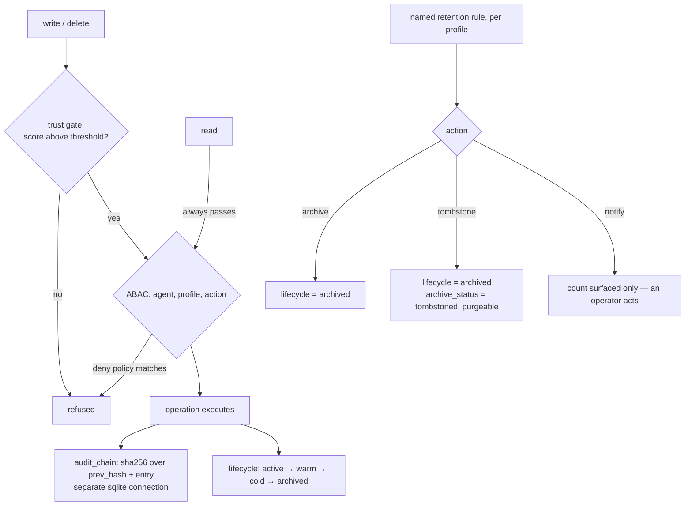

## 1. Executive Summary

SuperLocalMemory positions itself as "the governed memory layer for AI agents:
local-first, auditable, and built for the compliance obligations teams now
actually carry". AGPL-3.0, roughly 399,000 lines of Python including tests,
over SQLite, with twenty-eight top-level subpackages of which `compliance/`,
`trust/`, `access/` and `attribution/` are the distinguishing ones.

This is the governance corner of the atlas, and two design decisions in it are
worth taking elsewhere.

**The audit chain runs on its own database connection.**
`compliance/audit.py` implements a SHA-256 hash chain from a genesis hash with
`verify_integrity()`, and the module header states the architectural reason:
"The audit chain uses its OWN sqlite3 connection (not shared DB manager) for
independence — audit must survive even if the main DB is corrupted."

Several systems in this atlas hash-chain an audit log. This is the only one that
asks what happens to the evidence when the thing it is evidence *about* fails,
and answers by decoupling them. An audit log sharing a connection, a transaction
and a file with the store it audits is a record that dies with its subject.

**The EU AI Act module refuses to certify.** `compliance/eu_ai_act.py` is
"technical deployment-posture reporting", and its docstring draws the line
itself:

> An operating mode can establish technical facts such as locality and use of
> generative AI. It cannot determine the Act's risk classification or certify
> legal compliance without the system's intended purpose and deployment context.

A compliance feature whose first act is to say what it cannot conclude is rarer
than it should be, and it is the same distinction this atlas draws when it
declines to issue a conformance statement of its own.

The weakness is on the temporal axis. `atomic_facts` carries `observation_date`,
`referenced_date`, `interval_start` and `interval_end` under a comment calling it
a "3-date model", and no read path filters on the interval. The columns are
written and nothing asks about them.

## 2. Mental Model

A memory is decomposed into **atomic facts**, each typed `episodic`,
`semantic`, `opinion` or `temporal` under a CHECK constraint, each carrying a
`profile_id`, a `scope` (defaulting to `personal`), an optional `shared_with`,
confidence, importance, evidence count, emotional valence and arousal, and a
lifecycle zone.

Governance wraps the store rather than living inside the fact. A write passes
through a **trust gate** before it lands; access passes through **ABAC**;
expiry is decided by **named retention rules** bound to a profile; and every
operation lands in the audit chain.

The three retention actions are the model in miniature: two mutate and one
deliberately does not.

## 3. Architecture

One SQLite database for memory, a **second** for the audit chain, and
twenty-eight subpackages: `compliance`, `trust`, `access`, `attribution`,
`retrieval`, `vector`, `graph`, `code_graph`, `learning`, `evolution`,
`dynamics`, `math`, `mesh`, `optimize`, `evaluation`, `parameterization`,
`ingestion`, `encoding`, `loops`, `hooks`, `mcp`, `server`, `cli`, `ui`,
`storage`, `infra`, `migrations`, `llm`.

Nine framework integrations ship as separate packages under
`ide/integrations/` — LangChain, LangGraph, LlamaIndex, CrewAI, AutoGen,
Semantic Kernel, Google ADK, OpenAI Agents, Agent Framework — each with its own
`pyproject.toml` and test suite.

The operator cost is a Python install and a directory; the conceptual cost is
the surface area, which is the largest in this batch relative to what a single
user needs.

## 4. Essential Implementation Paths

**Write** — `trust/gate.py` (minimum trust score for write and delete; "Read
operations always pass but are logged for audit purposes") → `compliance/abac.py`
→ storage → `compliance/audit.py`.

**Retention** — `compliance/retention.py`: rules in their own table bound to a
`profile_id` with `days`, a `framework` tag (GDPR, HIPAA, custom), an `action`
and an `applies_to` JSON selector; `enforce` moves expired facts.

**Retrieval** — `retrieval/engine.py`, `entity_channel.py`, `vector_store.py`,
each carrying `WHERE profile_id = ?`, with an explicit query over
`edge_type IN ('contradiction', 'supersedes')`.

**Trust** — `trust/scorer.py`, `signals.py`, `provenance.py`.

## 5. Memory Data Model

`atomic_facts` is thirty-plus columns. The governance-bearing ones:
`profile_id NOT NULL DEFAULT 'default'` with a foreign key and a cascade,
`scope`, `shared_with`, `fact_type` under a four-value CHECK, `lifecycle` under
a four-value CHECK, `archive_status`, and the four date fields.

The retention module's handling of the lifecycle constraint is worth quoting
because it is a workaround with its reasoning attached: `atomic_facts.lifecycle`
"CHECK allows only active/warm/cold/archived, so both retention actions land in
the 'archived' lifecycle zone. 'tombstone' is additionally flagged purgeable via
`archive_status` so a purge job can find it — this avoids a risky rebuild of the
(large) `atomic_facts` CHECK constraint."

That is the right way to record a compromise: what was wanted, what the schema
allowed, what was done instead, and why the clean fix was rejected. A reader
grepping for a `tombstoned` lifecycle value would otherwise conclude the feature
was missing.

Beside the facts sit Fisher-information fields (`fisher_mean`,
`fisher_variance`, `fisher_last_applied_access`) driving a delta-based
maintenance update, and a `langevin_position` — the dynamics machinery is
substantial and is not what this report is about.

## 6. Retrieval Mechanics

Multi-channel retrieval — an entity channel, a vector channel and community
summaries — with a `fact_importance` table and typed graph edges including
`contradiction` and `supersedes`, queried explicitly so a contradicted fact can
be surfaced as such rather than silently outranked.

**Scope is real.** `profile_id` is `NOT NULL` with a foreign key, appears in
every index including the composite `(profile_id, lifecycle)` and
`(profile_id, fact_type)`, and appears as `WHERE profile_id = ?` in the
retrieval engine, the entity channel and the vector store. The indexes matching
the query shape is the sign that the scoping is load-bearing rather than
decorative.

ABAC sits above it as a second layer, and its default is worth stating plainly:
"Default: allow all (open access). Policies restrict specific agents." It is a
deny-list, so an unconfigured deployment has no access control — which is a
reasonable default for a local single-user tool and the wrong one for the
compliance posture the README describes. Anyone deploying this for a team should
treat writing policies as step one.

**No read path filters the temporal interval.** `interval_start` and
`interval_end` are written and no query compares against them, so the four-date
model informs nothing at read time. `bitemporal` is withheld on that basis, and
the columns are one predicate away from earning it.

## 7. Write Mechanics

The trust gate is the write mechanic and its asymmetry is deliberate: writes and
deletes require a minimum trust score, reads always pass "but are logged for
audit purposes". Gating mutation and auditing access is the correct division —
the damage from a bad write is durable, the damage from a bad read is
disclosure, and disclosure is what an audit trail addresses.

Retention is per-profile and per-framework, which is the shape a compliance
obligation actually has: a GDPR rule and a HIPAA rule can coexist on one store
with different periods and different `applies_to` selectors.

There is no rejected-value record. A fact archived by retention or superseded by
an edge can be written again; the audit chain will record both, and nothing
refuses the second.

## 8. Agent Integration

An MCP server, a CLI, a browser dashboard with lifecycle and compliance views,
and nine framework integration packages. The dashboard surfaces the lifecycle
distribution — active, warm, cold, archived, tombstoned — and the compliance
view lets an operator choose the action on a retention rule.

## 9. Reliability, Safety, and Trust

**Audit log — awarded, in the strongest form found in this atlas.** A hash chain
from a named genesis, `verify_integrity()` to walk it, thread-safe, and — the
part that distinguishes it — an independent connection so the audit survives
corruption of the store. Every operation including reads is logged.

**Scope — awarded**, per section 6.

**Trust state — withheld, and the distinction matters.** `trust/` scores
*operations and agents*, not memories. The gate answers "may this actor write",
not "is this fact believed". A fact carries `confidence` (a float) and
`evidence_count` (an integer), neither of which is a discrete epistemic status.
Naming a subpackage `trust` and having no trust state on the record is exactly
the confusion the mark exists to separate.

**Human review — withheld.** The `notify` retention action "changes nothing — it
only surfaces the count so an operator can act", which is a display, and the
compliance dashboard configures rules rather than adjudicating facts.

**Bitemporal — withheld**, per section 6.

**Tombstone — no.** `archive_status = 'tombstoned'` marks a row purgeable; it is
keyed on the row and consulted by a purge job.

**Negative eval — no**, among the test suites found.

**The most transferable safety judgement here is the EU AI Act docstring.** A
module that reports deployment posture and states in its own header that it
cannot classify risk or certify compliance is doing the thing every compliance
feature should do and most do not: bounding its own claim.

## 10. Tests, Evals, and Benchmarks

**No paper.** Substantial test infrastructure — `tests/` with subdirectories for
adapters, API, binary, code graph, learning, optimize, process health and
release, plus a test suite inside each of the nine integration packages.

**I ran nothing.** The screen flagged fifteen dependency manifests inside the
seven-day cooldown and build-time execution in eighteen `conftest.py` files and
two `Makefile`/`package.json` targets — the widest execution surface in this
batch.

There is an `evaluation/` subpackage in the source tree. No committed benchmark
result, dataset or scorecard was found, and no retrieval-quality number appears
in the README. For a project whose pitch is governance rather than recall
quality, the absence is coherent — the claims made are about auditability, and
auditability is checkable by reading `audit.py` rather than by running a
benchmark.

## 11. For Your Own Build

### Steal

- **Give the audit log its own connection.** "Audit must survive even if the
  main DB is corrupted" is a one-line argument that changes the design, and the
  cost is one file handle.
- **Chain from a named genesis and ship the verifier.** `_GENESIS_HASH =
  "genesis"` plus `verify_integrity()` means the chain can be checked by anyone,
  not just trusted.
- **Log reads, gate writes.** Reads always pass the trust gate and are recorded;
  writes and deletes must clear a threshold. The two failure modes are different
  and deserve different treatment.
- **Bind retention rules to a profile and tag them with a framework.** A GDPR
  rule and a HIPAA rule on one store, with different periods and different
  `applies_to` selectors, is what a real obligation looks like.
- **Give retention a `notify` action.** An action that changes nothing and
  surfaces the count lets an operator dry-run a policy before arming it.
- **Record the workaround and why the clean fix was rejected.** The
  `archive_status` note explains that rebuilding a large CHECK constraint was
  judged riskier — a reader grepping for the missing lifecycle value would
  otherwise report a gap.
- **Make your compliance module say what it cannot conclude.** The EU AI Act
  docstring is the model: establish technical facts, refuse the legal
  classification.

### Avoid

- **Do not default an access-control layer to allow-all in a system sold on
  governance.** ABAC's deny-list default is right for a local tool and wrong for
  the deployment the README describes, and nothing in the code forces the
  distinction.
- **Do not name a subsystem `trust` when it scores actors rather than claims.**
  A reader will assume the memories carry a trust state; they carry a float.
- **Do not store four date columns and query none of them.** The temporal model
  costs write bandwidth and buys nothing at read time.
- **Do not let the surface outgrow the story.** Twenty-eight subpackages
  including Langevin dynamics and Fisher information, around a memory whose
  distinguishing claim is auditability.

### Fit

This is for a team that has a compliance obligation and wants agent memory that
can be audited against it — the audit chain, the retention engine and the
per-profile scoping are genuinely built for that, and AGPL-3.0 is workable for
internal deployment.

It is not a small component and it is not a retrieval story. If you want one
thing from it, take `compliance/audit.py`: about the size of a single file, and
the best answer in this atlas to "what happens to my audit log when my database
breaks".

## 12. Open Questions

- **What produces a trust score?** `trust/scorer.py` and `signals.py` exist;
  what feeds them, and what a fresh agent's score is, decides whether the gate
  admits everything by default the way ABAC does.
- **Does anything verify the audit chain on a schedule?** `verify_integrity()`
  exists; a scheduled check and an alarm on failure were not found.
- **Is the four-date model used anywhere?** `observation_date` and
  `referenced_date` may feed ranking rather than filtering; no consumer was
  traced.
- **What purges a tombstoned row?** `archive_status = 'tombstoned'` is described
  as purgeable "so a purge job can find it"; the job was not located.

## Appendix: File Index

**Audit** — `src/superlocalmemory/compliance/audit.py` (the independent
connection rationale `:10-13`, `_GENESIS_HASH` `:28`, the `audit_chain` schema
`:30`, `verify_integrity`)

**Compliance** — `src/superlocalmemory/compliance/retention.py` (the rules table
`:24`, the lifecycle-CHECK workaround `:38-47`, `enforce` `:327-413`),
`abac.py`, `gdpr.py`, `eu_ai_act.py` (the refusal to certify `:5-9`),
`lifecycle.py`, `scheduler.py`

**Trust** — `src/superlocalmemory/trust/gate.py` (the read/write asymmetry
`:6-8`), `scorer.py`, `signals.py`, `provenance.py`

**Schema** — `src/superlocalmemory/storage/schema.py:147-215` (`atomic_facts`,
the CHECK constraints, the profile indexes)

**Retrieval** — `src/superlocalmemory/retrieval/engine.py`,
`entity_channel.py` (the contradiction/supersedes edge query `:842`),
`vector_store.py`, `src/superlocalmemory/graph/`

**Integration** — `src/superlocalmemory/mcp/`, `server/`, `cli/`, `ui/`,
`ide/integrations/` (nine framework packages)

**Dynamics** — `src/superlocalmemory/dynamics/`, `math/`, `learning/`,
`evolution/`, `optimize/`

## History

**2026-08-09** — [`f47c9c3b826caf0db6e3bb5c74f48f3df14e959d`](https://github.com/qualixar/superlocalmemory/commit/f47c9c3b826caf0db6e3bb5c74f48f3df14e959d) — first reading. Screened before reading: one auto-run surface, build-time execution in eighteen `conftest.py` files plus a `Makefile` and an npm manifest, and fifteen dependency manifests inside the seven-day cooldown. The tree was read, never installed, and no test was run.
