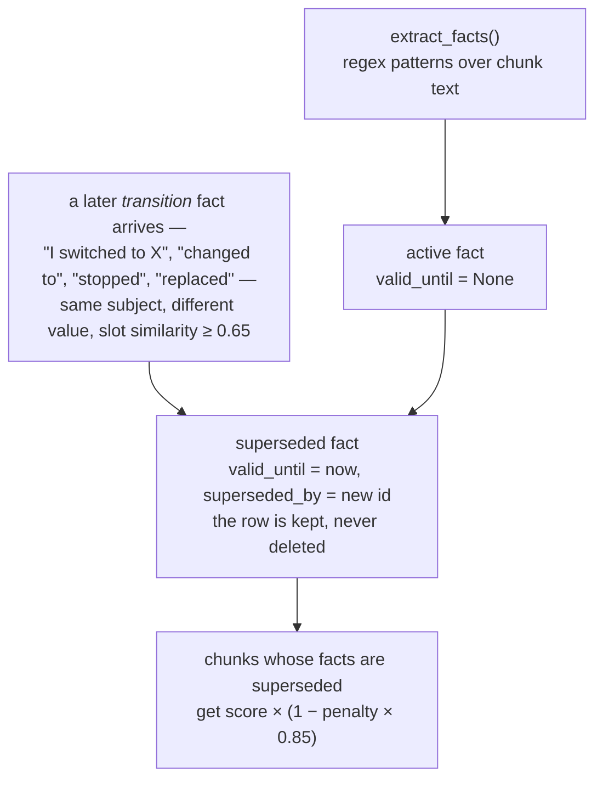
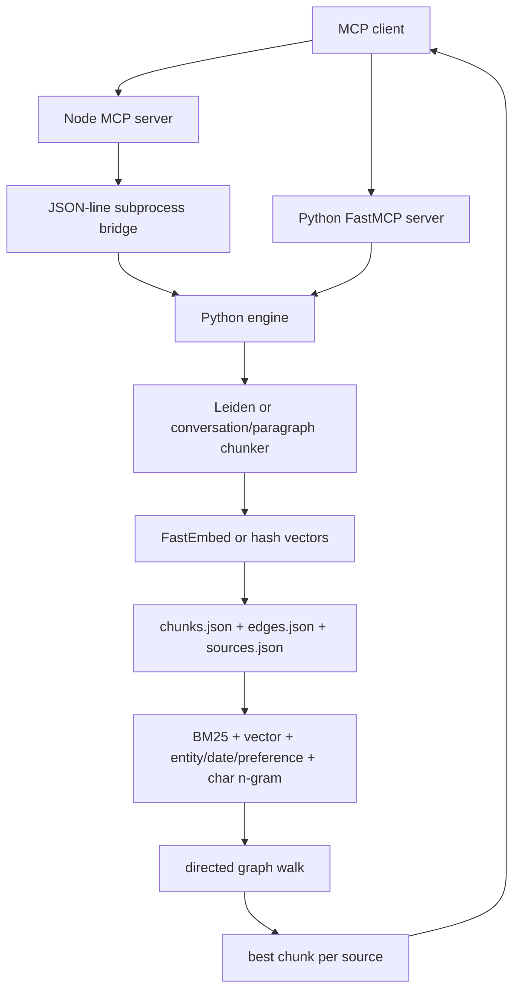

## 1. Executive Summary

`swafra` is a compact, local-first graph-RAG memory server for MCP clients. It stores source text as embedded chunks, annotates chunks with regex-extracted entities, dates, and preferences, connects chunks with several edge types, and retrieves with a four-signal hybrid ranker plus graph expansion.

Its design is appealing as a small personal memory sidecar:

- no hosted service or API key is required;
- the Python package is a complete MCP server;
- the Node package offers a second MCP wrapper over the same Python engine;
- source text remains in the stored chunks instead of being replaced by LLM-generated facts;
- BM25, embeddings, entity/date hints, character n-grams, source diversity, and graph traversal are combined in a small engine package.

The strongest technical idea is the source-diverse retrieval shape: rank chunks, expand through graph edges, then return the best chunk from each source. The conversation fallback also creates useful exchange chunks and a deterministic facts/navigation chunk without calling an LLM.

Alongside the chunk store it runs a **fact lifecycle**. `engine/facts.py` extracts `(subject, relation, value)` triples, detects when a new *transition* fact conflicts with a standing one, closes the old fact's validity instead of deleting the row, and penalises the chunks behind superseded facts at search time. That is a correction path that reaches the ranker, built from regex and embedding similarity with no LLM in it.

Three things keep it from being a durable memory layer. Persistence on the **default path is unlocked, non-atomic JSON rewrites** — the SQLite tier engages only past 5,000 chunks. **Deletion strands cross-session edges** on both backends, and the SQLite `edges` table has no foreign key and no cascade, so the relational store does not fix it either. And the correction subsystem is **invisible to the agent**: `get_active_facts`, `get_fact_history` and `invalidate_fact` live on the internal RPC surface, none of them is one of the six MCP tools, and a ranking multiplier is the only consumer of the whole lifecycle.

There are no tests. The committed LongMemEval artifact is not evidence of recall at 10 — all 470 evaluated questions returned between 28 and 46 results against 38–62 ingested sessions — and the harness that produced it **does not import** against the current engine, so those numbers describe code that cannot be re-run.

Verdict: study Swafra for a concise hybrid-retrieval prototype, for MCP affordances, and for a small, local, LLM-free supersession engine. Do not borrow its storage, benchmark methodology, or deletion semantics for a serious system without substantial redesign.

## 2. Mental Model

Swafra considers a memory source to be a titled text blob. Ingestion turns that blob into one or more chunk records. Those chunks, not extracted beliefs, are the authoritative content.

Chunk kinds:

- `leiden`: sentence communities created by Leiden clustering when optional dependencies are available and the input has at least eight sentences;
- `exchange`: groups of two user/assistant exchanges when the fallback detects role-prefixed conversation text;
- `facts`: a synthetic index chunk containing regex-extracted entities, dates, and preference statements from a conversation;
- `paragraph`: groups of paragraphs capped approximately at 256 whitespace-separated words.

Each chunk holds its text and embedding directly. The "knowledge graph" is a separate list of directed edges between chunk IDs:

- `next` / `prev`;
- `similar`;
- `entity`;
- `cross_session`.

Lifecycle:

```text
MCP add_knowledge
-> choose Leiden or fallback chunking
-> annotate and embed chunks
-> add within-source and cross-source edges
-> extract facts and close conflicting ones
-> rewrite chunks/edges/sources/facts (JSON, or SQLite past 5k chunks)
-> later hybrid search
-> optional directed graph walk
-> best chunk per source
-> MCP result
```

Memory is agent-controlled. `CLAUDE.md`, `SKILL.md`, and MCP descriptions instruct the model to save proactively and call `get_context` at session start. The backend does not observe conversations or inject memory automatically.

Stored chunk text is undifferentiated evidence — no distinction between user statements, assistant statements, imported documents, or extracted navigation text. Beside it sits a **second, parallel memory** with an actual lifecycle, and the two do not share a state machine.

A **fact** is a `(subject, relation, value)` triple carrying `chunk_id`, `source_id`, `created_at`, `confidence`, `evidence` (the original text span), `valid_until`, and `superseded_by`. Its states are exactly two:



Two deliberate limits are worth stating because they are documented choices rather than oversights. Only **transition** facts supersede — a plain "I use X" does not invalidate a prior state, on the stated grounds that a user may use several things at once. And supersession is a *penalty*, not an exclusion: a fully superseded chunk keeps 15% of its score and can still be returned.

The system therefore models **current versus historical**, which is a validity distinction, and models nothing epistemic. No fact is ever marked unverified or false; `confidence` is a number assigned once by the extractor and never revised.

## 3. Architecture

Swafra has two public runtime shapes over **one** engine implementation. `swafra/engine.py` is a 28-line re-export shim and `engine/scimap_engine.py` an 18-line subprocess entry point, both resolving to the `engine/` package (`storage`, `graph`, `facts`, `chunking`, `embedding`, `bm25`, `extractors`, `llm`, `rpc`, `tokenizer`, `deps`).

Python distribution:

- `swafra/server.py`: `FastMCP` stdio server, six tools.
- `swafra/cli.py`: a native CLI — `setup`, `stats`, `config`, `skill`, `remove`.
- `swafra/engine.py`: re-export shim.

Node distribution:

- `src/index.ts`: MCP stdio server using the TypeScript SDK.
- `src/engine.ts`: starts `engine/scimap_engine.py` and sends JSON-line RPC requests.
- `src/cli.ts`, `src/sdk.ts`: a Node CLI and a JS SDK added in v0.3.1.

Persistence is **adaptive**, and the tiering matters more than the headline suggests (`engine/storage.py`):

- **Tier 1, the default**: `chunks.json`, `edges.json`, `sources.json`, `facts.json` under `${SCIMAP_DATA_DIR}` (default `~/.scimap`).
- **Tier 2, SQLite**: `swafra.db` with `journal_mode=WAL`, `synchronous=NORMAL`, a 64 MB cache and `timeout=10`. Migration is one-way and fires only when `chunks.json` exceeds 500 KB *and* holds at least `_MIGRATION_THRESHOLD = 5000` chunks.
- **Tier 3**: `sqlite-vec` if importable, to accelerate vector search.

So a typical personal corpus never leaves Tier 1, and every durability property below is the JSON path's.

External dependencies:

- required Python MCP package for the Python distribution;
- optional `fastembed` for `BAAI/bge-small-en-v1.5`;
- optional NumPy, igraph, and leidenalg for Leiden chunking;
- optional LLM provider key, which switches on entity extraction, semantic dedup at ingest, and reranking (`engine/llm.py`, gated behind `is_llm_available()`);
- Node MCP SDK and Zod for the Node wrapper.

If FastEmbed cannot load, `_local_vector()` creates deterministic signed hash vectors over words and character trigrams. If Leiden dependencies are unavailable, ingestion uses conversation/paragraph chunking.



There is no daemon, database, queue, background worker, hosted API, replication path, or multi-tenant service boundary.

## 4. Essential Implementation Paths

### Capture and Write

Python MCP starts at `add_knowledge()` in `swafra/server.py`, which directly calls `engine.add_knowledge()`.

The Node path starts in the `add_knowledge` case in `src/index.ts`, calls `Engine.call()` in `src/engine.ts`, and dispatches through the `METHODS` map in `engine/rpc.py`.

`add_knowledge()` in `engine/graph.py`:

1. loads all chunks, edges and sources upfront, **including superseded rows**, through the storage tier;
2. derives `source_id` from `SHA-256(title + ":" + first 100 text characters)[:16]`;
3. optionally asks an LLM whether the text duplicates an existing source, and returns early if so;
4. removes records already carrying that exact source ID;
5. tries `leiden_chunk()`, then `chunk_conversation()`;
6. embeds all resulting chunk contents;
7. derives chunk IDs from source ID and chunk index;
8. marks same-source chunks superseded when they share three entities and reach cosine 0.85;
9. calls `ingest_facts()` per chunk to extract triples and close conflicting ones;
10. appends chunk records;
11. builds within-source and cross-source edges;
9. rewrites all three files.

State changes only in the final `_save_json()` calls. There is no transaction covering the three files.

### Chunking and Annotation

`leiden_chunk()`:

- splits sentences with `_SENT_RE`;
- embeds every sentence;
- materializes an all-pairs cosine-similarity matrix;
- adds positional weight for sentences at distance three or less;
- keeps graph edges with adjusted similarity at least `0.3`;
- runs `RBConfigurationVertexPartition` with a derived resolution and fixed seed;
- joins each community's sentences in original within-community order.

The docs describe a semantic + entity + position graph, but the implemented Leiden graph uses embedding similarity plus positional weight. Extracted entities annotate the output after partitioning; they do not influence Leiden edges.

`chunk_conversation()`:

- recognizes only lines beginning with `User:`, `Assistant:`, `Human:`, or `AI:`;
- groups turns into exchanges ending at assistant turns;
- groups two exchanges per chunk;
- creates an additional synthetic facts chunk if any entities, dates, or preferences were found;
- otherwise groups non-conversation paragraphs around a 256-word threshold.

`_extract_entities()`, `_extract_dates()`, and `_extract_preferences()` are regex heuristics, not an LLM or NLP entity linker.

### Graph Construction

`add_knowledge()` creates:

- bidirectional `next`/`prev` edges between adjacent chunk-list entries;
- up to five outgoing `similar` edges per chunk above cosine `0.7`;
- one-way pairwise `entity` edges for entities appearing in two to ten chunks;
- up to three outgoing `cross_session` edges from each new chunk to the best chunk in other sources above cosine `0.45`.

No explicit community edge is created despite MCP/docs claims about "community edges". `community_id` is metadata only.

For Leiden output, adjacent entries are adjacent Leiden communities, not necessarily adjacent spans in the original text. Calling those edges `next`/`prev` can therefore imply a sequence that the source did not have.

### Retrieval and Ranking

`search_knowledge()`:

1. loads all chunks and drops records whose `superseded_by` is set;
2. rebuilds an in-memory `BM25Index`;
3. scores only the top `3k` BM25 candidates lexically;
4. embeds the query and scans every chunk embedding;
5. calculates regex entity/date/preference and exact-keyword bonuses;
6. calculates character-trigram overlap against every chunk;
7. fuses `0.40 * BM25 + 0.15 * vector + 0.25 * entity/heuristic + 0.20 * n-gram`;
8. multiplies by exponential age decay with an approximately 139-day half-life;
9. deduplicates on the first 100 lowercased content characters;
10. returns top-scoring chunks.

The entity/heuristic score is not bounded before fusion, so repeated matching entities, dates, preferences, and keywords can dominate the other normalized channels.

### Context Assembly

`get_context()`:

1. calls `search_knowledge(query, k=len(chunks_store))`, deliberately scoring and returning as many chunks as possible;
2. graph-walks from the first three hits;
3. appends unseen walked nodes at half their path score;
4. keeps the best hit for each `source_title`;
5. returns at least `max(k, floor(total_sources * min_source_pct))` source-diverse results.

The public Python MCP server fixes `min_source_pct=0.15`. This means `k` is a lower bound, not a result cap, once 15% of the corpus exceeds `k`. There is no token budget or maximum context size.

### Delete and Update

`delete_source()` calls `_delete_source_data()` (`engine/graph.py:98`), which removes:

- chunks with the target `source_id`;
- edges whose own `source_id` equals the target;
- the source list entry.

**Cross-session edges are stored with `source_id: None`** (`engine/graph.py:306`), so edges pointing from or to deleted chunks survive on both backends. The SQLite path is `DELETE FROM edges WHERE source_id = ?` with the same blind spot, and the `edges` table declares `source_id TEXT` with **no `FOREIGN KEY`, no `REFERENCES`, and no `ON DELETE CASCADE`** — a relational store carrying a bug a cascade would retire for free.

There is no update tool. Calling `add_knowledge` is only an idempotent replacement when the title and first 100 text characters derive the same source ID. Changing early content creates a second source even when the title is unchanged.

**Intra-source supersession works.** `all_chunks` is loaded upfront including superseded rows (`engine/graph.py:178`), `old_source_chunks` is derived from it at line 210, and the comparison runs before any removal. A new chunk supersedes an old one from the same source when they share at least three entities and cosine similarity reaches 0.85 — re-ingesting an updated version of a document demotes the version it replaced.

**Fact supersession is the new path, and a new session undoes it.** `ingest_facts()` closes a conflicting fact by setting `valid_until` and `superseded_by`, keeping the row. But the fact identity is

```python
def _fact_id(subject, relation, value, source_id):
    key = f"{subject}:{relation}:{value.lower()}:{source_id}"
    return hashlib.sha256(key.encode()).hexdigest()[:16]
```

— **`source_id` is in the key.** The dedupe guard on insert is `if f["id"] not in existing_ids`, so the same `(subject, relation, value)` arriving from a *different* session hashes differently, passes the guard, and is stored fresh with `valid_until: None`. Since sessions are the natural source unit, a value superseded in one session returns as current the next time it is mentioned. `detect_conflicts` will not catch it either: it considers only `is_transition` facts as superseding, so a plain restatement never triggers the check at all.

That is the difference between a supersession record and a tombstone, and it is one field in one hash.

### Storage Definitions

The JSON schema is implicit dictionary construction in `add_knowledge()`:

- source: `id`, `title`, `chunks`;
- chunk: `id`, `source_id`, `source_title`, `content`, `embedding`, `token_count`, `chunk_index`, `community_id`, `entities`, `dates`, `preferences`, `type`, `span`, `created_at`, `superseded_by`;
- edge: `source_id`, `from`, `to`, `type`, `weight`;
- fact: `id`, `subject`, `relation`, `value`, `chunk_id`, `source_id`, `created_at`, `valid_until`, `superseded_by`, `confidence`, `evidence`, `is_transition`.

The SQLite tier adds explicit `CREATE TABLE` statements, and one of them is a table nothing writes.

**Three names for one concept, and a dashboard that always reads zero.** The engine's working field is `valid_until`. The SQLite `facts` table declares `valid_from REAL, valid_to REAL` alongside `subject, predicate, object, value, confidence, superseded_by` — a properly normalised, genuinely bi-temporal-shaped table. **`db_save_facts()` does not write it.** It writes `facts_data`, a blob table of `(id, chunk_id, source_id, data)` where `data` is the whole fact dict as JSON, and `db_load_facts()` reads it back. So the normalised `facts` table is created by the schema, indexed twice, and populated by nothing — the same shape this atlas recorded for PowerMem's `history` table.

The consequence is visible in the product. `swafra/cli.py`'s `stats` dashboard prints an Active/Superseded/Total breakdown, and it reads **`valid_to`**:

- on SQLite it runs `SELECT * FROM facts` — the empty table — so it sees no facts at all;
- on JSON it evaluates `f.get("valid_to")` against dicts that only carry `valid_until`, so every fact is `None` and counts as active.

By either route the "Superseded" line reports **0**, permanently, on a subsystem whose whole purpose is to supersede. `valid_from` — the one field that would make the model bi-temporal rather than supersession-with-a-timestamp — exists only in that unwritten table.

### Tests and Evals

No unit or integration test files are present anywhere in the repository — not for chunking, not for the storage tiers, and not for the fact lifecycle.

LongMemEval harnesses exist at:

- `bench/run_eval.py`;
- `packages/mcp/bench/run_eval.py`;
- `packages/mcp/bench/longmemeval_colab.ipynb`;
- committed outputs in both benchmark directories.

## 5. Memory Data Model

The model is source -> chunk plus a global edge list.

Useful fields:

- source identity and title;
- verbatim chunk content;
- embedding stored beside content;
- created time;
- chunk kind;
- extracted entities, date strings, and preference strings;
- a weak `span`;
- graph relation type and weight.

Important limitations:

- `span` is a word-count placeholder such as `[0, wc]`, not a source character, line, turn, or sentence span.
- Sources do not retain original full text separately from chunks.
- There is no author/actor, message ID, role field, file path, URL, content hash, ingestion method, source timestamp, or embedding model identity.
- `source_id` uses only the first 100 text characters plus title, so it is neither a full content hash nor a stable title key.
- The title is not unique. `get_context()` groups by title, so distinct sources sharing a title collapse at retrieval time.
- There is no user, agent, session, project, workspace, tenant, or visibility scope.
- There is no version chain, correction relation, contradiction record, rejection tombstone, TTL, pin, sensitivity label, uncertainty, or verification state.
- The raw embedding vector is duplicated into JSON for every chunk.

The data model is adequate for a single trusted user running one process over a small corpus. It is not adequate for shared or safety-sensitive memory.

## 6. Retrieval Mechanics

Swafra's retrieval is its most interesting subsystem.

Strengths:

- lexical and vector signals cover different query shapes;
- character n-grams give the hash-vector fallback a second fuzzy lexical channel;
- entity/date/preference heuristics target common personal-memory questions;
- recency is explicit rather than hidden in an opaque reranker;
- graph expansion can recover neighboring or cross-source context;
- source diversity avoids returning ten near-duplicate chunks from one document;
- raw content is returned with source title and chunk ID.

Weaknesses:

- all indexes are rebuilt or scanned on every query;
- score calibration is ad hoc and entity bonuses are unbounded;
- dates are string matches, not normalized temporal facts or reasoning;
- the age decay penalizes old durable truths even when they remain current;
- graph traversal follows only outgoing edges, while entity and cross-session edges are often one-way;
- graph-walk scores are not comparable to fused search scores, yet `get_context()` compares them after multiplying walk scores by `0.5`;
- grouping by `source_title` can merge unrelated sources;
- result count and token volume are unbounded relative to the requested `k`;
- no scope filter is applied before scoring;
- no result exposes component scores, dates, preferences, path provenance, or why it ranked.

The best-chunk-per-source rule is useful when sources are sessions, as in LongMemEval. It can under-recall a large document where multiple distant chunks are needed to answer one question.

## 7. Write Mechanics

Writes are synchronous and hot-path. The server does not use an LLM for extraction or consolidation.

Good properties:

- deterministic IDs make identical ingestion calls repeatable;
- raw chunk text is retained;
- FastEmbed and Leiden are optional;
- the fallback stays local and deterministic;
- source deletion is exposed by exact ID;
- synthetic facts chunks act as navigational indexes while the source exchange chunks remain available.

Risks:

- `_save_json()` overwrites files directly rather than writing a temporary file and atomically replacing it;
- no file lock or process lock protects read-modify-write;
- concurrent MCP processes can lose writes or expose partially written JSON;
- failure after one of the three saves can leave chunks, edges, and sources inconsistent;
- there is no validation of empty/huge text, title uniqueness, corpus size, or embedding dimension;
- changing embedding model can mix incompatible vector dimensions silently;
- the `SCIMAP_EMBED_BACKEND` variable documented and set by benchmarks is never read by the engine;
- no dedupe operates across differently titled identical sources;
- no correction/conflict flow exists;
- the facts chunk can overemphasize noisy regex matches;
- no input is classified as untrusted before later prompt injection by a client.

## 8. Agent Integration

The six-tool MCP surface is compact and understandable:

- `add_knowledge`;
- `search_knowledge`;
- `get_context`;
- `graph_walk`;
- `list_sources`;
- `delete_source`.

`get_context` is the recommended high-level read; `search_knowledge` and `graph_walk` enable progressive disclosure. Exact source deletion is preferable to semantic "forget" behavior.

The integration depends heavily on prompt/tool policy. `CLAUDE.md` and Python tool descriptions tell the agent to:

- store user identity, preferences, project decisions, corrections, and likely future context;
- retrieve at every session start;
- avoid duplicates by listing sources;
- confirm writes to the user.

Those are good affordances but are not backend guarantees. An agent can omit writes, store assistant speculation, duplicate a source under a new title, retrieve too much context, or recall prompt-injected source text.

Beyond MCP there is a Python SDK, a JS SDK (`src/sdk.ts`), a native Node CLI (`src/cli.ts`), and `swafra skill`, which installs Swafra as a Claude Code skill so it can be used without MCP at all.

The public surfaces disagree about what version they are:

- `package.json` and `pyproject.toml` agree at `0.3.2`.
- `src/index.ts` advertises `version: "0.1.0"` to the MCP client — two releases behind the package it ships in.
- Python uses FastMCP and passes `min_source_pct=0.15` explicitly; Node relies on the engine default.
- Node tool text says `search_knowledge` is cosine search, while the engine performs hybrid search.
- names and docs alternate between `swafra` and the earlier `scimap`, and the data directory is `~/.scimap`.

The Python MCP package is the cleaner integration path. The Node wrapper adds process management, a second protocol, and a 60-second timeout without adding memory semantics, though both entry points resolve to the same `engine/` package so there is no duplicated implementation to drift.

## 9. Reliability, Safety, and Trust

Positive:

- local-only default;
- no model/API key required — the LLM paths are all gated on `is_llm_available()`;
- an MIT `LICENSE`;
- the API-key config file is written `0o600` (`engine/llm.py`, `swafra/cli.py`);
- **a correction path that reaches the ranker** — superseded facts are retained, not deleted, and the chunks behind them are demoted at search time;
- facts carry `evidence`, the original text span they were extracted from — the closest thing here to provenance;
- exact-ID source deletion;
- source title and chunk ID accompany recalled text;
- deterministic fallback embeddings;
- MCP errors are returned rather than silently swallowed;
- Node wrapper sends engine logs to stderr, keeping JSON-line stdout clean.

Serious gaps:

- **no atomicity or locking on the default path.** `save_json()` is `open(path, "w")` then `json.dump` — no temp file, no `os.replace`, no lock. `engine/storage.py` contains no occurrence of `lock`, `flock`, `fcntl`, `os.replace` or `tmp`. The SQLite tier does get WAL and a 10-second busy timeout, but only past 5,000 chunks;
- JSON parse failure can make the server unusable;
- **cross-session edges survive source deletion** on both backends, with no foreign key in the SQLite schema;
- no embedding-model/version record; `SCIMAP_EMBED_BACKEND` is documented and set by the benchmark but read nowhere in `engine/` or `swafra/`;
- no access control or multi-user scoping;
- no trust/verification state — `confidence` is a score written once and never revised, and `valid_until` distinguishes current from historical, not believed from doubted;
- no prompt-injection fencing for recalled content;
- no differentiation between user text and assistant text in stored exchange content;
- no privacy metadata, expiry, hard-delete audit, or derived-data deletion verification;
- no bounded context assembly;
- no protection from malicious documents creating dense entity edges or dominating heuristic scores.

**The correction subsystem has no correction surface.** `get_active_facts`, `get_fact_history` and `invalidate_fact` are exported from `engine/__init__.py` and routed in `engine/rpc.py`, and the MCP server exposes exactly six tools — `add_knowledge`, `search_knowledge`, `get_context`, `graph_walk`, `list_sources`, `delete_source`. None of the fact operations is among them. So the agent cannot ask what it currently believes, cannot see a fact's history, and cannot invalidate a fact it has just been told is wrong; the only consumer of the lifecycle is the `× (1 − penalty × 0.85)` multiplier inside the ranker. The user's view is the `stats` dashboard, which — for the field-name reason in section 4 — reports zero superseded facts regardless.

Swafra is best understood as a trusted, single-user local retrieval utility carrying a genuine correction mechanism it does not expose. It should not be treated as a truth-bearing memory database.

## 10. Tests, Evals, and Benchmarks

There are no ordinary tests in the repository. The only quality evidence is LongMemEval retrieval code and committed result JSON, and as of this revision the code no longer runs.

**The harness is broken.** `bench/run_eval.py:27` reads

```python
from scimap_engine import add_knowledge, get_context, _save_json, _CHUNKS_FILE, _EDGES_FILE, _SOURCES_FILE
```

Those private names belonged to the monolithic engine. After the v0.3 refactor `engine/scimap_engine.py` is an 18-line entry point exposing none of them, and importing the harness fails with `ImportError: cannot import name 'add_knowledge' from 'scimap_engine'`. The committed results therefore describe an engine that no longer exists and cannot be regenerated from this checkout.

The benchmark deserves special caution.

What the harness does well:

- uses labeled `answer_session_ids`;
- ingests every session as a separate titled source;
- skips abstention questions;
- reports `recall_any`, `recall_all`, and fractional session recall;
- retains per-question details.

Why the published result is not valid `recall_all@10` evidence, computed from `bench/results.json`:

- `get_context()` treats `k` as a lower bound and can return a percentage of all sources.
- The artifact's config records `k: 10`. **All 470 evaluated questions returned more than 10 results: minimum 28, maximum 46, mean 35.4**, against haystacks of 38–62 ingested sessions.
- `run_eval.py:110` scores `recall_at_k(retrieved_sids, answer_sids)` on the **full** result list, while line 125 stores `retrieved_sessions: retrieved_sids[:10]`. The truncation is presentational; the metric is not truncated.
- Thus the metric is recall over roughly two-thirds of the haystack, not recall at ten. A 99.6% `recall_all` under those conditions is close to what returning most of the corpus would produce by construction.

The evidence is also internally inconsistent:

- `README.md` and the headline in `BENCHMARK.md` claim `94.7%`.
- `bench/results.json` records `99.6%` recall-all over 470 non-abstention questions.
- category values disagree between README, benchmark prose, and result JSON.
- the current `bench/run_eval.py` uses the engine default source percentage, while the legacy copy explicitly passes `0.25`;
- current source code would cap a typical 53-source, `k=10`, `min_source_pct=0.15` run at ten results, which does not match the committed artifact's 28–46 results;
- the benchmark sets `SCIMAP_EMBED_BACKEND=local`, but the engine ignores that variable and tries FastEmbed whenever import/model loading succeeds.

The README correctly says retrieval recall is not end-to-end QA accuracy. However, the reported run does not establish the stated retrieval cutoff.

Before trusting retrieval quality, add:

- unit tests for chunking, edge direction, fusion, source diversity, update, and delete;
- concurrent write and interrupted-write tests;
- embedding model mismatch tests;
- scope and prompt-injection tests once those features exist;
- a benchmark assertion that `len(results) <= k`;
- scoring against exactly the first `k` returned source IDs;
- precision, MRR/nDCG, token count, latency, and end-to-end QA measures;
- a committed manifest tying results to engine commit, dependencies, embedder, and configuration.

A smoke check with the hash embedder on a temporary directory confirmed that `get_context(k=3)` returns three results for 20 sources at the default 15% rule, and that adding two different texts under the same title creates two source records.

## 11. For Your Own Build

### Steal

- Combine BM25, vector, and cheap domain heuristics before adding an LLM reranker.
- Return source-diverse results when sessions/documents, rather than chunks, are the evaluation and context unit.
- Keep raw exchange chunks and treat a deterministic facts chunk as an index, not the sole memory.
- Offer `search` and `graph_walk` separately, plus one convenient `get_context` composition.
- Use exact source IDs for destructive deletion.
- Make heavy embedding and graph dependencies optional for a local tool.
- Keep engine logs on stderr when a subprocess uses stdout as a protocol.

### Avoid

- Calling a metric `@k` while evaluating more than `k` results.
- Rewriting several JSON files without locks or atomic replace.
- Storing vectors without embedder identity or index version.
- Using caller titles as both weak provenance and retrieval diversity keys.
- Deriving source identity from title plus only the first 100 content characters.
- Applying unconditional recency decay to durable facts.
- Building directed semantic/entity edges without making traversal direction intentional.
- Leaving cross-source edges behind during deletion.
- Hashing the *source* into a fact's identity when the fact is meant to be corrected. `sha256(subject:relation:value:source_id)` means the same claim from a new session is a new fact, so every supersession is undone by restatement. Key correction state on what the claim says, not on where it arrived.
- Declaring a normalised table your writer never populates. Swafra's SQLite `facts` table carries the `valid_from`/`valid_to` columns that would make the model bi-temporal, and the engine persists a JSON blob to a different table instead — leaving a dashboard reading the empty one.
- Letting three names for one field coexist: `valid_until` in the engine, `valid_to` in the schema and CLI, `valid_from` nowhere at all.
- Building a correction subsystem and exposing none of it. If the agent cannot ask what it currently believes or invalidate a fact it was just corrected on, a ranking penalty is the only thing your lifecycle achieves.
- Advertising graph signals not used by the implementation, such as entity-weighted Leiden partitioning and community edges.
- Relying on tool descriptions to enforce proactive capture, dedupe, source trust, and retrieval hygiene.
- Duplicating the full engine across package layouts and letting Python/Node/docs versions drift.
- Full corpus scans, in-memory BM25 rebuilds, all-pairs Leiden similarity, and linear edge scans with no corpus limit.

### Fit

Reuse conceptually:

- the compact MCP vocabulary;
- hybrid lexical/vector/fuzzy retrieval;
- source-diverse context selection;
- raw conversation chunks plus derived navigation chunks;
- explicit graph exploration after a precise search hit.

Reimplement rather than copy:

- persistence on SQLite from the first write rather than past a five-thousand-chunk threshold, with transactions, FTS5, schema migrations, foreign keys, WAL, and exact cascading deletion — the `edges.source_id` nullable column with no `REFERENCES` is precisely where a cascade would have retired the dangling-edge bug for free;
- embeddings in a versioned vector index or typed blob table;
- graph adjacency with indexed, intentionally bidirectional relations;
- stable source IDs plus full content hashes and source/version records;
- bounded, token-aware context selection;
- component-score telemetry and realistic retrieval evals.

Add before production:

- user/agent/project scopes;
- source roles and provenance spans;
- candidate/verified/rejected or at least evidence/current/stale states;
- contradiction and correction chains;
- defensive context rendering;
- locks, backups, repair/reindex, and deletion verification;
- comprehensive tests.

This design is appropriate for a small, trusted, single-user MCP prototype where install simplicity matters more than durability and corpus scale. It is the wrong shape for shared memory, high-stakes personalization, large document collections, concurrent agents, or any system that presents memory as verified truth.

## 12. Open Questions

- What exact engine revision and configuration produced each published score?
- Why do committed `k=10` results contain 28–46 returned sessions?
- Was FastEmbed or the hash fallback actually used in the published full run?
- Is `SCIMAP_EMBED_BACKEND` intended to select a backend, and if so, why is it not read?
- Should source identity be title-based, content-based, or a caller-supplied stable ID?
- Are cross-session and entity edges intended to be traversable in both directions?
- Should recency decay apply to imported documents and durable preferences?
- How should two sources with the same title be represented in `get_context`?
- What is the intended upgrade path when the embedding model changes?
- Are Node and Python packages both supported surfaces, or is one transitional?
- Is the normalised SQLite `facts` table intended to be the real store, with `facts_data` a temporary blob shim — and if so, is `valid_from` meant to make the model bi-temporal?
- Is `valid_to` in the schema and CLI a rename of `valid_until` that was only half applied, or two fields that were meant to differ?
- Should a fact's identity include `source_id`? Removing it would make supersession survive restatement in a later session, which appears to be the intent of the lifecycle.
- Are `get_active_facts`, `get_fact_history` and `invalidate_fact` deliberately withheld from MCP, or not yet wired?
- Is `bench/run_eval.py` intended to be repaired against the refactored engine, or retired along with its committed results?

## Appendix: File Index

Storage/schema/write/retrieval/graph:

- `engine/storage.py` (adaptive JSON/SQLite tiers, `save_json`, `db_delete_source`, `db_save_facts`)
- `engine/graph.py` (`add_knowledge`, `search_knowledge`, `get_context`, `_delete_source_data`)
- `engine/facts.py` (`extract_facts`, `detect_conflicts`, `ingest_facts`, `invalidate_fact`)
- `engine/chunking.py`, `engine/embedding.py`, `engine/bm25.py`, `engine/extractors.py`
- `engine/llm.py` (optional extraction, dedup, rerank)
- `engine/rpc.py` (`METHODS` map for the Node bridge)

Python MCP:

- `swafra/swafra/server.py`
- `swafra/swafra/__init__.py`
- `swafra/pyproject.toml`

Node MCP and subprocess bridge:

- `swafra/src/index.ts`
- `swafra/src/engine.ts`
- `swafra/package.json`

Agent policy and setup:

- `swafra/CLAUDE.md`
- `swafra/SKILL.md`
- `swafra/README.md`
- `swafra/SETUP.md`

Evals:

- `swafra/bench/run_eval.py`
- `swafra/bench/results.json`
- `swafra/packages/mcp/bench/run_eval.py`
- `swafra/packages/mcp/bench/results.json`
- `swafra/packages/mcp/bench/longmemeval_colab.ipynb`
- `swafra/BENCHMARK.md`
