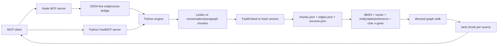

## 1. Executive Summary

`swafra` is a compact, local-first graph-RAG memory server for MCP clients. It stores source text as embedded chunks, annotates chunks with regex-extracted entities, dates, and preferences, connects chunks with several edge types, and retrieves with a four-signal hybrid ranker plus graph expansion.

Its design is appealing as a small personal memory sidecar:

- no hosted service or API key is required;
- the Python package is a complete MCP server;
- the Node package offers a second MCP wrapper over the same Python engine;
- source text remains in the stored chunks instead of being replaced by LLM-generated facts;
- BM25, embeddings, entity/date hints, character n-grams, source diversity, and graph traversal are combined in fewer than 1,000 lines of engine code.

The strongest technical idea is the source-diverse retrieval shape: rank chunks, expand through graph edges, then return the best chunk from each source. The conversation fallback also creates useful exchange chunks and a deterministic facts/navigation chunk without calling an LLM.

The implementation is alpha-quality, not yet a safe durable memory layer. Persistence is three unlocked, non-atomic JSON rewrites. There are no user/project scopes, authentication boundaries, token budgets, update API, provenance spans, trust states, or unit tests. Several advertised behaviors do not match the code. Most importantly, the committed LongMemEval artifact labeled `k=10` returned 28–46 sessions per question, so the headline recall score is not evidence of recall at 10.

Verdict: study Swafra for a concise hybrid-retrieval prototype and MCP affordances. Do not borrow its storage, benchmark methodology, deletion semantics, or trust model for a serious system without substantial redesign.

## 2. Mental Model

Swafra considers a memory source to be a titled text blob. Ingestion turns that blob into one or more chunk records. Those chunks, not extracted beliefs, are the authoritative content.

Chunk kinds:

- `leiden`: sentence communities created by Leiden clustering when optional dependencies are available and the input has at least eight sentences;
- `exchange`: groups of two user/assistant exchanges when the fallback detects role-prefixed conversation text;
- `facts`: a synthetic index chunk containing regex-extracted entities, dates, and preference statements from a conversation;
- `paragraph`: groups of paragraphs capped approximately at 256 whitespace-separated words.

Each chunk holds its text and embedding directly. The "knowledge graph" is a separate list of directed edges between chunk IDs:

- `next` / `prev`;
- `similar`;
- `entity`;
- `cross_session`.

Lifecycle:

```text
MCP add_knowledge
-> choose Leiden or fallback chunking
-> annotate and embed chunks
-> add within-source and cross-source edges
-> rewrite chunks.json, edges.json, sources.json
-> later hybrid search
-> optional directed graph walk
-> best chunk per source
-> MCP result
```

Memory is agent-controlled. `CLAUDE.md`, `SKILL.md`, and MCP descriptions instruct the model to save proactively and call `get_context` at session start. The backend does not observe conversations or inject memory automatically.

Stored text is treated as recallable evidence, but there is no explicit epistemic distinction between user statements, assistant statements, imported documents, extracted navigation text, current values, rejected values, or verified facts.

## 3. Architecture

Swafra has two public runtime shapes over one duplicated engine implementation.

Python distribution:

- `swafra/server.py`: `FastMCP` stdio server.
- `swafra/engine.py`: chunking, embedding, graph construction, JSON persistence, search, graph walk, and context selection.

Node distribution:

- `src/index.ts`: MCP stdio server using the TypeScript SDK.
- `src/engine.ts`: starts `engine/scimap_engine.py` and sends JSON-line RPC requests.
- `engine/scimap_engine.py`: byte-for-byte duplicate of `swafra/engine.py` in the inspected checkout.

Persistence:

- `${SCIMAP_DATA_DIR}/chunks.json`;
- `${SCIMAP_DATA_DIR}/edges.json`;
- `${SCIMAP_DATA_DIR}/sources.json`;
- default directory `~/.scimap`.

External dependencies:

- required Python MCP package for the Python distribution;
- optional `fastembed` for `BAAI/bge-small-en-v1.5`;
- optional NumPy, igraph, and leidenalg for Leiden chunking;
- Node MCP SDK and Zod for the Node wrapper.

If FastEmbed cannot load, `_local_vector()` creates deterministic signed hash vectors over words and character trigrams. If Leiden dependencies are unavailable, ingestion uses conversation/paragraph chunking.



There is no daemon, database, queue, background worker, hosted API, replication path, or multi-tenant service boundary.

## 4. Essential Implementation Paths

### Capture and Write

Python MCP starts at `add_knowledge()` in `swafra/server.py`, which directly calls `engine.add_knowledge()`.

The Node path starts in the `add_knowledge` case in `src/index.ts`, calls `Engine.call()` in `src/engine.ts`, and dispatches through the `METHODS` map in `engine/scimap_engine.py`.

`add_knowledge()` in `swafra/engine.py`:

1. loads all three JSON files;
2. derives `source_id` from `SHA-256(title + ":" + first 100 text characters)[:16]`;
3. removes records already carrying that exact source ID;
4. tries `leiden_chunk()`, then `chunk_conversation()`;
5. embeds all resulting chunk contents;
6. derives chunk IDs from source ID and chunk index;
7. appends chunk records;
8. builds within-source and cross-source edges;
9. rewrites all three files.

State changes only in the final `_save_json()` calls. There is no transaction covering the three files.

### Chunking and Annotation

`leiden_chunk()`:

- splits sentences with `_SENT_RE`;
- embeds every sentence;
- materializes an all-pairs cosine-similarity matrix;
- adds positional weight for sentences at distance three or less;
- keeps graph edges with adjusted similarity at least `0.3`;
- runs `RBConfigurationVertexPartition` with a derived resolution and fixed seed;
- joins each community's sentences in original within-community order.

The docs describe a semantic + entity + position graph, but the implemented Leiden graph uses embedding similarity plus positional weight. Extracted entities annotate the output after partitioning; they do not influence Leiden edges.

`chunk_conversation()`:

- recognizes only lines beginning with `User:`, `Assistant:`, `Human:`, or `AI:`;
- groups turns into exchanges ending at assistant turns;
- groups two exchanges per chunk;
- creates an additional synthetic facts chunk if any entities, dates, or preferences were found;
- otherwise groups non-conversation paragraphs around a 256-word threshold.

`_extract_entities()`, `_extract_dates()`, and `_extract_preferences()` are regex heuristics, not an LLM or NLP entity linker.

### Graph Construction

`add_knowledge()` creates:

- bidirectional `next`/`prev` edges between adjacent chunk-list entries;
- up to five outgoing `similar` edges per chunk above cosine `0.7`;
- one-way pairwise `entity` edges for entities appearing in two to ten chunks;
- up to three outgoing `cross_session` edges from each new chunk to the best chunk in other sources above cosine `0.45`.

No explicit community edge is created despite MCP/docs claims about "community edges". `community_id` is metadata only.

For Leiden output, adjacent entries are adjacent Leiden communities, not necessarily adjacent spans in the original text. Calling those edges `next`/`prev` can therefore imply a sequence that the source did not have.

### Retrieval and Ranking

`search_knowledge()`:

1. loads all chunks and drops records whose `superseded_by` is set;
2. rebuilds an in-memory `BM25Index`;
3. scores only the top `3k` BM25 candidates lexically;
4. embeds the query and scans every chunk embedding;
5. calculates regex entity/date/preference and exact-keyword bonuses;
6. calculates character-trigram overlap against every chunk;
7. fuses `0.40 * BM25 + 0.15 * vector + 0.25 * entity/heuristic + 0.20 * n-gram`;
8. multiplies by exponential age decay with an approximately 139-day half-life;
9. deduplicates on the first 100 lowercased content characters;
10. returns top-scoring chunks.

The entity/heuristic score is not bounded before fusion, so repeated matching entities, dates, preferences, and keywords can dominate the other normalized channels.

### Context Assembly

`get_context()`:

1. calls `search_knowledge(query, k=len(chunks_store))`, deliberately scoring and returning as many chunks as possible;
2. graph-walks from the first three hits;
3. appends unseen walked nodes at half their path score;
4. keeps the best hit for each `source_title`;
5. returns at least `max(k, floor(total_sources * min_source_pct))` source-diverse results.

The public Python MCP server fixes `min_source_pct=0.15`. This means `k` is a lower bound, not a result cap, once 15% of the corpus exceeds `k`. There is no token budget or maximum context size.

### Delete and Update

`delete_source()` removes:

- chunks with the target `source_id`;
- edges whose own `source_id` equals the target;
- the source list entry.

Cross-session edges are stored with `source_id: None`, so edges pointing from or to deleted chunks survive. They become dangling graph records and accumulate.

There is no update tool. Calling `add_knowledge` is only an idempotent replacement when the title and first 100 text characters derive the same source ID. Changing early content creates a second source even when the title is unchanged.

The `superseded_by` loop cannot currently mark an old version from the same source: matching-source chunks are removed from `chunks_store` before `old_chunks` is computed.

### Storage Definitions

The schema is implicit dictionary construction in `add_knowledge()`:

- source: `id`, `title`, `chunks`;
- chunk: `id`, `source_id`, `source_title`, `content`, `embedding`, `token_count`, `chunk_index`, `community_id`, `entities`, `dates`, `preferences`, `type`, `span`, `created_at`, `superseded_by`;
- edge: `source_id`, `from`, `to`, `type`, `weight`.

There are no migrations or schema-version fields.

### Tests and Evals

No unit or integration test files are present.

LongMemEval harnesses exist at:

- `bench/run_eval.py`;
- `packages/mcp/bench/run_eval.py`;
- `packages/mcp/bench/longmemeval_colab.ipynb`;
- committed outputs in both benchmark directories.

## 5. Memory Data Model

The model is source -> chunk plus a global edge list.

Useful fields:

- source identity and title;
- verbatim chunk content;
- embedding stored beside content;
- created time;
- chunk kind;
- extracted entities, date strings, and preference strings;
- a weak `span`;
- graph relation type and weight.

Important limitations:

- `span` is a word-count placeholder such as `[0, wc]`, not a source character, line, turn, or sentence span.
- Sources do not retain original full text separately from chunks.
- There is no author/actor, message ID, role field, file path, URL, content hash, ingestion method, source timestamp, or embedding model identity.
- `source_id` uses only the first 100 text characters plus title, so it is neither a full content hash nor a stable title key.
- The title is not unique. `get_context()` groups by title, so distinct sources sharing a title collapse at retrieval time.
- There is no user, agent, session, project, workspace, tenant, or visibility scope.
- There is no version chain, correction relation, contradiction record, rejection tombstone, TTL, pin, sensitivity label, uncertainty, or verification state.
- The raw embedding vector is duplicated into JSON for every chunk.

The data model is adequate for a single trusted user running one process over a small corpus. It is not adequate for shared or safety-sensitive memory.

## 6. Retrieval Mechanics

Swafra's retrieval is its most interesting subsystem.

Strengths:

- lexical and vector signals cover different query shapes;
- character n-grams give the hash-vector fallback a second fuzzy lexical channel;
- entity/date/preference heuristics target common personal-memory questions;
- recency is explicit rather than hidden in an opaque reranker;
- graph expansion can recover neighboring or cross-source context;
- source diversity avoids returning ten near-duplicate chunks from one document;
- raw content is returned with source title and chunk ID.

Weaknesses:

- all indexes are rebuilt or scanned on every query;
- score calibration is ad hoc and entity bonuses are unbounded;
- dates are string matches, not normalized temporal facts or reasoning;
- the age decay penalizes old durable truths even when they remain current;
- graph traversal follows only outgoing edges, while entity and cross-session edges are often one-way;
- graph-walk scores are not comparable to fused search scores, yet `get_context()` compares them after multiplying walk scores by `0.5`;
- grouping by `source_title` can merge unrelated sources;
- result count and token volume are unbounded relative to the requested `k`;
- no scope filter is applied before scoring;
- no result exposes component scores, dates, preferences, path provenance, or why it ranked.

The best-chunk-per-source rule is useful when sources are sessions, as in LongMemEval. It can under-recall a large document where multiple distant chunks are needed to answer one question.

## 7. Write Mechanics

Writes are synchronous and hot-path. The server does not use an LLM for extraction or consolidation.

Good properties:

- deterministic IDs make identical ingestion calls repeatable;
- raw chunk text is retained;
- FastEmbed and Leiden are optional;
- the fallback stays local and deterministic;
- source deletion is exposed by exact ID;
- synthetic facts chunks act as navigational indexes while the source exchange chunks remain available.

Risks:

- `_save_json()` overwrites files directly rather than writing a temporary file and atomically replacing it;
- no file lock or process lock protects read-modify-write;
- concurrent MCP processes can lose writes or expose partially written JSON;
- failure after one of the three saves can leave chunks, edges, and sources inconsistent;
- there is no validation of empty/huge text, title uniqueness, corpus size, or embedding dimension;
- changing embedding model can mix incompatible vector dimensions silently;
- the `SCIMAP_EMBED_BACKEND` variable documented and set by benchmarks is never read by the engine;
- no dedupe operates across differently titled identical sources;
- no correction/conflict flow exists;
- the facts chunk can overemphasize noisy regex matches;
- no input is classified as untrusted before later prompt injection by a client.

## 8. Agent Integration

The six-tool MCP surface is compact and understandable:

- `add_knowledge`;
- `search_knowledge`;
- `get_context`;
- `graph_walk`;
- `list_sources`;
- `delete_source`.

`get_context` is the recommended high-level read; `search_knowledge` and `graph_walk` enable progressive disclosure. Exact source deletion is preferable to semantic "forget" behavior.

The integration depends heavily on prompt/tool policy. `CLAUDE.md` and Python tool descriptions tell the agent to:

- store user identity, preferences, project decisions, corrections, and likely future context;
- retrieve at every session start;
- avoid duplicates by listing sources;
- confirm writes to the user.

Those are good affordances but are not backend guarantees. An agent can omit writes, store assistant speculation, duplicate a source under a new title, retrieve too much context, or recall prompt-injected source text.

The Python and Node public surfaces have drift:

- Python package version is `0.1.5`; npm package version is `0.1.2`; Node server advertises `0.1.0`.
- Python uses FastMCP and passes `min_source_pct=0.15` explicitly.
- Node uses a subprocess bridge and relies on the engine default.
- Node tool text says `search_knowledge` is cosine search, while the engine performs hybrid search.
- names and docs still alternate between `swafra` and the earlier `scimap`.

The Python MCP package is the cleaner integration path. The Node wrapper adds process management, a second protocol, duplicated engine packaging, and a 60-second timeout without adding memory semantics.

## 9. Reliability, Safety, and Trust

Positive:

- local-only default;
- no model/API key required;
- exact-ID source deletion;
- source title and chunk ID accompany recalled text;
- deterministic fallback embeddings;
- MCP errors are returned rather than silently swallowed;
- Node wrapper sends engine logs to stderr, keeping JSON-line stdout clean.

Serious gaps:

- no atomicity, locking, backup, repair, sync, or corruption handling;
- JSON parse failure can make the server unusable;
- cross-session edges survive source deletion;
- no embedding-model/version record;
- no access control or multi-user scoping;
- no provenance beyond a caller-supplied title;
- no trust/verification state or uncertainty representation;
- no prompt-injection fencing for recalled content;
- no differentiation between user text and assistant text in stored exchange content;
- no privacy metadata, expiry, hard-delete audit, or derived-data deletion verification;
- no bounded context assembly;
- no protection from malicious documents creating dense entity edges or dominating heuristic scores.

Swafra is best understood as a trusted, single-user local retrieval utility. It should not be treated as a truth-bearing memory database.

## 10. Tests, Evals, and Benchmarks

There are no ordinary tests in the repository. The only executable quality evidence is LongMemEval retrieval code and committed result JSON.

The benchmark deserves special caution.

What the harness does well:

- uses labeled `answer_session_ids`;
- ingests every session as a separate titled source;
- skips abstention questions;
- reports `recall_any`, `recall_all`, and fractional session recall;
- retains per-question details.

Why the published result is not valid `recall_all@10` evidence:

- `get_context()` treats `k` as a lower bound and can return a percentage of all sources.
- The checked-in `bench/results.json` is labeled `k: 10`, but every one of the 470 evaluated questions returned more than 10 sessions: minimum 28, maximum 46, mean 35.4.
- The artifact truncates `retrieved_sessions` to ten for display while scoring recall against the full untruncated result list.
- Thus the metric is effectively recall over roughly two-thirds of the haystack, not recall at ten.

The evidence is also internally inconsistent:

- `README.md` and the headline in `BENCHMARK.md` claim `94.7%`.
- `bench/results.json` records `99.6%` recall-all over 470 non-abstention questions.
- category values disagree between README, benchmark prose, and result JSON.
- the current `bench/run_eval.py` uses the engine default source percentage, while the legacy copy explicitly passes `0.25`;
- current source code would cap a typical 53-source, `k=10`, `min_source_pct=0.15` run at ten results, which does not match the committed artifact's 28–46 results;
- the benchmark sets `SCIMAP_EMBED_BACKEND=local`, but the engine ignores that variable and tries FastEmbed whenever import/model loading succeeds.

The README correctly says retrieval recall is not end-to-end QA accuracy. However, the reported run does not establish the stated retrieval cutoff.

Before trusting retrieval quality, add:

- unit tests for chunking, edge direction, fusion, source diversity, update, and delete;
- concurrent write and interrupted-write tests;
- embedding model mismatch tests;
- scope and prompt-injection tests once those features exist;
- a benchmark assertion that `len(results) <= k`;
- scoring against exactly the first `k` returned source IDs;
- precision, MRR/nDCG, token count, latency, and end-to-end QA measures;
- a committed manifest tying results to engine commit, dependencies, embedder, and configuration.

The smoke review for this report used the hash embedder on a temporary directory. It confirmed that current `get_context(k=3)` returns three results for 20 sources at the default 15% rule, and that adding two different texts under the same title creates two source records.

## 11. Patterns Worth Stealing

- Combine BM25, vector, and cheap domain heuristics before adding an LLM reranker.
- Return source-diverse results when sessions/documents, rather than chunks, are the evaluation and context unit.
- Keep raw exchange chunks and treat a deterministic facts chunk as an index, not the sole memory.
- Offer `search` and `graph_walk` separately, plus one convenient `get_context` composition.
- Use exact source IDs for destructive deletion.
- Make heavy embedding and graph dependencies optional for a local tool.
- Keep engine logs on stderr when a subprocess uses stdout as a protocol.

## 12. Antipatterns / Risks

- Calling a metric `@k` while evaluating more than `k` results.
- Rewriting several JSON files without locks or atomic replace.
- Storing vectors without embedder identity or index version.
- Using caller titles as both weak provenance and retrieval diversity keys.
- Deriving source identity from title plus only the first 100 content characters.
- Applying unconditional recency decay to durable facts.
- Building directed semantic/entity edges without making traversal direction intentional.
- Leaving cross-source edges behind during deletion.
- Keeping unreachable supersession code and presenting it as an update mechanism.
- Advertising graph signals not used by the implementation, such as entity-weighted Leiden partitioning and community edges.
- Relying on tool descriptions to enforce proactive capture, dedupe, source trust, and retrieval hygiene.
- Duplicating the full engine across package layouts and letting Python/Node/docs versions drift.
- Full corpus scans, in-memory BM25 rebuilds, all-pairs Leiden similarity, and linear edge scans with no corpus limit.

## 13. Build-vs-Borrow Takeaways

Reuse conceptually:

- the compact MCP vocabulary;
- hybrid lexical/vector/fuzzy retrieval;
- source-diverse context selection;
- raw conversation chunks plus derived navigation chunks;
- explicit graph exploration after a precise search hit.

Reimplement rather than copy:

- persistence on SQLite with transactions, FTS5, schema migrations, foreign keys, WAL, and exact cascading deletion;
- embeddings in a versioned vector index or typed blob table;
- graph adjacency with indexed, intentionally bidirectional relations;
- stable source IDs plus full content hashes and source/version records;
- bounded, token-aware context selection;
- component-score telemetry and realistic retrieval evals.

Add before production:

- user/agent/project scopes;
- source roles and provenance spans;
- candidate/verified/rejected or at least evidence/current/stale states;
- contradiction and correction chains;
- defensive context rendering;
- locks, backups, repair/reindex, and deletion verification;
- comprehensive tests.

This design is appropriate for a small, trusted, single-user MCP prototype where install simplicity matters more than durability and corpus scale. It is the wrong shape for shared memory, high-stakes personalization, large document collections, concurrent agents, or any system that presents memory as verified truth.

## 14. Open Questions

- What exact engine revision and configuration produced each published score?
- Why do committed `k=10` results contain 28–46 returned sessions?
- Was FastEmbed or the hash fallback actually used in the published full run?
- Is `SCIMAP_EMBED_BACKEND` intended to select a backend, and if so, why is it not read?
- Should source identity be title-based, content-based, or a caller-supplied stable ID?
- Are cross-session and entity edges intended to be traversable in both directions?
- Should recency decay apply to imported documents and durable preferences?
- How should two sources with the same title be represented in `get_context`?
- What is the intended upgrade path when the embedding model changes?
- Are Node and Python packages both supported surfaces, or is one transitional?

## Appendix: File Index

Storage/schema/write/retrieval/graph:

- `swafra/swafra/engine.py`
- `swafra/engine/scimap_engine.py` (duplicate engine copy)

Python MCP:

- `swafra/swafra/server.py`
- `swafra/swafra/__init__.py`
- `swafra/pyproject.toml`

Node MCP and subprocess bridge:

- `swafra/src/index.ts`
- `swafra/src/engine.ts`
- `swafra/package.json`

Agent policy and setup:

- `swafra/CLAUDE.md`
- `swafra/SKILL.md`
- `swafra/README.md`
- `swafra/SETUP.md`

Evals:

- `swafra/bench/run_eval.py`
- `swafra/bench/results.json`
- `swafra/packages/mcp/bench/run_eval.py`
- `swafra/packages/mcp/bench/results.json`
- `swafra/packages/mcp/bench/longmemeval_colab.ipynb`
- `swafra/BENCHMARK.md`
