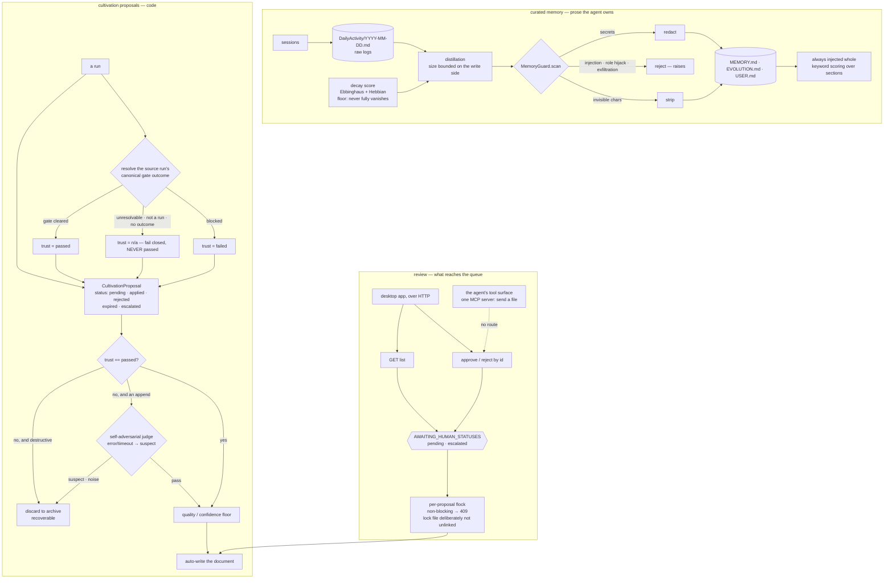

## 1. Executive Summary

SwarmAI is a desktop agent OS with a FastAPI backend — a thousand Python files,
five hundred test files — built on the Claude Agent SDK. Its memory has two
halves that behave very differently, and the report is mostly about the second.

The **curated half** is markdown: raw session logs in a daily-activity file,
distilled into a memory file the agent owns and the user directs. Its rules are
written at the top of that file and they are good rules — *"Stale memory that
gets distilled becomes a self-reinforcing false belief"*, *"Corrections are
permanent"* — but they are instructions to a model, not mechanisms.

The **proposal half** is code, and it carries three marks.

**A proposal cannot assert its own trustworthiness.** The trust stamp is
resolved at creation by reading the source run's own record; an unresolvable
run, a source that is not a run, or a run with no canonical outcome all yield
*not-applicable*, and the header states the rule in capitals — **never**
passed. A committed test asserts a run identifier containing path traversal
cannot forge it.

**The approval endpoint and the list share one constant.** The by-id lookup
returns a proposal only while it is awaiting a human decision, reusing the same
frozen set the listing filters on — *"so a proposal hidden from the list can
never be re-approved by id"* — with the run named in which a rejected proposal
was re-approvable and an expired one approvable though invisible.

And there is a write guard between any content and the memory files: secrets
redacted, invisible characters stripped, prompt injection and exfiltration
**rejected** rather than sanitised.

The honest counterweight is in the same file as the trust gate. The automatic
cultivation path does not escalate what it distrusts; it discards it to a
recoverable archive, with the comment saying so plainly — *"autonomy-first: no
human review queue"*. Review governs the proposals that reach the queue, and
the judge-passed writes never do.

## 2. Mental Model

Sessions produce raw logs. Distillation turns those into curated memory.
Separately, runs produce *proposals* — suggested edits to a project's own
documents — and those go through a gate before they can write.

The proposal is where the interesting state lives, because it carries two
fields that are deliberately not the same thing. `status` is where the proposal
is in its life: pending, applied, rejected, expired, escalated. The trust stamp
is what is known about the evidence behind it, derived from the run that
produced it rather than from anything the proposal says.

Keeping those apart is what lets the system express *this is still open and we
do not trust it* separately from *this is closed*.

## 3. Architecture

## 4. Essential Implementation Paths

- **Proposal model, trust stamp, auto-gate:** `backend/core/ddd_cultivation.py`.
- **Review routes and the shared constant:** `backend/routers/cultivation.py`.
- **Write guard:** `backend/core/memory_guard.py`,
  `backend/core/memory_validation.py`.
- **Memory parsing and recall:** `backend/core/memory_index.py`.
- **Decay scoring:** `backend/core/memory_decay.py`.
- **The curated file's own rules:** `backend/context/MEMORY.md`.

## 5. Memory Data Model

Two models, and they are worth separating because only one is enforced.

The **curated file** is markdown with a header declaring it agent-owned and
user-directed, and seven numbered rules: verify before trusting, curate rather
than accumulate, prefer recency, check open threads each session, escalate a
problem seen three times, and never delete a correction. Rule three states the
failure mode the whole file exists to avoid — *"Stale memory that gets
distilled becomes a self-reinforcing false belief."* These are excellent rules
addressed to a model, and nothing in the code enforces them.

The **proposal** is a dataclass with a target document and section, content, a
confidence, the source run, a status, a change type, and the trust stamp. Its
default is the restrictive value and a test asserts that, including for a
dictionary that omits the field entirely.

`memory_decay.py` scores entries with an Ebbinghaus curve, Hebbian
strengthening on co-access and a spacing effect, with a strength floor so
*"entries never fully vanish"* — a number that informs pruning rather than a
state that gates reading.

## 6. Retrieval Mechanics

The curated file is always injected whole. The module that used to score
sections for selective injection records its own deletion: there is no in-prompt
index and no tiering, *"size is bounded on the WRITE side (distillation caps and
the size-valve archiver), not by injection-time section dropping."*

That module also carries the most unusual comment in this reading, and it is
about documentation rather than code. Several routes can reach archived
shards, and the header warns that the recurring defect *"is not naming the
wrong one, it is writing a CLOSED list or a system-wide 'never'."* Two
successive revisions of that docstring did exactly that — one named a single
mechanism, and **an injected governance file propagated it as an absolute
"never body-BM25 over the archive"**; the replacement claimed two mechanisms
and denied a third that ships an HTTP endpoint. The instruction that replaced
them is to *"treat the list below as the routes MEASURED so far, never as
exhaustive"*, with the search to re-derive the current set written down.

That is a project describing, about itself, the error class this atlas finds
most often in its own work: a negative existence claim, stated absolutely,
propagating into a document other things trust.

## 7. Write Mechanics

Everything that reaches the memory files passes `MemoryGuard`, which sorts its
findings into three actions: secrets are redacted, invisible characters are
stripped, and prompt injection, role hijack and exfiltration attempts are
**rejected** — the function raises rather than returning cleaned content. A
memory layer that ingests session text is an injection surface, and grading the
response by category rather than sanitising everything is the right shape.

The cultivation gate is the other write path. A proposal whose trust is not
*passed* and whose change type is an append goes to a self-adversarial refute
judge, whose error and timeout branches resolve to a non-passing verdict; a
non-passing verdict discards. A proposal that is destructive rather than an
append is discarded without being judged at all, on the reasoning that it is
reversible only via the archive.

## 8. Agent Integration

A desktop application over a FastAPI backend, a skill library, and one MCP
server whose job is sending files on a channel. Built on the Claude Agent SDK;
MIT; English and Chinese documentation.

## 9. Reliability, Safety, and Trust

**Trust state — awarded**, on the derived stamp rather than the lifecycle
status. The property that earns it is that the proposal cannot claim the value:
it is resolved from the source run's record, and every way of failing to
resolve it lands on the restrictive value.

**Human review — awarded**, on three things together: the approver is a person
at the desktop application over HTTP, the agent's tool surface has no route to
those endpoints, and the by-id action reuses the listing's constant so the two
views cannot disagree about what is actionable. The caveat is large enough to
state twice: the automatic path discards what it distrusts instead of
escalating it, and the code says so — *"autonomy-first: no human review
queue"*. What a person reviews is the set of proposals that reached the queue,
not everything the system was unsure about.

**Negative eval — awarded**, on the five-state actionability table, the test
that the two paths share one constant, and the path-traversal forging case.

**Audit log — withheld.** `audit_manager.py` logs workspace configuration
changes — skills, MCP servers, knowledgebases, settings — with a change type,
an entity type and a timestamp. Memory writes are not among them. An
evolution changelog exists as a JSON-lines file in the context directory and is
agent-written prose rather than a structured record of mutations.

**Tombstone — withheld.** A discarded proposal is archived and described as
recoverable, which is a row-keyed archive. Nothing is keyed on the content so
that the same proposal arriving again is refused; the judge would simply judge
it again.

**Scope enforced — withheld.** Proposals live under per-project directories and
documents are resolved per project, which partitions by path rather than by a
stored key applied to a query.

**Bi-temporal — withheld.** Timestamps are record time; the decay model reasons
about elapsed time since last reference, not about when a claim held.

## 10. Tests, Evals, and Benchmarks

**No paper** and no `CITATION.cff`.

522 test files in the backend. Two habits in them are worth naming beyond the
cases carrying the mark.

The suite tests *invariants*, not only outcomes: one case asserts that the by-id
lookup uses the shared constant, and another asserts the advisory lock file is
**not** unlinked on release — pinning a decision whose rationale is a race that
a later tidy-up would happily undo. The comment explaining that decision walks
through the inode-divergence failure and points at both the corrected pattern
elsewhere in the tree and the latent uncorrected one, which is the kind of
cross-reference that stops a fix from being local.

And the incident identifiers are in the code. Comments cite the runs in which
the defects were found — a re-approvable rejected proposal, a concurrent
double-approve — so a reader can tell which lines are load-bearing.

No retrieval benchmark is committed and none is claimed.

## 11. For Your Own Build

- **Derive the trust stamp; never let the record assert it.** Resolving it from
  the source run means a proposal cannot promote itself, and every failure to
  resolve should land on the restrictive value.
- **Share one constant between the list and the action.** A by-id endpoint that
  restates the list's filter is a divergence waiting to happen, and the
  incident here is exactly that: a rejected proposal re-approvable by id while
  invisible in the list.
- **Grade the guard's response by category.** Redact a secret, strip an
  invisible character, and *reject* an injection — sanitising everything
  silently is how a hijack attempt becomes a stored memory.
- **Test the invariant, not just the behaviour.** A case asserting two modules
  use the same constant survives a refactor that a behavioural test would pass.
- **Write the incident id in the comment.** Lines whose rationale is a race
  nobody can reproduce on demand need the pointer, or the next cleanup removes
  them.
- **Do not write a closed list or an absolute "never" into a document other
  systems read.** This project's own docstring records a wrong absolute
  propagating into an injected governance file; the fix was to say *measured so
  far* and to write down the search that re-derives the set.

## 12. Open Questions

- The automatic path discards what the judge does not pass, with the human
  queue at zero by design. Is the archive surfaced anywhere a person would
  browse it, or is recovery by path?
- The curated memory file's seven rules are prose the agent is asked to follow.
  Which of them could be enforced — the never-delete-a-correction rule looks
  like a candidate for the same guard that already inspects those writes.
- `audit_manager` covers workspace configuration with a change type and an
  entity type. Would the same table accept a memory-file edit, and is the
  volume the reason it does not?

## Appendix: File Index

- Proposal model, trust stamp, auto-gate: `backend/core/ddd_cultivation.py`
- Review routes, shared constant, locking: `backend/routers/cultivation.py`
- Write guard: `backend/core/memory_guard.py`,
  `backend/core/memory_validation.py`
- Memory parsing, recall, the archive-reachability note:
  `backend/core/memory_index.py`
- Decay: `backend/core/memory_decay.py`
- Extraction and health endpoints: `backend/core/memory_extractor.py`,
  `backend/routers/memory.py`
- Configuration audit: `backend/core/audit_manager.py`
- The curated file and its rules: `backend/context/MEMORY.md`
- Tests: `backend/tests/test_cultivation_proposal_lifecycle.py`,
  `backend/tests/test_admission_trust_field.py`,
  `backend/tests/test_memory_v2_wiring.py`

## History

**2026-09-19** — [`a032aafae0e698b8b3a92955a376511cb7f1aa1b`](https://github.com/xg-gh-25/SwarmAI/commit/a032aafae0e698b8b3a92955a376511cb7f1aa1b) — first reading, at the head of `main`. Screened with `scripts/screen_repo.py` before anything was read: two auto-run surfaces in an agent harness's hook scripts and settings, and a large set of manifests reported inside the seven-day cooldown across the backend, the desktop application and the skill templates. Nothing was installed, built or run. MIT. Three marks. This reading is of the memory and knowledge-admission subsystems — the curated file and its rules, the write guard, the memory index and decay modules, the cultivation proposal model and its trust stamp, the auto-apply gate and the adversarial judge, the review routes and their locking, and the admission and lifecycle test suites — and not of the thousand-file agent runtime around them; the skills, channels, desktop application and provisioning trees were read as context. Four marks are withheld with reasons in section 9. The finding worth carrying beyond the marks is in `memory_index.py`: its header records that two successive revisions of its own documentation wrote a closed list and an absolute "never", one of which an injected governance file then propagated as authoritative — the same negative-existence-claim failure this atlas most often makes about the systems it reads.
