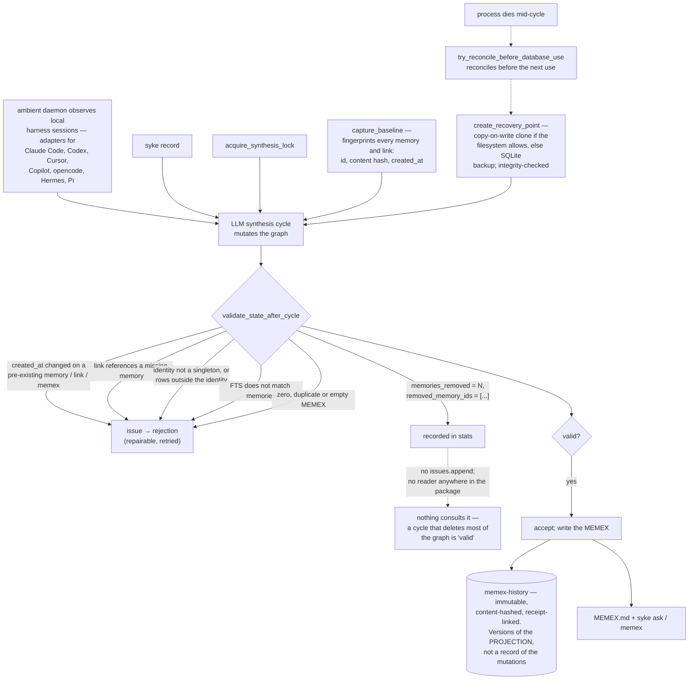

## 1. Executive Summary

Syke is "a local memory agent that works with your other AI agents" — AGPL-3.0,
Python 3.12+, 32,408 lines with 11,539 lines of tests. It runs as an ambient
daemon, reads local agent activity across supported harnesses — adapters ship
for Claude Code, Codex, Cursor, Copilot, opencode, Hermes, Pi and Antigravity —
and "maintains a coherent timeline of objects, intent, and progress in prose",
serving it as `MEMEX.md` plus `syke ask`, `syke record` and `syke memex`.

The data model is deliberately small. A memory is an id, a user id, prose, a
created-at and an optional updated-at. A link joins two memories and carries a
free-text `reason`. There is one current MEMEX, enforced as a singleton by a
primary-key CHECK. That is the whole graph.

Which means the interesting engineering is not the schema — it is that an LLM
rewrites this graph on a schedule, unsupervised, and Syke has thought hard about
what that can be allowed to do.

Every synthesis cycle is bracketed. `capture_baseline` fingerprints every memory
and link — id, content hash, created-at — and the current MEMEX.
`create_recovery_point` clones the database, preferring a copy-on-write clone
where the filesystem supports one and falling back to SQLite's backup API, and
runs integrity checks on the copy before accepting it. A synthesis lock prevents
two cycles at once, a recovery fence is published, and if the process dies
mid-cycle `try_reconcile_before_database_use` reconciles the interruption before
anything touches the database again.

Then the cycle runs, and `validate_state_after_cycle` decides whether to keep
it. Its invariants are the right ones:

- a pre-existing memory's `created_at` may not change, nor a link's, nor the
  MEMEX's — the agent may revise what it believes, not when it first knew it;
- no link may reference a missing memory;
- the identity must remain a singleton, and no row may exist outside it;
- the FTS index must match the memories table;
- exactly one current MEMEX must survive, and it must not be empty.

A failure produces a rejection marked `repairable`, and the cycle is retried
rather than discarded.

Twelve lines into that function's diff section, the gate computes this:

```
stats["memories_removed"] = len(removed_memory_ids)
stats["removed_memory_ids"] = removed_memory_ids
```

and never mentions either again. There is no `issues.append` for removed
memories anywhere in the function, and `memories_removed` and
`removed_memory_ids` appear nowhere else in the package. The synthesis backend
reads `semantic_gate.get("valid", False)`, which is derived from `issues`; the
stats ride along in the result and are consulted by nothing.

So a cycle that deletes ninety per cent of the graph is valid. The recovery
point taken minutes earlier means the state is restorable — that is the part
Syke got right, and most systems here do not have it — but nothing notices that
it should be restored, and the number that would notice has already been
computed and put in a dictionary.

## 2. Mental Model

A **memory** is prose with a first-seen time. That time is immutable.

A **link** is a typed-by-prose edge, and `ON DELETE RESTRICT` means the graph
will not let a linked memory vanish quietly.

A **cycle** is one LLM pass over the graph, bracketed by a fingerprint, a
database clone and a gate.

The **MEMEX** is the single projection every other agent reads.



## 3. Architecture

| Area | Role |
| --- | --- |
| `syke/db.py` | The four-table schema, the FTS index, the CHECK constraints |
| `syke/db_safety.py` | Recovery points, baselines, the gate, interrupted-cycle reconciliation |
| `syke/db_access.py` | The database lease and lock |
| `syke/llm/backends/pi_synthesis.py` | The cycle, and what it does with the gate's verdict |
| `syke/memory/memex*.py` | The projection, its token budget, and its immutable history |
| `syke/observe/` | Harness adapters and the session catalogue |
| `syke/distribution/` | Getting `MEMEX.md` to the other agents |
| `syke/control.py` | Write-once receipts and admitted external records |

## 4. Essential Implementation Paths

`syke/db_safety.py:948-1176` — the gate. Read the issue conditions as a list and
then look for the one that is missing.

`syke/db_safety.py:252-513` — baseline capture and recovery-point creation,
including the copy-on-write attempt and the integrity checks on the clone.

`syke/llm/backends/pi_synthesis.py:1371-1400` — where the verdict is consumed,
and where the stats are not.

## 5. Memory Data Model

Four tables and an FTS index, with more CHECK constraints than most schemas here
carry: ids must be non-empty after trimming, `syke_identity` and `current_memex`
are singletons by primary-key constraint, and both link endpoints are foreign
keys with `ON DELETE RESTRICT`.

That last one is a real decision. It means the database itself refuses to leave
a dangling edge, so the gate's `links reference missing memories` check is a
belt beside a brace — and it means a synthesis cycle that wants to delete a
linked memory has to remove the link first, an act the baseline diff will see as
`removed_link_ids`.

What a memory does not carry is any epistemic state: no status, no confidence,
no source, no supersession pointer. `updated_at` records that a revision
happened, not what it replaced. The link's `reason` is free prose. So the graph
holds what is currently believed and, apart from the immutable `created_at`,
nothing about how it came to be believed — which is why this report carries no
marks despite the care visible in the safety layer.

## 6. Retrieval Mechanics

FTS5 with a porter tokenizer over memory content for `syke ask`, and the whole
`MEMEX.md` for everything else. The projection is token-budgeted with an "exact,
reproducible budget header" and an `over_budget` flag, which is the right shape:
the consumer can see that the projection was truncated rather than guessing.

## 7. Write Mechanics

Two paths. `syke record` takes an explicit statement from a person or an agent.
The synthesis cycle is the interesting one: it reads observed harness activity
and rewrites the graph and the projection in one LLM pass, under the lock, inside
the bracket described above.

The bracket is genuinely good work. Cloning the database before an unsupervised
LLM mutation, checking the clone's integrity before trusting it, fingerprinting
the prior state, taking a lock, publishing a fence, and reconciling an interrupted
cycle before the next database use — that is more operational care than most
memory systems in this corpus apply to anything.

Which makes the gap conspicuous rather than careless. Everything needed to bound
deletion is present: the baseline fingerprints, the diff, the count, the ids, and
a restorable snapshot. The missing piece is three lines — a threshold, an
`issues.append`, and a number in a config.

## 8. Agent Integration

Adapter seeds for eight harnesses, a distributed `MEMEX.md`, and a CLI the other
agents are told to call. Syke's position is that it is the memory agent and the
others are its clients, which is a cleaner separation than embedding memory in
each harness — and it means the gate above is the single place where quality
control over the shared memory has to happen, since no client is checking.

## 9. Reliability, Safety, and Trust

The safety layer is the report's subject, so the summary is short: it is
thorough about crashes and structure, and silent about volume.

One more asymmetry is worth noting. `memex_history.py` is "[i]mmutable,
receipt-linked history for accepted MEMEX content", written once, content-hashed
with sha256. So every accepted version of the *projection* is kept. The
graph-level change set — created, revised and removed ids for memories and links,
assembled by the gate as `stats["graph_change"]` — is persisted nowhere.

That is the difference between versioning an artifact and recording what changed,
and it is why `audit_log` is withheld here: the history answers "what did the
MEMEX say on Tuesday", not "which memories were removed, when, and by which
cycle." The second question is answerable from data the system already computes.

## 10. Tests, Evals, and Benchmarks

11,539 lines of tests across the daemon, IPC, metrics, state, CLI contract, auth
flow, prompt building and adapter guides. `test_build_prompt.py` asserts that
internal failure strings — "private history failure", "private database failure"
— do not reach the model's view, which is a good instinct about what a prompt
should not contain.

**The safety layer is the most heavily tested thing in the repository**, and a
first reading of this report said the opposite. `tests/test_db_safety.py` is 871
lines over 21 cases, importing `capture_baseline`, `create_recovery_point`,
`restore_recovery_point`, `rotate_recovery_points` and `validate_state_after_cycle`
directly, and the deletion behaviour that looked unspecified is asserted by name.

`test_semantic_gate_accepts_graph_changes_and_current_deletions:123-177` seeds
four memories and two links, captures a baseline, then revises one memory,
creates another, rewrites one link, deletes a link and deletes a memory — and
asserts `result["valid"] is True` with
`result["stats"]["removed_memory_ids"] == ["mem-delete"]`. So a cycle that
deletes is not merely tolerated: the removal is enumerated in the gate's own
statistics and the cycle still passes. Deletion is chosen behaviour, and the
choice is committed.

The gate's refusals are asserted from the other side in the same file. For
identity, `test_semantic_gate_rejects_rows_outside_the_bound_identity:182-204`
drops the `enforce_memories_identity_insert` trigger, inserts a row owned by
`other-user`, and asserts `valid is False` with
`stats["rows_outside_identity"]["memories"] == 1` — which is the executable
version of the scoping claim in section 5, tested by defeating the trigger that
would otherwise make it untestable. For schema, `:205-218` creates one extra
table and asserts the cycle fails on *"current graph schema changed"*.

Beyond the gate, the recovery path is specified against interruption rather than
against the happy case: a restore is refused while a normal database user is
open (`:760`), refused when the recovery point is damaged, without replacing the
database (`:730`), refused over any final receipt (`:643`), and refused when no
marker was written (`:697`), while `:789` asserts that a restore keeps later
cross-process writes visible. Tests named for what a routine must *decline* to do
are the ones worth copying, and most of this file is those.

## 11. For Your Own Build

Bracket unsupervised mutation. Fingerprint before, snapshot before, gate after,
reconcile on restart. Syke's version of this is worth copying whole, including
the copy-on-write attempt with a portable fallback and the integrity check on the
snapshot before it is trusted as one.

Make creation time immutable and check it. "A pre-existing memory's `created_at`
changed" is a sharp, cheap invariant that catches a whole class of LLM
misbehaviour — an agent rewriting history rather than revising belief — and
almost nothing else in this corpus asserts it.

Then bound the destructive direction too. If you have already computed how many
records a cycle removed, decide what number is too many. A gate that lists every
way the graph can be malformed and no way it can be emptied is answering the
question it is easiest to answer.

And if you keep an immutable history, consider whether it records the artifact
or the change. Versions of the output tell you what you believed; the change set
tells you what happened, and it is usually the one you want at three in the
morning.

## 12. Open Questions

Whether unbounded deletion is intended. Forgetting is a legitimate function of a
synthesis agent, and a cycle that removes a stale memory is doing its job — the
gate says so, accepting deletions and passing. What is unspecified is where that
stops. `db_safety.py:1044-1058` computes `removed_memory_ids`, stores the sorted
list and its length in the cycle statistics, and no branch anywhere compares
either against a bound. A cycle that removed every memory would be reported in
full and pass.

What `syke ask` does when the FTS index and the graph disagree between cycles.
The gate repairs and rebuilds the index at cycle end, but reads happen
continuously.

Whether the MEMEX history is ever read back. It is written once and hashed; no
consumer was traced here.

## Appendix: File Index

| Path | What to read it for |
| --- | --- |
| `syke/db_safety.py:948-1176` | The gate's invariants, and the count it does not use |
| `syke/db_safety.py:252-513` | Baseline fingerprints and integrity-checked recovery points |
| `syke/db.py:70-115` | Four tables, singleton CHECKs, and `ON DELETE RESTRICT` |
| `syke/llm/backends/pi_synthesis.py:1371-1400` | The verdict consumed, the stats ignored |
| `syke/memory/memex_history.py` | An immutable history of the projection |
| `syke/observe/seeds/` | Adapter seeds for eight harnesses |

## Appendix: Recorded Searches

Run from the root of the checkout at the pinned commit.

| Claim | Command | Result at this pin |
| --- | --- | --- |
| ~~There is no test file named for the safety layer~~ — **withdrawn 2026-09-20** | `ls tests/` | `tests/test_db_safety.py`, 871 lines over 21 cases. The original reading listed the test files it had looked at and this was not among them. |
| The gate accepts a deleting cycle and enumerates the removal | read `tests/test_db_safety.py:123-177` | `assert result["valid"] is True` beside `assert result["stats"]["removed_memory_ids"] == ["mem-delete"]` |
| The gate refuses rows outside the bound identity | read `tests/test_db_safety.py:182-204` | The trigger is dropped, a foreign row inserted, and `valid is False` asserted with `rows_outside_identity` |
| Deletion is counted and never bounded | `grep -n "removed_memory_ids" syke/db_safety.py` | `:1044` computes it, `:1057-1058` stores the count and the list; no comparison against a threshold anywhere in the file |
| Scope is one coerced identity, not a boundary | `grep -n "bind_identity" -A 40 syke/db.py` | `UPDATE {table} SET user_id = ? WHERE user_id != ?` — foreign rows are relabelled to the bound user rather than refused |


## History

**2026-09-20** — same pin, re-read after an audit of whole-repository absence claims. The first reading said there is no test file named for the safety layer and that nothing asserts what the gate does with a cycle that deletes memories, and drew a conclusion from it: that the behaviour was unspecified rather than chosen. Both halves were wrong. `tests/test_db_safety.py` is 871 lines over 21 cases, named for `syke.db_safety` and importing its five entry points directly, and `test_semantic_gate_accepts_graph_changes_and_current_deletions` asserts the deleting cycle passes with the removed id enumerated in the gate's statistics. Section 10 is rewritten around it and the recovery-path refusals beside it, and the deletion question in section 12 is narrowed to what actually remains unbounded: `removed_memory_ids` is computed and reported at `db_safety.py:1044-1058` and compared against nothing. No mark moves — `scope_enforced` stays withheld because `bind_identity` rewrites foreign rows to the bound user rather than refusing them, which is a single-identity coercion and not a boundary. A Recorded Searches appendix was added, this report having had none, which is the shape the error hid in.

**2026-09-16** — [`62c1c9cf3204f3d12175b703b0d9cd952f06cf9b`](https://github.com/saxenauts/syke/commit/62c1c9cf3204f3d12175b703b0d9cd952f06cf9b) — first reading, at a commit dated 23 August 2026. Screened before opening, from a shallow clone: six files scanned, no auto-run surfaces, three build-time execution points, no unpinned surfaces and nothing inside the dependency cooldown. Nothing was installed, built or run.
