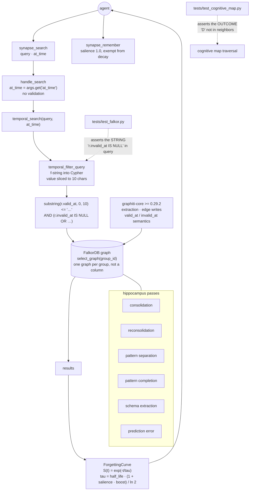

## 1. Executive Summary

Synapse is a small wrapper — 66 files, MIT — that puts a hippocampus-shaped
layer over [graphiti-core](../graphiti/) on FalkorDB, and exposes it to agents
as MCP tools. The temporal knowledge graph the README leads with belongs to the
dependency; what Synapse adds is a forgetting curve, a salience model, a set of
consolidation passes named after hippocampal functions, and a point-in-time
search built around a query-planner workaround.

**One mark: `negative_eval`**, and it is narrow.

The finding worth the page is a contrast inside the test suite.
`tests/test_falkor.py` proves the temporal filter by asserting that the
generated Cypher *contains the string* `r.invalid_at IS NULL` — it builds a
query, never runs one, and never observes an invalidated edge being excluded.
`tests/test_cognitive_map.py`, three files away, asserts on outcomes:
`assert "D" not in neighbors  # 2-hop, beyond depth=1`. The same suite tests a
traversal bound by what comes back and tests the supersession filter by reading
its own SQL.

The second finding is a surface rather than a defect observed in operation. The
point-in-time query is assembled by f-string interpolation, and the value
interpolated is an MCP tool argument the model supplies, declared in the schema
as `{"type": "string", "description": "ISO date (optional)."}` with no format,
no pattern, and no validation at the handler. The only bound is a ten-character
slice.

## 2. Mental Model

Facts are graphiti edges carrying `valid_at` and, once superseded, `invalid_at`.
Synapse reads them back with a temporal filter and layers a strength model on
top: every memory decays on an Ebbinghaus curve whose half-life is stretched by
salience, and recall boosts it again.

`synapse_remember` is the escape hatch — an explicit fact stored *"with maximum
salience (1.0)"*, described in the source as exempt from the forgetting curve:
the agent's curated permanent memories.

## 3. Architecture



## 4. Essential Implementation Paths

**The workaround** — `src/synapse/falkor.py:41-80`. The docstring calls it *"the
substring() workaround"* and the inline comment explains the reason:
*"substring() forces function evaluation before comparison"*, working around a
FalkorDB comparison behaviour. So every temporal comparison is a lexical string
compare over the first ten characters of an ISO timestamp — correct for
ISO-8601 ordering, and date-granular by construction: two facts valid on the
same day cannot be ordered by this filter.

**The interpolation** — the same function. Three interpolation sites:

```python
conditions.append(f"substring(r.valid_at, 0, 10) <= '{valid_at_max[:10]}'")
```

and again for `valid_at_min`, and a third inside the `invalid_at` clause. The
slice bounds each insertion to ten characters.

**The value's origin** — `src/synapse/tools.py:39` declares `at_time` as a plain
string with a prose description, and `:91-94` reads it and passes it on:

```python
at_time = args.get("at_time")
if at_time:
    results = retrieval_engine.temporal_search(query, at_time)
```

No parse, no regex, no `datetime.fromisoformat`. The path from a model's tool
call to a Cypher clause has no validation in it. Nothing was run to test this
and no exploit is claimed; what is checkable from the source is that the only
constraint is the length of the slice.

**The curve** — `src/synapse/hippocampus/forgetting.py`. `S(t) = exp(-t / tau)`
with `tau = base_half_life * (1 + salience * boost) / ln(2)`, a seven-day
default half-life, a salience boost of 3 and a recall boost of 1.5. High-salience
memories decay slower; recall events strengthen them, which is spaced repetition
stated as such.

## 5. Memory Data Model

Not Synapse's. Entities and edges are graphiti's, with `valid_at` for when a
fact held and `invalid_at` set when it is superseded — `consolidation.py:18`
states the convention: *"An edge with `invalid_at` set means the fact was
superseded."* The dependency is declared `graphiti-core[falkordb]>=0.29.2`, a
floating constraint, so the exact semantics behind those fields depend on what
resolves at install time.

Synapse's own state is the salience and strength model layered over what comes
back.

## 6. Retrieval Mechanics

A BM25-style query and a temporal query, both assembled as Cypher strings
against a graph selected by `group_id`. `FalkorHelper.get_graph` calls
`select_graph(group_id)`, so each group is a distinct FalkorDB graph — the
module header says so directly: *"Graphiti stores data in FalkorDB graphs named
after the group_id."*

## 7. Write Mechanics

Writes go through graphiti. `synapse_remember` is the one Synapse-specific
write: maximum salience, exempt from decay.

## 8. Agent Integration

An MCP tool surface — search with an optional `at_time`, and remember — plus a
`plugin.yaml` and Docker files.

## 9. Reliability, Safety, and Trust

**`negative_eval`** — section 10, and narrowly.

**`bitemporal` is withheld and credited to the dependency.** `valid_at` and
`invalid_at` are graphiti's fields, written by graphiti's extraction, and
[graphiti has its own report](../graphiti/). Synapse reads them; it does not
define them, and counting the mark here would make two pages claim one
mechanism. Worth noting separately: on the edges Synapse queries, `created_at`
appears on nodes rather than on the relationships, so the record-time half of
the pair is not what this wrapper's temporal read consults either way.

**`scope_enforced` is withheld.** Isolation is a separate FalkorDB graph per
`group_id`, not a stored key filtered on a read path. The outcome may be
stronger; the mechanism is not the one the mark measures.

**`trust_state` is withheld.** Salience is a float that stretches a decay
constant, and the permanent tier is set by the caller at write time —
`synapse_remember` stores at 1.0 because the agent chose that tool. Nothing
expresses *recorded but not believed*.

**`tombstone`, `audit_log` and `human_review` are withheld.** `invalid_at` marks
a superseded edge and is keyed on the edge; there is no append-only mutation
log; and nothing holds a memory in a state until a person resolves it.

**One surface belongs in this section rather than in a footnote.** A
model-supplied tool argument reaches a Cypher clause through string
interpolation with no validation and a ten-character bound. A reader deploying
this should validate `at_time` before it leaves the handler.

## 10. Tests, Evals, and Benchmarks

A pytest suite of a dozen files. Nothing was installed and nothing was run.

The mark rests on `tests/test_cognitive_map.py`, which asserts outcomes and
includes a bound stated as a must-not:

```python
assert "D" not in neighbors  # 2-hop, beyond depth=1
```

with `assert path == []` for an unreachable pair beside it. Those are
assertions about what a traversal returns.

**The contrast is the finding.** `tests/test_falkor.py` covers the temporal
filter — the mechanism that decides whether a superseded fact is visible — and
every assertion in it is about the query string:

```python
assert "substring(r.valid_at, 0, 10)" in query
assert "r.invalid_at IS NULL" in query
```

with the `include_invalid=True` case asserting the same substring is *absent*.
No graph is populated, no query is executed, and no invalidated edge is ever
observed to be excluded. A refactor that built a correct-looking string and
passed it to nothing would satisfy all three. The suite proves the query was
assembled; it does not prove it filters.

No benchmark and no paper.

## 11. For Your Own Build

### Steal

- **Write down why a workaround exists.** *"substring() forces function
  evaluation before comparison"* is the sentence that stops the next maintainer
  deleting it as noise, and it names a database behaviour rather than a
  superstition.
- **Separate salience from strength.** A decay constant stretched by importance,
  with recall boosting it, keeps "how memorable" and "how recently used" as two
  inputs to one curve rather than one number doing both jobs.

### Avoid

- **Testing a query by its text.** Asserting a clause is present in generated
  SQL proves the generator; only running it against a populated store proves the
  filter. This is the difference between a test of the mechanism and a test of
  the outcome, and the mechanism test passes for the wrong reasons.
- **Interpolating a model-supplied value into a query language.** A ten-character
  slice is a length limit, not a parser. Validate the date at the handler, or
  pass it as a query parameter.
- **A floating dependency constraint for the component that defines your data
  model.** `graphiti-core>=0.29.2` means the semantics of `valid_at` and
  `invalid_at` are whatever installs today.

### Fit

Take the forgetting curve — it is self-contained, tested on outcomes, and
independent of the graph. Take the rest only if you are already running graphiti
on FalkorDB, and validate `at_time` before you deploy it.

## 12. Open Questions

- `at_time` reaches Cypher unvalidated. Is the ten-character slice intended as a
  guard, or as a convenience for callers passing full timestamps?
- The temporal filter is date-granular by construction. Is same-day ordering
  meant to be resolved elsewhere?
- `synapse_remember` writes at maximum salience and is exempt from decay. What
  stops an agent from marking everything permanent?
- The temporal tests assert on the query string. Was an integration test against
  a populated graph intended, and is `test_falkor.py` a stand-in for it?

## Appendix: File Index

| Path | What it holds |
| --- | --- |
| `src/synapse/falkor.py` | `get_graph(group_id)`, and `temporal_filter_query` with the substring workaround and its interpolation |
| `src/synapse/tools.py` | the MCP tool schemas, and the handler that passes `at_time` on unvalidated |
| `src/synapse/retrieval.py` | `temporal_search`, between the handler and the query builder |
| `src/synapse/provider.py` | the graphiti-core wiring |
| `src/synapse/hippocampus/forgetting.py` | the Ebbinghaus curve with salience and recall boosts |
| `tests/test_falkor.py` | the three string-containment assertions about the temporal filter |
| `tests/test_cognitive_map.py` | the outcome assertions the mark rests on |

## Appendix: Recorded Searches

Run from the root of the checkout at the pinned commit.

| Claim | Command | Result at this pin |
| --- | --- | --- |
| The temporal tests assert on the query string | read `tests/test_falkor.py:6-36` | Three tests, all `in query` / `not in query`; no graph is populated and no query executed |
| `at_time` is unvalidated | read `src/synapse/tools.py:39`, `:91-94` | Declared `{"type": "string"}` with a prose description, read with `args.get` and passed straight to `temporal_search` |
| The data model belongs to graphiti | read `pyproject.toml:17-19`; `grep -rn "graphiti" --include='*.py' src` | `graphiti-core[falkordb]>=0.29.2`, imported in `provider.py:85-90`; no edge-write code in this tree |
| Scope is a separate graph, not a column | read `src/synapse/falkor.py:3`, `:37-39` | `select_graph(group_id)`; the module header states graphs are named after the group id |
| No tombstone or audit vocabulary | `grep -rli "tombstone\|audit" --include='*.py' src` | Nothing for either |
| The licence carries no rider | `head -3 LICENSE`; `grep -n -i 'anthropic\|may not' LICENSE` | Stock MIT, no match |

## History

**2026-09-20** — [`64c8b14a6a610a7ce351bd01b70cef1748998803`](https://github.com/Ardha-Eco-System/synapse/commit/64c8b14a6a610a7ce351bd01b70cef1748998803) — first reading, at 66 files. Screened before reading: no auto-run surface, one build-time execution point, one unpinned surface and nothing inside the cooldown; nothing was installed and nothing was run, so the interpolation surface in section 9 is described from the source path rather than from an attempt. MIT. One mark, `negative_eval`, resting on outcome assertions in the cognitive-map tests. `bitemporal` is withheld and credited to [graphiti](../graphiti/), whose `valid_at` and `invalid_at` this wrapper reads and does not define; `scope_enforced` because isolation is a separate FalkorDB graph per group id rather than a filtered key. The project's badges point at `ardhaecosystem/synapse` while the remote is `Ardha-Eco-System/synapse`; the atlas had no report under either name before this one.
