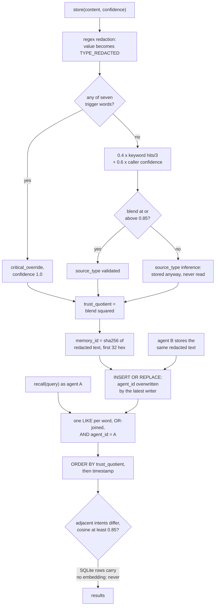

## 1. Executive Summary

Synapse Layer is the open-source Python SDK of a hosted memory service. Its own
memory path is `SynapseMemory`: content is regex-redacted, labelled with an
intent by keyword counts, scored, and saved to an in-process list or, opt-in, a
local SQLite table that recall reads with a word-by-word `LIKE` filtered by
`agent_id`.

What is notable is that the agent key sits inside the SQL on both recall
branches, and a committed test proves it excludes another agent's matching row.
The pipeline also redacts before anything is hashed, stored or logged.

What is weak is the distance between the advertised mechanisms and the code.
Self-healing, the recall router and the plugin strategies are declared and do
not take effect. Recall orders by a trust score that is the square of a
keyword-and-self-report blend. The primary key omits the agent, so another
agent can take a row over. The pgvector store, Trust Quotient and MCP tools the
README describes live in the closed Forge service.

**The repository is open core.** `docs/open-core.mdx` lists the Python SDK and
"MCP Server & Auto-Save Bridge" as Apache-2.0 and the PRO strategies, Forge
dashboard and Trust Quotient weights as proprietary. The link it gives for the
MCP server, `tree/main/mcp-autosave`, names a directory absent at this commit.
The two governance files under `docs/governance/` (in Portuguese) set the rule
that a public file explains a benefit and a private one keeps the mechanism.
This report covers what the tree holds: the SDK, its local backends, the
client for the hosted API, and the tests. The TypeScript SDK directory holds a
README, a `package.json` and a note that its source was never committed
(`sdk-typescript/src/README-SOURCE-GAP.md`).

Two marks: `scope_enforced` on the SQLite read path and `negative_eval` on the
test that pins it. Section 9 names the five withheld.

## 2. Mental Model

A memory is one redacted string. It becomes a stored belief when
`SynapseMemory.store` runs; nothing extracts, merges or waits for review. It
stops being one only when something deletes the row, and `SynapseMemory` has no
method that does.

**Redaction defines identity.** `SynapseSanitizer.sanitize_content` replaces
emails, card numbers, SSNs, CPFs, phone numbers, API keys, bearer tokens, IP
addresses and AWS keys with `[TYPE_REDACTED]`, and the memory id is the first
32 hex characters of the SHA-256 of the result (`synapse_memory/core.py:222-225`;
`synapse_memory/sanitizer.py:202-221`). Two sentences that differ only in a
redacted value become one id, and re-storing the same sentence refreshes the
row instead of adding one.

**Classification is keyword counting, and it sets the score.**
`SynapseValidator.validate_intent` counts substring hits against six keyword
lists, blends `0.4 × min(hits/3, 1)` with `0.6 ×` the caller's own
`confidence`, and labels the row `validated` at 0.85 or above and `inference`
below (`synapse_memory/engine/validator.py:274-313`). Any of seven trigger
words — `emergency`, `critical`, `breach`, `attack`, `exploit`, `vulnerability`,
`ransomware` — short-circuits to `critical_override` with confidence 1.0
(`:247-271`). `_compute_tq` multiplies the confidence by the validation score,
which is the same number, so `trust_quotient` is the blend squared
(`core.py:563-572`; `validator.py:351`). A plain sentence stored at the default
0.9 scores 0.2916; one containing "emergency" scores 1.0.

**The label withholds nothing.** The warning text says a low-confidence memory
is *"stored as 'inference' — may be reclassified"* (`validator.py:309-312`).
No reader filters on `source_type` and no writer reclassifies a stored row.
`ARCHITECTURE.md:43-46` draws a gate where a score below 0.85 asks the user and
can drop the memory; `store` saves it either way.

**Self-healing cannot fire on the persistent path.** During recall, adjacent
results with different intents and embedding cosine at or above 0.85 have the
second relabelled (`core.py:351-380`; `validator.py:365-439`). SQLite rows carry
no embedding column, so the similarity is 0.0 and the branch never runs
(`synapse_memory/backends/sqlite_backend.py:37-54,206-216`). On the in-memory
path the vectors are SHA-256 expansions plus Gaussian noise, not semantic ones
(`core.py:532-561`). The validator's second healing path, `_resolve_ambiguous`,
is guarded by `raw_confidence > 0.0 and best_cat == UNKNOWN`, and
`raw_confidence` is 0.0 whenever the category is `UNKNOWN`
(`validator.py:284-290,324-339`).

## 3. Architecture

Two importable packages: `synapse_memory`, the implementation, and
`synapse_layer`, which re-exports it under the PyPI name
(`synapse_layer/__init__.py:14-24`). Dependencies are `cryptography`,
`pydantic` and `httpx`, with framework adapters behind extras
(`pyproject.toml:38-60`).

`SynapseMemory` takes a backend implementing a five-method protocol — `save`,
`recall`, `delete`, `clear`, `count` (`synapse_memory/backends/interface.py:16-73`).
Three ship:

- **`MemoryBackend`**, the default when no backend is passed: a Python list,
  gone at process exit (`core.py:141-145`; `backends/memory_backend.py`).
- **`SqliteBackend`**: one `memories` table at `.synapse/memories.db` under the
  working directory, WAL mode, a thread-local connection, indexes on
  `agent_id`, `timestamp` and `trust_quotient` (`sqlite_backend.py:35-83`).
- **`ForgeBackend`**: encrypts content client-side with AES-256-GCM and posts
  ciphertext to the hosted `/api/v1/capture`; recall decrypts what the server
  returns (`synapse_memory/backends/forge_backend.py:357-386,474-580`).

Beside them sits `Synapse` in `client.py`, a synchronous HTTP client that sends
plaintext to the hosted `/api/v1/memory/commit` and `/api/v1/sdk/recall`, where
the server encrypts at rest (`synapse_memory/client.py:115-217`). This is the
README's quickstart path.

`SynapseMemory` also keeps a second list, `_memories`, appended on every store
for adapters that read it directly (`core.py:147-149,245-247`). The two copies
diverge as soon as the backend is SQLite: recall reads the file, and every
adapter delete edits the list.

Nothing runs in the background. `AutoSaveEngine` describes an insert with a
null embedding and a job queue for a later backfill, against a
`DatabaseProtocol` (`synapse_memory/autosave/engine.py:54-62,158-277`); the
tree's only implementations of that protocol are test fakes.

### Deployment and ergonomics

`pip install synapse-layer`; the local path needs nothing else running and no
API key. Persistence requires passing `SqliteBackend()` explicitly, and the
default store forgets everything at exit. The SQLite file is plain and
inspectable with any client, though content is the redacted text, so the
original value of anything the regexes matched is gone. The README's own
quickstart, the `Synapse` client and `ForgeBackend` all need an
`sk_connect_` token from the hosted Forge.

## 4. Essential Implementation Paths

**Write.** `SynapseMemory.store` (`core.py:161-290`): sanitize (`:191-197`),
validate (`:200-203`), hash-derived 384-dimension pseudo-embedding (`:208`),
optional differential-privacy noise on it (`:213-219`), id from the content
hash (`:222-225`), `_compute_tq` (`:229`), then `self._backend.save(record)` and
the legacy append (`:245-247`). It returns a `StoreResult` described as an
*"Immutable audit payload"*; nothing persists it (`:41-52`).

**SQLite upsert.** `SqliteBackend.save` runs `INSERT OR REPLACE` on
`memory_id`, rewriting `agent_id`, `trust_quotient`, `source_type`, metadata
and timestamp (`sqlite_backend.py:94-125`). The `embedding` field of the record
is dropped: the schema has no column for it (`:37-54`).

**Recall.** `SynapseMemory.recall` (`core.py:292-394`). For any backend other
than `MemoryBackend` it calls `self._backend.recall(query, agent_id=self.agent_id,
limit=top_k)` and assigns every row relevance 1.0 (`:322-328`). For the default
backend it ignores the backend and scores the legacy list by word-hit ratio
times `trust_quotient` (`:330-345`).

**SQLite query.** `SqliteBackend.recall` splits the query on whitespace, takes
the first ten words, and builds one `content_lower LIKE '%word%'` per word. The
comment above the loop says *"each word must appear"*; the join is `OR`
(`sqlite_backend.py:153-160`). The agent predicate is ANDed on (`:161-163`) and
the order is `trust_quotient DESC, timestamp DESC` (`:165-170`). An empty query
returns the agent's highest-scored rows (`:141-151`).

**Delete.** `SqliteBackend.delete` and `clear` exist (`:176-193`). No method of
`SynapseMemory` calls either (Recorded searches).

**Handover.** `create_handover` packages the legacy list into an HMAC-signed
token held in a per-instance dict (`core.py:398-449`;
`synapse_memory/engine/handover.py:195-207`). `accept_handover` imports into
`_memories` only (`core.py:466-489`), so on the SQLite path the imported
memories never reach recall.

**Hosted client.** `Synapse.store`, `recall` and `list_memories`
(`client.py:115-253`); `ForgeBackend.store` and `recall`
(`forge_backend.py:316-580`).

## 5. Memory Data Model

One table (`sqlite_backend.py:37-54`):

| Column | Meaning |
| --- | --- |
| `memory_id` | Primary key; SHA-256 of the redacted content, first 32 hex |
| `agent_id` | NOT NULL; the constructing caller's string |
| `content`, `content_lower` | Redacted text and its lowercase copy for `LIKE` |
| `trust_quotient`, `confidence` | The blend squared, and the blend |
| `intent`, `is_critical` | Keyword category, and whether it is `critical` |
| `source_type` | `validated`, `inference`, `critical_override` or `handover` |
| `metadata_json`, `timestamp` | Caller metadata; epoch seconds of the last write |

**Scope is one column and not part of the identity.** The schema indexes
`agent_id` but keys on content alone, which is the inverse of the layout in
[scope as a first-class key](../../patterns/scope-as-a-first-class-key/). There
is no user, project or tenant column. The hosted service's `scope: tenant`
option appears only in the manifests (`smithery.yaml:37-41,74-78`).

**One time field.** `timestamp` is overwritten by each upsert, so a re-stored
memory looks new. There is no validity interval, no version and no supersession
link.

**Episodic and semantic are not separated.** Chat messages written by the
LangChain and Semantic Kernel adapters, facts from `store`, and function return
values from the `remember` decorator all land in the same table with an intent
label.

## 6. Retrieval Mechanics

Retrieval on the persistent path is lexical substring matching with no
relevance score. Every row containing any query word as a substring is a candidate,
since nothing filters stop words or one-letter words, and candidates are
ordered by `trust_quotient`
(`sqlite_backend.py:139-170`; `core.py:328`). A query such as "what does the
user prefer" matches every row containing "the", and the order then follows
keyword density and the writer's self-reported confidence, not the question.

**A trigger word wins every tie.** A memory whose text contains "attack" or
"emergency" scores 1.0 and tops every result list it appears in
(`validator.py:247-271`; `core.py:563-572`).

**The recall router is not on any path.** `RecallRouter`, `detect_recall_mode`
and `compute_hybrid_score` implement temporal, priority, semantic and hybrid
routing by keyword (`synapse_memory/router.py:81-127`). Outside tests they
appear only in `router.py` and the package exports.

**Context injection is the `remember` decorator.** It takes the first string
argument as the query, recalls three memories, and appends them after
`"\n\n[Recalled context]:\n"` to that argument (`synapse_memory/wrapper.py:43-54,117-127`).
There is no token budget beyond `top_k`, and a recall failure is swallowed
unless `verbose` is set (`:106-115`).

**LangChain history is a fixed query.** `SynapseChatMessageHistory.messages`
recalls with the literal query `"conversation history messages"`
(`synapse_memory/integrations/langchain_memory.py:139-145`), so on SQLite it
returns only stored messages containing one of those three substrings.

## 7. Write Mechanics

Writes are explicit or decorator-driven, synchronous, and append-or-replace.

- **`store`** runs the full pipeline and upserts. The caller's `confidence`
  carries 60 percent of the blend, so an agent that always passes 1.0 lifts
  every memory it writes (`validator.py:293-297`).
- **`@remember`** stores every non-empty return value of the wrapped function
  by default (`auto_store=True`), so model output becomes memory with no
  review (`wrapper.py:43-54,132-140`).
- **Adapters** write messages, records or documents through `store`
  (`synapse_memory/integrations/*.py`).

**Redaction is the only input filter.** The sanitizer's patterns run before the
hash, the row and the log line. Nothing screens for instructions aimed at a
future reader, and a memory's trust comes from its own wording.

**Delete does not reach SQLite from any adapter.** `SynapseAutoGenMemory.clear`
empties `_memories` (`integrations/autogen_memory.py:227-230`);
`SynapseCrewStorage.delete` and `update` rewrite entries of the same list
(`integrations/crewai_memory.py:200-250`). With `SqliteBackend`, recall reads
the file, so a cleared or deleted memory returns on the next query. The adapter
tests run on the default backend, where the two copies agree.

**Auto-save is a library without a store.** `PolicyEngine` blocks secrets and
PII, requires importance 3 in OSS mode, and accepts only five project names
hard-coded in `synapse_memory/autosave/types.py:26-28` unless the caller passes
`allowed_projects` (`synapse_memory/autosave/policy.py:78,113,134`).
`AutoSaveEngine` resolves an importance scorer, conflict resolver and dedup
strategy from arguments, the PRO plugin or defaults, and `save` calls none of
them (`engine.py:129-154,158-277`).

### Operational cost

Writes block the caller for regex passes, keyword counting, a 384-dimension
hash expansion and one SQLite commit; no model is called. A stored memory is
retrievable on the next query. No background pass touches the store. Injection
is three memories by default, appended to the user's string argument, so it
lands at the end of the prompt.

## 8. Agent Integration

The open SDK is a Python library; the agent sees memory only through whatever
the application or adapter exposes. Adapters cover LangChain chat history,
LlamaIndex retriever and chat store, CrewAI storage, AutoGen memory and
Semantic Kernel chat history and memory store (`synapse_memory/integrations/`).

**The MCP surface in the manifests is the hosted one.** `server.json` and
`smithery.yaml` declare `https://forge.synapselayer.org/api/mcp` with thirteen
tools, including `recall` and `search` whose `scope` argument accepts `tenant`,
described as searching across all agents (`smithery.yaml:74-78,288`). Whether
the server checks that argument against the token cannot be read here.

**The in-tree MCP example does not run as written.** `examples/mcp-secure-memory/server.py`
defines synchronous tools that call `memory.store` and `memory.recall` without
`await`, then read `result.memory_id`, `r.similarity` and `r.self_healed` from
the returned coroutine and from a `RecallResult` that has neither field
(`server.py:76-85,101-113`; `core.py:55-64`). It also uses the default
in-memory backend (`server.py:40-45`). This follows from reading; it was not
run.

**Two classes share one public name.** `synapse_memory.SynapseClient` is
`SynapseMemory` (`synapse_memory/__init__.py:16`), while `client.py` documents
`SynapseClient(token="sk_connect_...")` and aliases it to the HTTP client
(`client.py:9-11,274`). The documented call reaches the local class, which
takes `agent_id`.

**`ForgeBackend` does not compose with `SynapseMemory`.** Its `recall` is a
coroutine and `SynapseMemory.recall` iterates the return value synchronously;
its `save` calls `asyncio.run` from inside the already-running `store`
(`forge_backend.py:474,616-621`; `core.py:323-328,245`). No test constructs the
pair (Recorded searches).

## 9. Reliability, Safety, and Trust

**The scope boundary can be moved by a write.** Agent B storing a sentence
whose redacted form equals one agent A stored replaces A's row and its
`agent_id` (`sqlite_backend.py:108-122`; `core.py:222-225`). A's recall then
filters it out. The read predicate holds; the identity it guards does not
include the scope.

**Provenance is thin.** A row records the agent string, `source_type` and caller
metadata. There is no session, no source message and no history of earlier
values, and an upsert overwrites the timestamp.

**Redaction is the strongest safety property, and it is lossy by design.**
Matched values never reach the row, the hash or the logs, which also means a
memory whose point was the value cannot hold it.

**The client-side-encryption backend leaks the vocabulary.** `ForgeBackend`
sends ciphertext with `zkMode: True` and an `assert` that no `content` key is
present, beside a `searchIndex` holding every distinct lowercase word of the
plaintext after a four-pattern redaction, and an embedding of the plaintext
(`forge_backend.py:357-384,431-446`). Its `delete` and `clear` log a warning and
return `False` and `0` (`:634-642`).

**Handover only works within one object.** The ledger and the signing key are
per `NeuralHandover` instance, and each `SynapseMemory` builds its own
(`core.py:133-136`; `handover.py:195-207,711-716`). The cross-agent test
assigns `agent_b._handover = agent_a._handover` under the comment *"Need to use
the same handover engine"* (`tests/test_core_integration.py:236-239`).

**Uncertainty is representable and unused.** `inference` exists as a stored
value and nothing reads it.

Capability marks:

- `scope_enforced` — awarded. `agent_id` is a NOT NULL column and an SQL
  predicate on both recall branches, and `SynapseMemory` always supplies its
  own non-empty id (`sqlite_backend.py:145-147,161-163`; `core.py:116-117,325`).
  Every other read in the SDK goes to the instance's in-process list, which
  holds only that instance's writes. The write-side takeover above is outside
  what the mark measures.
- `negative_eval` — awarded; section 10.
- `tombstone` — no record of a rejected value. `SynapseMemory` cannot delete,
  and a deleted SQLite row can be re-stored identically.
- `trust_state` — `source_type` holds `validated` and `inference`, and no read
  filters on it; `trust_quotient` is a float used for ordering.
- `bitemporal` — one `timestamp`, overwritten on upsert.
- `audit_log` — `StoreResult` is returned to the caller and not stored; the
  handover ledger is an in-process dict. `ARCHITECTURE.md:54,323` describes an
  immutable audit log that is not in this tree.
- `human_review` — no state waits for anyone; the ARCHITECTURE gate that asks
  the user is not in `store`.

## 10. Tests, Evals, and Benchmarks

Nothing was installed, built or run for this report; everything below is from
reading the tests at the pin. CI runs `pytest` on Python 3.10, 3.11 and 3.12
with every adapter extra installed (`.github/workflows/ci.yml:14-31`).

**The negative case.** `test_recall_with_agent_filter` writes `m1` for `a1`
and `m2` for `a2`, both containing "dark", recalls `"dark"` for `a1`, and
asserts one result whose `agent_id` is `a1` (`tests/test_backends.py:152-159`).
A recall that ignored the predicate would return two rows; one that returned
nothing fails the second assertion.

**SQLite persistence and the backend switch.** `test_persistence` reopens the
file and recalls (`:109-119`). `test_recall_uses_backend_not_legacy` clears
`_memories` and still recalls through SQLite (`:194-208`), which is the same
fact that makes adapter deletes miss the file.

**Tests that assert the wiring, not the effect.**
`TestValidatorSelfHealingUnknown` says it covers the healing branch, feeds
text containing `legal` and `security` — both words in the critical keyword
list — and accepts any of six categories (`tests/test_coverage_boost.py:299-326`).
The plugin tests assert which class `AutoSaveEngine` holds, never that `save`
calls it (`tests/test_plugin_architecture.py:352-356`).

**Clear after a positive control.** `test_clear_removes_all` recalls a stored
memory, clears, and asserts the recall is empty
(`tests/integrations/test_autogen_memory.py:310-321`). After a clear the store
holds nothing, so an empty result also passes; it runs on the default backend.

**Not covered.** No test stores identical content under two agents, deletes
through an adapter over SQLite, or composes `SynapseMemory` with
`ForgeBackend`. No retrieval-quality evaluation exists. `docs/benchmark.md`
links an external comparison page and commits no data. `CITATION.cff` cites the
software; there is no paper.

## 11. For Your Own Build

### Steal

- **Put the scope predicate inside the query, on every branch.** The no-query
  branch is where a filter is most often forgotten; here it carries the same
  clause.
- **Redact before you hash, store or log.** Doing it first means no
  identifier, index or log line ever sees the raw value.
- **Assert the payload invariant at the call site.** An explicit check that the
  plaintext field never reaches the request body turns a privacy promise into
  a crash.

### Avoid

- **Keying a row on content when scope is a column.** Upsert on a content hash
  lets any writer reassign ownership; put the scope in the key.
- **Ordering lexical hits by a confidence the writer supplies.** A blend that
  is 60 percent self-report and ranks ahead of the match makes recall a
  measure of how sure the author sounded.
- **Two copies of the store.** An in-process list kept for adapters beside a
  persistent backend means deletes and edits land in one and reads come from
  the other.
- **Strategies resolved and never invoked.** Injection points tested by
  `isinstance` read as extensibility and do nothing.

### Fit

This suits a reader who wants a few hundred lines to read for a redaction-first
write path and a scoped SQLite query, or who already pays for the hosted Forge
and wants the Python client. As a local memory it is a keyword store with a
ranking that does not depend on the question, no delete on the main class, and
adapters whose delete misses the file. Anyone choosing it for the pgvector
recall, Trust Quotient or MCP tools in the README is choosing the hosted
service, and none of that can be inspected from this repository.

## 12. Open Questions

- Does the hosted MCP `scope: tenant` argument widen beyond the token's own
  tenant, and is it checked server-side?
- What does the Forge server do with the plaintext `searchIndex` and embedding
  that `ForgeBackend` sends beside the ciphertext?
- Is the `mcp-autosave` bridge that `docs/open-core.mdx` links published
  anywhere, and does it implement `DatabaseProtocol`?
- Has the TypeScript SDK's source been recovered, as its gap note plans?

## Appendix: File Index

- **Core and model:** `synapse_memory/core.py`, `synapse_memory/engine/validator.py`,
  `synapse_memory/sanitizer.py`, `synapse_memory/privacy.py`.
- **Storage:** `synapse_memory/backends/interface.py`,
  `synapse_memory/backends/sqlite_backend.py`,
  `synapse_memory/backends/memory_backend.py`,
  `synapse_memory/backends/forge_backend.py`.
- **Hosted client:** `synapse_memory/client.py`, `server.json`, `smithery.yaml`.
- **Retrieval helpers:** `synapse_memory/router.py`, `synapse_memory/wrapper.py`.
- **Auto-save and plugins:** `synapse_memory/autosave/engine.py`,
  `synapse_memory/autosave/policy.py`, `synapse_memory/autosave/types.py`,
  `synapse_memory/plugins/`.
- **Handover:** `synapse_memory/engine/handover.py`.
- **Adapters:** `synapse_memory/integrations/*.py`,
  `examples/mcp-secure-memory/server.py`.
- **Tests:** `tests/test_backends.py`, `tests/test_core_integration.py`,
  `tests/test_coverage_boost.py`, `tests/test_plugin_architecture.py`,
  `tests/integrations/test_autogen_memory.py`.
- **Open-core boundary:** `docs/open-core.mdx`, `docs/governance/`,
  `sdk-typescript/src/README-SOURCE-GAP.md`.

### Recorded searches

Run from the checkout root at the pinned revision.

- `rg -n 'def (delete|forget|clear|update)' synapse_memory/core.py` — no match.
- `rg -n '_backend\.(delete|clear|count)|backend\.(delete|clear)' --type py .` — matches only in `tests/test_backends.py`.
- `rg -n "source_type|is_valid\b|'inference'|\"inference\"" --type py -g '!tests/**' .` — writers in `core.py`, `handover.py` and `sqlite_backend.py`, and a print in `examples/memory_pipeline.py`; no read that filters.
- `rg -n 'embedding' synapse_memory/backends/sqlite_backend.py` — no match.
- `rg -n 'RecallRouter|detect_recall_mode|resolve_recall_mode|compute_hybrid_score' --type py -g '!tests/**'` — `router.py` and the `__init__.py` export only.
- `rg -n 'importance_scorer\.|conflict_resolver\.|dedup_strategy\.|\.resolve\(|\.is_duplicate\(|\.score\(' --type py . | grep -v '^./tests'` — no match.
- `rg -n 'def insert_memory|def enqueue_embedding' .` — the protocol in `autosave/engine.py` and fakes in `tests/test_autosave.py` and `tests/test_plugin_architecture.py`.
- `rg -n 'SynapseMemory\(' tests/test_forge_backend.py` — no match.
- `rg -n -i 'tombstone|audit_log|append.only|valid_from|valid_to|invalid_at|pending_review|approve' --type py .` — only `reason="approved"` strings and test names.
- `ls sdk-typescript/src` — `README-SOURCE-GAP.md` only.
- `grep -rniE 'arxiv|bibtex|@article|@misc|doi\.org' . --exclude-dir=.git` — no match; `CITATION.cff` is a software citation.

## History

**2026-10-03** — [`196733cacd866168a042374364abf9124dbe70bd`](https://github.com/SynapseLayer/synapse-layer/commit/196733cacd866168a042374364abf9124dbe70bd) — first reading, at the head of `main`, a commit dated 18 September 2026. Two marks, `scope_enforced` and `negative_eval`. Screened before reading: two auto-run surfaces (`server.json` and `smithery.yaml`, MCP manifests naming the remote Forge URL with no local command), one build-time execution point (`tests/conftest.py`), no dependency file inside the cooldown although the depth-1 clone dates every file to the tip, and two unpinned surfaces (`pyproject.toml` with no lockfile, the example's `requirements.txt`). No AGENT file was flagged; `skill.md`, `skills/synapse-layer/SKILL.md` and `llms.txt` were read as data. Read with `rg` and `sed`; nothing installed, built or run. The hosted Forge engine is not in the tree and is not covered.
