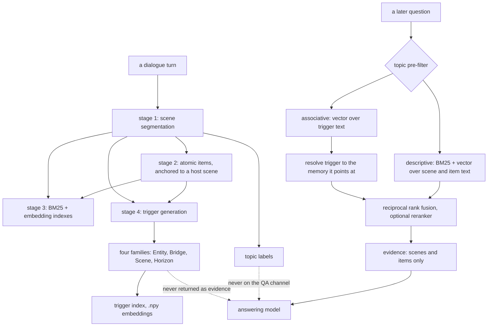

## 1. Executive Summary

T-Mem is the code behind *Memory That Anticipates, Not Archives*
([arXiv:2606.15405](https://arxiv.org/abs/2606.15405), 13 June 2026), accepted
to the EMNLP 2026 Main Conference. MIT, 14,140 lines of Python across 67 files,
with a `CITATION.cff` and a project page.

Its argument is stated sharply enough to test. Long-term memory today is
**reachability-bounded**: a memory can only be found when the query resembles
it, lexically or in embedding space. That covers **descriptive** recall, where
query and memory share surface form, and misses **associative** recall, where
they share none and are connected only by a latent arc — the question that
should surface a memory without quoting any of it.

**The answer is to write down the question, not just the answer.** At write
time T-Mem generates *triggers*: rehearsed queries that a memory ought to be
reachable from. They come at two granularities and four families — Entity and
Bridge over items, Scene and Horizon over scenes, the last carrying channels
named `PERSONAL_ARC` and `AVOIDANCE_HABIT`. The README calls this "the
engineering counterpart of episodic future thinking".

**The commitment that makes it safe is architectural.** Triggers stay *off the
evidence path*: they are indexed and searched, and they are never returned to
the answering model. The README states the principle as decoupling "*how* a
memory is reached from *what* is reached", and it answers the obvious objection
to indexing by generated text — that a model's invented paraphrase becomes
something a later reader mistakes for a record. Here it structurally cannot.

**No capability marks, and the reason is uniform rather than a series of near
misses.** This is a build-once pipeline over a benchmark. Nothing is corrected,
superseded or removed — `def delete`, `def forget` and `def remove` appear
nowhere in the tree. There is no second time axis. `user_id_list` is written on
every scene and item and never consulted on a read. The only `confidence` lives
on a trigger, which is retrieval-only, so it ranks reachability and gates no
belief. A system that never revises is not being penalised for an oversight; it
was built to answer a benchmark, and the questions the marks ask do not arise.

## 2. Mental Model

A turn becomes a memory by being segmented, typed and then *rehearsed*. Stage 1
cuts the dialogue into scenes; stage 2 extracts atomic items anchored to a host
scene; stage 3 builds the lexical and vector indexes; stage 4 generates the
associative triggers. From that point a memory has two independent surfaces: the
text it contains, and the set of questions it was rehearsed to answer.

Nothing ever stops being a memory. There is no expiry, no supersession and no
deletion, so the store is append-only by omission rather than by design — the
pipeline runs once over a fixed corpus and is then queried.

The recall path is hierarchical and type-segregated. Topic labels pre-filter but
never reach the answering model; scenes and items are retrieved at their own
granularity and fused; triggers are searched and then discarded, contributing
only the identity of what they point at.

## 3. Architecture

There is no service. T-Mem is eight numbered stage modules under
`T_mem/main/`, driven by four shell scripts in `scripts/` — `build_memory.sh`
to construct, `eval_locomo.sh` and `eval_locomo_plus.sh` to evaluate,
`download_data.sh` to fetch the corpus. An operator runs stages; nothing runs
between them.

What has to be running is a model provider. `T_mem/llm/` holds three clients —
completion, embedding and reranker — each speaking to a configured endpoint,
and every construction stage is an LLM pass. Nothing is local: with no endpoint
configured, no memory can be built and none queried.

Persistence is files. A memory graph is JSON per conversation, a BM25 index is
a pickle per conversation (`memory_graph_bm25_index_conv_<id>.pkl`), and
trigger embeddings are `.npy`. There is no database, no schema and no
migration.

`T_mem/utils/cost_ledger.py` is worth naming here because it is the piece most
directly reusable outside this design. It appends one JSONL row per *successful
model completion*, is a no-op unless `T_MEM_COST_LOG` points somewhere
writable, and swallows its own exceptions so accounting can never break the
pipeline. Its docstring gives the reason for the granularity: anything coarser
"can be re-aggregated offline from these rows, but the reverse is impossible".

## 4. Essential Implementation Paths

**Segment and extract** — `T_mem/main/stage1_memory_extraction.py`
(`scene_extraction_from_conversation`), `stage2_extraction.py`,
`T_mem/extractors/conv_scene_extractor.py`, `topic_extractor.py`.

**Index** — `stage3_index.py` (`build_item_searchable_text`,
`build_scene_searchable_text`, `build_topic_searchable_text`,
`build_bm25_index_for_single_conv`).

**Rehearse** — `stage4_associative_extract.py` with
`T_mem/prompts/trigger_prompts.py`; the paper-to-code mapping is written into
that file's header (Entity and Bridge are fields of `EntityBridgeTrigger`;
Horizon is `horizon_channels`).

**Retrieve** — `stage6_retrieval.py`, 1,407 lines: `search_with_bm25`,
`search_with_emb`, `reciprocal_rank_fusion`, and the entity-bridge trigger
recaller in `T_mem/retrievers/trigger_recaller.py`.

**Answer and score** — `stage8_qa_locomo.py`, `stage8_qa_locomo_plus.py`,
`benchmark_eval/locomo_plus/judge/run_judge.py`.

## 5. Memory Data Model

Five object types, and the interesting part is which of them may be seen by the
answering model.

| Object | Role | Reaches the answer? |
| --- | --- | --- |
| Scene | a cohesive exchange | yes, as evidence |
| Item | an atomic fact anchored to a host scene | yes, as evidence |
| Topic label | multi-label tag for scope extraction and pre-filtering | no |
| Trigger | a rehearsed query, four families | no |
| Persona | per-speaker standing traits | yes, as ambient context |

A scene and an item each carry `user_id_list` — the speakers involved — and
that is the only identity-shaped field in the model. There is no status column,
no validity interval, no supersession pointer and no deletion marker. `.npy`
and pickle files hold the derived indexes; the JSON graph is the record.

## 6. Retrieval Mechanics

Three passes, fused. Topic labels pre-filter the candidate set. Scene and item
searches then run at their own granularity — `search_with_bm25` and
`search_with_emb` both filter on `doc_type`, which is what keeps the layers
segregated — and the ranked lists are combined by `reciprocal_rank_fusion`,
`1 / (k + rank + 1)` summed per document. An optional reranker narrows what
survives.

The associative arm is the distinctive one. Trigger embeddings are searched
like any other text, and a hit resolves to the item or scene the trigger was
generated for. The trigger itself is dropped. A memory can therefore be reached
by a question that shares no token and no entity with it, which is the regime
the paper says prevailing systems miss.

One detail to know before reusing the fusion. When a document carries no `id`,
`reciprocal_rank_fusion` falls back to `hash(str(doc))`. Python's string hash is
salted per process unless `PYTHONHASHSEED` is fixed, so that fallback identity
is stable within a run and not across runs — fine for fusing inside one query,
not something to persist or compare between processes.

## 7. Write Mechanics

Writes do not block an agent because there is no agent. Construction is a batch
pipeline invoked from a shell script, and every stage is an LLM pass over a
whole corpus: segmentation, item extraction, topic labelling, trigger
generation. The unit of work is a conversation, processed with a semaphore for
concurrency, and stages skip a conversation whose output file already exists —
which is the only incrementality in the design.

Nothing writes during a conversation, and there is no lag to quote because
there is no online path. A memory becomes retrievable when the stage that
indexes it finishes.

No background pass rewrites the store. There is no consolidation, no decay and
no re-extraction; the graph built by stage 4 is the graph queried by stage 6.

## 8. Agent Integration

There is none, and the report should be plain about it: T-Mem is a research
pipeline, not a memory an agent can call. `grep` for `mcp`, `fastapi`, `flask`
and `@app` across the package returns nothing; the only entry points are
`argparse` mains in `T_mem/io/` and the stage-8 QA scripts.

This matters for anyone reading the atlas to choose something. The ideas here
are portable and the code is not a component. Adopting the trigger design means
implementing it inside your own write path, not depending on this package.

## 9. Reliability, Safety, and Trust

**An index file is executable input.** `stage3_index.py:240` writes indexes with
`pickle.dump`, `stage6_retrieval.py:1125` and `:1140` read them with
`pickle.load`, and `T_mem/index/trigger_index.py:311` loads embeddings with
`np.load(path, allow_pickle=True)`. Unpickling runs arbitrary code, so any
process that consumes an index it did not build — a shared artifact, a
downloaded release, a cached directory on a multi-user machine — is executing
whatever produced it. Nothing in the repository signs or validates an index
before loading. For a build-your-own benchmark run this is a non-issue; for
anyone tempted to distribute prebuilt indexes it is the first thing to change.

**Failure is mostly absent rather than handled.** The pickle loads catch
`EOFError` and `UnpicklingError`, which covers a truncated file and not a
malicious one. The cost ledger deliberately swallows every exception so
accounting cannot break a run — correct for accounting, and worth noticing that
it means a silently empty ledger is indistinguishable from a cheap run.

There is no trust state on a memory, no provenance beyond which speakers were
present, and no audit of anything. The single occurrence of the word
*tombstone* is a comment on an in-memory list slot set to `None` during persona
consolidation, and the single occurrence of *audit* is a design note about
appending a replacement chunk rather than popping an anchor.

## 10. Tests, Evals, and Benchmarks

**There is no test file anywhere in the tree** — no `test_*.py`, no `*_test.py`,
no `tests/` directory. CI exists and does not test: `.github/workflows/ci.yml`
installs the package and runs `python -m compileall -q T_mem benchmark_eval
scripts` across Python 3.10, 3.11 and 3.12. That is a syntax check on three
interpreters, which catches a broken import and nothing about behaviour.

The evaluation the project cares about is external. `benchmark_eval/` holds a
LoCoMo harness and an LLM-as-judge, and the paper contributes **LoCoMo-Plus
(Cognitive)**, a subset built to isolate associative recall, with the README
reporting a per-system accuracy drop from LoCoMo to LoCoMo-Plus across seven
systems.

**No result is committed.** The comparison exists as
`assets/figure6_locomo_gap.png`; the repository holds eleven PNGs, five shell
scripts and one JSON — `docs/demo/demo_data.json`, which drives the project
page's pipeline explorer and carries `conversation`, `scenes` and `qa_examples`
rather than scores. So a reader cannot recompute the headline from anything in
the tree, and that matters more than usual here because the benchmark subset is
itself a contribution of the paper: the artifact that would let someone check
the gap is the artifact that is missing.

`negative_eval` is withheld for the simplest possible reason — there is no
committed assertion of any kind to examine.

## 11. Patterns Worth Stealing

### Steal

- **Index a memory by the question it should answer, not only by what it
  says.** This is the whole idea and it is separable from the rest of the
  design. At write time, generate a small number of queries the memory ought to
  be reachable from, and index those alongside the content. It buys reach into
  questions that share no surface form with the record.
- **Keep the generated index text off the evidence path.** The rule that makes
  the first pattern safe. A trigger can be searched, matched and then must be
  discarded, contributing only the identity of what it points at. Any design
  that lets a model's invented paraphrase come back as a retrieved record has
  built a machine for laundering invention into memory.
- **Separate the reaching granularity from the returning granularity.** Scenes
  and items are searched at their own level and never merged into one
  undifferentiated pool, so a precise fact and the exchange that produced it
  compete on their own terms rather than by length.
- **Log cost at the finest granularity you can, and say why.** One JSONL row
  per successful completion, on the stated ground that coarser aggregation is
  recoverable and finer detail is not. Two lines of reasoning in a docstring
  that settle a question most projects re-litigate.

### Avoid

- **`pickle` as an index format.** It makes every consumer of an index execute
  its producer. A JSON or `.npz` index with an explicit schema costs little and
  removes the class entirely.
- **`hash()` on a string as a fallback identity.** Salted per process, so it is
  not comparable across runs. If a document may lack an id, mint a content
  hash.
- **A CI job that compiles.** It reads as coverage in a badge and asserts
  nothing about behaviour. Better to have no CI than one that implies testing.
- **Publishing a benchmark subset without committing the result.** The subset
  is the contribution; the numbers are what let a reader check it.

### Fit

This suits someone building their own memory who wants the trigger idea, not
someone shopping for a component. There is no API, no server and no package
boundary to depend on — the value is a design you reimplement inside your own
write path, and the code is worth reading as the reference for how the four
families are prompted.

It does not suit production use as it stands, and the gap is not
polish. A memory that cannot be corrected, superseded or deleted is a research
instrument: the benchmark never asks it to be wrong. Anyone taking triggers into
a system that must revise will have to answer a question this code does not —
what happens to a memory's rehearsed queries when the memory itself turns out to
be false, since the triggers that reach it were generated from a claim that no
longer holds.

## 12. Antipatterns / Risks

- **Index files are unpickled without validation**, so consuming an index is
  executing its producer.
- **Nothing can be corrected or removed.** No delete, forget or supersede path
  exists, so a wrong extraction is permanent for the life of the store.
- **No tests at all**, and a CI job whose only assertion is that the sources
  compile.
- **The contributed benchmark subset ships no committed result**, so its
  headline cannot be recomputed from the repository.
- **Thirteen unpinned requirements and no lockfile**, so a build resolves
  whatever the index offers that day.
- **`user_id_list` looks like scope and is not.** It is written on every scene
  and item and consulted by no read, which is exactly the shape that gets
  mistaken for a tenancy boundary by a later reader.

## 13. Build-vs-Borrow Takeaways

Borrow the idea, read the prompts, write your own. The trigger design is the
contribution and `T_mem/prompts/trigger_prompts.py` is the most useful file in
the repository — it carries the paper-to-code mapping in its header and shows
how each family is elicited. Reimplementing the write-time rehearsal inside an
existing memory is a bounded change: generate, index separately, and refuse to
return.

What you cannot borrow is an operating memory. There is no incremental write,
no correction, no scoping and no interface, so anything built on this package
directly would be building on a benchmark harness.

## 14. Open Questions

- **What happens to triggers when their memory is corrected?** The design has
  no revision path, so the question is unforced here and becomes the first one
  to answer in any system that adopts it: rehearsed queries generated from a
  claim outlive the claim.
- **How many triggers per memory, and at what cost?** The count is
  configurable (`trigger_count` in the prompt builder) and the cost ledger
  exists to measure it, but no committed run reports the trade between reach
  and token spend.
- **Does the associative arm help when the descriptive arm already succeeds?**
  The reported gap is between benchmarks rather than between arms on the same
  question set; whether triggers ever displace a correct descriptive hit is not
  something the repository settles.
- **Is `user_id_list` intended as a future scope key?** It is populated
  faithfully through extraction and topic aggregation and read by nothing.

## 15. Appendix: File Index

| Path | What it holds |
| --- | --- |
| `T_mem/main/stage6_retrieval.py` | 1,407 lines; BM25, embedding search, RRF, trigger expansion |
| `T_mem/main/stage4_associative_extract.py` | trigger generation, the paper's contribution |
| `T_mem/prompts/trigger_prompts.py` | the four families, with the paper-to-code mapping in the header |
| `T_mem/main/stage3_index.py` | searchable-text builders and the pickle index writer |
| `T_mem/retrievers/trigger_recaller.py` | the entity-bridge recall path |
| `T_mem/index/trigger_index.py` | trigger embeddings, loaded with `allow_pickle=True` |
| `T_mem/persona/profile_memory.py` | per-speaker standing traits |
| `T_mem/utils/cost_ledger.py` | per-completion JSONL cost accounting |
| `benchmark_eval/locomo_plus/judge/run_judge.py` | the LLM-as-judge for the contributed subset |
| `.github/workflows/ci.yml` | install and `compileall` on three Python versions |

### Recorded searches

Checked against the checkout at the pinned revision.

- `grep -rE "def delete|def forget|def remove" --include="*.py" .` — no match; there is no removal path.
- `grep -rE "valid_from|valid_until|as_of" --include="*.py" .` — no match; one time axis.
- `grep -rn "user_id_list" --include="*.py" .` — written in stage 1 and aggregated in `topic_extractor.py`; it appears in no read predicate.
- `find . -name "test_*.py" -o -name "*_test.py" -o -type d -name tests` — no match anywhere in the tree.
- Every file not ending `.py`, `.md`, `.png`, `.jpg`, `.svg` was listed: one JSON (`docs/demo/demo_data.json`), five shell scripts, four YAML, `requirements.txt`, `pyproject.toml`, `LICENSE`, `CITATION.cff`. No result or score file.
- `grep -rniE "mcp|fastapi|flask|@app" --include="*.py" T_mem/` — no match; the only entry points are `argparse` mains.

## History

**2026-09-21** — [`dd9e1527bc75908485809580c9520af5a9a42879`](https://github.com/Sherlockwz/T-Mem/commit/dd9e1527bc75908485809580c9520af5a9a42879) — first reading, at the head of the default branch. Screened before anything was read: no auto-running configuration, no build-time execution point, no `.gitattributes` and no `.gitmodules`, and two unpinned surfaces — `pyproject.toml` with no lockfile beside it and thirteen requirements specified with `>=`. Nothing was installed and nothing was run, so the reported accuracies are the paper's and are not reproduced here. The paper was checked rather than assumed: [arXiv:2606.15405](https://arxiv.org/abs/2606.15405) resolves to *T-Mem: Memory That Anticipates, Not Archives*, published 13 June 2026, which is the title and identifier the README and `CITATION.cff` claim. No capability marks.
