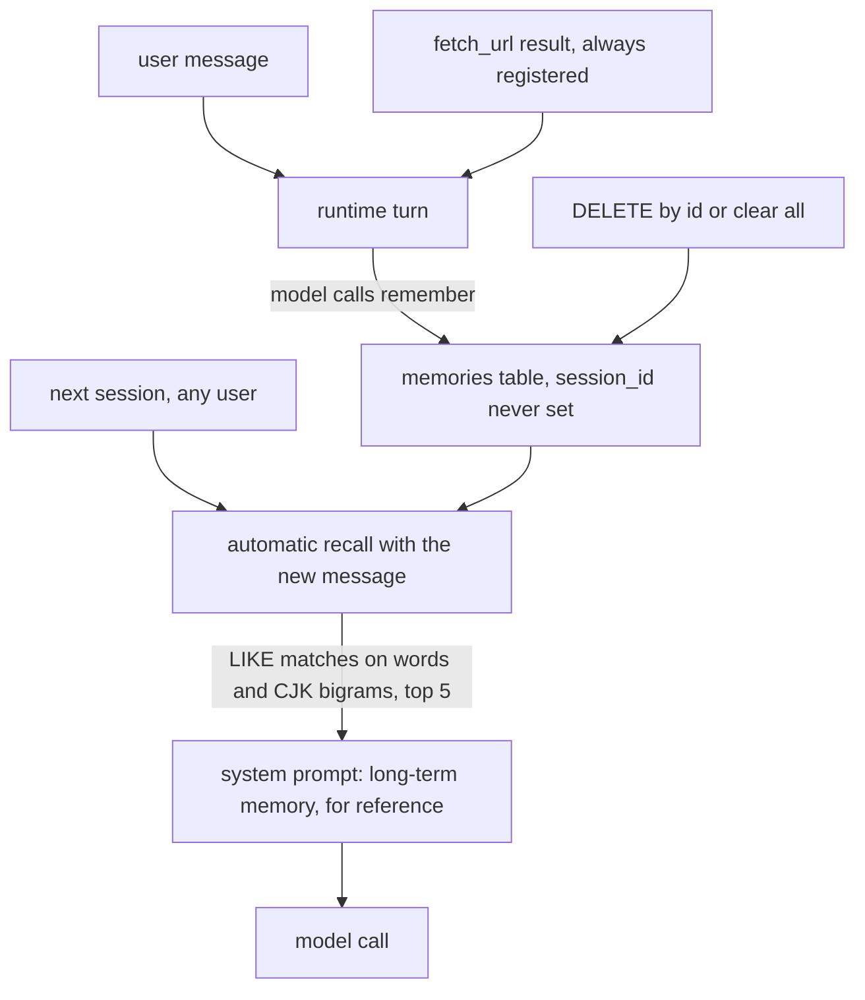

## 1. Executive Summary

AgentOS is a Python agent platform — FastAPI, a tool-calling runtime, planning, delegation to sub-agents, local file and shell tools behind a sandbox, and web tools — published by one author in fourteen commits, all on 11 September 2026, as version 0.1, which its README calls the engineering base. MIT-licensed. It is unrelated to openEuler's AgentOS.

Its long-term memory is 204 lines: one SQLite table, a `remember` tool the model calls, a `recall` tool, and an automatic recall that runs once at the start of each run and places the matches in the system prompt for every model call in it. Retrieval is keyword matching, and the module says so in its first paragraph — no embeddings, no model call, a known cost in recall for paraphrase and cross-language queries. Chinese queries are split into overlapping two-character bigrams, because, as the code notes, SQLite's built-in FTS5 tokenizer does not recall two-character Chinese words.

It carries none of the atlas's seven marks, and the one that matters is the absence of scope — which is a stated design, not an oversight. The module's opening table contrasts short-term memory, scoped to one `session_id`, with long-term memory, *shared across sessions*; the `session_id` column on a long-term row is provenance, the `remember` tool never sets it, and no query reads it. So every memory the model writes in any session is recalled into every other. Together with three defaults — long-term memory on, automatic recall on, and `fetch_url` always registered — that makes the store a path from any web page the agent reads into the system prompt of every later conversation. Whether a given model will write what a page tells it to is a question about the model. Nothing in the tree stands in the way.

## 2. Mental Model

A fact becomes a memory when the model decides to call `remember` with it. From then on it is recalled into any conversation whose words overlap with it, until someone deletes it by id or clears the store. There is no state between written and deleted, no check on who wrote it or from what, and no boundary around which conversations can see it.



## 3. Architecture

One FastAPI process with the runtime in it. `api/app.py` builds the `LongTermMemory` when `memory.long_term_enabled` is true — the default — and passes it both to the tool registry, which adds `remember` and `recall`, and to the runtime, which uses it for automatic recall. The database lives at `.agentos/memory.db` relative to the working directory unless configured. Short-term memory is separate and in-process: `runtime/memory.py` keeps each session's history in an LRU with turn-based truncation that keeps tool-call pairs together.

## 4. Essential Implementation Paths

- **Write.** `RememberTool.run` (`src/agentos/runtime/memory_tools.py:36-38`) calls `LongTermMemory.remember(content)` with no session id. `remember` (`long_term_memory.py:125-147`) strips, truncates to 4,000 characters, refuses an empty string, and inserts. There is no deduplication: the same sentence remembered twice is two rows.
- **Recall.** `recall` (`:149-178`) extracts terms — lowercased English words of two or more characters, and for each run of Chinese characters the run itself plus its bigrams — and scores each row as the sum of the lengths of the terms it contains, by `lower(content) LIKE %term%`, returning rows with a positive score, best first, then newest.
- **Automatic recall.** Once per run, `AgentRuntime._recall_long_term` (`src/agentos/runtime/runtime.py:397-408`, called at `:232`) recalls with the incoming message and, if anything matches, formats it under a *long-term memory — historical records relevant to the current question, for reference* header; `_rebuild_system_prompt` places that same text after the base prompt and before the current plan on every model call of the run (`:263`).
- **Delete.** `forget(id)` and `clear()` run `DELETE`; the REST routes in `api/routes/memories.py` expose list, create and delete.

## 5. Memory Data Model

`memories(id INTEGER PRIMARY KEY, content TEXT NOT NULL, session_id TEXT, created_at TEXT NOT NULL)`, indexed on `created_at`. That is the whole model: no type, no source, no confidence, no status, no owner.

## 6. Retrieval Mechanics

Keyword only, and scored by the length of what matched rather than by frequency, so a query that shares one long word with a memory outranks one that shares two short ones. The limit defaults to five and is capped at twenty. Because matching is substring, a two-letter English term matches inside longer words, and every Chinese bigram of a long query is a separate term, which raises recall at the price of precision. The substring approach avoids FTS5's tokenizer and pays for it with a full scan per query; at the scale a v0.1 single-process service reaches, that is not yet a cost.

## 7. Write Mechanics

A `remember` call blocks for one SQLite insert and is retrievable immediately through the `recall` tool. The automatic recall picks it up at the start of the next run, because it recalls once per run rather than per model call. No background process rewrites or consolidates anything.

## 8. Agent Integration

The model sees `remember` and `recall` as ordinary tools beside `fetch_url`, `web_search` when a key is configured, sandboxed local file and shell tools, planning tools, and `delegate_to_agent`. The memory is also injected without the model asking, through the automatic recall. There is no MCP surface and no SDK.

## 9. Reliability, Safety, and Trust

**No scope, by design.** The module documents long-term memory as shared across sessions. The `session_id` column is never populated by the tool and is not used in any `WHERE` clause, and there is no user, tenant or agent key, so every session — and every user of a shared deployment — reads the same memories. For one person on one machine that is the intended behaviour; it is the reason the store is unsafe for anything else.

**The write is the model's, and the read is automatic.** A memory written because a user stated a preference and a memory written because a fetched page contained an instruction are indistinguishable rows, and both are recalled into the system prompt by default under a header that asks the model to use them *for reference*. The `fetch_url` tool has an SSRF guard for where it may connect; nothing guards what it brings back from reaching `remember`.

**Deletion is final and unrecorded.** `forget` and `clear` remove rows with no history, and nothing prevents the model from writing the same content again.

## 10. Tests, Evals, and Benchmarks

Fourteen test files, 3,642 lines, for the whole platform; no CI configuration is committed. I did not run them.

`tests/test_long_term_memory.py` covers term extraction for English and Chinese, write, truncation, listing order, forget and clear, persistence across instances, recall of short Chinese and English queries, the limit, length-weighted ranking, empty queries, the two tools, automatic injection into the system prompt with and without a base prompt, its absence when disabled, and the REST routes. `tests/test_memory.py` covers the short-term session store thoroughly, including truncation that does not split a tool-call pair.

The one negative case is `test_recall_returns_empty_for_unrelated_query`, which asserts `recall(...) == []`. A retriever that returned nothing for every query would pass it, so it does not establish that anything specific was kept out of a populated result, and `negative_eval` is withheld. No test writes memories in two sessions and asserts either one's isolation, which is consistent with there being none.

## 11. For Your Own Build

### Steal

- **CJK bigrams when FTS5 will not tokenise Chinese.** A run of Chinese characters plus its overlapping pairs, matched as substrings, is a small, dependency-free way to make keyword recall work for Chinese, and the module states its limits honestly.

### Avoid

- **A global memory the model writes and every session reads by default.** Scope the store before turning automatic recall on, and record where each memory came from so recall can treat a user's statement and a tool result differently.
- **Recalled memory in the system prompt without framing.** Mark it as data the model should weigh, not instruction it should follow.

### Fit

A readable starting point for a single-user, local experiment with agent memory, and a clear illustration of why scope comes first. Not something to run for more than one person, or with web access, until the store is scoped and recall is framed.

## 12. Open Questions

- Whether the planned evaluation module, listed in the README as not yet started, will include isolation or poisoning cases for the long-term store.

## Appendix: File Index

- Long-term memory: `src/agentos/runtime/long_term_memory.py`; tools: `src/agentos/runtime/memory_tools.py`.
- Automatic recall and prompt assembly: `src/agentos/runtime/runtime.py`.
- Short-term session memory: `src/agentos/runtime/memory.py`.
- Wiring and defaults: `src/agentos/api/app.py`, `src/agentos/runtime/builtin_tools.py`, `src/agentos/core/config.py`.
- Tests: `tests/test_long_term_memory.py`, `tests/test_memory.py`.

**Searches recorded for the negative claims**

```sh
rg -n "session_id" src/agentos/runtime/long_term_memory.py src/agentos/runtime/memory_tools.py   # written on insert and selected, never in a WHERE; the tool passes none
rg -n "user_id|tenant|owner" src/agentos/runtime/long_term_memory.py                               # 0: no scope key
rg -n "UPDATE memories|tombstone|history" src/agentos/runtime/long_term_memory.py                  # 0: no edit and no record of deletion
ls .github                                                                                         # absent: no CI
```

## History

**2026-09-11** — [`cea6420c92bda3331d99ee68de4e96c1a2d61e7c`](https://github.com/Tanglies/AgentOS/commit/cea6420c92bda3331d99ee68de4e96c1a2d61e7c) — first reading. Screened with `scripts/screen_repo.py`: two editor-configuration findings, `.vscode/settings.json` enabling pytest discovery and `.vscode/tasks.json` defining six manual tasks, none set to run on folder open; one `conftest.py`; one manifest inside the seven-day cooldown and one unpinned surface; an `AGENTS.md` of project conventions for coding assistants, read as data. The folder was not opened in an editor, and nothing was installed or run.
