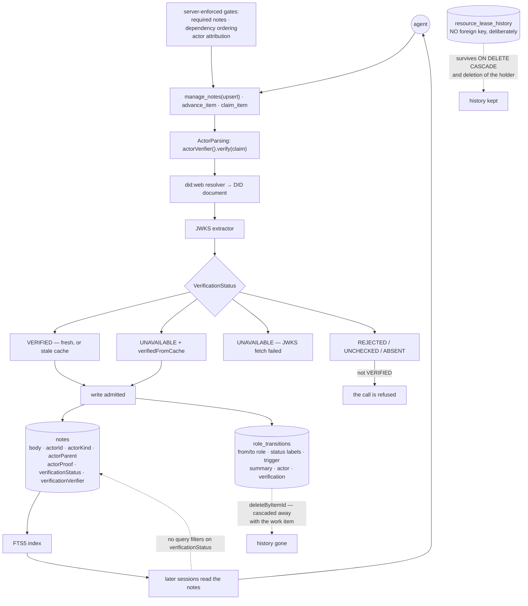

## 1. Executive Summary

Task Orchestrator is an MCP server giving agents a persistent work-item graph —
items, notes, dependencies, role transitions — with the rules enforced at the
tool boundary rather than in a prompt. Its own framing is the clearest summary:
*"Prompt-based frameworks hope the LLM follows instructions. This one blocks the
call if it doesn't."* MIT, Kotlin, 523 files.

It earns a place here because its notes are durable agent-authored content,
full-text indexed and read back across sessions, and because of what it does to
them on the way in.

**One mark: `negative_eval`.** Three mechanisms that look like more are worth
reading for exactly where they stop.

**An actor claim is cryptographically verified.** `ActorParsing.kt:96` calls
`context.actorVerifier().verify(claim)`, and the verifier resolves a `did:web`
document, extracts its JWKS and checks the proof. The result is a five-value
`VerificationStatus` — `ABSENT`, `UNCHECKED`, `VERIFIED`, `REJECTED`,
`UNAVAILABLE` — stored on the note and on the transition.

**It gates the write and never the read.** The ladder at `ActorParsing.kt:112-161`
distinguishes a fresh verification from a stale-cache one from a JWKS fetch that
failed, and refuses the call when the status is not `VERIFIED`. Nothing filters
a query on it afterwards: a note recorded `REJECTED` comes back like any other.

**And one audit table outlives its subject while the other does not.**
`ResourceLeaseHistoryTable` deliberately carries no foreign key so it survives
`ON DELETE CASCADE` *and* deletion of the holder itself. `RoleTransitionsTable`,
which records the state changes of the work items, is removed with them by
`deleteByItemId`.

## 2. Mental Model

Work items hold notes; notes are what an agent writes down and a later agent
reads. Every transition between roles is recorded with who caused it and what
the server made of their identity. The gates — required notes, dependency
ordering, actor attribution — live in the tool handlers, so an agent that does
not comply gets an error rather than a silently accepted call.

## 3. Architecture

## 4. Essential Implementation Paths

**The verification ladder** — `ActorParsing.kt:112-161`. Three documented
outcomes in order: `VERIFIED`, whether fresh or from a stale cache;
`UNAVAILABLE` carrying `metadata["verifiedFromCache"] == "true"`; and
`UNAVAILABLE` without that flag, meaning the JWKS could not be fetched at all.
`:143` computes `isVerified = verification.status == VerificationStatus.VERIFIED`
and `:129` records that anything else *"the caller must surface... as an"*
error. Distinguishing "I verified this earlier and cannot re-check now" from "I
have never been able to check" is the distinction most implementations skip.

**Where the verdict lands** — `SQLiteNoteRepository.kt:103-105` and `:119-121`,
writing `actorProof`, `verificationStatus` and `verificationVerifier` onto the
row, and `SQLiteRoleTransitionRepository.kt:51` doing the same for a transition.

**Where it does not** — nothing. A search of the main source for
`verificationStatus` outside the schema, the repositories and the parsing ladder
returns only `ActorParsing`'s own admission decision. No read path narrows on it.

**The two histories** —
`ResourceLeaseHistoryTable.kt:12-15`: *"Deliberately carries NO foreign key on
holderItemId to WorkItemsTable... this table is an audit trail that must survive
both `ON DELETE CASCADE` of the live ResourceLeasesTable rows and deletion of
the holder work item itself, so holderItemId may reference a work item that no
longer exists."* Its interval semantics are equally explicit: one row per hold
interval, a same-holder TTL refresh extends the open row in place, and stealing
an expired lease closes the prior interval with `release_reason = "expired"`
before opening a new one.

`SQLiteRoleTransitionRepository.kt:121-123` is the contrast:
`deleteByItemId` issues `RoleTransitionsTable.deleteWhere { itemId eq itemId }`.

**The attribution hook** — `claude-plugins/task-orchestrator/hooks/enforce-actor-attribution.mjs`
is a PreToolUse hook that, when `actor_authentication` is enabled, *"blocks
advance_item and manage_notes(upsert) calls that are missing an actor object"* —
a client-side pre-check in front of the server-side verification, not a
substitute for it.

## 5. Memory Data Model

`work_items`, `notes` with an FTS5 index, `dependencies`, `role_transitions`,
`resource_leases` and `resource_lease_history`. A note carries its body, an
actor claim — id, kind, parent, proof — and the server's verification of that
claim. There is no supersession pointer, no validity window and no status the
note itself can hold beyond the verification verdict.

## 6. Retrieval Mechanics

Full-text search over notes, plus graph traversal across dependencies. Neither
consults the verification verdict.

## 7. Write Mechanics

A write is refused unless the actor verifies, unless the required notes for a
transition exist, and unless the dependency ordering permits it. Schemas are
opt-in: *"Without schemas, all 14 tools work in schema-free mode — no gates, no
required notes."*

## 8. Agent Integration

Fourteen MCP tools, plus a Claude plugin carrying hooks for actor attribution,
plan capture, and a retrospective trigger with a marker, a cooldown and a Stop
backstop.

## 9. Reliability, Safety, and Trust

**`negative_eval`** — section 10.

**`trust_state` is withheld, and this is the finding.** The vocabulary is right:
five discrete values on the row including `REJECTED`, derived from a
cryptographic check rather than claimed. It gates admission and nothing else. A
note stored when verification was `UNAVAILABLE` is indistinguishable, at every
read path, from one stored `VERIFIED` — the field is present in the result and
absent from every predicate. The rubric asks for a state that withholds a memory
from being treated as true; this one decides whether the memory is written.

**`human_review` is withheld.** The verification establishes *who wrote* a note,
not that anyone else approved it. There is no state a note waits in and no
second actor who resolves it. The identity work is real and it is authorship
attestation rather than review.

**`audit_log` is withheld, on the contrast inside the codebase.**
`role_transitions` is never updated and records every state change with its
actor and verification — and `deleteByItemId` removes an item's entire history
with the item. The table beside it, `resource_lease_history`, was deliberately
denormalised so that exact thing could not happen to it. When one project has
written both, the second is the standard the first is being measured against.

**`tombstone`, `bitemporal` and `scope_enforced` are withheld.** No rejected
value is recorded against content, there is one clock, and the boundary is a
project root rather than a key filtered on a read.

## 10. Tests, Evals, and Benchmarks

A substantial Kotlin suite plus JavaScript hook tests. Nothing was installed and
nothing was run.

The mark rests on cases that assert refusals and non-effects:

- `DidVerificationIntegrationTest.kt:434` —
  *"Expected REJECTED: loose-kid must not apply to multi-key DID documents
  (single-key guard)"*. A relaxed key-id match is asserted **not** to apply when
  the DID document holds more than one key, which is the case where relaxing it
  would let the wrong key verify.
- `IdempotencyToolsTest.kt:427` — *"Cached call must not create a duplicate
  dependency"*.
- `:682` — *"Without actor, requestId must not enable caching"*: the idempotency
  cache is asserted inert when there is no actor to key it to.
- `:838` — *"Repository must not be called — validation rejected before
  execution"*, which asserts the absence of a side effect rather than the
  presence of an error.

The last is the shape worth copying: checking that the repository was never
reached proves the rejection happened *before* anything could be written, which
an error-code assertion alone does not.

No benchmark and no paper.

## 11. For Your Own Build

### Steal

- **Distinguish "verified from a stale cache" from "could not verify at all."**
  Collapsing both into a failure makes an offline moment look like an attack;
  collapsing both into success makes an attack look like an offline moment.
- **Assert that the repository was not called.** An error assertion proves the
  caller was told no; a never-reached assertion proves nothing was written.
- **Build the audit trail so it survives the deletion of its subject.** The
  lease-history table's missing foreign key is three lines of decision and a
  paragraph of rationale, and it is why that history answers questions after an
  incident.
- **Put the gates in the tool handler.** A required note that `advance_item`
  checks is a rule; the same sentence in a prompt is a hope.

### Avoid

- **Storing a verdict you never read.** Five verification states land on every
  note and no query mentions them. The check is doing work at admission, and the
  column is doing none afterwards.
- **Two history tables with opposite deletion semantics.** One survives its
  subject by design and one is cascaded away; a reader who finds the second
  first will assume the first behaves the same way.

### Fit

Take it if several agents share a work graph and you want the ordering and the
documentation requirements enforced where they cannot be talked out of. The
actor verification is worth having on its own, and worth extending to the read
path if you intend to trust what the notes say.

## 12. Open Questions

- A note's verification verdict is stored and never filtered on. Is a
  verified-only read mode intended, or is admission considered sufficient?
- `role_transitions` is deleted with its work item while the lease history is
  built to outlive its holder. Is the difference deliberate?
- Schemas are opt-in and without them there are *"no gates, no required notes."*
  What fraction of installs runs with them, and is the ungated default the one
  most agents meet?
- The retrospective machinery has a marker, a cooldown and a Stop backstop. Is
  anything written down as a result, or is the retrospective only triggered?

## Appendix: File Index

| Path | What it holds |
| --- | --- |
| `current/src/main/kotlin/.../tools/ActorParsing.kt` | the verification call and the three-outcome ladder |
| `.../infrastructure/config/JwksActorVerifier.kt`, `DidWebResolver.kt`, `DidDocumentJwksExtractor.kt` | did:web resolution to a JWKS and the proof check |
| `.../database/schema/ResourceLeaseHistoryTable.kt` | the audit trail with no foreign key, and why |
| `.../database/schema/RoleTransitionsTable.kt` | the transition record, its actor columns and verification columns |
| `.../repository/SQLiteRoleTransitionRepository.kt` | `create`, the finders, and `deleteByItemId` |
| `.../repository/SQLiteNoteRepository.kt` | where the verdict is written onto a note |
| `claude-plugins/task-orchestrator/hooks/enforce-actor-attribution.mjs` | the client-side pre-check |
| `current/src/test/.../DidVerificationIntegrationTest.kt` | the single-key guard case |

## Appendix: Recorded Searches

Run from the root of the checkout at the pinned commit.

| Claim | Command | Result at this pin |
| --- | --- | --- |
| The actor claim is really verified, not just stored | `grep -rn "\.verify(" --include='*.kt' current/src/main` | `ActorParsing.kt:96` calls `context.actorVerifier().verify(claim)`; `JwksActorVerifier` implements it over a did:web-resolved JWKS. A first pass that looked only at the repositories saw `actorProof` being persisted and would have reported it unverified |
| No read path filters on the verdict | `grep -rn "verificationStatus" --include='*.kt' current/src/main` excluding the schema, the repositories' row mapping and `VerificationResult.kt` | Only `ActorParsing`'s own admission ladder |
| The two history tables differ on deletion | read `ResourceLeaseHistoryTable.kt:12-15`; `grep -n "deleteWhere" .../SQLiteRoleTransitionRepository.kt` | The first deliberately carries no foreign key so it survives; the second is deleted by `deleteByItemId` at `:123` |
| Transitions are never updated | `grep -rn "RoleTransitionsTable" --include='*.kt' current/src/main \| grep -i update` | Nothing; the repository exposes `create`, three finders and the delete |
| The gates are opt-in | read `README.md:287` | *"Without schemas, all 14 tools work in schema-free mode — no gates, no required notes"* |
| The licence carries no rider | `head -3 LICENSE`; `grep -n -i 'anthropic\|may not' LICENSE` | Stock MIT, no match |

## History

**2026-09-20** — [`9f2287166059d541b2627c8193b54e47fc03b102`](https://github.com/jpicklyk/task-orchestrator/commit/9f2287166059d541b2627c8193b54e47fc03b102) — first reading, at 523 files. Screened before reading; nothing was installed, built or run. MIT. One mark, `negative_eval`. It is included here rather than excluded as workflow tooling because its notes are durable agent-authored content, full-text indexed and read back across sessions. `trust_state` is withheld although a five-value verification verdict sits on every note, because it gates the write and no read consults it; `human_review` because verification establishes authorship rather than approval; and `audit_log` on a contrast the codebase makes with itself — one history table is deliberately built to survive deletion of its subject and the one recording work-item transitions is cascaded away with it. One claim was checked and inverted before publication: the repositories persist an `actorProof` straight from the caller's object, which reads as an unverified claim until the parsing layer shows a did:web JWKS check standing in front of them.
