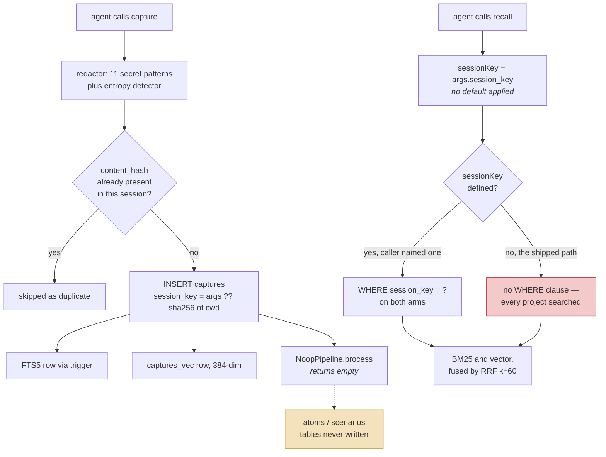

## 1. Executive Summary

tdai-memory-mcp is an MIT-licensed MCP memory server for coding agents — 7,081
lines of TypeScript over SQLite, with FTS5 for BM25, `sqlite-vec` for embeddings,
and `@huggingface/transformers` running all-MiniLM-L6-v2 locally. Its own
`server.json` describes it accurately: *"Local-first MCP memory server for coding
agents. No API key, no cloud."* That claim holds — nothing here calls a hosted
model, for storage or for retrieval.

**The repository was created on 10 August 2026 and this report reads it the same
day, at its seventeenth commit.** Everything below describes a tree hours old,
including a schema migration landed the same afternoon. That is not a criticism;
it is the fact a reader needs before weighing any of it.

The engineering is tidier than the age suggests. The schema declares its version
and migrates idempotently. FTS5 is an external-content table kept in sync by
three triggers. Content is redacted for secrets *before* it is stored, not on the
way out. `forget` refuses to act without `confirm: true`. RRF is implemented with
k=60 and attributed in a comment to
[TencentDB Agent Memory](../tencentdb-agent-memory/), which is itself in this
atlas — one of the few cases here of a project borrowing a mechanism from another
project the atlas has read, and saying so in the code.

Two findings are worth the report.

**The upper memory layers are declared and empty.** `schema.sql` creates an
`atoms` table for L1 facts with a `confidence` column and a `scenarios` table for
L2 blocks, each commented "populated by … pipeline, phase 2". The only class
implementing `PipelineStage` is `NoopPipeline`, whose docstring says "It does
nothing. It stores L0 data only", and no statement anywhere in `src/` or `tests/`
inserts into either table. What ships is a well-built L0 store under a schema
describing a three-layer one.

**The session key is stamped on every write and dropped on every read.**
`handleCapture` computes `args.session_key ?? defaultSessionKey()`, so every
capture lands scoped to `sha256(cwd).slice(0,16)`. `handleRecall`, in the same
file, reads `args.session_key as string | undefined` with no fallback, and the
storage layer guards its filter with `if (sessionKey)`. So a `recall` that does
not name a session searches every project on the machine — while the tool's own
JSON schema tells the model *"The session key. The default is hash(cwd)."*

The strongest thing here and the weakest thing here are the same mechanism seen
from two ends, which is what makes it worth reading.

## 2. Mental Model

A memory is **a capture**: one row of text an agent chose to write down, typed
(`decision`, `learning`, and others), tagged, hashed, and stamped with a session
and an agent. There is no extraction, no summarisation and no inference — what
the agent passed to `capture` is what the store holds, minus any secrets the
redactor found.

The schema describes a three-level distillation and the code implements one
level:

| Level | Table | State |
| --- | --- | --- |
| L0 | `captures` | written on every `capture` call |
| L1 | `atoms` — `fact`, `confidence` | table created, never written |
| L2 | `scenarios` — `atom_ids`, `summary`, `persona_tags` | table created, never written |

So the epistemic state machine is one state wide. A memory is captured and it
exists; it is retrieved by search; it is destroyed by `forget` with a confirm.
There is no candidate state, no verification, no supersession and no expiry, and
the one field that would carry doubt — `atoms.confidence` — sits on a table
nothing populates.

The interesting question in a store this flat is not how something becomes
believed, since everything is equally believed the moment it is written. It is
**which memories a query can reach**, and that is decided entirely by whether the
caller named a scope.



The two shaded boxes are the report. One is a schema promising a mechanism that
does not exist; the other is a mechanism that exists and is bypassed by the only
caller that ships.

## 3. Architecture

A single **stdio MCP server**, run as one Node process per agent, with all state
in one SQLite file. There is no daemon, no service and no network dependency at
run time — `LocalEmbedder` loads all-MiniLM-L6-v2 through
`@huggingface/transformers` and computes 384-dimension vectors in process.

`src/index.ts` wires it: `loadConfig`, `SQLiteBackend`, `LocalEmbedder`,
`NoopPipeline`, `AuditLogger`, then `createServer` over
`StdioServerTransport`. `src/server.ts` holds every tool handler.

There is a **second, unwired copy of the tool layer**. `src/tools/recall.ts`,
`capture.ts`, `search.ts`, `forget.ts` and `format.ts` each register handlers
against an MCP server, and nothing in `src/index.ts` or `src/sdk.ts` imports
them; the live handlers are the `handle*` functions in `src/server.ts`. Both
copies exist, both are plausible, and they can drift. On the finding in section 4
they happen to agree — `src/tools/recall.ts` also passes `args.session_key`
through without a default — which is worth stating because it means the defect is
not an artifact of reading the wrong file.

Alongside the server: `hooks.ts` writes `SessionStart` and `Stop` entries into
`~/.claude/settings.json` and `~/.config/devin/config.json`, each running
`npx -y tdai-memory-mcp <subcommand>`; `backup.ts`, `export.ts`, `import.ts`,
`stats.ts`, `viewer.ts` and `install-skill.ts` are CLI subcommands beside the
server.

### Deployment and ergonomics

Genuinely nothing to stand up, and no key. One npx invocation, one SQLite file,
and the embedding model downloads on first use — which is the one hidden cost, a
model fetch on a cold start rather than an API key.

The store is a SQLite database, so it is inspectable with any client and
repairable by hand, and `export.ts` writes a JSON dump. `db-detection.test.ts`
covers the migration paths, including an old database with no `schema_version`
table, and `backup.ts` takes a copy before migrating — a discipline plenty of
older projects in this atlas lack.

## 4. Essential Implementation Paths

**Capture.** `handleCapture` in `src/server.ts` computes
`const sessionKey = args.session_key ?? defaultSessionKey()`, redacts the
content, hashes it, checks `findByContentHash(contentHash, sessionKey)` for a
duplicate within the session, inserts the row, and runs the pipeline — which
returns `{}`. `detectAgentId()` supplies `agent_id`.

**Redaction, before storage.** `security/redactor.ts` carries eleven regexes —
OpenAI `sk-`, Anthropic `sk-ant-`, GitHub `ghp_` / `gho_` / `github_pat_`, Slack
`xox[baprs]-`, AWS `AKIA`, a 40-character base64 secret with lookaround
boundaries, PEM private key blocks, Google `AIza`, and `Bearer` tokens — plus a
high-entropy scan over runs of 40 or more base64 characters. Matches become
`[REDACTED]` in the stored text. Putting this on the write path rather than the
read path is the right choice: a secret that never enters the database cannot
leak from a backup, an export or a future query.

**Retrieval.** `SQLiteBackend.search` runs `bm25Search` and `vectorSearch` at
`limit * 2` each and fuses with `rrfMerge`. Both arms append
`AND c.session_key = ?` when a session key is present and
`AND c.agent_id = ?` when `filters.agentId` is present. `utils/rrf.ts` sorts each
list, scores `1 / (60 + rank)`, and sums — a textbook RRF, credited to TencentDB
Agent Memory in its header.

**The gap.** `handleRecall`:

```ts
const query = args.query as string;
const sessionKey = args.session_key as string | undefined;
```

and then `storage.search(args.query, queryEmbedding, { sessionKey, ... })`. There
is no `?? defaultSessionKey()`, and `sqlite.ts` treats `undefined` as *no
filter*, not as *this project*. The tool schema advertised to the model says the
default is `hash(cwd)`. The write path applies that default; the read path
documents it and does not.

Three consequences follow, and they differ in severity. A model that omits
`session_key` — the obvious call, since the parameter is optional and the
description implies a sensible default — retrieves decisions and learnings from
every repository the user has ever run the server in. `search` shares the
handler shape. And the failure is silent in the direction that matters: extra
results look like good recall.

**Deletion.** `handleForget` refuses without `confirm: true`, returning an error
that says so. With it, `storage.delete(id)` runs `DELETE FROM atoms WHERE
capture_id = ?`, a `LIKE` sweep over `scenarios`, `DELETE FROM captures`, and
`DELETE FROM captures_vec`, with FTS5 cleaned by the `captures_ad` trigger.
Deletion reaches every copy, which is more than several systems in this atlas
manage. Nothing records that the value was rejected.

**Audit.** `security/audit.ts` writes one `audit_log` row per tool call: `ts`,
`tool`, `args_hash`, `result_len`, `quota_hit`, `redacted`.

## 5. Memory Data Model

`captures` is the whole live model: `id` (ULID), `session_key`, `agent_id`,
`type`, `content`, `content_hash`, `tags`, `created_at`, `metadata`. Indexes on
`(session_key, created_at DESC)`, `(agent_id, created_at DESC)` and
`content_hash`.

**Two scope keys are stored and both are honoured on read when supplied**, which
is more scope machinery than most single-user tools carry. `session_key`
partitions by project directory; `agent_id` records which agent wrote the row and
is filterable through `filters.agent_id`. Neither is a security boundary —
everything is one file readable by one user — and neither is presented as one.

**Temporal fields are `created_at` only.** No validity interval, no updated-at,
no supersession pointer. A correction is a new capture plus a `forget`, and
nothing links the two.

**Provenance is the capturing agent and nothing else.** There is no record of the
prompt, the turn or the reason.

`content_hash` deserves a note: it arrived in the v1→v2 migration on the day this
was read, with a backfill, and it is used for duplicate suppression scoped to the
session. Dedup keyed on exact content is weak — two phrasings of one decision are
two rows — but it is honest about what it is.

## 6. Retrieval Mechanics

Three modes on one code path: `hybrid` (default), `keyword`, `vector`.

The BM25 arm queries the FTS5 external-content table. The vector arm queries
`captures_vec` by distance. `rrfMerge` sorts each list, converts position to
`1 / (60 + rank)` and sums, so the two arms never have to have comparable score
distributions — the property the
[hybrid retrieval fusion](../../patterns/hybrid-retrieval-fusion/) page argues
for.

Two failure modes are worth naming.

**The vector arm degrades silently.** If `embedder.embed` throws, the handler
logs to stderr and continues with `queryEmbedding = null`, which yields
keyword-only results. The response carries no indication that a channel dropped
out. This is the same shape the fusion pattern page records for Helm, and the
same fix applies: if a channel can degrade, the result should say which channel
ran.

**Over-recall is the default.** Section 4's finding is a retrieval failure before
it is anything else. Without a session filter, `limit` is applied to a candidate
set drawn from every project, so a query about "the auth decision" ranks this
project's answer against every other project's, and RRF has no signal that would
prefer the local one — no recency weighting, no scope boost, nothing.

Token budgeting is real and bounded: `enforceQuota` estimates tokens, truncates
at `max_tokens` (default 4,000, capped at 8,000) and appends a hint, and the
truncation is recorded in `audit_log.quota_hit`.

## 7. Write Mechanics

Writes are **synchronous, agent-initiated and cheap**. `capture` is a tool the
model calls deliberately; there is no background extraction, no hot-path model
call, and no consolidation pass. The lag before a memory is retrievable is zero.

`NoopPipeline` is the entire distillation story at this commit. The interface is
built for more — `PipelineStage` declares `requiresLLM`, and `Atom` and
`Scenario` types exist — but the shipped stage returns `{}` and the two upper
tables stay empty. A reader evaluating this against its schema should assume L0
and only L0.

Deduplication is exact-hash within a session. Conflict handling does not exist,
because nothing ever updates a row: `captures` has no update path outside the
FTS-sync trigger.

Agent-generated content and user-quoted content are stored identically. The
redactor is the only filter on the way in, and it looks for secrets, not for
injected instructions.

### Operational cost

Nothing blocks on a model. The write path is a redaction pass, a hash, an
embedding computed locally, and two inserts. The read path is two SQLite queries
and a local embedding of the query string.

No pass ever re-reads or rewrites the store. The context cost is bounded by
`max_tokens` per recall, and the `SessionStart` hook injects recent memory at the
top of a session — which is the placement most likely to be prefix-cache friendly
and also the placement that makes an unscoped default most damaging, since the
injection happens before the model has said anything.

## 8. Agent Integration

Six MCP tools: `recall`, `capture`, `search`, `forget`, `handoff`, `adr`. Two are
worth separating from the rest — `adr` writes an architecture decision record
with structured metadata and an `adr` tag and refuses duplicates, and `handoff`
exists to be prompted at the end of a session by the `Stop` hook.

`hooks.ts` writes those hooks into the user's own agent configuration:
`SessionStart` runs `hook-recall` to inject recent memory into context, and
`Stop` runs `hook-stop` to remind the agent to call `handoff`. Editing
`~/.claude/settings.json` and `~/.config/devin/config.json` on a user's machine
is a strong default for a memory server to take, and it is at least done openly
in a file whose whole job is that.

The model has full agency: it decides what to capture, when to recall, and
whether to name a session.

## 9. Reliability, Safety, and Trust

**Redaction before storage** is the standout, and the pattern list is specific
enough to be checkable rather than gestural.

**Deletion gated on an explicit confirm**, then reaching all four tables plus the
FTS index, is a better delete than most of this corpus.

**A backup before migration**, and a migration path tested against a database
with no version table at all.

Against those:

**The scope default is the defect and it is a quiet one.** Nothing errors,
nothing warns, and the symptom is more results rather than fewer. A user running
this across several client repositories would find one project's decisions
answering another project's questions, and would most likely read that as the
memory being unhelpful rather than as a bug.

**No trust state, and a `confidence` column stranded on an unwritten table.**

**No tombstone.** `forget` removes rows and nothing prevents the same content
being captured again, though with no extraction pass the re-assertion would have
to come from the agent rather than from a background job — a materially smaller
hole than in systems that re-extract from retained transcripts.

**The audit log records that a tool ran, not what changed.** `args_hash` is a
hash, so the log answers "was `forget` called at 14:02" and cannot answer "what
did it delete". That is a usage log rather than a mutation record, and it is why
the append-only audit mark is withheld here.

**No multi-tenancy and none claimed.** One file, one user.

## 10. Tests, Evals, and Benchmarks

**No paper**, no `CITATION.cff`, and none implied.

21 test files — 4 unit, 8 integration, 1 smoke, and the rest fixtures — covering
tokenisation, quota, RRF fusion, redaction (both directions, including *"does not
redact normal text"* and *"does not redact normal long text"*), the ADR tool,
export/import, artifact handling, and database detection and migration.
**I did not run them.** Both manifests changed the same day, inside the seven-day
cooldown, so nothing was installed.

`tests/integration/full-flow.test.ts` carries the case that earns this report's
only mark: **`isolates memory by session key`** captures a decision to
`project-a` and another to `project-b`, recalls each, and asserts exactly one
result apiece whose content names only that project. That is a committed
assertion that particular material must *not* be retrieved, and it is the right
test to have written.

**It also cannot catch the defect, and the reason is structural.** The test does
not call `handleRecall`. The file defines its own `recall` helper, and that
helper reads:

```ts
sessionKey: args.sessionKey ?? "test-session",
```

It applies a default the shipped handler does not. So the suite exercises
`SQLiteBackend.search` with a session key always present — the branch that works
— and never exercises the branch the MCP tool actually takes. A test harness that
reimplements its caller tests the storage layer and certifies the wiring by
implication; here the wiring is where the bug is. That is the transferable lesson
and it is worth more than the finding itself: **integration tests should enter
through the same door as production.**

The `scope_enforced` mark is withheld on the same reasoning. The filter is real,
indexed and tested, and it is conditional on an argument the only shipped caller
never supplies — so on the path that runs, no scope filter is applied at all.
The mark measures the read path as callers reach it, and this one is reached with
`undefined`.

Before trusting this: a test that calls the server's own `recall` handler with no
`session_key` and asserts another session's content is absent; an assertion that
a degraded vector arm is visible in the response; and a `forget`-then-recapture
case, so the absence of a tombstone is at least characterised.

## 11. For Your Own Build

### Steal

**Redact on the way in, not on the way out.** Eleven patterns and an entropy
check, applied before the row is written, mean the secret is absent from the
database, the FTS index, the vector table, the export file and the backup. A
redactor on the read path leaves all five holding the credential.

**Refuse a destructive tool without an explicit confirm argument, and say so in
the error.** `forget` returns *"Set confirm to true to execute the deletion. The
tool did not delete anything."* The model gets the instruction and the state in
one string, and a mis-generated call is a no-op rather than a loss.

**Back up before you migrate, and test the no-version-table case.** The migration
suite covers a fresh database, a current one, and an old one with no
`schema_version` table — which is the shape every project acquires the first time
it adds versioning after the fact.

**Attribute a borrowed mechanism in the file that borrows it.** The RRF module
and the pipeline interface both name TencentDB Agent Memory and link it. It costs
two lines and it tells the next reader where the design came from and what to
compare it against.

### Avoid

**Documenting a default in the schema and applying it in only one handler.** The
tool description that reaches the model says the session key defaults to
`hash(cwd)`; the write path implements that and the read path does not. Where a
default decides which data a query can see, it belongs below both handlers — in
the storage layer, or in one helper both call — not typed twice at the edge where
one copy can be forgotten.

**Treating a missing scope argument as "no filter" rather than "the default
scope".** `if (sessionKey)` is the line that turns an omitted parameter into a
cross-tenant read. A store that has a scope key should require one, or supply
one; interpreting absence as *everything* is the widest possible reading of an
argument the caller simply did not type.

**Writing integration tests against a reimplementation of your own caller.** A
helper that fills in a default the real handler omits will pass forever and prove
nothing about the code that ships. Enter through the same entry point production
uses, even when it is more awkward to set up — especially then.

**Shipping a schema for layers you have not built.** `atoms` and `scenarios`
exist with types, indexes and a `confidence` column, and nothing writes them. A
reader who checks the schema concludes there is a distillation pipeline; a reader
who checks `PipelineStage` implementations finds `NoopPipeline`. If the layers
are planned, the comment saying "phase 2" is right and the tables can wait.

### Fit

Right for one developer who wants durable decisions and learnings across sessions
of a coding agent, on one machine, with no account and no key — and who will pass
`session_key` explicitly, or work in one repository, until the read-path default
is fixed. In that shape the redaction, the confirm-gated delete, the local
embeddings and the SQLite file are a sound and unusually complete package for the
size.

Wrong for anyone consulting across several clients' repositories from one
machine, which is the exact case the session key was designed for and the exact
case the default breaks. Wrong too as a base for a memory *product*: there is no
distillation, no trust state, no correction that survives, and the audit log
records calls rather than changes.

Weigh the age honestly. Seventeen commits on the day of first publication is not
a maturity signal in either direction — the code is better structured than most
first-week repositories, and none of it has been exercised by anyone but its
author.

## 12. Open Questions

- Is the missing `?? defaultSessionKey()` in `handleRecall` intentional — an
  opt-in to cross-project search — or an omission? The tool description argues
  for the second, and nothing in the repository argues for the first.
- Which tool layer is meant to survive, `src/server.ts` or `src/tools/`? Both
  implement the same six tools and only one is wired.
- What is `detectAgentId()` reading, and what does it return when no agent is
  identifiable? The value is stored on every row and filterable on every query.
- Is the L1/L2 pipeline in progress somewhere, or is the schema aspirational?
  "Phase 2" appears in the schema comments and nowhere else.
- Does the `SessionStart` hook's injected recall pass a session key? The hook
  handler was not traced, and it is the one caller where an unscoped default
  would reach the model unprompted.

## Appendix: File Index

**Schema and storage**
- `src/storage/schema.sql` — captures, atoms, scenarios, audit_log, FTS5 and vec0 virtual tables, three sync triggers
- `src/storage/sqlite.ts` — `search`, `bm25Search`, `vectorSearch`, `delete`, `deleteByFilter`, `findByContentHash`
- `src/storage/types.ts`

**Server and tools**
- `src/server.ts` — the six live handlers, `defaultSessionKey`, `handleCapture`, `handleRecall`, `handleForget`
- `src/index.ts` — wiring
- `src/tools/recall.ts`, `capture.ts`, `search.ts`, `forget.ts`, `format.ts` — the unwired second copy

**Retrieval**
- `src/utils/rrf.ts` — `rrfMerge`, k=60
- `src/embedding/local.ts` — all-MiniLM-L6-v2 in process
- `src/utils/tokenize.ts`

**Security**
- `src/security/redactor.ts` — eleven patterns plus the entropy scan
- `src/security/quota.ts` — `enforceQuota`
- `src/security/audit.ts` — the tool-call log

**Integration and operations**
- `src/hooks.ts`, `src/hook-handlers.ts` — SessionStart and Stop wiring
- `src/backup.ts`, `src/export.ts`, `src/import.ts`, `src/stats.ts`, `src/viewer.ts`, `src/install-skill.ts`
- `skills/tdai-memory/SKILL.md`

**Tests**
- `tests/integration/full-flow.test.ts` — `isolates memory by session key`, and the helper that supplies the default
- `tests/unit/redactor.test.ts`, `rrf.test.ts`, `quota.test.ts`, `tokenize.test.ts`
- `tests/integration/db-detection.test.ts` — migration and backup paths

## History

**2026-08-10** — [`281180e76bdf927ecebad33b23779328aec545ed`](https://github.com/tinhien11/tdai-memory-mcp/commit/281180e76bdf927ecebad33b23779328aec545ed)
— first reading, at the seventeenth commit of a repository created the same day.
Screened before reading: 1 auto-run surface (`server.json`, an MCP registry
manifest declaring an npm identifier and a stdio transport), 1 build-time exec
(`prepublishOnly: npm run build`), 11 floating ranges with a lockfile beside
them, and both manifests changed the same day — inside the seven-day cooldown,
so nothing was installed and nothing was executed.
