## 1. Executive Summary

teamai-cli is Tencent's tool for making *"every team AI native"*: a CLI that
keeps a team's skills, rules, agents, hooks, MCP servers, docs and knowledge
in a git repository and installs them into ten coding agents on every member's
machine. MIT; 608 commits between 3 March and 6 September 2026 by thirty
authors; version 0.22.0; 60,131 lines of TypeScript under `src/` beside
53,348 lines of tests in 215 files holding 2,724 cases. The screen found no
auto-run surface, two manifests inside the seven-day cooldown, one build-time
execution path and an `AGENTS.md` and `CLAUDE.md` treated as data; nothing was
installed or run, and the read was made from a full clone. The README's
product table names three layers — execution, context, improvement — and the
memory is the second and third: *recall, learnings, codebase graph, teamwiki*
and *friction-based share-learnings, sessions, digest, dashboard*.

A learning is a Markdown document. The share-learnings skill tells the model
to write one with `title`, `author`, `date` and `tags` in its frontmatter and
the body in Chinese, and `teamai contribute` writes it to `learnings/` in an
isolated worktree, commits and pushes it as a merge request
(`src/contribute.ts:100-200`); a reviewer merges, and the next `teamai pull`
on every member's machine rebuilds the search index (`src/pull.ts:687-760`).
The index is built by hand (`src/utils/search-index.ts:509-560`): frontmatter
parsed (`:241-280`), title tokens at three times IDF, tags at two, body at
one, a length normalisation, a domain weight, and a rule that a body-only
match is noise unless the entry is a doc (`:683-760`). Votes add to the score:
a per-user YAML of recalled and upvoted counts, aggregated at 0.3 per recall
and 1.0 per upvote (`:298-317`), synced to the repository at Stop
(`src/hook-handlers.ts:265-300`) — and an upvote is counted only for a
document the session's transcript shows was recalled, *"to avoid crediting
hallucinated/distractor doc-ids."* A confidence per document —
`base·0.4 + recency·0.3 + ratio·0.3` (`src/maintenance/confidence.ts:25-45`) —
drives `recall maintenance --prune`, which removes or archives a learning
under 0.15, and `recall promote`, which rewrites one that clears 0.90, five
upvotes, two contributors and fourteen days into a skill, rule or doc.

The model reaches this through a subagent. `teamai pull` injects a managed
block into each agent's instructions (`src/pull.ts:1036-1125`) that says the
model *"SHOULD invoke the `teamai-recall` subagent"* before a task involving
code changes, debugging or design, with four skip conditions, and deploys
`agents/teamai-recall.md`, which runs `teamai recall --check` for a verdict of
`RELEVANT` or `NOT_RELEVANT` with the threshold and the matched and missing
terms, stops on the second, and otherwise runs the search and returns a
compact summary with document ids. The changelog's unreleased section removes
what preceded it: an `auto-recall` hook that searched the knowledge base
after every shell, grep and web call *"passively, implicitly."*

Three marks: `scope_enforced` for recall's project-first, opt-in-user index
selection; `negative_eval` for the ten-case isolation suite that asserts the
other scope's title absent beside the active scope's title present; and
`human_review` for `teamai review` over a queue of machine-written codebase
sections and for the merge request in front of every learning. Two findings
sit against the design. **Supersession is unwired.** The merge-request
importer computes which session learnings a new draft supersedes by keyword
overlap and warns about them (`src/import-mr.ts:218-247`); the `supersedes`
field on `LearningDraft` (`src/types.ts:1495-1502`) is read by nothing else in
the tree. **Forgetting does not propagate.** A user-scope pull copies the
repository's `learnings/` over `~/.teamai/learnings/` with overwrite and no
removal (`src/pull.ts:709-724`), so a learning the maintainer pruned or
archived stays in every user-scope member's copy and in the index built from
it.

## 2. Mental Model

A belief is a document a person or a model wrote after a session and a
reviewer merged. It enters through friction: the Stop hook scores the session
by interruptions, retries and denied tool calls (`src/contribute-check.ts:251-330`),
and above a threshold prints a reminder naming the signals and the task, the
model summarises what it learned into the required shape, and `contribute`
pushes a merge request. It also enters from a merged change the importer
turns into a draft, and from a wiki page or a codebase scan the AI CLI
writes.

It is *used* when the model asks. The instructions say it should ask before
a task that changes code, the subagent asks for a verdict first, and a
`RELEVANT` verdict means *"reading files is worth the cost"* and not that the
knowledge covers the subject. Every recall increments a recalled count on the
documents returned; at task completion the model declares which documents it
consulted, and only those the transcript shows were recalled become upvotes.
Those counts become the vote score in ranking and the confidence in
maintenance.

It stops being used by a person's command. `maintenance --prune` finds
documents under the confidence threshold or inactive for a long time with a
low score, and removes them or moves them to `_archive/`, a directory the
flat collector does not read. `promote` rewrites a mature document into a
skill, rule or doc. The importer's supersession is a warning. And a member on
user scope keeps every document ever copied to their home directory until
they delete it themselves.

```mermaid
%% caption: a session's friction prompts a learning; the model writes it and contribute pushes a merge request; pull indexes it by title, tags and body with votes added; the model reaches it through a subagent told to ask first; recalls and transcript-verified upvotes become confidence; prune archives or removes below a threshold, promotion rewrites above it, and supersession is computed and written to nothing
flowchart LR
    F["Stop hook — friction score<br/>interrupts, retries, denials"] -->|"reminder to share"| M["model writes a Markdown learning<br/>title, author, date, tags"]
    M -->|"teamai contribute — branch, merge request"| R[("team repo — learnings/, votes/, docs, rules, skills")]
    R -->|"reviewer merges; teamai pull on SessionStart"| I[("search-index.json — title ×3, tags ×2, body ×1, IDF, votes")]
    I -->|"teamai-recall subagent — --check verdict, then search"| A["agent"]
    A -->|"recalled count; upvote only if the transcript shows it was recalled"| V[("votes/<user>.yaml")]
    V --> C["confidence = base·0.4 + recency·0.3 + ratio·0.3"]
    C -->|"prune under 0.15 — remove or _archive/"| X["out of the repo index"]
    C -->|"promote at 0.90, 5 upvotes, 2 authors, 14 days — AI rewrite"| S["skill, rule or doc"]
    MR["merge-request importer"] -.->|"supersedes list — logged, consumed by nothing"| R
    R -.->|"user-scope pull copies, never removes"| U[("~/.teamai/learnings/ — keeps what the repo dropped")]
```



## 3. Architecture

A Node CLI, `teamai`, with a `src/` of about a hundred modules. The team
repository is the store: `learnings/`, `docs/`, `rules/`, `skills/`,
`agents/`, `votes/`, `docs/team-codebase/`, a `teamai.yaml` with roles, tags
and sharing settings, and in *self mode* — where the business repository is
the team repository — a `teamai-reports` orphan branch that holds votes and
reports through an isolated worktree so the working tree is never touched.
`pull.ts` (1,563 lines) refreshes the checkout, installs resources into each
agent's directories under a role's namespaces, syncs learnings, rebuilds the
index, injects the recall block and deploys the built-in subagent; `push.ts`
and `team-push.ts` send local resources up through a branch and merge
request; `hooks.ts` (1,081 lines) installs and reconciles one `hook-dispatch`
command into each agent's settings for SessionStart, UserPromptSubmit,
PreToolUse, PostToolUse and Stop (`:480-483`), and `hook-handlers.ts:428-462`
maps events to handlers — pull, dashboard report, merge-request and package
hints and the local agent on session start; update, votes sync, contribute
check, report and local agent on stop; usage tracking and a TodoWrite hint on
tool use; pending hints and slash tracking on prompt submit. An HTTP
*local-agent* backend delivers resources per session for teams without a
repository. Model calls go through `src/utils/ai-client.ts:141-199`, which
spawns a locally installed AI CLI and parses its output, for the codebase
wiki, the wiki import, quality drafts and promotion.

### Deployment and ergonomics

`npm install -g teamai-cli`, then `teamai init <repo>` — project scope by
default since the unreleased changelog, installing under `<cwd>/.teamai/` and
the agents' project directories, or `--scope user` under the home directory.
After that every session start pulls. The cost is a git operation per session
and a handler chain per hook event; recall costs an index scan in Node and
whatever the subagent reads. Nothing needs a model except the wiki, the
import, the quality drafts and promotion, which need an AI CLI on the path.

## 4. Essential Implementation Paths

- **Contribute.** `contribute` (`src/contribute.ts:100-200`) validates the
  file, names it from the title with a date and a hash, writes it to
  `learnings/` in an isolated worktree, records a pending learning so a
  failed push retries on the next pull, and pushes a branch as a merge
  request; the share skill supplies the document shape.
- **Index.** `buildIndex` (`search-index.ts:509-560`) aggregates votes, then
  collects learnings from a flat directory (`:436-450`), docs recursively,
  rules and skills; `parseLearningDoc` (`:241-280`) reads frontmatter;
  `search` (`:683-760`) scores as described with `isRelevantScore`
  (`recall.ts:76`) deciding the verdict against an IDF baseline (`:106`).
- **Recall.** `recall` (`recall.ts:342-430`) loads the project index, adds the
  user index on `inheritUserScope`, dedups by type and filename with the
  project winning, formats results with sources, records quality
  (`recall-quality.ts:92-131`) and auto-upvotes the recalled documents'
  recalled count (`:234`) for the active scope only.
- **Vote.** `votes-sync` (`hook-handlers.ts:265-300`) parses the transcript
  for `teamai:referenced-doc-ids` comments and the recalled set, upvotes the
  intersection, and syncs deltas to the repository or the reports branch
  (`votes.ts:156-181`); `recallFeedback` (`:182`) is the manual up or down.
- **Maintain.** `findPruneCandidates` (`maintenance/prune.ts:31-81`) flags
  confidence under the threshold or long inactivity with a low score;
  `executePrune` (`:87-113`) removes or copies to `_archive/` and removes;
  `writeBackConfidence` writes the number to frontmatter;
  `findPromotionCandidates` and `executePromotion` (`promote.ts:33`, `:152`)
  rewrite through the AI CLI.
- **Review.** `--require-review` on an import (`index.ts:819`,
  `import.ts:64-65`, `:227`) makes `iwiki-dual.ts:300-330` append each
  AI-written section to `pending-review.jsonl` with `inferRisk`
  (`review-store.ts:71-75`); `review-cmd.ts:160-235` lists, shows, applies
  under `--max-risk`, or rejects by removal; `applyOne` (`:124-134`) writes
  the section.
- **Import from a merge request.** `import-mr.ts:218-247` drafts a learning,
  extracts keywords, finds session learnings over a supersede threshold, and
  sets `supersedes` on the draft.
- **Sync learnings.** `pull.ts:709-724` copies the repository's directory over
  the user-scope copy with `overwrite: true` and a dot-file filter; project
  scope indexes the checkout directly.

## 5. Memory Data Model

A learning file: frontmatter `title`, `author`, `date`, `tags`, a body with
background, solution, lessons and related skills, and after a confidence
write-back a `confidence` field. An index entry: type, id, title, tags, body
tokens, domain, vote score. `UserVotesV2` (`types.ts:1117-1125`): a version,
`votes` of document id to recalled and upvoted counts with last times, and
`deltas` not yet synced. `LearningDraft` (`:1495-1502`): title, content,
`supersedes`. `PendingReviewItem` (`review-store.ts:19-31`): id, time, a kind
of codebase section, domain drift or multi-source conflict, a target file and
section, a payload, a source and a risk. A session's contribute state: a smart
score, tool count, friction, a prompt summary, whether hinted.

## 6. Retrieval Mechanics

Retrieval is lexical and weighted toward what the author declared. A query is
tokenised for mixed languages, its domain inferred, and each entry scored by
matched title tokens at three times their smoothed IDF, tag tokens at two,
body tokens at one, normalised by the square root of query length so a long
question does not outscore a short one on common words, with a body-only
match discarded for anything but a doc and the aggregated vote score added.
`--check` prints the verdict and the threshold, which for learnings is a
ratio of the index's IDF baseline with an absolute floor and for codebase
hits a constant, and for the top hit the matched and missing terms and the
sources it names. Project results come first and user results only on
opt-in, labelled; a project entry of the same type and filename shadows the
user one. There is no vector arm; the codebase wiki is served by a separate
graph engine with its own lookup (`code-knowledge-recall.ts`).

## 7. Write Mechanics

A learning is written by a person or a model as a file, committed on a
branch, and merged by a reviewer; it is retrievable on the next pull, which
runs at every session start. Nothing blocks the agent: the Stop hook's
reminder is a message, `contribute` is a command, and the merge is a
reviewer's action. No background pass rewrites a learning; maintenance,
promotion and quality drafts are commands. Votes are written locally at
recall and at Stop and merged into the repository by delta; in self mode they
travel on the reports branch.

Two writes are worth naming for what they do not do. The importer's
`supersedes` is computed with a threshold and logged as a warning, and no
code marks, moves or hides the superseded files. The user-scope copy is a
copy: files the repository dropped remain, and the index built from the copy
still returns them.

### Operational cost

A git pull per session; an index rebuild per pull over every Markdown file in
four directories; a Node scan per recall; an AI CLI call per wiki page,
import, quality draft or promotion.

## 8. Agent Integration

Ten agents get the same resources and five of them the hooks. The model's
path to memory is the managed block — *before* a task involving code, *should*
invoke the subagent, unless the person gave context, the files have the
answer, the change is trivial or the domain is outside the team's — and the
subagent, which returns a compact summary with document ids the model is
asked to cite in a `teamai:referenced-doc-ids` comment at completion. A
TodoWrite hint reminds it once per session. The person's surfaces are the
merge request, `teamai review`, `teamai recall` with its verdict, the
maintenance commands, and a dashboard with a knowledge-base health page.

## 9. Reliability, Safety, and Trust

**Scope — awarded.** Which index is read is decided by the working directory's
configuration and an explicit opt-in, results are labelled, the project
shadows the user, and inherited hits cannot write votes through the project
channel; ten tests pin it.

**Human review — awarded.** `teamai review` over `pending-review.jsonl` with
list, show, apply under a risk ceiling and reject, fed by an import run with
`--require-review`; and the merge request every contribution goes through.

**Negative evaluation — awarded.** The isolation suite asserts the other
scope's title is absent while the active scope's title is present in the same
test, and the vote test asserts a referenced-but-unrecalled document is not
credited while the recalled one is.

**Trust state — withheld.** Confidence is a formula over counts and recency,
used to prune, promote and report; a learning has no status a read path
filters on.

**Tombstone — withheld.** Prune removes or archives a file; `supersedes` is
computed and unconsumed; a learning contributed again is a new file with a
new hash.

**Audit log — withheld.** Votes, usage and sessions are counters and logs of
use; git history is the record of a learning's changes and is not the tool's
own store.

**Bitemporal — withheld.** A `date` in frontmatter and a last-recalled time.

**What the votes guard.** An upvote requires the document id to appear in
both the transcript's referenced list and the session's recalled set, so a
model that cites a document it never retrieved credits nothing; a recall on
an inherited user hit while a project is active writes no vote.

**What propagation does not do.** A maintainer's prune reaches the
repository and every project-scope index; it does not reach a user-scope
member's copy, which pull overwrites and never trims.

## 10. Tests, Evals, and Benchmarks

2,724 cases in 215 files, under vitest with an e2e configuration. On the
memory paths: `search-index.test.ts` (53) and `search-index-multi.test.ts`
(10) on the index and its four categories; `recall.test.ts` (9),
`recall-relevance-threshold.test.ts` (16), `recall-check.test.ts` (4),
`recall-scope-isolation.test.ts` (10), `recall-quality.test.ts` (8),
`recall-format.test.ts` (6), `recall-rules.test.ts` (6),
`recall-progressive.test.ts` (9); `votes.test.ts` (18) and `votes-e2e.test.ts`
(3); `maintenance-prune.test.ts` (6), `maintenance-promote.test.ts` (6);
`review-store.test.ts` (15), `review-cmd.test.ts` (8),
`iwiki-review-apply.test.ts` (2); `contribute-check.test.ts` (50) with its
phase-two and e2e files; `hook-dispatch.test.ts` (17); `pending-learnings.test.ts`
(8). The prune tests assert an empty candidate list at a low threshold beside
a populated one at a high threshold; the check tests assert `NOT_RELEVANT`
with no side effect on the quality cache. No benchmark and no paper; the
dashboard's health page is the project's own measurement of its knowledge
base.

## 11. For Your Own Build

### Steal

- **Credit a citation only if it was retrieved.** Intersecting the model's
  declared document ids with the session's recalled set is a cheap guard
  against a model voting for what it imagined.
- **A verdict that reports its threshold and its gaps.** `RELEVANT score=
  threshold= matched= missing=` lets the caller decide whether to read, and
  tells it what the hit does not cover.
- **Review with a risk on the item.** A queue of machine-written sections
  with a kind, a target and a risk, applied under a ceiling, is a small
  design that a wiki writer needs.
- **Scope decided by where you stand, with an explicit opt-in to widen.**

### Avoid

- **Computing supersession and writing it nowhere.** A warning in a log is
  not a state in the store.
- **Copying a store you also prune.** A user-scope mirror that overwrites and
  never removes undoes the maintainer's maintenance for every member on that
  scope.
- **A retrieval that depends on the model's *should*.** Four skip conditions
  in a managed block make recall a judgement call the model makes before
  every task.

### Fit

For a team of several developers on several agents who want one repository
to be the source of their skills, rules and lessons, with a merge request in
front of every change and a vote that only counts what was used, this is a
substantial and unusually well-tested tool, and its knowledge layer is
consistent with the rest of it. It is not a memory that maintains itself:
lessons are documents a person writes and a reviewer merges, retrieval is
title and tag matching the model is advised to run, and forgetting is a
command that reaches the repository and not every copy. Teams outside the
share skill's Chinese-only rule will edit the skill first.

## 12. Open Questions

- What consumes `LearningDraft.supersedes`? A move to `_archive/`, a
  frontmatter mark or a dedup rule are each one function away.
- Should a user-scope pull mirror rather than copy, so a prune propagates?
- How often does the model invoke the subagent? The four skip conditions
  make the rate a property of the model, and usage tracking counts skills,
  not the recall block.
- Does the changelog catch up? Its last dated release is 0.14.2 of 16 April
  2026 under an unreleased section that describes 0.22.0's behaviour.

## Appendix: File Index

| Path | Lines | What it holds |
| --- | --- | --- |
| `src/recall.ts` | 566 | `recall`, `isRelevantScore`, `computeIdfBaseline`, `formatResults`, `autoUpvote` |
| `src/utils/search-index.ts` | 826 | `parseLearningDoc`, the collectors, `buildIndex`, `search`, vote aggregation |
| `src/votes.ts`, `src/transcript-parser.ts` | — | The votes file, deltas, sync, feedback; recalled and referenced ids from a transcript |
| `src/hook-handlers.ts`, `src/hook-dispatch.ts`, `src/hook-dispatch-cli.ts` | —, 195, 216 | The handler registry per event, the dispatcher, the CLI entry |
| `src/hooks.ts` | 1,081 | Installing and reconciling hooks into each agent |
| `src/pull.ts` | 1,563 | Resources, the learnings sync, the index rebuild, the recall block, the subagent |
| `src/contribute.ts`, `src/contribute-check.ts` | 319, 776 | The push of a learning; the friction score and the reminder |
| `src/import-mr.ts`, `src/import.ts`, `src/iwiki-dual.ts` | —, —, — | The merge-request draft with `supersedes`; `--require-review`; the wiki import that fills the review queue |
| `src/review-store.ts`, `src/review-cmd.ts` | 240, — | The queue and the command |
| `src/maintenance/` | — | `prune`, `promote`, `confidence`, `quality-update`, `hot-cold` |
| `src/recall-quality.ts`, `src/recall-toggle.ts` | 131, 158 | The per-session quality cache; enable and disable |
| `agents/teamai-recall.md`, `skills/teamai-share-learnings/SKILL.md` | — | The subagent; the document shape |
| `src/utils/ai-client.ts`, `src/local-agent.ts` | —, 2,820 | The spawned AI CLI; the HTTP backend |
| `docs/usage-guide.md` | — | Knowledge capture, retrieval, maintenance, promotion, health |
| `src/__tests__/`, `test/` | 53,348 in 215 files | 2,724 cases |

Searches behind the absence claims above, run from the repository root:

```sh
rg -n '\.supersedes\b' src --glob '*.ts' --glob '!*test*'              # none: the field has no consumer
rg -n 'remove\(|unlink|emptyDir' src/pull.ts                           # skills only; nothing removes a learning from the user-scope copy
rg -n -i 'embed|vector|cosine' src/utils/search-index.ts src/recall.ts   # none: no vector arm on learnings
rg -n -i 'archive' src/utils/search-index.ts                          # none: the flat collector does not descend into _archive/
rg -n -i 'status' src/utils/search-index.ts | rg -i learning           # none: no state on a learning
rg -n '^## \[' CHANGELOG.md | head -3                                  # Unreleased, then 0.14.2 (2026-04-16)
```

## History

**2026-09-08** — [`a991038b3104d45248767a218e9e003f8d38d55f`](https://github.com/Tencent/teamai-cli/commit/a991038b3104d45248767a218e9e003f8d38d55f) — first reading, at the head of `main`, the last commit of 6 September 2026. Screened first: no auto-run surface, two manifests inside the seven-day cooldown, one build-time execution path, `AGENTS.md` and `CLAUDE.md` treated as data; nothing installed or run, the read made from a full clone. Three marks. The reading covered the knowledge layer — recall, learnings, votes, maintenance, review, contribution, hooks — and treated the resource distribution, roles, tags, sources, dashboard and codebase graph engine as context rather than subject.
