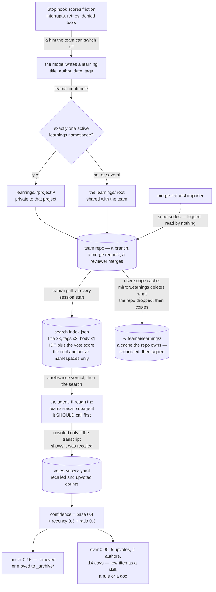

## 1. Executive Summary

teamai-cli is Tencent's tool for making *"every team AI native"*: a CLI that
keeps a team's skills, rules, agents, hooks, MCP servers, docs and knowledge
in a git repository and installs them into ten coding agents on every member's
machine. MIT; 720 commits between 3 March and 10 September 2026 by forty-four
authors; version 0.22.0 in the manifest against a changelog whose newest dated
release is 0.23.0 of 8 September; 64,635 lines of TypeScript under `src/`
beside 59,761 lines of tests in 243 files holding 3,020 cases. The screen found
no auto-run surface, one manifest inside the seven-day cooldown, one
build-time execution path and an `AGENTS.md` and `CLAUDE.md` treated as data;
nothing was installed or run, and the read was made from a full clone. The README's
product table names three layers — execution, context, improvement — and the
memory is the second and third: *recall, learnings, codebase graph, teamwiki*
and *friction-based share-learnings, sessions, digest, dashboard*.

A learning is a Markdown document. The share-learnings skill tells the model
to write one with `title`, `author`, `date` and `tags` in its frontmatter and
the body in Chinese, and `teamai contribute` writes it to `learnings/` in an
isolated worktree, commits and pushes it as a merge request
(`src/contribute.ts:133-252`); a reviewer merges, and the next `teamai pull`
on every member's machine rebuilds the search index (`src/pull.ts:745-808`).
The index is built by hand (`src/utils/search-index.ts:573-655`): frontmatter
parsed (`:241-280`), title tokens at three times IDF, tags at two, body at
one, a length normalisation, a domain weight, and a rule that a body-only
match is noise unless the entry is a doc (`:730-800`). Votes add to the score:
a per-user YAML of recalled and upvoted counts, aggregated at 0.3 per recall
and 1.0 per upvote (`:297-354`), synced to the repository at Stop
(`src/hook-handlers.ts:286-393`) — and an upvote is counted only for a
document the session's transcript shows was recalled, *"to avoid crediting
hallucinated/distractor doc-ids."* A confidence per document —
`base·0.4 + recency·0.3 + ratio·0.3` (`src/maintenance/confidence.ts:25-45`) —
drives `recall maintenance --prune`, which removes or archives a learning
under 0.15, and `recall promote`, which rewrites one that clears 0.90, five
upvotes, two contributors and fourteen days into a skill, rule or doc.

Where a learning is filed decides who can find it. `manifest/projects.yaml`
declares projects, each naming the `learnings` namespaces it owns
(`src/projects.ts:165-216`); a checkout lists its active project ids, and the
resolved namespace set reaches three places. `collectLearningsEntries`
(`src/utils/search-index.ts:462-489`) indexes the flat `.md` files at the
`learnings/` root — shared with the whole team — plus the `.md` files under
each active namespace, and skips every other subdirectory, so another
project's learnings never enter this member's index. A user-scope pull and a
user-scope contribute reconcile the local cache the same way, deleting a
namespace directory the member's projects have stopped naming
(`src/utils/learnings-mirror.ts:44-52`). And `contribute` files a new
learning into the one active namespace, or at the shared root when there are
none or several, because *"the contribution's ownership is ambiguous"*
(`src/contribute.ts:36-49`). A namespace is a single path segment at all three
boundaries, validated by the manifest schema, by the collector and by
`contribute` before it becomes a directory name.

The model reaches this through a subagent. `teamai pull` injects a managed
block into each agent's instructions (`src/pull.ts:1036-1125`) that says the
model *"SHOULD invoke the `teamai-recall` subagent"* before a task involving
code changes, debugging or design, with four skip conditions, and deploys
`agents/teamai-recall.md`, which runs `teamai recall --check` for a verdict of
`RELEVANT` or `NOT_RELEVANT` with the threshold and the matched and missing
terms, stops on the second, and otherwise runs the search and returns a
compact summary with document ids. The changelog's unreleased section removes
what preceded it: an `auto-recall` hook that searched the knowledge base
after every shell, grep and web call *"passively, implicitly."*

Three marks: `scope_enforced` for recall's project-first, opt-in-user index
selection; `negative_eval` for the ten-case isolation suite that asserts the
other scope's title absent beside the active scope's title present; and
`human_review` for `teamai review` over a queue of machine-written codebase
sections and for the merge request in front of every learning. Three findings
sit against the design. **Supersession is unwired.** The merge-request
importer computes which session learnings a new draft supersedes by keyword
overlap and warns about them (`src/import-mr.ts:218-247`); the `supersedes`
field on `LearningDraft` (`src/types.ts:1495-1502`) is read by nothing else in
the tree. **Forgetting reaches a learning through a mirror, not through a record.**
`teamai remove` appends a name to a committed `<type>/.removed` file
(`src/resources/base.ts:108-116`); the next pull reads it and deletes that
rule, skill or agent from every installed tool directory on every member's
machine (`src/pull.ts:708-758`), and the push scan skips a name it lists, so a
member's residual copy cannot re-upload it (`src/resources/skills.ts:319`,
`rules.ts:35`, `agents.ts:59`). `REMOVABLE_TYPES` is skills, rules, agents and
MCP (`src/remove.ts:10`), and learnings are in neither that list nor the
tombstone cleanup. What a learning gets instead is `mirrorLearnings`
(`src/utils/learnings-mirror.ts:17-83`), which treats `~/.teamai/learnings/`
as a cache the repository owns: it removes the root Markdown files and the
active-namespace files the repository no longer holds, drops a namespace
directory the member's projects stopped naming, and only then copies. Both
`pull` (`src/pull.ts:864-870`) and `contribute` (`src/contribute.ts:67`) call
it, so a prune or an archive reaches every user-scope member's cache and the
index built from it. The two mechanisms differ in what they leave behind. The
`.removed` file is a record a later write consults, and it outlives the
resource; the mirror is a comparison against present state, so a member who
was offline for the deletion gets it on their next pull, and nothing anywhere
records that the team rejected the document — a learning re-contributed under
a new filename is a new document with a new hash.

**Deleting a deployed skill is conditional.** `skillSafeToRemove`
(`src/pull.ts:318-324`) returns false when the team-repo source cannot be
located, when the deployed directory holds VCS metadata at any depth, or when
its contents are not byte-identical to that source; both role-and-tag cleanup
paths then keep the directory and warn (`src/pull.ts:349-357`,
`src/pull.ts:789-795`). The tombstone path applies a narrower guard — a
tombstoned skill is kept only for nested `.git` metadata
(`src/pull.ts:746-752`) — so a member's ordinary local edit survives a role
change and does not survive a `teamai remove`. Each is a decision to lose a
team deletion rather than a member's unpushed work, and the warning names what
the member must handle by hand.

## 2. Mental Model

A belief is a document a person or a model wrote after a session and a
reviewer merged. It enters through friction: the Stop hook scores the session
by interruptions, retries and denied tool calls (`src/contribute-check.ts:251-330`),
and above a threshold prints a reminder naming the signals and the task, the
model summarises what it learned into the required shape, and `contribute`
pushes a merge request. It also enters from a merged change the importer
turns into a draft, and from a wiki page or a codebase scan the AI CLI
writes.

It is *used* when the model asks. The instructions say it should ask before
a task that changes code, the subagent asks for a verdict first, and a
`RELEVANT` verdict means *"reading files is worth the cost"* and not that the
knowledge covers the subject. Every recall increments a recalled count on the
documents returned; at task completion the model declares which documents it
consulted, and only those the transcript shows were recalled become upvotes.
Those counts become the vote score in ranking and the confidence in
maintenance.

It stops being used by a person's command. `maintenance --prune` finds
documents under the confidence threshold or inactive for a long time with a
low score, and removes them or moves them to `_archive/`, a directory the
collector does not read. `promote` rewrites a mature document into a skill,
rule or doc. The importer's supersession is a warning. And a member on user
scope keeps every root document ever copied to their home directory until
they delete it themselves.

There is a fourth axis, and it is where the document sits. A learning at the
`learnings/` root belongs to the team; a learning under `learnings/<project>/`
belongs to one project and is invisible to a member whose active projects do
not name that namespace, because the index that would have to hold it is
never built with it.



## 3. Architecture

A Node CLI, `teamai`, with a `src/` of about a hundred modules. The team
repository is the store: `learnings/`, `docs/`, `rules/`, `skills/`,
`agents/`, `votes/`, `docs/team-codebase/`, a `manifest/` with `roles.yaml`
and `projects.yaml`, a `teamai.yaml` with roles, tags and sharing settings, and in *self mode* — where the business repository is
the team repository — a `teamai-reports` orphan branch that holds votes and
reports through an isolated worktree so the working tree is never touched.
`pull.ts` (1,720 lines) refreshes the checkout, installs resources into each
agent's directories under the union of a role's and a project's namespaces,
deletes what a `<type>/.removed` file names, syncs learnings, rebuilds the
index, injects the recall block and deploys the built-in subagent;
`projects.ts` (244 lines) parses the project manifest and resolves the active
learnings namespaces, and `migrate.ts` (391 lines) moves a legacy `.teamai`
directory into the per-workspace partition with a git-ignored backup; `push.ts`
and `team-push.ts` send local resources up through a branch and merge
request; `hooks.ts` (1,081 lines) installs and reconciles one `hook-dispatch`
command into each agent's settings for SessionStart, UserPromptSubmit,
PreToolUse, PostToolUse and Stop (`:480-483`), and `hook-handlers.ts:447-490`
maps events to handlers — pull, dashboard report, merge-request and package
hints and the local agent on session start; update, votes sync, contribute
check, report and local agent on stop; usage tracking and a TodoWrite hint on
tool use; pending hints and slash tracking on prompt submit. An HTTP
*local-agent* backend delivers resources per session for teams without a
repository. Model calls go through `src/utils/ai-client.ts:141-199`, which
spawns a locally installed AI CLI and parses its output, for the codebase
wiki, the wiki import, quality drafts and promotion.

### Deployment and ergonomics

`npm install -g teamai-cli`, then `teamai init <repo>` — project scope by
default since the unreleased changelog, installing under `<cwd>/.teamai/` and
the agents' project directories, or `--scope user` under the home directory.
After that every session start pulls. The cost is a git operation per session
and a handler chain per hook event; recall costs an index scan in Node and
whatever the subagent reads. Nothing needs a model except the wiki, the
import, the quality drafts and promotion, which need an AI CLI on the path.

## 4. Essential Implementation Paths

- **Contribute.** `contribute` (`src/contribute.ts:133-252`) validates the
  file, names it from the title with a date and a hash, resolves the landing
  subdirectory (`:36-49`), writes it under `learnings/` in an isolated
  worktree, records a pending learning so a failed push retries on the next
  pull, and pushes a branch as a merge request; the share skill supplies the
  document shape.
- **Index.** `buildIndex` (`search-index.ts:573-655`) aggregates votes, then
  collects learnings with `collectLearningsEntries` (`:462-489`) — the flat
  root always, each active namespace subdirectory when named, every other
  subdirectory never, and a namespace that is not a safe single path segment
  skipped — docs recursively, rules and skills; `parseLearningDoc` (`:241-280`)
  reads frontmatter; `search` (`:730-800`) scores as described with
  `isRelevantScore` (`recall.ts:76`) deciding the verdict against an IDF
  baseline (`:106`).
- **Recall.** `recall` (`recall.ts:342-430`) loads the project index, adds the
  user index on `inheritUserScope`, dedups by type and filename with the
  project winning, formats results with sources, records quality
  (`recall-quality.ts:92-131`) and auto-upvotes the recalled documents'
  recalled count (`:234`) for the active scope only.
- **Vote.** `votes-sync` (`hook-handlers.ts:286-393`) parses the transcript
  for `teamai:referenced-doc-ids` comments and the recalled set, upvotes the
  intersection, and syncs deltas to the repository or the reports branch
  (`votes.ts:156-177`); `recallFeedback` (`:182`) is the manual up or down.
- **Maintain.** `findPruneCandidates` (`maintenance/prune.ts:31-81`) flags
  confidence under the threshold or long inactivity with a low score;
  `executePrune` (`:87-113`) removes or copies to `_archive/` and removes;
  `writeBackConfidence` writes the number to frontmatter;
  `findPromotionCandidates` and `executePromotion` (`promote.ts:33`, `:152`)
  rewrite through the AI CLI.
- **Review.** `--require-review` on an import (`index.ts:837`,
  `import.ts:64-65`, `:223-227`) makes `iwiki-dual.ts:309-325` append each
  AI-written section to `pending-review.jsonl` with `inferRisk`
  (`review-store.ts:71-75`); `review-cmd.ts:160-235` lists, shows, applies
  under `--max-risk`, or rejects by removal; `applyOne` (`:124-134`) writes
  the section.
- **Import from a merge request.** `import-mr.ts:218-247` drafts a learning,
  extracts keywords, finds session learnings over a supersede threshold, and
  sets `supersedes` on the draft.
- **Sync learnings.** `pull.ts:864-870` and `contribute.ts:67` hand
  `mirrorLearnings` the repository's `learnings/` directory, the user-scope
  cache and the active namespace list. It removes a root `.md` the repository
  no longer holds, a namespace directory that is not selected, and a file
  under a selected namespace that the repository dropped, then copies with
  `overwrite: true` under a filter that keeps the root `.md` files and the
  active namespaces; project scope indexes the checkout directly, through the
  same namespace list. The self-mode contribute passes a worktree rather than
  the repository, so it uses `addLearningToCache`, which copies one file and
  removes nothing (`contribute.ts:312`).
- **Propagate a deletion.** `teamai remove` (`remove.ts:123`) calls the
  handler's `removeItem`, which deletes the resource from the team repository
  and appends its name to `<type>/.removed` (`resources/base.ts:108-116`, and
  `skills.ts:477-500`, `rules.ts:205-217`, `agents.ts:406-420`). The next
  pull reads that file for rules, skills and agents and deletes the named
  file or directory from every installed tool (`pull.ts:623-666`), and the
  push scan skips any name it holds so a member's residual copy is never
  re-uploaded (`skills.ts:315`, `rules.ts:65`, `agents.ts:79`). There is no
  `removeItem` and no `.removed` for learnings or docs.

## 5. Memory Data Model

A learning file: frontmatter `title`, `author`, `date`, `tags`, a body with
background, solution, lessons and related skills, and after a confidence
write-back a `confidence` field. Its path carries one more field the
frontmatter does not: a file at the `learnings/` root is the team's, and a
file under `learnings/<project>/` is that project's, with the index entry's id
prefixed by the namespace so the two cannot collide. A project in
`manifest/projects.yaml` (`projects.ts:35-49`): an `id` that must be a single
path segment, a name, a description, and `resources` naming its `knowledge`,
`skills` and `learnings` namespaces — `learnings` is the axis roles
deliberately do not carry. An index entry: type, id, title, tags, body tokens,
domain, vote score. `UserVotesV2` (`types.ts:1228-1232`): a version, `votes` of
document id to recalled and upvoted counts with last times, and `deltas` not
yet synced. `LearningDraft` (`:1606-1613`): title, content, `supersedes`. `PendingReviewItem` (`review-store.ts:19-31`): id, time, a kind
of codebase section, domain drift or multi-source conflict, a target file and
section, a payload, a source and a risk. A session's contribute state: a smart
score, tool count, friction, a prompt summary, whether hinted.

## 6. Retrieval Mechanics

Retrieval is lexical and weighted toward what the author declared. A query is
tokenised for mixed languages, its domain inferred, and each entry scored by
matched title tokens at three times their smoothed IDF, tag tokens at two,
body tokens at one, normalised by the square root of query length so a long
question does not outscore a short one on common words, with a body-only
match discarded for anything but a doc and the aggregated vote score added.
`--check` prints the verdict and the threshold, which for learnings is a
ratio of the index's IDF baseline with an absolute floor and for codebase
hits a constant, and for the top hit the matched and missing terms and the
sources it names. Project results come first and user results only on
opt-in, labelled; a project entry of the same type and filename shadows the
user one. Within a scope the index holds only what the member's namespaces
admit, so a learning belonging to a project they are not on cannot be ranked,
shadowed or refused — it is not in the file being searched. There is no vector
arm; the codebase wiki is served by a separate
graph engine with its own lookup (`code-knowledge-recall.ts`).

## 7. Write Mechanics

A learning is written by a person or a model as a file, committed on a
branch, and merged by a reviewer; it is retrievable on the next pull, which
runs at every session start. Where it lands is decided for the author: one
active learnings namespace files it there, none or several file it at the
shared root, and the stated reason for the second is that ambiguous ownership
should default to visible rather than to a guess. Nothing blocks the agent:
the Stop hook's reminder is a message a team can switch off with
`sharing.contributeHint.enabled`, `contribute` is a command, and the merge is
a reviewer's action. No background pass rewrites a learning; maintenance,
promotion and quality drafts are commands. Votes are written locally at
recall and at Stop and merged into the repository by delta; in self mode they
travel on the reports branch.

One write is worth naming for what it does not do. The importer's
`supersedes` is computed with a threshold and logged as a warning, and no
code marks, moves or hides the superseded files. The machinery it wants is in
the same tree — a `.removed` list that reaches every machine — and covers
rules, skills, agents and MCP rather than learnings. What learnings have is
the cache reconcile, which answers a different question: it makes a member's
copy match the repository, and asks nothing about what the repository used to
hold.

### Operational cost

A git pull per session; an index rebuild per pull over every Markdown file in
four directories; a Node scan per recall; an AI CLI call per wiki page,
import, quality draft or promotion.

## 8. Agent Integration

Ten agents get the same resources and five of them the hooks. The model's
path to memory is the managed block — *before* a task involving code, *should*
invoke the subagent, unless the person gave context, the files have the
answer, the change is trivial or the domain is outside the team's — and the
subagent, which returns a compact summary with document ids the model is
asked to cite in a `teamai:referenced-doc-ids` comment at completion. A
TodoWrite hint reminds it once per session, and on a tool whose Stop hook
cannot carry model context the hint is stashed and delivered with the next
prompt instead of being dropped. The person's surfaces are the
merge request, `teamai review`, `teamai recall` with its verdict, the
maintenance commands, and a dashboard with a knowledge-base health page.

## 9. Reliability, Safety, and Trust

**Scope — awarded, on two keys.** Which index is read is decided by the
working directory's configuration and an explicit opt-in, results are
labelled, the project shadows the user, and inherited hits cannot write votes
through the project channel; ten tests pin it. Which learnings that index
holds is decided by the project manifest: the root always, each active
namespace when named, nothing else, with the same resolution used by the
copy, the index and the contribution so the three cannot diverge, and a
path-segment guard at each. Four tests assert the exact indexed set.

**Human review — awarded.** `teamai review` over `pending-review.jsonl` with
list, show, apply under a risk ceiling and reject, fed by an import run with
`--require-review`; and the merge request every contribution goes through.

**Negative evaluation — awarded.** The isolation suite asserts the other
scope's title is absent while the active scope's title is present in the same
test, and the vote test asserts a referenced-but-unrecalled document is not
credited while the recalled one is.

**Trust state — withheld.** Confidence is a formula over counts and recency,
used to prune, promote and report; a learning has no status a read path
filters on.

**Tombstone — withheld, and this is the closest miss in the report.** The
tool has a durable, name-keyed deletion record that a later write consults:
`teamai remove` appends a resource name to a committed `<type>/.removed`
file, the next pull deletes that file or directory from every member's tool
directories, and the push scan skips any name the file holds, so a member's
residual copy cannot re-upload what the team deleted. That last clause is the
property this mark is about — a record that stops a value coming back — and
it is written down and tested. Three things keep the mark withheld. It is
keyed on a resource's filename rather than on the content of a claim, so the
same lesson under another name re-enters. Its purpose is to synchronise a
deletion across replicas, which the rubric names as the thing a tombstone is
not. And it does not cover learnings, which is the category this report is
about: `tombstoneTypes` is rules, skills and agents, `REMOVABLE_TYPES` adds
only MCP, learnings have no `removeItem`, and prune deletes a file and records
nothing. What learnings have instead is `mirrorLearnings`, and a mirror is the
opposite of the mark: it derives the deletion from the repository's present
contents each time it runs, holds nothing after the file is gone, and so
answers *is this here* rather than *was this rejected*. `supersedes` is
computed and unconsumed. A learning contributed again is a new file with a
new hash.

**Audit log — withheld.** Votes, usage and sessions are counters and logs of
use; git history is the record of a learning's changes and is not the tool's
own store.

**Bitemporal — withheld.** A `date` in frontmatter and a last-recalled time.

**What the votes guard.** An upvote requires the document id to appear in
both the transcript's referenced list and the session's recalled set, so a
model that cites a document it never retrieved credits nothing; a recall on
an inherited user hit while a project is active writes no vote.

**What propagation does and does not do.** A maintainer's prune reaches the
repository, every project-scope index, and — through the mirror — every
user-scope member's cache and the index built over it, on their next pull or
contribute. What travels is the absence of a file, not a record of the
decision, so the guarantee holds only while the repository is the one source
compared against: `contributeSelf` mirrored a worktree checked out at
`origin/<default>`, which by construction lacks another project's cached
learnings and any unmerged contribution, and the reconcile deleted both until
that call site was moved to an additive copy
(`src/utils/learnings-mirror.ts:93-99`, `src/contribute.ts:312`). A mirror is
only as safe as the authority of what it is handed.

## 10. Tests, Evals, and Benchmarks

3,020 cases in 243 files, under vitest with an e2e configuration. On the
memory paths: `search-index.test.ts` (53) and `search-index-multi.test.ts`
(10) on the index and its four categories; `recall.test.ts` (9),
`recall-relevance-threshold.test.ts` (16), `recall-check.test.ts` (4),
`recall-scope-isolation.test.ts` (10), `recall-quality.test.ts` (8),
`recall-format.test.ts` (6), `recall-rules.test.ts` (6),
`recall-progressive.test.ts` (9); `learnings-namespace.test.ts` (4) and
`projects.test.ts` (16) on the namespace key; `votes.test.ts` (18) and
`votes-e2e.test.ts` (3); `maintenance-prune.test.ts` (6),
`maintenance-promote.test.ts` (6); `pull-tombstone.test.ts` (17) on the
`.removed` list and the two skill-deletion guards, including a case that
asserts an untombstoned file survives, one that asserts a locally edited skill
and its unpushed file are kept, and one that asserts a skill whose team-repo
source cannot be found is kept; `learnings-mirror.test.ts` (3) and
`pull-learnings-deletion.test.ts` (1) on the cache reconcile, the second
driving `pull` end to end and asserting the deleted document out of the
rebuilt index; `pull-project-cleanup.test.ts` (4);
`review-store.test.ts` (15), `review-cmd.test.ts` (8),
`iwiki-review-apply.test.ts` (2); `contribute-check.test.ts` (50) with its
phase-two and e2e files; `hook-dispatch.test.ts` (17); `pending-learnings.test.ts`
(10); `migrate.test.ts` (21) on the data-layout migration. The prune tests
assert an empty candidate list at a low threshold beside a populated one at a
high threshold; the check tests assert `NOT_RELEVANT`
with no side effect on the quality cache. No benchmark and no paper; the
dashboard's health page is the project's own measurement of its knowledge
base.

## 11. For Your Own Build

### Steal

- **Credit a citation only if it was retrieved.** Intersecting the model's
  declared document ids with the session's recalled set is a cheap guard
  against a model voting for what it imagined.
- **A verdict that reports its threshold and its gaps.** `RELEVANT score=
  threshold= matched= missing=` lets the caller decide whether to read, and
  tells it what the hit does not cover.
- **Review with a risk on the item.** A queue of machine-written sections
  with a kind, a target and a risk, applied under a ceiling, is a small
  design that a wiki writer needs.
- **Scope decided by where you stand, with an explicit opt-in to widen.**
- **One resolution of a scope key, used by every path that touches it.** The
  copy filter, the index collector and the contribution's landing directory
  all call the same function, with the comment saying why: a contribute-time
  rebuild that resolved the namespace differently would drop the project's
  other learnings from recall.
- **A deletion list the push path also reads.** Deleting a resource in one
  place and letting every replica re-upload it is the default failure; a
  committed `.removed` that the push scan consults costs one `if`.

### Avoid

- **Computing supersession and writing it nowhere.** A warning in a log is
  not a state in the store.
- **Reconciling a cache against a source that is not authoritative.** The
  learnings mirror is correct against the full team repository and destructive
  against a partial checkout of it; the same function at two call sites was a
  fix at one and data loss at the other.
- **A deletion path that is conditional in two different ways.** A skill
  dropped by a role change survives if a member edited it; a skill the team
  tombstoned does not, unless it holds a `.git`. The rule a member can predict
  is the one they will trust.
- **A retrieval that depends on the model's *should*.** Four skip conditions
  in a managed block make recall a judgement call the model makes before
  every task.

### Fit

For a team of several developers on several agents who want one repository
to be the source of their skills, rules and lessons, with a merge request in
front of every change and a vote that only counts what was used, this is a
substantial and unusually well-tested tool, and its knowledge layer is
consistent with the rest of it. It is not a memory that maintains itself:
lessons are documents a person writes and a reviewer merges, retrieval is
title and tag matching the model is advised to run, and forgetting a learning is
the absence of a file rather than a record of a decision. Teams outside the
share skill's Chinese-only rule will edit the skill first.

## 12. Open Questions

- What consumes `LearningDraft.supersedes`? A move to `_archive/`, a
  frontmatter mark or a dedup rule are each one function away.
- Will learnings get a `.removed` list? The mirror propagates the absence of
  a file, which is enough for a member's cache and not enough to stop a
  retired lesson being contributed again under a new name. The mechanism, the
  pull-side reader and the push-side guard are written and cover four other
  resource types.
- Which deletion rule is the intended one? A skill dropped by a role change
  is kept when a member edited it; a tombstoned skill with the same edit is
  deleted. Both guards were written for the same hazard.
- How often does the model invoke the subagent? The four skip conditions
  make the rate a property of the model, and usage tracking counts skills,
  not the recall block.
- When a member leaves a project, their local namespace directory goes. Do
  the votes they cast on that project's documents, which live in a per-user
  file keyed by document id, go with it?

## Appendix: File Index

| Path | Lines | What it holds |
| --- | --- | --- |
| `src/recall.ts` | 566 | `recall`, `isRelevantScore`, `computeIdfBaseline`, `formatResults`, `autoUpvote` |
| `src/utils/search-index.ts` | 873 | `parseLearningDoc`, the collectors including `collectLearningsEntries`, `buildIndex`, `search`, vote aggregation |
| `src/votes.ts`, `src/transcript-parser.ts` | — | The votes file, deltas, sync, feedback; recalled and referenced ids from a transcript |
| `src/hook-handlers.ts`, `src/hook-dispatch.ts`, `src/hook-dispatch-cli.ts` | —, 195, 216 | The handler registry per event, the dispatcher, the CLI entry |
| `src/hooks.ts` | 1,081 | Installing and reconciling hooks into each agent |
| `src/pull.ts` | 1,720 | Resources, the tombstone cleanup, `skillSafeToRemove` and the two conditional skill cleanups, the learnings reconcile call, the index rebuild, the recall block, the subagent |
| `src/utils/learnings-mirror.ts` | 99 | `mirrorLearnings`, the reconcile-then-copy used by pull and contribute; `addLearningToCache`, the additive copy used by the self-mode contribute |
| `src/projects.ts`, `src/roles.ts` | 244, — | The project manifest, the namespace resolution, the path-segment guard; the role namespaces it merges with |
| `src/resources/base.ts`, `src/remove.ts` | —, — | `readTombstones` (96-103), `addTombstone` (108-116), and the `.removed` filename; `REMOVABLE_TYPES` (10) |
| `src/contribute.ts`, `src/contribute-check.ts` | 368, 774 | The push of a learning and the namespace it lands in; the friction score and the reminder |
| `src/import-mr.ts`, `src/import.ts`, `src/iwiki-dual.ts` | —, —, — | The merge-request draft with `supersedes`; `--require-review`; the wiki import that fills the review queue |
| `src/review-store.ts`, `src/review-cmd.ts` | 240, — | The queue and the command |
| `src/maintenance/` | — | `prune`, `promote`, `confidence`, `quality-update`, `hot-cold` |
| `src/recall-quality.ts`, `src/recall-toggle.ts` | 131, 158 | The per-session quality cache; enable and disable |
| `agents/teamai-recall.md`, `skills/teamai-share-learnings/SKILL.md` | — | The subagent; the document shape |
| `src/utils/ai-client.ts`, `src/local-agent.ts` | —, 2,820 | The spawned AI CLI; the HTTP backend |
| `docs/usage-guide.md` | — | Knowledge capture, retrieval, maintenance, promotion, health |
| `src/__tests__/`, `test/` | 59,761 in 243 files | 3,020 cases |

Searches behind the absence claims above, run from the repository root:

```sh
rg -n '\.supersedes\b' src --glob '*.ts' --glob '!*test*'              # none: the field has no consumer
rg -n 'remove\(|unlink|emptyDir' src/pull.ts src/contribute.ts         # skills only: every learnings removal lives in utils/learnings-mirror.ts
rg -n 'REMOVABLE_TYPES' src/remove.ts                                  # skills, rules, agents, mcp — no learnings handler
rg -n 'mirrorLearnings|addLearningToCache' src --glob '!*test*'        # three call sites: pull and contribute reconcile, contributeSelf only adds
rg -n -i 'embed|vector|cosine' src/utils/search-index.ts src/recall.ts   # none: no vector arm on learnings
rg -n -i 'archive' src/utils/search-index.ts                          # none: neither collector descends into _archive/
rg -n -i 'status' src/utils/search-index.ts | rg -i learning           # none: no state on a learning
rg -n 'this.addTombstone' src/resources/*.ts                          # agents, mcp, rules, skills — not docs, not learnings
rg -n 'removeItem' src/resources/docs.ts                              # a no-op override: docs have no removal path either
rg -n 'learnings' src/pull.ts | rg -i 'tombstone|removed'             # none: learnings are not in the tombstone cleanup
```

## History

**2026-09-10** — [`9e7adc79faa03ef4c3a49cb7a148bba83b7dc1f3`](https://github.com/Tencent/teamai-cli/commit/9e7adc79faa03ef4c3a49cb7a148bba83b7dc1f3) — re-read at the head of `main`, 65 commits past the previous pin. Screened again before reading: no auto-run surface, `package.json` inside the seven-day cooldown, one build-time execution path; nothing installed or run. The published finding that a user-scope pull copies the root learnings over the local copy with overwrite and no removal was answered in the repository. [`b036d838fabd60fd3431e68ce16418682482358e`](https://github.com/Tencent/teamai-cli/commit/b036d838fabd60fd3431e68ce16418682482358e) added `src/utils/learnings-mirror.ts` and routed `pull` and `contribute` through it, reconciling the user-scope cache against the repository before the index is rebuilt, with three unit cases and one end-to-end case; the report's `update_delete`, `risks`, section 1, section 9 and the diagram are corrected to describe the mirror. Two things the fix reveals are written up beside it. It shipped a regression: `contributeSelf` handed the mirror a worktree checked out at `origin/<default>`, which cannot contain another project's cached learnings or an unmerged contribution, and the reconcile deleted both until [`e0e7e488000f02da84794faa463e26c90f8c8ce6`](https://github.com/Tencent/teamai-cli/commit/e0e7e488000f02da84794faa463e26c90f8c8ce6) moved that call site to an additive copy — the failure mode of a mirror is the authority of what it is handed, and that is the shape of the finding now. And the deletion the report praised has been made conditional: `skillSafeToRemove` keeps a deployed skill that is not byte-identical to its team-repo source or whose source cannot be located, while the tombstone path keeps one only for nested `.git` metadata, so the same local edit survives a role change and does not survive a `teamai remove`. Both of the other two findings hold at this commit, re-verified rather than carried forward: `LearningDraft.supersedes` is computed at `src/import-mr.ts:225`, stored, warned about and read nowhere, and `REMOVABLE_TYPES` is skills, rules, agents and MCP with no learnings handler. Every recorded absence search was re-run; one was stale because its mechanism moved out of `src/pull.ts`, and it is replaced by three that name the new locations. `tombstone` stays withheld and the reason is sharper: a mirror derives a deletion from present contents and holds nothing afterwards, so it answers *is this here* rather than *was this rejected*. No mark moved.

**2026-09-08** — [`24260bd5f7039a0dbd8b82577667b78b744a5529`](https://github.com/Tencent/teamai-cli/commit/24260bd5f7039a0dbd8b82577667b78b744a5529) — re-read at the head of `main`, 47 commits past the first pin on the same day. Screened again before reading: the same shape, no auto-run surface, two manifests inside the cooldown, one build-time execution path. Two published claims were wrong at this commit and are corrected. The first said a user-scope pull never removes anything; it drops a project namespace subdirectory that stops being active, and the claim now names the root files, which it does not remove. The second said the changelog's last dated release was April's 0.14.2; it is backfilled through 0.23.0. One mechanism the first reading missed is written up rather than corrected: the `<type>/.removed` list, which propagates a deletion of a rule, a skill or an agent to every member's machine and blocks a re-upload from a stale copy, and which learnings are not part of — the closest miss on the `tombstone` mark in this report. New since the pin: project-namespace isolation for learnings, applied by the copy filter, the index collector and `contribute`, with four committed cases asserting the exact indexed set. No mark moved. The diagram was redrawn top-to-bottom; the left-to-right version rendered nine times wider than tall and its labels were unreadable at the page's column width.

**2026-09-08** — [`a991038b3104d45248767a218e9e003f8d38d55f`](https://github.com/Tencent/teamai-cli/commit/a991038b3104d45248767a218e9e003f8d38d55f) — first reading, at the head of `main`, the last commit of 6 September 2026. Screened first: no auto-run surface, two manifests inside the seven-day cooldown, one build-time execution path, `AGENTS.md` and `CLAUDE.md` treated as data; nothing installed or run, the read made from a full clone. Three marks. The reading covered the knowledge layer — recall, learnings, votes, maintenance, review, contribution, hooks — and treated the resource distribution, roles, tags, sources, dashboard and codebase graph engine as context rather than subject.
