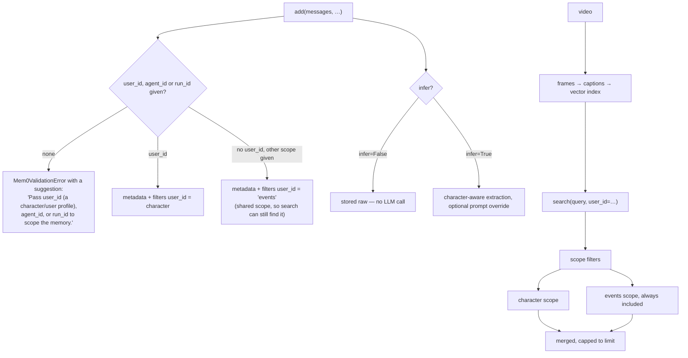

## 1. Executive Summary

TeleMem is an Apache-2.0 agent-memory layer from TeleAI's UAGI group — a mem0
drop-in (`import telemem as mem0`), local by default on Qwen and FAISS, with
per-character memory profiles, a video-to-memory pipeline, an MCP server, and a
tech report on arXiv.

**What earns the report is `docs/evaluation.md`: a published evaluation
charter.**

Nine rules the project binds itself to before publishing any number. The ones
worth quoting:

> "1. **Baselines before architecture.** Every table includes a **full-context
> baseline** (entire history in the prompt) and a **keyword-grep baseline** (no
> memory system, simple lexical retrieval). If TeleMem cannot beat both by a
> clear margin on *accuracy*, the claim must shift to what is actually measured:
> cost, latency, or scale beyond the context window."

> "4. **Judges are published and audited.** …the harness ships an **adversarial
> judge validation mode**: gold answers must pass and shuffled
> (wrong-but-topical) answers must fail. We report both acceptance rates next to
> any judged score."

> "5. **Multi-seed or it didn't happen.** Headline comparisons require ≥ 5
> independent runs (10 preferred), reported as mean ± std with Wilson 95%
> intervals per category."

> "6. **Deltas under the noise floor are noise.** We do not claim a win when
> confidence intervals overlap, and we treat sub-10-point gaps on static QA
> benchmarks as weak evidence regardless."

> "9. **Conflict of interest is disclosed, not hidden.** We built TeleMem; we
> also ran the baselines. Treat our numbers… as claims awaiting independent
> reproduction — and use our harnesses to check them."

**And then it says the charter does not yet cover its own README:**

> "This charter governs **new evaluation runs**… Existing published results (such
> as the README's ZH-4O table…) predate the charter; bringing them fully under it
> — re-runs, added baselines, and expanded disclosures — is being coordinated…
> and tracked in [issue #10]."

**And it tells readers they may not need the product:**

> "We endorse the essay's selection procedure even when it cuts against us: build
> a full-context baseline and a grep baseline **on your own data** first. If your
> task fits in a 200K context window and TeleMem doesn't beat those baselines by
> a clear margin *or* save you significant cost, you may not need TeleMem — or
> any memory system."

A memory vendor instructing you to check whether any memory system is warranted
is the most disinterested sentence in this corpus.

**The charter is not aspirational prose** — section 10 shows a harness flag
behind each rule.

## 2. Mental Model

A memory belongs to a scope: a `user_id` (which here means a *character* profile),
an `agent_id`, or a `run_id`. `add()` refuses a write with no scope. Anything
written without a character lands in a shared `events` scope, and `search()`
always includes that scope alongside the requested one.

## 3. Architecture

The package itself is small — `telemem/mem0.py` is the drop-in surface,
`configs.py`, `utils.py`, `mm_utils/` for the multimodal path, and `mcp/` for the
server. Around 30,000 lines total, and much of the repository's bulk is
`baselines/`.

**`baselines/` is a feature, not scaffolding.** It contains runnable harnesses
for A-mem, mem0, memobase, a plain RAG baseline, TeleMem itself, and a
LongMemEval harness — so the comparison table's ingredients ship with the claim.
Charter rule 8 makes that explicit: "Harnesses, configs, prompts, and exact model
versions live in `baselines/`; anything not reproducible from the repo is marked
*self-reported*."

The MCP server was migrated to the official Python SDK v2 with "titles, behavior
annotations, and structured output" on all eight tools, while staying compatible
with older clients.

## 4. Essential Implementation Paths

**Scope a write** — `telemem/mem0.py` (`add` `:227-340`, the required-scope error
`:301`, the events fallback `:315-324`, the `agent_id`/`run_id` filters
`:325-332`).

**Scope a search** — `telemem/mem0.py` `search` `:595-`.

**Honour the contract** — `tests/test_contract.py`.

**Evaluate** — `docs/evaluation.md`, `baselines/longmemeval/run_telemem.py`,
`baselines/longmemeval/stats.py`.

## 5. Memory Data Model

mem0's, with `user_id`, `agent_id` and `run_id` in metadata and in filters, and a
`memory_type` restricted to mem0's procedural type when supplied.

**TeleMem adds no epistemic layer.** No confidence, no status enum, no
supersession pointer, no tombstone, no bitemporality, no audit table. What it adds
to mem0 is character isolation, a context-aware extraction path, and the video
pipeline.

The `events` scope is the one modelling decision worth naming: a memory written
without a character does not become invisible, it becomes shared, and search
always includes it. That is a sensible default — a fact about the world is not
about one persona — and it is also a widening: a caller who scopes to character A
receives everything in `events` too, so anything the extraction path leaves
unscoped is visible to every character.

## 6. Retrieval Mechanics

Scoped search with the shared `events` scope always merged in, capped to the
requested limit, mem0-compatible in arguments and return shape
(`{"results": [...]}`).

`user_id`, `agent_id` and `run_id` are stored in metadata and applied as filters
on both the write and the read path, which is what `scope_enforced` certifies.
For the role-play and multi-persona workload TeleMem targets, that scoping *is*
the product: separate NPCs must not share memories.

## 7. Write Mechanics

`add()` validates before it does anything: no scope id is an error carrying a
`suggestion` field telling the caller which ids are acceptable; an unknown
`memory_type` is rejected. `infer=False` stores raw text and — per the contract
test — never calls an LLM.

Correction and deletion are mem0's. Nothing here supersedes, retracts or ages a
memory.

## 8. Agent Integration

`pip install telemem`, or `uvx telemem` from the official MCP registry with zero
install. A one-line drop-in for existing mem0 code. LangChain and LlamaIndex
examples, Ollama / DeepSeek / Kimi configs, a documentation site, a Dockerfile,
and a multi-NPC demo.

Telemetry is disabled by default as of v1.8.0, and `test_contract.py` contains
`test_mem0_telemetry_is_opt_in` — the claim and its test.

## 9. Reliability, Safety, and Trust

**One mark: scope enforced.**

No trust state, no tombstone, no bitemporality, no audit log, no human review, no
committed exclusion case. For a layer whose stated job is to be a faster, more
character-aware mem0, that is consistent rather than surprising — and it means
TeleMem inherits mem0's answer to every question this atlas asks about
correction.

**The `events` widening is the risk to name.** Search always includes the shared
scope, so isolation between characters holds only for memories the write path
actually scoped to a character. A memory the extraction path leaves unscoped is
readable by every persona, and nothing flags that at write time — the fallback is
silent by design, for a good reason (otherwise the memory would be
unreachable).

**The v1.8.0 release note is a positive signal worth recording.** Its theme is
"claims = contracts": *"`infer=False`/`prompt`/`memory_type` now fully honored,
offline contract test suite"*. A release whose headline is making the API do what
its documentation already said, with tests named after each promise, is a
maturity marker.

## 10. Tests, Evals, and Benchmarks

**A paper** ([arXiv:2601.06037](https://arxiv.org/abs/2601.06037), fourth
revision), a `CITATION.cff`, CI, and eight test files.

**`tests/test_contract.py` is a contract suite in the literal sense** — each test
is an API promise:

- `test_add_requires_a_scope_id`
- `test_add_rejects_unknown_memory_type`
- `test_add_without_user_id_stores_in_events_scope`
- `test_infer_false_stores_raw_and_never_calls_llm`
- `test_prompt_override_becomes_system_prompt`
- `test_search_includes_events_scope`
- `test_search_caps_merged_results_to_limit`
- `test_mem0_telemetry_is_opt_in`
- `test_add_batch_rejects_memory_type`
- `test_character_prompt_receives_parsed_dialogue`

Two of those assert negatives — that no LLM is called, and that telemetry is off
unless opted into — which is the shape a claim test needs.

**The charter has a mechanism behind every rule**, and
`baselines/longmemeval/README.md` prints the mapping as a table:

| charter principle | mechanism |
|---|---|
| Baselines before architecture | `--system {telemem, full-context, grep}`, same answer model and prompt |
| Hold the base model constant | one `--answer-model` for every system; other vendors' numbers never merged in |
| Audited judge | prompt published verbatim; `--validate-judge` feeds gold answers (must pass) and shuffled wrong-but-topical answers (must fail), reporting both acceptance rates |
| Multi-seed | `--seeds N` → mean ± std |
| Noise-floor awareness | per-type Wilson 95% intervals; "the reporting note forbids claiming wins across overlapping intervals" |
| Cost/latency first-class | ingestion wall-clock, search latency, token usage every run |

**A `--validate-judge` mode is a negative control on the grader**, and this atlas
has argued repeatedly that an unexercised check is indistinguishable from no
check. Applying that to the *judge* — the component whose leniency is the
best-documented failure in memory benchmarking — is the right place to put it.

Even the judge carries its own caveat: "the built-in judge is a simplified
replication of LongMemEval's official evaluation. Output keeps question_id +
hypothesis so the official scripts can grade for paper-grade numbers."

**And the status is stated rather than implied.** The harness README says
"**Status: experimental.** The harness runs end-to-end; published TeleMem numbers
are pending". The charter's roadmap marks multi-seed and adversarial judge
validation as "✅ harness support shipped; published numbers pending", and the
ZH-4O table in the README as predating the charter.

So the position at this commit is: **the methodology is shipped and the numbers
under it are not.** That is an unusual and creditable place to be, and it is also
the honest summary — a reader cannot yet take a charter-compliant TeleMem result
from this repository, because none has been published.

**I ran nothing.**

## 11. For Your Own Build

### Steal

- **Write an evaluation charter before you publish a number, and publish the
  charter.** Nine rules, each with a mechanism, is a commitment a reader can hold
  you to — and one you can be seen to fail.
- **Require a grep baseline and a full-context baseline in every table.** If you
  cannot beat "put the whole history in the prompt" and "grep", the honest claim
  is about cost or scale, not accuracy. This one rule would invalidate a
  significant fraction of the claims in this atlas.
- **Validate the judge adversarially.** Gold answers must pass, shuffled
  wrong-but-topical answers must fail, and both acceptance rates get reported
  next to the score. A lenient judge is the most common way a memory benchmark
  lies.
- **Refuse to claim a win across overlapping confidence intervals**, and say in
  advance that you will refuse.
- **Never merge another vendor's published number into your table.** Hold the
  base model, embedder and answer prompt constant, or do not make the row.
- **Ship the baselines you compare against.** `baselines/` with runnable
  harnesses for four competitors turns a claim into an experiment someone else
  can run.
- **Disclose the conflict of interest in the document making the claim.** "We
  built TeleMem; we also ran the baselines."
- **Say which of your existing numbers your new standard does not cover**, and
  link the issue tracking the re-runs.
- **Tell readers how to find out they do not need you.**
- **Refuse a write with no scope, and put the fix in the error.** A
  `suggestion` field naming the acceptable ids beats a stack trace.
- **Name a test after the promise it enforces.**
  `test_infer_false_stores_raw_and_never_calls_llm` is both the contract and its
  proof.

### Avoid

- **Do not let an unscoped fallback widen silently.** Writing to a shared
  `events` scope keeps the memory reachable and makes it readable by every
  persona; for a role-play product that is exactly the boundary the product
  sells.
- **Do not ship the methodology without the run.** The charter, the flags and the
  harnesses exist; no charter-compliant result does, so the numbers a reader can
  actually see are the ones the project has already disowned.
- **Do not inherit your correction story.** Being a mem0 drop-in means mem0's
  answer to supersession, staleness and deletion is yours.

### Fit

The right choice if you are already on mem0, want a local Qwen/FAISS stack, and
your workload is multi-persona — separate NPCs, companions or role-play
characters — because character isolation is the thing this layer adds and
enforces.

Read `docs/evaluation.md` regardless of what you build. With
[Fidelis](../fidelis/)'s writeup it is one of the two documents in this atlas
that treat a benchmark number as a claim requiring defence, and it is the one
that generalises: Fidelis demonstrates the discipline on one result, TeleMem
codifies it as rules with flags behind them.

## 12. Open Questions

- **What does a charter-compliant run show?** Issue #10 tracks it; nothing is
  published at this commit.
- **What are the judge's acceptance rates?** `--validate-judge` exists; no
  reported gold-pass / shuffled-fail rates were found.
- **How often does the extraction path leave a memory unscoped?** That determines
  how much of the store is visible to every character.
- **What does the tech report claim?** `docs/TeleMem_Tech_Report.pdf` and the
  arXiv entry were not read for this report; the repository's own files were.

## Appendix: File Index

**The charter** — `docs/evaluation.md` (the framing and the cited essay `:1-13`,
the nine rules `:15-47`, scope and status `:49-58`, the roadmap table `:60-68`,
"Choosing a memory system (including ours)" `:70-`)

**The harness** — `baselines/longmemeval/README.md` (the charter-to-mechanism
table `:11-20`, the experimental status note `:8-9`),
`baselines/longmemeval/run_telemem.py` (the `--validate-judge` description
`:11-14`, the simplified-judge caveat `:33-35`), `baselines/longmemeval/stats.py`,
`baselines/{A-mem,mem0,memobase,rag,telemem}/`, `baselines/evaluate.py`

**Scoping** — `telemem/mem0.py` (`add` signature `:227-262`, the required-scope
error with its suggestion `:301`, the `memory_type` rejection `:304`, the
character/events branch `:315-324`, `agent_id`/`run_id` `:325-332`, `search`
`:595-613`)

**Contract tests** — `tests/test_contract.py` (`test_add_requires_a_scope_id`
`:99`, `test_add_rejects_unknown_memory_type` `:105`,
`test_add_without_user_id_stores_in_events_scope` `:111`,
`test_infer_false_stores_raw_and_never_calls_llm` `:121`,
`test_search_includes_events_scope` `:238`, `test_mem0_telemetry_is_opt_in`
`:248`)

**Documentation** — `README.md` (the v1.8.0 "claims = contracts" note),
`docs/MCP.md`, `docs/evaluation.md`, `docs/video.md`, `CITATION.cff`

## History

**2026-08-09** — [`8b12b0005502b2768eebdab79b8bd1ac8c6cd0d0`](https://github.com/TeleAI-UAGI/telemem/commit/8b12b0005502b2768eebdab79b8bd1ac8c6cd0d0) — first reading. Screened before reading; the tree was read, never installed, no benchmark was run, and the tech report was not read.
