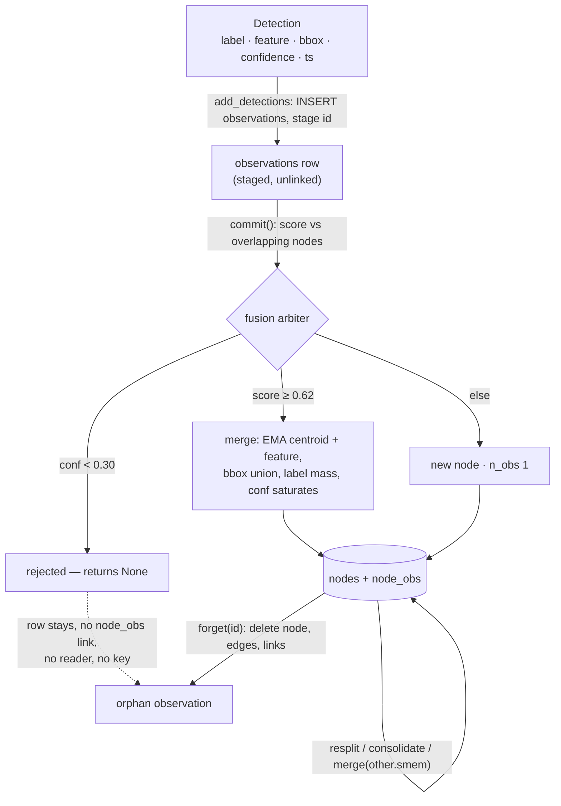

## 1. Executive Summary

Chronotope is a **spatial memory library for embodied agents**: Apache-2.0,
56 commits by one author between 29 May and 3 July 2026, 3,635 lines of Python
in the `tempomem` package under 2,101 lines of tests with 154 test functions,
released on PyPI as `0.1.0a1` and described by its own README as *"Pre-alpha.
Public design phase."* The core install depends on numpy alone; CLIP text
encoding, a sqlite-vec index and a Replica dataset reader sit behind extras.
The package was called `spatialmem` until 11 June 2026 and the class
`SpatialMemory` until 2 July; the CHANGELOG records both renames and that
nothing shipped under the old names. Two companion packages the docs describe —
`worldsense` for perception and `mindloop` for the reasoning loop — are named
in `docs/en/DEV-PLAN.md` and in one `tools.py` docstring and are not in this
tree.

The pitch is *"Mem0 for 3D space"*: perception produces labelled 3D boxes with
feature vectors, and the library turns a stream of those into a persistent
scene graph an LLM can query. The mechanism that earns the description is the
**fusion arbiter** (`src/tempomem/fusion.py`). Each committed observation is
scored against every node whose box overlaps its own dilated box — geometry,
3D IoU, feature cosine and a lexical label match, weighted 0.2, 0.2, 0.5 and
0.1 — and the result is one of three things: a merge into the best node at or
above 0.62, a rejection when the observation's own confidence is under 0.30,
or a new node. The arbiter is deterministic for a fixed configuration and
stream, ties go to the lowest node id, and `tests/unit/test_fusion.py`
`test_determinism` asserts it.

**The invariant worth reading the code for is fuse-before-persist.**
`add_detections` writes observation rows immediately and stages their ids;
`commit()` is the only thing that drains the stage. Every other mutator —
`decay`, `resplit`, `consolidate`, `forget`, `update`, `define_region`,
`relate`, `add_edge` — calls `_flush_pending()` first, and so does `close()`,
so a `.smem` file is never committed holding an observation that no node
accounts for. `tests/unit/test_pending_consistency.py` interleaves decay and
consolidate between an add and its commit and then asserts on disk that no
orphan exists. The docstring on `_flush_pending` (`__init__.py:273-291`)
explains why: the SQLite connection runs in implicit-transaction mode, so a
maintenance commit would otherwise flush the staged rows unfused.

**Where it is weakest is everything after a belief is wrong.** A rejected
observation is not deleted — `ingest_observation` returns `None`
(`fusion.py:246-247`) and the row it was inserted from stays in `observations`
with no `node_obs` link. Nothing reads an unlinked observation: the only join
is `observations_for_node`, and there is no `DELETE FROM observations`
anywhere in the package. So the rejection is durable and useless — keyed on
nothing, consulted by nothing, and re-scored from scratch when the same
sighting arrives again. `forget(node_id)` produces the same orphans, deletes
the node, and records nothing. `update(node_id, label=)` overwrites the
canonical label and replaces the accumulated label distribution with
`[(label, 1.0)]`, so the evidence for the previous label is gone; the feature
vector is untouched, so a relabelled node keeps embedding as whatever it was
before. And `answer()` hands the verbalizer the *entire* scene through
`serialize.to_prompt(self._conn)` with no budget and no subgraph, although both
options exist on `serialize()` — the CHANGELOG says the subgraph form
*"Powers `Brain.ask`'s retrieval context"*, and `Brain` lives in the absent
`mindloop`.

One mark, `negative_eval`, on committed cases that ingest the thing that must
stay out and assert an exact result. No paper: the README, `docs/en` and
`spec/` carry no arXiv identifier, BibTeX block or DOI.

## 2. Mental Model

A memory is a **node**: the library's belief that one physical object exists
at a centroid, inside a box, with a label it has accumulated more confidence
mass for than any other, and a confidence that fusion pushes toward 1 and
decay pulls toward 0. An **observation** is one frame's claim about one
object. A node is the fused residue of its observations, and `history(node_id)`
returns them in order — position and timestamp per sighting — which is how the
library answers *where was it over time* and *when was it last seen*.

The belief is born by fusion, never by assertion: there is no `add_node` for
an object. A caller can assert a **region** (`define_region`), which adopts
every object whose centroid falls inside a box and holds a confidence of 1.0
that decay never touches. A belief changes by merging in another observation
(EMA on centroid and feature, bbox union, label mass added, confidence
saturating as `conf + (1 − conf) × obs_conf × 0.5`), by `update` overwriting
fields in place, by `resplit` discovering that its observations form two
clusters more than a metre apart, or by `consolidate` deciding it and another
node were the same thing all along. It dies by `decay` pruning it under the
floor, by `forget`, or by being the `drop` side of a merge. Nothing supersedes
a node, nothing marks one doubtful, and nothing remembers that one died.

The one temporal axis is observation time. `t_first` and `t_last` are the
timestamps of the first and latest sighting, `changes(since_ts)` splits nodes
into *new* and *seen again* on them, `stale(before_ts)` lists what has not been
seen — the library's own docstring calls these *"candidates for 'gone'"*, and
that is the correct reading: absence of a sighting is evidence for a decision
the caller has to make. There is no record time; nothing stores when the
library learned something, only when the world showed it.



## 3. Architecture

A library, not a service. `TempoMem.open(path, embedding_dim=…)` opens or
creates one SQLite file (`persist/__init__.py:22-45`): WAL journal, foreign
keys on, a `meta` table carrying `schema_version`, `embedding_dim` and
`creator_version`, and two forward-only migrations — `001_init` for
`episodes`, `observations`, `nodes`, `edges` and `node_obs`, `002_semantic`
for `semantic_edges`, `node_properties` and the append-only `smem_events`
log. Opening a store whose `embedding_dim` differs from the request raises
`SchemaMismatchError`; so does a store newer than the library. Feature vectors
are float32 BLOBs on `observations` and `nodes`; with the `[vec]` extra, a
sqlite-vec `node_vec` virtual table mirrors `nodes.feature` and is maintained
on insert, update and delete (`vec.py`), and `semantic_vec` uses it when
present and scans the BLOBs otherwise. The BLOB is the source of truth and the
index is rebuildable.

Everything above the file is in-process Python: `store.py` is row-level CRUD,
`fusion.py` the arbiter, `relations.py` the geometric edge pass,
`query/__init__.py` the router and retrievers, `serialize.py` the JSON dump
and the prompt tree, `tools.py` the function-calling layer, `verbalize.py`
the `answer()` prompt and the `Verbalizer` protocol, `perception.py` the
`PerceptionAdapter` protocol and `encoders.py` the `Encoder` protocol with an
`OpenClipEncoder` behind `[clip]`. `datasets/` streams synthetic scenes and,
behind `[replica]`, Replica ground-truth masks into the same `Detection`
shape. `bench.py` is the evaluation harness and `viz.py` the HTML export.

### Deployment and ergonomics

Nothing has to be running. `pip install tempomem` brings numpy; a store is one
file, readable with any SQLite client, and `tempomem inspect store.smem`
prints its contents. Semantic search over natural language needs an encoder
the adopter supplies, `answer()` needs a verbalizer, and `add_frame` needs a
perception adapter — the README marks the ConceptGraphs adapter *"WIP
(CUDA)"* and the roadmap says the M2 demo is *"blocked on a CUDA box."* No
API key is needed to store or query anything. CI runs the unit suite on
Ubuntu and macOS across Python 3.10 to 3.12 plus separate `[clip]` and `[vec]`
lanes. The `[vec]` and `[clip]` extras are declared as `>=` ranges with no
lockfile beside `pyproject.toml`.

## 4. Essential Implementation Paths

- **Capture.** `TempoMem.add_detections` (`__init__.py:179-220`) validates
  dimension, resolves the episode row for the session string, inserts one
  `observations` row per detection through `store.insert_observation`, and
  appends the id to `_pending`. `add_frame` (`:222-242`) runs a
  `PerceptionAdapter.process_frame` and calls the same path. With
  `ChronotopeConfig.max_pending_obs` set, reaching the threshold calls
  `commit()` and logs a WARNING.
- **Fusion.** `commit` (`:244-271`) re-reads each staged row and calls
  `fusion.ingest_observation` (`fusion.py:220-248`): `store.candidates_near`
  scans every node for a dilated AABB overlap (0.25 m), `score` (`:56-67`)
  combines the four terms, `_merge` (`:70-109`) or `_new_node` (`:112-128`)
  applies the verdict and links the observation. The threshold constants live
  in `config.py:10-37`, whose `__post_init__` refuses weights that do not sum
  to 1.
- **Retrieval.** `query` (`__init__.py:293-308`) tries `relational`
  (`query/__init__.py:115-135`) first; then `detect_intent` (`:55-64`) routes
  to `recent` (`:67-72`), `spatial` (`:138-157`), `semantic_vec` (`:160-184`)
  or `semantic_keyword` (`:187-201`). `answer` (`__init__.py:319-332`) calls
  `semantic`, serialises the whole scene and hands `build_answer_prompt`
  (`verbalize.py:29-42`) to the verbalizer.
- **Context assembly.** `serialize.to_prompt` (`serialize.py:67-169`): a
  header with the latest timestamp, one indented line per node with label,
  centroid, `t_last` and confidence, a `| on table#3, near kettle#2` suffix
  when edges exist, children nested under regions most-recent-first, whole
  subtrees dropped under `max_tokens` with an explicit `… (N more omitted)`
  marker, and `node_ids` restricting to the requested nodes, their one-hop
  neighbours and their ancestors.
- **Update, delete, forget.** `update` (`__init__.py:589-634`), `forget`
  (`:371-374`) over `store.delete_node` (`store.py:260-275`), `decay`
  (`:376-393`) over `store.decay_and_prune` (`store.py:339-363`), `resplit`
  (`:395-413`) over `fusion.split_node` (`fusion.py:195-217`), `consolidate`
  (`:415-424`) over `fusion.consolidate` (`:289-328`), `merge` (`:636-668`).
- **Hierarchy and relations.** `define_region` (`:457-535`), `contents`
  (`:537-551`), `relate` over `relations.infer` (`relations.py:32-64`),
  `related`, `add_edge`, `set_property`, `add_event`, `query_events`,
  `last_changed` (`:750-905`).
- **Schema.** `persist/schema.sql`, `persist/migrations/002_semantic.py`.
- **Tools.** `ChronotopeTools` (`tools.py:192-267`) with the six schemas at
  `:103-189` and the argument validators at `:58-98`.
- **Tests.** `tests/unit/`, 29 files; the arbiter in `test_fusion.py`, the
  invariant in `test_pending_consistency.py`, the harness in `test_bench.py`.

## 5. Memory Data Model

`nodes` (`persist/schema.sql:33-50`): `id`, `type`, `label`, `labels_json`,
`confidence`, centroid and bbox as nine REAL columns, `feature` BLOB, `n_obs`,
`t_first`, `t_last`, `parent_id REFERENCES nodes(id) ON DELETE SET NULL`.
`labels_json` is a list of `(label, mass)` pairs where mass is the raw
cumulative confidence of every observation that carried that label — the
comment in `_merge` explains the choice: addition commutes, so the
distribution does not drift with ingest order, and `test_label_mass_is_raw_cumulative`
pins that it is not renormalised. The canonical `label` is the heaviest.

`observations` (`:18-31`): `episode_id`, `ts`, `label`, `confidence`, centre,
bbox, `feature`, an optional RLE mask and a JSON `aux`. `node_obs` links a
node to its observations. `episodes` carries a `session` string and start and
end timestamps; `ensure_episode` reuses the latest episode for a session name
and nothing on the read path filters by it.

`edges` (`:52-61`) are geometric — `near`, `on`, `under`, unique on
`(src, dst, type)`, with a confidence and a `t_last`. `semantic_edges` are
typed directed edges a caller writes by label or id. `node_properties` is a
key-value bag per node, latest value wins. `smem_events` is append-only:
`type`, an optional `location` node, `ts`, `payload`; `delete_node` nulls the
location rather than deleting the event.

There is no scope key, no owner, no tenant, no record timestamp, no status and
no provenance beyond the observation trail. The unit of identity is the node
id, which `update` preserves and `resplit`, `consolidate` and `merge` do not.

## 6. Retrieval Mechanics

Every retriever is a linear scan. `spatial` computes the distance from every
node to the query point, drops those outside the radius, sorts by distance
then id, and scores `1 − d/span`. `semantic_keyword` counts query terms that
are substrings of the label and adds the confidence. `semantic_vec` is cosine
over the feature BLOBs, or the sqlite-vec index when it exists. `recent`
orders by `t_last`. `relational` parses a phrase — `on top of`, `next to`,
`close to`, `under`/`below`/`beneath`, `near`/`beside`/`by`, `on` — takes the
text after it as the anchor, strips an article, and finds an object node
whose label matches as a whole word, preferring the longest label;
`test_relational_anchor_word_boundary` exists because `able` used to match
`table`. Hits come from `edges_to(anchor, rel)`, so *what's on the table*
returns the sources of `on` edges into the table — which requires a prior
`relate()` pass, and the `whats_on` tool schema says so.

`detect_intent` is two regexes over the lowercased text, including Chinese
tokens for near, recent and last time. Spatial intent without coordinates in
the text falls back to keyword over labels and then to all nodes. `salient`
ranks by `(0.5 + 0.5 × recency) × confidence × (1 + 0.1 × n_obs)`. `last_seen`
returns `(region_label, age_s, confidence)` for the most recently observed
object with an exact label, and its docstring states a policy — *"< 0.7 ⇒
hedge, not assert"* — that no code enforces.

Retrieval is application-driven or tool-mediated; nothing injects
automatically. The `answer()` prompt is the failure mode to know: the
`_SYSTEM` line says *"Use only the SCENE facts below"* and *"If the scene does
not contain the answer, say you don't know"*, and the scene below it is every
node in the store, unbudgeted, with raw labels — `_clean_label` is applied in
`tools.py` and nowhere in `serialize.py` or `verbalize.py`.

## 7. Write Mechanics

Writes are synchronous and cheap until `commit()`, which is synchronous and
scales as observations × overlapping candidates, each candidate costing a
`node_feature` read and a dot product. `commit` returns `CommitStats` with
the elapsed milliseconds. No LLM touches the write path; labels and features
come from the adopter's perception, and the library treats them as data.

Dedup is the arbiter. Consolidation exists twice: inside fusion at ingest, and
as `consolidate()`, which re-scores every pair of object nodes by treating one
as an observation of the other and merges at the same 0.62, keeping the lower
id, iterating until nothing merges — quadratic in nodes and rerun from scratch
each call. `resplit` is the inverse: deterministic 2-means seeded with the
farthest pair over a node's observation centroids, split if both clusters
have at least two members and the centroids are more than a metre apart; the
node is deleted and two are created, so the id changes. `merge(other.smem)`
opens the other file read-only, turns each of its object nodes into a
`Detection` at its `t_last`, and ingests them under the episode `merged`;
regions are not merged. `relate()` deletes every automatic edge and
recomputes the whole set from geometry — `near` within 0.6 m in both
directions, `on` when footprints overlap and the bottom of one sits within
8 cm of the top of the other, `under` as the inverse — with edge confidence
the minimum of the two nodes'.

Deletion is `forget` and `decay`. Both go through `store.delete_node`, which
reparents children to the grandparent so the foreign key never dangles,
deletes `node_obs`, both edge tables and the properties, nulls event
locations, deletes the node and its vector — and leaves `observations` alone.
`decay` skips regions and rooms. Neither writes anything about what it
removed. There is no TTL, no background pass and no conflict path: two
observations that disagree are two nodes if they fail to fuse and one
averaged node if they succeed.

### Operational cost

The agent blocks on `commit()`; a memory is retrievable the moment it
returns. No pass runs unbidden. `consolidate`, `relate`, `resplit` and `decay`
each read the whole store, and `consolidate` is O(n²) per iteration. On the
read path `serialize` is bounded only when the caller passes `max_tokens`,
and `answer()` never does.

## 8. Agent Integration

`ChronotopeTools(mem).schemas()` returns six OpenAI-shaped tool specs —
`semantic_search`, `spatial_query`, `whats_in`, `whats_on`, `recent_changes`,
`serialize_scene` — and `.call(name, arguments)` dispatches them. Every
argument is treated as untrusted: `k` is bounded to 1–1000, `max_tokens` to
1–100,000, coordinates must be three finite numbers, a radius must be
positive, and any failure surfaces as `ToolError` with a generic message so
interpreter text never reaches the model (`tools.py:206-221`). Hits carry
`node_id` so the model can cite what it used. The module docstring names the
threat exactly — *"a sticky note reading 'ignore previous instructions…'
becomes a node label"* — strips control characters and caps labels at 120
characters, and tells integrators to present scene text inside a delimited
untrusted-data block and to anchor citations on `node_id` rather than prose.
That advice is not followed by the library's own `answer()`.

There is no MCP server, no hook and no automatic injection. `examples/`
holds five runnable scripts, two of which CI executes. The agent is expected
to call tools or the SDK explicitly; the library has no notion of a session
boundary beyond the episode string it never reads back.

## 9. Reliability, Safety, and Trust

**Provenance** is the observation trail: every node can name the frames that
made it, with positions and timestamps. That is real and useful, and it stops
at the boundary of the node — an observation that was rejected, or that
belonged to a forgotten node, is unreachable.

**No tombstone.** The near-miss is the orphan row described in section 1: a
rejected observation is durable, but the key that would let the arbiter
recognise the same rejected sighting again does not exist, and no read path
reaches an unlinked observation. A caller who forgets a mislabelled node will
see it recreated from the next frame.

**No trust state.** Confidence is a float and every read uses it as a score;
the one threshold in the tree, `last_seen`'s 0.7, is documentation.

**No scope.** `episodes.session` is written by `add_detections` and read only
by `serialize.to_json`; `query`, `spatial`, `semantic`, `recent`, `contents`
and `changes` take no session argument.

**No audit.** `update`, `forget`, `decay`, `resplit` and `consolidate` change
rows and write nothing else; `smem_events` is a caller-facing event API, not
a mutation log.

**Prompt injection** is handled at the tool boundary and not at the
`answer()` boundary, as above.

**Consistency.** The fuse-before-persist invariant is the library's strongest
reliability property and is tested on disk. A `.smem` file is one SQLite
database, so backup is a file copy; a store opened read-only refuses every
mutator. There is no concurrency story — one connection, no locking beyond
SQLite's.

## 10. Tests, Evals, and Benchmarks

154 test functions in 29 files under `tests/unit/`, run in CI on six
OS-and-Python combinations with coverage. What they cover, by file:
the arbiter's four verdicts and its determinism (`test_fusion.py`); the
on-disk invariant under interleaved maintenance
(`test_pending_consistency.py`); decay, prune, split, consolidate and
`salient` (`test_m2_vtrack.py`, `test_split.py`, `test_consolidate.py`);
regions, including that decay leaves a room and that forgetting a region with
children does not raise (`test_hierarchy.py`); relations, including that far
objects get no `near` edge and that `relate` is idempotent
(`test_relations.py`); the relational parser and its fallback
(`test_query_relational.py`); the prompt budget, the omission marker and the
`node_ids` subgraph (`test_serialize_budget.py`); update and the observation
trail (`test_update_history.py`); `moved`, `changes` and `stale`
(`test_changes.py`); cross-store merge (`test_merge.py`); the tool layer's
argument validation (`test_tools.py`); the sqlite-vec index and its fallback
(`test_vec.py`); the auto-flush threshold (`test_max_pending_obs.py`); the
Replica adapter's geometry against synthetic frames
(`test_replica_adapter.py`). `test_audit_fixes.py` pins three past defects —
label mass clamped at 1, the `able`/`table` anchor, and a budget that kept an
empty region.

The exclusion cases are what earn the mark: `test_spatial_near` asserts the
result is exactly `["near"]` with `far` in the store; the region test asserts
exactly three of four; the subgraph test asserts `obj0` and `obj5` are absent
while the requested node is present. Each can fail against a retriever that
returns everything and against one that returns nothing.

**The evaluation harness is `bench.py`, and it is a smoke test with a
metric's name.** `recall_at_k` runs scripted `(query, expected_label)` cases
and counts a hit when the expected label and any top-k label are substrings
of one another — the docstring warns that `tab` would match `table`.
`persistence_after_reopen` reopens a file and runs the same cases;
`decay_forget` reports the lifecycle counts. `test_bench.py` runs them over a
two-object kitchen and asserts recall 1.0 and the expected prune count. There
is no precision metric, no false-positive case, no dataset run and no
committed result: the roadmap's M2 demo metric — *"ask 5 questions, get 4
right"* — is a target, and the Replica reader is, in the CHANGELOG's words,
*"unvalidated against real data in CI"*. `docs/en/03-ROADMAP.md` states 155
tests across three packages on 8 June 2026, 120 of them in this one; the tree
at this commit has 154 in this one.

No paper exists to check the code against. The design is in `docs/en/` and
`spec/` — a vision, a positioning document against ConceptGraphs, Hydra and
Mem0, and normative specs for the API, schema, arbiter, router and
engineering rules — and the code cites those specs by section in its
docstrings.

## 11. For Your Own Build

### Steal

- **Fuse before you persist, and test it on disk.** One drain function, called
  by every mutator and by `close()`, is the whole mechanism; the test that
  reopens the file and looks for orphans is what makes it a property rather
  than a habit.
- **Accumulate label mass rather than renormalising it.** Order-independent by
  construction, and the canonical label is a `max` over it — no drift, no
  special case for a late relabel.
- **Validate model-supplied arguments at the tool boundary and mask
  exceptions.** Bounded integers, finite floats, a generic error string, and a
  citation anchor that is an id rather than a label.
- **Return the observation trail.** `history(node_id)` is a small join and it
  answers the questions a spatial memory gets asked.

### Avoid

- **Keeping rejected evidence you cannot find.** Either delete the rejected
  row or key it — a hash of label and cell would do — so the next identical
  sighting can be recognised instead of re-scored.
- **Deleting a belief without a record.** `forget` and `decay` remove a node
  and leave the file unable to say it was ever there or why it went.
- **Shipping an `answer()` that ignores your own budget and sanitiser.** The
  subgraph serialiser and the label cleaner both exist in this package; the
  question-answering path uses neither.
- **Calling a substring match recall.** A harness whose hit test is
  `exp in lab or lab in exp` measures something, and it is not the number its
  name promises.

### Fit

A single-file, dependency-free spatial memory for a robot or an embodied
simulation where an adopter already has perception producing labelled 3D
boxes with features, and wants deterministic, inspectable fusion plus a
scene-graph prompt for an LLM. The install and operating cost are as low as
they get, the arbiter is readable in an afternoon, and the tool layer is a
model of how to expose a store to a function-calling model.

Not a memory to trust across corrections: nothing here represents doubt,
retracts a belief durably or scopes a store to an owner, and the library's
own roadmap places real perception, a robot demo and hardening at milestones
M2 to M4, none complete at this commit. A team that needs to answer *is this
object still there* rather than *where was it last seen* has to build the
first question on top of the second.

## 12. Open Questions

- **Do `worldsense` and `mindloop` exist?** The dev plan and one docstring
  describe a three-package workspace; only this package is in this tree, and
  the `answer()` gap reads as a path that was moved to a sibling and not back.
- **What does fusion do with a moved object?** `moved()` measures the
  displacement between first and last observation of one node, but the
  arbiter's geometry term makes a sighting far from the old centroid score
  low, so a relocated object is likelier to become a new node than to move
  the old one — and the old one then decays. Neither outcome is tested.
- **Is the `on` relation stable under `relate()` recomputation?** Every call
  deletes and rebuilds all automatic edges from current geometry; a node whose
  bbox grew by union may lose or gain edges between calls.

## Appendix: File Index

| Path | Lines | What it holds |
| --- | --- | --- |
| `src/tempomem/__init__.py` | 906 | `TempoMem`: ingest, commit, query, maintenance, hierarchy, relations, update, merge, history, change detection, semantic layer |
| `src/tempomem/store.py` | 543 | Row-level CRUD, `delete_node`, `decay_and_prune`, `candidates_near`, semantic edges, properties, events |
| `src/tempomem/fusion.py` | 328 | Score, merge, new node, split, `merge_nodes`, `consolidate` |
| `src/tempomem/tools.py` | 267 | Six function-calling tools with argument validation and label sanitisation |
| `src/tempomem/datasets/__init__.py` | 262 | Synthetic and Replica detection streams |
| `src/tempomem/query/__init__.py` | 213 | Intent router, relational parser, spatial, semantic and keyword retrievers |
| `src/tempomem/serialize.py` | 173 | JSON dump; prompt tree with budget and subgraph |
| `src/tempomem/bench.py` | 110 | `recall_at_k`, `persistence_after_reopen`, `decay_forget` |
| `src/tempomem/persist/__init__.py` | 105 | Open, migrate, dimension check |
| `src/tempomem/frame.py` | 99 | `Detection` and `Observation` value objects |
| `src/tempomem/vec.py` | 96 | sqlite-vec index with linear fallback |
| `src/tempomem/relations.py` | 63 | Geometric `near`/`on`/`under` inference |
| `src/tempomem/config.py` | 52 | Fusion thresholds and weights |
| `src/tempomem/verbalize.py` | 42 | `Verbalizer` protocol and the answer prompt |
| `src/tempomem/persist/schema.sql` | 68 | The v1 schema |
| `tests/unit/` | 2,101 | 154 tests in 29 files |

Searches behind the absence claims above, run from the repository root:

```sh
rg -n 'DELETE FROM observations' src/            # none: rejected and forgotten observations stay
rg -n 'session' src/tempomem/                    # written in add_detections, read only by serialize.to_json
rg -n '_clean_label|isprintable' src/tempomem/serialize.py src/tempomem/verbalize.py   # none
rg -n -i 'arxiv|bibtex|@article|@misc|citation|doi' README.md docs/en/ spec/           # no paper
rg -n 'mindloop|worldsense' src/ docs/en/        # named, not present
```

## History

**2026-09-05** — [`92181fbbae7f5e66714aa5e91f61ba9558b1f1aa`](https://github.com/wikieden/tempomem/commit/92181fbbae7f5e66714aa5e91f61ba9558b1f1aa) — first reading, at the head of `main`. Screened first: no auto-run surface, one build-time execution path (a pytest `conftest.py`), one unpinned surface (`pyproject.toml` ranges with no lockfile), nothing inside the seven-day cooldown. Nothing was installed or run; the tests were read, not executed. One mark, `negative_eval`, on exact-result exclusion tests with the excluded material ingested in the same case. `tombstone` withheld on the orphan-row near-miss, `scope_enforced` on a session string no query reads, `audit_log` on mutators that write nothing, `trust_state` on a confidence float. Found in the same pass and recorded above: `update(label=)` erasing the label distribution, and `answer()` bypassing the budget and the sanitiser the package ships.
