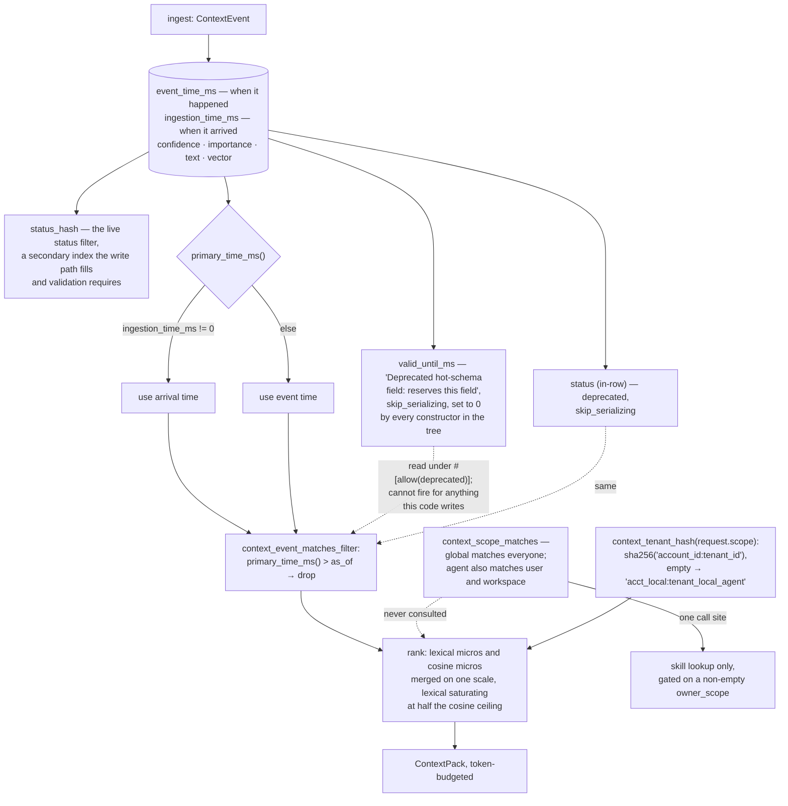

## 1. Executive Summary

TemporalStore is "[o]pen-source temporal infrastructure for LLM memory" —
Apache-2.0, Rust, workspace version 0.1.0, 646,492 lines across Rust, Python and
TypeScript of which 318,314 are the main Rust crate, with 2,404 test functions,
Rust and Python SDKs, Claude and Codex plugins, and a Redis-compatible RESP
surface. Its argument is consolidation: grounding an agent usually means running
a vector database, a feature store, a counter tier, a stream pipeline and a
bespoke memory service, and this collapses them into one time-aware engine.

Most of the tree is a distributed storage engine — WAL, append-structured page
store, block store, Raft, rebalancing, shared object storage — and it is built
with care. The memory layer sits on top in about eleven thousand lines: ingest
events, extract entities and summaries, embed, and return a ranked
token-budgeted ContextPack.

The ranking has the best-argued constant in this reading. Lexical scores are
mapped into the same micros scale as cosine similarity, saturating at half the
cosine ceiling, and the comment says why:

> "Kept below the 1_000_000 ceiling a perfect cosine match reaches so that, in a
> MIXED store, a strong semantic (embedded) match still outranks a purely lexical
> one, while un-embedded nodes remain rankable (never a flat 0) instead of
> collapsing to recency order."

A store where some rows are embedded and some are not is the normal state of any
system with a backfill, and "collapsing to recency order" is precisely what
happens when un-embedded rows score zero. This engine names the hazard and prices
around it.

The same habit shows in a comment on a boolean, explaining why it is defaulted
explicitly rather than with a bare `#[serde(default)]`: an absent field decoding
to `false` here "means 'the payload is elsewhere' and sends a reader to an
`external_object_uri` that such a record does not carry. This type's own
`Default` says true, and decoding it should not disagree with constructing it."

No marks, and the reasons are all in one place — a schema caught mid-migration,
with filters still reading fields the writers stopped filling.

**`valid_until_ms` has no writer.** It is the field that would close a world-time
window on a memory, and the schema comment reads "Deprecated hot-schema field:
reserves this field" — naming no replacement, unlike the neighbouring deprecated
fields, which point at `status_hash`, source indexes and link sidecars. Every
constructor in the repository sets it to `0`. Meanwhile
`context_event_matches_filter` still tests it:

```rust
if event.valid_until_ms != 0 && event.valid_until_ms <= as_of {
    return false;
}
```

For any record this code writes, that branch cannot fire. The status check three
lines above it has the same shape: it reads the in-row `status`, which is also
deprecated and `skip_serializing`, after status filtering moved to the
`status_hash` secondary index that the write path populates and validation
requires. Neither is broken behaviour in the live path — it is residue, and the
residue is in the one function a reader would open to learn what retrieval
excludes.

**Two time columns, one used.** `ContextEvent` carries `event_time_ms` and
`ingestion_time_ms`, which is the raw material for a second temporal axis. But
`primary_time_ms()` returns ingestion time whenever it is set, and that is what
the `as_of` comparison uses — so an as-of read answers what had *arrived* by a
moment, not what was *true* at it. The columns are there; the read collapses them.

**Scope is a string the caller may omit.** `context_scope_descriptor` parses an
owner scope into one of six layers with a precedence rank, and
`context_scope_matches` is a real visibility rule — a `global` candidate matches
everyone, and an `agent`-layer request also matches `user` and `workspace`. It
has one call site in the repository, in skill lookup, behind
`owner_scope_filter_enabled`, which is defined as:

```rust
let owner_scope_filter_enabled = !request.owner_scope.trim().is_empty();
```

An empty scope turns the filter off rather than narrowing to nothing. The
ContextPack retrieval path does not consult the rule at all. Isolation there is
`context_tenant_hash`, built from `account_id:tenant_id` on the caller's own
request, with `acct_local` and `tenant_local_agent` substituted when either is
empty — so it is a caller-supplied partition key with a shared default, which is
the pattern this atlas does not count as enforcement. No test in the tree asserts
that one tenant cannot read another's events.

**The benchmark is unusually candid and still prints the flattering number.**
Its headline row says the model works from 1,698,940 tokens under local replay
against ~1,333 for the managed pack: 99.92% fewer. The reproduce section passes
`--baseline-max-input-tokens 8000`, and a note explains why — the OSS reader's
window is 4,096, and feeding the full corpus would take "hours per query and past
the timeout — without the model attending to more than its window anyway" —
ending with the sentence that settles it:

> "The saving headline is still computed against the full corpus."

So the denominator is a corpus no arm read. The comparison that was actually run
is ~1,333 tokens against 7,879, which the table reports on its own row as 83%
fewer, and which is the number the experiment supports. Quality was graded with
the baseline seeing a recency slice — a limitation the document identifies in
italics as the wrong way to grade, in a different context, three paragraphs
earlier.

That combination is worth naming precisely, because it is not concealment. The
document records a shipped ingestion bug that "lost ~35% of real local context",
explains a methodology error it corrected, and closes with a scope note admitting
it has no skills tier and that "adoption claims should be scoped to memory +
resources, not skills". Very few projects in this corpus write that sentence. The
gap is between what the prose concedes and what the headline keeps, and it would
close by promoting the 83% row.

One practical note for a reader wanting to check any of it: the corpus is the
author's own local Codex and Claude history, so the reproduce command runs
against the reader's history rather than the published one. Two JSON result files
ship in the tree.

## 2. Mental Model

An **event** lands on a node's timeline with two timestamps.

A **pack** is what fits in a budget, ranked.

A **tenant** is whatever the caller said it was.

**Validity** is a column with no writer.



## 3. Architecture

| Area | Role |
| --- | --- |
| `engine/` | The temporal index, command validation, context reads |
| `wal.rs`, `block_store/`, `shared_store.rs` | Durability and the page store |
| `raft.rs`, `rebalance.rs`, `data_node/` | Replication and clustering |
| `proxy/` | The RESP surface and tenancy hashing |
| `context_workflow/` | Ingest, extraction, embedding, query, skills, resources |
| `sdk/`, `integrations/` | Rust and Python SDKs, Claude and Codex plugins |

## 4. Essential Implementation Paths

`context_workflow.rs:24-40` — the lexical-to-cosine scale mapping and its
argument.

`types.rs:323-380` — the event schema, its deprecations, and `primary_time_ms`.

`engine/context.rs:388-419` — what a filtered read actually excludes.

`context_workflow.rs:275-352` — the scope descriptor and the visibility rule.

`docs/benchmarks/README.md:73-91` — the reproduce command and the footnote under
it.

## 5. Memory Data Model

An event, a node, a segment, an entity, a summary. Confidence and importance are
floats used as filter floors — continuous weights, not states, so nothing here is
epistemic in the sense this atlas marks. Resource lifecycle records do carry
`stale` and `deleted` booleans, but their readers are the refresh scheduler and
two count fields in a report; no retrieval path consults them.

The embedding lives inline on the event, with a measured argument for the choice:
every vector is one-to-one with its owner, so a separate record "costs a key, a
BlockAddress and a page to store something with exactly one owner", and the text
is about 3% of a fetch already paid for. A record written before that change
"decodes with no vector and simply counts as un-embedded until the backfill
re-embeds it" — which is exactly the mixed-store condition the ranking constant
was tuned for.

## 6. Retrieval Mechanics

Lexical and cosine scores merged on one micros scale, chunked embedding lookups
at a thousand refs so "a namespace with more nodes than the cap is still fully
scored instead of silently falling back to lexical ranking", and a token budget
with a reservable fraction for the current session.

## 7. Write Mechanics

Ingest, extract, embed inline, and mark dirty on failure with a reason code the
drainer ignores — "[p]urely diagnostic; the drainer treats every pending marker
identically" — which is the honest way to ship a field you have not yet acted on.

## 8. Agent Integration

Plugins for Claude and Codex, agent hooks, two SDKs, and a RESP surface that
existing Redis clients can speak today. The consolidation pitch is strongest
here: one endpoint for memory, feature aggregates and control state is a real
operational simplification whatever one concludes about the memory semantics.

## 9. Reliability, Safety, and Trust

Durability is the strong suit — WAL, checksums, crash-safe reload, fault
injection, a flush gate, durability metrics. What is absent is memory-level
trust: no provenance class, no supersession, no retraction, no record of what a
memory said before it changed, and no assertion anywhere that a tenant cannot see
another's events.

`ContextPackAudit` records what a pack was assembled from, which is a retrieval
audit rather than a mutation record, and a useful one — it is the artifact that
lets somebody ask later why a particular answer had the context it did.

## 10. Tests, Evals, and Benchmarks

2,404 test functions, with the engine suite alone running to tens of thousands of
lines. The benchmark documentation is discussed above; the short version is that
its methodology notes are more careful than its headline table, and the two
disagree by an order of magnitude.

Nothing was built or run for this reading.

## 11. For Your Own Build

Scale your lexical and vector scores onto one axis deliberately, and write down
the ceiling you chose. A mixed store is the normal state, and un-embedded rows
scoring zero silently becomes recency ranking.

Delete a deprecated field from the filter when you deprecate it. A predicate on a
column nothing writes is worse than no predicate, because a reader auditing what
recall excludes will believe it.

Decide which clock an as-of read means. Two timestamp columns and a helper that
prefers one of them is a bitemporal store that answers only transaction-time
questions.

Make an empty scope narrow, not widen. `!scope.is_empty()` as the gate turns a
forgotten parameter into an unfiltered read.

And put the number your experiment supports in the headline row. The 83%
comparison here is real, measured and good; the 99.92% divides by a corpus
nothing read, and the document already knows it.

## 12. Open Questions

Whether world-time validity is coming back. The field reserves itself and names
no successor, while the neighbouring deprecations each point at one.

Whether tenancy is enforced above this layer. The hash is caller-supplied here
and the comment points at a Python control plane that computes the same digest;
what authenticates the caller's claim to a tenant was not traced.

What the LoCoMo and LongMemEval hit@k figures rest on. They appear on the
project's site; the artifacts in the tree cover the local three-arm sweep.

## Appendix: File Index

| Path | What to read it for |
| --- | --- |
| `crates/temporalstore-rust/src/context_workflow.rs:24-40` | The best-argued constant here |
| `crates/temporalstore-rust/src/types.rs:323-380` | Two clocks, and four deprecated fields |
| `crates/temporalstore-rust/src/engine/context.rs:388-419` | A filter reading what nothing writes |
| `crates/temporalstore-rust/src/context_workflow/skill.rs:190-219` | A scope rule an empty string disables |
| `crates/temporalstore-rust/src/proxy/context.rs:182-195` | Tenancy from the caller, with a shared default |
| `docs/benchmarks/README.md:73-91` | The footnote that reprices the headline |

## History

**2026-09-16** — [`5eb2c9145d83ca851ef91a0dfe1639e92664303f`](https://github.com/matrixarkai/TemporalStore/commit/5eb2c9145d83ca851ef91a0dfe1639e92664303f) — first reading, at a commit dated 15 September 2026. Screened before opening, from a shallow clone: thirteen files scanned, two auto-run surfaces, two build-time execution points, no unpinned surfaces and seven dependency files inside the seven-day cooldown. Nothing was installed, built or run, and no benchmark was executed.
