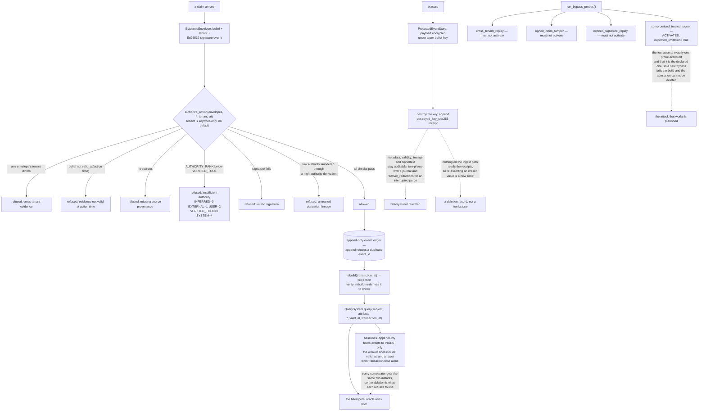

## 1. Executive Summary

Temvera is "[t]emporal, provenance-aware memory infrastructure for AI agents" —
Apache-2.0, Python, version 0.0.1, 11,702 lines across 93 files, and the artifact
behind a PVLDB Experiment, Analysis & Benchmark paper whose title is a thesis
this atlas has been testing one repository at a time:

> *Temporal Fields Are Not Temporal Correctness: Measuring Bitemporal and
> Deletion Semantics in Deployed Agent Memory.*

The repository is two things at once. It is a measurement harness for deployed
systems — with adapters for the graph and vector memories the paper compares —
and it is a reference substrate implementing what the paper argues for: an
append-only belief ledger with valid and transaction time, signed evidence,
ranked authority, tenant-scoped authorization, and erasure by key destruction.

**The single most unusual thing in the tree is that it publishes the bypass that
works.** `run_bypass_probes` returns four adversarial results, each carrying
whether it activated and whether that activation was expected:

```python
BypassResult("compromised_trusted_signer", compromised_allowed, True),
BypassResult("cross_tenant_replay", cross_allowed, False),
BypassResult("signed_claim_tamper", tampered_allowed, False),
BypassResult("expired_signature_replay", expired_allowed, False),
```

Three must not activate. The fourth does, because a policy anchored on a
signer's public key cannot survive that key being stolen, and the module's own
docstring calls it "expected trust-root failure". `tests/test_bypass.py` then
asserts that exactly one probe activated and that it is the one declared as a
limitation — so a newly-working bypass fails the suite, and the admission cannot
be quietly removed without the test noticing either.

**The artifact discipline is the second thing.** "Every number the paper reports
is an aggregation over sealed per-case transcripts, so **the whole paper can be
checked without an API key, a database server, or a dataset download**."
`verify_paper_claims.py` pairs "each figure as printed in the paper with a
recomputation from a sealed run, and fails if either half moves" — which catches
a silently corrected number as readily as a corrupted run. Verification and
regeneration are deliberately decoupled, "so you can confirm what we computed
before deciding whether to re-run generation."

**The bitemporal design is expressed as an interface rather than a schema.** The
`QuerySystem` protocol makes both instants mandatory — `query(subject,
attribute, *, valid_at, transaction_at)` — and the baselines are then defined by
which one they discard. `AppendOnlyBaseline` is built by filtering the event
stream to `INGEST` only, so it "[i]gnore[s] revision, expiry, and purge
operations"; the weaker comparators accept `valid_at` and execute `del valid_at`
before answering. Every system in the comparison is handed the same two
instants, and the ablation is what each one refuses to use.

## 2. Mental Model

A **belief** is an event, not a row, and it carries who asserted it.

An **authority** is a rank, and below the minimum the evidence cannot act at all.

A **baseline** is the oracle with one axis deleted, literally.

A **purge** destroys a key and leaves a receipt; the ciphertext stays in history.

A **probe** that works is published beside the ones that fail.



## 3. Architecture

| Area | Role |
| --- | --- |
| `src/temvera/model.py` | The belief, its two time axes, and the authority enum |
| `src/temvera/store.py` | The append-only ledger, rebuild, verify, and redaction |
| `src/temvera/protected_store.py` | Per-belief encryption and erasure by key destruction |
| `src/temvera/governance.py`, `security.py` | Signed envelopes, authority ranking, lineage laundering |
| `src/temvera/bypass.py` | Four adversarial probes, one of which is meant to succeed |
| `src/temvera/evaluation.py` | The oracle and the baselines defined against it |
| `experiments/`, `scripts/` | Sealed runs, and the scripts that recheck the paper from them |

## 4. Essential Implementation Paths

`src/temvera/bypass.py:51-56` with `tests/test_bypass.py:8-11` — the published
limitation, and the assertion that keeps it the only one.

`src/temvera/evaluation.py:14-24` — both instants made mandatory in the
protocol, which is what makes the ablations comparable.

`src/temvera/evaluation.py:45-51` — `del valid_at`, an ablation written as one
statement.

`src/temvera/governance.py:69-97` — six refusals in order, each with the reason
it returns.

`src/temvera/protected_store.py:14-21` — keeping secrets out of Git history
while leaving the ledger auditable.

`src/temvera/store.py:109-175` — a two-phase redaction with a recovery path.

## 5. Memory Data Model

A `Belief` carries subject, attribute and value; `valid_from` and `valid_to` for
world time; `recorded_at` and `last_confirmed_at` for the store's own time; an
`Authority`; `sources`; `derived_from` lineage; a status; and a supersession
link. `MemoryEvent` wraps it with an operation — ingest, revision, expiry, purge
— and the ledger of events is the store, with the queryable projection rebuilt
from it at a chosen transaction instant.

## 6. Retrieval Mechanics

Exact, lexical and vector retrieval over the rebuilt projection, with calibrated
fusion and reranking described in the research program. Every query takes both
instants, so point-in-time retrieval is the default interface rather than an
extra method.

## 7. Write Mechanics

Ingest is gated before it lands: signature, tenant, validity at action time,
source presence, authority rank, and derivation lineage, each returning its own
reason string. The ledger refuses a duplicate `event_id`. Revision and expiry
are new events rather than edits, so the projection changes and the history does
not.

## 8. Agent Integration

A `temvera` CLI over both halves — `generate` and `benchmark` for the local
deterministic substrate, `verify-artifacts` for the sealed runs — plus adapters
for the external systems the paper measures. There is no server and no MCP
surface; this is a research package.

## 9. Reliability, Safety, and Trust

The strong parts are the refusal-with-reason gate, the signed envelopes, the
published bypass, and an erasure design that answers the usual objection to
append-only storage in Git. The honest weak parts are stated by the project
itself: no production readiness, a provisional API, and claims outside the
frozen fixtures held as hypotheses.

## 10. Tests, Evals, and Benchmarks

Thirty sealed runs, 87 printed figures each paired with a recomputation, a
deterministic test suite, and a lifecycle benchmark that the README is careful
to call "a harness identifiability check, not a performance or novelty result."
The forgetting evaluation adapts a public operation contract rather than
inventing a private one.

## 11. For Your Own Build

Publish the probe that works. A suite of attacks that all fail is a suite that
has not been pushed hard enough, and an expected-limitation flag with a test
behind it is how you keep the admission from decaying.

Make both instants mandatory in the query signature. If `as_of` is optional,
most callers will omit it and the path will rot; if it is required, a system
that ignores it has to say so with a statement you can point at.

Separate verifying what was computed from re-running the computation. The first
should need nothing but the repository.

## 12. Open Questions

Whether the deletion receipts should be consulted on ingest. The paper is about
deletion semantics, and the substrate's own erasure leaves a record that nothing
reads back, so a value destroyed on Monday can be re-asserted on Tuesday without
contradiction.

Whether tenant scoping is meant to reach retrieval. It is enforced where
evidence acts, which is the higher-stakes path, but a search that returns
another tenant's belief without authorizing it has still disclosed it.

## Appendix: File Index

| Path | What to read it for |
| --- | --- |
| `src/temvera/bypass.py:51-56` | Four probes, and the one that is supposed to succeed |
| `tests/test_bypass.py:8-11` | The assertion that keeps the admission honest |
| `src/temvera/evaluation.py:14-51` | Two mandatory instants, and baselines that discard one |
| `src/temvera/governance.py:69-97` | Six refusals, each with its reason |
| `src/temvera/protected_store.py:14-21` | Erasure that survives an append-only history |

## History

**2026-09-16** — [`75243a3dbc3dfeda3613fb69e940c774f5ff4e5b`](https://github.com/suanlab/temvera/commit/75243a3dbc3dfeda3613fb69e940c774f5ff4e5b) — first reading, at a commit dated 13 September 2026. Screened before opening, from a shallow clone: four files scanned, no auto-run surfaces, no build-time execution points, one unpinned dependency surface and one dependency file inside the seven-day cooldown. `AGENTS.md` and `CLAUDE.md` are addressed to a reading agent and were recorded as data. Nothing was installed, built or run, and none of the paper's verification scripts were executed, so the artifact claims described here are read from the repository rather than reproduced.
