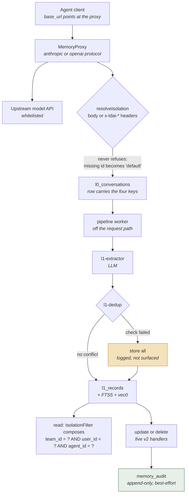

## 1. Executive Summary

TencentDB Agent Memory is a four-service memory platform — `MemoryCore`, `MemoryKnowledge`, `MemoryPanel` and `MemoryProxy` — that an agent reaches by pointing its model `base_url` at the proxy. The README's claim for that arrangement is the design in one line: *"One Proxy, unchanged protocol, zero-code integration."* No plugin, no hook, no MCP server.

**The repository contains two histories that share no commits.** `main` carries the v0.x and v1.x line; the default branch is `feat/server_team`, which carries the v2 releases and has no common ancestor with `main` — `GET /repos/.../compare/main...feat/server_team` answers *"No common ancestor"*. The tags settle which is current: `v2.0.0` through `v2.0.2-beta.1` sit on the default-branch lineage, and `v0.3.6` is thirty-four commits behind `main`. This report reads the default branch, which is what a reader following the README's install instructions gets.

Two things are worth studying here:

- **Isolation is a predicate, not a tag.** `l0_conversations` and `l1_records` each carry `team_id`, `user_id`, `agent_id`, `session_id` and `task_id`, the keys are mirrored into the FTS5 virtual tables so lexical recall can be filtered on them, and `IsolationFilter` composes them into the `WHERE` clause of the vector, lexical and delete paths rather than filtering results afterwards.
- **Every mutation is journalled.** `memory_audit` takes one append-only row per L1/L2/L3 update or delete, carrying the record id, the layer, the action, the four isolation keys, the record version and the originating request id. All five mutating handlers write one, and nothing in the tree deletes from the table.

Two things are cautionary, and the second is the more serious:

- **Deduplication stores everything when it fails.** `l1-dedup.ts` catches a failed batch conflict check and logs *"Batch conflict detection failed, defaulting all to store"*; a parse failure takes the same route. The safe direction for a memory store is arguable, but the failure is silent to the caller.
- **The repository ships no tests.** `MemoryCore`, `MemoryPanel` and `MemoryProxy` each declare `"test": "vitest run"` and each carries a `vitest.config.ts` whose `include` names `src/**/*.test.ts` and `__tests__/**/*.test.ts`. No file matching either pattern exists anywhere in the tree, and no `*.spec.ts` exists either. Every behaviour this report describes — the isolation predicate, the audit append, the dedup fallback, the skill version retention — is asserted by nothing.

That last point sets the ceiling on what any mark here can mean. Both marks below rest on mechanism read from source, and neither has a committed case behind it.

## 2. Mental Model

Four layers and a skill store, all keyed on the same four-part isolation tuple:

| Layer | What it holds | Where it lives on the default backend |
|---|---|---|
| L0 | Raw conversation rows, one per message | `l0_conversations` in SQLite, with FTS5 and a `vec0` virtual table |
| L1 | Extracted memory records | `l1_records` in SQLite, same indexing |
| L2 | Scene artefacts | Files through the storage adapter — the profiles table exists only on the Tencent VectorDB backend |
| L3 | Persona artefacts | As L2 |
| Skills | Versioned procedural content | `skills`, one row per version, head-flagged |

The isolation tuple is `team_id` / `user_id` / `agent_id` / `task_id`, with `session_id` beside it. It is resolved once per request and then carried everywhere: into the row on write, into the `WHERE` clause on read, into the audit entry on mutation, and into the storage prefix for the file-backed layers.



The highlighted paths are the two ends of the trust story. A mutation leaves a
durable record of itself; a failed conflict check leaves nothing but a log line
and a row that may duplicate one already there.

## 3. Architecture

- `MemoryCore` (about 106,000 lines of TypeScript across 340 files): the store, the extraction pipeline, the skill subsystem, the v2 HTTP gateway, and adapters for SQLite, MongoDB and Tencent VectorDB.
- `MemoryProxy` (about 50,000 lines): the reverse proxy that agent clients point at, speaking both the Anthropic and OpenAI protocols.
- `MemoryPanel` (about 25,000 lines): the web panel, its own HTTP routes, and a React graph view.
- `MemoryKnowledge` (about 12,000 lines): wiki and code-graph builders, kept asynchronous by the README's own note.
- `sdk/` and `MemoryCore/{openclaw,pi}-plugin/`: client libraries and the two plugin integrations that remain beside the proxy.

`deploy/global-images/` ships `start-all.sh`, `start-all-mongo.sh`, per-service start scripts, `stop-all.sh` and `verify.sh`, which is how the README's one-command install works.

## 4. Essential Implementation Paths

### Interception instead of integration

`MemoryProxy/src/routes/whitelist.ts` recognises client prefixes with `AGENT_PREFIX_RE` — `claude-code`, `codebuddy`, `codex`, `cursor`, `anthropic`, `openai`, `pi` — and routes on both `/v1/chat/completions` and `/responses`, choosing the auth header by protocol (`x-api-key` for Anthropic, `Authorization: Bearer` for OpenAI). Two whitelist entries exist per upstream because clients differ on whether they append `/v1` themselves.

This is the design's sharpest edge in both directions. It removes integration work entirely — nothing has to be installed into the agent — and it puts a memory service in the path of every model request, including the credential. The upstreams are whitelisted rather than arbitrary, which bounds where traffic can be forwarded.

### The isolation tuple, resolved once

`resolveIsolation` (`MemoryCore/src/gateway/v2-schemas.ts:364-389`) reads `team_id`, `user_id`, `agent_id`, `session_id` and `task_id` from the request body, falling back to `x-tdai-team-id` and its siblings. Its signature returns `{ ok: true }` unconditionally: a missing id becomes the default bucket rather than a refusal, and the router's own comment says so — *"resolveIsolation() defaults missing fields to the default bucket."*

So the boundary is real in the store and asserted by the caller at the edge. A client that sends no headers is not rejected; it is placed in `default` alongside every other client that sent none.

### Isolation reaches the SQL

`l1_records` and `l0_conversations` carry the keys as columns, added by an idempotent online migration whose comment records why — *"pre-isolation DBs lack user_id/agent_id columns"* — with existing rows backfilled to `DEFAULT_ISOLATION_ID`. Composite indexes cover `(team_id, agent_id, updated_time)`, `(user_id, agent_id, session_id)` and their neighbours.

On read, `conditions.push("team_id = ?")` and its siblings compose into the query in four separate places, and `IsolationFilter` is a parameter of `searchL1Vector`, `deleteL1` and `deleteL1Batch`. The keys are also mirrored into the FTS5 virtual tables, with the comment giving the reason: *"user_id / agent_id mirrored into FTS so post-recall isolation"* can be applied to a lexical hit.

One path is weaker than the rest and says so: the legacy `/conversation/query` fallback fetches up to 1000 rows and then filters them in JavaScript, which is a cap and a post-filter rather than a predicate.

### The audit journal

`recordAudit` in `MemoryCore/src/gateway/v2-router.ts:184-215` documents its own contract: the L0–L3 tables are untouched, the function only appends, the ids come from the resolved isolation context, L0 does not participate because it is an immutable stream, and five mutation handlers each call it once. They do — `atomic/update`, `atomic/delete`, `scenario/write`, `scenario/rm` and `core/write`, at lines 1112, 1325, 1977, 2026 and 2122 — and `chat-memory-handlers.ts` appends a delete row per layer when a memory is cleared.

Two properties make this a journal rather than a gesture. `audit_id` is a fresh UUID per event, so the `INSERT OR REPLACE` never replaces an existing row; and no `DELETE FROM memory_audit`, purge or retention job exists anywhere in the tree. All three store backends implement it.

Two properties limit it. The append is wrapped in try/catch and a failure only warns — the comment is explicit that audit loss is tolerated rather than fatal — so a mutation can commit with nothing behind it. And `queryAudit` is implemented on the interface and in all three backends but is called by nothing: the journal is written and no shipped surface reads it.

### Deduplication that fails open

`MemoryCore/src/core/record/l1-dedup.ts` catches a failed batch conflict check and continues: *"Batch conflict detection failed, defaulting all to store"*. A parse failure takes the same path — the code's own comment reads *"Fallback: store all memories when parsing fails."* Embedding failures are separately non-fatal, with FTS left to carry recall.

Storing a possible duplicate is the safer of the two directions for a memory system. What is missing is any signal: the caller receives success, and only a log line distinguishes a clean write from a write that skipped its conflict check entirely.

### Skills supersede by head flag

`skills` holds one row per version with `UNIQUE(skill_id, version)` and an `is_head` flag, and a partial unique index enforces one active head per `(team_id, owner_agent_id, name)`. `skill-versioning.ts` keeps a recent window of non-head versions and physically deletes the rest, and the store interface's delete is guarded to `is_head=0` rows only.

This is supersession with bounded history, not a tombstone: the retained rows are previous *versions of an accepted skill*, keyed on the skill, and nothing consults them to refuse a later write.

## 5. Memory Data Model

`l1_records` is the memory unit:

```sql
CREATE TABLE IF NOT EXISTS l1_records (
  record_id TEXT PRIMARY KEY,
  content TEXT NOT NULL,
  type TEXT DEFAULT '',
  priority INTEGER DEFAULT 50,
  scene_name TEXT DEFAULT '',
  session_key TEXT DEFAULT '',
  session_id TEXT DEFAULT 'default',
  team_id TEXT DEFAULT 'default',
  task_id TEXT DEFAULT '',
  user_id TEXT NOT NULL DEFAULT 'default',
  agent_id TEXT NOT NULL DEFAULT 'default',
  version INTEGER NOT NULL DEFAULT 0,
  timestamp_str TEXT DEFAULT '',
  timestamp_start TEXT DEFAULT '',
  timestamp_end TEXT DEFAULT '',
  created_time TEXT DEFAULT '',
  updated_time TEXT DEFAULT '',
  metadata_json TEXT DEFAULT '{}'
)
```

What it carries: a monotonic `version`, a `priority`, a scene name, and the isolation tuple. What it does not carry:

- **No status.** Nothing separates candidate from confirmed from superseded from rejected. `version` counts edits; it does not describe belief.
- **No confidence or source-quality field.** Provenance exists as the L0 rows the record was extracted from, which is stronger than a score, but there is no way to express *how sure* the extractor was.
- **No validity time.** `timestamp_start` and `timestamp_end` describe the conversation window the record came from, and `created_time` / `updated_time` describe the row. There is no separate axis for when a fact was true as against when it was recorded, so a corrected fact overwrites rather than closing an interval.

`memory_audit` is the only place a superseded state survives at all, and it stores the *event* — record id, layer, action, version, timestamp — not the content that was replaced.

## 6. Retrieval Mechanics

FTS5 and `sqlite-vec` back the L0 and L1 tables, and `getCapabilities()` reports `vectorSearch` and `ftsSearch` from what actually initialised, with `nativeHybridSearch` false on SQLite. The Tencent VectorDB backend is where native hybrid and profile rows live.

Every recall path takes the isolation filter. The vector path takes it as a parameter; the lexical path composes it into the SQL and relies on the keys mirrored into the FTS tables; the delete paths take it too, which is the property that matters most — a scoped delete cannot reach outside its scope.

`conversation-search.ts` exposes conversation lookup as a tool, so an agent can reach L0 directly rather than only through what extraction produced.

## 7. Write Mechanics

Capture happens at the proxy. `/conversation/add` writes a group of L0 rows in one call, each stamped with the resolved tuple.

Extraction happens off the request path: `services/pipeline-worker.ts` (1,313 lines) and `services/timer-scanner.ts` drive L1 extraction, embeddings, and scene and persona generation, with `worker-permit-pool.ts` bounding concurrency. `core/record/l1-extractor.ts` runs the LLM extraction, `l1-dedup.ts` decides what is new, and `l1-writer.ts` performs the write.

This is the right shape — nothing in the user's turn waits on an LLM extraction — and it is also where the fail-open dedup lives, in a component whose failures reach a log rather than a caller.

## 8. Agent Integration

The proxy is the headline path and needs no cooperation from the agent beyond a `base_url`. Beside it the repository ships TypeScript and Python SDKs under `sdk/memory-core/`, an OpenClaw plugin and a Pi plugin under `MemoryCore/`, and a panel at `localhost:8125`.

`MemoryKnowledge` adds wiki and code-graph building; the README notes both are asynchronous and that CodeGraph currently prioritises public HTTPS repositories. The README also states that Hub asset binding is manual and *"fully automated memory routing is still under iteration"*, which is an unusually direct statement of what is not finished.

## 9. Reliability, Safety, and Trust

Strengths:

- The isolation key is a query predicate on the read paths and the delete paths, not a post-filter, and it is indexed for the shapes the code actually queries.
- The audit journal is append-only in fact and not only in intent: fresh ids, no delete path, implemented in all three backends.
- Extraction is off the request path with bounded worker concurrency.
- Storage backends are pluggable behind a store interface with a declared contract file, and the MongoDB backend is off by default and documented as experimental — including the honest warning in the changelog that switching backends does not migrate data.
- Skill versions supersede through a head flag with a partial unique index, so two active heads for one name are excluded by the schema rather than by convention.

Gaps:

- **Nothing is tested.** Three packages declare a test script and a vitest config; no test file exists. This is the finding that qualifies every other one on this page.
- **The isolation edge never refuses.** `resolveIsolation` fills a missing id with a default rather than rejecting, and the caller asserts its own team, user and agent identity. The store-side boundary is genuine; the question of *who may claim to be this team* is answered somewhere else, or not at all.
- **The audit is best-effort.** A failed append warns and the mutation proceeds, so the journal cannot be relied on to be complete — which is the property an audit log is usually for.
- **The journal has no reader.** `queryAudit` exists in every backend and is called by nothing shipped.
- **Deduplication fails open silently.** The caller cannot distinguish a conflict-checked write from an unchecked one.
- **No verification tier.** Extracted records are authoritative on write. There is no candidate state, no rejection record, and nothing that would stop a corrected fact being re-extracted from the same L0 rows on the next pass.
- **The benchmark claim has no artefact.** The README publishes PersonaMem at 48% without and 76% with, *"+59%"* relative. `rg -ri personamem` finds the string only in `README.md` and `README_CN.md`: no harness, no configuration, no result file, and no version of the benchmark named.

## 10. Tests, Evals, and Benchmarks

There are no tests. Established three ways, each re-runnable:

```sh
find . -path ./node_modules -prune -o \( -name '*.test.ts' -o -name '*.spec.ts' \) -print   # 0
cat MemoryCore/vitest.config.ts   # include: ["src/**/*.test.ts", "__tests__/**/*.test.ts"]
find . -not -path '*/node_modules/*' -iname '*test*' -type f   # 3 vitest configs, 1 smoke-test
                                                               # shell script, 1 cleanup script
```

`MemoryCore`, `MemoryPanel` and `MemoryProxy` each declare `"test": "vitest run"`, and `vitest.config.ts` in each names patterns that match nothing. There are contract files — `core/store/__contract__/memory-store.contract.ts`, `metadata/store/metadata-store.contract.ts`, `core/storage/__contract__/storage-backend.contract.ts` — which describe what a backend must do; nothing executes them.

No suite was run for this review, and there was none to run.

The PersonaMem row in the README is the only quantitative claim, and nothing in the repository supports it. A relative improvement of +59% on a memory benchmark is exactly the kind of number that deserves a committed harness, and the atlas cannot check it.

## 11. For Your Own Build

### Steal

- **Carry the scope key into the SQL.** Composing `team_id = ?` into the query — and into the *delete* — is what makes a boundary hold under `LIMIT`, where a post-filter silently returns fewer rows to one caller than another.
- **Mirror the scope key into the full-text table.** A lexical index that cannot see the tenant key forces exactly the post-filter above.
- **Append a mutation journal with a fresh id per event and no delete path.** The absence of a purge is what makes it a journal.
- **Keep extraction off the request path**, with a permit pool bounding worker concurrency.
- **Say what is experimental in the changelog, including that switching backends does not migrate data.**
- **Enforce one active head per name with a partial unique index** rather than with application code.

### Avoid

- **A boundary resolver that cannot refuse.** Defaulting a missing tenant id to a shared bucket turns a missing header into a silent merge.
- **A best-effort audit.** If a mutation may commit without its journal row, the journal answers a different question than the one it looks like it answers.
- **A journal nothing reads.** Write the reader, or the log is a cost with no consumer.
- **Failing open without telling the caller.** Store-everything is a defensible choice; not signalling it is not.
- **Publishing a benchmark number with no harness in the tree.**
- **Shipping three test configurations and no tests.** The configuration is a claim about rigour that the tree does not keep.

### Fit

Borrow: the isolation-as-predicate pattern and its index set; the audit table's shape; the proxy-interception idea if integration cost is what blocks adoption of your memory layer.

Do not copy: the resolver's permissive default; the dedup fallback's silence; the four-layer split without a status field, which leaves the audit table as the only record that anything ever changed.

## 12. Open Questions

- Who is allowed to claim a `team_id`? The store enforces the boundary; the resolver accepts whatever arrives, and the answer must live in a layer this reading did not find.
- Should a failed audit append fail the mutation? Tolerating loss is a deliberate choice recorded in a comment, and it is the choice that decides what the table can be used for.
- What reads `queryAudit`? It is implemented three times over and called nowhere.
- Should a failed conflict check surface in the response rather than only in a log?
- What would the PersonaMem number look like with a committed harness, and against which version of the benchmark?
- Do the two histories in this repository ever converge, and which one receives a security fix?

## Appendix: File Index

- Store, schema, isolation columns, audit table: `MemoryCore/src/core/store/sqlite/memory-store.ts`; alternate backends under `MemoryCore/src/core/store/{mongodb,tcvdb}/`.
- v2 HTTP gateway and the five mutating handlers: `MemoryCore/src/gateway/v2-router.ts`; isolation resolution: `MemoryCore/src/gateway/v2-schemas.ts`.
- Clear-memory audit path: `MemoryCore/src/gateway/chat-memory-handlers.ts`.
- Extraction pipeline: `MemoryCore/src/core/record/{l1-extractor,l1-dedup,l1-writer,l1-reader}.ts`, `MemoryCore/src/services/{pipeline-worker,timer-scanner,worker-permit-pool}.ts`.
- Skills: `MemoryCore/src/core/skill/{skill-core,skill-versioning,skill-store-ddl,skill-store.interface}.ts`.
- Proxy routing and protocol whitelist: `MemoryProxy/src/routes/whitelist.ts`.
- Store contracts, executed by nothing: `MemoryCore/src/core/store/__contract__/memory-store.contract.ts`, `MemoryCore/src/metadata/store/metadata-store.contract.ts`, `MemoryCore/src/core/storage/__contract__/storage-backend.contract.ts`.
- Deployment: `deploy/global-images/`.

**Searches recorded for the negative claims**

```sh
find . -path ./node_modules -prune -o \( -name '*.test.ts' -o -name '*.spec.ts' \) -print   # 0: no tests
rg -n "DELETE FROM memory_audit|deleteAudit|purgeAudit" --type ts    # 0: the journal is append-only
rg -n "queryAudit" --type ts        # interface + 3 backends, no caller: nothing reads the journal
rg -ri "personamem" .               # README.md and README_CN.md only: no harness behind the number
rg -n "tombstone" --type ts         # 0
rg -n "valid_from|validFrom|as_of|asOf|bitemporal" --type ts   # 0: no validity axis
```

## History

**2026-09-09** — [`c387ea4534d08f3204d50a137ef55206d7c50301`](https://github.com/TencentCloud/tencentdb-agent-memory/commit/c387ea4534d08f3204d50a137ef55206d7c50301) — second reading, and the first of the v2 line. Screened before anything was read: no auto-run surface, two build-time execution surfaces, nine unpinned surfaces and fourteen manifests inside the seven-day cooldown; nothing was installed and no suite was run — there was none to run.

The previous reading described a memory plugin for OpenClaw and Hermes, pinned at `45e6e80a`. That commit is still an ancestor of `main`, six commits behind it; what changed is which branch GitHub serves as the default. `main` and `feat/server_team` share no commits — the compare API answers *"No common ancestor"* — and the v2 tags sit on the second lineage. So the subject of this report is not a later state of the code the first reading covered; it is a different codebase in the same repository, and the earlier pin remains readable on `main` for anyone who wants the plugin.

The whole report is rewritten against that codebase. It is four services totalling roughly 190,000 lines of TypeScript, reached by pointing an agent's model `base_url` at a reverse proxy rather than by installing anything.

Two marks are added, both new mechanisms and neither present in the code the first reading saw. `scope_enforced` rests on `team_id`, `user_id`, `agent_id`, `session_id` and `task_id` as columns on `l0_conversations` and `l1_records`, mirrored into the FTS5 tables and composed into the `WHERE` clause of the lexical, vector and delete paths — with its two limits stated, that the resolver fills a missing id with a default bucket rather than refusing, and that one legacy read path post-filters a 1000-row page. `audit_log` rests on `memory_audit`, one append-only row per L1/L2/L3 update or delete written by all five mutating handlers, with a fresh id per event and no delete path in the tree — and with its two limits stated, that a failed append only warns while the mutation proceeds, and that `queryAudit` is implemented three times and called by nothing. `tombstone`, `trust_state`, `bitemporal`, `human_review` and `negative_eval` are each absent: no rejected-value record exists, `version` counts edits rather than describing belief, the timestamps describe the conversation window and the row rather than validity, and no committed case asserts anything at all.

That last clause is the reading's largest finding. `MemoryCore`, `MemoryPanel` and `MemoryProxy` each declare `"test": "vitest run"` and carry a `vitest.config.ts`, and no file matching either configured pattern exists anywhere in the tree. Three store contract files describe what a backend must do and nothing executes them.

One criticism carries over from the first reading onto code that shares none of its history. The README publishes a PersonaMem result — 48% without, 76% with, *"+59%"* — and `rg -ri personamem` finds the string in `README.md` and `README_CN.md` and nowhere else. The fail-open deduplication carries over too, in a component that did not exist at the previous pin.

**2026-07-26** — [`45e6e80ae2e63b65fad0d89f5e13171229c8f295`](https://github.com/TencentCloud/tencentdb-agent-memory/commit/45e6e80ae2e63b65fad0d89f5e13171229c8f295) — first reading.
