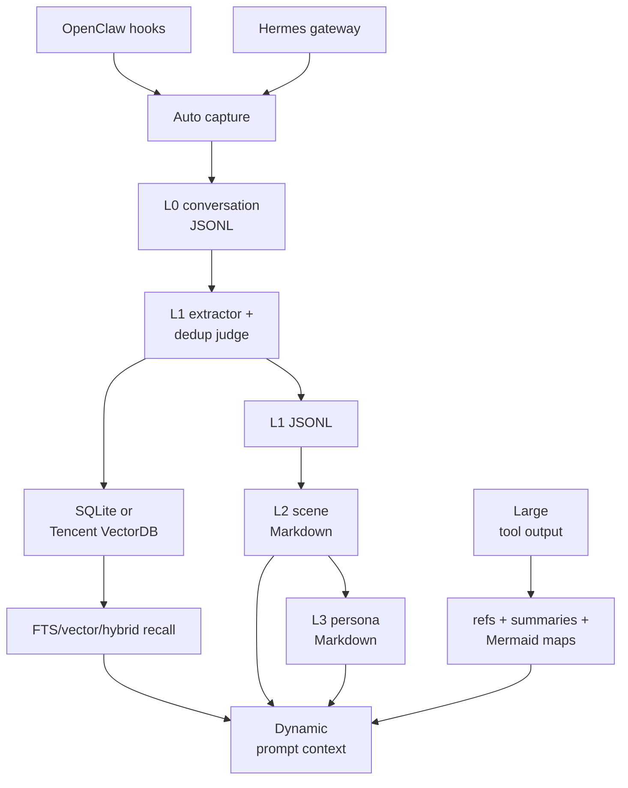

## 1. Executive Summary

TencentDB Agent Memory is an OpenClaw and Hermes-oriented memory plugin with
two related systems:

- Long-term memory: raw conversations (`L0`), structured memory records (`L1`),
  scene documents (`L2`), and a persona (`L3`).
- Short-term symbolic offload: large tool outputs are stored as files, reduced
  to JSONL summaries, and organized into Mermaid maps that the agent can
  navigate and drill into.

This layered, progressively disclosed context model is the repository's best
idea. Dynamic L1 recall is kept separate from stable scene/persona context, and
raw evidence remains available for drill-down.

The weakest areas are consistency, trust, and substantiation. L1 writes span
JSONL and a vector store without a single atomic transaction. Deduplication
fails open by storing every candidate when recall or LLM judgment fails. The
plugin has no first-class correction/forget tool or claim-verification state,
and the headline benchmark gains in the README are not backed by an evaluation
harness or result artifacts in this repository.

The inspected package version is `0.3.6` (2026-07-19).

## 2. Mental Model

The long-term hierarchy is:

- `L0`: verbatim user and assistant messages in daily JSONL files.
- `L1`: typed records for persona facts, episodes, and instructions.
- `L2`: Markdown scene documents synthesized from related L1 records.
- `L3`: a durable persona document synthesized from changed scenes.

The short-term offload hierarchy is:

- Raw tool outputs in `refs/*.md`.
- Compact JSONL summaries.
- Active and historical Mermaid canvases.
- Node IDs that let the agent drill back to evidence.

Typical long-term flow:

```text
successful agent turn -> L0 append -> L1 extraction
-> recall candidates -> LLM store/update/merge/skip
-> JSONL + SQLite/VectorDB
-> scene extraction -> persona regeneration
-> before-prompt recall with a context budget
```

The system is better understood as a context compiler than a single database:
it transforms conversational evidence into increasingly stable, compact files
and records.

## 3. Architecture



Storage is pluggable through `IMemoryStore`. SQLite uses WAL, FTS5, and
`sqlite-vec`; Tencent Cloud VectorDB provides the remote alternative. JSONL and
Markdown retain human-readable evidence and generated projections.

The OpenClaw plugin registers capture/recall hooks and two search tools. The
symbolic offload engine is activated only when the corresponding OpenClaw
context-engine slot is assigned.

## 4. Essential Implementation Paths

Long-term capture and storage:

- `src/core/hooks/auto-capture.ts`: checkpointed capture and deferred work.
- `src/core/conversation/l0-recorder.ts`: sanitized daily conversation JSONL.
- `src/core/record/l1-extractor.ts`: LLM extraction of scenes and records.
- `src/core/record/l1-dedup.ts`: candidate recall and LLM dedup decisions.
- `src/core/record/l1-writer.ts`: JSONL and store writes.
- `src/core/store/types.ts`: storage interface.
- `src/core/store/sqlite.ts`: SQLite, FTS5, and vector implementation.

Recall:

- `src/core/hooks/auto-recall.ts`: L1/L2/L3 context assembly and budgets.
- `src/core/tools/memory-search.ts`: memory search.
- `src/core/tools/conversation-search.ts`: L0 conversation search.

Higher layers:

- `src/core/scene/scene-extractor.ts`: scene Markdown generation.
- `src/core/persona/persona-generator.ts`: persona regeneration.
- `src/core/persona/persona-trigger.ts`: threshold and recovery triggers.

Symbolic offload:

- `src/offload/index.ts`: context-engine state machine and compression.
- `src/offload/storage.ts`: registries, refs, summaries, maps, and state.
- `src/offload/reclaimer.ts`: retention and orphan cleanup.

## 5. Memory Data Model

An L1 `MemoryRecord` contains:

- Type: persona, episodic, or instruction.
- Content, priority, and scene name.
- Source message IDs.
- Metadata, timestamps, session key, and session ID.

SQLite maintains:

- L1 records, vector rows, and FTS rows.
- L0 conversation records, vector rows, and FTS rows.
- Embedding provider, model, and dimension metadata.

Embedding metadata is used to detect model changes and rebuild vector
projections. The file layer retains L0 JSONL, L1 JSONL, scene Markdown, persona
Markdown, and short-term offload artifacts.

The repository describes JSONL as a backup/recovery source of truth in one
path, while cleanup code treats the vector store as authoritative in another.
That ambiguity matters because updates can touch both stores independently.

## 6. Retrieval Mechanics

L1 retrieval supports:

- FTS keyword search.
- Vector similarity.
- Hybrid search using reciprocal-rank fusion with `K=60`.
- Native Tencent VectorDB hybrid retrieval when configured.
- Metadata and session-related post-filters.

L0 conversation search uses similar FTS/vector parallelism. Auto recall has a
five-second timeout and a context budget, then combines:

- Dynamic L1 results inside a `<relevant-memories>` block.
- Stable scene-navigation context.
- Stable persona context.

The split is valuable: frequently changing retrieval does not continually
invalidate the stable system-context prefix.

The short-term offload engine replaces bulky tool results with summaries and
Mermaid nodes while retaining the raw reference files. Agents can use node IDs
to retrieve detail. This is progressive disclosure applied to working context,
not just long-term recall.

## 7. Write Mechanics

Auto capture uses a checkpoint lock. It writes L0 JSONL and searchable metadata
immediately, then schedules embedding and higher-layer work. Registered
background tasks are drained on shutdown.

The L1 extractor asks an LLM for structured scene segments and memory records.
Deduplication first recalls candidates, then asks an LLM to choose
`store`, `update`, `merge`, or `skip`. If retrieval, parsing, or the judge
fails, the policy is to store every proposed item. This preserves information
but accumulates duplicates and contradictions.

For an update or merge, the writer:

1. Deletes target IDs from the vector store.
2. Appends the new record to JSONL.
3. Attempts to upsert the new vector-store record.

The last step is best-effort. A failure after deletion can temporarily remove
both the old and replacement record from retrieval until repair or reindexing.
Old JSONL rows remain until a cleaner reconciles them.

## 8. Agent Integration

The OpenClaw plugin hooks:

- `before_prompt_build` for automatic recall.
- `before_message_write` to strip recalled context from stored transcripts.
- `agent_end` for capture of successful turns.

Only successful agent turns are promoted through the long-term capture path.
That reduces noise, but can also discard useful failure evidence.

Two agent tools expose memory and conversation search. The prompt instructs the
agent to limit itself to three combined calls, but the source contains a TODO
for a hard enforcement mechanism; this is currently guidance, not a runtime
limit.

The Hermes gateway provides another integration route. The short-term context
engine depends more tightly on OpenClaw's patching and slot mechanism.

## 9. Reliability, Safety, and Trust

Strengths:

- SQLite WAL and local transactions protect individual SQLite projections.
- Vector dimensions and embedding identity are recorded.
- Capture checkpoints reduce duplicate processing.
- Background work is tracked and drained at shutdown.
- Raw evidence remains available behind summarized context.
- Recall has a timeout and bounded prompt budget.
- Offload reclamation preserves recent maps and cleans orphaned references.
- Recalled context is removed before transcript persistence.

Limitations:

- JSONL and vector-store mutations are not atomic together.
- The source-of-truth contract is inconsistent across code comments.
- Deduplication fails open to storing conflicts.
- Scene and persona generation gives an LLM file-writing capability.
- There is no explicit user-facing correct/forget tool.
- Memories have priority and provenance, but no verified/rejected state.
- Long-term search is broadly shared within the plugin data corpus; session
  fields are not a general tenant authorization boundary.
- A single persona file is a poor fit for unrelated users sharing one data
  directory.

## 10. Tests, Evals, and Benchmarks

At the inspected revision, the repository has a small test set: four TypeScript
test files around authentication/profile handling, no-think HTTP behavior,
sanitization, and time handling, plus two Python tests for Hermes recovery and
shutdown. No committed tests were found for the central L1/L2/L3 extraction,
deduplication, retrieval, or cross-store write paths. The source tests were not
run for this atlas review.

The README reports gains on WideSearch, SWE-bench, AA-LCR, and PersonaMem, plus
a `61.38%` token reduction. This repository does not include the corresponding
evaluation harness, raw outputs, or reproducible result artifacts. Treat those
numbers as project claims, not independently inspectable evidence.

## 11. For Your Own Build

### Steal

- Preserve raw evidence below every synthesized layer.
- Separate dynamic retrieval from stable scene/persona context.
- Use compact symbolic maps with IDs that drill back to raw tool output.
- Checkpoint capture and defer expensive embeddings.
- Record embedding model and dimensions for safe rebuilds.
- Strip recalled context before saving a transcript.
- Keep context assembly bounded by time and token budgets.
- Make generated scene and persona files human-readable and editable.

### Avoid

- Calling both JSONL and a vector store authoritative in different paths.
- Delete-old then best-effort insert-new across non-transactional stores.
- Storing every candidate when deduplication fails.
- Relying on prompt wording to enforce a hard tool-call limit.
- Omitting core lifecycle tests while publishing precise benchmark gains.
- Giving synthesis models file writes without a review or validation state.
- Treating successful turns as the only source of durable lessons.
- Providing internal deletion primitives without a clear user correction path.

### Fit

Borrow the layered context design when the host is OpenClaw or Hermes and the
goal is to compress long, tool-heavy work while retaining drill-down evidence.
The SQLite backend is the easier operational choice; Tencent VectorDB is useful
when managed remote retrieval is already a requirement.

Before consequential use, define one authoritative record log, make projection
updates replayable, add explicit correction and deletion tools, and introduce a
review state for generated persona and instruction memories. A production
adoption should also add tests for extraction, hybrid retrieval, cross-store
failure, and recovery.

## 12. Open Questions

- Is JSONL or the configured memory store authoritative after divergence?
- How is a failed update repaired after old vector rows are deleted?
- Who can review or reject generated persona and instruction memories?
- How should memory be separated for multiple users or agents?
- Why are failed agent turns excluded from long-term learning?
- Can the published benchmark harness and raw results be released?
- Will the three-call recall limit become an enforced runtime budget?

## Appendix: File Index

- `src/core/store/types.ts`: storage interface and capabilities.
- `src/core/store/sqlite.ts`: SQLite, FTS5, and vector projections.
- `src/core/conversation/l0-recorder.ts`: raw conversation evidence.
- `src/core/record/l1-extractor.ts`: structured memory extraction.
- `src/core/record/l1-dedup.ts`: store/update/merge/skip judgment.
- `src/core/record/l1-writer.ts`: JSONL and store mutations.
- `src/core/hooks/auto-capture.ts`: checkpointed capture.
- `src/core/hooks/auto-recall.ts`: bounded L1/L2/L3 context.
- `src/core/tools/memory-search.ts`: long-term search tool.
- `src/core/tools/conversation-search.ts`: L0 search tool.
- `src/core/scene/scene-extractor.ts`: scene generation.
- `src/core/persona/persona-generator.ts`: persona generation.
- `src/core/persona/persona-trigger.ts`: persona scheduling.
- `src/offload/index.ts`: symbolic context-engine state machine.
- `src/offload/storage.ts`: offload artifacts and registry.
- `src/offload/reclaimer.ts`: retention cleanup.
- `index.ts`: OpenClaw plugin registration.
