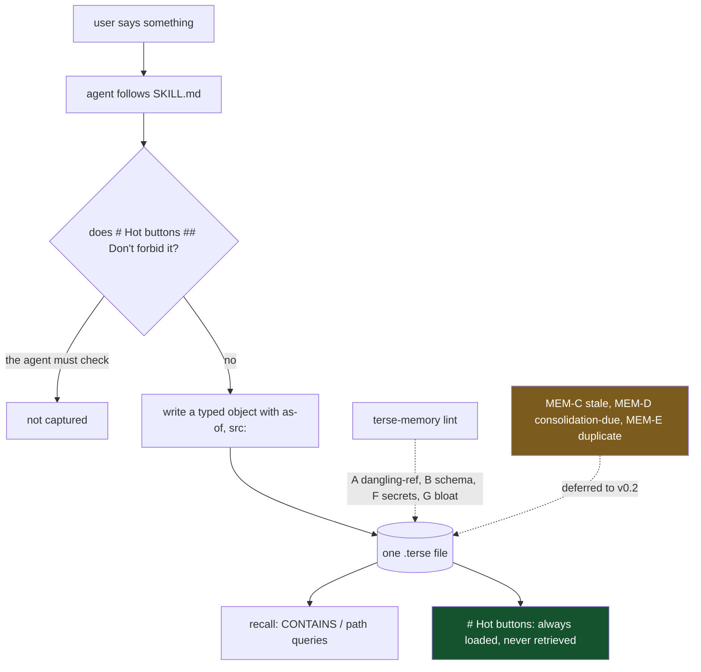

## 1. Executive Summary

TERSE is a state format — *"Token-Efficient Representation Semantically
Expressed"* — with a query and command syntax, Apache-2.0, three commits, HEAD
24 July 2026. This report is about `apps/terse-memory/`, the memory application
built on it: 1,710 lines of Python beside a 480-line `SPEC.md`, inside a 44,000-line
monorepo that also holds the parser, an MCP server and two other apps.

**Read the package listing before the spec.** `terse_memory/` contains `cli.py`,
`config.py`, `init.py`, **`lint.py`**, `report.py`, `seed.py`, `stats.py` and
`wire.py`. There is no `capture.py`, no `recall.py`, no `forget.py` and no
`consolidate.py` — the four verbs the spec is organised around are not functions
in this package. The largest module is the linter. Memory operations are
performed by the agent, following `skills/using-terse-memory/SKILL.md` and
issuing `terse-py` queries against a plain file.

That is a legitimate architecture and this atlas has seen it twice this week —
[MeMex Zero-RAG](../memex-zero-rag/) makes the same bet. What distinguishes
TERSE Memory is that its checker is real. `lint.py` implements four named rules:

| Rule | What it catches |
| --- | --- |
| `MEM-A dangling-ref` | an `@` reference that resolves to nothing in the store |
| `MEM-B schema-violation` | an object missing an attribute its kind declares `required:` |
| `MEM-F secret-leak` | AWS keys, GitHub PATs, Slack tokens, OpenAI/Anthropic/XAI keys, PEM headers |
| `MEM-G hot-buttons-bloat` | the always-loaded tier growing past 20 objects |

And three are **deferred to v0.2, named in the module docstring**: `MEM-C stale`,
`MEM-D consolidation-due`, `MEM-E duplicate`. Read that split carefully, because
it is the report's finding. The implemented rules police *hygiene* — does the
store parse, does an object have its required fields, is a credential in it, is
the always-loaded tier too big. The deferred rules police *epistemics* — is this
memory out of date, is consolidation overdue, is this a duplicate of something
already held. The checker that exists is the one that keeps the file well-formed;
the one that would keep it true is scheduled.

**The idea worth taking is the `## Don't` tier.** `# Hot buttons` is always
loaded into context and splits into `## Do` and `## Don't`, and the spec's
example is *"never remember anything about my health"* becoming a new object
under `## Don't`, *"effective immediately and visible at every orientation"*. A
user-authored prohibition that is present at every single turn is a different
mechanism from a filter applied at write time: it cannot be forgotten by a
retrieval that failed to surface it, because it is not retrieved. `MEM-G` exists
precisely to keep that tier small enough to stay unconditional, which is the
detail that makes it work.

**The second is a stated trust boundary on capture.** *"Only the user's own words
are trusted source material. Anything originating from web pages or tool output
is stored only on explicit user ask and carries `src: web` / `src: tool`; recall
surfaces that provenance. Auto-capture from untrusted content is a protocol
violation, full stop."* That is the prompt-injection answer most systems in this
atlas do not attempt, written as policy — and, like the verbs, it is enforced by
the agent honouring it rather than by a code path.

## 2. Mental Model

A memory is a typed object in a tree. The schema is declared in the store itself
under `# Schema.Kinds`, and the kinds carry required attributes:

| Kind | Required |
| --- | --- |
| `Preference`, `Fact`, `Person`, `Pattern` | `as-of` |
| `Decision` | `as-of`, `status` |
| `OpenQuestion` | `status` |

`as-of` on nearly everything is the good decision: a fact without a date is a
fact you cannot age, and making it required at the schema level means `MEM-B`
catches its absence rather than a human noticing later.

The status vocabulary is documented as `accepted | superseded | open | stale`,
and the first version of this report awarded `trust_state` for it. **That mark is
withdrawn here**, on a search that the first reading did not run.

`status` appears in exactly one place in the `terse_memory` package: the generic
`MEM-B` check, which reads the `required:` list off the store's own
`# Schema.Kinds` declaration and flags any object missing a named attribute —
`missing = [r for r in required if r not in attr_handles]`. It is a presence
test. Nothing validates the *value*, so `status: definitely-true-forever` passes
the linter; `grep -rn status apps/terse-memory/terse_memory/` returns only that
rule, and `stats.py`, `report.py` and `cli.py` never mention it. The MCP surface
is the generic `terse-mcp` server, which is status-agnostic — no occurrence of
`status` or `superseded` in its 1,530 lines. And `MEM-C stale`, the one rule that
would act on the passage of time, is declared deferred to v0.2 in the module
docstring.

So there is a required field, and there is a vocabulary in the spec, and there is
nothing anywhere that treats `superseded` differently from `accepted`. The
capability asks for a discrete status including at least one state that withholds
a memory from being treated as true; here the withholding lives in a sentence of
`SKILL.md` — *"Supersede decisions with `status: superseded`; don't delete"* —
addressed to the model. That is consistent with this project's whole design, and
it is not the mark.

Two observations survive the withdrawal. `status` is required on only two of the
six kinds, so a `Fact` has no status at all and ages only through `as-of`. And
`as-of` on nearly everything is still the good decision, precisely because
`MEM-B` *does* catch its absence — presence checking is exactly the right tool
for a required date, and exactly the wrong one for a controlled vocabulary.

Green is the mechanism that does not depend on retrieval working. Amber is the
half of the checker that is not built yet.

## 3. Architecture

One file, one CLI, one parser. `terse-py` provides the object model and query
engine; `terse_memory` provides `init` (scaffold a store), `seed` (a starter
template), `lint`, `stats`, `report` and `wire` (installing the skill and MCP
plumbing). `terse-mcp` in the same monorepo exposes TERSE over MCP, and the spec
asks it for one feature — *primer addenda*, so the always-loaded tier can be
injected at orientation.

Storage is a `.terse` file the operator can open, diff and edit with the same CLI
the agent uses, which the spec calls out as a feature: *"memory disputes end with
`terse-py query`, not a support ticket."* That is the file-canonical property
[Basic Memory](../basic-memory/) has, arrived at through a format rather than
through Markdown.

Containers give the scoping: `Profile`, `Projects`, `Sessions`, with a `session:`
attribute stamped at write time. The spec's session-forget path — drop today's
bucket, then everything matching `[CONTAINS "session: <today>"]` — works
*"because provenance was paid for at write time"*, which is the right reasoning
and the right place to pay the cost.

## 4. Essential Implementation Paths

| Path | Location |
| --- | --- |
| The four implemented lint rules, and the three deferred | `apps/terse-memory/terse_memory/lint.py:1` |
| Hot-buttons bloat check | `apps/terse-memory/terse_memory/lint.py:339` |
| Secret patterns | `apps/terse-memory/terse_memory/lint.py` (MEM-F) |
| Kinds, required attributes, statuses | `apps/terse-memory/SPEC.md:166` |
| Forgetting, hot buttons, poisoning defence | `apps/terse-memory/SPEC.md:280` |
| Skill carrying the operating procedure | `apps/terse-memory/terse_memory/skills/using-terse-memory/SKILL.md` |

## 5. Memory Data Model

The store is a TERSE tree: roots (`# Profile`, `# Hot buttons`, `# Schema`),
containers (`## Preferences`, `## Facts`, `## People`), and objects with
attributes. Kinds are routed by container-name convention — `Preferences →
Preference`, `Facts → Fact`, `People → Person` — which `MEM-B` uses to decide
which required-attribute list applies. That convention is doing real work and it
is the kind of thing that breaks quietly when someone adds a container with an
unexpected plural; the rule catches the missing attribute, not the mis-routing.

`src:` is the provenance attribute and it carries the trust boundary from section
1: `src: web` and `src: tool` mark material that did not come from the user.
Recall is specified to surface it, so the model sees where a claim came from
rather than being asked to trust the store uniformly.

There is no tombstone. Forgetting writes `[REMOVED]`, and the spec is explicit
that decisions should prefer `status: superseded` while *"explicit 'forget'
always deletes"* — so the user's strongest instruction is the one that leaves the
least behind, and nothing records that the removed value was rejected. The
`## Don't` tier is the closest thing, and it is a prohibition on a *topic* rather
than a record of a rejected value, which is why the mark is withheld.

Nothing separates validity time from record time: `as-of` is when the fact was
recorded as current, so `bitemporal` is withheld too.

## 6. Retrieval Mechanics

`CONTAINS` and path queries over the tree, to any depth — the format's own query
syntax rather than a search engine. There are no embeddings and no ranking, which
for a single-user profile store of a few hundred objects is the same defensible
choice [MeMex](../memex-zero-rag/) makes, with one important difference: TERSE
queries are structural, so a query is precise about *where* it looks rather than
scanning for a substring anywhere.

The `# Hot buttons` tier is the part that matters most and it does not go through
retrieval at all. Always-loaded, capped by `MEM-G` at twenty objects, containing
the user's standing instructions. A rule that must never be missed should not be
subject to a query returning it, and this is the cleanest expression of that idea
in the atlas.

`scope_enforced` is withheld. Containers and the `session:` attribute are real
and make session-scoped deletion precise, but they are organisational structure
in a single-user file rather than a scope key applied as a filter on a read path;
there is no tenancy and no query that must pass a scope.

## 7. Write Mechanics

The agent writes. `SKILL.md` carries the procedure, `terse-py` performs the
mutation, and `terse-memory lint` checks the result when someone runs it. There
is no write function in the package to describe, no gate, and no queue.

The consequences are the ones this atlas has recorded for every
convention-enforced design, and they are worth stating once more because this one
is honest about them. Section 11 of the spec is titled *"Non-goals and honest
limits"*. The `## Don't` tier is *"effective immediately"* only in the sense that
it is in context — the model still has to honour it. The poisoning rule is a
*"protocol violation, full stop"* and nothing detects the violation. Consolidation
is specified in detail under the heading *"dreaming"* and its lint rule is
deferred.

What raises this above the pattern is that the deferrals are declared. The lint
module names the three unbuilt rules in its docstring and points at the spec
section that owns them. A reader can tell exactly which half is real, which is
more than most projects at three commits manage.

## 8. Agent Integration

A CLI, an MCP server in the same monorepo, and a skill installed by `wire.py`.
The one feature the memory app asks of `terse-mcp` is *primer addenda* — a hook
for injecting the always-loaded tier at orientation — which is a small, specific
ask and the right one, since the design's best mechanism depends on that
injection happening.

`human_review` is withheld. The store is a file a person edits with the same CLI
the agent uses, and the spec makes a point of it; the mark asks for a surface
where a person inspects or adjudicates memory content, and "open it in an editor"
is repairability rather than review. `stats` and `report` are reporting commands,
not queues.

## 9. Reliability, Safety, and Trust

The safety thinking here is above the median for the corpus and it is
concentrated in three places. Secrets get a deterministic scanner as an explicit
*"backstop behind the policy rule"* — the policy being that credentials should
never be captured, and `MEM-F` catching it when the policy fails. Untrusted
content gets a stated capture boundary and a `src:` attribute so recall can
surface the difference. And the always-loaded prohibition tier means a user's
"never store this" does not depend on a retrieval finding it.

Against that, every one of the three is enforced by the agent except the secret
scanner, and the secret scanner is a pattern list — it catches the shapes it
knows and nothing else, which its own docstring calls "best-effort".

The store being one readable file is the strongest reliability property: there is
no index to corrupt, no projection to rebuild, and a bad memory is fixed by
editing a line.

## 10. Tests, Evals, and Benchmarks

89 tests across ten files — `test_lint`, `test_wire`, `test_cli`, `test_init`,
`test_doctor`, `test_scaffold`, `test_setup`, `test_skill`, `test_stats`. **I ran
them: 89 passed** in 0.40s on Python 3.14 after `pip install -e terse-py -e
apps/terse-memory`. Twenty of those are the lint suite.

That is real coverage of what the package does, and it is worth being precise
about what it therefore covers: the linter, the scaffolder and the wiring. There
is no test of capture, recall or forgetting, because those are not in the
package. No eval, no benchmark, no retrieval-quality measurement — appropriate
for a structural query engine, and it means the spec's claims about recall
quality are unmeasured.

`negative_eval` is withheld: no committed case asserts that particular material
must not be retrieved. The `## Don't` tier is the natural subject of one.

## 11. For Your Own Build

### Steal

**Put standing prohibitions in an always-loaded tier and cap its size.** `##
Don't` under `# Hot buttons`, present at every orientation, with a lint rule
warning past twenty objects. A rule that must never be missed should not depend
on a retrieval returning it, and the cap is what keeps that affordable. This is
the best small idea in the report.

**Make `as-of` required at the schema level.** A fact you cannot date is a fact
you cannot age, and a schema rule catches its absence at lint time rather than at
the moment someone asks how old a memory is.

**Pay for provenance at write time so deletion can be precise.** The `session:`
attribute is what makes "forget this conversation" resolvable to a query rather
than a guess, and the spec says exactly that.

**State your capture trust boundary.** *"Only the user's own words are trusted
source material… auto-capture from untrusted content is a protocol violation."*
Most systems in this atlas have no position on this at all.

**Name the checks you have not built.** The lint docstring lists MEM-C, MEM-D and
MEM-E as deferred and points at the spec section. A reader can size the gap in
one paragraph.

### Avoid

**Do not let the hygiene checks ship while the epistemic ones wait.** Dangling
references, schema violations, secrets and bloat are all real, and none of them
is why a memory system goes wrong. Stale and duplicate are, and both are v0.2.

**Do not make the strongest user instruction the most destructive one.**
*"Explicit 'forget' always deletes"* means the clearest signal a user can send
leaves the least evidence, and nothing prevents the same fact being captured
again tomorrow.

**Do not describe an operation the package does not implement in the same
register as one it does.** SPEC.md moves between "here is the store shape" and
"here is how consolidation works" without a change of voice; the module docstring
is where the distinction actually lives.

### Fit

Take this if you want a typed, diffable, single-file memory for one user and you
are comfortable that the agent is the runtime. The format is genuinely
token-efficient, the query syntax is structural rather than fuzzy, and the
always-loaded prohibition tier is worth copying regardless of what you store it
in.

Do not take it as a system with capture, recall and forgetting implemented — at
this commit those are a specification and a skill. And note the age: three
commits, HEAD 24 July 2026, spec sections marked pre-release. The design is the
contribution.

## 12. Antipatterns / Risks

- **No capture, recall, forget or consolidate function** in the package; the
  spec's four verbs are the model's job.
- **The three deferred lint rules are the epistemic ones** — stale, duplicate,
  consolidation-due.
- **Explicit forget deletes** and leaves no record that the value was rejected.
- **The poisoning rule is a protocol violation with no detector.**
- **Status is required on only two of six kinds**, so a `Fact` has no epistemic
  state.
- **`stale` is a status nothing sets**, pending MEM-C.
- **Kind routing is by container-name convention**, which `MEM-B` does not police.

## 13. Build-vs-Borrow Takeaways

Borrow the hot-buttons tier and its size cap — twenty lines of idea, and it
solves the problem that a prohibition retrieved is a prohibition that can be
missed. Borrow required `as-of` and the `session:` provenance attribute; both are
schema decisions that make later operations possible rather than heroic.

Build the verbs. The distance between this and a working memory system is the
three deferred lint rules plus a capture path that applies `## Don't` before
writing rather than asking the model to. The spec already says what each should
do, which is most of the work.

## 14. Open Questions

- **What sets `stale`?** The status exists in the vocabulary and MEM-C, the rule
  that would detect it, is deferred.
- **Is the poisoning rule detectable at all?** Distinguishing the user's words
  from tool output at capture time requires the capture path to know the
  difference, and there is no capture path.
- **Will `## Don't` gate capture, or only inform it?** As specified it is context;
  as a mechanism it would be a filter.
- **Does anything run `lint` automatically?** No hook or CI wiring was found, so
  the four working rules run when someone asks.

## 15. Appendix: File Index

| File | Role |
| --- | --- |
| `apps/terse-memory/SPEC.md` | The design: kinds, statuses, capture, recall, forgetting, consolidation |
| `apps/terse-memory/terse_memory/lint.py` | Four implemented rules, three declared deferred |
| `apps/terse-memory/terse_memory/wire.py` | Installs the skill and MCP plumbing |
| `apps/terse-memory/terse_memory/init.py`, `seed.py` | Scaffold and starter store |
| `apps/terse-memory/terse_memory/stats.py`, `report.py` | Reporting commands |
| `apps/terse-memory/terse_memory/skills/using-terse-memory/SKILL.md` | The operating procedure the agent follows |
| `terse-py/`, `terse-mcp/` | Parser and object model; MCP exposure |
| `apps/terse-memory/tests/` | 89 tests, run and passing |

## History

**2026-09-18** — [`637140a3a749f56a981cdb58d943f4fc1515c53b`](https://github.com/terse-lang/terse/commit/637140a3a749f56a981cdb58d943f4fc1515c53b) — re-read at the same commit. Nothing upstream had moved, so every change here is the atlas's own. **`trust_state` is withdrawn.** The first reading took the status vocabulary from `SPEC.md`; tracing it through the code finds `status` in exactly one place in `terse_memory/` — `MEM-B`'s generic presence check against the store's own `# Schema.Kinds` `required:` list — and nowhere else. No value validation, so any string lints clean; no reader in `stats.py`, `report.py` or `cli.py`; no occurrence in the 1,530-line `terse-mcp` server; and `MEM-C stale`, the rule that would act on age, deferred to v0.2 in the module docstring. Nothing treats `superseded` differently from `accepted`, so no state withholds anything. The report now carries no marks. `stack_storage` and `stack_retrieval` were both empty and are now `files` and `lexical`: the store is one `.terse` file on disk and `CONTAINS` is, in `terse-py`'s own words, *"grep-shaped — raw-text substring filter"* over the parsed tree, which is a lexical arm without an index rather than no retrieval at all. `stack_source` goes from seeded to reviewed.

**2026-07-31** — [`637140a3a749f56a981cdb58d943f4fc1515c53b`](https://github.com/terse-lang/terse/commit/637140a3a749f56a981cdb58d943f4fc1515c53b) — first reading.
