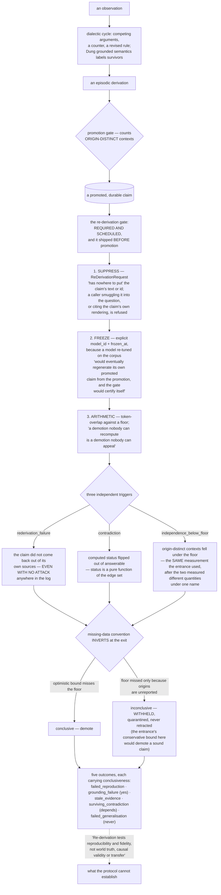

## 1. Executive Summary

Tessellum is "[t]yped atomic notes in a graph — a Zettelkasten that scales" —
MIT, Python, 138,183 lines with 2,905 test functions across 179 test files. Its
unit is a *tessellum*, a small mosaic tile: a note small enough to make one point
and tagged with what kind of point it makes. Underneath is a one-way CQRS split —
the authored notes are the source of truth, the searchable index is a projection
rebuilt from them, "and changes only ever flow one way — from the notes to the
index, never back". On top is a dialectic cycle that turns an observation into
competing arguments, records where they conflict, names which part of the losing
argument broke, and emits a revised rule, with a Dung grounded-semantics solver
deciding which arguments survive.

It says in its second sentence that it "is a knowledge-construction system, not
an agent-memory store". It is in this atlas because it keeps claims that can turn
out to be false and gives them an identity a correction can name — which is this
atlas's scope rule — and because of one module.

**The demotion gate.** Its header states the finding this atlas's own corpus
keeps producing, and states it better:

> "Promotion turns an episodic derivation into durable knowledge; a promoted
> claim that stops being true has no way to notice on its own, so a promotion path
> without a demotion path is a mechanism for entrenching whatever was believed
> first. That is not a hypothetical failure mode — it is the one the memory
> literature documents most consistently — which is why this gate ships ahead of
> consolidation rather than beside it."

Shipping the demotion path *before* the promotion path it guards is the ordering
decision, and almost nothing in this corpus made it.

The gate scores an abstraction for *truth* rather than usefulness — "systems that
abstract memory score an abstraction for *utility* (was it recalled? did it
help?) and none of them scores a produced abstraction for *truth*" — through a
blinded protocol in three parts, each closing a way the test could cheat:

**Suppress.** The gate "hands over neither its text nor its id.
`ReDerivationRequest` has nowhere to put them, and `require_suppression` refuses
a caller who smuggles the claim into the question or cites the claim's own
rendering as its own source." The blinding is a property of the request type,
not a convention — the same discipline [codemem](../codemem/) applies by
subtracting a flag from a context.

**Freeze the model.** An explicit `model_id` and `frozen_at`, enforced, because
"[a] model that re-tunes on the corpus it is checking would eventually regenerate
its own promoted claim from the promotion, and the gate would certify itself."

**Decide by arithmetic.** A token-overlap ratio against a floor, and every
trigger likewise, because "[a] model must never decide the verdict: a demotion
nobody can recompute is a demotion nobody can appeal."

**Three triggers, and the first is the one nothing else looks for.**
`rederivation_failure` fires when the frozen model does not regenerate the claim
from its cited sources "**even with no attack against it anywhere in the log**".
Every argumentation-driven system in this corpus notices a claim when something
argues against it; this one notices a claim that quietly stopped following from
its own evidence. `contradiction` fires when the computed status flips out of
answerable — "[n]early free: status is a pure function of the edge set".
`independence_below_floor` fires when the origin-distinct contexts behind a claim
fall under a floor.

**The entrance and the exit used to measure different things under one name.**
The independence trigger counted *episodes* while the promotion gate counted
*origin-distinct contexts* — "the entrance strict, the exit lax" — and both now
consume one measurement function. A field measured one way on the way in and
another on the way out is a defect this atlas has found repeatedly; here it is
named and closed.

**And the missing-data convention inverts between them, which is the subtle
part.** Applying the entrance's conservative lower bound at the exit "would let a
hole in the log lower the count and **demote a sound claim**". So the exit fires
conclusively only when the *optimistic* bound misses the floor; where the floor
is missed only because origins are unreported, the finding is inconclusive and
the claim is "**withheld** — quarantined, never retracted". A conservative bound
is safe admitting and dangerous removing, and the direction has to flip. Very few
systems notice that, and this one has a named rule for it.

**Five outcomes, each carrying whether it is conclusive**, under a paragraph that
refuses to overstate what the method can show:

> "collapsing every finding into 'the claim is false' overstates what this
> protocol can establish: a frozen model can reproduce a source's **error**
> perfectly consistently, and it can fail to reproduce one of **several
> legitimate** abstractions of the same sources. Re-derivation tests
> **reproducibility and fidelity**, not world truth, causal validity or transfer."

`failed_reproduction` and `grounding_failure` are conclusive; `stale_evidence`
and `surviving_contradiction` depend — the latter "conclusive once the labelling
**settles** against the claim; a live undecided dispute (Dung `undec`) has
settled nothing"; and `failed_generalisation` is never conclusive, because two
legitimate abstractions of the same sources can disagree.

No marks. The statuses here are computed from the argument edge set rather than
stored, the scope is one knowledge base, and the atlas's marks attach to a
store's read path. That is a statement about the mark definitions, not about the
quality of what is here.

Two limits the project states about itself are worth carrying out. By default the
dialectic cycle "treats two arguments as conflicting when their claims are worded
differently", with evidence-based incompatibility and attack direction an opt-in
mode — so the default conflict detector is textual, which is exactly the failure
[chitta-field](../chitta-field/)'s claim-centric detector is built to avoid, and
this project ships the better mode behind a flag while saying which is the
default. And each cycle is labelled on its own, "so a later argument does not yet
overturn an earlier cycle's verdict" — a stated boundary on how far a verdict
travels.

## 2. Mental Model

A **note** makes one point and says what kind of point it is.

A **promotion** must have an exit before it is allowed an entrance.

A **re-derivation** asks a blinded, pinned model to rebuild the claim from the
claim's own sources — and counts tokens, not opinions.

**Inconclusive** means quarantine, not retraction.

## 3. Architecture

| Area | Role |
| --- | --- |
| `dks/demotion.py` | The re-derivation gate, its triggers and outcomes (3,027 lines) |
| `dks/consolidation.py` | Promotion, and the shared origin-distinct measurement |
| `dks/core.py`, `dks/query_protocol.py` | The dialectic cycle and the abstaining query |
| `composer/digestion.py` | Turning a source document into typed notes |
| `runtime/store.py`, `runtime/admission.py` | The note store and its admission quarantine |

## 4. Essential Implementation Paths

`src/tessellum/dks/demotion.py:1-100` — read the module docstring end to end; it
is the report.

`src/tessellum/dks/consolidation.py` — `measure_origin_distinct`, the one
measurement both gates now consume.

## 5. Memory Data Model

Typed atomic notes with a Building-Block type system, linked into Folgezettel
trails that "record how one idea led to the next". Claims promoted out of the
dialectic cycle carry their cited sources, which is what makes re-derivation
possible at all: a claim with no usable evidence produces `grounding_failure`
rather than a pass.

## 6. Retrieval Mechanics

Hybrid keyword and vector search over the projection. The query protocol abstains
with `status_not_answerable` rather than returning a claim whose argument
labelling does not support it — an abstention, not a filter, and computed rather
than stored.

## 7. Write Mechanics

Author or digest; the index follows. The CQRS direction is the invariant: "the
notes you author are the source of truth, the searchable index is a projection
rebuilt from them, and changes only ever flow one way".

## 8. Agent Integration

A Python package and CLI, for humans and agents both. It does not present itself
as a memory an agent writes to during a session, and the report should not either.

## 9. Reliability, Safety, and Trust

The gate is the trust story, and its most valuable property is epistemic modesty
expressed as structure: five outcomes with conclusiveness attached, a stated list
of what re-derivation does not establish, and an inconclusive branch that
quarantines. A system that can distinguish "this is false" from "I could not
tell" is doing something most of this corpus does not attempt.

## 10. Tests, Evals, and Benchmarks

2,905 test functions across 179 files. Nothing was installed or run for this
reading.

## 11. For Your Own Build

Build the demotion path before the promotion path. A promoted claim cannot notice
that it stopped being true, so an entrance without an exit entrenches whatever
was believed first — and the ordering here, exit first, is the concrete form of
taking that seriously.

Blind the test by construction. If the request type has nowhere to put the claim,
no reviewer has to check that nobody leaked it.

Pin the model that checks your model. One that re-tunes on the corpus it audits
will eventually reproduce the claim from the promotion and certify itself.

Decide with arithmetic. "A demotion nobody can recompute is a demotion nobody can
appeal" is the argument for a token-overlap floor over a judge.

Invert the missing-data convention between your entrance and your exit. A
conservative bound is safe when admitting and dangerous when removing, and using
the same one in both directions demotes sound claims on a gap in the log.

And attach conclusiveness to every finding. "I could not tell" is a real answer
and collapsing it into "false" is how a correction mechanism starts causing the
errors it was built to catch.

## 12. Open Questions

Whether a quarantined claim ever returns. The inconclusive branch withholds
rather than retracts; the path back was not traced.

How the opt-in evidence-based conflict mode performs against the textual default.
The project ships both and names which is the default; no comparison was found.

What the labelling boundary costs in practice. Each cycle is labelled on its own,
so a later argument does not reach back into an earlier verdict.

## Appendix: File Index

| Path | What to read it for |
| --- | --- |
| `src/tessellum/dks/demotion.py:1-100` | The best statement of the correction problem in this corpus, and a protocol for it |
| `src/tessellum/dks/consolidation.py` | One measurement for both gates, after they disagreed |
| `src/tessellum/dks/query_protocol.py:208` | An abstention rather than an answer |

## History

**2026-09-16** — [`6e167169c18e697d50a7045db6f6dce6279ece3f`](https://github.com/TianpeiLuke/Tessellum/commit/6e167169c18e697d50a7045db6f6dce6279ece3f) — first reading, at a commit dated 15 September 2026. Screened before opening, from a shallow clone: four files scanned, no auto-run surfaces, no build-time execution points, one unpinned surface and two dependency files inside the seven-day cooldown. Nothing was installed, built or run.
