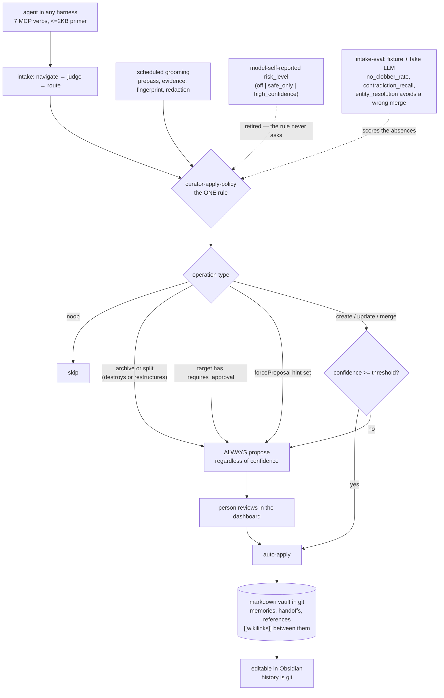

## 1. Executive Summary

The Librarian is "a living, markdown-native knowledge graph for AI agents — with
a resident curator that tends it": a git vault of three note types — memories,
handoffs and references — linked by `[[wikilinks]]`, served to any harness over
MCP as seven verbs, with an agent primer under 2KB. Apache-2.0, 1,296 commits
since 3 May 2026, 47,344 lines of TypeScript in `packages/` outside tests
against 350 test files.

Two mechanisms are worth the visit, and both are about refusing to let a model
grade its own work.

**One function decides every verdict, and it asks what the operation does.**
`curator-apply-policy.ts` opens by stating its own monopoly: "Every
apply/propose/skip verdict in the system — intake apply … and grooming apply …
— is produced HERE and nowhere else." The rule is then keyed on operation type,
"never by model-self-reported risk", and the header records that the previous
design — a `risk_level` with `off | safe_only | high_confidence` policy levels —
is gone. What survives is short enough to quote: a noop skips; archive and
split, "the only two operations that destroy or restructure information —
ALWAYS propose, regardless of confidence"; anything touching a
`requires_approval` memory proposes; a submission-level `forceProposal` hint is
an override nothing auto-applies past; and create, update and merge auto-apply
above a confidence threshold or propose below it.

That is the right shape for a curator that runs unattended. A model asked how
risky its own edit is will answer inside the same distribution that produced
the edit; the operation type is a fact about the edit that no prompt can talk
its way out of. And `requires_approval` is a plain boolean "set only by
admin/curator", not something an intake can assert for itself.

**The eval scores absences.** `packages/intake-eval` is a separate package with
a fake model, a fixture, pure scoring functions — "[n]o I/O, no model" — and a
committed baseline. Three of its headline metrics are must-nots:
`no_clobber_rate` asks whether "an edit to a hand-authored doc preserve[d] it",
`contradiction_recall` whether "a contradicting update [was] superseded", and
`entity_resolution` whether an ambiguous merge "AVOID[ed] a confident
wrong-merge (it should propose, never auto-augment)". Each names a numbered
scenario. An eval built to catch the curator being confidently wrong is a
different instrument from one built to show it being right.

A third habit deserves a mention even though it earns no mark.
`caller-audit.ts` is a migration dry run: it runs the caller-id normaliser over
stored ids "WITHOUT changing anything, so an operator can see — before any
backfill — which raw variants would collapse into one canonical id", and it
"deliberately applies no aliases: alias decisions come after a human reviews
the collapse/collision groups". A destructive identity migration previewed
before it runs is a small thing that prevents a large one.

What the store does not keep is its own history. The vault is markdown in git,
and that is the design — "nothing is locked in a database" — so a question
about what a note said last week is a `git log` question rather than one the
memory answers. For a vault a person also edits in Obsidian, that is coherent;
it does mean the atlas's usual questions about supersession and correction are
answered by the version-control system rather than by the store.

Two marks: `human_review`, `negative_eval`.

## 2. Mental Model

A **note** is markdown: a **memory**, a **handoff** or a **reference**, linked
to others by `[[wikilinks]]`. Flags are two plain booleans — `is_global` and
`requires_approval` — set only by admin or curator; everything else organising
is a tag.

The **curator** is a resident agent that files a new memory, links it to
neighbours, and grooms the collection. It can be paused.

A **verdict** is apply, propose or skip, and exactly one function produces it.

A **handoff** is a document packaging work so another harness can pick it up.

## 3. Architecture

| Area | Role |
| --- | --- |
| `packages/core/src/curator-*.ts` | The apply policy, the prompt, the pause control, distillation, addenda |
| `packages/core/src/grooming-*.ts` | The grooming pipeline: prepass, evidence, fingerprint, redaction, validate, apply |
| `packages/core/src/chronicle/` | Collecting and narrating activity into markdown |
| `packages/core/src/caller-*.ts` | Caller identity, the dry-run audit, the backfill |
| `packages/mcp-server`, `packages/cli`, `packages/installer-cli` | The MCP surface and the self-host tooling |
| `packages/intake-eval` | Fixture, fake model, pure scorers, baseline, runner |
| `apps/dashboard`, `apps/docs` | The review surface and the documentation site |
| `DESIGN.md`, `PRODUCT.md`, `SOUL.md`, `AGENTS.md` | The written design, read as data |

## 4. Essential Implementation Paths

- `packages/core/src/curator-apply-policy.ts:1-15` — the rule, and what it
  replaced.
- `packages/core/src/curator-prompt.ts:189` — the same rule stated to the model.
- `packages/core/src/constants.ts:10-13` — who may set the two booleans.
- `packages/core/src/grooming-validate.ts:52, 252` — the gate reading
  `requires_approval` off the evidence shape.
- `packages/intake-eval/src/metrics.ts:1-14` — the scorers and the three
  absences.
- `packages/core/src/caller-audit.ts:1-10` — the migration dry run.

## 5. Memory Data Model

Three note types and two booleans is a deliberately small model, and the
constants file records what was removed to get there: the legacy `Category`,
`Visibility` and `Scope` enums, `deriveLegacyMemoryFlags` and
`isProtectedCategory` were all retired, with "tags carry whatever organising
signal a memory needs." Reading a codebase that documents its own subtractions
is rarer than reading one that documents its additions.

## 6. Retrieval Mechanics

The wikilink graph is the structure, and the curator's job is described as
organising "for *retrieval*, not just storage" — filing each memory where it
belongs and linking it to neighbours, rather than relying on a ranking pass to
compensate for an unstructured pile.

## 7. Write Mechanics

Intake runs navigate-judge-route; grooming reworks what is already there, with
a prepass, evidence, a fingerprint and a redaction step before validation. Both
converge on the one apply policy. The curator can be paused.

## 8. Agent Integration

Seven MCP verbs and a primer small enough that every harness can carry it, plus
a cross-harness handoff document — work started in Claude Code, Codex, Hermes,
OpenCode or Pi packaged for pickup elsewhere. The self-host path resolves the
latest stable release, verifies the published image, and runs it by immutable
digest, which is a more careful install story than most projects here offer.

## 9. Reliability, Safety, and Trust

The design decision to record is the retirement of model-self-reported risk.
A curator that asks its own model "how risky was that?" is asking the same
weights that produced the edit, and the header here says the levels are gone
and the rule is the operation type instead. Everything destructive is a
proposal; everything flagged is a proposal; the model's confidence only decides
among create, update and merge.

That leaves a real residual: below the destructive line, a confident wrong
merge auto-applies. The project knows — that is exactly what
`entity_resolution` in the intake eval measures, and the metric's own wording
says the right behaviour is to "propose, never auto-augment".

The history question is the honest limit. Git is the record, so the store
cannot answer what a note said at a past moment without leaving the store. For
a vault the user also edits by hand, delegating history to git is defensible
and consistent.

## 10. Tests, Evals, and Benchmarks

350 test files, and a separate eval package whose design is worth copying: a
fake model so the run is deterministic, pure scoring functions with no I/O, a
committed baseline to compare against, and headline metrics tied to numbered
scenarios. Naming a metric `no_clobber_rate` rather than `accuracy` puts the
failure the team fears in the report every time it runs.

## 11. For Your Own Build

### Steal

- **Produce every verdict in one function, and say so at the top of it.** The
  comment "produced HERE and nowhere else" is what stops a second decision
  point appearing next quarter.
- **Key the rule on the operation, not on the model's self-assessment.** What
  an operation does is checkable; how risky the model thought it was is not.
- **Make destructive operations unconditional proposals.** Archive and split
  always reach a person here, whatever the confidence was.
- **Score the absences.** `no_clobber_rate`, `contradiction_recall` and an
  entity-resolution metric that rewards *not* merging are a better report than
  an accuracy number.
- **Dry-run an identity migration and apply nothing.** Showing which ids would
  collapse, before any backfill, turns an irreversible step into a reviewable
  one.
- **Document what you removed.** The constants file lists the retired enums and
  helpers, which tells the next reader why the model is small.

### Avoid

- **Letting confidence alone decide a merge.** The project's own eval exists
  because a confident wrong merge is the failure that survives every other
  guard.

### Fit

Reach for this if you want a memory your team can read and edit as markdown in
git, curated by an agent whose destructive moves always stop at a person. Look
elsewhere if the store itself must answer historical questions rather than
deferring them to version control.

## 12. Open Questions

- Below the destructive line, is a confidence threshold the long-term answer
  for merge, or will entity resolution get its own rule keyed on ambiguity?
- The handoff surface carries work between harnesses. What travels with it
  about the scope assumptions of the harness that produced it?
- `requires_approval` is set by admin or curator. Can an intake ever cause a
  memory to become flagged, or only a person?

## Appendix: File Index

| Path | What to read it for |
| --- | --- |
| `packages/core/src/curator-apply-policy.ts` | The one rule and its history |
| `packages/core/src/curator-prompt.ts` | The same rule as told to the model |
| `packages/core/src/constants.ts` | The small model, and what was retired |
| `packages/core/src/caller-audit.ts` | A migration that previews and applies nothing |
| `packages/intake-eval/src/metrics.ts` | Metrics that are absences |
| `DESIGN.md`, `PRODUCT.md` | The written design, read as data |

## History

**2026-09-16** — [`b77d9271dcaf6d855baf5fed1f97423d28b0b613`](https://github.com/code-ministry-ltd/the-librarian/commit/b77d9271dcaf6d855baf5fed1f97423d28b0b613) — first reading, at a commit dated 15 September 2026. Screened before opening, from a shallow clone: twenty-nine files, one auto-run surface, seven build-time execution points, twelve unpinned surfaces, twelve dependency files inside the cooldown, and the agent-instruction files read as data. Nothing was installed, built or run.
