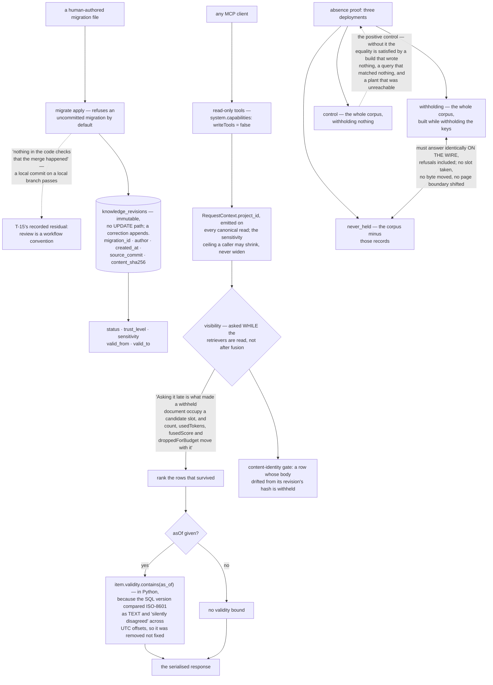

## 1. Executive Summary

Theurian is "the engineering record your AI agents consult" — Apache-2.0, Python
3.13+, self-labelled alpha at version 0.0.0, 313,168 lines with 4,209 test
functions across 244 test files, served to any MCP client by a local daemon. Its
pitch is one sentence: "Stop your AI from re-proposing what your team rejected in
March."

The shape is deliberate and narrow. Knowledge enters only through a human-authored
migration file applied with `migrate apply`; every MCP tool is read-only and
`system.capabilities` reports `writeTools: false`, with a note beside it — "No
write-intent tool exists. Approved knowledge changes only through a human-authored
migration." Agents read, agents propose, agents never approve.

**Then the README tells you the limit of that claim, before you can find it.**

> "there is no approval command and no approver field anywhere in this codebase,
> **and nothing in the code checks that the merge happened**: `migrate apply`
> refuses an uncommitted migration by default (`--allow-uncommitted` restores the
> old behaviour), but a local commit on a local branch passes, so it enforces the
> commit and not the merge. The review is a workflow convention rather than a
> check Theurian makes (T-15's recorded residual)."

That paragraph is why this report carries no human-review mark, and it is also
the most creditable thing in the repository. The guarantee that does hold is
narrower and genuinely enforced: an agent cannot write approved knowledge at all,
so it cannot approve. Whether a human approved rests on the team's pull-request
discipline. Most projects with this thesis would have stopped at "agents never
approve".

**The absence proof is the strongest in this corpus.** Rather than assert that a
withheld record does not come back, `test_review_search_tool_absence_proof.py`
builds three deployments and demands indistinguishability:

> "*a corpus that held the withheld records and a corpus that never did must
> answer identically* — and here, identically **on the wire**, refusals included."

The three are `withholding`, `never_held`, and `control` — and the module explains
why the third exists:

> "The **positive control**: every query the pair must answer identically returns
> the planted rows here. Without it, an equality is satisfied by a build that
> wrote nothing, a query that matched nothing and a corpus whose plant was
> unreachable — three ways for this file to hold vacuously" — with
> `test_the_battery_really_reaches_the_withheld_records` named as "what makes the
> reach a measured set rather than a hope."

Beside it: `test_the_battery_really_reaches_the_withheld_records`,
`test_a_withheld_record_never_costs_a_visible_one_its_slot_in_the_response`,
`test_a_visible_records_bytes_do_not_move_when_its_neighbour_is_withheld`, and
`test_the_page_boundary_bit_does_not_move_with_a_withheld_record`. The threat
model being tested is not "does the secret appear" but "can its existence be
inferred from a count, a score, a byte offset or a page break" — and the module's
header names the family: "a value computed over rows a caller may not see is the
family this project has met five times."

That same insight drives the visibility module, which asks *may this be shown*
while the retrievers are being read rather than after fusion:

> "Asking it late is what made a withheld document able to occupy a candidate
> slot, and every number computed from those slots — `count`, `usedTokens`,
> `fusedScore`, `droppedForBudget` — move with it."

And the session rule beneath it: one read session per request, "because the whole
point of one session per request is that two rows in one answer cannot be judged
against two states."

**A filter was deleted rather than fixed, and the reason is recorded.** The
store's SQL-side comparison of `valid_from`/`valid_to` against a bound moment
compared them as SQLite TEXT — "a lexicographic ordering of the ISO-8601 string
rather than of the absolute instant it names" — and "silently disagreed with
`ValidityPeriod.contains` whenever the two sides were authored in different UTC
offsets". So it was removed, and the domain comparison is now the only one. A
class of bug most codebases carry unknowingly, found, named, and resolved by
removing the second answer rather than teaching it to agree.

Five marks. World validity comes from the migration author (`validFrom`/`validTo`)
and is read with an `asOf` moment, over an immutable revision chain carrying its
migration, author, creation time and source commit — "Revisions are immutable
(ADR-0006). There is no UPDATE path for this table in the store adapter;
corrections append a new row." Status, trust level and sensitivity are stored and
filtered before ranking. The project is bound on the request context and appears
in every canonical read.

The cost is proportion. A daemon that serves decisions read-only carries 313,168
lines and 4,209 tests — and reading the absence-proof machinery explains most of
it. Whether that is over-built depends entirely on whether you believe the
side-channel threat is real, and this project has made the most complete argument
in the corpus that it is.

## 2. Mental Model

A **decision** is a revision. Revisions do not change; corrections are new ones.

**Approval** is a merged pull request. Theurian records the result and does not
witness the act.

A **withheld row** must be invisible in every number, not just absent from the
list.

**Valid** and **recorded** are different times, and `asOf` asks about the first.

## 3. Architecture

| Area | Role |
| --- | --- |
| `domain/` | Knowledge, validity, enums, request context, store ports |
| `application/migration_engine.py` | The only write path |
| `application/visibility.py` | May this be shown, asked before ranking |
| `infrastructure/sqlite/` | The canonical store, the index, the query layer |
| `mcp/tools.py`, `mcp/search.py` | The read-only surface and its `asOf` |
| `tests/integration/*absence_proof*` | Indistinguishability, proved twice |

## 4. Essential Implementation Paths

`application/visibility.py:1-45` — where the question goes, and what asking it
late costs.

`infrastructure/sqlite/store.py:514-522` — a filter removed rather than repaired,
with the reason.

`infrastructure/sqlite/schema.py:207-266` — immutability, and a foreign key that
lied.

`tests/integration/test_review_search_tool_absence_proof.py:1-30` — read this if
you read nothing else.

## 5. Memory Data Model

An item with a revision chain. Each revision carries content and its SHA-256,
kind, namespace, status, trust level, sensitivity, owner, tenant, ACL group,
labels, scope paths, a validity window, an author and a source commit. The
schema comments carry the archaeology — including the project-id defect where
`PRAGMA foreign_key_check` reported a satisfied constraint over stranded rows,
linked to its issue.

## 6. Retrieval Mechanics

Status and sensitivity filtered before ranking, an optional `asOf` applied
through the domain validity object, and results returned with status, trust
level, freshness and a source anchor so the caller can check the claim rather
than take it. A reclassification above the sensitivity ceiling purges the
published index rather than waiting for the next build.

## 7. Write Mechanics

`migrate apply`, over a Markdown migration with front matter. The commit check is
the only gate, and the README is explicit about what it does and does not prove.

## 8. Agent Integration

One local daemon, read-only, no API key, no data leaving the machine. The
boundary is stated as a product position — "Theurian does not orchestrate, does
not approve, does not enforce" — with the corollary that CI may block a pull
request on what it reads, "and the thing that blocked is CI".

## 9. Reliability, Safety, and Trust

The content-identity gate is worth naming separately: a row whose stored body no
longer hashes to what its revision recorded is withheld rather than served, and a
current revision the gate cannot hash is withheld too. Failing closed on an
integrity check, in a system whose whole value is that the answer is the one the
team approved.

## 10. Tests, Evals, and Benchmarks

4,209 test functions across 244 files, including two absence-proof modules — one
at the store, one on the wire — and a note that the gap between them "is not
rhetorical", listing the eight stages that sit between a store hit and a
response, each of which "computes something".

Nothing was built or run for this reading.

## 11. For Your Own Build

Prove absence by indistinguishability, not by assertion. Build the corpus that
never held the record, and require the same answers. Then add the control that
stops the equality holding because nothing happened at all.

Test the side channels. A withheld row that still takes a candidate slot leaks
through counts, scores, byte offsets and page boundaries — and those are the
numbers a caller is handed without thinking about them.

Ask the visibility question before ranking. Everything computed downstream
inherits the answer, so asking late means computing over rows nobody may see.

Delete the second comparison rather than teaching it to agree. Two validity
checks that disagree across UTC offsets is one check too many.

And write down what your governance does not check. "Nothing in the code checks
that the merge happened" is the sentence that makes the rest of the claim
trustworthy.

## 12. Open Questions

Whether the merge check will ever be made. It is recorded as a residual against
a task id, which suggests it is tracked rather than accepted.

What the tenant and ACL-group columns do today. They are NOT NULL with defaults
of `local` and `default`; whether any read path varies on them was not traced.

How much of the tree the absence proof accounts for. It explains the care; the
proportion was not measured.

## Appendix: File Index

| Path | What to read it for |
| --- | --- |
| `README.md` | A governance claim and its own disclaimer, in the same paragraph |
| `packages/theurian-core/src/theurian/application/visibility.py:1-45` | Why the question is asked early |
| `packages/theurian-core/src/theurian/infrastructure/sqlite/store.py:514-522` | A filter removed, and why |
| `packages/theurian-core/src/theurian/infrastructure/sqlite/schema.py:207-266` | Immutable revisions, and a foreign key that lied |
| `packages/theurian-core/tests/integration/test_review_search_tool_absence_proof.py` | Three deployments, one wire, no side channel |

## History

**2026-09-19** — [`6c64a6baca90a57601730a8ea1d592519163efa2`](https://github.com/theurian/theurian/commit/6c64a6baca90a57601730a8ea1d592519163efa2) — `trust_state` re-tested and the module the mark rests on is unchanged in substance. Two things are added to the record, both from the same header. The visibility module describes itself as *one question — may this chunk be shown to this caller at all — asked once, in one place, by everything that ranks*, which is the single-admission-function arrangement this sweep has found working in MuninnDB and anda-db and missing in several others, stated here as the design rather than inferred from the code. And it gives a second reason for the per-request read session that the record did not carry: *two rows in one answer cannot be judged against two states*. Filtering early keeps a withheld row out of a candidate slot; evaluating against one session keeps an answer from mixing judgements made at two moments. The two questions are also kept apart at the type level, which the record now names: `may_surface` takes a status and an include-unapproved flag (`domain/enums.py:222`), `may_disclose` takes a sensitivity and the set a caller may see (`:252`), and the store read takes both vocabularies as frozensets rather than one blended argument. Screened again first; nothing was installed and no suite was run.

**2026-09-16** — [`6c64a6baca90a57601730a8ea1d592519163efa2`](https://github.com/theurian/theurian/commit/6c64a6baca90a57601730a8ea1d592519163efa2) — first reading, at a commit dated 16 September 2026. Screened before opening, from a shallow clone: fourteen files scanned, no auto-run surfaces, seven build-time execution points, one unpinned surface and three dependency files inside the seven-day cooldown. Nothing was installed, built or run.
