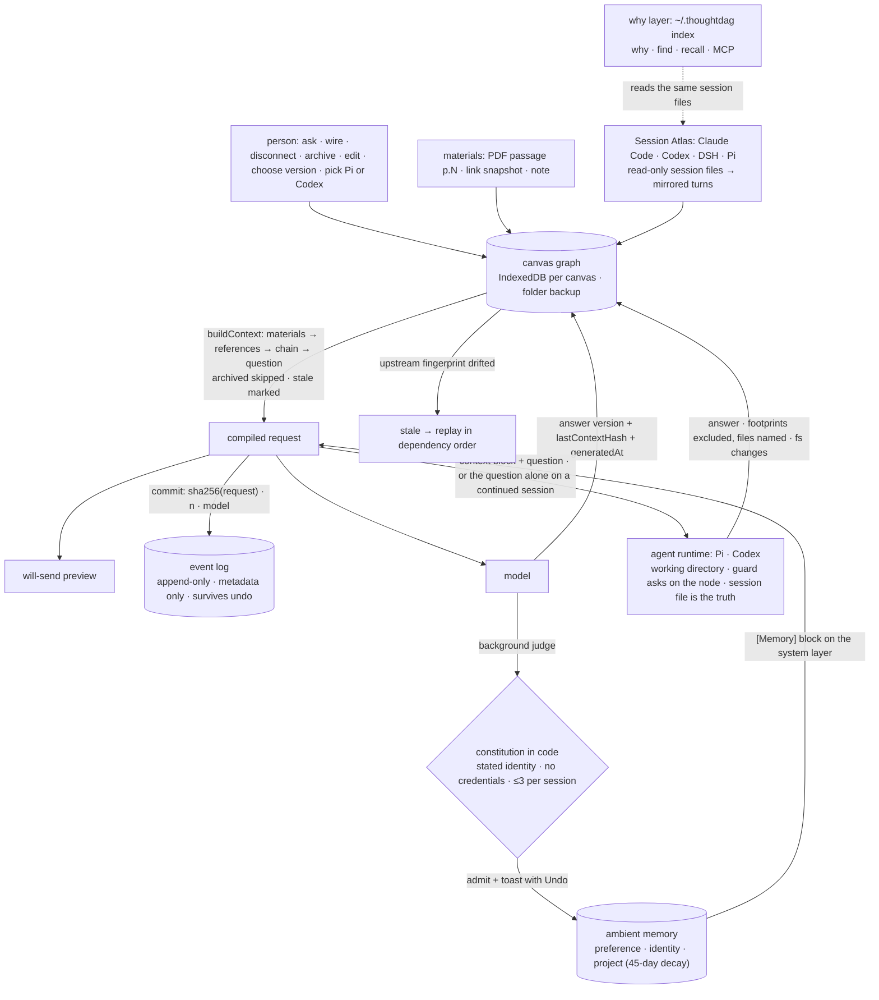

## 1. Executive Summary

ThoughtDAG is **a context graph a person edits**: an infinite canvas where
each node is a question and its answer versions, each wire is context, and
*"what the model sees is exactly what wires into the node."* MIT; 640
commits between 3 July and 7 September 2026 by one author, with two from
anyone else; 32,041 lines of TypeScript in `src/`, a 1,170-line Express
proxy, an Electron shell, a 1,226-line CLI, a 1,058-line DeepSeek Harness
plugin, a 1,123-line agent runtime in plain Node under `runtime/` and a
benchmark directory of 2,145 files. It ships as a desktop app at 0.4.10,
a harness plugin at the same version, an npm CLI at 0.1.2 and a browser
demo on Cloudflare Pages that stores nothing. The screen found no
auto-run surface; five manifests were inside the seven-day cooldown and
nothing was installed or run.

Four things here are memory in the atlas's sense, and they are wired
together. The canvas persists — one IndexedDB key per canvas with a
debounced folder backup as a real `.thoughtdag.json` file — and a
generation's input is a deterministic walk of the graph
(`store/context-builder.ts:183-350`): materials first, dashed reference
blocks, then the solid chain in order, the question last, archived nodes
skipped at every layer. Each generation records the fingerprint of
everything upstream of the node with the node's own content blanked
(`upstreamFingerprint`, `:111-130`), and `recomputeStaleness`
(`slices/nodes.ts:251-260`) marks a node **stale** when the live
fingerprint drifts from the recorded one; a stale answer still enters
downstream context, prefixed *"[Stale: this answer was written against an
earlier version of its upstream]"* (`:132,:328`), and *Replay*
regenerates stale nodes in dependency order. Second, an **ambient
memory** (`lib/memory.ts`): after an ordinary generation a background
judge on the cheapest model proposes one sentence in one of three
categories — preference, identity, project — and a constitution written
in code, not in the prompt, decides admission: identity only when the
user *stated* it, never inferred; a credential pattern blocks; three
additions per canvas per session; duplicates and unknown update targets
refused (`admissionCheck`, `:100-118`); every write shows a toast with
**Undo**, and project entries stop flowing into context after 45 days
without being deleted. Third, **Session Atlas**: the desktop shell fences
the session directories of Claude Code, Codex, DeepSeek Harness and Pi
(`desktop/main.js:116-124`), reads them and never writes them, and mirrors
a session onto a canvas turn by turn with tool calls as attachments,
appending idempotently past a per-session ledger as the source grows.
Fourth, the **why layer**: a CLI that reduces those same session files to
an event index of what each turn did to which files, papers and URLs,
answers `why <path>`, `find "<phrase>"` and `recall`, and serves the
four questions read-only over MCP. Fifth, an **agent lane**, a preview
from 0.4.9: the model picker lists Pi's and Codex's own models, and
picking one hands the node's compiled context and question to that
runtime in a working directory — a fresh session carrying the wired
context as one block, or, when the question hangs directly off the tail
of a session the canvas subscribes to, the question alone into that
session (`lib/agents/agent-runtime.ts`, `agentOutbound`). A guard loaded
into every Pi run (`runtime/agents/pi-guard.mjs`) asks the person, on the
node, before a tool reaches outside the working directory, and Codex reads
the same guard file as its approval and sandbox policy. The finished turn
is adopted from the runtime's session file, its tool calls become
footprint attachments excluded from context by default, and downstream
context carries one line naming the files the turn touched with the
contents withheld (`store/context-builder.ts:221-283`).

**What it records is unusual: not what the model concluded, but what it
was shown.** At dispatch the streaming slice writes a `commit` event
carrying the SHA-256 of the canonical request — messages, image digests,
model, tool flags — its message count and lane (`store/streaming.ts:280-285`);
the canvas event log (`slices/events.ts`) is append-only, metadata-only,
survives undo, persists with the canvas and exports as CSV; and the
canvas adapter projects those commits into canonical `context.committed`
events with the manifest's own honesty about what it can see
(`events/manifests.ts`: turns exact, wires exact, context surface exact
from the day commits were logged and upstream-only before). The benchmark
under `benchmark/` is the same discipline applied to a claim: nine
endpoints, 1,215 captured conditions, conditions defined as graph
operations, traces immutable, a scorer that re-scores from traces with no
API call, and a `STATUS.md` that records a design flaw a reader caught, a
withdrawn generalisation and a corrected statistic.

Three marks: `audit_log` for the event log, `human_review` for the canvas
itself, `negative_eval` for the why layer's hidden-reads case and the
benchmark's compiler equivalence. `tombstone`, `trust_state`, `bitemporal`
and `scope_enforced` withheld, each a near miss stated in section 9. No
paper; the repository cites itself as software and publishes the
benchmark as a web report.

## 2. Mental Model

A belief here is a node the graph can reach. It enters three ways: a
person asks and a model answers on the canvas; a person imports material
— a PDF passage with its page, a link snapshot with its fetch time, a
note; or the atlas mirrors a turn another agent held, frozen as a
`source` snapshot beside the editable copy. It is *used* when a wire
leads from it to the node being asked: solid for the full turn, dashed
for a quoted reference, and the walk is the same whether a person is
previewing the request or the model is receiving it. Its answer is
believed exactly as written until its upstream changes, at which point it
is stale — still present, labelled as written against an older input —
until a person replays it or decides the difference does not matter.

It stops being used by exclusion, not erasure. Delete the wire and the
node stays on the canvas, reconnectable; archive the node and it is
dimmed and skipped by every walk; delete it and it is gone, with an event
in the log and no other record. An answer is never overwritten — a
regeneration is a new version beside the old, each carrying the model
that wrote it, the time and the hash of what it saw — and a merge or a
condensation is a new node, not a replacement. The ambient memory is the
one layer with a judge: a sentence the judge proposes lands only if the
constitution admits it, announces itself, and can be undone for eight
seconds at the toast or edited and deleted in the manager afterwards;
what it holds rides the system layer of every ordinary generation,
*"never recite them, never treat them as part of the conversation."*

What a model is told about a thing it is not shown has three answers
here. A stale answer is shown, with a mark. An archived node is not
shown, and nothing in the context says so. An agent turn's tool output is
not shown either, and the context says which files the turn touched and
that their contents were left out, so the model can read the file as it
is rather than trust a copy. The first asks the model to discount what it
reads, the third asks it to go and look, and neither is measured.



## 3. Architecture

`src/` is a React 19 and Vite application: `App.tsx` (2,084 lines), the
canvas components over `@xyflow/react`, a zustand store split into slices
(`nodes`, `llm`, `attachments`, `highlights`, `history`, `events`,
`evaluator`, `roles`) with `context-builder.ts`, `streaming.ts` and
`projects.ts` beside them, and `lib/` holding the mechanisms: `memory.ts`,
`context-bundle.ts`, `graph.ts`, `condense.ts`, `export.ts`,
`local-backup.ts`, `persistence.ts`, the `adapters/` for each runner's
session format, `atlas/` (discover, canonical routing, live mirror,
watermark, the harness bridge), `events/` (the event contract, the
projection from adapter turns to canonical events, and per-adapter
manifests), and `agents/` (the runtime contract, the routing and adoption
of an agent turn, the guard setting, and an HTTP shim for hosts without
IPC). `server.mjs` is the only backend: an Express proxy over the
Vercel AI SDK for Zhipu, OpenAI-compatible, OpenAI, Anthropic, Google and
DeepSeek endpoints, with web and scholarly search tools, MCP clients from
`mcp.config.json`, PDF extraction and URL fetch; on the person's machine
it also mounts the agent runtimes under `/api/agents` and the other
agents' session files under `/api/roots`. Those come from `runtime/`, a
directory of plain Node that the desktop shell, the harness plugin host
and the proxy share: `agents/pi.cjs` over `pi --mode rpc`,
`agents/codex.cjs` over `codex app-server`, the guard, `ops.cjs` for
workspaces, materials and the guard file, `fs-diff.cjs` for a snapshot
of the working directory before and after a turn, `sessions-fs.cjs` and
`terminal.cjs`. `desktop/main.js` is the Electron shell: fenced session
roots under the home directory, a native picker for custom roots, backup
writes, protocol links, and the agent runtimes over IPC. `cli/` is the why
layer; `dsh/` the harness plugin; `functions/` the Cloudflare twin of the
proxy with no environment and no storage; `protocol/` the Context Bundle
v0 proposal with schema and fixtures and the adapter documents for Claude
Code and Codex; `benchmark/` the cases, gold, suites, tools, compiled
artifacts, runs and canvases.

Persistence is object storage into IndexedDB with a one-second debounce
and a flush on page hide (`lib/persistence.ts`); the project list is a
separate key; attachments live in a vault. The folder backup writes the
active canvas about a minute after the last change and restores the
watched folder on the next launch. The ambient memory library and its
switch live in `localStorage` (`lib/ui-store.ts:231-246`). The why layer
keeps `fact-index.json`, `interpretation-cache.json` and a streamed
`text-index.jsonl` under `~/.thoughtdag/` with 0700 and 0600 permissions,
and refreshes when a source file's size or modification time moved
(`cli/src/lib.ts:16-22,:502-508`). An agent turn's working directory is
the one the person picked for the canvas, else the directory its mirrored
session came from, else a per-canvas workspace under the app's data
directory or `~/.thoughtdag/workspaces/`; before every run the canvas
writes `<cwd>/.thoughtdag/guard.json`, and for a fresh session it copies
the wired materials to `<cwd>/.thoughtdag/materials/` (`runtime/agents/ops.cjs`).

### Deployment and ergonomics

Nothing to run for the desktop app beyond the installer; from source,
`npm run server` and `npm run dev`, a `.env` with at least one key or a
provider connected inside the app, Ollama for a fully offline model. The
web demo runs browser-direct with the visitor's own keys and no server
state. The harness plugin mounts the canvas under the existing harness
web server with no second process. Everything a person made can leave as
JSON, Markdown, a thought-map image or a read-only share link; the
benchmark re-scores with `node tools/score.mjs` and needs a key only to
capture a new endpoint.

## 4. Essential Implementation Paths

- **Compile.** `partitionContext` (`lib/graph.ts`) splits a node's
  upstream into materials, references and the mainline;
  `buildContext` (`context-builder.ts:183-350`) walks them in that order,
  dedups attachments by fingerprint, honours excluded and included
  attachment ids, skips `archived` at every layer (`:289,:306,:320`),
  turns an excluded footprint into one line naming its files
  (`:221-283`), prepends the stale mark to a stale chain response
  (`:328`), resolves the role along the mainline, and returns messages
  with a parallel `sources` array naming the layer, node and part of every
  message. `hashContext` (`:97-102`) and `upstreamFingerprint`
  (`:111-130`) hash it.
- **Dispatch and record.** `streaming.ts:215` adds the ambient
  `[Memory]` block for ordinary nodes; `:281-286` computes the SHA-256
  of the canonical request and logs `commit`; on completion the response
  is appended as a version with `generatedBy`, `generatedAts` and
  `lastContextHash` (`:176-204`), `recomputeStaleness` runs, and `:411`
  fires `judgeMemory`.
- **Agent turn.** `agentOutbound` (`lib/agents/agent-runtime.ts`) picks
  the route: a question wired only to the tail of a subscribed session in
  the same directory continues it, anything else opens a fresh session;
  `compileForAgent` (`:245`) splits the compiled messages into the
  question and one context block; `materialsToDisk` (`:201`) copies up to
  forty non-image materials into the working directory and appends a note
  saying where; `writeGuard` writes the canvas's guard setting;
  `agentCallStream` runs the turn over `window.desktopAgents` — IPC in
  the app, `/agents` over HTTP elsewhere (`http-bridge.ts`) — relaying
  session, text, reasoning, tool start and end, question, answer, file
  changes and end; `adoptAgentTurn` (`:449`) re-reads the session file,
  takes the turn's tool calls as footprint attachments, adds one for what
  the file system saw change that no tool declared (`fsFootprint`),
  excludes them all from context, stamps provenance and advances the
  ledger. `runtime/agents/pi-guard.mjs:75` blocks a call outside the
  working directory when nobody can be asked; `codex.cjs:37-44` maps the
  guard's `allow` mode to `approvalPolicy: never` and
  `sandbox: danger-full-access`, and its absence to `on-request` and
  `workspace-write`.
- **Judge and admit.** `judgeMemory` (`memory.ts:125-165`) sends the
  exchange and up to forty existing entries to the default model with a
  versioned prompt, parses one JSON line, applies `admissionCheck`, then
  adds or updates the entry and shows the toast with Undo;
  `memoryContextBlock` (`:55-70`) renders active entries, filtering
  project entries older than 45 days.
- **Mirror.** `importOrAppendSession` (`atlas/canonical.ts:36-40`)
  routes a session file to a subscribed canvas, a mounted branch or a
  fresh canvas, appending only turns past the ledger; the live mirror
  (`atlas/live-mirror.ts`) watches the active canvas's source file; the
  watermark (`atlas/watermark.ts`) tracks what a person has seen.
- **Why.** `cli/src/lib.ts`: collectors per runner reduce session files
  to facts — turn, question head, and per path the op and the first
  differing line — plus a verbatim text index; `hitsFor` (`:630-646`)
  hides read-like ops unless `--include-read` or nothing else happened;
  `why --check` exits 0 or 1; `status` reports the evidence breakdown by
  basis; `purge` deletes the store.
- **Bridge.** `dsh/lib/index.js`: read-only listing and logs for disk and
  live harness sessions, turn boundaries, and three writes fenced to the
  local host — `fork`, `inject` (model-facing context for the next step)
  and `followup` (a queued or steering prompt) — plus the harness's own
  models and fetcher for the embedded canvas.
- **Bundle.** `compileContextBundle` (`lib/context-bundle.ts:170`) wraps
  `buildContext` with an injected clock, a semantic snapshot hash that
  ignores positions and collapse state, per-item provenance and a content
  hash; three fixtures freeze the expected output.
- **Backup and export.** `local-backup.ts` writes `.thoughtdag.json`;
  `export.ts` exports the canvas, a context chain or a selection as
  Markdown, the event log as CSV (`:242`), and imports backups and chat
  exports.

## 5. Memory Data Model

`ThoughtData` (`src/types.ts`) is the node: `question`, `response`,
`responses[]` with parallel `questions[]`, `generatedBy[]`,
`generatedAts[]`, `editedAts[]`, `gatewaySearches[]`, `summaries[]` and
`summaryTypes[]` (display only, never in fingerprints); `responseIndex`;
`archived` and `archivedAt`; `lastContextHash` and `lastGeneratedAt`;
`createdAt` and `askedAt`; `stepKind` for human, prompt, note, file, link
and frame nodes; `importSource` with runner, session, item ids and `cwd`,
and `source`, the frozen import snapshot; link nodes carry `linkUrl`,
`linkTitle`, `linkFetchedAt` and the captured HTML; attachments carry
page images, extracted text with the model that extracted it, a digest,
and for imported tool calls the `paths` and `op`. Edges are solid
(conversation), dashed (summary reference), orange (exploration) or red
(sliding reviewer).

A node that ran an agent turn also carries `agentSession` — runtime,
session id and file, working directory, whether it continued a mirrored
session, and what changed on disk — a transient `agentTrace` and
`pendingApproval`, and `approvals[]`, one record per decided question
with the tool, the question as shown, the outcome (`allowed-once`,
`rejected`, `cancelled`, `unavailable`, `answered`), the time and any
value (`src/types.ts:39-91`). A project's metadata holds `agentCwd` and
`agentGuard`, `ask` or `allow` with an allow list
(`store/projects.ts:42-49`).

`MemoryEntry` (`lib/memory.ts:20-28`) is `id`, `text`, `kind` of auto,
manual or imported, `category`, the canvas name it came from, and a date.
The canvas event (`src/types.ts:311-318`) is a timestamp, an op, an
optional object id and light metadata, *"NEVER text content"*; `CanvasOp`
(`:300-310`) has no member for an approval or an agent turn beyond the
generation's own. The why
layer's `CanonicalEvent` (`lib/events/types.ts`) carries `basis` —
observed, reconstructed, inferred — and `completeness` on every event, a
`SourcePointer` back to the runner's own record, and artifact ids by
scheme (`file://`, `https://`, `arxiv:`, `thoughtdag:attachment/`), with
locators for pages, lines and quotes.

## 6. Retrieval Mechanics

There is no search on the canvas; there is a walk. Retrieval is the set
of nodes reachable by incoming wires, in an order the compiler fixes
independent of creation history so that *"the same graph always produces
the same prompt,"* trimmed by what a person did to the nodes — archive,
collapse with summary, highlight filter — and never by score. A dashed
reference contributes its question and answer and the trail of upstream
questions, or the whole chain when the edge says so. The token weight per
layer is reported so the preview *"shows composition honestly,"* and the
preview is the request: the panel calls the function the dispatch calls.
One thing excluded from the walk is named on the way out. An attachment on
the excluded list that carries a tool op and paths — an agent turn's
footprint — contributes a single line, `[Files this turn touched in <cwd>
— contents not included] read: a.ts, b.ts` (`context-builder.ts:221-283`),
with a source entry pointing at the attachment; an archived node
contributes nothing. For an agent runtime the compiled messages are then
flattened: system messages become *instructions from the canvas*, the
rest a transcript block ahead of the question (`agent-runtime.ts:245-259`),
and a continued session gets the question only.

The why layer is lookup, not ranking: `why` resolves a path, a bare
filename inside the workspace, an `@`-prefixed host path, an arXiv id or
a URL to the turns whose tool calls touched it, newest first, reads
hidden unless asked; `find` matches exact words in what was asked or
answered, streamed from the text index without parsing it whole. The
benchmark's equivalence suite is the retrieval test for the canvas: a
probe graph with marker texts compiled through the product yields the
node order, compared against an independent reference compiler across
every condition of every case and six synthetic structures, with a cycle
refused.

## 7. Write Mechanics

A generation blocks on the model and streams into its node; the debounced
store write lands a second after the last chunk and the folder backup a
minute after the last edit. Nothing rewrites the graph in the
background: the atlas appends turns as the source file grows, the why
index refreshes on a query when a source moved, and the memory judge is
fire-and-forget with failures silent by design. Condense, merge and weave
are new nodes a person asks for; replay is a person's command that
regenerates stale nodes in dependency order with a token estimate first.

The one automatic writer is the memory judge, and it is fenced twice: the
judge only observes and classifies, with its prompt version bumped and a
golden set of twenty exchanges run before and after any wording change
(`scripts/test-memory-judge.mjs`, `scripts/memory-goldens.json`), and the
rules — category, stated identity, credential pattern, duplicate, session
cap, unknown update id — live in `admissionCheck` where *"a wording drift
cannot move it."* The harness bridge is the other writer, and it writes
somewhere else: a fork, an injected context or a queued prompt into a
live DeepSeek Harness session, fenced to the local host. The agent lane
writes further afield: a Pi or Codex turn edits files and runs commands
in its working directory, with the guard asking on the node before a path
outside it, a snapshot of the directory before and after the turn
recording what changed whether or not a tool declared it, and a watchdog
stopping a turn silent for ten minutes with the reason on the node — a
question waiting on the person does not count as silence.

### Operational cost

A generation costs its model call; a memory judgement costs one more on
the cheapest configured model; the atlas and the why layer cost file
reads and no tokens. The benchmark pilot ran nine endpoints at no cost on
free tiers, about 30,000 input and 94,000 output tokens per model.

## 8. Agent Integration

A model sees the compiled messages with a role as system prompt, the
`[Memory]` block, materials, references, the chain, and the question;
it may call web and scholarly search and any MCP tool the proxy is
configured with. It cannot edit the graph. An external agent sees four
read-only questions over MCP and, inside DeepSeek Harness, the same four
as native tools plus a canvas that can send it a real turn with the wired
context injected first. Claude Code and Codex get adapter documents that
tell them to run `why --check` before editing a file and to open the
current session on the canvas by a protocol link or a local bridge that
copies the session file and never modifies the source. Pi and Codex,
picked as models, get the canvas's compiled context as one block ahead of
the question in a fresh session, the materials copied to disk with a note
saying where, and their own tools in the working directory; on a
continued session they get the question alone, because the session file
holds the rest. What a runtime asks — a confirm, a pick, a line, a text —
lands on the node as a card and goes back through the shell or, inside
the harness, through `POST /approvals/:id`; a stop withdraws every open
question; *allow this location* adds a directory to the canvas's allow
list and rewrites the guard file mid-run.

The person's surfaces are the whole design: the canvas, the node panel
with its versions and *will send* preview, the sliding reviewer node, the
thought-map export, the memory manager, the atlas with its unread
watermark, and the folder backup. *"The graph is acyclic. You are the
loop."*

## 9. Reliability, Safety, and Trust

**Audit — awarded.** The event log is append-only in code and in
contract, records every semantic mutation with an id and metadata, and
records at dispatch a hash of what was sent; it survives undo, travels in
backups and exports. Three limits stated: the cap of 10,000 drops the
oldest thousand; ambient-memory admissions produce a toast and no event;
and an agent turn's approvals are recorded on the node and not in the
log, while its `commit` hashes the compiled messages under lane `proxy`
(`lib/api.ts:247`) when the runtime received a flattened block or, on a
continued session, the question alone.

**Human review — awarded.** Every entry into a model's context is a
person's wire, and every exit is a person's disconnect or archive; the
preview is built by the request's compiler; the one automatic writer
announces itself with an undo and is curated in a manager. An agent
runtime's step outside its working directory waits on the person's card;
a canvas switched to `allow` asks nothing, and for Codex that setting is
`danger-full-access`.

**Negative evaluation — awarded.** The why layer's committed case asserts
read-only turns stay out of a populated result by default and come back
on request; the equivalence suite asserts the product compiler's node
order for every pruned condition against a reference, with the compiled
artifacts committed.

**Trust state — withheld.** Stale is a mark prepended to text that still
flows — the transcript *"never silently contradicts itself,"* but the
model is asked, not prevented. `basis` and `completeness` on every why
event are epistemic labels of unusual care, and they are displayed,
never filtered. Identity memories are gated on *stated* at
admission and carry no state afterwards.

**Tombstone — withheld.** Archive keeps the node and excludes it; delete
removes it and logs the op; nothing records a value as refused, so a
pruned claim can be re-wired, re-imported from its source session, or
re-proposed by the judge — which is shown the existing entries, not the
deleted ones.

**Bitemporal — withheld.** Every version carries the time it was
generated, the time it was hand-edited and the hash of what it saw; a
link node carries when it was fetched; no node carries when what it says
was true.

**Scope — withheld.** A canvas is its own store and the wire is the only
filter within it; the ambient memory is global to the install, labelled
with the canvas that produced it and injected into every canvas; the why
index spans every runner's sessions on the machine; an agent turn is
fenced to one working directory per canvas, and the local proxy starts a
run in any absolute directory a request names.

**Read-only where it says so, and where it does not.** Source sessions
are read and never written, by the shell's primitives and by contract;
the harness bridge's `fork`, `inject` and `followup` write into live
harness sessions, fenced to the local host, and the feature-status page
draws the line at *"appending a new Harness turn is not rewriting old
logs."* The proxy's `/api/agents` starts, aborts and answers runs and
writes the guard file and materials into any absolute directory, and
`/api/roots` reads session files under three home directories; both sit
behind a CORS rule admitting any localhost origin on any port and a bind
to `127.0.0.1` unless `HOST` says otherwise (`server.mjs:529-533,:1163`),
and the hosted deployment answers 404 to both. The web demo holds no
keys and no content.

**A correction culture.** `benchmark/STATUS.md` records that the wave-2
reasoning comparison was two different models and not one with a switch,
withdraws the generalisations drawn from it, corrects the statistic to a
paired McNemar test after a reader's audit, and fixes a scorer provenance
bug that had missed OpenRouter's reasoning fields — dated, in the file
the numbers live in.

## 10. Tests, Evals, and Benchmarks

The CLI has 54 tests in seven files under `node:test` — the why layer
(22), the canvas adapter (10), the event contract (12), Pi sessions (5),
setup (3), MCP (2) — covering index construction across runners and
subagent files, private store permissions, facts without interpretation,
reads hidden by default, sessions split across files, page ranges, path
resolution, artifacts by arXiv id and URL, a turn id reused after a
compaction, exact-word `find`, JSON output with the evidence legend,
cache rebuild, stale-index refresh under concurrent queries, `--check`,
recall, status, purge and `npm pack`. The app has a Playwright smoke test
of persistence across a reload and a layout test; there is no unit suite
for the store. The memory judge has a twenty-case golden set run through
the live proxy, tolerating three flakes, with the instruction to compare
pass rates across prompt versions rather than single runs.

The benchmark is the serious artifact. `pilot-v1` is nine families of
arithmetic dependency graphs at three propagation depths, five conditions
each — clean, polluted, source prune, subgraph prune, recompute
descendants — 135 conditions per endpoint, conditions expressed as graph
operations and compiled through the product's own `buildContext` bundled
by esbuild, validated, checked for node-order equivalence, captured as
immutable traces, and scored by a declarative scorer that re-scores from
traces. Results recompute from the committed files: for `glm-4.5-flash`,
27 of 27 clean correct, 9 of 27 polluted, 27 source prune, 27 subgraph
prune, 26 recompute. Across the seven endpoints in `STATUS.md`, every
endpoint derails on conflicting claims and never on distractors, and
pruning the whole contaminated subgraph repairs every derailed case while
pruning only the source leaves a residue at depth two and three that the
reasoning ablation, on one endpoint, ties to reasoning being on. The
report calls itself pilot and reference results and not a leaderboard,
and the design document states the boundary: the benchmark shows that
graph-shaped context operations have value, not that this interface is
the only way to make them.

No compiled condition carries the stale mark: across the 160 compiled
artifacts under `runs/compiled/` the string `[Stale:` does not occur, and
`recompute_descendants` regenerates the contaminated turns rather than
leaving them marked. The scorer reports `adopted_stale_answer`, an answer
that adopts the superseded value, so the metric a marked-and-kept
condition would need exists and the condition does not. The agent lane
has no test: nothing under `cli/test/`, `scripts/` or `src/` names the
runtime, the guard or the footprint compiler.

No paper; `CITATION.cff` cites the software and the README's one arXiv
link is an example query.

## 11. For Your Own Build

### Steal

- **One compiler for the preview and the request.** If the user can see
  exactly what will be sent, the retrieval is reviewable by construction.
- **Hash what you sent, at the moment you sent it.** A `commit` event
  with the request's SHA-256 and message count makes *what did the model
  see* a lookup, not a reconstruction.
- **Put the admission rules in code and version the judge's prompt.** A
  golden set run before and after a wording change is how a model-driven
  memory stops drifting by accident.
- **Mark stale in the transcript.** A downstream answer that carries its
  own stale upstream should say so where the model reads it.
- **Define benchmark conditions as graph operations and keep the traces.**
  A scorer that never needs the API again is one anyone can re-run.
- **Exclude with a pointer.** A withheld tool output that leaves *which
  files, contents not included* in the context gives the model somewhere
  to look instead of a copy to trust.

### Avoid

- **A stale label instead of a gate.** The mark asks the model to
  discount an answer it is still shown; a person who has not replayed
  gets a model reasoning over a contradiction it was warned about, and no
  benchmark condition measures whether the warning is heeded.
- **Archive without a record.** Excluding a node is one wire away from
  including it again, and the judge cannot know what was refused.
- **A global memory with a project label nobody reads.** Three categories
  and a 45-day decay are the whole scoping; a preference stated on one
  canvas rides every canvas.
- **An append-only log with a rotation.** Ten thousand events is a lot
  of edits and a finite number of them.

### Fit

For a researcher or a developer who wants to see and shape what a model
is told — across their own conversations and the sessions their coding
agents left behind — this is a legible instrument, and the benchmark behind its one rule
is kept with a rigour its report earns. It is a
person's tool: no agent maintains the graph, no retrieval ranks it, and
the memory that forms on its own is three sentences per session behind a
constitution. The agent lane is a preview and reads as one: a guard, an
approval card and a footprint policy with no test behind them. A team
wanting autonomous memory, cross-canvas scoping, a
tombstone or a validity axis will find the design has declined to build
them on purpose, and should read the feature-status page, which says what
is current, experimental and not promised.

## 12. Open Questions

- Does the stale mark change model behaviour? No compiled benchmark
  condition contains it: `recompute_descendants` regenerates the marked
  turns and `source_prune` deletes their source. The missing condition is
  one graph operation away from the existing ones — correct the polluted
  source, leave B and C marked rather than regenerated, and score
  `adopted_stale_answer` beside `source_prune` and
  `recompute_descendants`. A second arm would put the footprint pointer in
  place of a tool output and ask the same question of the *go and look*
  posture.
- Is the `commit` of an agent-lane turn meant to be a hash of what the
  runtime received? It hashes the compiled messages the canvas built, not
  the flattened block or the bare question that crossed to Pi or Codex,
  and labels the lane `proxy`.
- What does the judge do with a memory a person undid? The next
  exchange shows it the surviving entries only; the same sentence can be
  proposed again.
- How does the harness bridge's `inject` interact with the event log?
  The context it injects is the canvas's compiled bundle; the harness's
  own transcript shows it, the canvas records a hand-off anchor.
- What is in the tombstone-shaped gap between archive and delete that
  `docs/features.md` does not name — is exclusion-with-a-record a
  roadmap item?

## Appendix: File Index

| Path | Lines | What it holds |
| --- | --- | --- |
| `src/store/context-builder.ts` | 376 | `buildContext`, `hashContext`, `upstreamFingerprint`, the stale mark, the footprint pointer, role resolution |
| `src/store/streaming.ts` | 537 | Dispatch, the `commit` hash, version append, staleness recompute, the memory judge call, the agent callbacks |
| `src/store/slices/nodes.ts`, `llm.ts`, `events.ts`, `history.ts` | 557, 684, 26, — | Mutations and their events, `recomputeStaleness`, ask/merge/weave/explore |
| `src/lib/memory.ts` | 168 | Categories, the constitution, `admissionCheck`, the judge, the `[Memory]` block |
| `src/lib/agents/{agent-runtime,http-bridge}.ts`, `src/store/projects.ts` | 547, 47, — | The runtime contract, routing, `compileForAgent`, materials to disk, the guard setting, `adoptAgentTurn`, the HTTP shim; `agentCwd` and `agentGuard` |
| `runtime/agents/{pi,codex,pi-guard,ops,fs-diff,http}.*`, `runtime/{sessions-fs,terminal}.cjs` | 1,123 | Pi over rpc, Codex over app-server, the boundary guard, workspaces and materials, the before-and-after snapshot, the `/agents` and `/roots` endpoints |
| `src/lib/context-bundle.ts`, `protocol/context-bundle/v0/` | — | The bundle compiler, schema and three fixtures |
| `src/lib/events/{types,project,manifests}.ts` | — | The event contract with `basis` and `completeness`, the projection, per-adapter honesty |
| `src/lib/adapters/*` | — | Claude Code, Codex, DeepSeek Harness, Pi and canvas readers |
| `src/lib/atlas/{discover,canonical,live-mirror,watermark,dsh-bridge}.ts` | 544 (canonical) | Session Atlas |
| `src/lib/{persistence,local-backup,export,ui-store}.ts` | — | IndexedDB, folder backup, exports, the memory library in `localStorage` |
| `src/types.ts` | — | `ThoughtData`, `CanvasOp`, `CanvasEvent` |
| `cli/src/lib.ts`, `cli/src/main.ts`, `cli/test/` | 1,226, 54 tests | The why layer and its suite |
| `dsh/lib/index.js` | 1,058 | The harness plugin's bridge and writes, the approval answerer, the `/agents` mount |
| `desktop/main.js` | 909 | Fenced session roots, backup, protocol links, the agent runtimes over IPC |
| `server.mjs`, `functions/api/[[path]].js` | 1,170, 594 | The proxy with `/api/agents` and `/api/roots`, and its stateless twin |
| `benchmark/{DESIGN,README,STATUS}.md`, `tools/`, `runs/`, `runs/compiled/` | — | The design, the pipeline, nine endpoints' traces and results, compiled conditions |
| `scripts/test-memory-judge.mjs`, `memory-goldens.json`, `smoke.mjs` | — | The judge golden set, the persistence smoke test |
| `docs/reference/feature-status.md` | — | Current, experimental, not promised |

Searches behind the absence claims above, run from the repository root:

```sh
rg -n 'logEvent\(' src/lib/memory.ts                                   # none: memory admissions write no event
rg -n 'tombstone|refused|denylist|rejected' src/lib src/store --glob '*.ts'   # four hits — an approval outcome, a rejected key, a rejected import file — none a record of a refused value
rg -n 'valid_from|validFrom|valid_to|validTo' src --glob '*.ts*'      # none: no validity interval
rg -n 'memories\.filter\(' src/lib/memory.ts                          # one filter: the 45-day project decay; no canvas scope
rg -n 'staleSet.has' src/store/context-builder.ts                     # the mark is prepended; the node is not skipped
rg -l 'Stale: this answer' benchmark/runs/compiled                    # none of 160: no condition compiles the mark
rg -n 'logEvent' src/lib/agents runtime                               # none: approvals and footprints write no canvas event
rg -n -A9 'export type CanvasOp' src/types.ts | rg -i approval        # none: no op for an approval
rg -l 'agent-runtime|pi-guard|fs-diff|compileForAgent' cli/test scripts src --glob '*test*'   # none: the lane has no test
rg -n -i 'arxiv|doi' CITATION.cff README.md | rg -v 'find "arxiv"'    # no paper of its own
rg -c '^\s*(test|it)\(' cli/test/*.mjs                                # 54
```

## History

**2026-09-07** — [`0c6d961c84024beeda8fb7236fd66e470a40a5f5`](https://github.com/chenxiachan/thoughtdag/commit/0c6d961c84024beeda8fb7236fd66e470a40a5f5) — re-pinned twenty commits on, all of one day, for the agent lane: Pi and Codex as runtimes the model picker offers, a guard per working directory, an approval card, and footprints excluded from context with a pointer in their place; the context builder's one change is that pointer. The benchmark, the CLI, the memory judge and the event contract are byte-identical to the previous pin, and no mark moved. Corrected in the body: the line ranges cited for `buildContext`, its archived skips and the stale-mark prepend were wrong at the previous pin (the function starts at line 183, not 74), `memory.ts` is 168 lines rather than 240, and the event slice is 26. Added, with its search, the statement that no compiled benchmark condition carries the stale mark. Screened first: no auto-run surface, five manifests inside the seven-day cooldown (the app, desktop, plugin and CLI manifests and the lockfile), `AGENTS.md` treated as data; nothing installed or run, the read made from a full clone.

**2026-09-06** — [`e658c280d39082ec7d6d328bd1dff9af6d49b94e`](https://github.com/chenxiachan/thoughtdag/commit/e658c280d39082ec7d6d328bd1dff9af6d49b94e) — first reading, at the head of `main`, the sixth commit of that day. Screened first: no auto-run surface, no build-time execution, three manifests with floating ranges behind lockfiles, five dependency files inside the seven-day cooldown (the CLI, desktop and plugin manifests changed that day), an `AGENTS.md` treated as data; nothing installed or run. The repository is 177 MB, most of it documentation gifs and a video project, and the read was made from a full clone. Three marks; four withheld with their near misses. The benchmark's per-condition counts were recomputed from a committed `results.json` and match the status file.
