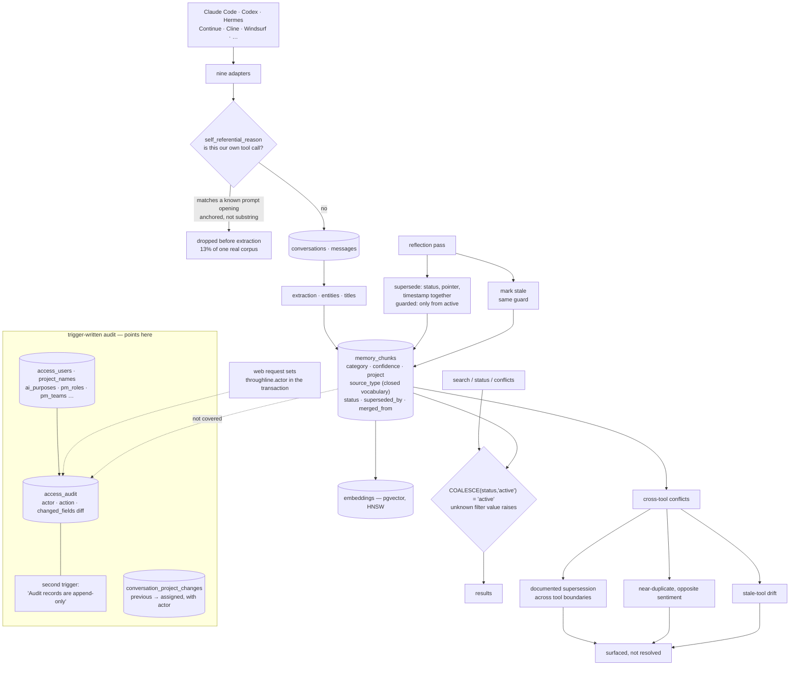

## 1. Executive Summary

Throughline is a self-hosted Postgres workspace that ingests conversation
transcripts from nine AI coding tools into one schema. The memory layer sits on
top: extraction produces chunks, a reflection pass supersedes and merges them,
and a conflict detector looks across tool boundaries.

Two marks, and the more interesting one is about what the system refuses to
remember.

**It recognises itself.** Four of Throughline's own jobs shell out to a coding
CLI, which records each call as a session transcript on disk, which the next
ingest sweeps back in as if it were the user's work. On the author's machine
that was *"459 of 3,423 conversations — 13% of the corpus"*, and it compounds,
because those sessions are generated constantly and sit at the front of a
newest-first queue. The filter that catches them is tested in both directions
with equal care, including the trap case whose docstring names the stake: a
conversation *about* the extractor must not be mistaken for the extractor,
*"the failure mode that would quietly delete real memory."*

**Every read filters to active, and the two usual mistakes are handled.** A
chunk carries active, superseded, merged or stale; the search builder coalesces
a null status to active rather than dropping the row, and raises on a status
filter it does not recognise rather than returning nothing.

That second habit has a scar behind it. The source-type column carries a closed
vocabulary added because *"a status query once filtered on two spellings that
had never been written, matched nothing, and reported 'no extraction yet' on a
database full of it."*

And the signature feature is one only a system in this position can have: per-tool
memory cannot surface a contradiction between two tools, because each tool sees
only its own transcripts. Throughline has all of them.

## 2. Mental Model

Transcripts in, chunks out, contradictions surfaced.

Nine adapters normalise nine tools' session formats into `conversations` and
`messages`. Extraction turns those into `memory_chunks` with a category, a
confidence and a project. A reflection pass then curates: superseding a chunk
when a later one replaces it, merging near-duplicates, marking others stale.

Around that sits a second system — teams, roles, templates, assignments — that
is project management rather than memory, and a third that is access control.
Both matter to this report only because of where the audit machinery points,
which is at them and not at the chunks.

The conflict detector is the reason the ingest breadth exists. Three classes:
a documented supersession whose two sides came from different tools, two
near-duplicate chunks from different tools whose text carries contradiction
markers, and a chunk from one tool that has gone stale because you switched to
another and never went back. The first is described with the right modesty:
*"We don't generate these; we surface what's already there."*

## 3. Architecture

## 4. Essential Implementation Paths

- **Schema:** `sql/schema.sql` — thirty-five tables, the triggers, the closed
  vocabularies.
- **Self-recognition:** `throughline/self_referential.py`.
- **Search and its filters:** `throughline/queries/memory.py`.
- **Reflection, supersession, merge:** `throughline/jobs/reflect_memory.py`.
- **Cross-tool conflicts:** `throughline/conflicts.py`.
- **Actor plumbing:** `throughline/api/deps.py`.

## 5. Memory Data Model

A chunk carries content, a category, tags, a confidence, a project name, an
optional expiry, a source type, a status, both supersession fields and a
merged-from array.

Two columns model vocabularies and only one of them is enforced. `source_type`
has a check constraint listing five values, with a comment explaining the
incident that produced it: a query filtered on spellings that had never been
written, matched nothing, and reported an empty extraction on a full database —
so *"adding a source type means editing this list and writing a migration."*
`status` takes four values across the code and has no constraint at all, which
leaves the same failure mode open on the column that matters more.

`confidence` is a separate `numeric(3,2)` from the status, so the store can
hold a chunk it does not believe without the number standing in for the state.

## 6. Retrieval Mechanics

pgvector with HNSW indexes for similarity, plus category, project and text
filters. The status handling in the filter builder is the part to copy: the
active case is written `COALESCE(status, 'active') = 'active'` because the
column is nullable with a default, and any status the caller supplies that is
not in the known set raises a `ValueError` naming the bad value rather than
appending a predicate that matches nothing.

Those two lines are the same lesson the source-type comment records, applied
where it was learned.

## 7. Write Mechanics

Ingest runs the self-referential check before extraction. The module's design
note is worth reading twice, because it is a rule most matchers get wrong: the
prompt markers live in that module rather than being imported from the scripts
that use them, *"because they must match what is already written in transcripts
on disk — text from a past run, which no longer tracks the current source. If
you change one of those prompts, add the new opening here; the old one must
stay, or previously-recorded sessions stop being recognised."* A matcher over
historical data is append-only, not refactorable.

The reflection pass supersedes by setting status, pointer and timestamp in one
statement guarded by `AND status='active'`, so two concurrent passes cannot
both retire the same chunk, and marks stale under the same guard.

## 8. Agent Integration

A CLI, an MCP server, a web application with users and sessions, a skill, and
adapters for nine tools' transcript formats. Deployment as Docker Compose, a
systemd unit, a launchd plist and a Windows path.

## 9. Reliability, Safety, and Trust

**Trust state — awarded**, on the four-value status, the single writer, and the
filter that every read shares.

**Negative eval — awarded**, on the self-recognition suite, which tests the
false-positive direction as thoroughly as the true-positive one.

**Audit log — withheld, and the reason is where the machinery points rather
than how good it is.** `record_access_change` is a trigger that diffs the row
before and after, computes a changed-fields array, and stamps an actor read
from a transaction-local Postgres setting that the web layer sets per request —
so the actor is the authenticated user rather than a value a caller can put in
a payload. A second trigger on the audit table itself raises *"Audit records are
append-only"* on any update, delete or truncate. That is the strongest audit
shape available in Postgres, and the loop that attaches it covers nine tables:
access users, project names, AI purposes, roles, members, teams, projects,
checkpoints and providers. `memory_chunks` is not among them. A chunk's
supersession leaves a pointer and a timestamp on the row and nothing else, so
the configuration is fully auditable and the memory is not.
`conversation_project_changes` is the one memory-adjacent exception: its own
trigger records every re-assignment of a conversation to a project, with the
previous value, the new one and the actor.

**Tombstone — withheld.** Supersession is keyed on the row. The nearest
value-keyed mechanism is the self-referential filter, which matches on content
and drops before ingest — but its markers are a list in source rather than a
durable record of something rejected, so re-ingesting content a person deleted
is not caught.

**Scope enforced — withheld.** `project_name` is a filter the caller may pass
and the default is every project; the access tables govern who may reach the
web application rather than which chunks a request may see. This is a
single-workspace tool and reads that way.

**Human review — withheld**, though the conflict detector is built to feed one.
It surfaces three classes and resolves none, which is the right boundary for a
heuristic — but nothing records a person's adjudication of a surfaced conflict,
and the resolution verbs are the same ones the reflection pass uses.

**Bi-temporal — withheld.** `created_at`, `superseded_at` and `expires_at` are
record time and a lease. Nothing tracks when a chunk's content was true.

## 10. Tests, Evals, and Benchmarks

**No paper** and no `CITATION.cff`.

108 test files. The self-recognition suite carries the mark; what is worth
adding is that it pins the *superseded* prompt wordings as well as the current
ones, so the filter keeps working on transcripts recorded before a prompt was
edited.

The `evals/` directory contains thirty seed questions with expected substrings,
a runner that compares answers with and without retrieved memory, and a README
that states plainly: *"The harness is scaffolded but not yet run."* It also
explains why it is deliberately not an LLM-judge eval. A committed harness with
no committed result and an honest label is a better position than a number with
no harness, and it means there is no retrieval-quality claim here to check.

The conflict detectors describe their own limits in the same register — a
*"high-precision heuristic; tunable threshold"* for the sentiment class, and
for the drift class, *"not technically a contradiction, but worth seeing."*

## 11. For Your Own Build

- **Test the false-positive direction of an exclusion filter as hard as the
  true-positive one.** A filter that drops the system's own noise will also
  drop real memory if it is loose, and the test that catches that is the one
  asserting real work is *not* flagged.
- **Anchor a matcher that runs over user content.** A debugging session quotes
  the thing it is debugging; substring matching on a prompt opening will eat it.
- **Keep the markers for historical data append-only.** When a matcher must
  recognise text written by an older version of your own code, importing the
  current constant is the bug — the old spelling has to stay.
- **Coalesce a nullable status before you filter on it**, and raise on a filter
  value you do not recognise. Both of those turn a silent empty result into
  something someone notices.
- **Give your status column the constraint you gave the one beside it.** The
  incident that produced the closed source-type vocabulary applies verbatim to
  the status.
- **Point the audit at the thing you are auditing.** A trigger-written,
  field-diffing, immutability-enforced audit over the configuration tables is
  excellent machinery aimed one table to the left of the memory.

## 12. Open Questions

- The audit trigger loop names nine tables. Is adding `memory_chunks` to that
  array as cheap as it looks, or does the volume of chunk writes make a
  row-level audit impractical — and if so, is a coarser record of supersessions
  the intended answer?
- `source_type` has a closed vocabulary because an unconstrained one caused an
  outage-shaped bug. What is keeping `status` open?
- The eval harness is committed and unrun. Is there a plan to publish a result,
  and would the thirty seed questions be replaced by the reader's own history
  first, as the README suggests?

## Appendix: File Index

- Schema, triggers, vocabularies: `sql/schema.sql`
- Self-recognition: `throughline/self_referential.py`,
  `tests/test_self_referential.py`
- Search and filters: `throughline/queries/memory.py`,
  `throughline/queries/curate.py`
- Reflection, supersession, merge: `throughline/jobs/reflect_memory.py`
- Cross-tool conflicts: `throughline/conflicts.py`
- Actor plumbing: `throughline/api/deps.py`
- Redaction: `throughline/pii.py`
- Evals: `evals/README.md`, `evals/questions.jsonl`, `evals/run_eval.py`

## History

**2026-09-19** — [`01975e76aec3d91e0faca6b3d72d216bf11ff072`](https://github.com/mkupermann/throughline/commit/01975e76aec3d91e0faca6b3d72d216bf11ff072) — first reading, at the head of `main`, status beta. Screened with `scripts/screen_repo.py` before anything was read: one build-time execution surface in a Makefile whose default target was checked, two pytest conftest files, three unpinned dependency surfaces and twenty-two floating ranges in the web package with a lockfile beside it; no instruction file addressed to a reading agent. Nothing was installed, built or run. MIT. Two marks. The project was renamed — the changelog records the default database moving from `claude_memory` to `throughline` with three documented upgrade paths and no data moved — and neither name appears elsewhere in this corpus; the two `claude-mem` reports here are different projects by different authors. The reading covered the chunk table and its two vocabularies, the search filter builder, the reflection pass's supersession and stale writers, the self-referential filter and its test suite, the cross-tool conflict detectors, the audit triggers and the tables they cover, and the eval harness; the project-management tables, the nine ingest adapters and the web application were read as context rather than as subject. Five marks are withheld with reasons in section 9, and the one worth repeating is `audit_log`: the trigger machinery is the strongest shape Postgres offers — a computed field diff, an actor from a transaction-local setting, and immutability enforced by a second trigger — and the loop that attaches it lists nine configuration tables and not `memory_chunks`.
