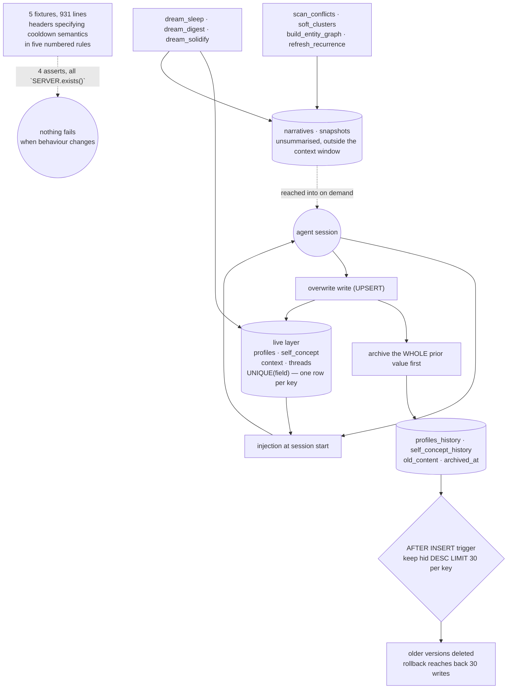

## 1. Executive Summary

Tideline (潮痕, "tide marks") is a memory substrate for agents, in Python over
SQLite — thirty files, one 2,297-line server, and a set of prompts and scripts
for nightly consolidation. It is licensed **PolyForm Noncommercial 1.0.0**,
which matters before anything else here: any commercial use is outside the
grant.

**No marks.** The reasons are structural rather than a list of near-misses, and
one of them is worth the page.

The architectural idea is stated well. Its README is addressed to an agent
rather than to a person, and draws a distinction most memory systems do not:
*"remembering is replaying what happened — carrying state is holding what those
events left behind, reshaped by everything since."* The live tables hold the
newest version of an agent's profile and self-concept for injection at session
start; the unsummarised past stays outside the context window.

The rollback layer under that is real. Profiles and self-concept are
overwrite-style writes, and before each `UPSERT` the whole prior value is
archived — with an `AFTER INSERT` trigger capping each key at its thirty most
recent versions, *"防无限膨胀"*, to prevent unbounded growth.

**And the behaviour is specified in prose and checked by nothing.** Five test
fixtures run to 931 lines, several with headers laying out precise semantics —
the cooldown fixture enumerates five rules for how connection failures differ
from item failures. Between them the five files contain **four `assert`
statements, and all four are the same check that `server.py` exists on disk.**
There is no CI workflow in the repository.

## 2. Mental Model

Two layers. A live layer of small overwritten tables — `profiles`,
`self_concept`, `context`, `threads` — that is what gets injected. And a deep
layer of narratives and snapshots that is not summarised and not injected, to be
reached into when the agent needs the actual past.

Consolidation happens between sessions, under prompts named for sleep:
`dream_sleep`, `dream_digest`, `dream_solidify`.

## 3. Architecture

## 4. Essential Implementation Paths

**The archive-before-overwrite** — `server.py:145-175`. `profiles_history` and
`self_concept_history` each take `old_content` and `archived_at`, indexed
`(key, hid DESC)`. The comment states the division: the live table holds only
the newest version, *"每 session 注入用"* — for per-session injection — and the
history is there for lookup and rollback on demand.

**The cap, in a trigger** — same block. `AFTER INSERT ON profiles_history`
deletes every row for that `(entity, ptype)` outside the newest thirty, and the
self-concept table has the matching trigger. Keeping the newest is the right
direction for a rollback layer; the consequence, unstated in the comment, is
that an agent's thirty-first-most-recent self-description is gone and there is
no record that it existed.

**The specification that is only a specification** —
`tests/fixture_phase13_cooldown.py:3-13`. Five numbered rules, precisely
expressed: a connection-class failure opens a global window paid once and stops
after the first failure, *"比「连败3条早退」更强的形状"* — a stronger shape than
bailing after three consecutive failures — because a hung network then costs one
ten-second wait rather than N; an item-class failure keeps the window shut and
records per-item so other items still mint; any success clears the window; the
night scan forces through with `force=True`; and the retry budget is cut to one
attempt at ten seconds.

The file is 240 lines. It contains one `assert`, and that assert checks that
`server.py` is present.

## 5. Memory Data Model

`narratives` and `snapshots` for the deep layer; `profiles`, `self_concept`,
`context` and `threads` for the live one, with `self_concept` carrying a
`UNIQUE(field)` over three fields — `fact`, `terrain`, `self_reflection`. No
status column, no supersession pointer, no validity window, no confidence and no
decay: `grep -rl` over the Python finds `tombstone`, `supersede`, `audit` and
`decay` in no file at all.

## 6. Retrieval Mechanics

Keyword search with embeddings optional — the project's own requirements note
says an unconfigured embedding setup *"降级为纯关键词搜索"*, degrades to pure
keyword search, and needs no GPU and no cloud. An attention-heatmap guide sits
in `docs/`.

## 7. Write Mechanics

Live writes overwrite and archive. Deep writes append narratives. Nightly
scripts scan for conflicts, build an entity graph, refresh recurrence and
compute soft clusters.

## 8. Agent Integration

An MCP server, a Kimi-code hook and shim, and three plugins — a memory mirror,
a session epilogue and a provider. `docs/who-can-use.txt` is a four-tier guide,
in Chinese, matching install depth to intent: everything for an agent owner,
server-plus-scripts for a framework builder, server-only to try it, and *"当智能
笔记本用"* — use it as a smart notebook — for structured search alone. Naming
the smallest useful configuration is a courtesy few projects extend.

## 9. Reliability, Safety, and Trust

**No marks, and the categories are absent rather than nearly met.** Nothing
records a rejected value, nothing carries an epistemic state, there is one
clock, there is no scope key — the design is one agent's own memory — nothing
waits for a person, and there is no append-only mutation record. The history
tables are a capped rollback layer, which is a different thing: thirty versions
per key, oldest silently dropped by a trigger.

**`negative_eval` is the one worth explaining rather than listing.** The
fixtures are not tests. They are inspection harnesses: they run the server, they
print, and a person reads the output. The semantics in their headers are more
carefully specified than most projects manage — and a change that broke every
one of those five cooldown rules would leave all five files exiting zero.

**The licence.** PolyForm Noncommercial 1.0.0 permits any noncommercial purpose
and no commercial one. For a reader evaluating memory substrates to build on,
that is the first fact rather than a footnote.

**A screening limitation to state plainly.** `screen_repo.py` reported that it
could not see an execution surface in this tree — there is no manifest of a kind
it parses — so it returned "unscreened rather than clean". The tree was read by
hand instead: a `Dockerfile`, Python scripts, hooks under `kimi-code/`, and no
CI workflow directory. Nothing was installed and nothing was run.

## 10. Tests, Evals, and Benchmarks

Five files under `tests/`, 931 lines, named `fixture_phase12` through
`fixture_phase16`. Four `assert` statements in total, each of them
`assert SERVER.exists(), f"server.py not found at {SERVER}"`;
`fixture_phase16_provider_traj.py` has none. The cooldown fixture prints nine
times.

No CI: there is no `.github/workflows` directory. No benchmark, no eval harness
and no paper.

The gap is specific rather than general. This is not a project that has not
thought about its behaviour — the headers are evidence that it has thought about
it more carefully than most. It is a project whose thinking lives in prose that
nothing executes, which is the same distance between intent and enforcement this
atlas records elsewhere as a comment asserting what no test does.

## 11. For Your Own Build

### Steal

- **Archive the whole prior value before an overwrite.** Two extra columns and
  an index turn a destructive UPSERT into a rollback point, and the live table
  stays small enough to inject.
- **Cap the history in a trigger, not in application code.** The bound then
  holds for every writer, including the next one.
- **Write the "who can use what" document.** Four tiers matched to intent, with
  the smallest one being *use it as a smart notebook*, tells a reader whether to
  keep reading — and admitting that the smallest tier is useful costs nothing.
- **Separate what is injected from what is kept.** The live layer is small
  because the deep layer exists, and the deep layer is honest because nothing
  summarised it.

### Avoid

- **Specifying behaviour in a fixture header and asserting none of it.** Five
  numbered rules about cooldown semantics, 240 lines, and one assertion that a
  file exists. The rules are good; nothing defends them.
- **A capped history without a marker for what was dropped.** Rollback reaches
  back thirty writes; at thirty-one there is no value and no record that there
  was one.

### Fit

Take the archive-before-overwrite pattern anywhere you have a table that is
overwritten and occasionally wrong. Take the whole system only if your use is
noncommercial, and write the assertions yourself.

## 12. Open Questions

- The history trigger keeps thirty versions per key. Was thirty chosen from
  observed rollback depth, and should exceeding it leave a marker?
- The fixtures specify behaviour precisely and assert nothing. Are they intended
  to become tests, or are they design records that happen to be executable?
- There is no CI. Is a workflow planned, and would the fixtures be what it runs?
- `scan_conflicts.py` exists among the nightly scripts. What does a detected
  conflict do — surface, annotate, or nothing?

## Appendix: File Index

| Path | What it holds |
| --- | --- |
| `server.py` | the whole MCP server, the schema, the history tables and their capping triggers |
| `prompts/dream_sleep.md`, `dream_digest.md`, `dream_solidify.md` | the nightly consolidation prompts |
| `scripts/scan_conflicts.py`, `soft_clusters.py`, `build_entity_graph.py`, `refresh_recurrence.py` | the between-session passes |
| `plugins/memory_mirror.py`, `session_epilogue.py`, `tideline_provider.py` | the integration surface |
| `docs/who-can-use.txt` | the four-tier install guide, in Chinese |
| `tests/fixture_phase12..16*.py` | 931 lines, four assertions, all of them the same path check |
| `LICENSE` | PolyForm Noncommercial 1.0.0 |

## Appendix: Recorded Searches

Run from the root of the checkout at the pinned commit.

| Claim | Command | Result at this pin |
| --- | --- | --- |
| The fixtures assert almost nothing | `for f in tests/*.py; do printf '%s %s\\n' "$f" "$(grep -c assert $f)"; done` | 1, 1, 1, 1, 0 across 931 lines; every one is `assert SERVER.exists()` |
| No assertion exists outside `tests/` | `grep -rn "assert" --include='*.py' .` | Only the four path checks |
| There is no CI | `ls .github/workflows` | No such directory |
| The history is capped, not append-only | read `server.py:155-175` | `AFTER INSERT` triggers delete all but `hid DESC LIMIT 30` per key |
| No epistemic vocabulary exists | `grep -rl "tombstone\|supersede\|audit\|decay" --include='*.py' .` | Nothing for any of the four |
| The licence is noncommercial-only | `head -3 LICENSE`; `grep -n -i 'noncommercial' LICENSE` | PolyForm Noncommercial 1.0.0; *"Any noncommercial purpose is a permitted purpose"* |
| The screen could not see the execution surface | `python3 scripts/screen_repo.py <tree>` | Reported the tree as *"unscreened rather than clean"*; read by hand instead |

## History

**2026-09-20** — [`76490fe2c422f1213e735e63c289fef5ae8044f6`](https://github.com/ennisaaaaaaaa-stack/tideline-memory/commit/76490fe2c422f1213e735e63c289fef5ae8044f6) — first reading, at 30 files. The screening script reported that it could not see an execution surface in this tree and returned "unscreened rather than clean", so the tree was read by hand: a Dockerfile, Python scripts, hooks under `kimi-code/`, and no CI directory. Nothing was installed and nothing was run. **PolyForm Noncommercial 1.0.0** — commercial use is outside the grant, which is the first thing a reader evaluating this should know. No marks: nothing records a rejected value, nothing carries an epistemic state, there is one clock, there is no scope key, nothing waits for a person, and the history tables are a rollback layer capped at thirty versions per key rather than an append-only record. The fixtures specify their intended semantics in unusually careful prose and contain four assertions between them, all of them the same check that `server.py` exists.
