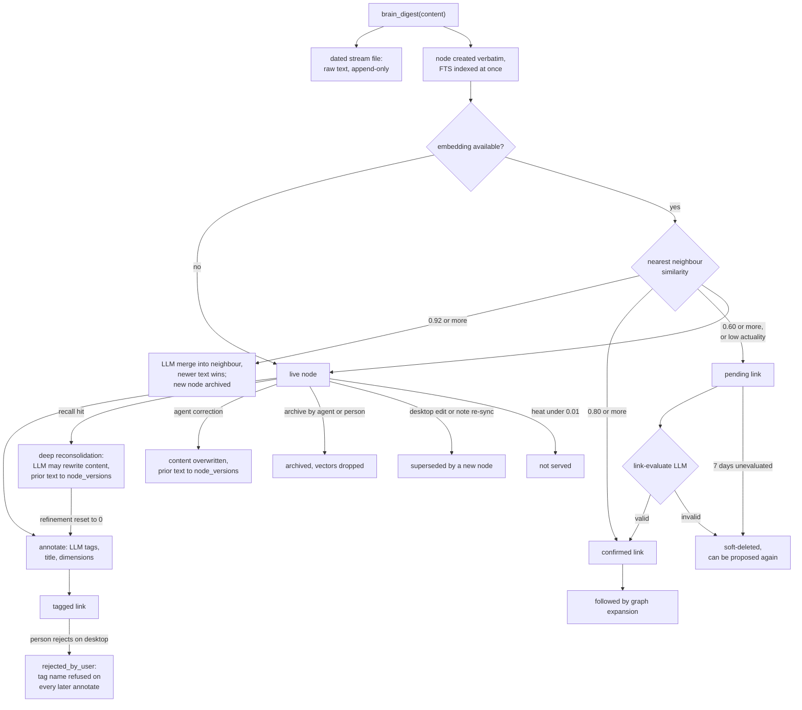

## 1. Executive Summary

TideMind is a local-first memory layer for coding and chat agents: an MCP
server with three tools, `brain_prepare`, `brain_recall` and `brain_digest`,
over one SQLite graph of nodes and typed links, plus an Electron desktop app and
note-source importers for Logseq, Obsidian, Apple Notes and Notion. Digests are
stored verbatim. Everything else is done afterwards by a scheduler of LLM and
heuristic passes that tag, link, merge, rewrite, crystallise and fade.

What is notable is the care in the read predicates and in the one place a
person corrects the machine. Archived and superseded rows are filtered on the
FTS query, the vector arm, the hybrid expansion and the graph walk, each with a
comment naming the leak it closes. A tag a person rejects stays rejected against
the background tagger.

What is weak is that the model owns the content. Recall triggers a
reconsolidation that may rewrite a memory's text, a dedup merge tells the model
the newer text wins, and nothing a person approves stands between those writes
and the next session.

Four marks: `tombstone` on tag rejection, `trust_state` on link status,
`audit_log` on `node_versions`, and `negative_eval` on the expansion and hybrid
exclusion suites. Each rests on one subsystem, and section 9 names the three
withheld.

## 2. Mental Model

A memory is a node whose content is whatever the agent passed to
`brain_digest`, stored as written (`src/tools/digest.ts:464-527`). It is
searchable by BM25 as soon as the FTS trigger fires, and by vector once the
embedding lands. From then on it is material for a background graph, and the
system serves it as settled until something rewrites or hides it.

**Landing decides identity by similarity.** The new node's nearest neighbour
decides what happens next (`src/graph/landing.ts:49-175`). At 0.92 or above the
new text is merged into the neighbour by an LLM and the new node is archived. At
0.80 a `confirmed` link is written, at 0.60 a `pending` one, and a node whose
inferred actuality is below 0.3 gets only `pending` links. The thresholds live
in a strategy file the desktop can edit
(`data/strategies/metabolism-params.system.md:40-43`).

**Links are the only thing with an epistemic state.** A `pending` link waits for
`runLinkEvaluate`, which asks a model whether the relation holds and either
confirms it or soft-deletes it (`src/metabolism/link-evaluate.ts:229-242`).
Unevaluated ones expire after seven days. Traversal follows confirmed links
only. A person can mark a tag link `rejected_by_user` from the desktop, and
nothing ages that row out.

**Content changes in five ways, and only one is a person's.** The agent's
`correction` overwrites text in place. Deep reconsolidation on recall lets a
model rewrite it (`src/metabolism/reconsolidate.ts:421-424`). A dedup merge
folds a new digest in under a prompt that says the newer text wins on conflict
(`data/strategies/dedup-merge.system.md:7`). Crystal enrichment rewrites crystal
nodes. The desktop edit supersedes the old node with a new one. Every rewrite
through `updateNode` leaves the prior text in `node_versions`.

**A memory stops being served when it is archived, superseded or cold.** Archive
sets `archived=1` and heat 0.02 and deletes the vectors; supersession sets
`is_superseded=1` and heat 0.01. Heat decay only lowers rank until a node falls
under the 0.01 floor. The skill tells the agent to archive when the user says
"forget" (`data/skill/base-skill.md:23`), so forgetting is hiding: the row, its
versions and the daily stream file keep the text.

## 3. Architecture

Three kinds of process share one SQLite file under `~/.tidemind`
(`src/config.ts:60`) in WAL mode: a stdio MCP server per connected agent
(`src/index.ts`), a daemon that ticks the metabolism scheduler every minute
(`src/daemon.ts`), and the Electron desktop app, which imports the server
modules through an `@server` alias and adds its own IPC handlers
(`client/electron/ipc/`). The MCP process also runs maintenance
opportunistically on every `brain_prepare` (`src/tools/prepare.ts:74`).

Storage is `nodes`, `links`, `node_versions`, `operation_log`, `timeline_events`
and a set of support tables (`src/db/schema.ts:70-560`), an FTS5 index kept by
triggers, and `nodes_vec` in sqlite-vec holding one embedding per content
segment. Every digest is also appended to a dated Markdown stream file under a
lock with `fsync` (`src/stream/writer.ts`). The client carries cloud-sync
triggers and a reconciler for a hosted service the README lists as not yet
available.

LLM work goes through a client that calls Anthropic, Vertex or Gemini directly
or drives an installed CLI (`src/llm/client.ts`, `src/llm/cli/`), with a
circuit breaker per task. Embeddings come from Ollama, Vertex or Gemini.
Without either, digest and BM25 recall work and every metabolism task marked
`requiresLLM` is skipped (`src/metabolism/tasks.ts`).

### Deployment and ergonomics

Nothing external is required to store and search: `npm install`, `npm run
build`, and the desktop writes the MCP and hook configuration for each host.
Vector search waits for a node-count gate, 50 by default (`src/config.ts:98`).
The store is readable with any SQLite client, and the stream files are plain
Markdown. Repair by hand is possible, but the graph has many derived columns
(heat, maturity, connectivity, `edit_seq`, `decay_gen`) that background tasks
recompute and cross-device reconciliation compares. The macOS app is the
supported install; the source path builds a native `better-sqlite3` and a
macOS-only keychain addon in a `postinstall`.

## 4. Essential Implementation Paths

**Write.** `brain_digest` (`src/index.ts:293-334`) → `digest`
(`src/tools/digest.ts:48`). The default is asynchronous: the stream line is
written, a `pending_digests` row is enqueued as `processing`, and the rest runs
detached (`:290-381`). `processDigestContent` creates the node with no model
call, then `generateAndStoreEmbedding` inserts segment vectors and calls
`findLandingConnections` (`:589-668`). A failed async digest is retried by the
`digest-retry` task.

**Correct, unlink, archive.** On the same tool, `intent: correction` with
`target_node` overwrites content through `updateNode(..., 'correction')`,
re-embeds, and writes a `meta` node holding the before and after text
(`digest.ts:82-156`). `correction` with `target_link` soft-deletes every live
link between the pair (`:159-194`). `archive` with `target_node` calls
`archiveNodeWithVectors`, guarded on `archived = 0` (`:197-234`). A missing
correction target can raise an MCP elicitation when `interactive_mode` is `ask`;
the default is `silent` (`src/config.ts:114`).

**Recall.** `brain_recall` (`src/index.ts:199-268`) validates the inputs, maps
legacy fields (`src/tools/recall-input.ts`), and dispatches in `recall`
(`src/tools/recall.ts:26-526`): `node_id`, `vault_file`, `index_ref`,
`from_node` traversal, a hybrid query, or a browse by recency. The query branch
is `searchHybrid` (`src/search/hybrid.ts:14-226`): BM25 over FTS5 and, past the
gate, `searchVector`, fused as `0.3·bm25 + 0.5·vector + 0.1·heat +
0.1·maturity`, then one hop over confirmed links from the top five.

**Recall writes.** Every returned node gets `bumpHeat` (`recall.ts:281-307`).
`reconsolidateOnRecall` runs on the exact matches (`:331-335`) and may create
pending links or rewrite content. A query recall also fires `revalidateLinks`
without awaiting it (`:491-512`).

**Prepare.** `brain_prepare` → `prepare` (`src/tools/prepare.ts:23-78`) reads
the synthesised `user-profile` meta node, up to 15 keystones, 30 tags, 20
crystals and 15 nodes active in the last 48 hours, each filtered on
`is_superseded = 0 AND archived = 0`. The SessionStart hook
(`src/hook-session-start.ts`) formats the same output under a 9,000-character
budget and a 9,800 hard cap (`src/hook-session-format.ts:17-19`).

**Background.** `ALL_TASKS` (`src/metabolism/tasks.ts`) lists annotate,
link-evaluate, pending-link GC, link-discover, synaptic decay, keystone-enrich,
tag-promote, divergent scan, crystal emergence, temporal crystal, profile
synthesis, Learning II and III, and a structure-holes precompute, each on its
own interval and gate.

**Desktop writes.** `write:editNode` digests the new text synchronously and
supersedes the old node (`client/electron/ipc/write.ts:26-69`);
`write:archiveNode` and `write:deleteLink` route through `digest` (`:72-113`);
`links:rejectTag` and `links:undoRejectTag` handle tag rejection
(`client/electron/ipc/nodes.ts:561-630`, `:632-683`).

## 5. Memory Data Model

| Table | Holds | Where |
| --- | --- | --- |
| `nodes` | content, title, type, tags JSON, heat, refinement, connectivity, independence, specificity, subjectivity, actuality, role flags, `source_tool`, `source_session`, `source_stream`, `source_timestamp`, `created`, `version`, `archived`, `is_superseded`, `edit_seq`, `decay_gen` | `src/db/schema.ts:70-123` |
| `links` | `from_id`, `to_id`, relation array of type and confidence, strength, note, `auto`, status, `deleted` | `:126-146`; nine relation types |
| `node_versions` | prior version and content, `change_reason`, `changed_at` | `:147-155` |
| `operation_log` | every prepare, recall and digest call with input summary, tool, session, agent id and recall diagnostics | `:157-174` |
| `timeline_events` | activity-feed rows with type, subtype, detail JSON, node ids and actor | `:405-416` |

**Provenance is caller-stated.** `source_tool` and `source_session` come from
the `source` object the agent passes to `brain_digest` (`digest.ts:481-482`),
not from the `EB_AGENT_ID` the MCP process is launched with, which reaches only
`operation_log`. `source_stream` points at the raw stream entry, the one
pointer that cannot drift from what was said.

**Time.** `created` is the digest time, or a note's inferred authoring time for
imported segments; `source_timestamp` is the ingestion time. No field records
when a fact held.

**Scope.** No scope column. The `agents` table identifies installations for the
bridge guard, which refuses memory to a removed or superseded installation
(`src/agent-bridge-guard.ts`); it partitions nothing.

**Derived categories.** `specificity`, `subjectivity` and `actuality` are
floats the annotator sets, and `type` is derived from them
(`src/metabolism/annotate.ts:185`). The architecture document's
record/knowledge/belief/hypothesis/intention categories are computed at read
time and not stored.

## 6. Retrieval Mechanics

The query branch is hybrid. BM25 always runs, over-fetching and filtering
`archived` and `is_superseded` in SQL (`src/db/fts.ts:96-97`). The vector arm
runs when the node-count gate opens and skips archived and superseded hits
(`src/search/vector.ts:49`). Scores are fused linearly with heat and an
intent-weighted maturity bonus, crystals get +0.15 and keystones +0.05, and
neighbours of the top five enter at 0.7 of their heat-and-maturity score
(`hybrid.ts:91-214`). `match: 'all'` switches BM25 to AND and drops the vector
arm and the neighbours.

**Filters are applied after ranking.** Tags, `from_agents` and `sort: recent`
are post-filters over an over-fetch of five times the limit, capped at 100
(`recall.ts:137-180`). A narrow filter on a large store can return fewer
matches than exist.

**Recall never returns empty on the query path.** When fewer than five exact
matches survive, a heat fallback fills toward ten with the hottest nodes of the
last month that pass the same type, tag and source filters, labelled
`related_matches` (`recall.ts:209-257`).

**The browse path widens.** Without a query, the recent-nodes branch honours
`from_agents`, but the graph expansion that follows it adds neighbours with no
source or tag predicate (`recall.ts:259-279`).

**Detail mode returns links as facts.** Up to five links per node, with target
title, relation and strength and no status, so a pending relation reads the
same as a confirmed one (`recall.ts:389-404`). `computeFreshness` adds a
contradiction note when any listed link is a `contradicts`, pending included
(`src/utils/freshness.ts:29-32`).

**Prepare is the injected context.** Its sections are fixed-size lists ranked
by link count, heat and recency; nothing is query-dependent except the `hint`
logged to `operation_log`.

## 7. Write Mechanics

Capture is explicit and verbatim. The skill asks the agent to digest before
every reply, with a low bar (`data/skill/base-skill.md`), and the PreCompact
hook reminds it before compaction. Two gates run before storage: content under
five characters, or made only of bullets and separators, is refused, and a
heuristic sets initial heat from length and URL-ness (`digest.ts:261-280`).
Nothing filters secrets or instructions.

**Consolidation is model-driven and ongoing.** Dedup merge rewrites the
neighbour under a prompt that favours the newer text, and refuses a result
shorter than half the old text and shorter than the new
(`src/graph/dedup.ts:33-72`). Deep reconsolidation on recall can replace
content and resets `refinement` to 0, which sends the node back through
annotation. Crystal emergence writes new `crystal` nodes from hubs, and
temporal crystals summarise periods.

**Updates keep the old text.** Every content change through `updateNode`
appends the prior version to `node_versions`. The desktop edit instead creates
a node and supersedes the old one, moving its links and adding an `updates`
link between them (`src/db/node-lifecycle.ts:162-234`).

**The desktop edit can hide what it edits.** `write:editNode` calls `digest`
with `async: false`, which runs landing with the dedup merge enabled. If the
edited text is 0.92 similar to its own original, as a small edit is likely to
be, the new node is merged into the old and archived. `editNode` then
supersedes the old node with that archived one (`write.ts:38-53`;
`digest.ts:612-645`), and both are excluded from every read. The flow test
mocks `isVecLoaded` to `false`, the one setting that skips this branch
(`tests/tools/edit-node-flow.test.ts:45-48`). This was read, not reproduced.

**Deletion.** No MCP or desktop verb hard-deletes a node. Archive hides it and
drops its vectors; unarchive re-embeds. Only a note-source rollback deletes
rows (`src/integrations/shared/rollback.ts:80-83`). The stream file is never
pruned.

### Operational cost

- Write: asynchronous by default; the agent waits for a stream append and an
  enqueue. The node is searchable by BM25 within the detached task, and by
  vector once the embedding call returns. No LLM runs on the write path.
- Background: annotation, link evaluation, reconsolidation and the crystal
  passes each call a model on bounded batches. None rereads the whole store in
  one pass, though profile synthesis and Learning II read wide aggregates.
- Read: recall returns 8 detail items or 30 index items by default, and may
  start LLM reconsolidation on up to three nodes per call. Session injection is
  capped at 9,800 characters and sits at session start.

## 8. Agent Integration

Three MCP tools, whose descriptions the desktop can override through a
`mcp-descriptions.json` in the data directory (`src/index.ts:132-146`). Hook
scripts cover Claude Code, Codex, Gemini, Cursor, Windsurf, Kimi, OpenClaw,
Qwen and Pi, each with a SessionStart or equivalent that injects the prepare
output, and PreCompact and PostCompact scripts that prompt a digest. Per-host
skills live in `data/skill/`.

The agent holds every verb it needs to change memory: store, overwrite any node
by id, archive any node, and cut any link, all through `brain_digest`, with no
confirmation in the default `silent` mode. It cannot hard-delete, reject a tag,
or reach the desktop's edit and restore handlers.

## 9. Reliability, Safety, and Trust

**The read predicates are consistent.** `archived` and `is_superseded` are
checked on the FTS query, the vector loop, hybrid expansion, graph expansion,
every direct-lookup branch in recall, and each prepare section. Comments at
each site record the leak it closed, such as archive's heat of 0.02 sitting
above the 0.01 floor (`src/graph/expansion.ts:84-88`).

**Model output becomes memory without review.** Deep reconsolidation, dedup
merge and crystal enrichment rewrite content, and landing plus link evaluation
decide the graph. `node_versions` keeps what was replaced, but nothing flags
the rewrite to the agent, and recall serves the rewritten text.

**Correction does not stick against a re-digest.** A corrected node is an
ordinary node. A later digest of the old wrong text lands at high similarity to
it, and the merge prompt tells the model to prefer the newer input.

**Privacy.** Forgetting archives. The text stays in the row, in
`node_versions`, in the correction meta node and in the dated stream file.

Capability marks:

- `tombstone` — awarded on tag rejection; the record states it covers tag
  assignments only.
- `trust_state` — awarded on link status; nodes carry none, and recall's
  detail mode shows pending links unlabelled.
- `audit_log` — awarded on `node_versions`, for content rewrites.
  `operation_log` records MCP calls including recalls, and `timeline_events`
  is an activity feed that summarises some tasks as counts; neither is a
  mutation record.
- `negative_eval` — awarded; evidence in section 10.
- `bitemporal` — withheld. `created` against `source_timestamp` separates
  authoring from ingestion, not validity from record time.
- `scope_enforced` — withheld. The store is one graph for every agent and note
  source by design. The nearest thing, `from_agents`, filters on a
  `source_tool` string the writer supplies, and `brain_prepare`, an
  agent-reachable read over the same store, has no predicate. The browse
  path's graph expansion drops the filter.
- `human_review` — withheld. Tag rejection, edit and archive on the desktop
  are a person's corrections after the fact; no memory waits in a state for
  one, and pending links are resolved by a model or by expiry.

## 10. Tests, Evals, and Benchmarks

Nothing was installed, built or run for this report; everything below is from
reading the tests at the pin. CI runs `npm test` on push and pull request
(`.github/workflows/ci.yml`).

**The negative cases.** `tests/graph/expansion.test.ts:84-96` archives B
through `archiveNode` and asserts B and the two nodes behind it are absent
while sibling C is present; `:98-105` does the same for a superseded node at
heat 0.9; `:107-118` asserts a neighbour on a pending link is not reached while
one on a confirmed link is. `tests/search/hybrid.test.ts:211-277` asserts that
pending-linked, archived and superseded neighbours stay out of real hybrid
results beside the BM25 hit. `tests/db/links-rejection.test.ts:87-100` asserts
each link reader omits a rejected link and returns the kept one.

**The rejection.** `tests/metabolism/tag-promote-rejection.test.ts:55-133`
asserts tag-promote neither re-scores nor re-creates a rejected tag link. The
annotate half of the tombstone, the name filter, has no test.

**Where a test sets aside the risky branch.** The edit-node flow test disables
vectors, and the recall case named `should not return archived nodes` lowers
heat to 0.005 without setting `archived` (`tests/tools/recall.test.ts:205-212`).

**Scale and host work.** Much of the suite covers host integration, schema
migrations, scheduler locking and a metabolism performance harness with
committed thresholds (`scripts/metabolism-worker-candidate-thresholds.json`).
No retrieval-quality evaluation, benchmark result or paper is in the tree; the
README cites Bush and Clark and Chalmers as inspiration.

## 11. For Your Own Build

### Steal

- **Put the lifecycle predicate on every read arm, and write down the leak.**
  FTS, vector, expansion and direct lookup each check `archived` and
  `is_superseded`, because a heat floor alone let archived rows back in.
- **Keep a person's rejection as a row and feed its name to the extractor.**
  Changing a link's status instead of deleting it gives the next annotation
  pass something to consult, and the recent rejections double as negative
  examples in the prompt.
- **Give inferred relations a pending state and traverse only confirmed ones.**
  Cheap similarity proposes, a slower judge confirms, and retrieval walks only
  what was confirmed.
- **Store the raw input outside the graph.** A dated append-only stream with a
  pointer from each node lets any rewrite be checked against what was said.
- **Budget session injection below the host's own limit, with a floor for the
  profile.**

### Avoid

- **Letting a model rewrite stored content on read.** Reconsolidation on recall
  turns every retrieval into a possible write, with the prior text kept and
  nothing surfaced.
- **A merge prompt that prefers the newer input.** It is how a corrected value
  comes back: the old claim, re-digested, is newer than the correction.
- **An edit built as "store new, then supersede old" through a path that can
  merge.** Run the edit with dedup disabled, or supersede only after checking
  the new node is live.
- **Status on the edge but not in what the agent reads.** A pending link shown
  without its status is a confirmed link to the reader.
- **Soft-deleting a model-rejected candidate.** A soft-deleted link is
  invisible to the existence check, so the discoverer can propose it again.

### Fit

This suits one person who wants every agent and note app they use to share one
growing, self-organising store on their own machine, and who accepts that a
model will edit that store continuously. The desktop, hooks and host catalogue
are extensive, and the local footprint is one file. It is the wrong base for
anyone who needs memory to stay as written, for a team or tenant boundary, or
for a system where a correction must hold: the design treats rewriting as the
feature, and its controls sit on tags and links rather than on content.

## 12. Open Questions

- Does the desktop edit collapse into an archived node in practice, and how
  often do small edits clear the 0.92 dedup threshold against their original?
- How often does deep reconsolidation rewrite content, and does anyone inspect
  `node_versions` afterwards?
- Does link-discover re-propose links the evaluator soft-deleted, and at what
  token cost per week?
- What does the hosted TideMind Cloud do with the metabolism tasks the
  client's reconciler anticipates?
- How do several MCP processes and the daemon behave under `busy_timeout`
  contention on a large store? A contention test exists and was not read in
  full.

## Appendix: File Index

- **Schema:** `src/db/schema.ts`, `src/db/nodes.ts`, `src/db/links.ts`,
  `src/db/node-lifecycle.ts`, `src/db/fts.ts`, `src/db/vectors.ts`.
- **Write:** `src/tools/digest.ts`, `src/graph/landing.ts`,
  `src/graph/dedup.ts`, `src/stream/writer.ts`, `src/db/pending-digests.ts`.
- **Retrieval:** `src/tools/recall.ts`, `src/tools/recall-input.ts`,
  `src/search/hybrid.ts`, `src/search/bm25.ts`, `src/search/vector.ts`,
  `src/graph/expansion.ts`, `src/utils/freshness.ts`.
- **Context:** `src/tools/prepare.ts`, `src/hook-session-start.ts`,
  `src/hook-session-format.ts`, `data/skill/base-skill.md`.
- **Background:** `src/metabolism/tasks.ts`, `scheduler.ts`, `annotate.ts`,
  `link-evaluate.ts`, `pending-link-gc.ts`, `link-discover.ts`,
  `reconsolidate.ts`, `synaptic.ts`, `divergent.ts`, `tag-promote.ts`.
- **MCP and desktop:** `src/index.ts`, `src/mcp-tool-contracts.ts`,
  `client/electron/ipc/write.ts`, `client/electron/ipc/nodes.ts`.
- **Tests:** `tests/graph/expansion.test.ts`, `tests/search/hybrid.test.ts`,
  `tests/db/links-rejection.test.ts`,
  `tests/metabolism/tag-promote-rejection.test.ts`,
  `tests/tools/edit-node-flow.test.ts`, `tests/tools/recall.test.ts`.

### Recorded searches

Checked against the checkout at the pinned revision.

- `rg -n "rejected_by_user" -g '!tests/**'` — one writer, `client/electron/ipc/nodes.ts:584`; readers in `src/db/links.ts`, `annotate.ts`, `link-evaluate.ts`, `structure-holes.ts` and the client.
- `rg -n "getRejectedTag|getRecentRejected" src client/electron` — `annotate.ts:13`, `:109`, `:117` only.
- `rg -ln "rejectedTagNames|getRejectedTagNamesForNode" tests` — no match; the annotate filter is untested.
- `rg -n "node_versions" src client/electron` — inserts at `src/db/nodes.ts:159` and `src/metabolism/divergent.ts:577`; one DELETE, `src/db/node-lifecycle.ts:54`.
- `rg -n "UPDATE nodes SET[^'\`]*content" src client/electron` — `divergent.ts:582` only.
- `rg -n "DELETE FROM (timeline_events|operation_log|node_versions)" -g '!tests/**'` — `node-lifecycle.ts:54` only.
- `rg -n "linkExists" src/metabolism/link-discover.ts` — `:92`, `:155`; `linkExists` checks `deleted = 0` (`src/db/links.ts:211-227`).
- `rg -n "from_agents|fromAgents" src` — the contract, the handler, the types, `recall-input.ts`, `recall.ts` and `listNodes`; in `prepare.ts` only inside the guidance string (`:227`), and none in `src/graph/expansion.ts`.
- `rg -n "isVecLoaded" tests/tools/edit-node-flow.test.ts` — mocked to `false` at `:47`.
- `rg -n -o -i 'arxiv[^ ]{0,40}|bibtex|@article|@misc|doi\.org[^ ]{0,30}|CITATION' .` — every hit is inside `elicitation`; no paper and no `CITATION.cff`.
- `rg -n -i 'renamed|formerly' -g '*.md' .` — no match. The code migrates `~/.external-brain` to `~/.tidemind` (`src/index.ts:37`), and `rg -il 'external-brain|external brain'` over the atlas's `content/` finds no report under the old name.

## History

**2026-09-30** — [`29cef6271b6e044923d4bf740efcc4c114c55225`](https://github.com/SawyerHan-AI/TideMind/commit/29cef6271b6e044923d4bf740efcc4c114c55225) — first reading, at the head of `main`, a commit from the same day. Four marks: `tombstone`, `trust_state`, `audit_log`, `negative_eval`; section 9 names the three withheld. Screened before reading: no auto-run surface, two build-time execution points (an npm `postinstall` running `electron-rebuild`, and a `binding.gyp` native addon), five dependency files inside the cooldown — every file in a depth-1 clone dates to the tip — four unpinned surfaces, and no agent-instruction file. Read with `rg` and `sed`; nothing installed, built or run.
