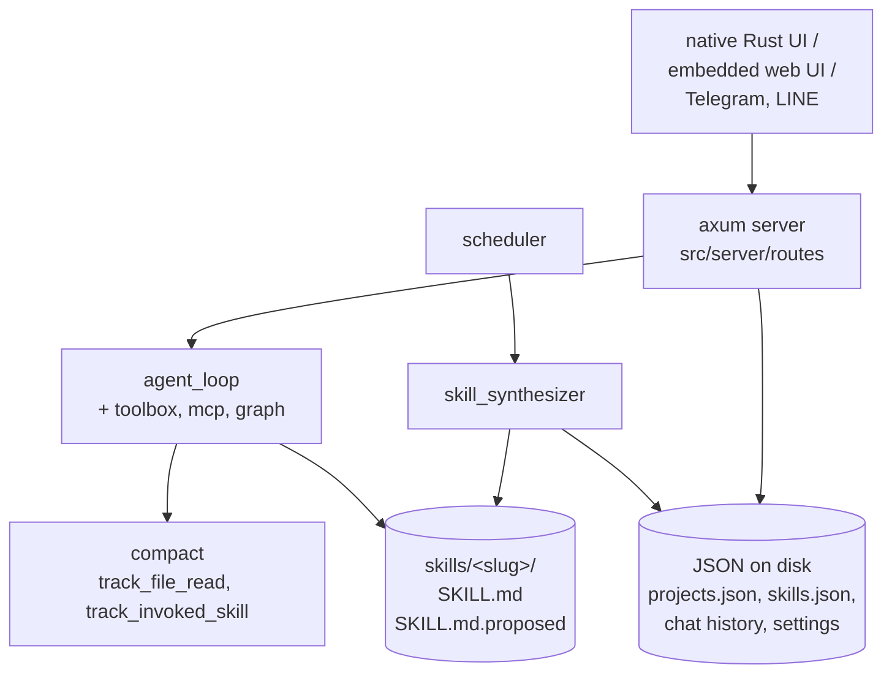

## 1. Executive Summary

TigrimOSR is a single-binary Rust agent platform — desktop app, embedded web
server, swarm orchestration, MCP, plugins, Telegram and LINE bots — of which the
memory-relevant part is a **skill synthesizer**: a background pass that reads
finished chat sessions, the user's thumbs-up/down feedback and subagent traces,
and proposes new or updated skills.

It belongs in this atlas for one mechanism. When the synthesizer wants to change
an existing skill, it does not change it. It writes `SKILL.md.proposed` beside the
live `SKILL.md`, sets the registry row to `review_status: "pending"` with the
model's `rationale` and a `based_on` list of the sessions it drew from, and stops.
The live skill is untouched and still in use. A person opens the proposal, sees a
real before/after diff (`get_proposed_diff` returns both files), and approves —
at which point promotion is a `tokio::fs::rename`. That is the
[promotion between tiers](../../patterns/promotion-between-tiers/) pattern with an
atomic commit and a human gate, and it is better staged than most of this atlas.

One rule inside it is worth pulling out on its own: `require_approval` defaults to
true, and the code forces it true regardless of settings when the target skill's
`source == "custom"`, with the comment *"User-authored (custom) skills are never
overwritten silently"*. Automation may rewrite what automation wrote; it may never
rewrite what a person wrote without asking. Nothing else in this atlas escalates
its approval requirement based on who authored the memory.

**The weakness is exactly symmetric to the strength, and it is the atlas's
recurring finding in an unusually clean form.** Approval is durable — a file
rename, a registry row, a `SKILL.md` on disk. *Rejection is not.* The proposal
list lives in a process-lifetime `OnceLock<Mutex<SynthesizerStatus>>` with no load
or save; rejecting a create deletes the skill folder and drops the registry row;
rejecting an update deletes the `.proposed` file and resets the status. Restart the
binary and there is no record that anything was ever proposed or refused, and
nothing in the synthesis path consults past rejections. The same sessions produce
the same proposal again.

## 2. Mental Model

Two kinds of memory, with very different levels of care.

```text
project.memory   one memory.md per project — a blob, injected whole
skill            SKILL.md + registry row {enabled, review_status, auto_meta}
                   auto_meta: {kind, based_on[], generated_at, model, rationale}
chat sessions    persisted history, and the synthesizer's raw material
```

The skill lifecycle is the interesting one:

```text
finished sessions + user feedback + subagent traces
        │  (scheduler → run_synthesis)
        ▼
   Proposal {kind: create|update, name, content, rationale, based_on}
        │
   ┌────┴───────────────────────────┐
   │ require_approval = true (default; forced for source=="custom")
   ▼                                ▼  false
create: SKILL.md written,     write straight through,
        enabled=false,        review_status="approved"
        review_status=pending
update: SKILL.md.proposed
        beside the live file
        │
   ┌────┴────┐
approve      reject
   │            │
rename to    delete .proposed;
SKILL.md;    create → rm -rf the folder and drop the row
enabled=true │
             └─► nothing recorded, nothing remembered
```

`review_status` is a persisted discrete state, and `pending` is coupled to
`enabled: false`, so a pending skill exists on disk and is withheld from every
run. That earns the trust-state mark under this atlas's definition — a discrete
status field, not a score, with a state that withholds the memory from use — and
two caveats belong with it. It is *approval* status rather than truth: nothing
here can say a skill is wrong, only that nobody has said yes to it. And `rejected`
is set on the in-memory proposal and never persists on a skill; the durable
vocabulary is `pending` and `approved`.

`project.memory` gets none of this. It is a string, written whole by
`PUT /:id/memory`, mirrored to `memory.md` in the working folder and to
`projects.json`, and prepended to the system prompt as `Project memory/context:`.
No entries, no identity below the project, no review.

## 3. Architecture



- **One Rust binary**, roughly 66,000 lines across 70 source files: `server/` for
  the axum routes and services, `ui/` for the native desktop views, `vm/`,
  `security/` with a sandbox and file-access control.
- **Persistence is JSON files**, not a database — `read_json` / `write` through
  `src/server/data.rs`, with a remote-backend mode that proxies the same calls to
  another instance over HTTP with a bearer token.
- **No embeddings and no vector store.** There is no memory search anywhere; recall
  is prompt assembly from the project's assigned skills and its `memory.md`.

### Deployment and ergonomics

The lightest deployment of anything in this atlas that does this much: download a
DMG or MSI, or run one binary. No database, no Python, no Node. The README puts
idle footprint at about 270 MB including an embedded browser.

An LLM key is needed to *synthesize* skills but not to store anything — the memory
paths are plain file writes, so the store works with the model offline. Providers
are pluggable down to Claude Code, Gemini CLI and Codex with no API key.

The store is as repairable as it gets: `skills.json`, `projects.json` and a tree
of `SKILL.md` files. A wrong skill is fixed in an editor. This is the same
property the file-canonical family has, arrived at by a different route.

## 4. Essential Implementation Paths

**Synthesis input** — `src/server/services/skill_synthesizer.rs`.
`SessionSummary` gathers `user_queries`, `final_assistant`, a `feedback` list of
`FeedbackEntry {role, rating, comment, excerpt}`, and a `subagent_workflow` of
`SubagentTrace {label, task, tools_used, skills_loaded, completed, error}`. Note
`completed` and `error`: failed subagent runs are input, not filtered out.

**Proposal construction** — `Proposal {kind, name, description, content,
based_on, rationale}`, surfaced through `add_proposal_to_status` as a
`SkillProposal` with `review_status: "pending"` and an `existing_content` field so
the reviewer sees what would be replaced.

**Create path** — `write_new_auto_skill` (line 977). Writes `SKILL.md` live, then
registers the row with `enabled: !require_approval` and
`review_status: pending | approved`. With the default, the file exists and the
skill is disabled.

**Update path** — around line 1020. Looks up an existing `auto` or `custom` skill;
if the target is missing it falls back to create. `require_approval` is read from
settings, then **forced true when `source == "custom"`**. Approved-through writes
the live file; otherwise `write_skill_file(&slug, &p.content, true)` writes the
`.proposed` sibling and the row goes `pending` with
`auto_meta.proposed_path = Some("SKILL.md.proposed")`.

**Approve** — `approve_proposal` (line 1100). Sets the in-memory status, then
`tokio::fs::rename(SKILL.md.proposed → SKILL.md)` when the proposal exists, or
writes the content directly, then flips `enabled = true` and clears
`proposed_path`.

**Reject** — `reject_proposal` (line 1146). Deletes the `.proposed` file; for an
update, resets the skill's `review_status` to `"approved"`; for a create,
`remove_dir_all(skill_dir)` and `skills.retain(|s| s.name != proposal_name)`.

**Review affordance** — `get_proposed_diff` returns `(current, proposed)` for a
skill, reading both files, with an empty `current` for creates.

**Project memory** — `src/server/routes/projects.rs`: `put_memory` writes
`memory.md` into the working folder and mirrors it into `projects.json`;
`load_project_run_context` (line 113) assembles name, description, working folder,
`memory`, custom instructions and the project's `skills` list into the system
block. `POST /:id/memory/generate` is a stub.

**Compaction** — `src/server/services/compact.rs`: `track_file_read`,
`track_invoked_skill`, `set_active_plan`, `on_pre_compact` / `on_post_compact`
hooks and `validate_message_structure`.

## 5. Memory Data Model

Everything is a serde struct in a JSON file. The skill row is the one with real
metadata:

```rust
struct Skill { id, name, description, source, script, enabled,
               installed_at, review_status: Option<String>,
               auto_meta: Option<SkillAutoMeta> }
struct SkillAutoMeta { kind, based_on: Vec<String>, generated_at,
                       model, proposed_path: Option<String>,
                       rationale: Option<String> }
```

`based_on`, `model`, `generated_at` and `rationale` together are better provenance
than most of this atlas manages: a reviewer can see which sessions produced the
proposal, which model wrote it, when, and why. `source` distinguishes `auto`,
`custom` and installed skills, and it is load-bearing rather than decorative —
it is what triggers the forced approval in section 4.

Scoping is the project. `load_project_run_context` looks up one project by id and
assembles only that project's `memory` and only the skills named in its `skills`
list; nothing else reaches the prompt. That is a scope key applied on the read
path, which is what the rubric asks for, and it is enough for the mark. It is also
the atlas's thinnest instance of it: the boundary is a filter during prompt
assembly rather than a property of storage, and the skill files themselves live in
one global directory that any project may name.

What is absent: no per-entry identity inside `memory.md`, no validity interval, no
supersession pointer, no confidence, and — the finding in section 1 — no durable
record of a rejection.

## 6. Retrieval Mechanics

There is no retrieval. No embeddings, no index, no search over memory, no ranking.
What reaches the model is whatever `load_project_run_context` assembles: the
project's `memory.md` in full, plus the installed-skills block filtered to that
project's assignment.

For a project-scoped desktop tool that is a defensible choice and it has the
property [gate the expensive path](../../patterns/gate-the-expensive-path/) wants
— nothing irrelevant is retrieved because nothing is retrieved. The cost is the
one that shape always carries: `memory.md` is injected whole on every turn, so its
size is a fixed tax and there is no mechanism that would notice it growing past
usefulness. `POST /:id/memory/generate` — the endpoint that would presumably
summarize or compact it — is a stub at this commit.

## 7. Write Mechanics

Two write paths with opposite characters.

`memory.md` is a **blind overwrite**. `put_memory` takes the request body, writes
the file, mirrors the string into `projects.json`, and stamps `updated_at`. There
is no merge, no diff, no previous version, and no guard on what was lost. It is
the human's file, edited by the human, so the risk is bounded — but the same
endpoint is reachable by anything holding the API token.

Skills are the **staged** path, described in section 4, and the staging is the
good part. Three properties are worth naming because they are separable and each
is copyable on its own:

1. The proposal is a **file on disk**, not a row in a queue. It survives a crash,
   it can be read with `cat`, and promotion is an atomic rename.
2. The live memory is **untouched** while the proposal waits. A pending update
   costs nothing and risks nothing.
3. The approval requirement **escalates on provenance**. `source == "custom"`
   forces review even when the operator has turned auto-update on globally.

And then the fourth property, which is absent and which the other three make
conspicuous: the decision is not remembered. `synth_status()` is a
`OnceLock<Arc<Mutex<SynthesizerStatus>>>` initialized to `default()`; nothing
reads it from disk at startup and nothing writes it. `last_run_at` lives in that
same struct, so after a restart the synthesizer does not know when it last ran
either. A user who rejects a proposed skill on Monday can be offered it again on
Tuesday, and the only thing standing between them is that nobody restarted the
binary.

### Operational cost

- **Synchronous?** No. Memory writes are file writes; synthesis is scheduled.
- **Lag?** Skills appear at the next synthesis run *and* after a human approves,
  so the write-to-recall path includes a person. That is slow by design and is the
  right trade for content that becomes instructions.
- **Whole-store passes?** Synthesis reads finished sessions and reasons across
  them; `consumed_session_ids` dedupes within a run, not across restarts.
- **Read path?** `memory.md` in full plus the filtered skills block, every turn,
  unbounded and at the front of the prompt.

## 8. Agent Integration

The widest surface of any single binary here: MCP servers (client side), a plugin
system taking zip bundles of skills/MCP/agents/connectors, ClawHub skills, six
swarm modes with a shared blackboard, a graph mode with a judge panel, custom
tools defined in YAML, Telegram and LINE bots, and a remote mode where a desktop
app drives another instance over HTTP — including forwarding proposal
approve/reject actions to the remote synthesizer.

The model has no memory tools. It cannot save, forget or correct; it produces
sessions, and a separate pass decides what those sessions taught. Combined with
the human gate, that is a deliberate and coherent allocation: the model does the
work, the synthesizer proposes the lesson, the person decides.

The judge panel is adjacent to memory rather than part of it — an
evaluator-optimizer gate on *answers*, not on what is remembered — but it is the
same instinct applied one layer up, and a reader interested in verified-write
gates will find both in one codebase.

## 9. Reliability, Safety, and Trust

Provenance on skills is good: `based_on`, `model`, `generated_at`, `rationale`.
Provenance on `memory.md` is nil.

The security module is more developed than the memory model — `security/sandbox.rs`
and `security/file_access.rs`, per-tool approval, timeouts, output caps, and a
working folder resolved as a sandbox root. For a desktop agent with shell and
browser access that is the right emphasis.

Prompt injection has a specific route into durable memory here, and the human gate
is what closes it: injected text in a session can shape a proposal, but with
`require_approval` on it cannot become an enabled skill without someone clicking
approve. Turning that setting off removes the only barrier between a poisoned
session and a live instruction file — which is worth stating plainly, because the
setting exists and defaults the safe way.

The concurrency model for JSON persistence is read-modify-write on whole files
(`get_skills` → mutate → `save_skills`), so two writers can lose an update. With a
single desktop user that is theoretical; with the remote mode and bots driving the
same instance it is less so.

Data-loss risk is concentrated in the reject path — `remove_dir_all` on a skill
folder — and in the in-memory proposal list, which discards pending work on
restart as well as rejections.

## 10. Tests, Evals, and Benchmarks

62 inline Rust tests (`#[test]` / `#[tokio::test]`) across the source tree, which
is real coverage for a project of this age but is concentrated on the agent loop,
tool config resolution and message validation rather than on memory. No test in
the tree exercises the propose/approve/reject cycle, and none asserts anything
about `memory.md`.

There is no eval harness, no benchmark, and no committed results, which is
consistent — this is an agent platform, not a memory system making retrieval
claims, and inventing a number would be worse than the absence.

The test I would want is short and would have caught the finding in section 1:
propose a skill, reject it, restart the synthesizer state, run synthesis over the
same sessions, and assert the proposal does not return. As written it does.

## 11. For Your Own Build

### Steal

- **Stage the proposal as a file beside the live one.** `SKILL.md.proposed` next
  to `SKILL.md`, promoted by rename, is the cheapest correct implementation of a
  staged write: crash-safe, greppable, atomic on commit, and diffable by a person
  with no tooling.
- **Escalate the approval requirement on provenance.** "Automation may overwrite
  what automation wrote, never what a person wrote" is one comparison in one `if`,
  and it removes the worst outcome of an auto-update feature.
- **Carry the rationale and the sources on the proposal.** `based_on`,
  `rationale`, `model` and `generated_at` turn a review from a judgement about
  text into a judgement about an argument.
- **Feed failures into synthesis.** `SubagentTrace` keeps `completed` and `error`,
  so what went wrong is available to learn from rather than filtered out.

### Avoid

- **Do not make approval durable and rejection ephemeral.** This is the
  transferable lesson and it generalizes past this codebase: if a person's "yes"
  writes a file and their "no" writes nothing, the system is asymmetrically
  biased toward accumulating whatever the generator produces, and the user
  experiences it as being asked the same question forever. A rejection is a
  memory — see the [rejected-value tombstone](../../patterns/rejected-value-tombstone/).
- **Do not keep review state in process memory.** Pending proposals are work in
  progress; losing them on restart is a bug even before the rejection problem.
- **Do not inject an unbounded blob every turn with no path that compacts it.**
  `memory.md` grows and the endpoint that would summarize it is a stub.
- **Do not let read-modify-write on whole JSON files be the persistence model**
  once more than one client can write.

### Fit

TigrimOSR suits an individual or small team who want a self-contained agent
platform they can install in a minute, run offline against local models, and
extend in YAML — and who value that the thing which learns from their sessions
asks before changing anything. As a *host*, the breadth is unusual for one binary.

As a *memory system* it is thin by design and should be read that way: one blob
per project, plus a skill library. Its contribution to this atlas is the
propose-stage-approve mechanism rather than the memory model, and that mechanism
is worth copying into systems whose memory model is much richer.

Do not adopt it where memory has to be correctable in the sense this atlas means.
A user who says "no, don't remember that" is answered, and then forgotten.

## 12. Open Questions

- **Was `synth_status` intended to persist?** It holds `last_run_at`, which only
  makes sense across runs, so the in-memory-only lifetime reads as an oversight
  rather than a decision. Issue history was not read.
- **Does the remote mode persist proposals on the server side?**
  `forward_proposal_action` and `/api/skills/auto/full-status` push the state to
  the remote instance, which has the same in-memory structure; whether a
  server-mode deployment behaves differently was not established.
- **What triggers `run_synthesis` in practice?** `scheduler.rs` exists and
  `run_synthesis_forced` is exposed; the default cadence was not traced.
- **What does `POST /:id/memory/generate` become?** It is a stub, and it is the
  hook where `memory.md` would acquire a lifecycle.
- **How do the swarm modes share memory?** A shared blackboard is described; what
  of it survives a run was not traced.

## Appendix: File Index

**Skill memory** — `src/server/services/skill_synthesizer.rs`
(`SkillProposal`, `write_new_auto_skill`, `approve_proposal`, `reject_proposal`,
`get_proposed_diff`, `synth_status`), `src/server/routes/skills.rs`

**Project memory** — `src/server/routes/projects.rs` (`put_memory`, `get_memory`,
`load_project_run_context`), `src/ui/projects_view.rs`

**Persistence** — `src/server/data.rs` (`Skill`, `SkillAutoMeta`, `Project`,
`ChatSession`, `get_skills`, `save_skills`, `read_json`)

**Agent loop and context** — `src/server/services/agent_loop.rs`,
`src/server/services/toolbox.rs`, `src/server/services/compact.rs`,
`src/server/services/graph.rs`

**Scheduling** — `src/server/services/scheduler.rs`

**Security** — `src/security/sandbox.rs`, `src/security/file_access.rs`

**UI review surface** — `src/ui/skills_view.rs`, `src/ui/settings.rs`
