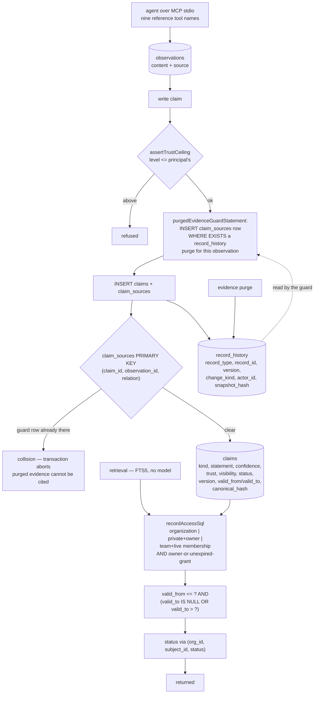

## 1. Executive Summary

Titen is agent memory that runs with no API key, no LLM and no embedding
provider: Bun and SQLite, FTS5 for retrieval, MCP served over stdio in-process
with no outbound network call on the default path. Apache-2.0, version 0.10.0,
277 commits since 29 July 2026, 26,504 lines of TypeScript in `src` against
11,889 lines across 38 test files. Its own summary line is a good description
of what it models: "Every memory keeps its source, who may read it, and the
evidence that contradicts it."

Three things make it worth reading.

**The invariants are in the schema.** A claim's `status` is checked against
`('active','disputed','superseded','expired','revoked')` and its `trust`
against `('unverified','asserted','verified','policy_approved')`, both by
database `CHECK`. Visibility is checked the same way. The scope index is
`(org_id, subject_id, status)`, so status is part of how rows are found rather
than a column consulted afterwards, and `assertTrustCeiling` refuses a write
that asserts a level above the writing principal's.

**The tombstone is enforced by a primary key.** This is the most unusual
mechanism here. `claim_sources` is keyed `(claim_id, observation_id,
relation)`. Before inserting a new claim's sources, the write path adds
`purgedEvidenceGuardStatement`, which inserts a `claim_sources` row for the
cited observation *only* `WHERE EXISTS` a `record_history` row whose
`change_kind` is `purge` for that observation. If the evidence was purged, that
speculative row lands first and the legitimate insert that follows collides on
the primary key, aborting the transaction. A purged observation therefore
cannot be cited again, and the enforcement is a constraint rather than a check
a future code path might forget to call.

**The access predicate travels with the query.** `recordAccessSql` emits one
SQL fragment — organization-visible, or private and yours, or team with a live
membership — ANDed with an ownership-or-grant clause that respects
`revoked_at` and an unexpired `expires_at`. It is referenced at seventy-five
call sites across eighteen files.

Reads also gate time: both retrieval lanes add `valid_from <= ?` and
`(valid_to IS NULL OR valid_to > ?)`, so a claim true over a past interval is
answerable for that interval.

Two things to be precise about. The hero image's alt text states "dependencies
empty"; `package.json` at this pin declares two runtime dependencies —
`@simplewebauthn/browser` and `@simplewebauthn/server` — plus a `sqlite-vec`
peer. The substantive half of the claim holds: they are passkey authentication
for the dashboard, not memory machinery, and nothing here calls a model or an
embedding provider. The dependency count is simply not zero.

And the same alt text publishes the benchmark's degradation: recall@1 of 0.880
on LongMemEval-S in the per-instance scoped condition, "which falls to 0.524,
0.364, 0.308 and 0.246 as the store pools to 1k, 5k, 10k and 19,829 sessions."
Putting the curve that undercuts your headline number in the headline image is
rare enough to be worth naming.

Five marks: `trust_state`, `scope_enforced`, `bitemporal`, `tombstone`,
`audit_log`.

## 2. Mental Model

An **observation** is what was seen, with its source. It can be redacted or
purged.

A **claim** is what is believed: a subject, a kind, a statement, a confidence,
a trust level, a visibility, a status, a version and a validity window, with a
canonical hash for idempotency.

**Evidence** joins them: a `claim_sources` row typed `supports`, `contradicts`
or `qualifies`. A claim can therefore carry the evidence against it.

**Trust** is a ladder — unverified, asserted, verified, policy_approved — and a
principal cannot assert above their own rung.

**Visibility** is private, team or organization, and the read predicate
resolves it against live memberships and unexpired grants.

**History** is a `record_history` row per change, with a snapshot hash. The
purge guard reads it.

## 3. Architecture

| Area | Role |
| --- | --- |
| `src/core/migrations.ts` | The schema and every `CHECK` — the fastest way to read the model |
| `src/core/claims.ts` | The claim write path, the trust ceiling, the guard call |
| `src/core/writes.ts` | `historyStatement`, `outboxStatement`, `purgedEvidenceGuardStatement` |
| `src/core/authorization.ts` | `recordAccessSql` and its organization-wide variant |
| `src/core/retrieval.ts` | The FTS lanes and the validity window |
| `src/core/observations.ts`, `evidence.ts` | Observations, redaction, evidence relations |
| `src/core/lifecycle.ts`, `maintenance.ts` | Status transitions, retirement, the outbox drain |
| `src/core/audit.ts`, `atlas.ts` | The audit command, including over other vendors' stores |
| `src/core/mcp.ts` | The reference-server-compatible tool surface |
| `tests/contract`, `tests/integration` | Backend contracts (Bun SQLite, D1) and end-to-end behaviour |

## 4. Essential Implementation Paths

- `src/core/migrations.ts:68-113` — claims, `claim_sources`, `record_history`.
- `src/core/writes.ts:49-66` — the guard, and why it is shaped that way.
- `src/core/claims.ts:283-300` — where the guard is pushed before the insert.
- `src/core/authorization.ts:18-48` — the access predicate.
- `src/core/retrieval.ts:155-215` — both lanes and their temporal clause.
- `src/core/validate.ts:3-40` — trust levels, ranks, visibilities, relations.

## 5. Memory Data Model

The separation of observation from claim is the spine: what was seen is not
what is believed, and the join between them is typed, so `contradicts` is
representable rather than implied by absence. A claim's `confidence` is
constrained `> 0 AND <= 1` at the database, its `version` starts at 1, and its
`canonical_hash` supports idempotent re-writes.

Six claim kinds — `semantic_fact`, `episodic_event`, `preference`,
`procedural`, `decision`, `relationship` — are enumerated in a `CHECK` rather
than left to convention.

## 6. Retrieval Mechanics

FTS5 with `unicode61 remove_diacritics 2` tokenisation over both observations
and claims, with a migration comment noting that both FTS tables are rebuilt
together "so observation and claim tokenization cannot drift". Vector support
is an optional peer dependency rather than a requirement. Every read composes
the access predicate and the validity window.

## 7. Write Mechanics

Writes are idempotent by request key and canonical JSON hash. The trust ceiling
is checked against the principal. The purge guard runs before the source
inserts. Each mutation appends history with a snapshot hash, and an outbox row
drives indexing, which a test asserts happens "without anyone calling the drain
endpoint".

## 8. Agent Integration

Titen serves the nine tool names of the reference memory server with the same
schemas, answers `memory://knowledge-graph`, and imports an existing store on
first local-mode start — and when it cannot find one it "says on stderr when it
found nothing, rather than starting empty in silence". That last detail is a
small thing that decides whether a migration is noticed.

## 9. Reliability, Safety, and Trust

**The guard protects the first cited source.** `purgedEvidenceGuardStatement`
inserts one row, for `observationIds[0]`, while its `WHERE EXISTS` tests every
cited id. So a claim citing a live observation first and a purged one second
produces a guard row keyed on the *live* id — which the real insert will also
write, so the collision still fires. The mechanism holds for the cases this
report could construct, but it depends on the guard row's id also appearing in
the real insert, which is a subtler contract than "refuse if any cited
observation is purged" would be.

**The dependency claim is overstated.** Two WebAuthn packages and a
`sqlite-vec` peer are declared. Nothing about them undermines the no-model,
no-embedding, no-network claims, which are the substantive ones; "dependencies
empty" is simply not what `package.json` says at this pin.

**The benchmark is published against itself.** Recall@1 falls from 0.880 to
0.246 as the corpus pools from one instance to 19,829 sessions, and that
sentence is in the README's hero image. A reader is told the scaling limit
before they are told the headline.

## 10. Tests, Evals, and Benchmarks

38 test files split into backend contracts — Bun SQLite, Cloudflare D1, a D1
harness, vectors — and integration suites for MCP stdio, local mode, audit,
maintenance, federation, webhooks, collaboration integrity and runtime
hardening.

Two test names are worth repeating because they encode judgement rather than
coverage: "audit refuses a file it cannot recognize instead of reporting
zeros", and, inside the audit suite, the assertion that "an absent signal is
never a failure". A store that reports zero when it cannot read the input is
the failure mode those two exist to prevent.

## 11. For Your Own Build

### Steal

- **Enforce the tombstone with a constraint.** A guarded insert that collides
  on a primary key cannot be skipped by a new code path the way an
  `if (isPurged(...))` can.
- **Put the enum in a `CHECK`.** Status, trust, visibility, claim kind and
  relation are all constrained at the database here, so an invalid value is a
  write error rather than a filter that silently matches nothing.
- **Compose the access predicate into the query.** Seventy-five call sites
  referencing one fragment is a stronger guarantee than one gate everyone is
  expected to pass through.
- **Rebuild related FTS tables together.** The comment explains the failure it
  prevents: two tokenizers drifting apart across migrations.
- **Say on stderr when an import found nothing.** Starting empty in silence is
  how a migration is discovered a week later.
- **Publish the curve, not just the peak.** The degradation from 0.880 to
  0.246 is in the hero image.

### Avoid

- **Claiming zero dependencies while declaring some.** The interesting claims
  here — no model, no embedding provider, no outbound call — are true and
  checkable, and the one that is not true is the one a reader checks first.

### Fit

Reach for this if you want deterministic, self-hosted memory with real
per-principal visibility and no provider to configure, and you can accept
lexical retrieval. Look elsewhere if your corpus will pool to tens of thousands
of sessions and you need recall to hold there.

## 12. Open Questions

- Should the purge guard emit a row per cited observation rather than one for
  the first, so the contract is "any purged source aborts" by construction?
- Trust has four levels and a ceiling on assertion. What promotes a claim from
  `asserted` to `verified` — and is that surface a person's?
- The degradation curve is published. Is the intended answer scoping (which the
  per-instance number suggests) or a ranking change?

## Appendix: File Index

| Path | What to read it for |
| --- | --- |
| `src/core/migrations.ts` | Every table and every `CHECK` |
| `src/core/writes.ts` | The guard, the history row, the outbox |
| `src/core/claims.ts` | The write path and the trust ceiling |
| `src/core/authorization.ts` | The one access predicate |
| `src/core/retrieval.ts` | The lanes and the validity clause |
| `src/core/audit.ts` | Auditing a store this project does not own |
| `tests/integration/audit.test.ts` | Refusing to report zeros |

## History

**2026-09-16** — [`a68ce06302f3dfc3aef04e83306ad1c35e2b058c`](https://github.com/RamaAditya49/titen/commit/a68ce06302f3dfc3aef04e83306ad1c35e2b058c) — first reading, at a commit dated 30 August 2026. Screened before opening, from a shallow clone: thirteen files, two auto-run surfaces (a `.claude-plugin/` directory and an MCP server manifest), no build-time execution points, two unpinned surfaces, none inside the cooldown, and `AGENTS.md` and `CLAUDE.md` read as data. Nothing was installed, built or run.
