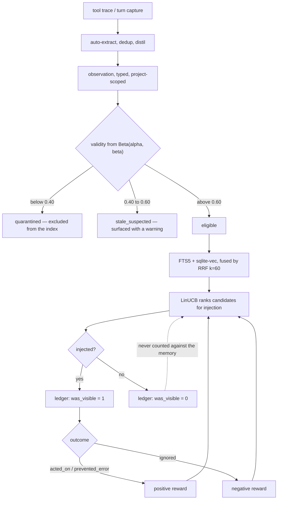

## 1. Executive Summary

Token Savior is one MCP server doing three jobs for coding agents: structural
code navigation, persistent memory, and Bash output compaction. MIT, about
32,600 lines of Python, with the headline claim "97.9% on tsbench at −80%
tokens".

The memory subsystem is the part this atlas cares about, and it contains a
mechanism almost nothing else here has: **a learned ranker deciding what to
inject.**

`src/token_savior/linucb_injector.py` implements LinUCB (Li et al. 2010) over a
ten-dimensional feature vector — `type_score`, `age_score`, `access_score`,
`semantic_sim`, `mode_match`, `tokens_used_pct`, `task_is_edit`,
`task_is_debug`, `symbol_match`, `has_context`. It models expected reward as
`r̂ = θᵀ·φ` with an exploration bonus of `α·√(φᵀA⁻¹φ)`, updates online, and
persists the 10×10 matrix `A` and the vector `b` to `linucb_model.json` so the
learned weights survive a restart. The linear algebra is pure Python — a
Gauss–Jordan inverse, on the grounds that "10-dim is trivially fast" — so the
whole thing has no numpy dependency.

**The reward signal is what makes it work, and it is the transferable idea.**
`ledger_events` is an append-only table whose columns are outcomes rather than
counts: `acted_on`, `prevented_error`, `ignored`, `block_justified`,
`was_visible`, beside `cost_tokens` and `latency_ms`.

`was_visible` is the column to steal. Most feedback loops in this atlas cannot
distinguish "the memory was injected and the agent ignored it" from "the memory
was never injected". Those are opposite evidence about the ranker, and folding
them together teaches it the wrong thing. One boolean separates them.

The second mechanism worth naming is freshness by `git log`.
`check_symbol_staleness` runs `git log -1 --format=%ct -S <symbol>` against the
project and asks whether the symbol a memory mentions was modified after the
memory was written. It is [Kage](../kage/)'s idea — verify a claim about code
against the code — reached independently and implemented with the tool already
on every developer's machine, at a 3-second timeout with silent failure.

## 2. Mental Model

An observation is typed, and the type vocabulary is a priority ordering rather
than a taxonomy. `_TYPE_SCORES` runs `guardrail` 1.0, `ruled_out` 0.95,
`convention` 0.9, `warning` 0.85, `decision` 0.8, `error_pattern` 0.75, `bugfix`
0.7, `infra` 0.6, `config` 0.55, `command` 0.5, `research` 0.35, `note` 0.2,
`idea` 0.15 — and the same vocabulary drives per-type decay horizons
(`ruled_out` gets 180 days) and per-type ROI weights.

`ruled_out` as a first-class memory type deserves a note. It is negative
knowledge — "we tried this and it does not work" — stored deliberately and
ranked second only to a guardrail. Systems in this atlas store what is true;
very few store what was eliminated, and for a coding agent the eliminated branch
is the expensive thing to rediscover.

Truth is a Beta distribution. `consistency_scores` keeps `validity_alpha` and
`validity_beta` per observation; below 0.40 the observation is **quarantined**
and excluded from the index, below 0.60 it is flagged `stale_suspected` and
shown with a warning.

The dotted edge is the design: an observation that was never shown contributes
nothing to its own score.

## 3. Architecture

A single MCP server over SQLite, with FTS5 for lexical search and `sqlite-vec`
for vectors when available. Vector search degrades cleanly — if the extension is
missing, the embedding fails, or the `obs_vectors` table is absent, the search
returns FTS results "untouched — full backwards compatibility". The bandit model
lives beside the database as a JSON file.

The `memory/` subpackage is 38 modules and reads like a deliberate split rather
than accretion: `observations`, `search`, `index`, `dedup`, `decay`,
`distillation`, `consistency`, `ledger`, `roi`, `budget`, `preflight`,
`sessions`, `summaries`, `rules`, plus paired `*_hook.py` files for the points
where the memory system attaches to a tool call.

There is no server to run and no key to hold; the operator cost is a Python
install and a project directory.

## 4. Essential Implementation Paths

**Capture** — `memory/tool_capture.py` and `turn_capture.py` →
`auto_extract.py` → `dedup.py` → an observation row.

**Search** — `memory/search.py`: an FTS5 query always, a k-NN query when vectors
are available, fused with RRF at the reference constant `k = 60` (Cormack et al.
2009), with quarantine, type and `project_root` filters "centralised at one
call-site in `observation_search`".

**Injection ranking** — `linucb_injector.py`: build `φ`, score with the UCB
bonus, inject, then `update(obs, context, reward)`.

**Consistency** — `memory/consistency.py`: Beta validity, the two thresholds,
and `check_symbol_staleness` shelling out to `git log`.

**Ledger** — `db_core.py:321` defines `ledger_events`; `memory/ledger.py` and
`ledger_hook.py` write it.

## 5. Memory Data Model

The observation row carries the type, the project root, tags, importance,
timestamps and three columns worth naming: `decay_immune` (an explicit
exemption from the decay pass), `is_global` (visible from every project), and
`last_accessed_epoch`.

Beside it:

| Table | Role |
| --- | --- |
| `consistency_scores` | `validity_alpha`, `validity_beta`, `last_checked_epoch`, `stale_suspected`, `quarantine`, indexed on quarantine |
| `ledger_events` | Append-only outcomes: `acted_on`, `prevented_error`, `ignored`, `block_justified`, `was_visible`, cost and latency |
| `adaptive_lattice` | The adaptive structure behind mode selection |
| `tool_latency` | Per-tool timing, created on first write with no migration |
| `obs_vectors` | Embeddings, optional |

`decay_immune` and `is_global` are the two flags that make the automatic
machinery safe to run: one exempts a memory from forgetting, the other from
project scoping, and both are explicit booleans rather than sentinel values.

## 6. Retrieval Mechanics

FTS5 and vector k-NN fused by RRF, then the bandit. Three filters are applied at
the single centralised call site: quarantine (`c.quarantine IS NULL OR
c.quarantine = 0`), type, and scope.

The scope predicate is `(o.project_root = ? OR o.is_global = 1)`, and the shape
matters. Several systems in this atlas write the equivalent as `OR project IS
NULL OR project = ''`, which makes every unclassified row globally visible by
accident. Here the escape is a declared boolean column that something had to set
on purpose. Same SQL shape, opposite failure mode.

The index cache key is `f"{project_root}:{mode}:{include_quarantine}"`, so a
quarantined-inclusive read cannot be served from a quarantined-exclusive cache —
a small correctness detail that is easy to get wrong.

## 7. Write Mechanics

Capture is automatic from tool traces and turns, with dedup and distillation
before storage, so the agent does not decide what to remember.

Correction is graded suppression rather than deletion. The Beta score moves with
evidence, and crossing 0.40 removes the observation from the index — reversibly,
since the score can move back. Nothing records that a value was quarantined in a
way a future extraction would consult, so the same claim re-extracted from a
later trace lands as a new observation with a fresh prior.

Decay is per type in days (`memory/decay.py`), with `decay_immune` as the opt-out
and `ruled_out` given a 180-day horizon — negative knowledge is kept longer than
a `note` on purpose.

## 8. Agent Integration

One MCP server exposing code navigation, memory and Bash compaction. The
`*_hook.py` modules are the integration surface: a precondition hook that can
block a tool call, a rules hook, a preflight hook and a ledger hook that records
the outcome.

`block_justified` in the ledger is the column that closes that loop — when the
precondition hook blocks a tool call on the strength of a memory, the ledger
records whether the block turned out to be justified. A memory that blocks work
wrongly is measurable.

## 9. Reliability, Safety, and Trust

**Scope — awarded**, for the reason in section 6: a stored key applied on the
read path with a declared opt-out.

**Audit log — awarded.** `ledger_events` is append-only, indexed on
`(event_type, ts_epoch)`, and records outcomes rather than counts. It is a
usefulness ledger more than a mutation record — an edit to an observation does
not necessarily appear — but it is an explicit append-only event record in the
system's own store, and it is the mechanism the whole ranker depends on.

**Trust state — withheld.** `quarantine` and `stale_suspected` are two booleans
derived from a continuous Beta score, not a discrete epistemic vocabulary. What
exists instead is arguably more useful for this purpose — a posterior that moves
with evidence and two thresholds — and it is not what the mark describes.

**Tombstone, bitemporal, human review — no.** Quarantine is reversible
suppression keyed on the row; there is no validity axis; the dashboard displays
and does not adjudicate.

**Negative eval — no**, among 173 test files.

**Two operational cautions.** `check_symbol_staleness` shells out to `git` with
a 3-second timeout and silent failure, so a slow repository degrades to "not
stale" rather than to an error — fail-open on a freshness check is a choice, and
it is the permissive one. And the LinUCB weights persist across restarts in a
plain JSON file with no versioning against the feature vector, so changing
`FEATURE_NAMES` would silently reinterpret a trained model.

## 10. Tests, Evals, and Benchmarks

**No paper.** The mechanisms cite literature in module headers — Li et al. 2010
for LinUCB, Cormack et al. 2009 for the RRF constant — which is enough to check
the implementation against the source.

173 test files. **I did not run them**; the screen flagged `server.json` as an
auto-run manifest and two `conftest.py` files executing on collection.

**The benchmark is a different repository.** `tsbench` — "96 real coding tasks
(Claude Opus 4.7)" with the reported 97.9% (188/192) at −80% tokens — lives at
`Mibayy/tsbench`, with a project site for the results. None of it is in this
tree and none of it is verified here. Splitting the harness out is defensible;
the consequence is that the number on the README badge cannot be checked at this
commit, which is the same caveat this atlas records for
[Vestige](../vestige/)'s branch-hosted benchmark.

What is committed is the instrumentation that would let a user measure it
themselves: the ledger records `cost_tokens` and `latency_ms` per event, and
`memory/roi.py` computes return on investment per observation type.

## 11. For Your Own Build

### Steal

- **Record `was_visible` on every feedback event.** Distinguishing "shown and
  ignored" from "never shown" is one boolean and it is the difference between a
  ranker that learns and one that learns superstition.
- **Record whether a block was justified.** If memory can stop an agent doing
  something, the ledger should say how often it was right to.
- **Learn the injection ranking, and keep it cheap.** Ten features, a 10×10
  matrix, a Gauss–Jordan inverse in pure Python, persisted as JSON. There is no
  reason a small bandit needs a dependency.
- **Make `ruled_out` a first-class memory type and decay it slowly.** The
  eliminated branch is the expensive thing to rediscover, and 180 days is a
  deliberate answer to how long that stays true.
- **Use a declared `is_global` flag, not a null, for the scope escape.**
  Identical SQL, opposite failure mode: the accidental case is invisible instead
  of universal.
- **Put the quarantine flag in the cache key.** A filter that varies per request
  must vary the cache, and this is the kind of bug that only shows up under load.
- **Check a code memory against `git log -S`.** Asking whether the symbol has
  been touched since the memory was written costs one subprocess and needs no
  index.
- **Score validity as a Beta posterior with two thresholds.** One threshold to
  warn, one to withdraw, and a number that can move back.

### Avoid

- **Do not persist learned weights without versioning the feature vector.**
  `linucb_model.json` holds `A` and `b`; nothing ties them to the
  `FEATURE_NAMES` tuple they were trained against.
- **Do not fail open on a freshness check silently.** A 3-second `git log`
  timeout returning "not stale" means a slow repository quietly disables the
  mechanism.
- **Do not quarantine without a record the write path consults.** The score can
  fall below 0.40 and the same claim can be re-extracted tomorrow with a fresh
  prior.
- **Do not keep the benchmark in another repository if the number is on the
  badge.** A reader at this commit cannot check the claim the project leads with.

### Fit

This is for a solo developer or small team using a coding agent on a project
they care about token spend on. The three-in-one framing — navigation, memory,
compaction — means adopting the memory means adopting the rest.

The bandit and the ledger are separable and are the reason to read it: about 300
lines between them, with no dependencies, and they solve a problem — which
memory is worth its tokens right now — that most systems in this atlas answer
with a fixed weight.

## 12. Open Questions

- **What is the reward function?** `update(obs, context, reward)` takes a float;
  how `acted_on`, `prevented_error`, `ignored` and `block_justified` combine into
  it was not traced, and it is the whole learning signal.
- **How long until the bandit converges on a real store?** The header cites
  `O(√T log T)`; no measurement of `T` in practice is committed.
- **Does anything reset the model when the corpus changes?** A project whose
  memory turns over completely keeps the weights trained on the old one.
- **How often does quarantine fire, and does anything ever leave it?** The score
  can recover in principle; no data on whether it does.

## Appendix: File Index

**The bandit** — `src/token_savior/linucb_injector.py` (the algorithm and its
citation at `:1-14`, `FEATURE_NAMES` `:22`, `_TYPE_SCORES` `:34`, `update`
`:244`)

**The ledger** — `src/token_savior/db_core.py:321` (`ledger_events`),
`src/token_savior/memory/ledger.py`, `ledger_hook.py`,
`src/token_savior/memory/roi.py`

**Consistency and quarantine** — `src/token_savior/memory/consistency.py` (the
thresholds at `:17-20`, `check_symbol_staleness` `:23`),
`src/token_savior/db_core.py:303` (`consistency_scores`),
`src/token_savior/memory/index.py:119-178` (the read-path filter and cache key)

**Retrieval** — `src/token_savior/memory/search.py` (RRF at `:24`, the scope
predicate `:207`), `src/token_savior/memory/embeddings.py`,
`symbol_embeddings.py`, `src/token_savior/query_api.py`

**Write path** — `src/token_savior/memory/auto_extract.py`, `tool_capture.py`,
`turn_capture.py`, `dedup.py`, `distillation.py`, `summaries.py`,
`src/token_savior/memory/decay.py`

**Hooks** — `src/token_savior/memory/precondition_hook.py`, `rules_hook.py`,
`preflight_hook.py`, `ledger_hook.py`

**Schema** — `src/token_savior/db_core.py`, `db_schema.py`,
`src/token_savior/latency.py`

**Integration** — `src/token_savior/server.py`,
`src/token_savior/server_handlers/`, `src/token_savior/tool_schemas.py`,
`src/token_savior/dashboard.py`

**Not in this tree** — the `tsbench` benchmark lives at `Mibayy/tsbench`

## History

**2026-08-09** — [`e41825f624d3513be7fdfb9146e35d265dbb1b06`](https://github.com/Mibayy/token-savior/commit/e41825f624d3513be7fdfb9146e35d265dbb1b06) — first reading. Screened before reading: one auto-run surface (`server.json`), build-time execution in two `conftest.py` files, no dependency surface inside the cooldown, `uv.lock` present. The tree was read, never installed, and no test or benchmark was run.
