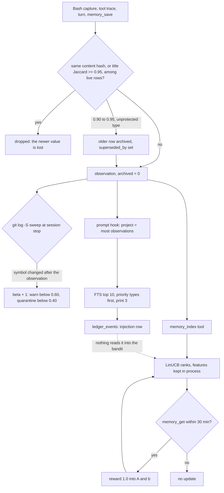

## 1. Executive Summary

Token Savior is one MCP server for coding agents that does structural code
navigation, Bash output compaction, and persistent memory in SQLite. Its most
unusual memory mechanism is a LinUCB contextual bandit that re-ranks the list
the `memory_index` tool returns and learns from which listed observations the
agent then fetches. Its weakest point is scope on the automatic paths: every
prompt-time hook resolves the project as whichever one holds the most
observations, not the directory the session is in.

The README leads with "97.9% on tsbench at -80% tokens". At this commit the
README itself says the harness repository is not public and the figures are
reported rather than verifiable; this report treats them the same way.

**The bandit is real and small.** `src/token_savior/linucb_injector.py`
implements LinUCB (Li et al. 2010) over ten features — `type_score`,
`age_score`, `access_score`, `semantic_sim`, `mode_match`, `tokens_used_pct`,
`task_is_edit`, `task_is_debug`, `symbol_match`, `has_context`. It scores
`θᵀφ` plus `α·√(φᵀA⁻¹φ)` and persists the 10×10 `A` and the vector `b` to
`linucb_model.json`. The algebra is pure Python, a Gauss–Jordan inverse with no
numpy (`linucb_injector.py:1-14`).

**Its reward is a click, not the ledger.** `_mh_memory_index` stores each
ranked row's features in an in-process `_linucb_pending` dict, and
`_mh_memory_get` credits a reward of exactly 1.0 to any of them fetched within
1,800 seconds (`server_handlers/memory.py:109-129`, `:768-770`, `:870-880`).
An observation that was listed and not fetched is never updated, so the bandit
receives no negative evidence. Nothing reads `ledger_events` into it.

**Automatic injection does not use the bandit.** The `UserPromptSubmit` hook
runs `observation_search` with an OR of up to twelve prompt tokens, moves
`guardrail`, `convention` and `warning` rows to the front, and prints the top
three (`hooks/memory-userprompt.sh:116-138`). The `SessionStart` index is
ordered by `compute_obs_score`, a fixed formula.

**Freshness is checked against `git log`.** `check_symbol_staleness` runs
`git log -1 --format=%ct -S <symbol> -- .` and asks whether the symbol an
observation names was modified after the observation was written. It is
[Kage](../kage/)'s idea — verify a claim about code against the code — at a
3-second timeout with silent failure (`memory/consistency.py:23-46`).

## 2. Mental Model

An observation is typed, and the bandit's `_TYPE_SCORES` is a priority
ordering: `guardrail` 1.0, `ruled_out` 0.95, `convention` 0.9, `warning` 0.85,
`decision` 0.8, `error_pattern` 0.75, `bugfix` 0.7, `infra` 0.6, `config` 0.55,
`command` 0.5, `research` 0.35, `note` 0.2, `idea` 0.15
(`linucb_injector.py:35-49`). The `type` column itself is free text. Separate
tables in `memory/decay.py` give per-type expiry in days and five
decay-immune types.

`ruled_out` is negative knowledge — "we tried this and it does not work" —
stored on purpose by `observation_save_ruled_out` with a 180-day expiry, where
a `note` gets 60 (`memory/observations.py:268-302`, `memory/decay.py:18-25`).
The `PreToolUse` hook surfaces up to five `ruled_out` rows before any edit tool
touches a matching symbol or file (`hooks/memory-pretooluse.sh:164-190`). For
a coding agent the eliminated branch is the expensive thing to rediscover.

An observation leaves the served set three ways. `archived = 1` is soft
deletion, set by `memory_delete`, the decay sweep, or supersession.
`superseded_by` records which newer row replaced it. `quarantine = 1` in
`consistency_scores` is derived from a Beta posterior and excludes the row
from search and from the session index, but not from the `PreToolUse`
injections.

**The Beta score has one producer, and its evidence only moves one way.**
`run_consistency_check` counts a success when `git log -S` shows the symbol
unchanged since the observation, a failure otherwise
(`memory/consistency.py:184-231`). Once a symbol has changed after the
observation was written, every later sweep adds another failure. The prior is
`Beta(2, 1)`: one failure gives 0.50 and a `stale_suspected` warning, and
further failures cross 0.40 into quarantine, from which this evidence source
cannot bring the row back. The session-stop hook runs the sweep with
`limit=200` (`hooks/memory-session-stop.sh:353`).


```mermaid
%% caption: two rankers read one store — a fixed formula feeds the automatic injections, a click-rewarded bandit reorders only the memory_index tool, and the hooks pick the project by row count
flowchart TD
    C["Bash capture, tool trace, turn, memory_save"] --> D{"same content hash, or title Jaccard >= 0.95, among live rows?"}
    D -->|yes| DROP["dropped: the newer value is lost"]
    D -->|"0.90 to 0.95, unprotected type"| SUP["older row archived, superseded_by set"]
    D -->|no| O["observation, archived = 0"]
    SUP --> O
    O --> G{"git log -S sweep at session stop"}
    G -->|"symbol changed after the observation"| Q["beta + 1: warn below 0.60, quarantine below 0.40"]
    O --> H["prompt hook: project = most observations"]
    H --> P["FTS top 10, priority types first, print 3"]
    P --> LED["ledger_events: injection row"]
    O --> MI["memory_index tool"]
    MI --> B["LinUCB ranks, features kept in process"]
    B --> PEND{"memory_get within 30 min?"}
    PEND -->|yes| R["reward 1.0 into A and b"]
    PEND -->|no| N["no update"]
    R --> B
    LED -.->|"nothing reads it into the bandit"| B
```

The dotted edge is the finding: the outcome ledger and the learned ranker sit
side by side and are not connected.

## 3. Architecture

A single Python MCP server over SQLite with FTS5, and `sqlite-vec` for vectors
when the extension and the FastEmbed model load. If either is missing, or the
`obs_vectors` table is absent, search returns the FTS rows "untouched — full
backwards compatibility" (`memory/search.py:1-17`). The bandit model lives
beside the stats directory as a JSON file.

The memory runs in two kinds of process. The MCP server holds the tools
(`memory_save`, `memory_index`, `memory_search`, `memory_get`,
`memory_delete`, `memory_admin`) and the bandit's pending state. The Claude
Code hooks under `hooks/` are shell scripts that start a fresh Python
interpreter per event, open the same database, and do the automatic capture
and injection.

The `memory/` subpackage is 38 modules: `observations`, `search`, `index`,
`dedup`, `decay`, `distillation`, `consistency`, `ledger`, `roi`, `budget`,
`preflight`, `sessions`, `summaries`, `rules`, and paired `*_hook.py`
entrypoints.

There is no server to run and no key to hold. The operator cost is a Python
install, a set of Claude Code hooks, and a data directory under
`~/.local/share/token-savior`.

## 4. Essential Implementation Paths

**Capture** — the `PostToolUse` hook matches Bash commands against capture
patterns and calls `observation_save` in a background process
(`hooks/memory-posttooluse.sh:67-147`).
`memory/tool_capture.py`, `turn_capture.py` and `auto_extract.py` handle tool
output and turns. The agent writes through `_mh_memory_save`, which runs
`detect_contradictions` first and tags a hit `potential-conflict`
(`server_handlers/memory.py:270-313`).

**Dedup and supersession** — `observation_save` refuses an exact
`content_hash` match among live rows in the project, skips a same-type title
with word-set Jaccard at or above 0.95, and at 0.90 to 0.95 archives the older
row with `superseded_by` unless its type is protected
(`memory/observations.py:48-89`, `:144-239`).

**Search** — `observation_search` runs an FTS5 query, then three fallbacks
from narrowest to widest, then `hybrid_search`, which adds a k-NN pass under a
0.86 distance ceiling and fuses with RRF at `k = 60`
(`memory/observations.py:411-527`, `memory/search.py:24`, `:160-161`,
`:255-275`).

**Automatic injection** — `UserPromptSubmit` prints three search hits;
`SessionStart` prints `get_recent_index`; `PreToolUse` prints observations tied
to the symbol, file or edit target (`hooks/memory-userprompt.sh:83-149`,
`hooks/memory-session-start.sh:68-113`, `hooks/memory-pretooluse.sh:110-190`).

**Bandit** — `_mh_memory_index` ranks a pool of at least 30 recent rows and
records pending features; `_mh_memory_get` credits them
(`server_handlers/memory.py:750-770`, `:850-901`).

**Ledger** — `db_core.py:320-341` defines `ledger_events`; `memory/ledger.py`,
`rules_hook.py`, `rules.py` and `preflight.py` write it.

## 5. Memory Data Model

The observation row carries `type`, `project_root`, `title`, `content`, `why`,
`how_to_apply`, `symbol`, `file_path`, `tags`, `importance`, `content_hash`,
`archived` and timestamps (`memory_schema.sql:22-48`). Migrations add
`decay_immune`, `last_accessed_epoch`, `is_global`, `context`,
`expires_at_epoch`, `agent_id` and `superseded_by` (`db_core.py:216-234`).

| Table | Role |
| --- | --- |
| `consistency_scores` | `validity_alpha`, `validity_beta`, `last_checked_epoch`, `stale_suspected`, `quarantine`, indexed on quarantine |
| `ledger_events` | One row per injection, miss, block, precondition or preflight, with `cost_tokens` and five outcome columns |
| `session_summaries` | End-of-session rollups with their own FTS5 mirror |
| `observation_links` | `related`, `contradicts`, `supersedes` and `consolidation` edges between observations |
| `adaptive_lattice` | Thompson sampling over how much source a code-fetching tool returns, not memory |
| `obs_vectors` | 768-dimension embeddings, optional |

`is_global` and `decay_immune` are explicit booleans. The agent can set
`is_global` through `memory_save` or promote a row with a dedicated tool
(`server_handlers/memory.py:299`, `:648-657`).

**Four of the ledger's five outcome columns have no writer.** `ledger_put`
accepts `acted_on`, `prevented_error`, `ignored`, `block_justified` and
`was_visible`, and the only call that passes an outcome is
`record_from_userprompt`, which sets `was_visible`
(`memory/ledger.py:263-291`). `rules_hook.py` logs a `hard_block` with no
outcome (`memory/rules_hook.py:46-52`), and no path writes a `false_positive`
event. So `ledger_net_value`, which counts benefit from `prevented_error` and
`acted_on` and friction from `false_positive` and `block_justified = 0`, only
ever sums token cost (`memory/ledger.py:299-363`).

## 6. Retrieval Mechanics

FTS5 and vector k-NN fused by RRF, both arms filtered in SQL: `archived = 0`,
quarantine unless asked for, type, and `(o.project_root = ? OR o.is_global =
1)` (`memory/observations.py:464-484`, `memory/search.py:207-211`). The escape
is a declared column rather than an empty `project_root`. The session-summary
arm is written the other way, `s.project_root = ? OR s.project_root = ''`, and
`session_end` writes `''` when the session row is missing
(`memory/sessions.py:98-110`, `:160`).

**The scope value comes from a row count on every prompt-time path.** Five
hooks resolve the project with `SELECT project_root FROM observations GROUP BY
project_root ORDER BY COUNT(*) DESC LIMIT 1`. The prompt injection, the
`PreToolUse` injections and the `PreCompact` summary use it unconditionally;
the file-read injection is off in the shipped hook bundle.
`SessionStart` uses it when the session directory holds no observations. The
Bash auto-capture writes new rows under it
(`hooks/memory-userprompt.sh:108-124`, `hooks/memory-pretooluse.sh:120-126`,
`hooks/memory-posttooluse.sh:106-117`, `hooks/memory-precompact.sh:73-82`,
`hooks/memory-session-start.sh:102-112`).

A user with two projects therefore gets the larger project's memory injected
while working in the smaller one, and its Bash captures filed there. The MCP
tools use `_resolve_memory_project`, which prefers an explicit hint, then the
active slot if it holds observations, then the same most-populous project
(`server_handlers/memory.py:33-72`).

The vector arm drops neighbours above distance 0.86. The comment beside it
records the measurement: relevant neighbours at 0.85 to 0.99, unrelated ones
at 0.97 to 1.07 (`memory/search.py:155-161`, `:256-275`).

Quarantine is filtered by `observation_search` and `get_recent_index`
(`memory/index.py:161-162`). `observation_get_by_symbol`,
`observation_get_by_file` and the `ruled_out` query in the edit hook do not
join `consistency_scores`, so the `PreToolUse` injections serve quarantined
rows (`memory/observations.py:588-693`).

The index cache key is `f"{project_root}:{mode or 'default'}:{int(bool(include_quarantine))}"`
(`memory/index.py:130`). The cache holds an ordering only; rows are re-queried
with the filter on every call.

## 7. Write Mechanics

Capture is automatic from Bash commands, tool output and turns. The Bash
capture runs as a background process the hook does not wait for, so the agent
never blocks on it (`hooks/memory-posttooluse.sh:67-147`). A new row is
searchable by FTS on commit, since triggers keep `observations_fts` in step,
and its vector is written in the same transaction when the model loads.

**Dedup runs before supersession, and wins on the case supersession was built
for.** `semantic_dedup_check` scores word-set Jaccard on titles of the same
type (`memory/dedup.py:50-74`, `memory/_text_utils.py:23-28`). An update that
keeps the title — the docstring's own example, a service port changing from
8940 to 8941 — scores 1.0 and is skipped as a near-duplicate, so the stale
value stays live.

Supersession fires only between 0.90 and 0.95. A title that adds one word to a
nine-word title lands there; a one-word substitution needs a 19-word title.
`tests/test_memory_supersede.py` pins the archive-and-link step with a
monkeypatched score of 0.93 on identical titles, a score the real detector
returns as 1.0.

Deletion is soft. `memory_delete` sets `archived = 1`; `observation_restore`
clears it (`memory/observations.py:785-806`). An update rewrites the row in
place and bumps `updated_at`, with no prior value kept.

Nothing records a rejected value. Content-hash and title dedup consult only
`archived = 0` rows, so a deleted observation can be captured again from the
next trace (`memory/dedup.py:58`, `memory/observations.py:151`). A quarantined
row is not archived, so while it exists it blocks an exact re-capture of
itself.

Decay and TTL archiving run from the `SessionStart` hook: rows past
`expires_at_epoch`, rows older than 90 days and unread for 30 with fewer than
three accesses, and zero-access notes, research, ideas and bugfixes past a
per-type age (`memory/decay.py:101-190`, `hooks/memory-session-start.sh:364`).

## 8. Agent Integration

One MCP server exposing code navigation, memory and Bash compaction, plus
Claude Code hooks for `SessionStart`, `UserPromptSubmit`, `PreToolUse`,
`PostToolUse`, `PreCompact`, `Stop` and `SessionEnd`. The agent pulls memory
through a three-layer disclosure: `memory_index` for titles, `memory_search`,
then `memory_get` for full content.

The block path is a hand-written rules catalog, not memory.
`hooks/ledger-rules.json` holds regex triggers such as a force-push to `main`
or a `DELETE` without `WHERE`, and `rules_hook.py` turns a `deny` into
`permissionDecision: deny` and fails open on any error
(`memory/rules.py:1-30`, `memory/rules_hook.py:30-65`).

A `miss` is detected from the user's own words. `detect_correction` matches
eight French phrasings of "I already told you", searches the most-populous
project for the correction's content tokens, and sets `was_visible` to 1 if
the top hit was injected this session and 0 if it was not
(`memory/ledger.py:117-135`, `:162-214`). No English phrasing is in the list.

## 9. Reliability, Safety, and Trust

**Scope — awarded, on the MCP tool path.** The stored `project_root` is applied
on both search arms and the index, and the tools bind it to the active slot
when that slot has memory. The hooks bind the same predicate to the
most-populous project, which is the risk this report leads with
([section 6](#6-retrieval-mechanics)).

**Audit log — not found.** `ledger_events` is append-only and records
injections, misses, blocks, preconditions and preflights. That is a feedback
record, which the rubric excludes; no table or file records an observation's
creation, update, archive or supersession as an event.

**Trust state — withheld.** `quarantine` and `stale_suspected` filter, but both
are recomputed from a continuous Beta score on every update rather than held
as a status. The posterior and two thresholds are the mechanism; it is not a
discrete state.

**Tombstone, bitemporal, human review — no.** Dedup ignores archived rows.
`superseded_by` links records, with no validity time beside `created_at`. The
memory viewer and the dashboard serve `GET` only (`memory/viewer.py:444`,
`dashboard.py:961`).

**Negative eval — awarded**, on the cases in
[section 10](#10-tests-evals-and-benchmarks).

**Two operational cautions.** `check_symbol_staleness` fails open: a timeout or
a missing `.git` returns "not stale". And `linucb_model.json` is loaded when
its shapes are 10 and 10×10, with nothing tying it to `FEATURE_NAMES`, so
reordering the features reinterprets a trained model
(`linucb_injector.py:134-149`).

## 10. Tests, Evals, and Benchmarks

**No paper.** Module headers cite Li et al. 2010 for LinUCB and Cormack et al.
2009 for the RRF constant.

The suite is 197 test files, run by CI with `pytest tests/ -v`
(`.github/workflows/ci.yml:83`). **I did not run them**; the screen flags the
hook scripts and `server.json` as auto-run surfaces and two `conftest.py`
files that execute on collection.

**The retrieval suite asserts exclusion, with positive controls.**
`tests/test_vector_distance_floor.py` seeds five observations; three unrelated
queries must return nothing, three real ones must rank the expected title
first, and "certificat qui expire" must return exactly one title and none of
the other four (`:54-77`). `tests/test_memory_recall_quality.py:92-104` repeats
the empty-result cases on the FTS fallbacks.

`tests/test_memory_session_rollup.py:116-118` saves a rollup under one project
and asserts a search from `/tmp/other-project` returns nothing, beside
`test_fts_finds_rollup` on the same data. It is the only cross-project case;
nothing writes observations under two projects, and nothing asserts that a
quarantined row stays out of a populated search.

`tests/test_linucb.py` covers the injector class, including `update`, which
production never calls; `_linucb_credit_reward` repeats its arithmetic inline.

**The headline benchmark cannot be checked here.** The README reports tsbench
as 188/192 (97.9%) on 96 tasks with Claude Opus 4.7, says the harness
repository returned 404 when checked on 9 August 2026, and asks that the
figures be read as reported. `github.com/Mibayy/tsbench` returned 404 on 30
September 2026. The pinned commit withdraws a 9 August re-measurement because
only one benchmark session in 143 had called a Token Savior tool.

What is committed: code-retrieval and library-retrieval benchmarks with
results under `tests/benchmarks/`, which measure code search rather than
memory.

## 11. For Your Own Build

### Steal

- **Reward the fetch, and keep the features you ranked with.** Storing `φ` at
  ranking time and crediting it when the agent asks for the full item is a
  cheap, honest click signal.
- **Learn the ranking without a dependency.** Ten features, a 10×10 matrix and
  a Gauss–Jordan inverse in pure Python are enough for a bandit.
- **Make `ruled_out` a first-class type and surface it before edits.** The
  eliminated branch is the expensive thing to rediscover.
- **Put a distance floor on the vector arm, and pin it with must-not-return
  cases beside positive ones.** A k-NN without one always answers.
- **Use a declared `is_global` flag, not an empty string, for the scope
  escape.** Something has to set it on purpose.
- **Check a code memory against `git log -S`.** One subprocess asks whether
  the symbol changed since the memory was written.

### Avoid

- **Do not derive the scope key from the data.** "The project with the most
  rows" is a guess that is right for one project and wrong for every other.
- **Do not give a bandit only positive rewards.** An item shown and not taken
  is evidence; with no update for it, `θ` drifts toward whatever gets clicked.
- **Do not declare outcome columns nothing writes.** A net-value report over
  them reads as measured and returns zeros.
- **Do not run a title dedup ahead of a supersession check.** The same title
  with a new value is the commonest update, and the dedup discards it.
- **Do not test a threshold with a mocked score the detector cannot
  produce.** The case passes and the path stays unreachable.
- **Do not feed a validity posterior from evidence that never reverts.** A
  score that can only fall is a timer.

### Fit

This suits a solo developer on one project who wants code navigation,
compaction and memory from one install and is willing to run French-commented
code with a large hook surface. With several projects on one machine, the
automatic memory crosses between them until the hooks take the session
directory. Anyone who needs the benchmark verified, a mutation history, or a
correction that survives re-capture should choose a different design.

## 12. Open Questions

- **How long until the bandit converges?** The header cites `O(√T log T)`;
  with rewards only on fetches within 30 minutes, no count of updates in real
  use is committed.
- **Does anything reset the model when the corpus changes?** A project whose
  memory turns over keeps the weights trained on the old one.
- **Is the most-populous-project rule deliberate for single-project installs?**
  The ledger's comment says the classification must search "the SAME corpus
  the injection block drew from", which reads as known.
- **How often does quarantine fire?** No data on how many observations cross
  0.40 in practice.

## Appendix: File Index

**The bandit** — `src/token_savior/linucb_injector.py` (header `:1-14`,
`FEATURE_NAMES` `:22`, `_TYPE_SCORES` `:35`, `_load` `:134`, `update` `:244`);
`src/token_savior/server_handlers/memory.py` (`_linucb_credit_reward` `:109`,
`_mh_memory_get` `:750`, `_mh_memory_index` `:850`);
`src/token_savior/server_state.py:165` (`_linucb_pending`)

**The ledger** — `src/token_savior/db_core.py:320` (`ledger_events`),
`src/token_savior/memory/ledger.py`, `ledger_hook.py`, `rules_hook.py`,
`src/token_savior/memory/roi.py`

**Consistency and quarantine** — `src/token_savior/memory/consistency.py`
(thresholds `:17-20`, `check_symbol_staleness` `:23`,
`update_consistency_score` `:137`, `run_consistency_check` `:184`),
`src/token_savior/db_core.py:304` (`consistency_scores`),
`src/token_savior/memory/index.py:113-199` (the index, its filter and cache
key)

**Retrieval** — `src/token_savior/memory/observations.py` (`observation_search`
`:411`, the per-file and per-symbol reads `:588-693`),
`src/token_savior/memory/search.py` (RRF `:24`, distance floor `:160`, scope
predicate `:207`), `src/token_savior/memory/sessions.py:121`,
`src/token_savior/memory/embeddings.py`

**Write path** — `src/token_savior/memory/observations.py:48-302`,
`src/token_savior/memory/dedup.py`, `auto_extract.py`, `tool_capture.py`,
`turn_capture.py`, `src/token_savior/memory/decay.py`

**Hooks** — `hooks/memory-session-start.sh`, `memory-userprompt.sh`,
`memory-pretooluse.sh`, `memory-posttooluse.sh`, `memory-precompact.sh`,
`memory-session-stop.sh`, `hooks/ledger-rules.json`

**Schema** — `src/token_savior/memory_schema.sql`,
`src/token_savior/db_core.py:188-412`

**Integration** — `src/token_savior/server.py`,
`src/token_savior/server_handlers/`, `src/token_savior/tool_schemas.py`

**Tests** — `tests/test_vector_distance_floor.py`,
`tests/test_memory_recall_quality.py`, `tests/test_memory_session_rollup.py`,
`tests/test_memory_supersede.py`, `tests/test_linucb.py`

**Not in this tree** — the tsbench harness; the README says it is not public

### Recorded searches

Run from the repository root at the pinned commit.

```sh
# outcome columns: every writer (only was_visible has one, ledger.py:282-287)
grep -rn 'acted_on\|prevented_error\|block_justified\|false_positive' src hooks scripts
# the bandit: every caller of the ranker and of LinUCBInjector.update
grep -rn 'rank_observations\|_linucb\.update\|\.update(obs' src hooks scripts
# scope value on the hook paths
grep -rn 'ORDER BY COUNT(\*) DESC' hooks src
# quarantine filter: every read that joins consistency_scores
grep -rn 'consistency_scores' src/token_savior/memory/observations.py src/token_savior/memory/index.py src/token_savior/memory/search.py hooks
# a memory mutation log: none beside the ledger
grep -rn -i -E 'audit|_history|journal|mutation' src/token_savior/memory src/token_savior/memory_schema.sql src/token_savior/db_core.py
# a rejected-value record: dedup reads only live rows
grep -n 'archived' src/token_savior/memory/dedup.py
# review states and validity time
grep -rn -i -E 'pending|approv|valid_from|valid_to|valid_until' src/token_savior/memory src/token_savior/memory_schema.sql
# viewer and dashboard verbs
grep -n 'def do_' src/token_savior/memory/viewer.py src/token_savior/dashboard.py
# cross-project and exclusion cases in the suite
grep -rn -E 'other-project|is_global' tests
grep -rln 'observation_search\|session_summary_search' tests | xargs grep -n -E '== \[\]|not in'
# English correction phrasings in the miss detector
sed -n 117,127p src/token_savior/memory/ledger.py
```

## History

**2026-09-30** — [`73e9c7f56fd7cd40ecc72cdc4b032264018f8b4f`](https://github.com/Mibayy/token-savior/commit/73e9c7f56fd7cd40ecc72cdc4b032264018f8b4f) — upstream has not moved since 10 August, so every change corrects this report. `audit_log` withdrawn: `ledger_events` is a feedback record, and the evidence record cited a diff-summary closure and a budget-diagnostic reader. `negative_eval` awarded on the distance-floor and rollup-scope cases ([section 10](#10-tests-evals-and-benchmarks)). The bandit ranks only `memory_index` and learns from fetches at a constant reward; nothing reads the ledger into it, and four outcome columns have no writer ([section 5](#5-memory-data-model)). Every prompt-time hook scopes to the most-populous project ([section 6](#6-retrieval-mechanics)). Title dedup pre-empts supersession ([section 7](#7-write-mechanics)). The tsbench harness is unpublished, not a separate repository. Size and test counts re-measured over the whole `src/`. Screened again: `hooks/` and `server.json` auto-run, two `conftest.py` execute on collection. Nothing installed, built or run.

**2026-09-14** — [`73e9c7f56fd7cd40ecc72cdc4b032264018f8b4f`](https://github.com/Mibayy/token-savior/commit/73e9c7f56fd7cd40ecc72cdc4b032264018f8b4f) — re-read, 23 commits past the previous pin; upstream has not moved since 10 August. Both marks stand and both now carry evidence records. The addition worth reading is `tests/test_ts_discipline_guard_refus_unique.py`, whose docstring is a piece of measured self-criticism: on 27 July 2026 three blocking guards were removed from this hook after they blocked correct work four times in one session, two of those on a case the tool cannot handle at all — `replace_symbol_source` covers functions and classes but not a constant or a module dictionary — so the guard forbade the only remaining route. The documented escape hatch lived in the session environment rather than between calls, which in practice meant asking the user to turn the guard off. What replaced them is the contract the test pins: the first call is refused and names the better route, and an identical second call passes, because *"a refusal teaches once; twice, it prevents"* — the line the file draws between a speed bump and a wall. Recorded against `scope_enforced`: `_resolve_project_root` falls back to the home directory when no slot resolves and no workspace root is configured, so the last resort is the widest scope rather than a refusal. Screened again first; nothing was installed and no suite was run.

**2026-08-09** — [`e41825f624d3513be7fdfb9146e35d265dbb1b06`](https://github.com/Mibayy/token-savior/commit/e41825f624d3513be7fdfb9146e35d265dbb1b06) — first reading. Screened before reading: one auto-run surface (`server.json`), build-time execution in two `conftest.py` files, no dependency surface inside the cooldown, `uv.lock` present. The tree was read, never installed, and no test or benchmark was run.
