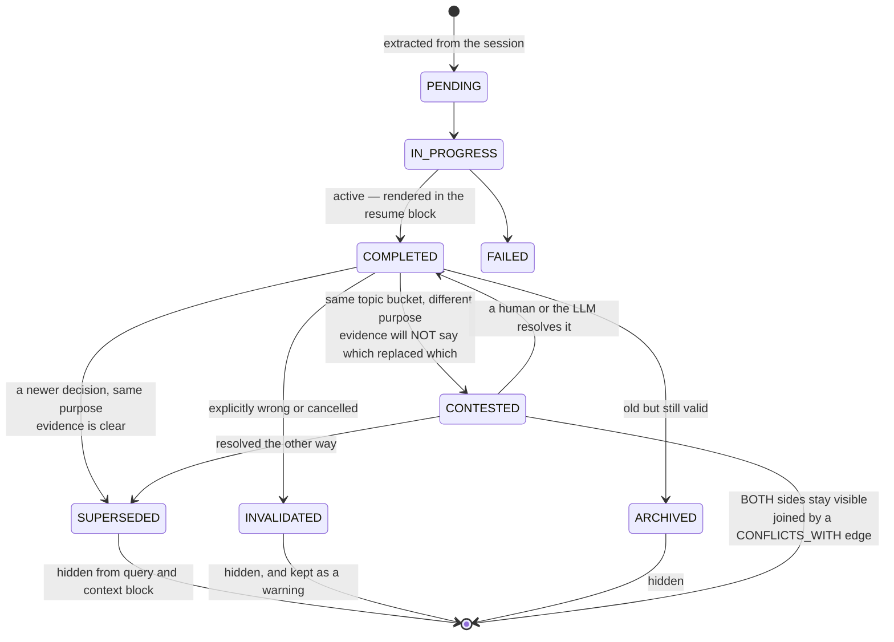

## 1. Executive Summary

TokenMizer is an MIT-licensed session-memory tool for coding agents — *"keep
your AI context alive across sessions"* — with a graph memory of 4,766 lines
across thirteen modules and 440 test cases in 38 files.

**Its best mechanism is a status for not knowing.** Most systems in this atlas
resolve a contradiction by picking: a newer decision supersedes an older one, the
old row is filtered out of retrieval, and the model never learns there was a
disagreement. TokenMizer's contradiction check asks whether the evidence supports
that call, and when it does not, marks **both** sides `CONTESTED`. The comment
explaining it is the clearest statement of the problem in the corpus:

> Two decisions share a topic bucket (e.g. both "database") but don't share
> enough descriptive context to confidently call one a genuine replacement of the
> other (e.g. "Use PostgreSQL for primary user data" vs "Use SQLite for the local
> offline cache" — plausibly two independent, complementary choices, not a
> reversal). Rather than silently guessing and marking one SUPERSEDED —
> destroying it from resume context on possibly-wrong evidence — both sides are
> flagged CONTESTED and surfaced together so a human or the LLM can resolve the
> ambiguity explicitly.

And the crucial half: `CONTESTED` *"remains visible in query() and
to_context_block(), unlike SUPERSEDED/ARCHIVED/INVALIDATED"*. Three statuses hide
a node; this one deliberately does not, because the point is to put the
unresolved pair in front of whoever can settle it. The pair is joined by a
symmetric `CONFLICTS_WITH` edge, and a dedicated eight-case suite drives the
distinction from both directions — a same-purpose swap still supersedes, a bare
technology swap with no descriptive context still supersedes, and two decisions
about different purposes in one topic bucket do not.

**The second thing worth the visit is that it measures its own extraction.**
`tests/memory_accuracy/test_retention.py` runs a synthetic thirty-turn coding
session past the extractor with a hand-written ground truth — the tasks that were
completed, the decisions that were made, the files that were touched — and
asserts recall against it: `recall >= 0.4` for tasks, `>= 0.33` for decisions,
`>= 0.33` for files. This atlas records again and again that extraction quality
is the load-bearing property nobody measures. Here it is measured, in the test
suite, against a ground truth someone wrote by hand, with the thresholds set at
the honest floor rather than at an aspiration.

## 2. Mental Model

A memory is a typed node in a session graph with a lifecycle status, and the
status is genuinely epistemic rather than merely administrative. `COMPLETED` is
active and shown in the resume. `SUPERSEDED` is *"replaced by newer decision —
kept in history"*. `INVALIDATED` is *"explicitly wrong/cancelled — kept as
warning"*. `ARCHIVED` is *"old but valid, not relevant now"*. Each of the three
is a different reason for the same outcome, and keeping them distinct is what
lets `INVALIDATED` mean something a single `active` boolean cannot: this was
wrong, we know it was wrong, and we are keeping it so nobody re-derives it.

Supersession, when it happens, is not just an edge. A `DecisionTransition`
records *"the full story of why one decision replaced another… what triggered
the change, why the old decision was wrong, what evidence caused the switch, and
how confident we are now"*, and its docstring notes that it lives in a separate
SQLite table *"so it survives graph pruning and is queryable independently"*.
Most correction records in this atlas store the fact of a replacement; this one
stores the argument for it, and puts it somewhere the garbage collector cannot
reach.

## 3. Architecture

SQLite, with nodes and edges plus a separate `decision_transitions` table, and
a per-project graph cache in front. `safe_init_db` deletes a corrupt database
file and reinitialises rather than failing, and there is a `tests/chaos/`
directory holding `test_recovery.py` — a system that expects its own storage to
break and tests what happens next.

`_schema_version` sits on the graph with the comment *"increment when storage
format changes"*, and `_processed_hashes` deduplicates ingestion so replaying a
session does not double-extract it.

## 4. Essential Implementation Paths

- `tokenmizer/graph_memory/hybrid_extractor.py` (921) — extraction.
- `tokenmizer/graph_memory/graph.py` (879) — nodes, edges, `query`,
  `add_node`'s contradiction check, `get_transitions`.
- `tokenmizer/graph_memory/visualization.py` (553).
- `tokenmizer/graph_memory/decision_tracker.py` (514).
- `tokenmizer/graph_memory/validator.py` (380) and `ontology.py`.
- `tokenmizer/graph_memory/persistence.py` (362) — the schema,
  `persist_transition`, pruning survival.
- `tokenmizer/graph_memory/reasoning.py` (255), `context_block.py`,
  `pruning.py`, `types.py`.

## 5. Memory Data Model

Fourteen node types — `TASK`, `FILE`, `DECISION`, `ERROR`, `CONCEPT`,
`DEPENDENCY`, `API`, `PROJECT`, `AGENT`, plus a v4 group of `ENVIRONMENT`,
`GOAL`, `TEST`, `ENDPOINT`, `SCHEMA` — and eight edge types including
`SUPERSEDES`, `CONFLICTS_WITH`, `BLOCKS` and `FIXES`.

The v4 additions are the tell that this taxonomy grew from use: `ENDPOINT` and
`SCHEMA` are what a coding session actually accumulates, and a system that
started with `CONCEPT` and `DEPENDENCY` and later needed them was reading its own
graphs.

Every clock is a record clock; there is no validity time, so the mark is
withheld.

## 6. Retrieval Mechanics

`query()` walks the graph and excludes `SUPERSEDED`, `ARCHIVED` and
`INVALIDATED`; `to_context_block()` renders the resume. A comment at
`graph.py:832` records a fixed bug — *"was calling query() which excludes
SUPERSEDED nodes"* — from a path that needed the hidden ones, which is the
ordinary cost of expressing exclusion as a filter every reader has to remember.

The path that needed them is `query_at_time`, which answers the question its
docstring gives as *"What did we decide last Tuesday?"* by scanning every node
and keeping those whose interval covers the instant — `valid_from <= at_time`
and `valid_until` either zero or later. That is the right shape, and the
interval is half-built. `valid_until` has one producer, `graph.py:379`, which
stamps `time.time()` on the old node at the moment of supersession. **`valid_from`
has no producer anywhere in the repository** — it is never assigned outside its
`field(default_factory=time.time)` default, so it always holds the instant the
node was created, and `created_at` beside it holds the same instant.

The declaration and the use disagree about what that field is, in the same tree.
`types.py:98` comments `valid_from` as *"when this fact became true"*; the
docstring inside `query_at_time` says *"when the node was created (always
set)"*. The second one is what the code does. So the query answers what the
system had recorded by a past instant, not what was true at it, and the two
coincide only because nothing can say otherwise. This is why the bi-temporal
mark is withheld rather than awarded on the field names: a validity axis that no
writer can move is the record axis under a second label.

**Scope is a claimed session, and the claim is where the key is applied.** A
principal is derived from the presented credential by `principal_for_key`
(`tokenmizer/security/ownership.py`), a session is claimed by the first principal
that writes to it, and `verify_session_access`
(`tokenmizer/api/routes_graph.py:46-94`) checks the claim before any
session-scoped route answers. Three details make it more than a permission check.
It **claims only on write methods**, so a GET for a session that was never
created falls through to its ordinary empty response instead of staking a claim
as a side effect. It **fails closed twice** — 503 when no principal was
established, 503 again when the ownership store is unreachable. And it answers
**404 rather than 403**, with the reason written down: confirming that a session
exists but belongs to someone else turns the endpoint into a session-name oracle.
`tests/unit/test_audit_fixes.py::test_cross_principal_access_is_denied_over_http`
asserts the refusal over HTTP rather than against a helper.

The module's own header states what it closes: every session-scoped route took
`session_id` straight from the URL, authentication proved only that the caller
held *the* deployment key, and clients choose their own `session_id` in the chat
request body — so "pick a plausible name" was enough to read another caller's
graph, and `/api/decision/invalidate` made it a write primitive too.

Inside a graph there is still no scope key, which remains coherent for a
per-session tool: the session is the unit, and the key is applied where the
session is handed out.

## 7. Write Mechanics

The hybrid extractor runs over session messages with an ontology and a validator
in front of the graph, and every decision node goes through
`find_contradicting_decisions` before it lands. Non-fatal failures of that check
are *counted* on the graph rather than swallowed — a small honesty that most
best-effort paths in this atlas skip.

Background passes have their own correctness suites: `test_decay_idempotence.py`,
`test_compression_correctness.py`, `test_checkpoint_retention.py`. Testing that
a decay pass is *idempotent* is a specific and unusual thing to assert, and it is
the property that decides whether running consolidation twice is safe.

## 8. Agent Integration

A CLI, a server, a dashboard and a graph visualiser, aimed at coding sessions
rather than at being a library another agent embeds.

## 9. Reliability, Safety, and Trust

**`trust_state` is earned comfortably** — eight discrete statuses, three of which
withhold a node from retrieval, one of which (`INVALIDATED`) means "known wrong,
kept as a warning", and one of which (`CONTESTED`) exists specifically to avoid
asserting something the evidence does not support.

**`audit_log` is earned on `decision_transitions`** — a named, separately-stored
record of every supersession carrying its trigger, its reason, its evidence and a
confidence, written by `persist_transition`, deliberately outside the node and
edge JSON so that pruning cannot take it. It is the richest correction record in
the corpus: most systems store *that* a value was replaced, and this stores *the
argument*.

**No tombstone**, and the gap is narrower here than almost anywhere. `INVALIDATED`
is "explicitly wrong, kept as a warning" and the transition table holds the
reason — everything a rejection needs except a key on the *value*, so a
re-extraction of the same wrong decision produces a fresh node rather than
meeting the warning. The material is all present; nothing consults it on the
write path.

**`negative_eval` is withheld, and the near-miss is precise.** `test_security.py`
asserts that `redact_node` and `redact_messages` strip Anthropic keys, OpenAI
keys, AWS keys, Slack and Stripe tokens, emails and passwords — but they are unit
tests of the redaction functions in isolation. Nothing asserts a secret fails to
reach `to_context_block()`, and nothing asserts a `SUPERSEDED` or `INVALIDATED`
node is absent from a rendered resume, even though `query()` is documented as
excluding them and a comment records a bug caused by that exclusion. Two
one-line assertions would earn the column.

## 10. Tests, Evals, and Benchmarks

440 cases in 38 files, none run here, and the suite names are the most
informative in this batch: `memory_accuracy/test_retention`, `chaos/test_recovery`,
`test_contested_decisions`, `test_decay_idempotence`,
`test_compression_correctness`, `test_extractor_data_integrity`,
`test_checkpoint_retention`, `test_cache_scoping`, `test_concurrency`.

The retention suite is the one to copy, described in §1. Its thresholds — 0.4
task recall, 0.33 decision recall, 0.33 file recall — are worth reading as a
disclosure rather than a weakness: this is a system that knows roughly two-thirds
of the decisions in a session do not make it into the graph, has written that
down where CI enforces it, and has not dressed it up.

## 11. For Your Own Build

### Steal

- **Add a status for unresolved ambiguity, and keep it visible.** When your
  contradiction check cannot tell a replacement from a complementary choice,
  marking both `CONTESTED` and surfacing them together is strictly better than
  guessing — and inverting the visibility rule for that one status is what makes
  it useful rather than another way to hide something.
- **Store the argument for a correction, not just the fact of it.** Trigger,
  reason, evidence and confidence, in a table that survives pruning, turns "why
  does the system believe this now" into a query.
- **Measure extraction recall against a hand-written ground truth.** A synthetic
  session and a list of what should have been captured is an afternoon's work and
  it is the only way anyone learns what fraction of a conversation their memory
  actually keeps.
- **Set the threshold where your performance is.** 0.33 asserted honestly is
  worth more than 0.9 asserted nowhere.
- **Test that your decay pass is idempotent.** Running consolidation twice is a
  thing that happens, and nothing else in this atlas asserts it is safe.
- **Count your non-fatal failures instead of swallowing them.** A counter on the
  contradiction-check failure path is the difference between a degraded system
  and an invisible one.

### Avoid

- **Testing your redactor further than your rendering.** Two of the three layers
  are covered and the third is the one a model reads. The predicate is unit-tested
  (`test_decision_cache_async.py` asserts `_is_session_sensitive` fires on an
  `sk-ant` string), and the *store* is tested end to end — `test_secrets_redacted_in_nodes`
  drives a live-shaped key through the real `extract_from_messages` path and
  asserts it appears in no node's label or summary. Nothing asserts the same
  about `to_context_block()`, which is the text that actually reaches the model,
  and which is assembled from those nodes by a separate renderer.
- **Exclusion by filter with no accessor.** `query()` hiding three statuses means
  every caller that needs the hidden ones has to remember — and the comment at
  `graph.py:832` is the bug that produced.

### Fit

Take this if your memory is a coding session and your hardest problem is knowing
which of two plausible decisions is still in force. The status model and the
transition table are the parts to copy even if you never run the tool, and the
retention suite is the part to copy first.

Look elsewhere for multi-tenant or long-horizon personal memory: scope is a cache
key, every clock is a record clock, and the graph is built around one project's
session history.

## 12. Open Questions

- **How often does CONTESTED fire in real sessions?** The mechanism's value
  depends entirely on the contradiction check's precision, and the suite proves
  the rule works on constructed pairs rather than measuring the rate on real ones.
- **Who resolves a CONTESTED pair, in practice?** The comment says a human or the
  LLM; whether anything prompts either of them was not traced.
- **What is the recall on a real session rather than the synthetic one?** The
  ground truth is thirty hand-written turns; nothing measures a captured session.
- **Does anything read `decision_transitions` back into context?** It survives
  pruning and is queryable; whether the resume block ever shows the argument was
  not established.

## Appendix: File Index

| Path | Lines | What it holds |
| --- | --- | --- |
| `tokenmizer/graph_memory/hybrid_extractor.py` | 921 | Extraction from session messages |
| `tokenmizer/graph_memory/graph.py` | 879 | Nodes, edges, query, contradiction check |
| `tokenmizer/graph_memory/visualization.py` | 553 | Graph rendering |
| `tokenmizer/graph_memory/decision_tracker.py` | 514 | Decision lifecycle |
| `tokenmizer/graph_memory/validator.py` | 380 | Ontology validation |
| `tokenmizer/graph_memory/persistence.py` | 362 | Schema, `persist_transition`, prune survival |
| `tokenmizer/graph_memory/reasoning.py` | 255 | Graph reasoning |
| `tokenmizer/graph_memory/types.py` | — | Fourteen node types, eight statuses, eight edge types |
| `tests/memory_accuracy/test_retention.py` | — | Ground-truth recall thresholds |
| `tests/unit/test_contested_decisions.py` | — | Eight cases on the ambiguity rule |
| `tests/chaos/test_recovery.py` | — | Storage corruption |

## History

**2026-08-19** — [`8495e2598b8c11547c64e5dc1f19cd198d5e363d`](https://github.com/Shweta-Mishra-ai/tokenmizer/commit/8495e2598b8c11547c64e5dc1f19cd198d5e363d) — re-read at the same commit: `HEAD` is the pinned revision, so nothing upstream moved and this entry is about what a second reading of the same tree found. Four corrections and one added mark, all of them the atlas's own errors rather than the project's.

**`negative_eval` is awarded.** `tests/unit/test_graph.py::test_secrets_redacted_in_nodes` drives an Anthropic-shaped key through the real `extract_from_messages` path and asserts `sk-ant` appears in no node's label or summary, and `test_contested_decisions.py` asserts a decision about a different purpose in the same topic bucket is not returned as a contradiction. Both are committed cases that particular material must not come back; the previous reading credited the retention suite's recall floors and did not look for the exclusion assertions beside them.

**The temporal layer was in the verdict and not in the report.** `content/verdicts.md` already closed on *"every clock is a record clock"*; the report itself named no clock at all, so the claim stood in the atlas with nothing behind it a reader could check. `query_at_time` answers a point-in-time question by walking `valid_from` / `valid_until`, and the interval is half-built: `valid_until` is stamped at supersession by `graph.py:379`, while **`valid_from` has no producer anywhere in the repository** and therefore always equals the creation instant that `created_at` already holds. `types.py:98` calls it *"when this fact became true"* and the `query_at_time` docstring calls it *"when the node was created"*; the second is what the code does. Section 6 now carries the mechanism and the producer check behind that verdict line, and the reason the bi-temporal mark stays withheld.

**Two cited line numbers were wrong when published.** The fixed-bug comment is at `graph.py:832`, not 744, which is a synonym table; `verify_session_access` spans `routes_graph.py:46-94`, not 44-90. Neither was carried forward from the earlier pin — both files postdate it — so they were mis-cited at the reading that introduced them, and re-verifying every cited line is the check that catches it.

**The frontmatter disagreed with itself.** `memory_unit` said eight statuses where `trust` said nine; `NodeStatus` defines nine. And the *Avoid* bullet claiming the redactor's output is untested was too broad: the predicate and the store are both covered, and only the rendered `to_context_block()` is not.

Screened again at this commit: three auto-run manifests — `.mcp.json`, the MCP registry `server.json`, and a Claude Code plugin manifest — one dependency surface inside the seven-day cooldown, one unpinned range, and a `conftest.py` executing on collection. Nothing was installed and no test was run. The commit named in the 30 July entry below is not reachable from a fresh clone of the default branch.

**2026-08-18** — [`8495e2598b8c11547c64e5dc1f19cd198d5e363d`](https://github.com/Shweta-Mishra-ai/tokenmizer/commit/8495e2598b8c11547c64e5dc1f19cd198d5e363d) — re-read seventeen commits on, and the scope finding is the one that moved. `scope_enforced` is awarded: `tokenmizer/security/ownership.py` derives a principal from the credential, claims a session for it, and `verify_session_access` refuses a foreign principal on every session-scoped route. The previous reading withheld the mark on the ground that a graph carries no scope key inside it, which is still true and is no longer the whole question — the rubric asks for a stored scope key applied on the read path, and the claim is applied there. The module header describes the hole it closes: `session_id` came from the URL, clients choose it themselves in the chat request body, and authentication proved only that a caller held the deployment key.

The status vocabulary grew a `MODIFIED` alias for `SUPERSEDED` and, more usefully, an `INACTIVE_STATUSES` frozenset, so the excluded set is one constant rather than comparisons repeated at each read; the matrix row and section 6 say nine and four rather than eight and three. `patterns.py` (827 lines) and `filelock.py` (254) are new, `persistence.py` gained 703 lines and `hybrid_extractor.py` was substantially rewritten; the extraction and decision mechanisms this report describes survive those changes. Every mark now carries an evidence record. The screen reported three auto-run manifests — a `.mcp.json` pointing at the local package, the MCP registry `server.json` and a Claude Code plugin manifest, all publication metadata — plus a `conftest.py` executing on collection; nothing was installed and no test was run.

**2026-07-30** — [`ed7860e626ccc5c67fdf28c5cd12532ba337aeee`](https://github.com/Shweta-Mishra-ai/tokenmizer/commit/ed7860e626ccc5c67fdf28c5cd12532ba337aeee) — first reading.
