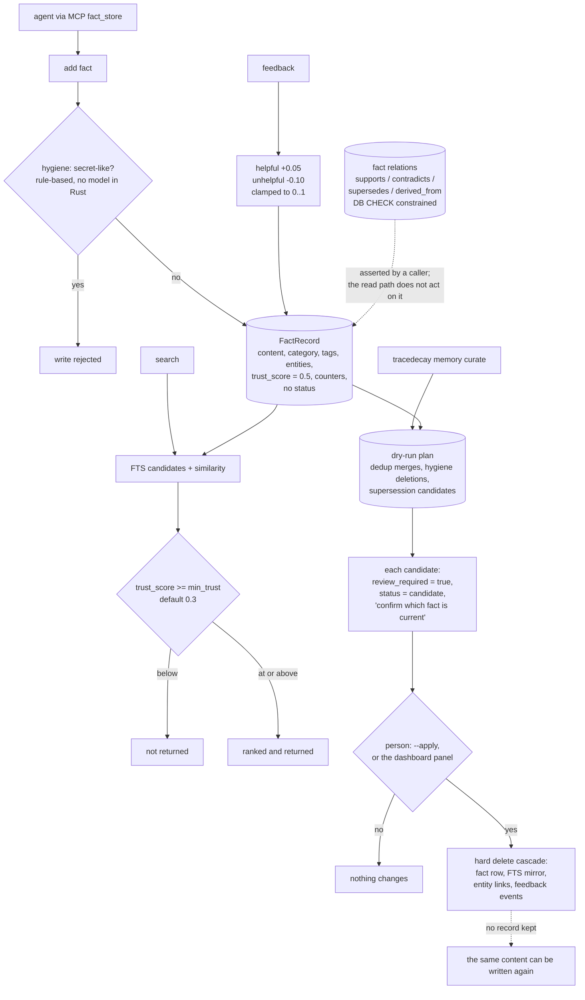

## 1. Executive Summary

TraceDecay is semantic code intelligence for coding agents: a Rust daemon that
builds a local graph of a repository so an agent can ask for symbols, callers
and impact radius instead of grepping, with a fact store attached for project
memory. MIT, version 0.0.74, 10,937 commits since 6 June 2026, 483,833 lines of
Rust across the binary and its crates against 125,958 lines of integration
tests. Storage is local libSQL, and the README's framing is "[f]ewer tokens •
fewer tool calls • local by default".

The memory subsystem is 5,755 lines in `tracedecay-runtime-core`, and two
things about it are worth reading.

**Hygiene still refuses without a model, and the review it used to feed is
gone.** The hygiene module states its own boundary and still does, at its new
address (`crates/tracedecay-session-memory/src/memory/hygiene.rs:1-8`): the rules
are "conservative, rule-based checks, no model is ever invoked from Rust", and
standalone TraceDecay only *rejects* secret-like writes and *proposes* hygiene
deletions, with any LLM review of those proposals living in the Hermes wrapper
layer and capabilities reporting `llm_curation: false` here. That half holds.

What no longer exists is the person the proposals went to. The string
`review_required` appears nowhere in the tree at this pin, and the CLI's
dry-run-until-`--apply` contract has been replaced by a tool:
`tracedecay_fact_store_curate` "[r]un[s] the daemon-owned automatic Memory
Curator", where "[c]allers may bound review size and confidence only; TraceDecay
derives the run, operations, validation, policy, and apply authority"
(`crates/tracedecay-mcp-catalog/src/definitions/memory.rs:17-24`). That authority
is a machine identity: `evaluate_curation_apply`
(`crates/tracedecay-policy/src/curation.rs:103-124`) checks the actor against a
fixed table in which the memory-curator subject must be
`"automation:memory-curator"`, and the runner builds it from string literals
(`crates/tracedecay-automation-runtime/src/automation/runner.rs:109-138`). The
policy binds the automation's own identity to the operation; it does not ask
anyone. Beside it, `fact_store_add`, `_update`, `_remove` and `_supersede` are
all ordinary MCP tools. **`human_review` is withdrawn on that basis**, and the
report keeps the description of what replaced it because the replacement is
carefully built — it simply is not a review.

**The eval suite is committed and attributed.** Twelve scenarios in
`eval/scenarios/` each declare a well-behaved path and a violation with a
stated expectation. `memory-no-pollution` is titled "Transient run noise must
not become facts" and guards that a throwaway token produces no fact "while
genuinely durable decisions still can" — a positive control and a must-not in
one file. Alongside it: secret rejection, supersede-without-duplicate, curation
conservatism, skip-local, and five ranking scenarios. Each carries an
`adapted_from` naming the upstream project, its licence and the exact commit —
`memory-no-pollution` credits [mnemon](../mnemon/) at `41a9612` under
Apache-2.0. Borrowing another project's eval and saying so at that grain is
rarer here than it should be.

What the store does not do is model belief. A `FactRecord` has no status. It
has a `trust_score` that starts at 0.5 and moves only on explicit feedback —
+0.05 helpful, −0.10 unhelpful, clamped to [0,1] — and retrieval filters below
a minimum that defaults to 0.3. That is a real filter on a stored value, which
is more than most confidence scores earn, but it is a continuous score rather
than a discrete state, so a fact that is simply *wrong* needs three unhelpful
votes before it stops being retrieved, and nothing distinguishes wrong from
unhelpful.

Supersession exists as vocabulary rather than as mechanism. `FactRelationKind`
has `Supports`, `Contradicts`, `Supersedes` and `DerivedFrom`, constrained at
the database with a `CHECK`, and the dashboard's curate API accepts them. But
the curation planner cannot emit a supersede *operation*: the changelog records
an "[a]rchive-semantics purge" whose stated policy is that "deleted memories
are permanently hard-deleted", with the archive and supersede ops removed
because "neither planner can produce them; the curate ops contract is
delete/merge only". So a supersedes edge is whatever a caller asserts, and the
read path ranks on trust and recency rather than on it.

That policy has a consequence the atlas asks about everywhere: a hard delete
leaves nothing behind. The cascade is careful and pinned by a store-level test
— the fact row, its FTS mirror row, its entity links and its feedback events —
but there is no record that a fact was rejected, so nothing stops the same
content arriving again tomorrow.

One mark: `negative_eval`.

## 2. Mental Model

A **fact** is content with a category, tags, extracted entities, a trust score
and counters. It has no state; its standing is a number.

**Feedback** is the only thing that moves trust: helpful `+0.05`, unhelpful
`−0.10`, clamped. A bucket label — low, medium, high — is derived for display
at 0.3 and 0.75.

A **relation** joins two facts as supports, contradicts, supersedes or
derived-from, with its own confidence and source.

**Curation** is a daemon-owned run: dedup merges, hygiene deletions and
supersession candidates, each with a confidence, accepted under a policy whose
apply authority is the curator's own machine actor id. A caller bounds how many
facts it reviews and at what confidence, and nothing else.

A **store** is a database file — one per project, plus a per-profile
`user-memory.db` for conversations with no project. Separation is by file, not
by predicate.

## 3. Architecture

| Area | Role |
| --- | --- |
| `crates/tracedecay-runtime-core/src/memory/` | The fact store: `store.rs`, `retrieval.rs`, `trust.rs`, `hygiene.rs`, `entities.rs`, `similarity.rs`, `diff.rs`, `types.rs`, `user.rs` |
| `crates/tracedecay-dashboard-api/` | `memory_curate.rs` and `memory_analysis.rs` — the proposal surface behind the dashboard |
| `crates/tracedecay-runtime-core/src/db/migrations.rs` | The schema, including the relation `CHECK` and the archive-column cleanup |
| `src/` | The CLI, daemon, MCP server, extraction workers, branch handling, automation |
| `eval/scenarios/`, `tests/memory_suite/` | Twelve attributed memory scenarios and the runner |
| `tests/` | Suites per area — memory, graph, storage, mcp, dashboard, agent, hermes |

## 4. Essential Implementation Paths

- `memory/types.rs:94-180` — the fact and the four relation kinds.
- `memory/trust.rs:1-45` — the deltas, the clamp and the buckets.
- `memory/retrieval.rs:40-120` — where `min_trust` gates the result set.
- `memory/hygiene.rs:1-9` — reject on write, propose on delete, no model here.
- `dashboard-api/memory_analysis.rs:600-636` — the supersession candidate.
- `db/migrations.rs:702` — the relation `CHECK` constraint.
- `src/cli/help.rs:466-479` — the dry-run contract in the user-facing text.

## 5. Memory Data Model

The counters are the interesting part: `retrieval_count`, `access_count`,
`helpful_count`, `unhelpful_count`, `last_retrieved_at`, `last_recalled_at`,
`last_feedback_at`. TraceDecay records not just that a fact exists but how it
has been used and judged, and the ranking scenarios in the eval suite
(`memory-ranking-retrieval-reinforcement`,
`memory-ranking-feedback-promotes`) test that those signals move results.

What is absent is any field that says a fact is retracted, pending or
superseded. The four relation kinds could carry that meaning and the read path
does not consult them.

## 6. Retrieval Mechanics

Full-text candidates are fetched at five times the limit, fused with a
similarity pass over a wider list, and filtered on category and `min_trust`.
The default floor of 0.3 means an untouched fact at 0.5 is visible and one
voted down three times is not.

## 7. Write Mechanics

The hygiene gate refuses secret-like content at the write, deterministically.
Facts arrive from the agent through `fact_store`, or as proposals from the
automation loop's memory curator, which is explicitly a review-and-validate
path rather than a direct writer.

## 8. Agent Integration

An MCP server whose code tools are the headline — `tracedecay_context`,
`tracedecay_search`, `tracedecay_callers`, `tracedecay_impact` — with
`fact_store` beside them, plus a CLI, a daemon and a local dashboard for the
graph, memory curation, session analytics and cost.

## 9. Reliability, Safety, and Trust

**Hard delete is a stated policy, not an oversight.** The changelog records the
archive feature being purged and the ops contract narrowed to delete and merge,
with permanent deletion as the policy. The cascade is pinned by a test, which
is the right way to hold a destructive path. What it costs is the tombstone:
nothing records that a fact was rejected, so the dedup and hygiene work is
repeatable rather than durable, and an agent that re-derives the same
transient noise writes it again.

**Trust is a score, not a state.** It filters, which matters, and it is moved
only by explicit feedback rather than by inference — a deliberate choice. But
three unhelpful votes are needed before a fact disappears, and a fact that is
flatly wrong is indistinguishable from one that was merely unhelpful.

**The model is kept out of the Rust path.** Hygiene is rule-based and says so,
capabilities report `llm_curation: false`, and the LLM review loop is a
separate, opt-in step (`--llm`, `--llm-ops`). For a system that deletes, that
separation is the conservative choice.

## 10. Tests, Evals, and Benchmarks

125,958 lines of integration tests across suites per area, plus benches and
benchmark data. The memory-eval suite is the part to copy: scenario files with
a schema version, a stable contract marker, a setup, a deterministic
well-behaved path, a violation with a declared expectation, and an
`adapted_from` line naming the upstream, its licence and its commit. The runner
asserts the well-behaved end state before running the violation, so a scenario
cannot pass by breaking both halves.

## 11. For Your Own Build

### Steal

- **Make every deletion a proposal with the review flag in the payload.**
  `"review_required": true` and `"status": "candidate"` travelling with the
  recommended op means no consumer can mistake the plan for a decision.
- **Say where the model is not.** "[N]o model is ever invoked from Rust", with
  a capability flag reporting it, tells an operator exactly what the core will
  do on its own.
- **Attribute an adapted eval to its source and commit.** Each scenario names
  the project it came from, the licence and the sha.
- **Pin the destructive cascade with a test.** If delete is permanent, the test
  that enumerates every table it must touch is the only thing standing between
  a policy and an orphan.

### Avoid

- **Hard-deleting without a record when a curator will run again.** The same
  content arrives tomorrow and the same work is done twice, with no memory that
  a person already said no.
- **Declaring relation kinds the read path ignores.** `supersedes` is in the
  type, the parser and the database CHECK; nothing in retrieval consults it.

### Fit

Reach for this if you want a local code-intelligence graph with a modest fact
store attached, and you value a curator that never acts alone. Look elsewhere
if you need rejected memories to stay rejected, or a read path that knows a
fact has been superseded.

## 12. Open Questions

- Should the read path act on a `supersedes` relation, or should the kind be
  removed from the vocabulary until it does?
- With hard delete as policy, is a rejection record — content hash and reason,
  no payload — compatible with the intent, so that curation does not re-propose
  what a person already declined?
- The trust floor treats wrong and unhelpful alike. Is a separate negative
  signal planned?

## Appendix: File Index

| Path | What to read it for |
| --- | --- |
| `crates/tracedecay-runtime-core/src/memory/types.rs` | The fact and relation model |
| `.../memory/trust.rs` | The bounded score and its deltas |
| `.../memory/retrieval.rs` | The trust floor on the read path |
| `.../memory/hygiene.rs` | What the core will and will not do alone |
| `crates/tracedecay-dashboard-api/src/memory_analysis.rs` | Supersession as a review-required candidate |
| `crates/tracedecay-runtime-core/src/db/migrations.rs` | The relation CHECK and the archive purge |
| `eval/scenarios/` | Twelve attributed memory scenarios |
| `tests/memory_suite/memory_eval_test.rs` | The runner and its two-phase assertion |

## History

**2026-09-19** — re-pinned to [`9e2f7beda863be76daef39e69f291e68379d0a2e`](https://github.com/ScriptedAlchemy/tracedecay/commit/9e2f7beda863be76daef39e69f291e68379d0a2e), a very large range — the compare reports 6,597 commits and truncates its file list at 300, so the read was scoped deliberately to the curation and fact-store path rather than re-derived across the tree. **`human_review` is withdrawn; `negative_eval` stands alone.** This one is upstream drift rather than a correction. The mark rested on two quotations and neither survives: `review_required` appears nowhere in the tree, and the CLI's *"Curation defaults to a dry-run preview; nothing is deleted without `--apply`"* has been replaced by `tracedecay_fact_store_curate`, a tool that runs *"the daemon-owned automatic Memory Curator"* where *"[c]allers may bound review size and confidence only; TraceDecay derives the run, operations, validation, policy, and apply authority."* That authority is a machine identity — `evaluate_curation_apply` checks the actor against a fixed table requiring `"automation:memory-curator"` for this subject, and the runner constructs it from string literals — so the policy binds the automation's own identity rather than asking a person. `fact_store_add`, `_update`, `_remove` and `_supersede` are ordinary MCP tools beside it. The half that held is the hygiene boundary: the module moved to `crates/tracedecay-session-memory/src/memory/hygiene.rs` and still states that no model is ever invoked from Rust and that standalone TraceDecay only rejects and proposes. Screened again first; nothing installed, built or run, and no Rust toolchain was used.

**2026-09-16** — [`61ca3b08987be59acf01b0f1ec124ca78ea2fea8`](https://github.com/ScriptedAlchemy/tracedecay/commit/61ca3b08987be59acf01b0f1ec124ca78ea2fea8) — first reading, at a commit dated 15 September 2026, scoped to the memory subsystem rather than the code graph. Screened before opening, from a shallow clone: sixty-eight files, three auto-run surfaces (a `.githooks/` directory, a `.gitmodules` and an MCP server manifest), nine build-time execution points, three unpinned surfaces, forty-nine dependency files inside the cooldown, and `AGENTS.md` and `CLAUDE.md` read as data. The `codegraph` submodule was not fetched. Nothing was installed, built or run.
