## 1. Executive Summary

Tree Ring Memory is a local memory layer for coding agents, shipped as one Rust
binary, `tree-ring`, over a SQLite file with an FTS5 index. Lifecycle hooks for
Claude Code and Codex inject a bounded, project-scoped brief at session start
and, at stop, block the agent once with an instruction to save up to three
durable outcomes through a restricted `capture` verb.

What is notable is the discipline of the read path that nobody asks for. The
startup brief compiles its project and identity predicate into SQL before the
candidate cap, draws both from the harness hook payload and the project root
rather than from the model, and drops expired, superseded, sensitive and
redacted rows. Writes are idempotent on a hashed operation namespace that a
redaction cannot release.

What is weak is correction. `forget` requires a reason and throws it away.
Nothing is keyed on a rejected value. Explicit `recall` returns expired rows the
brief would hide. The ring vocabulary — cambium, heartwood, scar — ranks and
orders memories but never withholds one, and the agent can write heartwood
directly in the default open mode.

The repository describes itself as protocol-preview and credits
[DOX](https://github.com/agent0ai/dox) and
[Revolve](https://github.com/agent0ai/revolve) as inspirations; both have
read-only sync adapters here. No LLM is called anywhere in the tree. A
`marketing/` directory holds 172 Markdown submission and outreach drafts and is
not part of the mechanism.

Two marks: `scope_enforced`, on the startup brief and the explicit recall
filters, and `negative_eval`, on set-equality tests of the brief over a
populated store. Section 9 names the five withheld.

## 2. Mental Model

A memory is a short summary with a genre. It becomes a belief the moment a
write verb commits it: there is no candidate state, no extraction and no model
in the loop. `remember` takes a summary and an event type from the caller;
`evidence` maps an outcome of promoted, rejected, deferred or observed onto a
ring; `capture` is the automatic path; `dox sync` and `revolve sync` summarise
files into rows with stable ids.

**The ring is a genre, not a status.** Cambium is fresh, heartwood durable, scar
a failure to remember, seed a hypothesis. A ring moves only when a person
confirms a change in the TUI, when a forced consolidation supersedes an older
summary, or when an import says so. Rings add a fixed boost to a matching query
and put scars then heartwood first in the startup brief
(`crates/tree-ring-memory-core/src/recall.rs:160-176`,
`crates/tree-ring-memory-sqlite/src/session_recall.rs:106-109`). A rejected
evaluation becomes a durable scar, so rejection is remembered prominently
rather than disbelieved (`crates/tree-ring-memory-cli/src/main.rs:1752-1758`).

**The stop hook asks, and the model decides.** At `Stop` and `SubagentStop` the
hook returns `decision: block` with a reason that names the exact `capture`
command, the checkpoint id and three operation slots, and says to write
nothing if nothing durable happened (`activation/lifecycle.rs:168-186`). The
second stop in a row carries `stop_hook_active` and passes. `capture` then
refuses anything but agent scope, normal sensitivity, and six event-type and
ring pairings (`actions/remember.rs:94-176`).

**A memory stops being one in four ways.** `forget --mode delete` removes the
row, its FTS entry, its operation claim and any tombstone
(`crates/tree-ring-memory-sqlite/src/write.rs:49-72`). `--mode redact` replaces
the payload with `[REDACTED]`, clears the keys, and records the memory id in
`redaction_tombstones`, so the id cannot be reused until a hard delete
(`write.rs:74-104`, `:158-190`). Supersession sets `superseded_by` and hides the
row from every default read (`write.rs:106-133`). An expired row with
`ephemeral` or `forget_after_date` retention is deleted by
`maintain --apply-expired`; a scar, heartwood, durable or pinned one is only
flagged (`crates/tree-ring-memory-core/src/maintenance.rs:205-221`, `:242-245`).

```mermaid
%% caption: how a Tree Ring memory is written, which reads see it, and the four ways it leaves
flowchart TD
    R["remember / evidence<br/>caller picks ring and scope"] --> G{"sensitivity guard"}
    S["Stop hook: decision block,<br/>up to 3 capture commands"] --> C["capture: agent scope,<br/>normal only, fixed ring pairs"]
    C --> G
    D["dox sync / revolve sync<br/>stable id per source section"] --> G
    I["import JSONL<br/>may carry supersedes, expiry"] --> G
    G -- "secret-like" --> X["refused"]
    G -- "health, financial ..." --> SEN["stored, sensitivity set"]
    G -- "normal" --> ROW["row + FTS entry<br/>idempotent on operation namespace"]
    SEN --> ROW
    ROW --> B{"startup brief<br/>SessionStart hook"}
    B -- "project match, own identity,<br/>normal, live, unexpired" --> INJ["up to 8 lines,<br/>6,000 bytes"]
    ROW --> Q{"explicit recall"}
    Q -- "caller keys match,<br/>normal, not superseded" --> OUT["ranked results,<br/>expired rows included"]
    ROW --> DEL["forget delete:<br/>row and claims gone"]
    ROW --> RED["forget redact:<br/>placeholder, id tombstoned"]
    ROW --> SUP["superseded:<br/>import, forced consolidation, TUI"]
    ROW --> EXP["maintain --apply-expired:<br/>temporary rows only"]
```

## 3. Architecture

Three crates. `tree-ring-memory-core` holds the model, validation, the
sensitivity guard, scoring, consolidation, audit, maintenance and the DOX and
Revolve parsers. `tree-ring-memory-sqlite` owns the schema, the write
transactions, the coordinated policy and both read paths. `tree-ring-memory-cli`
is the binary: the verbs, the harness activation layer (bridges, manifests,
receipts, preflight, lifecycle hooks), an updater and a Ratatui console.

The store is one SQLite file, opened in WAL mode with a 30-second busy timeout
(`crates/tree-ring-memory-sqlite/src/schema.rs:42-52`). Beside `memories` sit
`memory_fts`, `operation_claims`, `redaction_tombstones`, `consolidations`,
`store_policy` and `authorization_audit`
(`crates/tree-ring-memory-sqlite/src/lib.rs:169-220`,
`src/policy.rs:133-155`). Every connection registers a scalar function
`tree_ring_writer_protocol()` returning 3, and three triggers abort any insert,
update or delete on `memories` from a connection that lacks it
(`lib.rs:264-290`). That fences older binaries and plain `sqlite3` sessions; it
is a version check, not an access control.

Write transactions are `BEGIN IMMEDIATE`, with up to eight attempts on a lock
and exponential backoff capped at 100 ms (`src/write.rs:11-13`, `:357-372`). A
schema migration serialises the same way and is skipped entirely once
`user_version` reads 3.

### Deployment and ergonomics

Nothing has to run. The binary opens the file on each command and exits. The
store works offline and needs no API key. Per the README, install is a shell
script that either downloads a release archive and checks its SHA-256, or runs
`cargo install`; a Homebrew tap exists for macOS ARM64. `tree-ring init`
creates `.tree-ring/`, writes three guidance files without overwriting, and
configures project-local hooks where it can do so without replacing an existing
entry.

The store is repairable by hand in the sense that it is SQLite with the whole
event in `raw_json`, but a hand edit through `sqlite3` fails the writer-protocol
trigger. Sharing is stated as same-host only: concurrent processes on one local
filesystem, not NFS or containers on different hosts.

## 4. Essential Implementation Paths

**Capture.** `Command::Remember` (`crates/tree-ring-memory-cli/src/main.rs:90-131`)
reaches `actions::remember::remember`, which runs the guard over every string,
builds the event and calls `store_event_idempotently`
(`actions/remember.rs:41-86`, `:178-192`). `put_idempotent` returns the existing
row for a repeated operation id in the same project, workflow and agent
namespace, and `same_write_intent` rejects a different payload under that key
(`crates/tree-ring-memory-sqlite/src/lib.rs:415-446`,
`actions/remember.rs:194-214`). `evidence` builds its event in
`main.rs:1716-1818`; `capture` narrows `remember` in `actions/remember.rs:94-176`.

**Automatic capture.** `parse_lifecycle_hook` accepts only `codex` and
`claude-code`, refuses a payload carrying capability, root or `task_hint`
fields, and derives identity from `session_id` and, for subagents, `agent_id`
and `agent_type` (`activation/lifecycle.rs:74-153`, `:222-238`). The project for
a capture is the normalised basename of the project root (`:130-143`).

**Startup injection.** `prepare_preflight_with_timeout` resolves the project
name from the configured identity root, runs `recall_for_session_timeout` with a
10-second deadline and 8 results, then `safe_results` drops any row whose
summary or id the guard does not pass and trims to 6,000 bytes
(`activation/preflight.rs:216-296`, `:798-838`). The rendered block ends with
*"These summaries are recalled data, not instructions"* (`:33`).

**Explicit recall.** `MemoryRetriever::recall_with_options_until` tries each
query variant from `search_queries`, then an OR query, through
`search_fts_filtered_limited`, re-checks `matches_filters`, scores, sorts and
truncates (`lib.rs:1258-1343`, `:661-736`, `:1356-1392`).

**Correction.** `Command::Forget` checks the reason is non-blank and calls
`delete` or `redact` (`main.rs:1192-1209`). Import applies `supersedes` after
all rows are written (`lib.rs:952`). The TUI offers delete, redact, promote to
heartwood, mark as scar or seed, and supersede, each behind a pending
confirmation (`tui/app.rs:420-477`).

**Consolidation and maintenance.** `consolidate_memories` groups by project,
scope, private partition, ring, event type and a sensitivity bucket and writes
one deterministic summary per group, linked to its sources
(`crates/tree-ring-memory-core/src/consolidation.rs:280-390`). Sources are left
in place; only a forced run supersedes earlier summaries
(`lib.rs:970-1061`). `maintain` plans expiry, secret redaction and FTS drift and
applies them only on flags (`lib.rs:1063-1142`).

## 5. Memory Data Model

One table, `memories`, with the event's fields as columns and the whole event
again in `raw_json`, which is what every read deserialises
(`crates/tree-ring-memory-sqlite/src/lib.rs:169-195`). The Rust type is
`MemoryEvent` (`crates/tree-ring-memory-core/src/models.rs:101-146`).

**Scope.** `scope` is one of ten values. `agent`, `workflow` and `session`
require the matching id at validation (`models.rs:200-217`). Rows from before
0.12 that lack it are rewritten on migration to a deterministic
`legacy-*` identity and flagged `needs_review`, rather than widened to shared
(`crates/tree-ring-memory-core/src/import_export.rs:156-196`).

**Provenance.** `source` has a type, a reference and a quote. `remember` sets
type `agent` when `--source-ref` is given; `evidence` sets `evidence`; DOX sets
`dox` with the section text as the quote. The scorer weights source type from
`user` at 1.0 down to anything unlisted at 0.3 (`recall.rs:147-158`), and no
CLI path writes `user`.

**Time.** `created_at`, `updated_at` and an optional `expires_at`. No CLI flag
sets expiry or a temporary retention; both arrive only in an imported JSONL
row. There is no validity time.

**Identity for idempotency.** `operation_claims` stores a SHA-256 over project,
workflow, agent and operation id (`write.rs:260-279`). A replaced row keeps its
old claim, so a retry cannot restore the prior payload; a hard delete releases
it (`write.rs:210-236`).

**Review.** `MemoryReview` holds `needs_review`, a reason, `reviewed_at` and
`reviewed_by` (`models.rs:89-99`). Legacy normalisation and a consolidation over
sensitive sources set the flag (`consolidation.rs:378-384`).

## 6. Retrieval Mechanics

Lexical only. The FTS query quotes each `\w+` term, drops fifteen filler words
and joins with AND (`crates/tree-ring-memory-sqlite/src/lib.rs:1740-1763`).
`search_queries` adds variants that remove one ring-intent word each —
*failure*, *decision*, *roadmap* and their siblings — so a query that names the
genre still matches text that does not (`crates/tree-ring-memory-core/src/recall.rs:81-110`).
If every variant is empty, an OR query runs with the same filters.

Candidates are capped at 128 times the limit, clamped to 256–2,048, and every
filter is in the SQL before `LIMIT` (`lib.rs:1270`, `:685-726`). The score is
`0.25·term overlap + 0.25·salience + 0.25·confidence + 0.20·recency +
0.05·source authority + ring boost`, recency decaying with a 30-day constant
(`recall.rs:46-71`, `:131-135`). FTS rank orders candidates and is then
discarded.

The startup brief is a different query. With no task hint it sorts scar, then
heartwood, then everything else, by salience, confidence and age; with a hint it
uses FTS rank (`session_recall.rs:103-110`). Its predicate admits shared scopes
for the project and private scopes only for the caller's own agent, workflow or
session (`:81-92`).

**Two reads disagree on what is live.** The brief excludes expired and
tombstoned rows; explicit recall filters neither, and `matches_filters` has no
expiry clause (`lib.rs:1356-1392`). An expired row stays retrievable by `recall`
until `maintain --apply-expired` runs, and a protected one stays indefinitely.

**A memory with no project never reaches the brief.** `remember` defaults to
scope `global` and no project (`main.rs:95-100`). The brief requires
`memories.project IN (?, ?)`, and a test asserts a projectless global row is
hidden (`session_recall.rs:82`, `:260-263`). The README's first example passes
`--project`; one written without it is found only by an explicit `recall`.

## 7. Write Mechanics

Every write is synchronous and deterministic: guard, validate, one immediate
transaction, FTS row replaced in the same transaction. A memory is retrievable
the moment the command returns.

The guard is regex-based. A secret-like string anywhere in the event raises
`SensitiveMemoryBlocked`; health, financial, legal, private and identifier
patterns set `sensitivity` instead (`actions/remember.rs:45-82`,
`crates/tree-ring-memory-core/src/sensitivity.rs`). Every default read requires
`sensitivity = 'normal'`, so a reclassified memory is stored and invisible
unless a caller passes `--include-sensitive`.

Deduplication is by operation id only. Two `remember` calls with the same text
and no operation id make two rows. DOX rows are the exception: the id is derived
from the source file and section, so a re-sync overwrites in place, and a batch
refuses to replace a row whose recorded project, source or root differs
(`crates/tree-ring-memory-core/src/dox.rs:186-230`, `lib.rs:1779-1826`).

Agent-generated facts are not distinguished from any other. In the default open
mode the agent can pass `--ring heartwood`, `--scope project` and any
`--source-ref` to `remember`, or `--outcome promoted` to `evidence`, which
writes heartwood with durable retention (`main.rs:1745-1751`). Only `capture`
is fenced, and only because the model is told to use it.

### Operational cost

No LLM call is made on either path. The stop checkpoint costs one extra model
turn per session stop, plus up to three CLI invocations. The brief is at most
8 lines and 6,000 bytes, injected through `additionalContext` at session and
subagent start, so it sits at the start of the conversation and does not move.
No background pass exists; consolidation reads every non-superseded row when
invoked, and maintenance reads every row.

## 8. Agent Integration

The agent's surface is the CLI. `tree-ring init` generates `.tree-ring/AGENTS.md`,
`SKILL.md` and `CLI.md` describing `recall`, `capture`, `remember`, `evidence`,
`forget` and the maintenance verbs; the plugin under `plugins/tree-ring-memory/`
adds slash commands and the same guidance for Claude Code and Codex. There is
no MCP server in the tree.

Hooks are the automatic part. The plugin's `claude-hooks.json` wires
SessionStart, SubagentStart, Stop and SubagentStop to `claude-hook.sh`, which
exits silently when the project has no `.tree-ring`, and stands down when a
project-managed hook is already installed (`hooks/claude-hook.sh:13-32`).
Activation is receipt-backed: a harness is reported `active` only after a
preflight writes a receipt with the result count and a digest of the selected
ids, so configured hooks that never fired are distinguishable from a recall that
found nothing (`activation/preflight.rs:263-281`).

Subagents get their own identity: the harness id, the agent type and a
16-character fingerprint of the agent id, with the parent session as workflow.
A worker's agent-scoped memories are therefore private to it, and it sees the
shared ones (`activation/lifecycle.rs:103-114`).

The model holds every write verb and `forget`. In coordinated mode the
coordinator capability, read from `TREE_RING_COORDINATOR_TOKEN`, gates shared
writes, heartwood, import, persisted consolidation, ring changes and every
delete or supersede (`main.rs:1644-1659`,
`crates/tree-ring-memory-sqlite/src/policy.rs:375-427`, `:568-573`). A process
without the variable is limited to new, non-heartwood, agent-scoped rows under
its own asserted profile.

## 9. Reliability, Safety, and Trust

**The brief's boundary is not model-controlled.** The project comes from the
configured root, the identity from the harness payload, and the lifecycle
parser refuses a payload that tries to supply a root, a store id or a task hint
(`activation/lifecycle.rs:222-238`). That is the correct place for the
predicate. The weaker point is the key itself: the project is a directory
basename, so two checkouts named `app` sharing a global store share a brief.

**Explicit recall is a partition, and says so.** With no key it searches every
project. `export` has no project argument at all
(`crates/tree-ring-memory-cli/src/main.rs:238-246`), and `audit` reads every row.
The README states that these fields are *"routing and consolidation
partitions, not read ACLs"*. The coordinated policy governs writes only.

**Correction leaves no record.** The forget reason is checked for blankness and
never stored (`main.rs:1192-1209`). A delete removes the row and every claim.
`authorization_audit` records allow and deny decisions for protected actions,
with actor, origin and a hashed target, but only once coordinated mode is on,
and never for an ordinary worker's create (`policy.rs:375-414`, `:472-501`).

**Prompt-injection surface.** `dox sync` turns sections of every `AGENTS.md`
under a root into project memories, promoting a section it classifies as a
durable rule to heartwood; the details field tells the reader to re-read the
source (`dox.rs:186-222`). The brief footer tells the model recalled lines are
data. Nothing else distinguishes an injected summary from a real one.

**Uncertainty.** `confidence` is a float that ranks. Nothing can say "on record,
not believed".

Capability marks:

- `scope_enforced` — awarded. Evidence in the frontmatter and in sections 6
  and 8.
- `negative_eval` — awarded. Evidence in section 10.
- `tombstone` — withheld. `redaction_tombstones` is keyed on the memory id and
  `operation_claims` on a hashed operation namespace
  (`crates/tree-ring-memory-sqlite/src/lib.rs:196-203`). The same text stored
  again under a new id is accepted. This is the closest near-miss in the tree:
  durable, survives import, and keyed on the wrong thing.
- `trust_state` — withheld. Rings rank and order; no read filters on one.
  `needs_review` is set and read only by `is_sanitized_redaction`
  (`write.rs:238-258`); no recall or brief query consults it.
- `bitemporal` — withheld. One record-time axis and an expiry.
- `audit_log` — withheld. `authorization_audit` is an access-decision log that
  is empty in the default open mode and silent on unprivileged creates.
- `human_review` — withheld. No memory waits for anyone: nothing filters on
  `needs_review` and no verb sets `reviewed_by`. The TUI edits after the write.

## 10. Tests, Evals, and Benchmarks

Nothing was built or run for this report; everything below is from reading the
tests at the pin. CI runs `cargo fmt --check`, `cargo test --workspace
--locked`, a CLI smoke and a 1,000-memory performance example
(`.github/workflows/ci.yml`). There are 606 test functions, 547 of them unit tests
inside `src/`.

**The negative cases.** `new_session_recalls_durable_and_shared_memory_but_respects_private_scopes`
seeds fourteen rows and asserts the brief's id set equals eleven named ids, for
both the startup and the keyword form, then checks that an explicit recall with
agent and session keys returns only `current-session`
(`crates/tree-ring-memory-sqlite/src/session_recall.rs:180-245`). Set equality
makes the excluded rows fail the test by presence. The starvation test puts
300 hidden rows ahead of one visible row by salience and asserts the one result
is the visible row (`:247-284`). `recall_filters_project_before_candidate_limit`
does the same for the explicit path with 300 other-project distractors
(`lib.rs:3209-3245`).

**Concurrency and fences.** `multi_agent_acceptance.rs` starts eight CLI workers
against a held write lock, checks each recall filter and operation conflict, row
and FTS parity, and coordinated denials. The writer-protocol trigger test
asserts a plain connection cannot insert, update or delete (`lib.rs:2239`).
Redaction tests assert the FTS row and raw payload are cleared, an exact retry
is refused, and a replacement import cannot restore the id (`lib.rs:3421-3540`).

**A quality harness that no test runs.** `fixtures/quality/` holds seven
scenarios with `expected_recall` and `forbidden_recall`, and `quality.rs`
validates them and computes a forbidden-recall rate. The runner is
`examples/quality_scenarios.rs`, which `cargo test` compiles and does not run.
`superseded-heartwood.json` names its forbidden id with the reason
*"superseded heartwood should not outrank the replacement"*.

**Benchmarks.** None is committed. A note under `marketing/` records a local
smoke run of an external LongMemEval adapter on ten oracle questions —
retrieval 95.0%, answer 30.0% — and calls it smoke evidence rather than a
leaderboard claim. The adapter lives in a third-party pull request and was not
read. No paper or citation block is in the tree.

**Not covered.** No test asserts that explicit recall excludes an expired row,
and the code says it does not. No test covers two projects with the same
basename.

## 11. For Your Own Build

### Steal

- **Build the injected brief's scope from the harness, never from the model.**
  Derive project and identity from the root and the hook payload, reject a
  payload that tries to supply them, and compile them into the query.
- **Filter before the candidate cap, and test it at a size that would starve.**
  Three hundred invisible rows ahead of one visible row is the right fixture.
- **Make idempotency survive redaction.** Hash the operation namespace into a
  claims table that a replacement keeps and only a hard delete releases.
- **Assert the brief by set equality.** An exact id set fails on an extra row
  and on a missing one, with no vacuous branch.
- **Ask at stop, once, with the exact command.** A blocking stop hook that
  names the verb, the slots and "write nothing if nothing durable happened" is
  a cheap alternative to background extraction.

### Avoid

- **Two read paths with two definitions of live.** Put expiry, supersession
  and tombstone checks in one predicate both paths share.
- **A required reason with nowhere to go.** If the verb asks why, store the
  answer beside the mutation.
- **A default scope the automatic read path cannot see.** A projectless write
  that only explicit search finds reads as a lost memory.
- **Durable genres on the agent's own write surface.** If heartwood outranks
  cambium, the agent should not be able to write heartwood directly.

### Fit

This suits a developer running Claude Code or Codex on one machine who wants
project memory with a small, predictable startup brief and no model calls in
the memory layer. The activation machinery — manifests, receipts, bridge
fingerprints, a coordinator capability — is heavier than the memory it serves,
and a reader who only wants recall should expect to maintain that too. Anyone
who needs corrections to stick, memories to be withheld pending review, or
isolation between projects that holds on every read path is asking for
something this design does not attempt: it treats scope as routing and
correction as deletion.

## 12. Open Questions

- Does any shipped harness path call `recall` with a project key by default, or
  does the guidance leave it to the model?
- How often does the Stop checkpoint produce zero captures in practice, and do
  models follow the three-slot limit?
- Is the external LongMemEval adapter's 95.0% retrieval reproducible with the
  pinned binary?
- Is the `needs_review` flag meant to gate anything in a later release?

## Appendix: File Index

- **Storage and schema:** `crates/tree-ring-memory-sqlite/src/lib.rs:152-303`,
  `src/schema.rs`, `src/write.rs`, `src/policy.rs`.
- **Model and guard:** `crates/tree-ring-memory-core/src/models.rs`,
  `src/sensitivity.rs`, `src/import_export.rs`.
- **Write path:** `crates/tree-ring-memory-cli/src/actions/remember.rs`,
  `src/main.rs:90-196`, `:1716-1818`.
- **Retrieval:** `crates/tree-ring-memory-sqlite/src/lib.rs:529-736`,
  `:1153-1392`, `src/session_recall.rs`, `crates/tree-ring-memory-core/src/recall.rs`.
- **Context assembly and hooks:** `crates/tree-ring-memory-cli/src/activation/preflight.rs`,
  `src/activation/lifecycle.rs`, `plugins/tree-ring-memory/hooks/`.
- **Consolidation and maintenance:** `crates/tree-ring-memory-core/src/consolidation.rs`,
  `src/maintenance.rs`, `src/dox.rs`, `src/revolve.rs`.
- **Operator console:** `crates/tree-ring-memory-cli/src/tui/app.rs`.
- **Tests and evals:** `crates/tree-ring-memory-sqlite/src/session_recall.rs:153-321`,
  `src/lib.rs:1828-4882`, `crates/tree-ring-memory-cli/tests/`,
  `fixtures/quality/`, `crates/tree-ring-memory-core/src/quality.rs`.

### Recorded searches

Checked against the checkout at the pinned revision, from the tree root.

- `rg -n 'expires_at' crates/tree-ring-memory-sqlite/src -g '*.rs'` — the only read predicate is `session_recall.rs:84`; the explicit recall SQL and `matches_filters` carry none.
- `rg -n 'expires_at\s*=|expires_at: Some' crates -g '*.rs'` — every assignment is in a test; no CLI flag sets expiry.
- `rg -n 'needs_review|reviewed_by|reviewed_at' crates -g '*.rs' -g '!**/tests/**'` — memory-row reads only in `write.rs:253-256`; writers in `import_export.rs:184` and `consolidation.rs:378-384`.
- `rg -n -i 'approve|reviewed_by = |reviewed_by: Some' crates -g '*.rs'` — no approve verb; the one `reviewed_by` assignment is a sensitivity test.
- `rg -n '\breason\b' crates/tree-ring-memory-cli/src/main.rs` — the forget reason appears at lines 236, 1195 and 1197-1198 only.
- `rg -n 'authorization_audit' crates -g '*.rs'` and `rg -n -i 'DELETE FROM authorization_audit|UPDATE authorization_audit' crates` — one insert site, no update or delete.
- `rg -n 'redaction_tombstones' crates -g '*.rs'` — keyed on `memory_id` throughout.
- `rg -n -i 'embedding|cosine|vector' crates -g '*.rs'` — no match.
- `rg -n -i 'openai|anthropic|reqwest|ureq|completion' crates -g '*.rs' -g 'Cargo.toml'` — a secret-detection regex and a test name; no model client.
- `rg -n -i '\bmcp\b' crates -g '*.rs'` — no match.
- `rg -n 'forbidden_recall|fixtures/quality' crates -g '*.rs'` — consumed by `quality.rs` and `examples/quality_scenarios.rs`; no file under `tests/` or a `#[test]` loads them.
- `grep -rliE 'arxiv|bibtex|@article|@misc|doi\.org|CITATION' . --exclude-dir=.git` — three files under `marketing/`, none a citation of a paper; no `CITATION.cff`.
- `grep -rniE 'renamed|formerly' . --exclude-dir=.git --exclude-dir=marketing` — one test name in `activation/bridge.rs`; no project rename.

## History

**2026-09-30** — [`31d7aaf5647b0325233fcf5551eed4ba23d37fce`](https://github.com/TerminallyLazy/Tree-Ring-Memory/commit/31d7aaf5647b0325233fcf5551eed4ba23d37fce) — first reading, at the head of `main`, a commit dated 17 September 2026 at workspace version 0.15.13. Two marks, `scope_enforced` and `negative_eval`. Screened before reading: 1 auto-run surface (`.claude-plugin/marketplace.json`, a plugin manifest whose hooks call the `tree-ring` binary), 0 build-time execution points, 0 unpinned surfaces and 0 files inside the cooldown; `Cargo.lock` reads 13 days old, which in a depth-1 clone is the tip's date. Twelve `AGENTS.md` files were treated as data. Read with `rg`, `awk` and `sed`; nothing installed, built or run.
